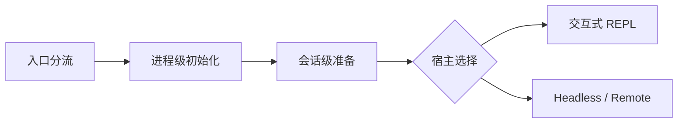
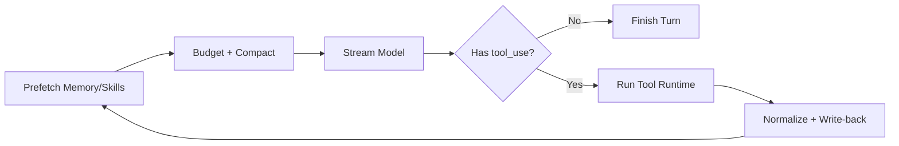
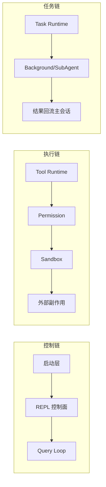

# Claude Code 源码拆解：从启动到多 Agent 扩展层

> Prompt: 白色纯背景，黑色线条，火柴人角色，Excalidraw 手绘风，手写感文字（类似 Virgil 字体），极简信息图，留白充足，无渐变无阴影，无3D，无彩色，仅黑白，构图干净，线条粗细一致，16:9。主题：Claude Code 源码拆解总览。画一个火柴人站在巨大“Agent Runtime”结构图前，结构分成启动层、REPL、Query Loop、Tool Runtime、Permission、Task、多 Agent、扩展层，标题写“从启动到多 Agent 扩展层”。

> 转载说明：本文为转载整理稿，原文链接为 [https://mp.weixin.qq.com/s/VHVZV0rrCxYkbrxjuQzIAQ](https://mp.weixin.qq.com/s/VHVZV0rrCxYkbrxjuQzIAQ)。著作权归原作者与原发布平台所有。本稿仅用于技术学习与交流。
## 导读


> 来源：[Claude Code 源码拆解：从启动到多 Agent 扩展层](https://mp.weixin.qq.com/s/VHVZV0rrCxYkbrxjuQzIAQ)

## 目录

- [1. 入口与启动链路：别急着拉起全世界](#1-入口与启动链路别急着拉起全世界)
- [2. REPL / UI Orchestration：UI 不是传话筒](#2-repl--ui-orchestrationui-不是传话筒)
- [3. Query Loop / QueryEngine：把单轮对话升级成状态机](#3-query-loop--queryengine把单轮对话升级成状态机)
- [4. Tool Runtime：把野生工具变成系统调用](#4-tool-runtime把野生工具变成系统调用)
- [5. Permission System：不是弹个框就完事了](#5-permission-system不是弹个框就完事了)
- [6. Task / 多 Agent / 后台执行](#6-task--多-agent--后台执行)
- [7. MCP / Skills / Plugins 扩展层](#7-mcp--skills--plugins-扩展层)
- [8. 总结与总架构：把复杂度放在对的位置上](#8-总结与总架构把复杂度放在对的位置上)


文章内容基于作者个人技术实践与独立思考，旨在分享经验，仅代表个人观点。

这篇文章我只做一件事：把 Claude Code 里真正扛复杂度的那几层拆开讲清楚，不绕弯。

- 它到底怎么设计
- 为什么要这样设计
- 这样设计的价值是什么
- 我们做自己的 Agent 时，哪些最值得吸收
所以这里不做目录导览，也不搞“带你读源码”。源码只是证据，重点是把 Claude Code 背后的系统判断讲透。

我们先把问题摆在桌面上。

这两年大家都在写 Agent，但其实所有人都知道一个尴尬事实：Demo 阶段看起来势如破竹，一旦加到三五个工具、几种运行模式、几类权限规则之后，系统就开始肉眼可见地变形。主循环越来越脏，工具一多就互相污染，后台任务和前台会话互相打架，扩展一接进来就满地特判。模型能力当然重要，但真正决定一个 Agent 能不能长期活下去的，往往不是模型，而是围着模型搭起来的运行时。

Claude Code 值得拆，不是因为它“功能很多”，而是因为它很像一套已经真正在承接复杂度的 Agent 系统。对我们内部做 Agent 平台、研发工具链、Vibe Coding 产品的人来说，它的价值不只是竞品分析，而是一个现成的参照物：哪些复杂度应该前置，哪些复杂度应该制度化，哪些复杂度必须通过架构收敛，而不能继续靠 prompt 和人肉兜着。

换句话说，我更关心的不是“它功能有多少”，而是 **“为什么很多 Agent 一复杂就散架，而它还能稳住”**。

## 1. 入口与启动链路：别急着拉起全世界

> 本项目对应实现（nano-claude）：
> - [CLI Design](../posts/cli-design.md)
> - [Session Storage](../posts/session-design.md)
> - [Nano Claude（总体定位）](../posts/introduction.md)

很多系统的入口都是一个越来越胖的 main，恨不得一上来就把全世界都拉起来。Claude Code 在这里反而很克制，它先做了一次非常关键的判断：先分流，再装配，最后才进入会话。

### 先说痛点

一个成熟 Agent 往往同时要支持本地交互、headless、SDK、remote、后台 session、会话恢复。如果启动层不先把模式、边界、权限和上下文装配清楚，后面每个宿主都会偷偷长出自己的运行语义，最终系统会裂成几套。

从源码看，启动大致分三段：




> Prompt: 白色纯背景，黑色线条，火柴人角色，Excalidraw 手绘风，手写感文字（类似 Virgil 字体），极简信息图，留白充足，无渐变无阴影，无3D，无彩色，仅黑白，构图干净，线条粗细一致，16:9。主题：启动三段式。左到右三段箭头：入口分流 -> 进程初始化 -> 会话准备。每段旁边一个火柴人动作和小标签（模式判断、环境就绪、会话制度），底部写“先分流，再装配，最后入会话”。
第一段是入口分流。系统不急着把整个运行时拉起来，而是先判断这次到底是什么启动：本地交互、无界面运行、远程接入、后台会话管理，还是一些极简 fast path。很多路径都用动态加载，这说明 Claude Code 从一开始就在控制启动成本，而不是先把全世界加载进来再说。

第二段是进程级初始化。这一层处理的是运行环境：配置、telemetry、远程设置、清理回调、一些全局设施。这里重要的不是具体初始化了什么，而是它刻意不碰当前会话语义。也就是说，它回答的是“进程能不能跑”，不是“这一轮 Agent 该怎么跑”。

第三段才是会话级准备。这里开始确定当前工作目录、会话身份、工具面、权限模式、扩展能力、系统约束、恢复方式等信息，最后再决定由交互式宿主承载，还是由无界面引擎承载。

这中间还有一个很容易被忽略、但对架构非常关键的细节：Claude Code 把“进程状态”和“交互状态”分开了。像 cwd、projectRoot、sessionId、telemetry、token/cost 计数这类更接近基础设施的东西，会沉在 bootstrap/state 一类全局状态里；而 tasks、MCP clients、plugin 状态、permission context、界面选择状态这类更接近控制面的东西，才进入 AppState。这个分层让它不会把 React state 误当成整套 runtime 的唯一真相，也不会把所有状态都做成不可控的全局变量。

### Claude Code 是怎么处理的

它没有把启动做成“一个大 main 把所有东西拉起来”，而是显式拆成三段：入口分流、进程初始化、会话准备。这个顺序看起来普通，真正厉害的地方在于它把几个本来最容易搅在一起的问题拆开了：启动模式是什么、运行环境是否就绪、当前会话制度是什么、最后由谁承载会话。

这里最值得注意的是两个判断：

- 先装配共享 session/runtime 语义，再选择交互式或 headless 这种宿主
- 先区分进程状态和交互状态，再决定哪些进 AppState，哪些留在更底层状态里
### 这套做法为什么有效

这样做的直接收益是，无界面运行、交互式运行、远程运行、后台运行可以共享同一套核心 runtime，而不是各自长一套逻辑。权限、工具、系统约束、扩展能力这些会影响执行边界的东西，也都能在第一轮请求前定型，后面的主循环不需要一边跑一边猜。

它还有一个更深的好处：系统复杂度被前置了。很多项目把模式判断、权限边界、宿主差异拖到运行中解决，最后主循环会越来越脏。Claude Code 则把这类复杂度尽量压到启动层，所以运行时主链路反而更纯。

代价也不是没有。这样做要求你在系统早期就想清楚“什么是宿主，什么是会话，什么是 runtime 公共语义”。如果团队还没有这些抽象意识，入口层会看起来有点重。但这类“重”是值得的，因为它换来的不是形式感，而是后续模式扩展时不分裂。

### 落到我们自己怎么做

**最值得吸收的不是“复杂入口”，而是次序感。凡是会影响执行边界的东西，尽量都在第一轮请求前定型。**

如果你们现在还在单一交互模式阶段，不用照搬 Claude Code 那么重的入口层，但至少先把三件事拆开：启动模式、会话制度、宿主承载。如果你们已经同时有命令行、接口调用、后台任务、远程运行之类多种方式，这一层就不能再含糊了，否则很快就会长成几套彼此不兼容的 Agent。一个很实用的动作是，先把“启动时必须定型的边界”列成一张清单。

启动层做得好不好，平时不显山不露水；但系统一旦开始长模式、长宿主、长入口，它往往就是最先决定架构寿命的那一层。

## 2. REPL / UI Orchestration：UI 不是传话筒

> 本项目对应实现（nano-claude）：
> - [CLI Design](../posts/cli-design.md)
> - [Buddy Pet System（交互反馈）](../posts/buddy-design.md)
> - [Session Storage](../posts/session-design.md)

很多团队把聊天 UI 理解成“显示消息的壳”，大模型吐什么，前端就渲染什么。Claude Code 明显不是。它的 REPL 本质上更像一个运行时控制台。

### 先说痛点

一旦 Agent 不只是聊天，而开始执行工具、弹权限、跑后台任务、动态接入扩展，UI 面对的就不再是“如何显示回复”，而是“如何把一个复杂 runtime 变成用户可操作、可理解、可干预的系统”。如果这一层做不好，所有关键状态都会变成黑箱。

REPL 的启动层很薄，说明它不是启动中心，而是一个被装配好的宿主。真正值得注意的是，REPL 会把输入、消息流、权限确认、任务、MCP 连接、插件状态、远程状态、后台 session 等东西全部编排到同一个控制面里。

这意味着 Claude Code 的 UI 不是“模型回复展示器”，而是 runtime 的 orchestrator。一次用户输入进入 REPL 后，不是直接丢给模型，而是先经历几件事：

- 判断是不是本地命令、快捷指令或其他无需进入主循环的路径
- 组装当前这一轮执行所需的上下文
- 合并本地工具、外部工具、插件能力形成当前能力面
- 准备系统约束、用户环境和运行环境信息
- 最后才进入 `query(...)`
也就是说，REPL 先把“这一轮在什么制度下运行”准备好，再把控制权交给推理循环。

更具体地说，REPL 真正负责的是“当前能力面”的汇总。它要把本地 tools、MCP tools、plugin commands、动态 skills、任务状态、权限确认队列、MCP 连接状态、remote session 信息汇在一起，然后在用户提交输入的那个瞬间，生成一个完整的 turn-scoped 执行上下文。这也是为什么 REPL 会显得很大: 它并不是一个 view component，而是在做控制面拼装。

另外一层很重要的设计是，REPL 消费的不是纯文本，而是一串带语义的事件流。assistant message、tool progress、compact boundary、pending permission、task notification、API error，这些事件都会在这里重新归并成用户能理解的会话视图。换句话说，REPL 既是 query 的入口，也是整套运行时事件的落点。

### Claude Code 是怎么处理的

Claude Code 没有把 REPL 做成薄薄的输入框加消息列表，而是让它负责两件大事：一是汇总当前能力面，二是归并当前事件流。能力面包括本地工具、外部工具、插件能力、任务状态、权限确认队列、远程会话信息；事件流包括助手消息、工具进度、待确认权限、任务通知、接口错误等。

所以 REPL 在 Claude Code 里既不是纯 view，也不是纯 controller，它更像 runtime 的操作台。用户每提交一次输入，REPL 都会先把当前 turn 的执行制度打包清楚，再交给 query loop；而 query loop 返回来的也不是原始文本，而是结构化运行时事件。

### 这套做法为什么有效

这样设计的最大好处是“可控”。用户不是只看到一句模型回复，而是能看到系统正在执行什么、为什么停下来、当前有哪些能力、后台有哪些任务。对于需要权限确认、长时执行、工具调用的 Agent 来说，这种可控感往往比多一点模型智商更重要。

它还带来一个容易被忽略的收益：UI 不再只是消费文本，而是在消费统一事件协议。这样 query、permission、tool runtime、task system 都可以通过结构化事件和 REPL 协作，而不是各自偷偷改 UI 状态。

代价是 REPL 会变大，而且很难像普通前端那样被“优雅地拆成很多小组件”。但这不是坏事，因为它本来就不是简单页面，而是控制面。Claude Code 在这里的判断很清楚：运行时编排复杂度应该集中，不应该伪装成很多无边界的小组件。

### 落到我们自己怎么做

如果你的产品还停留在单轮问答，聊天 UI 足够。但只要系统已经进入工具执行、权限确认、后台协作阶段，UI 就必须承担显式控制面的职责。

最容易学错的地方，是把“控制面”理解成堆更多面板。真正该学的是显式化运行时关键状态：当前能力面、当前任务、当前权限状态、当前失败与恢复状态。不是界面越花越强，而是用户越能理解系统在做什么，越容易信任并驾驭它。一个很好的起点，就是先把后台任务和权限状态显式展示出来。

对复杂 Agent 来说，UI 做得好，用户会感觉“系统在配合我工作”；做得不好，就只剩一个偶尔成功的黑箱。

## 3. Query Loop / QueryEngine：把单轮对话升级成状态机

> 本项目对应实现（nano-claude）：
> - [Context 设计（预算与压缩）](../posts/context-design.md)
> - [Memory System](../posts/memory-design.md)
> - [Session Storage](../posts/session-design.md)

如果说前两层是在搭台子，那么真正决定 Claude Code 像不像成熟 Agent runtime 的，就是 Query Loop。很多团队的 Agent 到了这里才开始真正分出高下。

### 先说痛点

只要 Agent 开始连续运行，系统就会立刻碰到几个硬问题：长上下文会劣化，工具调用会打断推理，模型输出会截断，失败后要不要恢复，工具结果怎样回灌下一轮。这些问题如果还被当成“模型调用细节”，系统就会在复杂场景里迅速失稳。

先分清两个对象。

- 无界面会话引擎不是主循环本身，它更像会话外壳
- 真正的一次 agent turn 内核在 Query Loop 本体
无界面会话引擎做的事情很有代表性：先拉系统上下文，处理输入和命令，把用户消息先写进会话记录，暴露当前能力面，然后才把处理后的消息流交给主循环。这说明 Claude Code 不把 query 理解成“收到输入就打一次模型”，而是理解成“会话侧状态都准备好之后的最后一步”。

真正的核心在 Query Loop 本体。从状态组织方式就能看出来，这里维护的不是一次性请求参数，而是一组跨迭代状态：消息集、这一轮的执行上下文、上下文压缩状态、输出恢复计数、轮数预算、任务预算等。它明显不是 helper，而是状态机。

如果把源码里的状态骨架压到最小，会更容易看出它为什么已经是 runtime，而不是“模型调用封装”：

```ts
state = {
  messages,
  toolUseContext,
  maxOutputTokensOverride,
  autoCompactTracking,
  maxOutputTokensRecoveryCount,
  hasAttemptedReactiveCompact,
  turnCount,
  pendingToolUseSummary,
  transition,
}
```
这段骨架非常关键。一个普通 orchestrator 不会长期维护 autoCompactTracking、maxOutputTokensRecoveryCount、pendingToolUseSummary 这类对象；一旦这些状态都进入主循环，说明系统已经承认一件事：一次 agent turn 会被压缩、恢复、工具回灌、预算和中断反复改写。

从运行顺序看，Claude Code 对 query 的理解也非常“系统化”。它会先处理记忆预取、能力发现、上下文预算、各种压缩与折叠，再进入流式采样；一旦模型发出工具调用，runtime 就接管执行，把结果整理成结构化反馈、附加材料和后续提示，再重新送回下一轮推理。这说明在 Claude Code 里，模型不是一次性求值器，而是运行链路中的一个节点。

### Claude Code 是怎么处理的

它把 query 拆成两层：会话外壳负责会话记录、输入处理、能力面暴露、无界面与接口场景；真正的 Query Loop 负责运行状态机，维护跨迭代状态，并在“推理 -> 工具 -> 回灌 -> 再推理”的闭环里反复推进。

这层最关键的设计，不是 while loop 本身，而是运行状态被显式保存了。Claude Code 很清楚，一次 agent turn 不是线性的 API 调用，而是一段会被工具、compact、fallback、token recovery、task budget 不断影响的运行。只有把这些状态升格成 runtime 对象，系统才不会变成一堆零散特判。

它大致在做下面这件事：




> Prompt: 白色纯背景，黑色线条，火柴人角色，Excalidraw 手绘风，手写感文字（类似 Virgil 字体），极简信息图，留白充足，无渐变无阴影，无3D，无彩色，仅黑白，构图干净，线条粗细一致，16:9。主题：Query Loop 运行闭环。画环形流程：prefetch -> budget/compact -> stream model -> tool use -> write-back -> next turn。旁边标注关键词：autoCompact、recovery、fallback、tool result 回灌。
Claude Code 在这一层最强的地方，是它把“一次请求”理解成一段运行，而不是一问一答。于是很多本该是运行时问题的东西，都被提升成了 runtime 机制：

- 长上下文治理，不靠提示词硬扛，而是有 snip、microcompact、collapse、autocompact
- 失败恢复，不是报错就停，而是有 reactive compact、max output recovery、fallback model
- 工具结果，不是结束，而是下一轮输入
- memory 和 skill discovery，不是同步堵塞，而是尽量藏到流式和工具执行的空隙里
再把主循环压成最小骨架，大致就是这样：

```ts
while (true) {
  prefetchMemoryAndSkills()
  messagesForQuery = applyBudget(messages)
  messagesForQuery = snipAndCompact(messagesForQuery)
  assistant = streamModel(messagesForQuery)
  if (!assistant.hasToolUse) return finishTurn(assistant)
  toolResult = runToolUse(assistant.toolUse, toolUseContext)
  state.messages = writeBack(messages, assistant, toolResult)
}
```
这和很多团队熟悉的“拿历史消息调一次模型，拿到结果就结束”不是一个量级。Claude Code 真正高明的点，不是 while loop 本身，而是它把 prefetch、budget、compact、tool result write-back 这些原来容易散落在边边角角的逻辑，全部拉回了主循环正中央。

如果把一次 query -> tool -> write-back 的真实控制权转移再压成一条缩略链，大概是这样：

```ts
messagesForQuery = getMessagesAfterCompactBoundary(messages)
assistantMessages = streamModel(normalize(messagesForQuery))
toolUseBlocks = collectToolUses(assistantMessages)
toolUpdates = runTools(toolUseBlocks, assistantMessages, canUseTool, toolUseContext)
toolResults = normalizeToolResults(toolUpdates)
state.messages = [...messages, ...assistantMessages, ...toolResults]
continue
```
这条链的价值非常大，因为它说明 Claude Code 不是“工具执行完了，往日志里打一行结果”这么简单。工具结果会被重新标准化成 user message，再回灌到主消息流里，下一轮模型看到的就是这段经过协议化处理后的历史。很多 Agent 系统会在这里偷懒，结果就是工具执行链和会话链是两张皮，后面越跑越乱。

为什么这种设计好？因为只要 Agent 进入多工具、多轮续跑、长上下文、失败恢复阶段，最脆弱的地方就不再是 prompt，而是运行链路本身。Claude Code 在这里做对的，不是某个具体 recovery 细节，而是认知升级了：上下文治理、失败恢复、工具回灌，都是 runtime 课题。

这里还有一个很有工程味的细节：Claude Code 会尽量把耗时工作藏在空隙里。memory prefetch 和 skill discovery 不是每轮都老老实实同步阻塞，而是尽量叠在流式输出和工具执行期间。这种设计看起来只是 latency 优化，实际上传达的是更成熟的运行时观念: Agent 的体验不只由模型速度决定，还由你能不能把未来大概率要用到的信息提前安排好。

### 这套做法为什么有效

这样设计的好处，是它把最容易失控的复杂度都集中到了正确的位置上。上下文治理不再依赖提示词技巧，失败恢复不再散落在调用点，工具结果也不再只是 stdout，而是下一轮推理的结构化输入。系统因此能够持续运行，而不是每碰到一次工具调用或上下文膨胀就“断气”。

另一个很大的好处是，坏路径也被设计了。Claude Code 对 prompt-too-long、max_output_tokens、fallback model、继续续跑这些问题都给了 runtime 路径，而不是默认“失败就算了”。这对真实 Agent 系统特别重要，因为真实世界里坏路径往往比 happy path 更决定用户体验。

代价是 Query Loop 会很像一台小型运行机，而不是一个简单函数。它天然更难读、更难测，也更需要团队具备状态机心智。但这是成熟 Agent 不可回避的代价，因为连续运行本来就比单轮问答复杂得多。

### 落到我们自己怎么做

**最值得学的不是每一个 compact/recovery 细节，而是判断升级：当系统开始“连续运行”时，query loop 就不该只是模型调用封装，而应该被单独当成一层系统设计。**

如果你们还在单轮问答阶段，不必马上复制完整恢复体系；但一旦进入多工具、多轮续跑、长上下文阶段，就要尽快把上下文治理、失败恢复、工具回灌提升为 runtime 机制。别学错的地方，是把一堆恢复分支硬塞进业务代码；真正该复制的是“把失败路径也当主路径设计”的态度。团队动作上，可以先把“上下文治理”和“失败恢复”从 prompt 层挪到运行时层。

Query Loop 这一层真正值钱的，不是它写得有多复杂，而是它承认了一件很现实的事：连续运行从来不是一次模型调用能解决的问题。

## 4. Tool Runtime：把野生工具变成系统调用

> 本项目对应实现（nano-claude）：
> - [Tool 实现设计](../posts/tool-design.md)
> - [CLI Design（命令系统）](../posts/cli-design.md)

很多 Agent 项目在工具层的默认心智是“给模型挂几个函数”。Claude Code 明显不是，它把工具层做成了一套受控执行协议。它不是在“接函数”，而是在设计“行动系统”。

### 先说痛点

工具一旦开始碰文件、命令、网络和副作用，问题就不再是“模型会不会调用函数”，而是“这次行动是否合法、能否并发、如何上报进度、失败怎样表达、结果怎样重新喂给模型”。如果这些问题散落在每个工具里，系统很快就会失控。

从工具抽象和执行链的设计可以看出，Tool 在 Claude Code 里不是一个简单函数，而是一个带完整运行时语义的对象：有 schema、有输入校验、有权限关联、有并发安全声明、有中断语义、有结果回填规则。

真正的工具执行主链路，做的不是“找到函数然后调一下”，而是四段式执行：

解析真实 tool，做兜底
schema 校验和调用前准备
进入 permission 决策，再真正执行
把结果归一化成结构化反馈、进度和附加材料
这说明 Claude Code 对工具层的理解很成熟：工具不是模型的外挂函数，而是 runtime 的受治理执行单元。

这层还有一个容易被低估的点：Claude Code 把“未知工具”“参数不合法”“权限拒绝”“执行报错”都尽量归一化成协议内结果，而不是让整个回合直接炸掉。也就是说，它不是把工具调用看成业务函数成功或失败，而是看成 runtime 必须兜住的一类外部动作。只有这样，主循环才能在坏路径上继续工作，而不是每次失败都变成整轮崩溃。

### Claude Code 是怎么处理的

Claude Code 的做法是把 Tool 定义成带完整运行时语义的对象，而不是简单函数签名。schema、输入校验、permission、并发安全、中断语义、结果回填规则，都进入 Tool 抽象本身；而统一执行链负责解析、校验、授权、执行、归一化。

这意味着工具层里的很多复杂度都被收敛了。开发者新增工具时，不需要重新思考权限弹窗怎么打、结果格式怎么写、是否能并发、进度怎么报，因为这些都已经有统一制度。Claude Code 其实是在把“工具调用”从一段业务代码，升级成一种受控 syscall。

这一层还有两个非常关键的工程判断。

第一个判断是并发策略不由模型决定，而由工具语义决定。工具调度层不会简单 Promise.all，而是根据 isConcurrencySafe 区分哪些工具可并发，哪些必须串行。因为只读工具和有副作用的工具，本来就不应该用同一套并发策略。

第二个判断是流式工具执行必须被认真建模。Claude Code 允许模型还在流式输出时，工具就先开始执行，但又通过状态跟踪、结果缓冲、取消管理来保证正确性。它优化的不是“更快一点”这么简单，而是“边生成边行动”时系统如何不乱。

Tool Runtime 这一层为什么值钱？因为它把原本会散落在每个工具实现里的横切问题都收敛了：

参数校验
权限检查
并发治理
进度上报
错误归一化
结果回填
这会直接带来一个非常现实的好处：工具变多时，复杂度不会爆在调用点，而是沉到统一 runtime 里。

从工程管理角度看，这一层还有一个额外收益：新工具作者不需要每次重新发明权限、并发、错误语义和结果格式。对团队协作来说，这意味着工具生态可以增长，而不会每新增一个工具就多一套风格和风险模型。

如果把这层再落到更微观一点的骨架上，差别会更直观。很多团队的 Tool 抽象其实停在这里：

type Tool = (input: unknown) => Promise<string>
Claude Code 更接近的是这样：

interface Tool {
  name: string
  inputSchema: Schema
  canRunInParallel: boolean
  validate(input): ValidationResult
  execute(input, context): AsyncIterable<ToolEvent>
  toModelResult(output): StructuredResult
}
真正的差别不在 TypeScript 写法，而在系统观。前一种只是“模型能调一个函数”，后一种才是“运行时知道这个动作该怎么被约束、观测、并发和回灌”。

如果继续贴近 Claude Code 的真实执行链，它更像下面这样：

async function* runToolUse(toolUse, assistantMessage, canUseTool, ctx) {
  const tool = findToolByName(ctx.options.tools, toolUse.name) ?? findAlias(toolUse.name)
  if (!tool) return toolResultError(toolUse.id, 'No such tool available')
  if (ctx.abortController.signal.aborted) return cancelled(toolUse.id)
  yield* streamedCheckPermissionsAndCallTool(
    tool,
    toolUse.id,
    toolUse.input,
    ctx,
    canUseTool,
  )
}
再看它喂给工具的上下文，也能感受到这层为什么不是“函数调用器”：

type ToolUseContext = {
  options: { tools; commands; mcpClients; refreshTools? }
  abortController: AbortController
  messages: Message[]
  setAppState(...)
  setInProgressToolUseIDs(...)
  setResponseLength(...)
}
这两个骨架合在一起，意思就很明确了：Claude Code 的 Tool Runtime 不是“找到一个函数然后调一下”，而是“把一次外部行动放进统一协议里，再让主循环继续活下去”。

如果把 tool_use -> permission -> execution 再压成一条更贴近真实代码的缩略链，会更容易看清楚 Claude Code 在哪里真正比普通实现多做了一层：

parsedInput = tool.inputSchema.safeParse(input)
validatedInput = tool.validateInput?.(parsedInput.data)
hookResult = runPreToolUseHooks(tool, validatedInput)
permissionDecision = resolveHookPermissionDecision(
  hookResult,
  tool,
  validatedInput,
  canUseTool,
)
if (permissionDecision.behavior !== 'allow') return rejectAsToolResult()
result = tool.call(callInput, toolUseContext, canUseTool, assistantMessage)
mapped = tool.mapToolResultToToolResultBlockParam(result.data, toolUseID)
return createUserMessage({ content: [mapped], sourceToolAssistantUUID })
注意这条链里最关键的一刀：权限决策发生在 tool.call(...) 之前，但拒绝结果仍然会被包装成标准 tool_result 回到主循环。也就是说，Claude Code 连“被拒绝”这件事都纳入了统一协议，而不是让权限层和工具层各说各话。这种一致性对长时运行系统极其重要，因为主循环根本不需要知道这次是“执行成功”还是“权限拒绝”，它只需要知道“我收到了一份结构化结果，可以继续往下推理了”。

### 这套做法为什么有效

这样设计最大的好处，是工具数量增长时，复杂度不会爆在调用点，而是沉到统一 runtime 里。参数校验、权限、并发、错误归一化、结果回填这些横切问题，不再被每个工具重新发明一遍。系统因此既更稳，也更适合团队协作。

流式工具执行则让 Claude Code 进一步把“边生成边行动”做成了工程能力，而不是 demo 特效。模型还在说话时，工具已经开始干活，但最终结果仍能按正确顺序、正确语义回到主循环，这一点非常不容易。

代价是工具抽象会变厚，工具开发门槛会提高一点。早期产品如果只有两三个玩具工具，确实不值得立刻做成完整 runtime。但只要工具开始碰副作用，这种“厚”就是必要投资，而不是过度设计。

### 落到我们自己怎么做

**最值得借鉴的，不是“工具很多”，而是工具有制度。**

如果你们现在只有少量只读工具，可以先保持轻量；但一旦工具开始碰文件、命令、网络、副作用，就应该尽快建设统一 Tool Runtime。真正别照抄的是过度抽象本身，真正该学的是把横切复杂度沉到公共层，让新增工具不再重复制造新的风险模型。一个很务实的起点，是先把“校验、授权、结果格式”三件事统一起来。

把这一层放回我们内部语境里看，会更有体感。如果我们正在推动 Agent 平台化，或者在做更接近 Vibe Coding 的研发产品，Tool Runtime 其实就是“把自由发挥变成可交付动作”的那一层。它和 SDD 的关系也很近：Spec 负责约束目标，Tool Runtime 负责约束行动。前者告诉系统要交什么，后者决定系统可以怎样交、怎样稳地交。

工具层一旦制度化，Agent 才开始从“会调用能力”变成“能稳定执行动作”。

## 5. Permission System：不是弹个框就完事了

> 本项目对应实现（nano-claude）：
> - [Tool 实现设计（执行边界与工具治理）](../posts/tool-design.md)
> - [Context 设计（上下文与可见性边界）](../posts/context-design.md)
> - [Session Storage（会话侧状态管理）](../posts/session-design.md)

Claude Code 的权限系统值得研究，不是因为它更谨慎，而是因为它更像一条完整执行链，而不是一个确认框。很多系统把权限做成了 UX 组件，Claude Code 则把它做成了运行时机制。

### 先说痛点

Agent 的权限问题从来不只是“要不要弹个确认框”，而是四件事同时存在：逻辑上是否允许、自动化能否消化、用户何时必须参与、即使允许执行时进程边界到底被限制在哪。如果把这些问题揉成一个 yes/no，系统不是过度打断用户，就是安全形同虚设。

从权限模型、交互决策和 sandbox 的整体实现看，Claude Code 把权限拆成了几层：

规则层：匹配允许、拒绝、待确认，保留来源和理由
运行时判定层：classifier、hooks、coordinator 等机制尝试自动决策
交互层：真的需要用户参与时，再走确认
执行隔离层：把逻辑权限映射成真实的文件、网络、命令边界
这条链路最重要的地方，是它把两个常被混淆的问题分开了：

逻辑上允不允许
进程层面到底能做到什么
很多 Agent 系统只做前者，所以权限像提示框。也有些系统只做后者，所以沙箱像硬隔离。Claude Code 的成熟点在于，这两层是打通的。

交互式权限判定这一层很能体现这种心智。它不是简单判断“能不能用工具”，而是先拿一个完整决策：允许、拒绝还是待确认；如果需要确认，再尽量走自动决策链；只有自动机制兜不住，才真正打断用户。这说明 Claude Code 追求的不是“尽量多弹窗”，而是“尽量把权限问题消化在可解释的制度链里”。

这里还有两个很成熟的现实主义细节。第一，Claude Code 会对 auto mode 做危险能力裁剪，不是默认“自动模式就尽量多放行”，而是主动剔除过宽的 Bash、PowerShell、agent wildcard 等规则。第二，沙箱不是独立附属物，而是 permission 的落地点: 文件路径、网络域名、设置目录等真正执行边界，都会在这里被压实。前者解决“逻辑上别放太宽”，后者解决“即使放行了，进程也别飞出去”。

### Claude Code 是怎么处理的

它把 permission 拆成一条完整决策链：规则层先给出允许、拒绝或待确认，并保留决策理由与来源；运行时判定层再尽量用自动机制消化；只有真的兜不住，才进入交互层；而真正执行时，沙箱再把逻辑权限压成文件、网络、命令等现实边界。

这种拆法最重要的价值，是把逻辑授权和执行隔离分开了。前者回答“应不应该让模型做这件事”，后者回答“即使允许了，它在系统里究竟能做到什么”。Claude Code 既不把权限做成单纯 UX，也不把沙箱做成孤立安全层，而是让两者走在同一条路径上。

如果把它的权限决策对象压成最小骨架，大概是这样：

```ts
type PermissionDecision =
  | { behavior: 'allow'; updatedInput?; decisionReason? }
  | {
      behavior: 'ask'
      message: string
      suggestions?: PermissionUpdate[]
      blockedPath?: string
      pendingClassifierCheck?: PendingClassifierCheck
    }
  | { behavior: 'deny'; message: string; decisionReason: string }
```
这段骨架很能说明问题。很多团队的权限系统只有 boolean，最多再加一个“是否弹窗”；Claude Code 则把 decisionReason、suggestions、blockedPath、pendingClassifierCheck 都提升成正式字段。也就是说，权限不再只是“过不过”，而是“为什么过、卡在哪、下一步怎么处理、能不能先自动判一轮”。


> Prompt: 白色纯背景，黑色线条，火柴人角色，Excalidraw 手绘风，手写感文字（类似 Virgil 字体），极简信息图，留白充足，无渐变无阴影，无3D，无彩色，仅黑白，构图干净，线条粗细一致，16:9。主题：权限不是布尔值。画一个“Permission Decision”卡片，字段包括 allow/deny、decisionReason、suggestions、blockedPath、pendingCheck。火柴人用户与火柴人 Agent 中间有“可解释决策”桥梁。
为什么这种设计有价值？因为 AI Agent 的风险从来不只是“它做错事”，还包括“用户不知道它为什么能做这件事”。一旦 decision、reason、source、sandbox 都是显式对象，权限系统才会既安全，又可解释，也才能和 UI、query loop、task 系统自然协作。

### 这套做法为什么有效

这样设计的好处，不只是更安全，而是更可解释。用户知道为什么被允许、为什么被拒绝、为什么需要确认，系统内部也知道这次决策来自规则、模式、classifier 还是显式同意。只有这样，权限才会成为可调试、可审计、可优化的系统，而不是一堆历史特判。

Claude Code 对 auto mode 的处理也很值得学。它没有把自动化理解成“尽量少问用户”，而是理解成“在收紧危险能力后尽量自动”。这是一种很成熟的产品观，因为真正能让用户信任自动化的，不是它敢做更多，而是它在边界内做得更稳。

代价是权限系统会明显更复杂，需要规则模型、自动化判定、交互协作和沙箱一起工作。但这类复杂度无法省掉，因为真正的 Agent 权限本来就不是一个布尔值。

### 落到我们自己怎么做

**最值得学的，是把权限设计成可解释的执行链，而不是弹窗机制。**

不一定每个团队都要立刻上复杂 classifier，但至少应该尽快把“决策、理由、来源”建模出来，并把逻辑授权和执行隔离分开。别学错的地方，是不要把“更安全”理解成“多弹几次框”；真正成熟的权限系统，是让自动化、用户体验和风险控制走同一条链，而不是互相打架。团队动作上，先别急着优化弹窗，先把权限决策对象化。

权限系统真正成熟的标志，从来不是它拦得有多凶，而是它能不能把风险控制、自动化和可解释性同时放进一套机制里。

## 6. Task / 多 Agent / 后台执行

> 本项目对应实现（nano-claude）：
> - [Session Storage（长时会话与恢复）](../posts/session-design.md)
> - [Hermes Agent（多 Agent / 自学习对照）](../posts/hermes-design.md)
> - [TODO（任务化演进路线）](../posts/TODO.md)

### 多 Agent 的核心不是 prompt 分工

Claude Code 的多 Agent 设计很克制。它不是先搞 manager-agent、worker-agent 那套叙事，而是先定义了统一的任务抽象。这个顺序看起来朴素，其实比大多数“智能体分工图”都更有工程含量。

### 先说痛点

多 Agent 真正难的地方，从来不是 prompt 怎么分工，而是系统里一旦出现多个可持续执行的执行体，状态怎么管理、进度怎么观察、结果怎么回流、上下文怎么隔离、失败怎么恢复。如果没有统一执行抽象，多 Agent 只会是一堆黑盒同时跑。

从任务抽象和几个具体执行体的实现看，Claude Code 用 Task 统一表达了很多看起来不同的东西：

- 主会话后台化
- 本地 subagent
- in-process teammate
- remote agent
- 任务通知、状态、输出、恢复
这说明它对多 Agent 的理解不是“模型调模型”，而是“系统里出现了多个可持续执行的执行体”，所以先要有统一任务语义。

本地子 Agent 的实现很能说明问题。Claude Code 不是偷偷新开一轮 query 就算一个子 Agent，而是先把它注册成正式任务，再给它状态、进度、待处理消息、会话记录、前后台语义。换句话说，子 Agent 先是任务对象，才是智能体。

主会话后台化的实现进一步说明，连这件事都复用了同一套任务语义。这背后其实是一个很好的架构判断：前台和后台的差别，不在 agent 逻辑，而在调度和可见性。

另一个很值得注意的点是进程内协作者的上下文隔离。Claude Code 用异步上下文隔离机制处理每个执行体的独立上下文，避免多个 agent 并发时把身份、通知、权限、工具上下文串线。这类问题平时不显眼，但一旦多 Agent 真跑起来，往往是最早把系统搞坏的地方。

这层还有一个常被忽略、但特别重要的闭环: 任务不是跑完就结束，它的通知、待处理消息、会话记录输出、任务产物最终都会重新回到主会话。也就是说，Claude Code 的任务系统不是孤立作业系统，而是和主 Agent 推理回路打通的。这样多 Agent 才不是几个黑盒并排跑，而是能真正提高主系统的问题解决密度。

### Claude Code 是怎么处理的

Claude Code 的解法很朴素，但特别对：先统一定义任务抽象，再把主会话后台化、本地子 Agent、进程内协作者、远程执行体都映射进去。也就是说，它先统一执行语义，再谈执行形态。

这让多 Agent 从“智能 feature”变成了“任务系统的一个后端”。于是状态、通知、日志、恢复、前后台切换、结果回流这些关键能力都能复用，而不需要每多一种 agent 形态就重做一套基础设施。

如果把本地子 Agent 在代码里的任务状态压成最小骨架，会看到它根本不是一个 Promise<string>：

```ts
type LocalAgentTaskState = {
  agentId: string
  prompt: string
  progress?: AgentProgress
  error?: string
  result?: AgentToolResult
  messages?: Message[]
  isBackgrounded: boolean
  pendingMessages: string[]
  retain: boolean
  diskLoaded: boolean
  evictAfter?: number
}
```
这几个字段特别能说明 Claude Code 的取舍。pendingMessages 说明子 Agent 不是一次性调用，而是带邮箱的执行体；isBackgrounded 说明前后台切换是正式语义；retain、diskLoaded、evictAfter 说明系统已经开始认真处理“UI 是否还握着它、磁盘记录是否已回灌、什么时候该回收”这些长期运行才会出现的问题。

任务系统为什么重要？因为真正决定多 Agent 能不能落地的，从来不是 prompt 里怎么分工，而是：

- 生命周期怎么管
- 状态怎么观察
- 结果怎么回流
- 失败怎么恢复
- 多条执行链怎么不串
Claude Code 把这些先做了，于是多 Agent 不是“又一套系统”，而是 task system 的自然外延。

### 这套做法为什么有效

这样设计最大的好处，是多 Agent 不会把系统撕裂。不同执行体可以共享同一套生命周期、通知模型和回流协议，前台和后台的差别也被降成了调度与可见性差异，而不是两套世界观。

Claude Code 在这里真正成熟的地方，是它把最容易被忽略的工程问题先做了：上下文隔离、结果回流、失败恢复、可观察性。这些问题做不好，manager/worker 再漂亮也只是 demo。

代价是你必须接受一个事实：多 Agent 不是 prompt 工程，而是系统工程。它要求你先有任务状态、通知、会话记录、上下文隔离这些底座，否则“多 Agent”会很快反噬系统复杂度。

这里也可以用一个极小的骨架看出差别。很多“多 Agent”实现，本质上只是：

```ts
spawnAgent(prompt): Promise<string>
```
而更稳的任务抽象会长得更像：

```ts
interface Task {
  id: string
  status: 'pending' | 'running' | 'blocked' | 'done' | 'failed'
  progress: ProgressState
  output: StructuredOutput[]
  notifications: Notification[]
  cancel(): void
  resume(): void
}
```
前一种只是多开了一个智能体，后一种才是把“持续执行”变成系统里的正式对象。

### 落到我们自己怎么做

如果系统开始出现后台执行、子任务协作、远程执行，就先把统一任务抽象做对，再谈 fancy 的多 Agent 结构。

最容易踩的坑，是把多 Agent 理解成 prompt 分工问题。很多系统最后不是死在智能不够，而是死在没有状态、没有恢复、没有结果回流。**Claude Code 这一层最值得吸收的，不是“支持更多 agent”，而是先把任何可持续执行的事情都纳入统一执行体。**团队动作上，先把后台任务、子任务和远程执行统一到一张任务状态表上。

对我们内部来说，这一点尤其重要。无论是做多 Agent 研发助手，还是做更重的编程工作台，真正决定产品能不能进入团队协作链路的，从来不是“会不会分身”，而是“分出去之后还能不能被管理、被追踪、被恢复”。这也是为什么它和 SDD 不冲突，反而天然互补：Spec 定义任务目标，任务系统定义任务生命周期。

多 Agent 真正从 demo 走向系统，靠的从来不是 prompt 分工有多聪明，而是任务系统能不能把分出去的执行重新收回来。

## 7. MCP / Skills / Plugins 扩展层

> 本项目对应实现（nano-claude）：
> - [Skill System Design](../posts/skill-design.md)
> - [Context 设计（Skill/MCP 上下文管理）](../posts/context-design.md)
> - [Hermes Agent（生态与扩展视角）](../posts/hermes-design.md)

### 外部可以热闹，内部必须收敛

Claude Code 的扩展层真正厉害的地方，不是支持了很多扩展来源，而是它努力把所有外部能力都收敛进少数内部对象。平台做到后面，拼的往往不是接入得快不快，而是收敛得稳不稳。

### 先说痛点

Agent 一旦走向平台化，扩展来源一定会变多：外部协议、用户自定义能力、插件市场、内建能力包。真正危险的不是来源多，而是每多一种来源，主系统就多一套能力模型、权限模型和 UI 暴露方式，最后 special case 爆炸。

先看 MCP。Claude Code 不是把 MCP 原生对象直接塞进系统，而是尽量翻译成已有的运行时模型：MCP prompt 变成 Command，MCP tool 变成 Tool，MCP resource 进入资源或资源工具体系，必要时还会注入 auth tool。也就是说，MCP 接入的重点不是“连上服务器”，而是“把外部能力吸收到本地运行时模型里”。

Skills 这一层也不是简单 prompt snippet。它的声明信息可以覆盖描述、适用场景、允许使用的工具、模型偏好、推理力度、hooks、执行上下文、代理身份等维度。换句话说，这类能力单元在 Claude Code 里已经接近一种轻量能力声明，而不只是提示词片段。

Plugin 更进一步。Claude Code 的 plugin 不是只加几个命令，而是可以带能力单元、hooks、外部协议接入、语言服务、代理定义、输出风格、设置项。它更像能力组合包。与此同时，插件加载层处理的也不是简单目录扫描，而是一个小型平台分发问题：来源、校验、缓存、版本、策略、启停控制。

如果再往深一点看，会发现 Claude Code 在扩展层上坚持的是“动态能力面，稳定内部对象”。外部连接可以随时重连、启停、刷新能力列表；插件可以来自市场、会话级目录、内建包；能力单元也可以来自用户、项目、插件和外部来源。外部世界明明是动态而杂乱的，但内部仍然尽量收敛到少数对象上。这种收敛，才是平台继续长大时不崩的根本。

### Claude Code 是怎么处理的

Claude Code 的解法不是继续发明扩展类型，而是强迫各种来源进入统一内部对象。外部协议会被翻译成工具、命令、能力单元、资源；能力单元被做成轻量声明；插件被当成能力组合包；内建能力也尽量复用同一套平台心智。

这意味着它把“扩展性”定义成了一件很具体的事情：不是让系统认识更多外部格式，而是让系统始终只围绕少数内部抽象运转。外部再动态，内部都尽量稳定。

这一点在 skills 上尤其能从代码里看出来。它实际解析的不是一段 prompt 文本，而是一份能力声明：

```ts
type SkillDescriptor = {
  description: string
  allowedTools: string[]
  whenToUse?: string
  model?: Model
  effort?: Effort
  hooks?: Hooks
  executionContext?: 'fork'
  agent?: string
}
```
这段骨架很有说服力，因为它直接说明了一件事：Claude Code 里的 skill 不是“顺手塞一段提示词”，而是能约束工具权限、触发条件、执行上下文、模型偏好、推理力度，甚至决定是否 fork 执行。也正因为 skill 已经被提升成声明对象，它才能自然进入统一平台，而不是继续当野生 prompt 片段。

把这三层放在一起看，Claude Code 扩展架构最重要的判断就出来了：外部来源可以很多样，但内部对象必须尽量少。


> Prompt: 白色纯背景，黑色线条，火柴人角色，Excalidraw 手绘风，手写感文字（类似 Virgil 字体），极简信息图，留白充足，无渐变无阴影，无3D，无彩色，仅黑白，构图干净，线条粗细一致，16:9。主题：外部热闹，内部收敛。左侧多个来源 MCP/Skills/Plugins，右侧收敛成少数内部对象 Tool/Command/Resource/Task。中间漏斗结构，标题“Dynamic Sources, Stable Core Objects”。
这件事为什么值钱？因为扩展系统最容易失控的地方，不是扩展不够多，而是每多一种来源，主系统就多一套 special case。Claude Code 尽量避免了这一点，所以 UI、permission、query loop、task system 不需要为每种扩展源分别写一套逻辑。

### 这套做法为什么有效

这样设计的好处，是平台可以长大而不碎。UI、permission、query loop、task system 都只需要理解少数内部对象，不需要为每种扩展来源重写一套适配逻辑。越到后期，这种内部收敛越像护城河，因为它决定了系统还能不能继续演进。

另一个很大的收益，是动态能力面终于可控了。MCP 连接可以变化、plugin 可以启停、skills 可以来自很多地方，但这些变化对主系统来说仍然是可解释、可管理的，因为底层对象没有失控。

代价是接入新扩展时，前期翻译成本会更高。你不能偷懒把外部协议原样塞进来，而是要认真映射到内部对象上。但这是值得的，因为这一步正是在用接入成本换长期秩序。

### 落到我们自己怎么做

对想做 Agent 平台化的团队来说，这一层最值得学的不是“也去上更多扩展体系”，而是先吸收一句更底层的原则：**外部世界可以复杂，内部世界必须收敛**。

最容易学偏的地方，是先去堆更多扩展类型，而没有守住内部抽象数量。真正应该先做的是约束内部对象，再决定支持哪些外部来源。只有这样，扩展性才不是系统失控的开始，而是系统增长的方式。团队动作上，可以先画出“系统内部只允许存在的那几种能力对象”。

如果把这一层放回内部平台建设语境，它讨论的其实不是“要不要接更多插件”，而是“我们想把平台做成一个能力市场，还是继续让能力以脚本、提示词、私有 Hook 的形式野生增长”。Claude Code 给出的答案很明确：外部世界可以很热闹，但内部世界必须克制。对做 Vibe Coding 平台尤其如此，因为一旦能力供给开始爆发，没有内部收敛，平台很快就会从“灵活”变成“不可维护”。

扩展层真正高明的地方，不是让系统认识更多外部世界，而是让系统在面对更多外部世界时，内部仍然只说同一种语言。

## 8. 总结与总架构：把复杂度放在对的位置上

> 本项目对应实现（nano-claude）：
> - [Nano Claude（总览）](../posts/introduction.md)
> - [Nano Claude 博客系列索引](../posts/README.md)
> - [TODO（路线与优先级）](../posts/TODO.md)

把前面七层合起来看，Claude Code 真正强的不是某个单点功能，而是它对复杂度的安放位置非常清楚。它厉害的地方，从来不是某一层特别炫，而是每一层都很知道自己该承接什么。

### 核心问题

为什么很多 Agent 项目功能点不少，但一进入真实复杂场景就开始散架？因为复杂度没有被放到正确的位置：边界问题混进主循环，权限问题混进工具调用，多 Agent 问题混进 prompt，扩展问题直接渗透到系统内部。

启动层负责先定边界
REPL 负责把人和运行时接到一起
Query Loop 负责把一次请求变成连续运行
Tool Runtime 负责把行动制度化
Permission System 负责把允许与隔离打通
Task Runtime 负责把长时执行和多 Agent 纳入统一生命周期
扩展层负责让能力增长，但不让内部抽象失控
如果把这套设计再压缩一层，会发现 Claude Code 一直在做同一件事：把不稳定、概率化、容易失误的模型能力，装进一套稳定、可恢复、可解释、可扩展的工程运行时。它不是靠某个神奇 prompt 变强的，而是靠一层层 runtime 把真实复杂度接住了。

对程序员来说，这篇文章最值得带走的是 **“复杂度应该沉到哪里”**；对架构师来说，更重要的是另一层判断：Claude Code 并没有平均用力，它把边界问题交给启动层，把连续运行问题交给 query loop，把行动问题交给 tool runtime，把风险问题交给 permission，把并发问题交给 task，把增长问题交给扩展层。**正因为复杂度被放到了对的位置上，系统才没有被某一层压垮。**

### Claude Code 的总解法

Claude Code 的系统设计，本质上是在做复杂度分层。它没有试图用一个“大一统 Agent 核心”吃掉所有问题，而是把不同类型的真实复杂度安放到了不同模块：

会话边界问题交给启动层
人机协作问题交给 REPL 控制面
连续运行问题交给 Query Loop
行动协议问题交给 Tool Runtime
风险治理问题交给 Permission System
长时执行和并发问题交给 Task Runtime
平台增长问题交给扩展层
总架构可以压成下面这张图：


> Prompt: 白色纯背景，黑色线条，火柴人角色，Excalidraw 手绘风，手写感文字（类似 Virgil 字体），极简信息图，留白充足，无渐变无阴影，无3D，无彩色，仅黑白，构图干净，线条粗细一致，16:9。主题：Claude Code 七层架构。自上而下七层框图：启动层、REPL、Query Loop、Tool Runtime、Permission、Task Runtime、扩展层。右侧火柴人注释：每层只承接一种复杂度。
如果只看这张图，还容易把它理解成“七层堆叠”。Claude Code 真正更有价值的地方，其实是它把整套系统收敛成了三条主干链路：




> Prompt: 白色纯背景，黑色线条，火柴人角色，Excalidraw 手绘风，手写感文字（类似 Virgil 字体），极简信息图，留白充足，无渐变无阴影，无3D，无彩色，仅黑白，构图干净，线条粗细一致，16:9。主题：三条主干链路。并排三条泳道：控制链（启动->REPL->Query）、执行链（Tool->Permission->Sandbox->World）、任务链（Task->Background->SubAgent->回流）。底部总结：复杂度放在对的位置。
第一条是控制链。它负责回答“这一轮到底在什么制度下运行”。启动层先定边界，REPL 汇总能力面和会话状态，Query Loop 才开始真正推进一次连续运行。

第二条是执行链。它负责回答“模型一旦决定行动，系统如何把动作稳稳落到真实世界里”。工具不是直接调用，而是先进入 Tool Runtime，再穿过 Permission 和 sandbox，最后才触达文件、命令、网络这些外部副作用。

第三条是任务链。它负责回答“如果这件事不是一口气做完，而要持续运行、后台运行、分身执行，系统如何不乱”。Claude Code 把多 Agent 放在这条链上，而不是塞回 Query Loop 里，所以多 Agent 才没有把主会话撕裂。

这三条链路背后其实对应了三种完全不同的系统问题：

- 控制链解决的是“怎么想、怎么续跑”
- 执行链解决的是“怎么动、怎么受约束”
- 任务链解决的是“怎么并发、怎么持续、怎么回流”
扩展层则不是第四条孤立链路，而是给这三条主链持续注入能力。它既能改变当前能力面，也能提供新的执行单元和任务形态，但又不会把内部对象打散。

为什么这套总架构成立

这套架构成立，不是因为层数多，而是因为每一层都有明确职责，而且这些职责之间的边界相对稳定。Claude Code 不是让所有层都去碰模型，而是让模型只处在该处的位置上；也不是让所有问题都在 query loop 里解决，而是让 query loop 只负责连续运行，把别的复杂度交给别的层。

这就是为什么它虽然复杂，但不显得散。复杂度没有被平均撒到全系统，而是被有意识地集中管理。

如果再进一步总结，Claude Code 的总架构其实不是“一个大脑拖着一堆工具”，而是“一个控制面 + 一条受约束执行链 + 一套长期任务系统”。这和很多常见 Agent 实现差别很大。后者往往只有一个主循环，所有问题都往里面塞：权限塞进去、后台任务塞进去、扩展接入塞进去、失败恢复也塞进去。短期看实现快，长期看主循环会慢慢长成一团不可维护的运行泥球。

Claude Code 更值得借鉴的点就在这里：它没有追求“最少模块”，而是追求“每种复杂度只在一个地方爆炸”。上下文和续跑问题只在 Query Loop 爆炸，副作用和权限问题只在执行链爆炸，并发和后台问题只在任务链爆炸，平台增长问题只在扩展层爆炸。架构真正成熟的标志，从来不是没有复杂度，而是复杂度被放到了对的位置。

如果把一次真实请求穿透七层再压成 8 行，整个系统会更好记：

- 启动层先决定这次会话处在什么边界里运行。
- REPL 把当前输入、能力面、权限状态、任务状态打包成一个 turn。
- Query Loop 接手，开始做预算、压缩、预取和流式推理。
- 模型一旦发出 `tool_use`，控制权切到 Tool Runtime。
- Tool Runtime 先走 Permission Decision，再决定能不能真正执行。
- 执行过程中如果拉起子执行体，就进入 Task Runtime 管生命周期和回流。
- 扩展层把 MCP、skills、plugins 翻译成统一内部对象，供上面几层消费。
- 最终所有结果再回到 Query Loop 和 REPL，成为下一轮上下文和用户可见状态。
### 我们最后该带走什么

如果一定要把整篇文章再压缩成几句最值得带走的话，我会留下这 5 条：

- **先定义执行边界，再发起第一轮推理。**
- **当 Agent 进入连续运行阶段，query loop 就必须升级成 runtime。**
- **工具一旦开始碰副作用，工具层就必须制度化。**
- **权限系统的核心不是确认框，而是可解释的执行链。**
- **多 Agent 的前提不是 prompt 分工，而是统一任务抽象。**
Claude Code 真正值得借鉴的，不是它“做了很多层”，而是它知道每一层在承接哪一种真实复杂度。对做 AI Agent 的团队来说，这比抄任何单点功能都更有价值。

如果把这篇文章放回我们自己的研发语境，我更愿意把它理解成一句更直接的话：真正成熟的 Agent 系统，不是“模型更会做事”，而是“组织能把模型做事这件事，稳定地接进交付链路里”。这也是它为什么会和 SDD、研发工作流平台、Vibe Coding 这些话题自然汇合。前者给目标和边界，后者给运行和落地；只有两边都成立，Agent 才不只是 demo，而会变成团队能力。

说到底，Claude Code 最值得学的，不是哪段代码写得多花，而是它一直在回答同一个工程问题：**模型一旦真的开始做事，我们到底在哪里把复杂度接住。**

## Implementation Map

| 章节 | 设计文档（docs/posts） | 关键代码路径（src） |
|---|---|---|
| 1. 入口与启动链路 | [cli-design.md](../posts/cli-design.md), [session-design.md](../posts/session-design.md), [introduction.md](../posts/introduction.md) | `src/system_init.py`, `src/bootstrap_graph.py`, `src/cli/main.py`, `src/session_store.py` |
| 2. REPL / UI Orchestration | [cli-design.md](../posts/cli-design.md), [buddy-design.md](../posts/buddy-design.md), [session-design.md](../posts/session-design.md) | `src/cli/repl.py`, `src/interactiveHelpers.py`, `src/replLauncher.py`, `src/buddy/generator.py` |
| 3. Query Loop / QueryEngine | [context-design.md](../posts/context-design.md), [memory-design.md](../posts/memory-design.md), [session-design.md](../posts/session-design.md) | `src/query.py`, `src/engine/query_engine.py`, `src/context.py`, `src/prefetch.py`, `src/memory/dreamer.py` |
| 4. Tool Runtime | [tool-design.md](../posts/tool-design.md), [cli-design.md](../posts/cli-design.md) | `src/tools/bash.py`, `src/tools/read.py`, `src/tools/edit.py`, `src/tools/write.py`, `src/registry/execution_registry.py`, `src/registry/tools.py` |
| 5. Permission System | [tool-design.md](../posts/tool-design.md), [context-design.md](../posts/context-design.md), [session-design.md](../posts/session-design.md) | `src/permissions.py`, `src/tools/security.py`, `src/tools/bash.py`, `src/agent/settings.py` |
| 6. Task / 多 Agent / 后台执行 | [session-design.md](../posts/session-design.md), [hermes-design.md](../posts/hermes-design.md), [TODO.md](../posts/TODO.md) | `src/task.py`, `src/tasks.py`, `src/session_store.py`, `src/remote_runtime.py` |
| 7. MCP / Skills / Plugins 扩展层 | [skill-design.md](../posts/skill-design.md), [context-design.md](../posts/context-design.md), [hermes-design.md](../posts/hermes-design.md) | `src/registry/command_graph.py`, `src/registry/commands.py`, `src/registry/tool_pool.py`, `src/agent/settings.py` |
| 8. 总结与总架构 | [introduction.md](../posts/introduction.md), [README.md](../posts/README.md), [TODO.md](../posts/TODO.md) | `src/cli/main.py`, `src/query.py`, `src/engine/runtime.py`, `src/permissions.py`, `src/tasks.py` |

## References

- 原文（转载来源）：[Claude Code 源码拆解：从启动到多 Agent 扩展层](https://mp.weixin.qq.com/s/VHVZV0rrCxYkbrxjuQzIAQ)
- Anthropic Engineering: [Harness design for long-running application development](https://www.anthropic.com/engineering/harness-design-long-running-apps)
- OpenAI: [Harness engineering: leveraging Codex in an agent-first world](https://openai.com/index/harness-engineering/)
- OpenAI: [Unlocking the Codex harness: how we built the App Server](https://openai.com/index/unlocking-the-codex-harness/)


