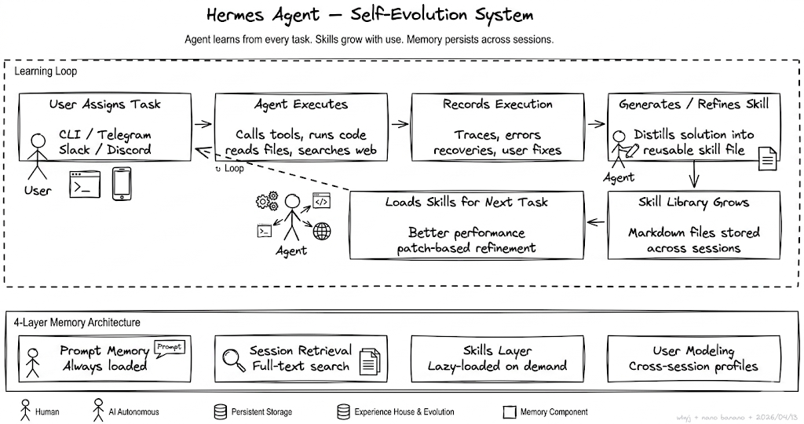

# Hermes Agent

> 单 Agent 自学习框架 — 从工具到搭档

---

## 核心理念



Hermes Agent 是一款强调**持续学习与自我进化**的开源 AI 智能体。它独特的学习闭环设计：完成复杂任务后，会自动从中提炼出可复用的 Skills，保存为独立文档；在后续的使用中，这些 Skills 会被按需加载，并根据新的使用反馈不断自我改进。

与传统 Agent 框架不同，Hermes 的能力会随着实际使用的运行时间增加而不断增强 — 从一个用完归零的工具，变成能从失败里学到东西、能记住教训的**搭档**。

---

## 与 OpenClaw 的对比

| 维度 | OpenClaw | Hermes Agent |
|------|----------|--------------|
| **架构** | 多 Agent 联合 | 单 Agent 框架 |
| **扩展方式** | 修改配置文件，联合多个 Agents | 自学习，能力随时间增长 |
| **记忆** | 依赖外部配置 | 内置 4 层记忆系统 |
| **技能** | 手动编写 | 自动生成 + 持续进化 |
| **定位** | 编排工具 | 自进化的搭档 |

---

## 自学习循环 (Skill Learning)

### 触发条件

每次任务完成后，Hermes 检查是否值得记录。触发条件（满足任一即可）：

1. **工具调用超过 5 次** — 说明走了非平凡的路径
2. **中途出过错然后自己修复了** — 失败经验值得记录
3. **用户做过纠正** — 偏好信号
4. **走了一条不明显但有效的路径** — 非直觉解法

### Skill 文件生成

满足条件后，在 `~/.hermes/skills/` 目录生成 Skill 文件：

```
~/.hermes/skills/
├── debug-race-condition.md
├── migrate-auth-middleware.md
└── setup-playwright-e2e.md
```

每个文件包含：
- **名称** — 技能的唯一标识
- **描述** — 一句话概括
- **步骤** — 完整的执行步骤序列
- **涉及的工具调用** — 使用了哪些工具

### agentskills.io 开放标准

Skill 文件格式遵循 [agentskills.io](https://agentskills.io) 开放标准，理论上可以跨 Agent 兼容：

- OpenClaw
- Claude Code
- Cursor
- 其他支持该标准的 Agent 工具

### Skill 持续进化

技能文件不是一次写死的。Hermes Agent 在后续执行中发现更好的路径，会直接修改。

**修改策略：patch 补丁式更新**

```
旧方式（整体重写）:
  → 重新生成整个文件，可能丢失上下文

Hermes 方式（patch）:
  → 只传入 old_string 和 new_string
  → 精准替换，保留未变更内容
  → 类似 Edit tool 的 replace 语义
```

---

## 4 层记忆系统

```
┌─────────────────────────────────────────────────────┐
│  L4  Honcho（用户建模）         [可选] 跨会话积累     │
├─────────────────────────────────────────────────────┤
│  L3  Skill Files（技能文件）     [按需加载]           │
├─────────────────────────────────────────────────────┤
│  L2  Session Archive（会话归档）  [主动查询]          │
├─────────────────────────────────────────────────────┤
│  L1  Persistent Prompt（常驻提示）[自动加载]          │
└─────────────────────────────────────────────────────┘
```

### L1: 常驻提示记忆 (Persistent Prompt Memory)

两个文件，在每次会话开始时**自动加载**：

```
~/.hermes/
├── MEMORY.md    # 项目上下文、行为规则
└── USER.md      # 用户偏好、角色信息
```

**硬约束：总字符上限 3575**

这个数字是 Hermes Agent 故意收窄的 — 目的是**强迫筛选**，而不是什么都往里塞。

### L2: 会话归档 (Session Archive)

每次对话写入 **SQLite 数据库**，使用**全文索引 (FTS)** 检索。

```
会话对话
    ↓
SQLite + FTS5 索引
    ↓
Hermes 主动查询（需要历史上下文时）
    ↓
LLM 摘要（只保留与当前任务相关的部分）
    ↓
注入当前上下文
```

**关键设计**：
- 不会一次性加载所有历史
- 主动查询 → 摘要 → 精准注入
- 只把相关部分带入上下文

### L3: 技能文件 (Skill Files)

自学习循环的产出物。

**加载策略**：
- 系统提示中只加载技能的**名称 + 简短描述**
- 全文**按需调入**（当任务匹配某个技能时）

```
40 个技能 → 200 个技能
上下文成本：几乎不变
```

这个设计让技能库可以从 40 个增长到 200 个，而上下文成本几乎不变。

### L4: Honcho（用户建模）

可选的用户建模层，**被动积累**：

- 用户偏好
- 沟通风格
- 领域知识

适合把 Hermes Agent 当成**日常个人助理**长期使用的场景。

---

## 安装

Linux、macOS、WSL2 一行命令安装。Android 通过 Termux 也支持。

---

## 设计哲学

| 原则 | 说明 |
|------|------|
| **从失败中学习** | 错误修复路径自动沉淀为 Skill |
| **能力随时间增长** | 运行越久，积累的技能越多，能力越强 |
| **上下文经济** | 3575 字符硬限 + 按需加载，控制成本 |
| **开放标准** | agentskills.io 格式，跨 Agent 兼容 |
| **渐进式进化** | patch 补丁更新，不重写整个技能 |

---

## 与 nano-claude 记忆系统的对比

| 维度 | nano-claude | Hermes Agent |
|------|-------------|--------------|
| **层数** | 7 层纵深防御 | 4 层记忆 + 学习循环 |
| **存储** | 文件系统 (Markdown) | SQLite + Markdown |
| **索引** | MEMORY.md (200 行硬限) | MEMORY.md + USER.md (3575 字符) |
| **历史检索** | 转录文件扫描 + 关键词匹配 | SQLite FTS5 全文索引 |
| **自学习** | 无（依赖 /dream 手动/定时巩固） | 有（任务后自动判断 + Skill 生成） |
| **技能进化** | 无 | patch 补丁式持续更新 |
| **上下文策略** | 全量加载索引 | 按需加载 + LLM 摘要 |
| **用户建模** | 无独立层 | Honcho 独立层 |

---

## 与 Karpathy LLM Wiki 的关联

[Andrej Karpathy 的 LLM Wiki](https://gist.github.com/karpathy/442a6bf555914893e9891c11519de94f) 是另一个方向的知识持久化思路：维护一个 `/raw` 文件夹，把论文、推文、截图、笔记都丢进去，用 LLM 编织成带反向链接和交叉引用的持久化 Wiki。

Hermes Agent 的记忆系统和 LLM Wiki 的互补关系：

| 维度 | LLM Wiki | Hermes Agent |
|------|----------|--------------|
| **输入源** | 任意文件（论文/推文/截图/代码） | Agent 执行过程 |
| **组织方式** | 三文件夹 Markdown + 反向链接 | 4 层记忆系统 |
| **检索方式** | 文件导航 + 交叉引用 | SQLite FTS5 + LLM 摘要 |
| **知识图谱** | 需外部工具（如 graphify） | 无内置 |
| **自学习** | 无（被动积累） | 有（主动评估 + Skill 生成） |

### graphify：LLM Wiki 的知识图谱引擎

[graphify](https://github.com/safishamsi/graphify) 是 Karpathy LLM Wiki 思路的工程化实现 — 把任意目录（代码、论文、图片、推文链接）转化为可查询的知识图谱：

- **两轮提取**：第一轮 tree-sitter AST 确定性分析代码，第二轮 Claude 子代理并行提取文档/论文/图片中的概念和关系
- **Leiden 社区发现**：基于图拓扑聚类，不依赖 embeddings，不需要向量数据库
- **关系标记**：每条边标记为 `EXTRACTED`（源材料中直接找到）/ `INFERRED`（合理推断 + 置信度）/ `AMBIGUOUS`（有歧义需复核）
- **SHA256 缓存**：重复运行只处理变更文件
- **watch 文件监听**：代码改动立即 AST 重解析更新图谱；文档/图片变更提醒增量更新
- **Token 压缩**：52 个文件混合语料可降低 71.5x 查询 token 消耗
- **跨平台**：Claude Code / Codex / OpenClaw / Trae / Gemini CLI

```
/graphify .                        # 构建知识图谱
/graphify query "what connects X to Y?"  # 查询关系
/graphify ./raw --watch            # 实时同步
/graphify ./raw --wiki             # 生成可导航 Wiki
```

输出结构：

```
graphify-out/
├── graph.html       # 可交互图谱（节点点击、社区过滤、搜索）
├── GRAPH_REPORT.md  # God nodes + 意外连接 + 建议提问
├── graph.json       # 持久化图谱（跨会话查询，无需重读原文件）
└── cache/           # SHA256 缓存
```

### 三者的定位

```
                    被动积累 ←─────────────────→ 主动学习
                      │                              │
              LLM Wiki (Karpathy)            Hermes Agent
              "把知识丢进去，LLM 编织"      "从执行中学习，沉淀 Skill"
                      │                              │
                      └──── graphify ────────────────┘
                         "把任意文件变成知识图谱"
```

- **LLM Wiki** — 知识的输入端：收集 → 组织 → 导航
- **Hermes** — 知识的输出端：执行 → 学习 → 进化
- **graphify** — 两者的桥梁：把文件变成可查询的结构化图谱

---

## 参考

- [Hermes Agent 官网](https://hermes-agent.nousresearch.com)
- [Hermes Agent GitHub](https://github.com/NousResearch/hermes-agent)
- [MiniMax M2.7 接入文档](https://platform.minimaxi.com/docs/token-plan/hermes-agent)
- [MiniMax M2.7 发布公告](https://www.minimaxi.com/news/minimax-m27-zh)
- [Hermes Agent 介绍 (微信公众号)](https://mp.weixin.qq.com/s/_c-MR-RxjFrwWgJn4nyPrg)
- [Karpathy LLM Wiki (GitHub Gist)](https://gist.github.com/karpathy/442a6bf555914893e9891c11519de94f)
- [graphify — 知识图谱 Skill](https://github.com/safishamsi/graphify/blob/v3/README.zh-CN.md)
- [graphify 推荐推文](https://x.com/socialwithaayan/status/2041192946369007924)
- [agentskills.io 开放标准](https://agentskills.io)
- [OpenClaw](https://github.com/openclaw)
- [Memory System Design](./memory-design.md)
- [Buddy Design](./buddy-design.md)
