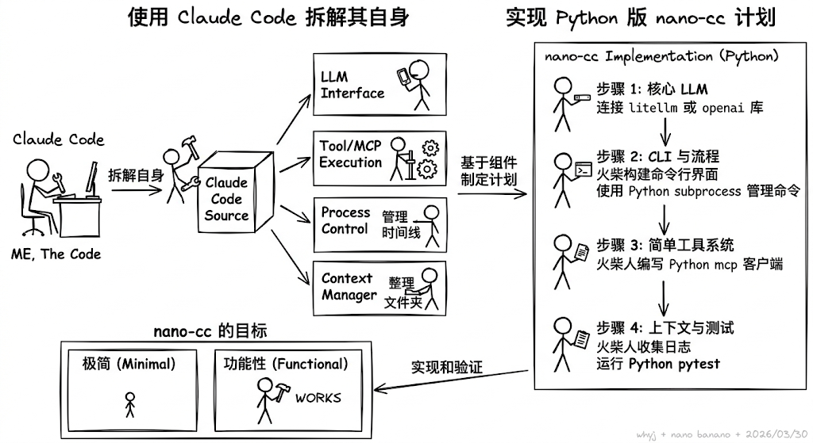

# Nano Claude

> O(1) 减法学习：删除代码，理解本质


---

## 问题

Claude Code 有 1,900+ TypeScript 文件。207 个命令。184 个工具。

没人能一次性理解。

---

## 方法

**减法学习法**：

```
理解 → 删除 → 理解更深
```

不是从代码结构出发，从**常用命令**出发：

```
命令做了什么？
    ↓
调用了哪些工具？
    ↓
数据怎么流转？
    ↓
核心代码在哪？
```

---

## 项目配置

### uv 管理

用 [uv](https://docs.astral.sh/uv/) 管理项目：

```bash
# 安装依赖
uv sync

# 运行
uv run nano-claude
```

### API 调用

基于 [anthropic Python SDK](https://github.com/anthropics/anthropic-sdk-python)，**异步流式输出**：

```python
from anthropic import AsyncAnthropic

client = AsyncAnthropic()

async with client.messages.stream(
    model="claude-sonnet-4-6",
    messages=[{"role": "user", "content": "Hello"}],
) as stream:
    async for text in stream.text_stream:
        print(text, end="", flush=True)
```

### Rich UI

用 [rich](https://github.com/Textualize/rich) 实现：
- Spinner 动画（类似 TypeScript 的 ora）
- 彩色输出
- Markdown 渲染

```python
from rich.console import Console
from rich.status import Status

console = Console()
with Status("Thinking...", spinner="dots"):
    # async streaming...
    pass
```

配置文件 `~/.nano-claude/settings.json`：

```json
{
  "env": {
    "NANO_CLAUDE_API_KEY": "your-api-key",
    "NANO_CLAUDE_BASE_URL": "https://api.anthropic.com",
    "NANO_CLAUDE_MODEL": "claude-sonnet-4-6"
  }
}
```

或直接使用环境变量 `ANTHROPIC_API_KEY` 和 `ANTHROPIC_BASE_URL`。

### PyPI 发布

学习了 PyPI 发布流程：

```bash
# 安装（发布后）
pip install nano-claude

# 或用 uv
uv pip install nano-claude
```

### --help

```bash
uv run nano-claude --help
```

```
usage: nano-claude [-h] {summary,manifest,commands,tools,route,bootstrap,...} ...

Python porting workspace for the Claude Code rewrite effort

commands:
  summary             项目摘要
  manifest            源码结构
  commands            命令列表
  tools               工具列表
  route               意图路由
  bootstrap           会话启动
  turn-loop           多轮对话
  subsystems          模块列表
  parity-audit        一致性审计
  setup-report        启动报告
  command-graph       命令图
  tool-pool           工具池
  bootstrap-graph     启动图
  flush-transcript    持久化会话
  load-session        加载会话
  show-command        查看命令
  show-tool           查看工具
  exec-command        执行命令 shim
  exec-tool           执行工具 shim
  remote-mode         远程模式
  ssh-mode            SSH 模式
  teleport-mode       传送模式
  direct-connect-mode 直连模式
  deep-link-mode      深链模式
```

---

## 项目定位

学习项目。不是 Claude Code 替代品。

核心目的：
1. 做减法
2. 极简实现
3. 输出过程
4. 理解工程设计

---

## 实践：删除 29 个空目录

### 发现

`src/` 有 29 个子目录，每个只有 `__init__.py`。

占位符。原始 TS 有这些子系统，Python 移植保留了结构，没实现内容。

### 验证

```bash
grep -r "from .assistant" src/  # 无依赖
uv run nano-claude summary      # 运行正常
```

### 删除

```bash
rm -rf src/assistant src/bootstrap src/bridge src/buddy ...
```

### 结果

- 文件：66 → 37
- 目录：32 → 3

### 收获

删除的前提是理解。知道是什么、知道没被用、知道删了不坏。

---

## 设计反思

如果让我设计 CLI Agent：

| 模块 | 简单版 | Claude Code |
|------|--------|-------------|
| 命令 | dict 映射 | JSON 快照 + Token 匹配 |
| 工具 | 数组 + execute | 权限 + MCP + 折叠 |
| 会话 | messages 数组 | 持久化 + Turn Loop |

Claude Code 每个模块都更复杂。为什么？值得吗？

---

## UI 计划

### 原始 Claude Code 的 UI

TypeScript 版用 **Ink**（React 终端 UI）：

```tsx
// React 风格的 TUI
import { render, Box, Text } from 'ink';

const App = () => (
  <Box flexDirection="column">
    <Text color="green">Hello!</Text>
  </Box>
);
```

功能：
- CompanionSprite.tsx — AI 伙伴动画
- 流式 Markdown 渲染
- 工具调用可视化
- 状态栏、进度条

### Python 版计划

用 **Textual** 实现类似 Ink 的体验：

```python
from textual.app import App
from textual.widgets import Header, Footer

class NanoClaudeApp(App):
    def compose(self):
        yield Header()
        yield Footer()
```

| 功能 | Textual 实现 |
|------|-------------|
| REPL 输入 | `Input` widget |
| Markdown 渲染 | `Markdown` widget |
| 命令补全 | 自定义 Completer |
| 流式输出 | 消息更新 |
| 状态栏 | `Footer` |

---

## 后续

| 主题 | 切入点 |
|------|--------|
| CLI 入口 | `--help` |
| 命令注册 | `commands` |
| 意图路由 | `route` |
| 运行时 | `bootstrap` |
| 查询引擎 | 内部流 |
| 权限 | 工具过滤 |
| 数据模型 | frozen |

---

## 参考

- [Claude Code 文档](https://docs.anthropic.com/claude-code)
- [Claude Agent SDK (Python)](https://platform.claude.com/docs/en/agent-sdk/python) — 核心 API 调用
- [Yufeng He 分析](https://zhuanlan.zhihu.com/p/2022389695955346888)
- [GitHub](https://github.com/yangjingo/nano-claude)