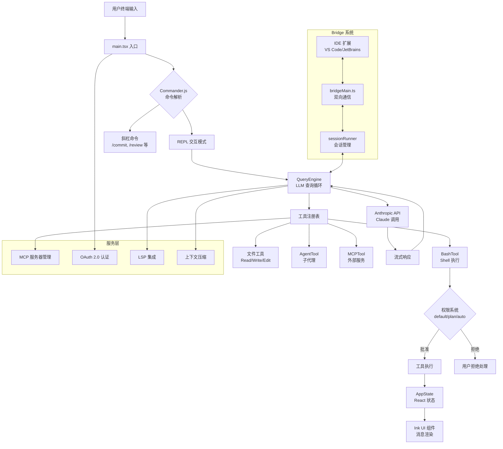
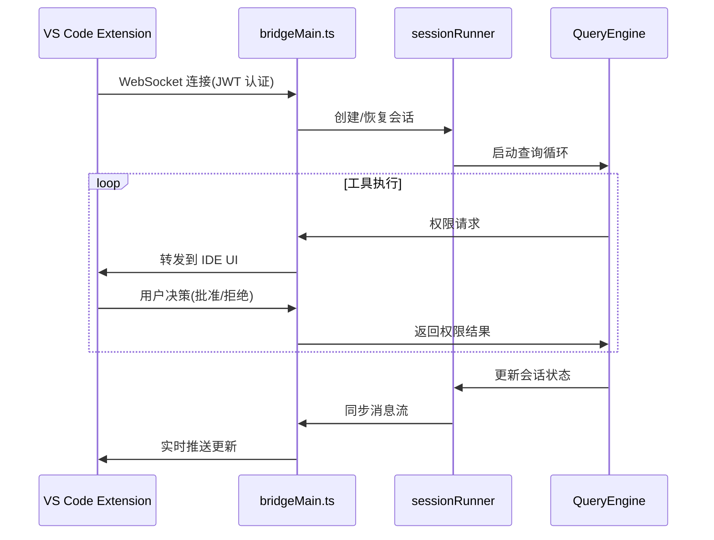

本文档旨在帮助初学者理解 Claude Code 源码快照的背景、研究价值以及如何利用这一资源进行学习。Claude Code 是 Anthropic 官方推出的命令行工具,允许开发者从终端与 Claude 交互以执行文件编辑、命令运行、代码库搜索等软件工程任务。本仓库是 **2026 年 3 月 31 日通过 npm 包中的 source map 暴露而公开获取的 TypeScript 源码快照**,用于教育研究、安全分析和软件供应链学习。

## 快照的来源与研究价值

### 公开暴露的技术背景

2026 年 3 月 31 日,Chaofan Shou (@Fried_rice) 在社交媒体上公开指出 Claude Code 的源码可通过 npm 包中的 `.map` 文件访问。这些 source map 引用了托管在 Anthropic R2 存储桶中的未混淆 TypeScript 源文件,使得 `src/` 目录快照成为公开可下载的资源。本仓库是由大学生维护的镜像副本,专门用于支持教育研究、安全分析、软件供应链暴露研究以及防御性安全工程实践。

这一快照的独特价值在于它提供了一个**真实世界生产级 CLI 应用的完整架构参考**,涵盖 1,900+ 文件、512,000+ 行 TypeScript/TSX 代码,展示了现代 AI 工具的工程实践。对于学习者而言,这是难得的机会去研究企业级 TypeScript 项目的模块组织、权限系统设计、终端 UI 实现以及多服务集成模式。

Sources: [README.md](README.md#L1-L60)

### 仓库定位与使用边界

本仓库**不包含构建配置文件**(如 `package.json`、lockfile、CI 配置),因此无法直接运行或测试。它是一个**静态分析资源**,适合通过代码阅读、模式识别、架构梳理来学习现代 CLI 工具的设计哲学。仓库维护者明确声明不拥有原始代码的所有权,这不是 Anthropic 的官方仓库,使用时应遵守学术诚信和道德研究原则。

Sources: [AGENTS.md](AGENTS.md#L1-L42)

## 技术栈与规模概览

### 核心技术选型

Claude Code 的技术栈体现了现代 Node.js 生态的最佳实践:

| 技术组件 | 用途 | 关键特性 |
|---------|------|---------|
| **TypeScript** | 主要语言 | 全项目类型安全,包含 TSX 终端组件 |
| **Bun Runtime** | 运行时环境 | 支持 `bun:bundle` 特性标志进行死代码消除 |
| **React + Ink** | 终端 UI | 使用 React 组件模型构建命令行界面 |
| **Commander.js** | CLI 框架 | 处理命令行参数解析和子命令路由 |
| **Zod** | Schema 验证 | 工具输入验证和配置模式定义 |
| **OpenTelemetry** | 可观测性 | 嵌入式指标、日志、追踪支持 |

这种组合允许开发者用熟悉的 React 模式构建复杂的终端交互,同时通过 Bun 的编译时优化实现条件功能剔除(例如 `feature('VOICE_MODE')` 控制的语音输入模块)。

Sources: [src/main.tsx](src/main.tsx#L1-L20), [src/bootstrap/state.ts](src/bootstrap/state.ts#L1-L30)

### 代码规模与组织结构

项目包含约 1,900 个 TypeScript/TSX 文件,总计 512,000+ 行代码,组织为以下核心模块:

```
src/
├── commands/        # 50+ 斜杠命令实现(/commit, /review, /compact 等)
├── tools/           # 40+ 工具实现(BashTool, FileEditTool, AgentTool 等)
├── components/      # 140+ React 终端组件(对话框、消息、输入框等)
├── services/        # 外部服务集成(API, MCP, OAuth, LSP 等)
├── bridge/          # IDE 双向通信层(VS Code/JetBrains 集成)
├── coordinator/     # 多代理协调器(团队协作模式)
├── hooks/           # React 自定义 hooks(权限、状态、输入处理)
├── utils/           # 工具函数库(Shell 安全、文件操作、解析器)
└── state/           # 状态管理(AppState React context)
```

每个工具和命令都是自包含模块,定义了输入模式、权限模型和执行逻辑,这种模块化设计使得代码库易于扩展和维护。

Sources: [src/commands.ts](src/commands.ts#L1-L80), [src/tools.ts](src/tools.ts#L1-L80)

## 架构总览：核心系统交互图



这个架构图展示了 Claude Code 的核心数据流:**用户输入**通过 Commander.js 解析为命令或进入 REPL 模式,REPL 循环通过 **QueryEngine** 驱动 LLM 查询,每次工具调用都经过**权限系统**检查,执行结果更新 **AppState** 并触发 **Ink UI** 重渲染。**Bridge 系统**允许 IDE 扩展远程控制和同步会话状态,而**服务层**提供 MCP 工具发现、OAuth 认证、LSP 智能补全和对话压缩等能力。

Sources: [src/main.tsx](src/main.tsx#L1-L100), [src/QueryEngine.ts](src/QueryEngine.ts#L1-L80), [src/Tool.ts](src/Tool.ts#L1-L80)

## 三大核心系统：工具、命令与权限

### 工具系统：40+ 自包含模块

每个工具实现都遵循统一接口模式:

```typescript
// 工具定义示例(简化)
interface Tool {
  name: string              // 工具名称,如 "bash"
  inputSchema: JSONSchema   // Zod 生成的输入验证模式
  progress?: ToolProgress   // 执行进度回调
  execute(input, context)   // 核心执行逻辑
  requiresPermission?: boolean // 是否需要权限检查
}
```

**代表性工具**:
- **BashTool**: Shell 命令执行,包含只读判定和后台运行策略
- **FileEditTool**: 字符串替换式文件编辑,支持 diff 预览
- **AgentTool**: 子代理生成,支持任务委派和颜色标识
- **MCPTool**: 调用外部 MCP 服务器提供的工具
- **WebSearchTool**: 网络搜索集成
- **LSPTool**: 语言服务器协议集成(跳转定义、查找引用)

工具系统的设计哲学是**最小权限原则**——每个工具明确声明其能力边界,权限系统根据上下文自动判定是否需要用户确认。

Sources: [src/Tool.ts](src/Tool.ts#L1-L80), [src/tools.ts](src/tools.ts#L1-L80)

### 命令系统：50+ 斜杠命令

斜杠命令是用户直接调用的快捷操作,如 `/commit` 自动生成 git 提交、`/review` 执行代码审查、`/compact` 压缩对话上下文。命令注册通过 `commands.ts` 集中管理,每个命令实现为独立模块,支持交互式向导和参数解析。

**常用命令分类**:

| 类别 | 命令示例 | 功能描述 |
|------|---------|---------|
| **版本控制** | `/commit`, `/diff`, `/pr_comments` | Git 操作和 PR 管理 |
| **环境配置** | `/config`, `/doctor`, `/login` | 设置管理和诊断 |
| **会话管理** | `/resume`, `/share`, `/compact` | 对话恢复和压缩 |
| **工具集成** | `/mcp`, `/skills`, `/vim` | MCP 服务器、技能、Vim 模式 |
| **成本追踪** | `/cost`, `/usage` | Token 用量和费用统计 |

Sources: [src/commands.ts](src/commands.ts#L1-L80)

### 权限系统：多模式安全控制

权限系统是 Claude Code 安全架构的核心,支持多种模式:

| 模式 | 行为描述 | 适用场景 |
|------|---------|---------|
| **default** | 每次工具调用都请求用户确认 | 初次使用、高风险操作 |
| **plan** | 只读工具自动批准,写操作需确认 | 代码探索、安全审查 |
| **auto** | 根据工具类型和上下文智能决策 | 信任环境、快速迭代 |
| **bypassPermissions** | 跳过所有权限检查(需明确启用) | CI/CD、自动化脚本 |

权限检查发生在 `src/hooks/toolPermission/` 中,通过 React hooks 集成到工具执行流程。系统会追踪拒绝历史,避免重复询问相同操作,同时支持权限决策的跨会话持久化。

Sources: [README.md](README.md#L200-L220)

## Bridge 系统：IDE 集成与远程控制

Bridge 系统是 Claude Code 的独特创新,允许 IDE 扩展(如 VS Code 插件)与 CLI 建立双向通信通道:



Bridge 的核心价值在于**无缝同步**——你在 IDE 中看到的对话历史、文件编辑建议、工具调用结果与 CLI 完全一致,同时 IDE 可以注入额外上下文(如当前选中代码、光标位置)到查询中。这通过 `bridgeMessaging.ts` 定制的消息协议实现,支持权限回调、状态同步、文件附件传输等功能。

Sources: [src/bridge/bridgeMain.ts](src/bridge/bridgeMain.ts#L1-L50), [src/bridge/sessionRunner.ts](src/bridge/sessionRunner.ts#L1-L50)

## 学习路径建议：从快照到深入理解

作为初学者,建议按以下顺序探索代码库:

1. **先读** [代码仓库导航：目录结构与核心模块地图](2-dai-ma-cang-ku-dao-hang-mu-lu-jie-gou-yu-he-xin-mo-kuai-di-tu) — 了解完整目录结构和模块职责划分

2. **接着** [从 main.tsx 开始：CLI 启动流程与初始化](3-cong-main-tsx-kai-shi-cli-qi-dong-liu-cheng-yu-chu-shi-hua) — 理解程序入口、命令解析、初始化顺序

3. **然后** [快照分析环境搭建与常用命令](4-kuai-zhao-fen-xi-huan-jing-da-jian-yu-chang-yong-ming-ling) — 掌握静态分析工具(ripgrep、tree)的使用方法

4. **深入核心** — 按兴趣选择专题:
   - 工具系统: [QueryEngine：LLM 查询循环与工具调度核心](5-queryengine-llm-cha-xun-xun-huan-yu-gong-ju-diao-du-he-xin)
   - 权限机制: [权限模式系统：default、plan、auto、bypass 等模式解析](9-quan-xian-mo-shi-xi-tong-default-plan-auto-bypass-deng-mo-shi-jie-xi)
   - UI 实现: [REPL 主界面：屏幕组织与消息渲染](28-repl-zhu-jie-mian-ping-mu-zu-zhi-yu-xiao-xi-xuan-ran)
   - 集成扩展: [MCP 客户端实现：连接管理与工具发现](15-mcp-ke-hu-duan-shi-xian-lian-jie-guan-li-yu-gong-ju-fa-xian)

## 总结：快照的实践价值

Claude Code 源码快照为学习者提供了**真实世界企业级 TypeScript 项目的完整剖面**,其价值体现在:

- **架构参考**: 模块化设计、依赖注入、状态管理模式
- **安全实践**: 权限系统、Shell 安全、输入验证
- **工程化**: 死代码消除、条件编译、性能优化
- **集成模式**: IDE 双向通信、MCP 协议、OAuth 流程
- **UI 工程**: React 终端渲染、虚拟滚动、键盘交互

通过静态分析这一快照,你可以学习如何设计可扩展的 CLI 工具、如何实现安全的 AI 代理系统、如何构建高性能的终端 UI——这些知识可直接应用到自己的项目中。

**下一步行动**: 打开 [代码仓库导航](2-dai-ma-cang-ku-dao-hang-mu-lu-jie-gou-yu-he-xin-mo-kuai-di-tu),开始你的代码考古之旅。