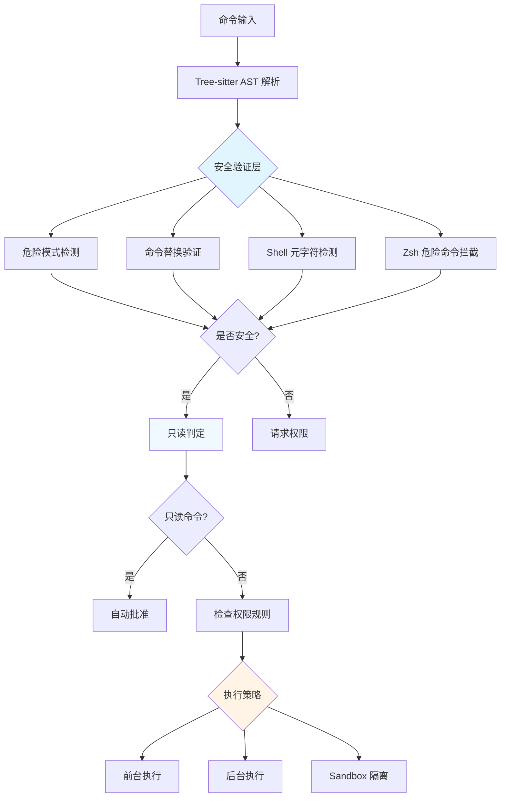

Claude Code 的 Bash 工具实现了多层次的安全架构，通过只读判定系统确保命令安全执行，并通过智能后台执行策略优化长时间运行命令的用户体验。本文档深入分析安全验证机制、只读判定逻辑以及后台执行策略的实现细节。

## 安全架构概览

Bash 工具的安全系统采用**纵深防御**（Defense in Depth）策略，通过多个验证层确保命令执行的安全性。核心架构包含命令解析、安全验证、只读判定和执行策略四个主要模块，每个模块都实现特定的安全检查和优化逻辑。



### 核心安全组件

**bashSecurity.ts** 实现了 20+ 种安全验证器，包括命令替换模式检测、Shell 元字符验证、Zsh 危险命令拦截等。每个验证器专注于特定的安全威胁，形成完整的防护网。验证器采用数字标识符（BASH_SECURITY_CHECK_IDS）进行日志记录，避免在遥测中泄露敏感命令字符串。[bashSecurity.ts#L76-L101](src/tools/BashTool/bashSecurity.ts#L76-L101)

**readOnlyValidation.ts** 维护了完整的只读命令白名单系统（COMMAND_ALLOWLIST），为每个命令配置安全标志位（safeFlags）和可选的自定义验证回调。该系统支持跨 Shell 工具（Bash、PowerShell）共享只读命令配置，确保一致的安全判定逻辑。[readOnlyValidation.ts#L34-L50](src/tools/BashTool/readOnlyValidation.ts#L34-L50)

**bashPermissions.ts** 整合所有安全检查结果，结合权限模式（default、plan、auto、bypass 等）和用户定义的权限规则，做出最终的执行决策。该模块还负责生成权限请求消息和规则建议。[bashPermissions.ts#L1-L89](src/tools/BashTool/bashPermissions.ts#L1-L89)

## 只读判定系统

只读判定是 Bash 工具安全架构的核心能力，通过多层验证机制准确识别只读命令，避免对安全操作不必要的权限请求。

### 命令白名单架构

只读命令白名单采用**分层配置**设计，将命令配置分为通用标志组和命令特定配置两部分。通用标志组（如 GIT_STAT_FLAGS、GIT_COLOR_FLAGS）可在多个命令间复用，减少配置冗余并确保一致性。[readOnlyCommandValidation.ts#L44-L95](src/utils/shell/readOnlyCommandValidation.ts#L44-L95)

**标志位类型系统**定义了五种参数类型：`none`（无参数）、`number`（整数）、`string`（字符串）、`char`（单字符）、`{}`（仅允许 `{}` 字面量）、`EOF`（仅允许 `EOF` 字面量）。类型系统确保标志位解析的准确性，防止解析差异导致的安全绕过。[readOnlyCommandValidation.ts#L18-L25](src/utils/shell/readOnlyCommandValidation.ts#L18-L25)

```typescript
// 标志位类型定义示例
type FlagArgType =
  | 'none'       // --color, -n
  | 'number'     // --context=3
  | 'string'     // --relative=path
  | 'char'       // 单字符分隔符
  | '{}'         // 仅允许 "{}" 字面量
  | 'EOF'        // 仅允许 "EOF" 字面量
```

**安全验证示例**：`git diff` 命令的 `-S`/`-G`/`-O` 标志最初被错误配置为 `none` 类型，导致解析差异。攻击者可构造 `git diff -S -- --output=/tmp/pwned` 命令，验证器将 `-S` 视为无参数标志，在 `--` 处停止解析，而 Git 将 `--` 作为 `-S` 的参数值，导致 `--output` 标志未被检查。修复后将这些标志改为 `string` 类型，确保验证器与 Git 的解析行为一致。[readOnlyCommandValidation.ts#L160-L173](src/utils/shell/readOnlyCommandValidation.ts#L160-L173)

### 多阶段验证流程

只读判定采用**瀑布式验证**模式，每个验证器返回 `allow`（允许）、`ask`（请求权限）或 `passthrough`（传递给下一验证器）三种行为之一。验证流程在遇到首个非 `passthrough` 结果时终止，确保高效的判定过程。

1. **空命令检查**：快速允许空命令，避免不必要的后续验证
2. **不完整命令检测**：拦截以 Tab、标志位或操作符开头的片段命令，防止意外执行
3. **安全 Heredoc 验证**：检测并允许特定形式的 `$(cat <<'DELIM'...DELIM)` 模式，同时拒绝所有嵌套或异常形式
4. **危险模式扫描**：检测命令替换（`$()`、`` ` ``）、进程替换（`<()`、`>()`）、参数展开（`${}`）等危险模式
5. **命令白名单匹配**：解析命令标志位，与白名单配置进行匹配
6. **路径约束检查**：验证文件操作路径是否在允许范围内
7. **Sandbox 适用性判断**：决定是否启用 Sandbox 隔离

[bashSecurity.ts#L233-L286](src/tools/BashTool/bashSecurity.ts#L233-L286) [readOnlyValidation.ts#L1-L200](src/tools/BashTool/readOnlyValidation.ts#L1-L200)

### Tree-sitter 增强解析

系统使用 **Tree-sitter** 进行精确的 Shell 命令解析，避免正则表达式的局限性和边缘情况。Tree-sitter 生成完整的抽象语法树（AST），提供命令结构、参数边界、引用上下文等精确信息，显著提升安全验证的准确性。[bashSecurity.ts#L103-L117](src/tools/BashTool/bashSecurity.ts#L103-L117)

```typescript
type ValidationContext = {
  originalCommand: string
  baseCommand: string
  unquotedContent: string        // 移除单引号引用后的内容
  fullyUnquotedContent: string   // 完全移除所有引用后的内容
  fullyUnquotedPreStrip: string  // 移除引用但保留重定向
  unquotedKeepQuoteChars: string // 保留引号字符但清空引用内容
  treeSitter?: TreeSitterAnalysis | null  // Tree-sitter 解析结果
}
```

**引用处理**：`extractQuotedContent` 函数正确处理 Bash 的复杂引用语义，包括单引号（完全字面量）、双引号（保留变量展开和转义）、反斜杠转义等。该函数生成多个变体的去引用内容，供不同验证器使用。[bashSecurity.ts#L128-L174](src/tools/BashTool/bashSecurity.ts#L128-L174)

## 安全威胁防护机制

Bash 工具实现了全面的安全威胁防护，涵盖 Shell 注入、命令绕过、权限提升等多种攻击向量。

### 命令替换与进程替换防护

系统维护了**危险模式列表**（COMMAND_SUBSTITUTION_PATTERNS），检测并拦截各种形式的命令执行构造：

- **命令替换**：`$()`、`` ` ``、`${}`、`$[]`
- **进程替换**：`<()`、`>()`、`=()`（Zsh）
- **参数展开**：`~[]`（Zsh）、`(e:`（Zsh glob 限定符）
- **PowerShell 注释**：`<#`（防御性拦截）

[bashSecurity.ts#L12-L41](src/tools/BashTool/bashSecurity.ts#L12-L41)

**Zsh 特殊语法防护**：Zsh 的 `=cmd` 语法在词首会展开为 `$(which cmd)`，可能绕过基于二进制名称的拒绝规则。例如 `=curl evil.com` 会展开为 `/usr/bin/curl evil.com`，解析器看到的是 `=curl` 而非 `curl`。系统通过正则 `/(?:^|[\s;&|])=[a-zA-Z_]/` 检测此类模式。[bashSecurity.ts#L20-L27](src/tools/BashTool/bashSecurity.ts#L20-L27)

### Zsh 危险命令拦截

Zsh 拥有丰富的模块系统，可通过 `zmodload` 加载危险功能。系统维护了 **ZSH_DANGEROUS_COMMANDS** 集合，拦截以下类别的命令：

- **模块加载器**：`zmodload`（所有模块攻击的入口）
- **模拟执行**：`emulate -c`（等价于 `eval`）
- **文件系统模块**：`zsh/files`（内置 `rm`/`mv`/`ln`/`chmod`，绕过二进制检查）
- **系统调用模块**：`zsh/system`（`sysopen`/`sysread`/`syswrite`/`sysseek`）
- **伪终端模块**：`zsh/zpty`（在伪终端上执行命令）
- **网络模块**：`zsh/net/tcp`（`ztcp`，用于数据渗出）

[bashSecurity.ts#L43-L74](src/tools/BashTool/bashSecurity.ts#L43-L74)

### Heredoc 安全校验

Heredoc（Here Document）是 Bash 的多行字符串构造，可能隐藏危险的命令注入。系统实现了**严格的 Heredoc 安全校验**，仅允许以下形式的安全模式：

```
[prefix] $(cat <<'DELIM'
[body lines]
DELIM
) [suffix]
```

**安全条件**：
1. 分隔符必须单引号引用或转义（`'DELIM'` 或 `\DELIM`），确保内容为字面量
2. 闭合分隔符必须**单独占一行**或与 `)` 在同一行（`DELIM)`）
3. 闭合分隔符必须是**首个**匹配行，不允许跳过早期分隔符
4. `$(...)` 前必须有非空白文本（参数位置，非命令名位置）
5. 移除 Heredoc 后的剩余文本必须通过所有安全验证器
6. 不允许嵌套 Heredoc 模式

[bashSecurity.ts#L288-L514](src/tools/BashTool/bashSecurity.ts#L288-L514)

**嵌套检测原理**：正则表达式在原始文本中匹配 `$(cat <<'X'` 模式，不理解引用语义。当外部 Heredoc 使用引用分隔符时，内部的 `$(cat <<'B'` 只是字面字符。系统检测到嵌套范围后拒绝整个命令，避免索引错误导致的命令截断攻击。[bashSecurity.ts#L439-L457](src/tools/BashTool/bashSecurity.ts#L439-L457)

### 安全重定向剥离

`stripSafeRedirections` 函数移除安全的重定向模式（`>/dev/null`、`2>&1`、`</dev/null`），简化后续验证。**关键安全设计**：所有模式必须使用正向先行断言 `(?=\s|$)`，防止前缀匹配导致的绕过。例如，`> /dev/nullo` 不应匹配 `/dev/null` 前缀，否则会剥离 `> /dev/null` 留下 `o`，导致验证器看到 `echo hi o` 而实际写入 `/dev/nullo`。[bashSecurity.ts#L176-L188](src/tools/BashTool/bashSecurity.ts#L176-L188)

## 权限模式集成

Bash 工具的权限系统与全局权限模式深度集成，根据不同模式调整自动批准策略。

### Accept Edits 模式

**Accept Edits** 模式自动批准文件系统操作命令，包括 `mkdir`、`touch`、`rm`、`rmdir`、`mv`、`cp`、`sed`。该模式专为代码编辑场景设计，允许 Claude 直接修改文件系统而无需反复确认。[modeValidation.ts#L7-L56](src/tools/BashTool/modeValidation.ts#L7-L56)

```typescript
const ACCEPT_EDITS_ALLOWED_COMMANDS = [
  'mkdir', 'touch', 'rm', 'rmdir', 
  'mv', 'cp', 'sed'
] as const

function validateCommandForMode(cmd: string, context: ToolPermissionContext) {
  const [baseCmd] = cmd.trim().split(/\s+/)
  
  if (context.mode === 'acceptEdits' && 
      isFilesystemCommand(baseCmd)) {
    return {
      behavior: 'allow',
      updatedInput: { command: cmd },
      decisionReason: { type: 'mode', mode: 'acceptEdits' }
    }
  }
  
  return { behavior: 'passthrough' }
}
```

### 权限规则匹配

权限规则支持**精确匹配**和**前缀匹配**两种模式：
- **精确匹配**：`Bash(npm run build)` 仅匹配该确切命令
- **前缀匹配**：`Bash(git commit:*)` 匹配所有 `git commit` 子命令

**环境变量处理**：`getSimpleCommandPrefix` 函数从命令中提取稳定的前缀，跳过安全环境变量（SAFE_ENV_VARS）但拒绝非安全变量，防止生成无效的权限规则。例如 `MY_VAR=val npm run build` 不会生成 `Bash(npm run:*)` 规则，因为 `MY_VAR` 不在安全列表中。[bashPermissions.ts#L161-L188](src/tools/BashTool/bashPermissions.ts#L161-L188)

## 后台执行策略

后台执行机制优化长时间运行命令的用户体验，支持自动后台化和手动后台化两种模式。

### 执行模式判定

Bash 工具根据命令类型和执行上下文选择**三种执行策略**之一：

1. **前台执行**：默认模式，命令阻塞当前会话，实时显示输出
2. **后台执行**：命令在后台运行，会话立即返回，通过通知机制报告完成
3. **Sandbox 隔离**：在受限环境中执行，限制文件系统和网络访问

**自动后台化触发条件**：
- Assistant 模式下阻塞命令超过 **15 秒**（ASSISTANT_BLOCKING_BUDGET_MS）
- 命令不在禁用列表中（`sleep` 命令不允许自动后台化）
- 未设置 `CLAUDE_CODE_DISABLE_BACKGROUND_TASKS` 环境变量

[BashTool.tsx#L54-L58](src/tools/BashTool/BashTool.tsx#L54-L58) [BashTool.tsx#L219-L226](src/tools/BashTool/BashTool.tsx#L219-L226)

### 任务生命周期管理

**LocalShellTask** 模块管理后台任务的生命周期，包括任务注册、状态转换、输出收集和完成通知。每个后台任务拥有唯一的 taskId，输出写入磁盘文件，支持大输出的持久化存储。[LocalShellTask.tsx#L180-L252](src/tasks/LocalShellTask/LocalShellTask.tsx#L180-L252)

```typescript
interface LocalShellTaskState {
  type: 'local_bash'
  status: 'running' | 'completed' | 'failed' | 'killed'
  command: string
  isBackgrounded: boolean
  shellCommand: ShellCommand | null
  result?: { code: number; interrupted: boolean }
  endTime?: number
}
```

**任务注册流程**：
1. **前台注册**：`registerForeground` 创建任务状态，标记 `isBackgrounded: false`
2. **后台转换**：`backgroundTask` 调用 `shellCommand.background(taskId)`，更新状态为 `isBackgrounded: true`
3. **完成处理**：任务完成时更新状态，调用 `enqueueShellNotification` 发送通知，清理资源

[LocalShellTask.tsx#L259-L368](src/tasks/LocalShellTask/LocalShellTask.tsx#L259-L368)

### 交互式提示检测

**Stall Watchdog** 机制检测可能卡在交互式提示的命令，避免无限等待。系统每 5 秒检查输出文件大小，若 45 秒内无增长且尾部匹配提示模式，则发送通知建议用户干预。[LocalShellTask.tsx#L28-L104](src/tasks/LocalShellTask/LocalShellTask.tsx#L28-L104)

**提示模式列表**：
- `(y/n)`、`[y/n]`、`(yes/no)`
- `Do you ...?`、`Would you ...?`、`Are you sure?`
- `Press any key`、`Continue?`、`Overwrite?`

```typescript
const PROMPT_PATTERNS = [
  /\(y\/n\)/i,
  /\[y\/n\]/i,
  /\(yes\/no\)/i,
  /\b(?:Do you|Would you|Shall I|Are you sure|Ready to)\b.*\? *$/i,
  /Press (any key|Enter)/i,
  /Continue\?/i,
  /Overwrite\?/i
]

function looksLikePrompt(tail: string): boolean {
  const lastLine = tail.trimEnd().split('\n').pop() ?? ''
  return PROMPT_PATTERNS.some(p => p.test(lastLine))
}
```

[LocalShellTask.tsx#L32-L42](src/tasks/LocalShellTask/LocalShellTask.tsx#L32-L42)

### 手动后台化交互

用户可通过 **Ctrl+B** 快捷键手动后台化所有前台任务。`BackgroundHint` 组件显示后台化提示，并通过 `useKeybinding` Hook 注册快捷键处理函数。[UI.tsx#L29-L84](src/tools/BashTool/UI.tsx#L29-L84)

```typescript
function BackgroundHint({ onBackground }) {
  const store = useAppStateStore()
  const setAppState = useSetAppState()
  
  const handleBackground = () => {
    backgroundAll(() => store.getState(), setAppState)
    onBackground?.()
  }
  
  useKeybinding("task:background", handleBackground, { context: "Task" })
  
  return (
    <Box paddingLeft={5}>
      <Text dimColor>
        <KeyboardShortcutHint 
          shortcut={shortcut} 
          action="run in background" 
          parens={true} 
        />
      </Text>
    </Box>
  )
}
```

**Tmux 兼容性**：在 Tmux 环境中，`Ctrl+B` 是 Tmux 前缀键，需要按两次（`Ctrl+B Ctrl+B`）才能触发后台化。系统检测 Tmux 环境并显示正确的快捷键提示。[UI.tsx#L70-L71](src/tools/BashTool/UI.tsx#L70-L71)

## Sandbox 集成

Sandbox 机制为 Bash 命令提供**操作系统级隔离**，限制文件系统访问、网络连接和进程创建。

### Sandbox 适用性判定

`shouldUseSandbox` 函数根据命令特征和配置决定是否启用 Sandbox：
- **禁用条件**：命令在 `sandbox.excludedCommands` 列表中
- **配置源**：动态配置（`tengu_sandbox_disabled_commands`）和用户设置（`settings.json`）
- **模式匹配**：支持精确匹配和通配符模式（`npm run test:*`）

[shouldUseSandbox.ts](src/tools/BashTool/shouldUseSandbox.ts)

### Sandbox 违规处理

Sandbox 违规时，`SandboxManager.annotateStderrWithSandboxFailures` 在输出中标注违规信息，帮助用户理解失败原因。违规信息包括被拒绝的操作类型（文件访问、网络连接等）和目标资源。[BashTool.tsx#L709-L719](src/tools/BashTool/BashTool.tsx#L709-L719)

```typescript
const outputWithSbFailures = SandboxManager.annotateStderrWithSandboxFailures(
  input.command, 
  result.stdout || ''
)

if (interpretationResult.isError && !isInterrupt) {
  throw new ShellError('', outputWithSbFailures, result.code, result.interrupted)
}
```

## 输出处理与持久化

Bash 工具实现了**智能输出管理**，平衡内存使用、响应速度和结果可访问性。

### 大输出持久化

当命令输出超过 **64 MB**（MAX_PERSISTED_SIZE）时，系统自动将输出文件复制到 `tool-results` 目录并截断原文件。持久化路径通过 `getToolResultPath(taskId, false)` 生成，模型可通过 FileRead 工具访问完整输出。[BashTool.tsx#L732-L753](src/tools/BashTool/BashTool.tsx#L732-L753)

```typescript
const MAX_PERSISTED_SIZE = 64 * 1024 * 1024  // 64 MB

if (result.outputFilePath && result.outputTaskId) {
  const fileStat = await fsStat(result.outputFilePath)
  persistedOutputSize = fileStat.size
  
  await ensureToolResultsDir()
  const dest = getToolResultPath(result.outputTaskId, false)
  
  if (fileStat.size > MAX_PERSISTED_SIZE) {
    await fsTruncate(result.outputFilePath, MAX_PERSISTED_SIZE)
  }
  
  await link(result.outputFilePath, dest)  // 硬链接优先
    .catch(() => copyFile(result.outputFilePath, dest))  // 回退到复制
  
  persistedOutputPath = dest
}
```

### 输出截断策略

`EndTruncatingAccumulator` 实现了**尾部保留截断**策略，当输出超过限制时保留开头和结尾部分，确保错误信息和最终结果可见。该策略适用于长时间运行命令的进度输出，避免中间日志占用全部配额。[BashTool.tsx#L636](src/tools/BashTool/BashTool.tsx#L636)

### Claude Code Hints 协议

Claude Code Hints 是**零令牌侧信道**，允许外部工具（CLI、SDK）向 Claude Code 传递提示信息而不消耗上下文配额。Hints 以 `<claude-code-hint />` 标签形式嵌入 stderr，系统在记录推荐后立即剥离，确保模型永不看到原始标签。[BashTool.tsx#L774-L784](src/tools/BashTool/BashTool.tsx#L774-L784)

```typescript
const extracted = extractClaudeCodeHints(strippedStdout, input.command)
strippedStdout = extracted.stripped  // 剥离标签

if (isMainThread && extracted.hints.length > 0) {
  for (const hint of extracted.hints) {
    maybeRecordPluginHint(hint)  // 记录推荐
  }
}
```

## 安全设计原则总结

Bash 工具的安全架构遵循以下核心原则：

| 原则 | 实现体现 | 代码位置 |
|------|---------|---------|
| **纵深防御** | 20+ 独立验证器，每个专注特定威胁 | [bashSecurity.ts#L76-L101](src/tools/BashTool/bashSecurity.ts#L76-L101) |
| **最小权限** | 白名单系统默认拒绝，仅允许已知安全操作 | [readOnlyValidation.ts#L34-L50](src/tools/BashTool/readOnlyValidation.ts#L34-L50) |
| **精确解析** | Tree-sitter AST 避免正则边缘情况 | [bashSecurity.ts#L103-L117](src/tools/BashTool/bashSecurity.ts#L103-L117) |
| **防御性编程** | 前缀匹配必须使用边界断言，防止绕过 | [bashSecurity.ts#L176-L188](src/tools/BashTool/bashSecurity.ts#L176-L188) |
| **透明可审计** | 数字标识符记录安全事件，避免日志泄露 | [bashSecurity.ts#L76-L101](src/tools/BashTool/bashSecurity.ts#L76-L101) |
| **渐进式降级** | 解析失败时采用安全默认（请求权限） | [bashPermissions.ts#L95-L103](src/tools/BashTool/bashPermissions.ts#L95-L103) |

这套安全架构经过多次安全审计和实战验证，成功防御了包括命令注入、权限绕过、资源耗尽等多种攻击向量，为 Claude Code 提供了可靠的命令执行环境。

## 延伸阅读

- **权限模式系统**：了解不同权限模式（default、plan、auto、bypass）的完整行为 → [权限模式系统：default、plan、auto、bypass 等模式解析](9-quan-xian-mo-shi-xi-tong-default-plan-auto-bypass-deng-mo-shi-jie-xi)
- **权限请求流程**：深入理解用户交互与决策传播机制 → [权限请求流程：用户交互与决策传播](11-quan-xian-qing-qiu-liu-cheng-yong-hu-jiao-hu-yu-jue-ce-chuan-bo)
- **并发执行策略**：探索工具批处理与安全判定的并发模型 → [并发执行策略：工具批处理与安全判定](8-bing-fa-zhi-xing-ce-lue-gong-ju-pi-chu-li-yu-an-quan-pan-ding)
- **工具系统架构**：概览从 Tool 接口到具体实现的完整设计 → [工具系统架构：从 Tool 接口到 40+ 工具实现](6-gong-ju-xi-tong-jia-gou-cong-tool-jie-kou-dao-40-gong-ju-shi-xian)