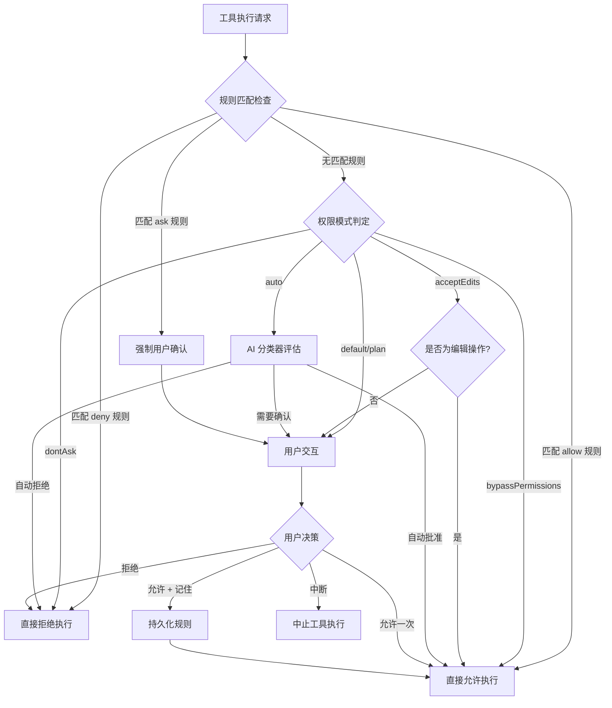
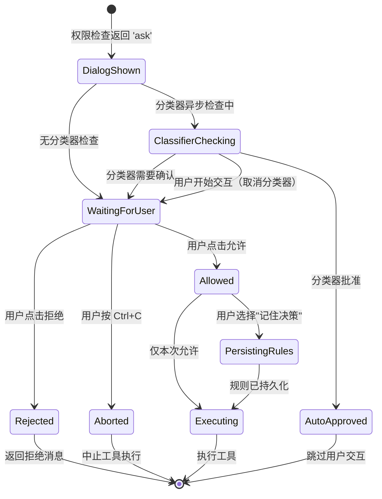

Claude Code 的权限请求流程构建了一个多层决策系统，在 AI 自主性与用户控制之间寻找平衡。该系统从工具执行的权限检查开始，经过规则匹配、模式判定、AI 分类器评估，最终到达用户交互界面，并将用户决策持久化到配置系统以影响后续行为。整个流程采用**责任链模式**，每一层都可以做出最终决策或传递给下一层，既保证了安全性又维持了交互效率。

## 权限决策的层次架构

权限检查遵循严格的层次结构，每一层都有机会做出最终决策。系统首先检查**显式规则**（allow/deny/ask rules），然后应用**权限模式**（default/plan/auto/bypass 等），对于需要用户确认的场景会启动**AI 分类器**进行预判，最后才展示**交互式对话框**。这种设计确保了已知安全的操作能够快速通过，而未知或危险操作则需要人类监督。



Sources: [permissions.ts](src/utils/permissions/permissions.ts#L1-L200)

## 核心类型系统：权限决策的语义表达

权限系统的类型定义清晰地表达了决策的语义。每个 `PermissionDecision` 都包含 `behavior`（行为）、`message`（解释消息）、`decisionReason`（决策原因）等核心字段，确保决策过程可追溯、可解释。系统区分了三种基本行为：`allow`（允许）、`deny`（拒绝）、`ask`（需要用户确认），以及 `passthrough`（传递给上层处理）的特殊行为。

**权限行为对比表**：

| 行为 | 含义 | 触发场景 | 后续操作 |
|------|------|----------|----------|
| `allow` | 直接执行工具 | 匹配 allow 规则、bypass 模式、分类器批准 | 立即执行工具，可选更新输入参数 |
| `deny` | 拒绝执行 | 匹配 deny 规则、dontAsk 模式、安全检查失败 | 返回错误消息，中止工具调用 |
| `ask` | 请求用户确认 | 匹配 ask 规则、default 模式、未知操作 | 展示权限对话框，等待用户响应 |
| `passthrough` | 传递给上层 | 子命令混合结果、复合命令部分通过 | 由调用方决定最终行为 |

**决策原因类型**（`PermissionDecisionReason`）：

```typescript
type PermissionDecisionReason =
  | { type: 'rule'; rule: PermissionRule }           // 匹配到显式规则
  | { type: 'mode'; mode: PermissionMode }           // 权限模式决定
  | { type: 'classifier'; classifier: string; reason: string }  // AI 分类器判定
  | { type: 'hook'; hookName: string; reason?: string }         // Hook 拦截
  | { type: 'safetyCheck'; reason: string; classifierApprovable: boolean }  // 安全检查
  | { type: 'workingDir'; reason: string }           // 工作目录限制
  | { type: 'subcommandResults'; reasons: Map<string, PermissionResult> }  // 子命令结果
```

Sources: [permissions.ts](src/types/permissions.ts#L1-L399)

## 规则匹配系统：从字符串到语义规则

权限规则采用**声明式配置**，用户可以通过 `settings.json` 或 CLI 参数定义 allow/deny/ask 规则。规则支持工具级别（如 `Bash`）和内容级别（如 `Bash(rm:*)`）两种粒度，内容部分使用简化的模式匹配语法。系统在启动时加载所有规则源，按优先级合并，并在每次权限检查时快速匹配。

**规则来源优先级**（从高到低）：

1. **cliArg**：命令行参数 `--allow` / `--deny`
2. **flagSettings**：特性开关控制的规则
3. **policySettings**：组织策略配置
4. **projectSettings**：项目级 `.claude/settings.json`
5. **localSettings**：本地用户设置
6. **userSettings**：全局用户设置
7. **session**：当前会话临时规则
8. **command**：斜杠命令动态添加的规则

**规则匹配流程**：

```typescript
// 1. 工具级别匹配：规则 "Bash" 匹配整个 BashTool
function toolMatchesRule(tool: Tool, rule: PermissionRule): boolean {
  if (rule.ruleValue.ruleContent !== undefined) return false  // 必须无内容
  return rule.ruleValue.toolName === getToolNameForPermissionCheck(tool)
}

// 2. 内容级别匹配：规则 "Bash(rm:*)" 匹配特定命令前缀
function contentMatchesRule(input: string, ruleContent: string): boolean {
  // 支持通配符 * 和前缀匹配
  return matchesPattern(input, ruleContent)
}

// 3. MCP 工具匹配：规则 "mcp__server1" 匹配服务器所有工具
// 规则 "mcp__server1__*" 也匹配服务器所有工具（显式通配符）
```

Sources: [permissions.ts](src/utils/permissions/permissions.ts#L200-L399)

## 权限模式：不同场景下的行为策略

Claude Code 提供了多种权限模式，适应不同的使用场景和安全需求。模式通过 `defaultMode` 配置或 `--permission-mode` 参数设置，影响所有未匹配显式规则的操作的默认行为。每种模式都有明确的安全边界和适用场景。

**权限模式对比表**：

| 模式 | 行为特征 | 适用场景 | 安全级别 |
|------|----------|----------|----------|
| `default` | 未允许的操作都需要确认 | 日常开发、新项目 | ⭐⭐⭐⭐⭐ |
| `plan` | 只读操作自动允许，修改需要确认 | 代码审查、探索性任务 | ⭐⭐⭐⭐ |
| `acceptEdits` | 工作目录内编辑自动允许 | 快速迭代、信任环境 | ⭐⭐⭐ |
| `auto` | AI 分类器自动决策 | CI/CD、后台任务 | ⭐⭐ |
| `bypassPermissions` | 所有操作自动允许（危险） | 受控环境、测试 | ⭐ |
| `dontAsk` | 所有未允许的操作自动拒绝 | 严格限制、审计模式 | ⭐⭐⭐⭐⭐ |

**模式转换示例**：

```typescript
// default 模式下的决策转换
if (result.behavior === 'ask' && mode === 'dontAsk') {
  return {
    behavior: 'deny',
    decisionReason: { type: 'mode', mode: 'dontAsk' },
    message: DONT_ASK_REJECT_MESSAGE(tool.name)
  }
}

// auto 模式触发分类器
if (result.behavior === 'ask' && mode === 'auto') {
  const classifierResult = await classifyYoloAction(messages, action, tools, context)
  if (classifierResult.shouldBlock) {
    return { behavior: 'deny', ... }
  }
  return { behavior: 'allow', ... }
}
```

Sources: [permissions.ts](src/utils/permissions/permissions.ts#L500-L700)

## AI 分类器：自动模式的智能决策

当启用 `auto` 模式时，系统使用 **YOLO（You Only Look Once）分类器**来预测操作的安全性。分类器基于对话历史、工具调用上下文和操作描述，使用轻量级模型快速判断是否应该自动批准、拒绝或仍需用户确认。这允许在无人值守场景下（如 CI/CD、后台代理）安全地执行大部分操作。

**分类器工作流程**：

1. **快速路径检查**：如果操作在 `acceptEdits` 模式下会被允许，跳过分类器直接批准
2. **白名单检查**：已知安全的工具（如 Read、Glob）直接批准
3. **分类器调用**：构建包含对话历史的提示词，调用轻量级模型
4. **结果解析**：解析 XML 格式的分类结果，提取 `shouldBlock` 标志和原因
5. **拒绝限制**：连续拒绝达到阈值后，回退到用户交互以防止误判

**分类器结果结构**：

```typescript
type YoloClassifierResult = {
  thinking?: string              // 模型推理过程（thinking 模式）
  shouldBlock: boolean          // 是否应该阻止
  reason: string                // 决策原因
  unavailable?: boolean         // API 是否不可用
  transcriptTooLong?: boolean   // 对话是否超出上下文窗口
  model: string                 // 使用的模型
  usage?: ClassifierUsage       // Token 使用统计
  durationMs?: number           // 调用耗时
  stage?: 'fast' | 'thinking'   // 决策阶段（两阶段分类器）
}
```

**拒绝追踪与回退机制**：

```typescript
// 连续拒绝达到限制后回退到用户交互
const DENIAL_LIMITS = {
  maxConsecutive: 3,    // 连续拒绝次数
  maxTotal: 10          // 总拒绝次数
}

function handleDenialLimitExceeded(denialState, appState, reason) {
  if (shouldFallbackToPrompting(denialState)) {
    // 重置计数并回退到用户交互
    return {
      behavior: 'ask',
      message: `Auto mode has denied ${denialState.totalDenials} actions. ` +
               `Please review: ${reason}`
    }
  }
}
```

Sources: [permissions.ts](src/utils/permissions/permissions.ts#L800-L999)

## 用户交互流程：从对话框到决策回调

当所有自动决策路径都无法确定时，系统启动**交互式权限对话框**。对话框由 `PermissionRequest` 组件统一管理，根据工具类型分发到特定的子组件（如 `BashPermissionRequest`、`FileEditPermissionRequest`）。对话框展示操作详情、提供决策选项，并允许用户附加反馈和持久化规则。

**交互流程状态机**：



**对话框回调机制**：

```typescript
type ToolUseConfirm = {
  // 核心信息
  tool: Tool
  input: z.infer<InputSchema>
  toolUseContext: ToolUseContext
  permissionResult: PermissionDecision
  
  // 用户交互回调
  onUserInteraction(): void           // 用户开始交互（取消自动批准）
  onAbort(): void                     // 用户中止
  onAllow(updatedInput, permissionUpdates, feedback?): void  // 允许
  onReject(feedback?): void           // 拒绝
  recheckPermission(): Promise<void>  // 重新检查权限（规则更新后）
  
  // 分类器状态
  classifierCheckInProgress?: boolean
  classifierAutoApproved?: boolean
  classifierMatchedRule?: string
}
```

**用户交互防护**：

```typescript
// 防止分类器在用户交互时自动批准
function onUserInteraction() {
  const GRACE_PERIOD_MS = 200  // 200ms 宽限期防止误触
  if (Date.now() - permissionPromptStartTimeMs < GRACE_PERIOD_MS) {
    return
  }
  userInteracted = true
  clearClassifierChecking(toolUseID)  // 取消正在进行的分类器检查
  clearClassifierIndicator()          // 隐藏"正在自动批准"提示
}
```

Sources: [interactiveHandler.ts](src/hooks/toolPermission/handlers/interactiveHandler.ts#L1-L200)

## 决策传播与持久化：从用户选择到系统状态

用户在权限对话框中的决策通过**回调链**传播回权限系统，并根据用户选择持久化到配置文件。系统支持三种持久化目标：`session`（仅当前会话）、`localSettings`（项目级）、`userSettings`（全局）。持久化操作通过 `PermissionUpdate` 类型统一表达，包括添加规则、删除规则、设置模式等操作。

**PermissionUpdate 操作类型**：

```typescript
type PermissionUpdate =
  | { type: 'addRules'; destination: PermissionUpdateDestination; 
      rules: PermissionRuleValue[]; behavior: PermissionBehavior }
  | { type: 'replaceRules'; destination; rules; behavior }
  | { type: 'removeRules'; destination; rules; behavior }
  | { type: 'setMode'; destination; mode: ExternalPermissionMode }
  | { type: 'addDirectories'; destination; directories: string[] }
  | { type: 'removeDirectories'; destination; directories }
```

**持久化目标与存储位置**：

| 目标 | 存储位置 | 作用域 | 持久性 |
|------|----------|--------|--------|
| `session` | 内存中的 `AppState.toolPermissionContext` | 当前会话 | 会话结束即失效 |
| `localSettings` | `.claude/settings.json`（项目目录） | 当前项目 | 跨会话持久 |
| `projectSettings` | `.claude/settings.json`（项目目录） | 当前项目 | 跨会话持久 |
| `userSettings` | `~/.claude/settings.json` | 用户所有项目 | 跨会话持久 |
| `cliArg` | 命令行参数 | 当前进程 | 进程结束即失效 |

**应用与持久化流程**：

```typescript
// 1. 应用更新到内存状态
function applyPermissionUpdate(context: ToolPermissionContext, update: PermissionUpdate) {
  switch (update.type) {
    case 'addRules':
      const ruleStrings = update.rules.map(permissionRuleValueToString)
      return {
        ...context,
        alwaysAllowRules: {
          ...context.alwaysAllowRules,
          [update.destination]: [
            ...(context.alwaysAllowRules[update.destination] || []),
            ...ruleStrings
          ]
        }
      }
    case 'setMode':
      return { ...context, mode: update.mode }
    // ... 其他操作
  }
}

// 2. 持久化到配置文件
function persistPermissionUpdate(update: PermissionUpdate) {
  if (!supportsPersistence(update.destination)) return
  
  switch (update.type) {
    case 'addRules':
      addPermissionRulesToSettings(
        { ruleValues: update.rules, ruleBehavior: update.behavior },
        update.destination
      )
      break
    case 'setMode':
      updateSettingsForSource(update.destination, {
        permissions: { defaultMode: update.mode }
      })
      break
    // ... 其他操作
  }
}
```

**原子性保证与竞态条件处理**：

```typescript
// 使用 resolve-once 模式防止多次解析
function createResolveOnce<T>(resolve: (value: T) => void): ResolveOnce<T> {
  let claimed = false
  return {
    resolve(value: T) {
      if (claimed) return
      claimed = true
      resolve(value)
    },
    claim() {
      if (claimed) return false
      claimed = true
      return true
    }
  }
}

// 在异步回调中使用 claim() 保证原子性
async onAllow(updatedInput, permissionUpdates, feedback) {
  if (!claim()) return  // 原子检查，防止重复执行
  
  // 执行持久化和解析
  await persistPermissions(permissionUpdates)
  resolveOnce(await handleUserAllow(updatedInput, permissionUpdates, feedback))
}
```

Sources: [PermissionUpdate.ts](src/utils/permissions/PermissionUpdate.ts#L1-L390)

## 异步机制：分类器、Hooks 与远程通知

权限系统设计了多个异步机制来提升用户体验和扩展性。**分类器检查**在后台运行，可能自动批准权限请求；**PermissionRequest Hooks**允许自定义逻辑拦截或修改决策；**Bridge/Channel 通知**支持远程客户端（如 IDE、移动设备）参与权限决策。这些机制通过**竞态条件**协调，确保最终只有一个决策生效。

**异步分类器检查**：

```typescript
// 启动异步分类器检查，不阻塞对话框显示
if (result.pendingClassifierCheck && !awaitAutomatedChecksBeforeDialog) {
  ctx.updateQueueItem({ classifierCheckInProgress: true })
  executeAsyncClassifierCheck(
    result.pendingClassifierCheck,
    toolUseID,
    (classifierDecision) => {
      // 分类器完成回调
      if (!userInteracted && classifierDecision.behavior === 'allow') {
        // 用户未交互且分类器批准，自动允许
        resolve(classifierDecision)
        ctx.removeFromQueue()
      }
    }
  )
}
```

**PermissionRequest Hooks**：

```typescript
// Hooks 可以拦截、允许或拒绝权限请求
async function runPermissionRequestHooksForHeadlessAgent(
  tool, input, toolUseID, context, mode, suggestions
): Promise<PermissionDecision | null> {
  const hookResults = await executePermissionRequestHooks(
    tool.name, input, { mode, suggestions }
  )
  
  for (const result of hookResults) {
    if (result.decision === 'allow') {
      return {
        behavior: 'allow',
        decisionReason: {
          type: 'hook',
          hookName: result.hookName,
          reason: result.reason
        }
      }
    }
    if (result.decision === 'deny') {
      return {
        behavior: 'deny',
        message: result.reason || 'Hook denied permission',
        decisionReason: { type: 'hook', hookName: result.hookName }
      }
    }
  }
  
  return null  // 无 hook 做出决策
}
```

**Bridge/Channel 远程通知**：

```typescript
// 向 Bridge 客户端（如 IDE）发送权限请求
if (bridgeCallbacks) {
  const bridgeRequestId = randomUUID()
  bridgeCallbacks.sendRequest(bridgeRequestId, {
    toolName: tool.name,
    input: displayInput,
    permissionResult: result
  })
  
  // 监听远程响应
  bridgeCallbacks.onResponse(bridgeRequestId, (response) => {
    if (response.behavior === 'allow') {
      onAllow(response.updatedInput, response.updatedPermissions)
    } else {
      onReject(response.message)
    }
  })
}

// 向 Channel 客户端（如移动设备）发送通知
if (channelCallbacks) {
  const channelEntry = {
    method: CHANNEL_PERMISSION_REQUEST_METHOD,
    params: { toolName, input, permissionResult }
  }
  channelUnsubscribe = channelCallbacks.subscribe(channelEntry, (reply) => {
    if (reply.behavior === 'allow') {
      onAllow(reply.updatedInput, reply.permissionUpdates)
    } else {
      onReject(reply.feedback)
    }
  })
}
```

**竞态条件处理**：

```typescript
// 本地用户决策优先于远程响应
const { resolve: resolveOnce, claim } = createResolveOnce(resolve)

// 本地允许
onAllow(updatedInput, permissionUpdates, feedback) {
  if (!claim()) return  // 已被远程或分类器解析
  channelUnsubscribe?.()  // 取消远程订阅
  bridgeCallbacks?.cancelRequest(bridgeRequestId)  // 取消 Bridge 请求
  resolveOnce(handleUserAllow(...))
}

// 远程响应
channelCallbacks.subscribe(entry, (reply) => {
  if (!claim()) return  // 已被本地用户解析
  ctx.removeFromQueue()  // 移除对话框
  resolveOnce(handleRemoteAllow(...))
})

// 分类器自动批准
executeAsyncClassifierCheck(check, toolUseID, (decision) => {
  if (!claim()) return  // 已被用户解析
  if (!userInteracted && decision.behavior === 'allow') {
    ctx.removeFromQueue()
    resolveOnce(decision)
  }
})
```

Sources: [interactiveHandler.ts](src/hooks/toolPermission/handlers/interactiveHandler.ts#L1-L200), [PermissionContext.ts](src/hooks/toolPermission/PermissionContext.ts#L1-L200)

## 组件层次：从通用到特定的权限对话框

权限对话框采用**组件分发模式**，`PermissionRequest` 作为通用容器，根据工具类型选择特定的子组件渲染。每个工具可以定义自己的权限展示逻辑，提供上下文相关的信息和选项。这种设计既保证了统一的用户体验，又允许针对不同工具的定制化。

**组件分发映射**：

```typescript
function permissionComponentForTool(tool: Tool): React.ComponentType<PermissionRequestProps> {
  switch (tool) {
    case FileEditTool:
      return FileEditPermissionRequest
    case BashTool:
      return BashPermissionRequest
    case WebFetchTool:
      return WebFetchPermissionRequest
    case FileReadTool:
    case GlobTool:
    case GrepTool:
      return FilesystemPermissionRequest
    default:
      return FallbackPermissionRequest
  }
}
```

**对话框通用结构**：

```typescript
function PermissionDialog({ title, subtitle, children, workerBadge }) {
  return (
    <Box flexDirection="column" borderStyle="round" borderColor="permission">
      {/* 标题区域：显示工具名称和徽章 */}
      <Box paddingX={1}>
        <PermissionRequestTitle 
          title={title} 
          subtitle={subtitle} 
          workerBadge={workerBadge} 
        />
      </Box>
      
      {/* 内容区域：工具特定的展示和选项 */}
      <Box flexDirection="column" paddingX={1}>
        {children}
      </Box>
    </Box>
  )
}
```

**BashPermissionRequest 示例**：

```typescript
function BashPermissionRequestInner({ toolUseConfirm, command, description }) {
  const [selectedOption, setSelectedOption] = useState(0)
  const permissionUpdates = generatePermissionUpdates(command, selectedOption)
  
  return (
    <PermissionDialog
      title="Bash command"
      subtitle={command}
      workerBadge={workerBadge}
    >
      {/* 分类器检查指示器 */}
      {classifierCheckInProgress && <ClassifierCheckingSubtitle />}
      
      {/* 命令详情 */}
      <Box flexDirection="column">
        <Text>Command: {command}</Text>
        {description && <Text>Description: {description}</Text>}
      </Box>
      
      {/* 决策选项 */}
      <Select
        options={[
          { label: "Yes, allow", value: "allow-once" },
          { label: "Yes, and allow for this session", value: "allow-session" },
          { label: "Yes, and add to allowed list", value: "allow-persistent" },
          { label: "No, deny", value: "deny" }
        ]}
        selectedIndex={selectedOption}
        onChange={setSelectedOption}
        onSubmit={() => handleOption(selectedOption)}
      />
    </PermissionDialog>
  )
}
```

**权限规则建议生成**：

```typescript
// 根据用户选择生成不同的权限更新
function generatePermissionUpdates(command: string, option: string): PermissionUpdate[] {
  switch (option) {
    case 'allow-session':
      return [{
        type: 'addRules',
        destination: 'session',
        rules: [{ toolName: 'Bash', ruleContent: getCommandPrefix(command) }],
        behavior: 'allow'
      }]
    case 'allow-persistent':
      return [{
        type: 'addRules',
        destination: 'userSettings',
        rules: [{ toolName: 'Bash', ruleContent: getCommandPrefix(command) }],
        behavior: 'allow'
      }]
    default:
      return []
  }
}
```

Sources: [PermissionRequest.tsx](src/components/permissions/PermissionRequest.tsx#L1-L200), [BashPermissionRequest.tsx](src/components/permissions/BashPermissionRequest/BashPermissionRequest.tsx#L1-L150)

## 下一步探索

理解了权限请求流程后，可以继续探索相关主题：

- **[权限模式系统：default、plan、auto、bypass 等模式解析](9-quan-xian-mo-shi-xi-tong-default-plan-auto-bypass-deng-mo-shi-jie-xi)** - 深入了解各种权限模式的具体行为和配置方法
- **[Bash 工具安全：只读判定与后台执行策略](10-bash-gong-ju-an-quan-zhi-du-pan-ding-yu-hou-tai-zhi-xing-ce-lue)** - 了解 Bash 工具如何结合权限系统实现细粒度控制
- **[AppState 设计：React 状态管理与订阅机制](12-appstate-she-ji-react-zhuang-tai-guan-li-yu-ding-yue-ji-zhi)** - 探索权限状态如何集成到全局应用状态中
- **[钩子系统：Hooks 配置与执行时机](23-gou-zi-xi-tong-hooks-pei-zhi-yu-zhi-xing-shi-ji)** - 学习如何通过 Hooks 自定义权限决策逻辑