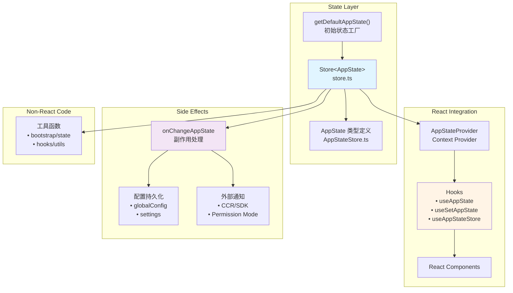

AppState 是 Claude Code CLI 应用的核心状态管理系统，采用**轻量级 Store 模式**实现 React 组件与非 React 代码之间的状态共享。该系统基于 `useSyncExternalStore` 构建了零依赖的状态管理方案，支持细粒度订阅、不可变更新和副作用处理。

## 架构概览

整个状态管理系统由五个核心模块组成，遵循**单一数据源**原则，所有应用状态集中存储在 AppState 对象中。系统通过 `Store` 抽象提供统一的访问接口，React 组件通过 hooks 订阅状态变化，非 React 代码通过 store 方法直接访问，而 `onChangeAppState` 回调机制则处理状态变更的副作用（如配置持久化、外部系统通知等）。



Sources: [store.ts](src/state/store.ts), [AppStateStore.ts](src/state/AppStateStore.ts#L1-L100), [AppState.tsx](src/state/AppState.tsx#L1-L100), [onChangeAppState.ts](src/state/onChangeAppState.ts#L1-L172)

## 核心组件详解

### 1. Store 实现：极简状态容器

`Store` 类型定义了一个通用的状态容器接口，支持**不可变更新**和**发布-订阅模式**。实现代码仅 35 行，却提供了完整的状态管理能力。`getState` 返回当前状态快照，`setState` 接受 updater 函数进行状态更新（自动进行 `Object.is` 浅比较以避免不必要的通知），`subscribe` 返回取消订阅函数以支持组件卸载时的自动清理。

Sources: [store.ts](src/state/store.ts#L1-L35)

### 2. AppState 类型：全局状态定义

AppState 类型通过 `DeepImmutable` 包装确保状态的不可变性，包含 **50+ 状态字段**，涵盖会话管理、工具权限、MCP 连接、任务队列、通知系统等各个方面。关键字段包括：`settings`（用户配置）、`toolPermissionContext`（权限上下文）、`tasks`（任务状态映射）、`mcp`（MCP 服务器连接）、`plugins`（插件状态）、`notifications`（通知队列）等。`getDefaultAppState` 工厂函数负责初始化默认值，其中权限模式根据是否为 teammate 会话动态设置（plan 模式或 default 模式）。

Sources: [AppStateStore.ts](src/state/AppStateStore.ts#L100-L250), [AppStateStore.ts](src/state/AppStateStore.ts#L400-L570)

### 3. React 集成：Provider 与 Hooks

`AppStateProvider` 组件在应用顶层创建 Store 实例并通过 Context 传递给子组件。Provider 接受 `initialState` 和 `onChangeAppState` 两个可选参数，分别用于自定义初始状态和注册状态变更回调。Provider 内部通过 `useState` 保证 store 实例的稳定性，通过 `useEffect` 处理 bypass permissions 模式的禁用逻辑，并通过 `useSettingsChange` 监听配置变更。

Sources: [AppState.tsx](src/state/AppState.tsx#L1-L100)

### 4. 订阅机制：细粒度更新

`useAppState` hook 是组件订阅状态的核心 API，接受 selector 函数参数，使用 `useSyncExternalStore` 实现细粒度订阅。只有当 selector 返回值发生变化（通过 `Object.is` 比较）时，组件才会重新渲染。这种设计鼓励**属性级订阅**而非对象级订阅，避免不必要的渲染。文档明确建议对多个独立字段使用多次 hook 调用，而不是返回新对象（这会导致每次都判定为变化）。

Sources: [AppState.tsx](src/state/AppState.tsx#L140-L180)

### 5. 副作用处理：onChangeAppState

`onChangeAppState` 回调是状态变更的**统一拦截点**，处理跨系统同步和持久化逻辑。该回调在每次 `setState` 调用后执行（状态确实发生变化时），接收新旧状态作为参数。核心职责包括：权限模式变更同步到 CCR/SDK、模型设置持久化到配置文件、expandedView 状态持久化、verbose 模式同步、认证相关缓存清理、环境变量重新应用等。这种集中式副作用处理避免了在多个 mutation 路径中重复同步逻辑。

Sources: [onChangeAppState.ts](src/state/onChangeAppState.ts#L1-L172)

## 使用模式与实践

### React 组件中的状态订阅

组件通过 `useAppState` 订阅特定状态切片，通过 `useSetAppState` 获取更新函数。例如 `StatusLine` 组件订阅 `permissionMode`、`additionalWorkingDirectories` 和 `statusLineText` 三个字段，使用 `useSetAppState` 获取更新函数，结合 refs 保持回调中访问最新值。这种模式避免了在依赖数组中添加频繁变化的状态值，同时保持了回调的稳定性。

```typescript
// 细粒度订阅示例：每个字段独立订阅
const permissionMode = useAppState(s => s.toolPermissionContext.mode)
const additionalWorkingDirectories = useAppState(s => s.toolPermissionContext.additionalWorkingDirectories)
const statusLineText = useAppState(s => s.statusLineText)
const setAppState = useSetAppState()
```

Sources: [StatusLine.tsx](src/components/StatusLine.tsx#L1-L50), [StatusLine.tsx](src/components/StatusLine.tsx#L140-L200)

### 状态更新模式

`setState` 接受 updater 函数，函数接收前一个状态并返回新状态对象。由于 AppState 使用 `DeepImmutable` 包装，更新时必须使用展开运算符或 immer 等不可变更新工具。状态变更会自动触发 `onChangeAppState` 回调，处理副作用如配置持久化和外部系统通知。`Object.is` 比较确保只有真正变化的更新才会触发监听器。

```typescript
// 不可变更新示例
setAppState(prev => ({
  ...prev,
  toolPermissionContext: {
    ...prev.toolPermissionContext,
    mode: newMode
  }
}))
```

Sources: [store.ts](src/state/store.ts#L16-L24)

### 非 React 代码的状态访问

非 React 环境（如工具函数、hooks 系统）通过 `useAppStateStore` 获取 store 引用，然后直接调用 `getState()` 和 `setState()` 方法。这种模式绕过了 React 的订阅机制，适用于一次性读写或跨组件协调。`bootstrap/state.ts` 中的全局状态管理也采用类似模式，通过函数式 getter/setter 暴露状态访问接口。

Sources: [AppState.tsx](src/state/AppState.tsx#L165-L170), [bootstrap/state.ts](src/bootstrap/state.ts#L400-L500)

### Selectors：派生状态计算

`selectors.ts` 提供纯函数选择器，从 AppState 中派生计算状态。例如 `getViewedTeammateTask` 选择器从 `viewingAgentTaskId` 和 `tasks` 映射中提取当前查看的 teammate 任务，并进行类型守卫验证。`getActiveAgentForInput` 选择器返回判别联合类型，用于类型安全的输入路由。这些选择器保持**无副作用**，仅进行数据提取和转换，不修改状态。

Sources: [selectors.ts](src/state/selectors.ts#L1-L77)

## 架构优势与设计权衡

### 优势分析

| 特性 | 描述 | 实现位置 |
|------|------|----------|
| **零依赖** | 基于 React 内置 hooks，无需第三方状态管理库 | store.ts |
| **细粒度订阅** | 通过 selector 函数实现属性级订阅，避免不必要渲染 | useAppState |
| **类型安全** | TypeScript 严格模式 + DeepImmutable 保证不可变性 | AppStateStore.ts |
| **统一副作用** | onChangeAppState 集中处理跨系统同步，避免逻辑分散 | onChangeAppState.ts |
| **React/非 React 兼容** | Store 抽象支持两种环境访问，架构灵活 | store.ts |
| **自动清理** | subscribe 返回取消订阅函数，配合 useEffect 自动清理 | store.ts |

Sources: [store.ts](src/state/store.ts), [AppState.tsx](src/state/AppState.tsx), [onChangeAppState.ts](src/state/onChangeAppState.ts)

### 设计权衡

**浅比较限制**：`Object.is` 浅比较意味着嵌套对象的引用必须改变才能触发更新。虽然这保证了性能，但要求开发者注意不可变更新模式。**集中式副作用**：`onChangeAppState` 虽然统一了副作用处理，但随着状态字段增加，该函数可能变得臃肿。未来可能需要拆分为多个专门的副作用处理器。**缺少中间件**：与 Redux 等框架不同，当前系统没有中间件机制，所有逻辑都在 `setState` 和 `onChangeAppState` 中直接处理。

Sources: [store.ts](src/state/store.ts#L16-L24), [onChangeAppState.ts](src/state/onChangeAppState.ts)

## 最佳实践总结

1. **细粒度订阅**：对多个独立字段使用多次 `useAppState` 调用，避免返回新对象的 selector
2. **不可变更新**：始终使用展开运算符或 immer 进行状态更新，确保嵌套对象的引用变化
3. **副作用隔离**：所有跨系统同步逻辑放在 `onChangeAppState` 中，避免在组件中直接处理
4. **类型安全**：利用 TypeScript 类型系统确保 selector 返回值类型正确，避免运行时错误
5. **性能优化**：对于复杂计算，考虑使用 selectors 模块集中管理派生状态
6. **测试友好**：通过 `initialState` 参数可以轻松注入测试状态，隔离测试环境

Sources: [AppState.tsx](src/state/AppState.tsx#L110-L140), [selectors.ts](src/state/selectors.ts)

## 延伸阅读

- **状态持久化机制**：[文件缓存与读取优化：FileStateCache 实现](13-wen-jian-huan-cun-yu-du-qu-you-hua-filestatecache-shi-xian) — 了解文件状态如何与 AppState 集成
- **会话恢复**：[会话持久化：sessionStorage 与对话恢复](14-hui-hua-chi-jiu-hua-sessionstorage-yu-dui-hua-hui-fu) — 探索会话状态如何持久化和恢复
- **权限系统**：[权限模式系统：default、plan、auto、bypass 等模式解析](9-quan-xian-mo-shi-xi-tong-default-plan-auto-bypass-deng-mo-shi-jie-xi) — 深入理解 `toolPermissionContext` 的设计
- **React 终端渲染**：[Ink 框架集成：React 终端渲染引擎](29-ink-kuang-jia-ji-cheng-react-zhong-duan-xuan-ran-yin-qing) — 了解 React 如何在终端环境中运行