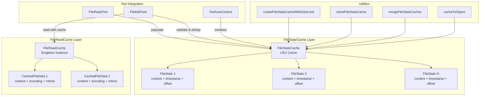
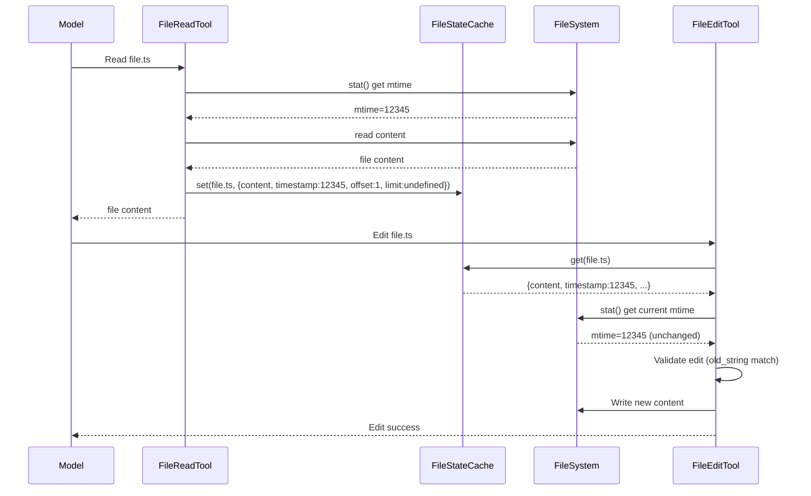

Claude Code 的文件缓存系统采用双层次架构设计，通过 **FileStateCache** 和 **FileReadCache** 两个独立但互补的缓存层，实现了文件读取去重、编辑前置验证、并发冲突检测等核心功能。该系统基于 LRU（Least Recently Used）算法构建，结合路径规范化、时间戳验证和内存边界控制，在保证数据一致性的前提下最大化 I/O 性能。

## 缓存架构总览

Claude Code 的文件缓存分为两个职责明确的层次：**FileStateCache** 作为工具执行上下文（ToolUseContext）的一部分，追踪模型已读取的文件状态，用于编辑前置验证和去重优化；**FileReadCache** 作为单例服务，为文件编辑工具提供基于修改时间的自动失效缓存，避免重复的编码检测和磁盘读取。这种分离设计使得读取追踪和性能优化可以独立演进——FileStateCache 关注"模型看到了什么"，FileReadCache 关注"如何高效读取文件"。



FileStateCache 的核心数据结构 **FileState** 包含五个字段：`content` 存储文件原始内容（用于差异比较和去重检测），`timestamp` 记录文件最后修改时间的毫秒数（用于检测并发修改），`offset` 和 `limit` 标识模型读取的行范围（用于范围匹配去重），`isPartialView` 标志位标识该条目是否来自自动注入的部分视图（如 CLAUDE.md 移除 HTML 注释后的内容）。这种设计使得系统能够区分"模型实际看到的完整内容"和"磁盘上的原始字节"，从而在编辑操作时强制要求显式读取以保证数据完整性。

Sources: [fileStateCache.ts](src/utils/fileStateCache.ts#L4-L15)

## FileStateCache 核心实现

FileStateCache 类封装了 `lru-cache` 库，在标准的 LRU 淘汰策略之上增加了 **双层限制机制**：通过 `max` 参数限制最大条目数量（默认 100），通过 `maxSize` 参数限制总字节大小（默认 25MB）。每个条目的大小通过 `Buffer.byteLength(value.content)` 动态计算，确保内存占用可预测且可控。当缓存达到任一限制时，LRU 算法自动淘汰最久未访问的条目，无需手动干预。

```typescript
// 构造函数展示双层限制机制
constructor(maxEntries: number, maxSizeBytes: number) {
  this.cache = new LRUCache<string, FileState>({
    max: maxEntries,           // 条目数量上限
    maxSize: maxSizeBytes,     // 字节大小上限
    sizeCalculation: value => Math.max(1, Buffer.byteLength(value.content)),
  })
}
```

**路径规范化**是 FileStateCache 的关键特性。所有路径键在访问前都通过 Node.js 的 `normalize()` 函数处理，这解决了三个实际问题：相对路径与绝对路径的统一（`./foo.ts` 和 `/project/foo.ts` 指向同一文件），冗余路径段的消除（`/foo/../bar` 规范化为 `/bar`），以及跨平台路径分隔符的兼容（Windows 的 `\` 和 Unix 的 `/`）。这种规范化确保了无论调用方如何传递路径，只要指向同一物理文件，就能获得缓存命中。

Sources: [fileStateCache.ts](src/utils/fileStateCache.ts#L30-L48)

### 工厂函数与辅助工具

`createFileStateCacheWithSizeLimit()` 工厂函数提供了标准的缓存创建入口，接受 `maxEntries` 和可选的 `maxSizeBytes` 参数（默认 25MB）。该设计允许不同场景使用不同的容量配置——例如，主会话可能使用较大的缓存以支持复杂项目，而子代理可能使用较小的缓存以节省内存。**图片文件不进入 FileStateCache**（它们在 FileReadTool 中有独立的 token 预算控制），因此大小限制主要针对文本文件、Jupyter Notebook 和其他可编辑内容。

```typescript
// 缓存大小限制的默认配置
export const READ_FILE_STATE_CACHE_SIZE = 100          // 100个文件
const DEFAULT_MAX_CACHE_SIZE_BYTES = 25 * 1024 * 1024  // 25MB
```

辅助函数集提供了缓存操作的高级抽象：`cacheToObject()` 将缓存转换为普通对象（用于 compact 服务的 API 调用序列化），`cacheKeys()` 提取所有路径键（用于调试和监控），`cloneFileStateCache()` 创建配置和内容完全相同的副本（用于子代理上下文隔离），`mergeFileStateCaches()` 基于时间戳合并两个缓存（用于并发会话的状态同步）。这些工具函数遵循单一职责原则，确保缓存操作的可组合性和可测试性。

Sources: [fileStateCache.ts](src/utils/fileStateCache.ts#L101-L142)

## FileReadCache 实现机制

**FileReadCache** 是一个轻量级的单例缓存，专门为 FileEditTool 的文件读取操作优化。与 FileStateCache 不同，它使用简单的 `Map<string, CachedFileData>` 数据结构，并通过 **mtime（修改时间）自动失效机制** 确保缓存一致性。每次读取文件时，先通过 `fs.statSync()` 获取文件的 `mtimeMs`，如果缓存条目的 `mtime` 与当前文件的修改时间匹配，则直接返回缓存内容；否则从磁盘读取并更新缓存。

```typescript
// FileReadCache 的核心读取逻辑
readFile(filePath: string): { content: string; encoding: BufferEncoding } {
  const stats = fs.statSync(filePath)  // 获取修改时间
  const cachedData = this.cache.get(filePath)
  
  // 缓存命中且修改时间未变
  if (cachedData && cachedData.mtime === stats.mtimeMs) {
    return { content: cachedData.content, encoding: cachedData.encoding }
  }
  
  // 缓存未命中或已过期 - 从磁盘读取
  const encoding = detectFileEncoding(filePath)
  const content = fs.readFileSync(filePath, { encoding }).replaceAll('\r\n', '\n')
  this.cache.set(filePath, { content, encoding, mtime: stats.mtimeMs })
  
  // 简单的 FIFO 淘汰策略
  if (this.cache.size > this.maxCacheSize) {
    const firstKey = this.cache.keys().next().value
    if (firstKey) this.cache.delete(firstKey)
  }
  
  return { content, encoding }
}
```

FileReadCache 的设计哲学是 **"正确性优先于性能"**。它不使用复杂的 LRU 算法，而是依赖文件系统的修改时间戳作为缓存失效的权威来源。这种设计避免了 FileStateCache 中可能出现的时间戳不一致问题（例如，模型读取文件后，外部进程修改了文件，但 FileStateCache 仍持有旧内容）。FileReadCache 的淘汰策略也很简单：当缓存大小超过 1000 条时，删除最早插入的条目（FIFO）。这种策略在编辑操作密集的场景中足够高效，因为编辑工具通常会反复操作同一组文件。

Sources: [fileReadCache.ts](src/utils/fileReadCache.ts#L14-L68)

### 两个缓存系统的对比

| 特性 | FileStateCache | FileReadCache |
|------|---------------|---------------|
| **主要用途** | 追踪模型已读取的文件状态 | 优化文件编辑工具的读取性能 |
| **数据结构** | LRUCache（双层限制） | Map（FIFO 淘汰） |
| **大小限制** | 100 条目 / 25MB | 1000 条目 |
| **失效机制** | 手动删除或 LRU 淘汰 | 基于 mtime 自动失效 |
| **路径处理** | 规范化所有路径键 | 直接使用原始路径 |
| **生命周期** | 随 ToolUseContext 创建 | 全局单例 |
| **存储内容** | FileState（含 offset/limit/isPartialView） | CachedFileData（含 encoding） |
| **使用场景** | FileReadTool, FileEditTool | FileEditTool |

## 工具集成与数据流

FileStateCache 通过 **ToolUseContext** 注入到所有工具的执行上下文中。FileReadTool 在成功读取文件后，通过 `readFileState.set()` 将文件内容、修改时间、读取范围等信息存入缓存；FileEditTool 在执行编辑前，通过 `readFileState.get()` 检查文件是否已被读取，如果未读取或仅读取了部分视图（`isPartialView=true`），则拒绝编辑操作并要求显式读取。这种 **"读后写"强制策略** 确保模型始终基于最新的完整文件内容做出编辑决策，避免基于过期或部分信息产生错误的修改。



### 去重优化与性能提升

FileReadTool 实现了 **智能读取去重** 机制：在读取文件前，检查 `readFileState` 中是否存在相同路径、相同 offset/limit 范围的条目，如果存在且文件的当前修改时间与缓存条目的 `timestamp` 匹配，则返回一个轻量级的 `file_unchanged` 存根（stub），而不是重新发送完整内容。这个优化在长对话中尤其重要——数据分析显示，约 18% 的文件读取操作是重复请求（模型在同一会话中多次读取同一文件），去重机制将这些重复操作转化为常数时间的缓存查找，显著降低了 token 消耗和 API 调用延迟。

```typescript
// FileReadTool 的去重逻辑（简化版）
const existingState = readFileState.get(fullFilePath)
if (existingState && !existingState.isPartialView && existingState.offset !== undefined) {
  const rangeMatch = existingState.offset === offset && existingState.limit === limit
  if (rangeMatch) {
    const mtimeMs = await getFileModificationTimeAsync(fullFilePath)
    if (mtimeMs === existingState.timestamp) {
      logEvent('tengu_file_read_dedup', { ext: getFileExtensionForAnalytics(fullFilePath) })
      return { data: { type: 'file_unchanged', file: { filePath: file_path } } }
    }
  }
}
```

去重机制的关键约束是 **仅对完整的 Read 操作生效**（通过 `offset !== undefined` 判断）。FileEditTool 和 FileWriteTool 在写入后也会更新 `readFileState`，但它们设置的 `offset=undefined`，这标识该条目来自编辑操作而非读取操作。如果允许对编辑后的条目去重，模型会错误地引用编辑前的读取内容，导致逻辑错误。这种类型区分机制确保了去重优化不会破坏数据一致性。

Sources: [FileReadTool.ts](src/tools/FileReadTool/FileReadTool.ts#L530-L573)

### 编辑前置验证与冲突检测

FileEditTool 的 `validateInput()` 方法通过 `readFileState` 执行两项关键检查：**存在性验证**（确保文件已被读取，`readFileState.get(fullFilePath)` 返回非空值）和 **完整性验证**（确保读取的不是部分视图，`!readTimestamp.isPartialView`）。如果验证失败，返回错误码 6 并提示 "File has not been read yet. Read it first before writing to it."。这种强制读取策略防止模型基于内存中的陈旧假设或 CLAUDE.md 的简化视图进行编辑，确保每次修改都基于最新的磁盘状态。

```typescript
// FileEditTool 的前置验证逻辑
const readTimestamp = toolUseContext.readFileState.get(fullFilePath)
if (!readTimestamp || readTimestamp.isPartialView) {
  return {
    result: false,
    behavior: 'ask',
    message: 'File has not been read yet. Read it first before writing to it.',
    errorCode: 6,
  }
}
```

**并发修改检测** 是 FileStateCache 的另一项安全机制。在编辑前，FileEditTool 通过 `getFileModificationTime()` 获取文件的当前修改时间，如果该时间晚于 `readFileState` 中记录的 `timestamp`，则表明文件在读取后被外部进程修改过。此时，系统会执行 **内容比对降级**：如果是完整读取（`offset=undefined && limit=undefined`），则比较当前磁盘内容与缓存内容，如果内容相同则允许编辑（可能是云同步或防病毒软件触发的元数据更新）；如果是部分读取，则直接拒绝编辑并要求重新读取。

Sources: [FileEditTool.ts](src/tools/FileEditTool/FileEditTool.ts#L275-L300)

## 缓存生命周期管理

### 克隆与合并操作

`cloneFileStateCache()` 函数实现了 **深度克隆** 语义：创建一个配置相同的新 FileStateCache 实例（继承原缓存的 `max` 和 `maxSize`），然后通过 `dump()` 和 `load()` 方法序列化并恢复所有条目。这种设计用于子代理的上下文隔离——子代理继承父代理的文件读取状态，但后续的读取操作不会污染父代理的缓存。克隆操作的时间复杂度为 O(n)，其中 n 是缓存条目数，但由于缓存大小有上限（100 条目），实际性能开销可控。

```typescript
// 克隆逻辑的实现
export function cloneFileStateCache(cache: FileStateCache): FileStateCache {
  const cloned = createFileStateCacheWithSizeLimit(cache.max, cache.maxSize)
  cloned.load(cache.dump())  // 序列化 + 反序列化
  return cloned
}
```

`mergeFileStateCaches()` 函数用于 **时间戳优先合并**：遍历第二个缓存的所有条目，如果该路径在第一个缓存中不存在，或新条目的 `timestamp` 更新，则用新条目覆盖。这种合并策略确保了在并发会话（如多个子代理同时读取文件）的场景下，最终状态反映最新的文件版本。合并操作创建一个新的缓存实例，不修改输入参数，符合函数式编程的不可变性原则。

Sources: [fileStateCache.ts](src/utils/fileStateCache.ts#L120-L142)

### 序列化与持久化

FileStateCache 通过 `dump()` 和 `load()` 方法支持 **快照式持久化**。`dump()` 返回一个可 JSON 序列化的数组，包含所有缓存条目的键、值和 LRU 元数据；`load()` 从该数组恢复缓存状态，包括 LRU 的访问顺序。这种设计用于会话恢复（resume）场景：在会话结束时，将 `readFileState` 序列化到磁盘；在恢复会话时，重新加载缓存，避免重新读取所有已访问文件。`cacheToObject()` 辅助函数提供了一个简化的序列化接口，将缓存转换为普通的 JavaScript 对象，主要用于 compact 服务的 API 调用（compact 需要将文件状态发送给模型以生成摘要）。

```typescript
// compact.ts 中使用 cacheToObject 的示例
import { cacheToObject } from '../../utils/fileStateCache.js'

// 在 compact 前，将 readFileState 转换为可序列化对象
const fileStateForAPI = cacheToObject(context.readFileState)
```

需要注意的是，**FileStateCache 不持久化到 AppState**。它是 ToolUseContext 的运行时属性，随会话创建而创建，随会话结束而销毁。如果需要跨会话保留文件读取状态，必须通过会话存储机制（sessionStorage）显式序列化。这种设计避免了长期运行会话的内存泄漏——缓存在会话结束时自动释放，无需手动清理。

Sources: [compact.ts](src/services/compact/compact.ts#L49)

## 内存管理与性能优化

### 双层限制策略

FileStateCache 的内存管理采用 **双层防护**：条目数量限制（`max=100`）防止单个小文件占用过多条目，字节大小限制（`maxSize=25MB`）防止单个大文件耗尽内存。LRU 算法在任一限制达到时自动淘汰最久未访问的条目，确保缓存始终在安全边界内运行。`sizeCalculation` 函数使用 `Math.max(1, Buffer.byteLength(value.content))` 计算每个条目的大小，确保空文件至少占用 1 字节的配额（避免除零错误），同时正确处理多字节 UTF-8 字符（如中文、emoji）。

```typescript
// LRU 缓存的大小计算逻辑
sizeCalculation: value => Math.max(1, Buffer.byteLength(value.content))
```

在实际运行中，25MB 的限制足以容纳大多数项目的活跃文件集。对于一个典型的 TypeScript 项目（平均文件大小 5KB），缓存可容纳约 5000 个文件；对于一个包含大型 JSON 数据文件的项目（单文件 10MB），缓存可容纳 2-3 个文件。当缓存达到容量上限时，LRU 算法优先淘汰最久未访问的文件，这符合实际使用模式——频繁访问的文件（如配置文件、核心模块）会保留在缓存中，临时文件和一次性读取的文件会被自动清理。

Sources: [fileStateCache.ts](src/utils/fileStateCache.ts#L17-L38)

### 路径规范化的性能影响

路径规范化通过 `path.normalize()` 实现，该函数在 Node.js 中是同步操作，时间复杂度为 O(n)，其中 n 是路径字符串长度。对于典型的项目路径（50-200 字符），规范化开销可忽略不计（微秒级）。然而，在高频访问场景下（如批量读取数千个文件），累积的规范化成本可能变得显著。未来的优化方向包括：**缓存规范化结果**（维护一个 `originalPath -> normalizedPath` 的映射表），或 **在调用方侧预规范化**（如 FileReadTool 的 `expandPath()` 已经执行了部分规范化工作）。

当前实现的权衡是 **正确性优先于极致性能**。路径规范化确保了缓存键的一致性，避免了因路径表示差异导致的缓存未命中（例如，`./foo.ts` 和 `foo.ts` 应该命中同一缓存条目）。在大多数实际场景中，文件读取的磁盘 I/O 延迟（毫秒级）远超路径规范化的 CPU 开销（微秒级），因此该优化的收益有限。但在内存缓存命中场景下（去重优化），规范化的相对成本会增加，这是未来性能优化的潜在目标。

### 与 compact 服务的集成

Compact 服务在生成对话摘要前，通过 `cacheToObject()` 将 `readFileState` 转换为普通对象，并将其包含在发送给模型的上下文中。这使得模型在生成摘要时能够参考已读取文件的内容，生成更准确的摘要（例如，"用户修改了 authentication.ts 中的登录逻辑，将密码验证从同步改为异步"）。转换操作的时间复杂度为 O(n)，但由于缓存大小有上限，实际开销可控。Compact 服务不修改原始 `readFileState`，确保摘要生成过程不会影响工具执行的文件状态追踪。

在 compact 后的 **文件状态恢复** 阶段，系统会重新读取最重要的 5 个文件（通过 POST_COMPACT_MAX_FILES_TO_RESTORE 配置），每个文件的 token 预算为 5000（POST_COMPACT_MAX_TOKENS_PER_FILE）。这些重新读取的文件会更新 `readFileState`，确保模型在 compact 后仍能访问关键文件的内容。文件选择基于启发式规则（如最近修改的文件、被多次引用的文件），而非简单的 LRU 顺序，这确保了恢复的文件与当前任务的相关性。

Sources: [compact.ts](src/services/compact/compact.ts#L122-L130)

## 总结与最佳实践

Claude Code 的文件缓存系统通过 **双层次设计**（FileStateCache 追踪读取状态，FileReadCache 优化编辑性能）、**路径规范化**（确保跨平台一致性）、**双层内存限制**（条目数 + 字节大小）和 **时间戳验证**（检测并发修改），构建了一个既高效又安全的文件访问层。对于开发者而言，理解这些机制有助于编写更高效的工具集成代码：始终通过 `expandPath()` 规范化路径，在编辑前确保文件已被读取，利用去重机制减少重复 I/O，以及在子代理中正确克隆缓存状态。

未来可能的优化方向包括：**增量式缓存更新**（只存储文件的差异而非完整内容），**跨会话缓存持久化**（将常用文件的缓存保存到磁盘以加速会话启动），以及 **智能预读取**（基于访问模式预测性地加载可能需要的文件）。这些优化需要在内存占用、磁盘 I/O 和缓存命中率之间找到平衡，是 Claude Code 性能演进的重要方向。