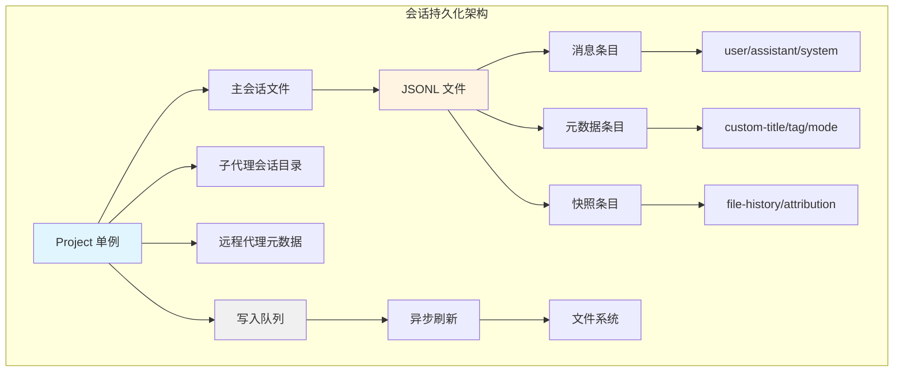
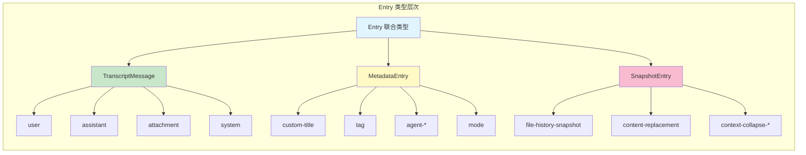
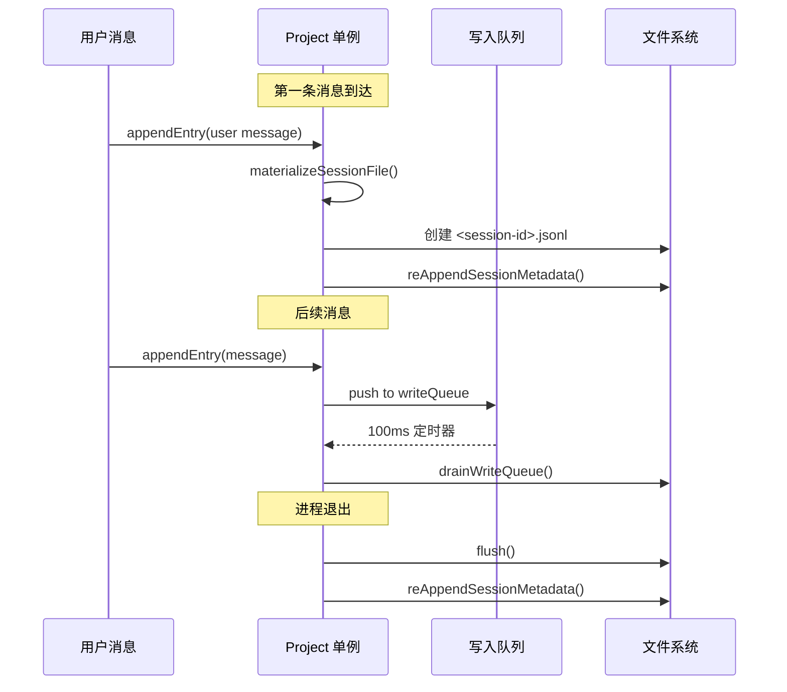
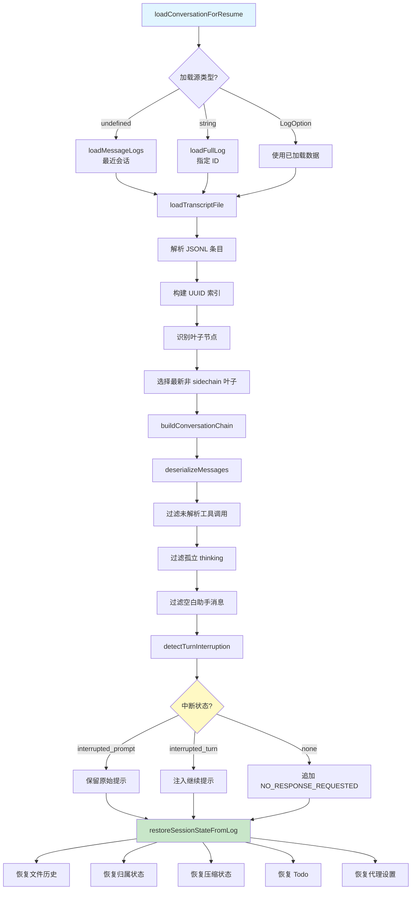

Claude Code 的会话持久化系统是 CLI 应用的核心基础设施，负责将对话历史、元数据、文件状态等信息持久化到本地磁盘，并在用户重启应用或执行 `/resume` 命令时完整恢复会话状态。该系统采用 **JSONL (JSON Lines) 格式**进行增量追加存储，通过 **parentUuid 链式结构**构建对话树，支持高效的写入、读取和恢复操作。

## 架构概览：分层存储与单例管理

会话持久化系统的核心是 `Project` 单例类，它管理着当前项目的所有会话文件。每个会话对应一个独立的 `.jsonl` 文件，存储在 `~/.claude/projects/<project-hash>/<session-id>.jsonl` 路径下。系统采用 **异步写入队列** 机制，避免阻塞主线程，同时保证数据的完整性。`Project` 类维护着会话文件的文件描述符、写入队列、元数据缓存等状态，确保在进程退出时能够正确刷新所有待写入的数据。

Sources: [sessionStorage.ts](src/utils/sessionStorage.ts#L440-L467)

**存储路径结构**遵循以下约定：项目目录通过 `getProjectDir()` 计算得出，它将工作目录路径进行哈希处理（使用 `sanitizePath` 和 `djb2Hash`），生成唯一的目录名称。会话文件名直接使用 `session-uuid.jsonl` 格式，确保每个会话都有唯一的标识。子代理的会话文件存储在 `subagents/` 子目录下，支持嵌套的子目录结构（如 `subagents/workflows/<runId>/`）。

Sources: [sessionStorage.ts](src/utils/sessionStorage.ts#L202-L258)

**元数据缓存机制**在 `Project` 类中维护了当前会话的关键元数据，包括 `currentSessionTitle`（自定义标题）、`currentSessionTag`（标签）、`currentSessionAgentName`（代理名称）、`currentSessionAgentColor`（代理颜色）、`currentSessionMode`（会话模式）等。这些缓存值在会话恢复时从磁盘加载，并在会话过程中实时更新，确保在进程退出时能够通过 `reAppendSessionMetadata()` 将最新的元数据追加到文件尾部。

Sources: [sessionStorage.ts](src/utils/sessionStorage.ts#L2758-L2799)

## 数据模型：Entry 类型系统与 parentUuid 链

JSONL 文件中的每一行都是一个独立的 JSON 对象，类型为 `Entry`。该类型是一个联合类型，包含了所有可能的条目类型。**核心消息类型**包括 `user`（用户消息）、`assistant`（助手消息）、`attachment`（附件消息）、`system`（系统消息），这些类型通过 `isTranscriptMessage()` 类型守卫进行判断，只有这些类型的条目才会被加载到对话链中参与 API 调用。

Sources: [sessionStorage.ts](src/utils/sessionStorage.ts#L139-L146)

**元数据条目类型**用于存储会话级别的信息，包括：
- `custom-title`：用户自定义的会话标题
- `ai-title`：AI 生成的会话标题（优先级低于用户标题）
- `tag`：会话标签（用于搜索和过滤）
- `agent-name` / `agent-color`：代理的名称和颜色
- `agent-setting`：使用的代理定义
- `mode`：会话模式（coordinator 或 normal）
- `worktree-state`：Worktree 会话状态
- `pr-link`：关联的 GitHub PR 信息

Sources: [types/logs.ts](src/types/logs.ts#L55-L171)

**parentUuid 链式结构**是构建对话树的核心机制。每个 `TranscriptMessage` 都包含 `uuid`（唯一标识符）和 `parentUuid`（父消息的 uuid）字段。系统通过 `buildConversationChain()` 函数从叶子节点（最新的消息）开始，沿着 `parentUuid` 向上遍历，直到根节点（`parentUuid` 为 null 的消息），然后反转数组，得到从根到叶的线性对话序列。

Sources: [sessionStorage.ts](src/utils/sessionStorage.ts#L2069-L2094)

**并行工具调用的恢复**是一个复杂的问题。在流式输出中，模型可能同时发起多个 `tool_use`，每个 `tool_use` 会生成独立的 `assistant` 消息（具有相同的 `message.id` 但不同的 `uuid`），每个 `tool_result` 的 `parentUuid` 指向其对应的 `assistant` 消息。这导致对话拓扑从链变成了 **DAG（有向无环图）**。`recoverOrphanedParallelToolResults()` 函数通过检测具有相同 `message.id` 的助手消息组，恢复被单链遍历遗漏的兄弟节点和对应的工具结果。

Sources: [sessionStorage.ts](src/utils/sessionStorage.ts#L2118-L2199)

| 消息类型 | parentUuid 行为 | 是否参与对话链 | 特殊处理 |
|---------|----------------|--------------|---------|
| user | 指向前一条消息 | ✓ | 过滤 isMeta、isCompactSummary |
| assistant | 指向对应的 user | ✓ | 处理并行 tool_use |
| attachment | 指向前一条消息 | ✓ | 迁移遗留类型 |
| system | 指向前一条消息 | ✓ | - |
| progress | 已移除 | ✗ | 旧版本兼容处理 |

## 写入流程：异步队列与元数据追加

会话写入采用 **两阶段策略**：在用户发送第一条消息之前，系统将条目缓存在内存的 `pendingEntries` 数组中；当第一条用户或助手消息到达时，触发 `materializeSessionFile()`，创建会话文件，写入缓存的元数据（通过 `reAppendSessionMetadata()`），然后刷新缓冲的条目。这种延迟创建机制避免了创建大量空会话文件。

Sources: [sessionStorage.ts](src/utils/sessionStorage.ts#L976-L991)

**异步写入队列**由 `writeQueue` 和 `activeDrain` 两个核心变量管理。`appendEntry()` 将条目推入 `writeQueue`，并设置一个定时器在 100ms 后触发 `drainWriteQueue()`。`drainWriteQueue()` 将队列中的所有条目序列化为 JSONL 格式，通过 `appendFile` 追加到文件。如果在刷新过程中又有新的写入请求，它们会被添加到队列中，等待下一次刷新周期。

Sources: [sessionStorage.ts](src/utils/sessionStorage.ts#L730-L799)

**元数据追加机制**确保会话的关键信息始终在文件尾部可见。`reAppendSessionMetadata()` 在进程退出时被清理处理器调用，它将当前缓存的 `custom-title`、`tag`、`agent-name`、`mode` 等元数据重新追加到文件尾部。这是因为 `readLiteMetadata()` 只读取文件的最后 64KB（`LITE_READ_BUF_SIZE`），如果元数据被大量的对话消息推到 64KB 之外，恢复时将无法读取到这些元数据。通过在退出时重新追加，确保元数据始终在读取窗口内。

Sources: [sessionStorage.ts](src/utils/sessionStorage.ts#L782-L839)

**消息删除与墓碑机制**通过 `removeMessageByUuid()` 实现，主要用于删除流式输出失败时产生的孤立消息。该函数读取文件尾部（最后 64KB），定位目标 `uuid` 所在的行，通过 `ftruncate` 截断文件，然后重新追加后续的行。如果目标不在尾部窗口内，则回退到读取整个文件并重写（受 `MAX_TOMBSTONE_REWRITE_BYTES` 限制，防止 OOM）。

Sources: [sessionStorage.ts](src/utils/sessionStorage.ts#L871-L951)

## 恢复流程：加载、过滤与状态重建

会话恢复是从磁盘加载 JSONL 文件并重建对话状态的过程，核心函数是 `loadConversationForResume()`。该函数支持三种加载源：**自动选择最近会话**（`--continue`，source 为 undefined）、**指定会话 ID**（source 为字符串）、**直接使用已加载的 LogOption**。加载流程包括文件读取、对话链构建、消息过滤、状态恢复等多个阶段。

Sources: [conversationRecovery.ts](src/utils/conversationRecovery.ts#L456-L500)

**文件加载与链构建**首先通过 `loadTranscriptFile()` 读取 JSONL 文件，将每行解析为 `Entry` 对象，构建 `Map<UUID, TranscriptMessage>` 索引。然后识别所有叶子节点（`leafUuids`，即没有其他消息的 `parentUuid` 指向它的消息），选择最新的非 sidechain 叶子节点作为对话链的终点。最后调用 `buildConversationChain()` 从叶子向根遍历，构建线性对话序列。

Sources: [conversationRecovery.ts](src/utils/conversationRecovery.ts#L416-L440)

**消息过滤与反序列化**通过 `deserializeMessagesWithInterruptDetection()` 处理加载的消息：
1. **迁移遗留附件类型**：将 `new_file` 转换为 `file`，为旧附件补充 `displayPath` 字段
2. **过滤未解析的工具调用**：删除没有对应 `tool_result` 的 `tool_use` 及其后续消息
3. **过滤孤立的 thinking 消息**：删除仅包含 thinking 块的助手消息（流式输出中断导致）
4. **过滤纯空白助手消息**：删除仅包含空白文本的助手消息

Sources: [conversationRecovery.ts](src/utils/conversationRecovery.ts#L154-L252)

**中断状态检测**是恢复流程的关键逻辑，通过 `detectTurnInterruption()` 实现。系统检查过滤后最后一条相关消息的类型：
- **assistant**：会话正常结束（`kind: 'none'`）
- **user (纯文本)**：用户发送了提示但未开始响应（`kind: 'interrupted_prompt'`）
- **user (tool_result)**：工具执行中中断（`kind: 'interrupted_turn'`，自动转换为 `interrupted_prompt` 并注入 "Continue from where you left off."）
- **attachment**：用户提供了附件但未响应（`kind: 'interrupted_turn'`）

Sources: [conversationRecovery.ts](src/utils/conversationRecovery.ts#L272-L333)

**状态重建**包括多个子系统：
1. **文件历史快照**：通过 `fileHistoryRestoreStateFromLog()` 恢复文件编辑历史
2. **归属快照**：通过 `attributionRestoreStateFromLog()` 恢复提交归属状态
3. **上下文压缩状态**：通过 `restoreFromEntries()` 恢复压缩提交日志和暂存快照
4. **Todo 状态**：从对话链中提取最后的 TodoWrite 工具调用，恢复待办事项
5. **代理设置**：通过 `restoreAgentFromSession()` 恢复代理类型和模型覆盖

Sources: [sessionRestore.ts](src/utils/sessionRestore.ts#L99-L150)

## 高级特性：远程同步与 Worktree 支持

**远程会话同步**支持从 Claude Code Remote (CCR) 同步会话数据。`hydrateRemoteSession()` 通过 `sessionIngress.getSessionLogs()` 从远程服务器获取会话日志，然后覆盖本地 JSONL 文件。`hydrateFromCCRv2InternalEvents()` 支持 CCR v2 的内部事件格式，分别获取前台会话事件和子代理事件，写入对应的会话文件。系统维护了 `remoteIngressUrl` 状态，确保后续的持久化操作正确路由到远程服务器。

Sources: [sessionStorage.ts](src/utils/sessionStorage.ts#L1587-L1699)

**Worktree 会话恢复**通过 `PersistedWorktreeSession` 类型记录 Worktree 状态，包括原始工作目录、Worktree 路径、分支信息等。在会话结束时，系统通过 `saveWorktreeState()` 将当前 Worktree 状态（或 null，表示已退出）写入 JSONL。恢复时，`restoreWorktreeSession()` 检查 Worktree 路径是否仍然存在，如果存在则恢复 Worktree 环境上下文。

Sources: [types/logs.ts](src/types/logs.ts#L149-L171)

**内容替换记录**用于处理上下文压缩时的内容块替换。当压缩服务将大型内容块替换为小型存根时，系统通过 `recordContentReplacement()` 记录替换决策（包括原始内容的哈希、替换后的存根等）。在恢复时，这些记录被用于确保提示缓存的稳定性，避免因内容变化导致缓存失效。

Sources: [types/logs.ts](src/types/logs.ts#L181-L186)

**轻量级元数据读取**通过 `readLiteMetadata()` 实现高效的会话列表加载。该函数只读取 JSONL 文件的头尾各 64KB，通过 `extractLastJsonStringField()` 提取 `customTitle`、`tag`、`agentName` 等字段，通过 `extractFirstPromptFromHead()` 从头部提取第一个用户提示作为默认标题。这种设计避免了在列出会话时解析整个文件（可能达到 GB 级别），显著提升了性能。

Sources: [sessionStoragePortable.ts](src/utils/sessionStoragePortable.ts#L16-L150)

## 性能优化与安全边界

**文件大小限制**是防止 OOM 的关键安全措施。`MAX_TRANSCRIPT_READ_BYTES`（50 MB）限制读取整个会话文件的大小，`MAX_TOMBSTONE_REWRITE_BYTES`（50 MB）限制删除消息时的文件重写大小。当文件超过这些限制时，系统会跳过相应的操作并记录警告日志，而不是尝试处理可能导致内存耗尽的大型文件。

Sources: [sessionStorage.ts](src/utils/sessionStorage.ts#L121-L229)

**延迟文件创建**避免了创建大量空会话文件。系统只在第一条用户或助手消息到达时才创建会话文件，在此之前所有条目都缓存在内存中。这种设计特别适用于用户启动会话后立即退出的场景（如查看帮助信息），避免了生成无意义的空会话。

Sources: [sessionStorage.ts](src/utils/sessionStorage.ts#L976-L991)

**清理周期配置**支持用户通过 `cleanupPeriodDays` 设置控制会话文件的自动清理。当设置为 0 时，`shouldSkipPersistence()` 返回 true，系统完全跳过会话持久化（包括元数据追加）。这在测试环境或用户明确禁用持久化时非常有用。

Sources: [sessionStorage.ts](src/utils/sessionStorage.ts#L960-L970)

| 配置项 | 默认值 | 作用 | 安全影响 |
|-------|-------|------|---------|
| `MAX_TRANSCRIPT_READ_BYTES` | 50 MB | 限制完整读取大小 | 防止 OOM |
| `MAX_TOMBSTONE_REWRITE_BYTES` | 50 MB | 限制删除重写大小 | 防止 OOM |
| `LITE_READ_BUF_SIZE` | 64 KB | 轻量读取缓冲 | 平衡性能与准确性 |
| `cleanupPeriodDays` | - | 自动清理周期 | 数据保留策略 |
| `TEST_ENABLE_SESSION_PERSISTENCE` | - | 测试环境持久化开关 | 隔离测试数据 |

**并发会话管理**通过 `sessionProjectDir` 和 `sessionId` 的原子绑定确保一致性。`switchSession()` 函数同时更新这两个状态，避免出现会话 ID 与项目目录不匹配的脑裂情况（历史上曾因 `getCwd()` 在模块加载时执行导致路径不一致）。

Sources: [sessionStorage.ts](src/utils/sessionStorage.ts#L108-L112)

会话持久化系统是 Claude Code 用户体验的基石，它通过精心设计的 JSONL 格式、高效的异步写入队列、健壮的恢复逻辑，确保了用户能够在任何时候中断和恢复工作，而不会丢失对话上下文。系统的分层架构和丰富的元数据支持，为会话搜索、历史浏览、远程同步等高级功能提供了坚实的基础。