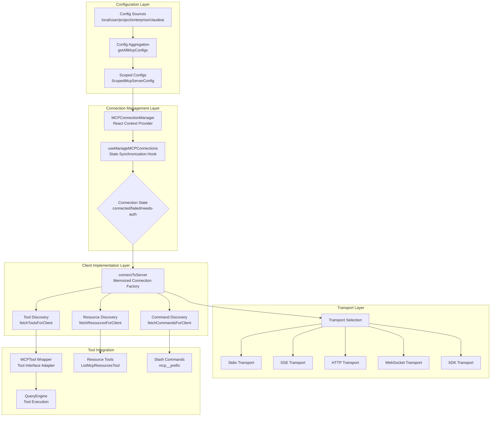
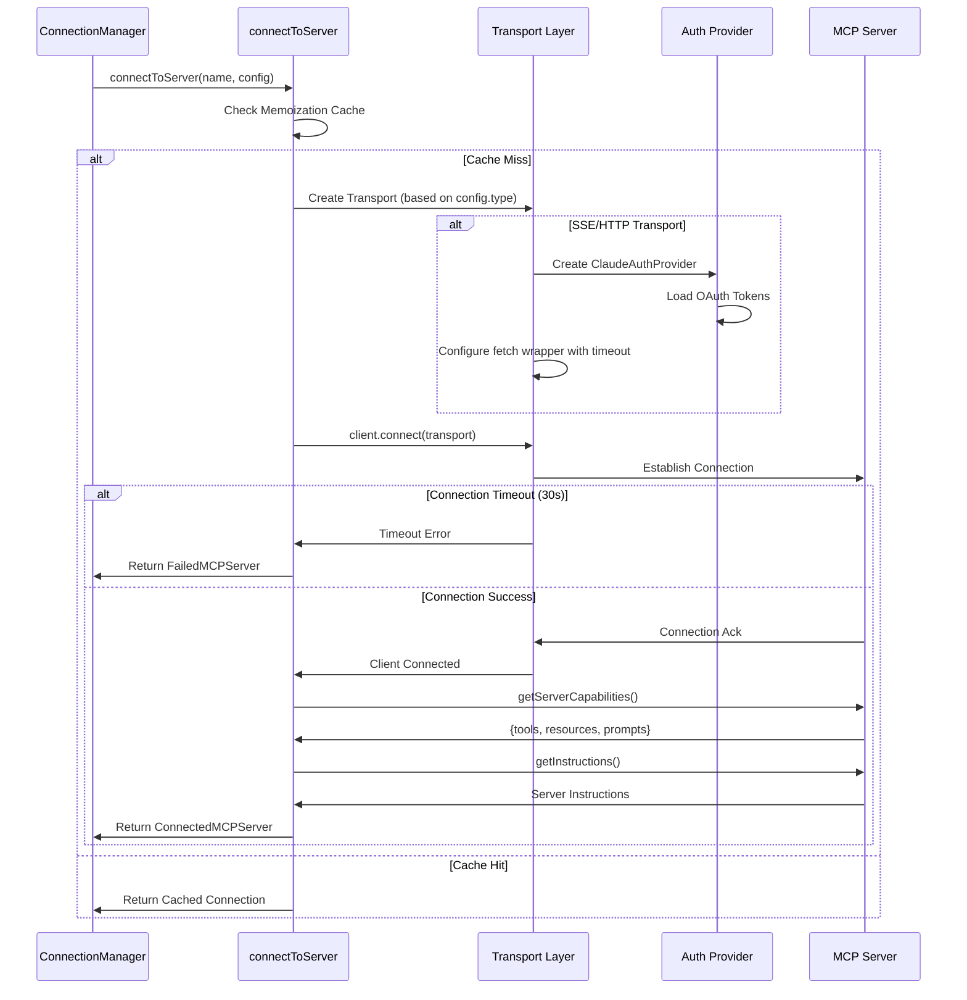
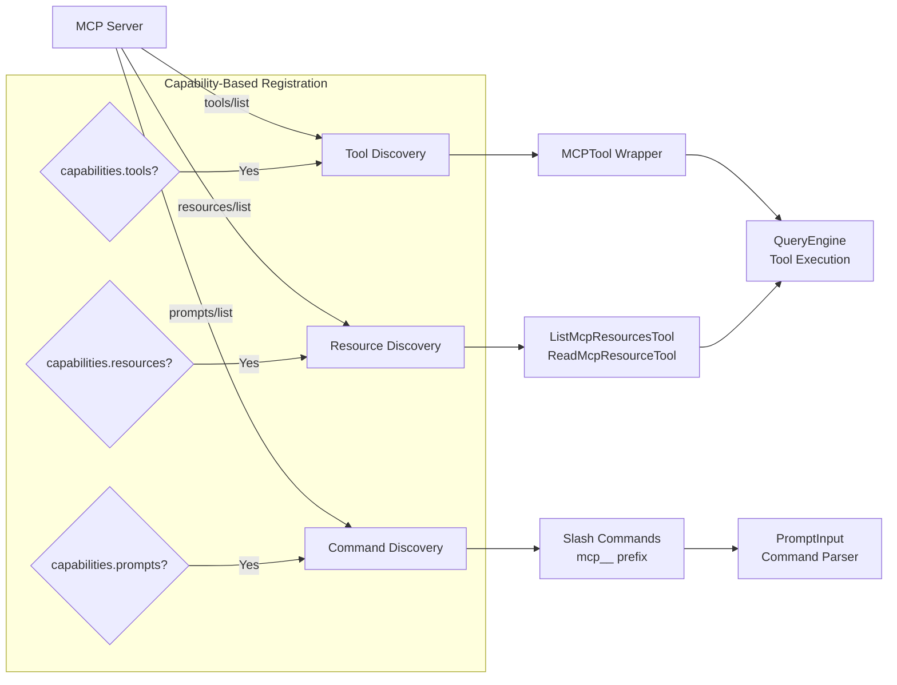
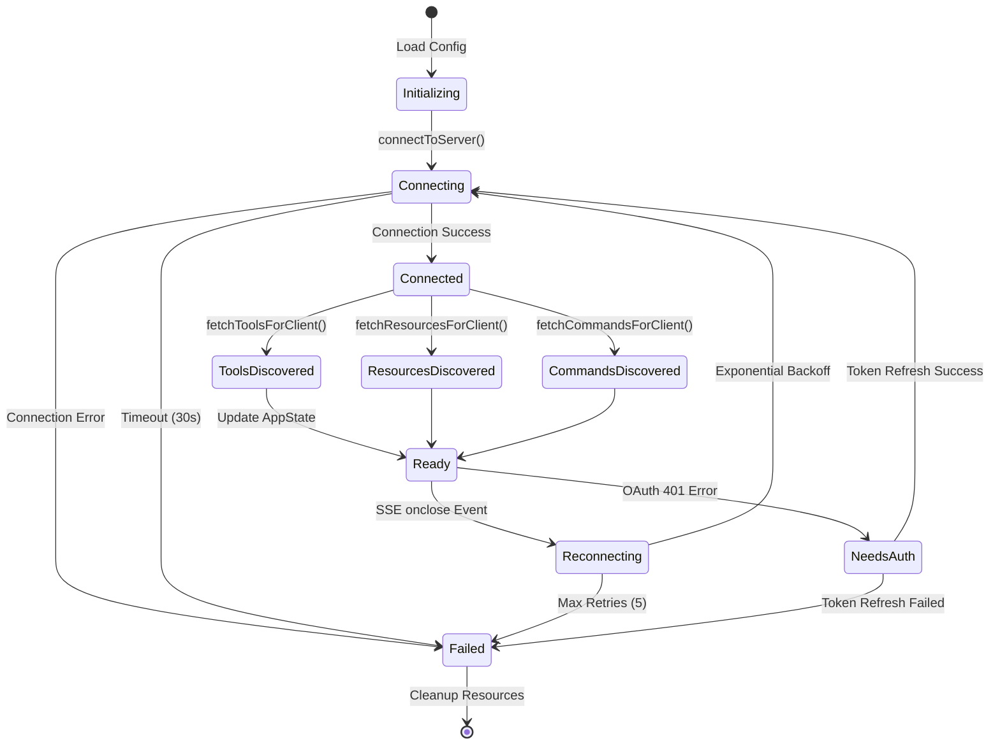

Claude Code 通过 MCP（Model Context Protocol）协议集成外部工具服务器，实现可扩展的工具生态。本页面深入解析 MCP 客户端的核心架构：从配置加载、连接建立、工具发现到会话管理的完整生命周期。MCP 客户端采用**多传输层抽象**设计，支持 stdio、SSE、HTTP、WebSocket 等多种传输协议，通过统一的连接管理器实现自动重连、状态同步与资源发现，为 Claude 提供透明的工具调用能力。

## 架构概览：分层设计与职责分离

MCP 客户端实现采用清晰的分层架构，从配置层到传输层职责明确。**配置管理**负责从多个作用域（本地、用户、项目、企业、Claude.ai 等）加载服务器定义并合并去重；**连接管理层**通过 React Context 提供全局连接状态访问接口；**客户端实现层**封装 MCP SDK 调用、超时控制、认证流程与错误处理；**传输层**则实现不同网络协议的适配。这种分层设计使得新增传输类型或修改认证策略时，无需触及上层业务逻辑。

Sources: [types.ts](src/services/mcp/types.ts#L1-L200), [MCPConnectionManager.tsx](src/services/mcp/MCPConnectionManager.tsx#L1-L73)



## 配置系统：多作用域与优先级管理

MCP 服务器配置来源于**六个作用域**，按优先级从低到高依次为：`local`（本地 `.mcp.json`）、`user`（全局用户配置）、`project`（项目级配置）、`dynamic`（动态注入配置）、`enterprise`（企业受管配置）、`claudeai`（Claude.ai 云端代理）、`managed`（远程受管设置）。配置系统通过 `getAllMcpConfigs()` 函数聚合所有作用域，使用 `addScopeToServers()` 为每个配置附加作用域元数据，并通过**签名去重**机制避免插件与用户配置的重复定义。

### 传输类型与配置模式

MCP 支持五种主要传输协议，每种对应不同的配置模式与使用场景。**stdio** 传输适用于本地进程通信，通过命令行启动 MCP 服务器；**SSE**（Server-Sent Events）用于 HTTP 长连接场景，支持 OAuth 认证；**HTTP** 传输实现 Streamable HTTP 协议，适用于请求-响应模式；**WebSocket** 提供双向实时通信；**SDK** 传输则用于内置插件集成。配置验证通过 Zod Schema 实现，确保运行时类型安全。

Sources: [config.ts](src/services/mcp/config.ts#L1-L200), [types.ts](src/services/mcp/types.ts#L1-L200)

| 传输类型 | 配置字段 | 使用场景 | 认证方式 |
|---------|---------|---------|---------|
| **stdio** | `command`, `args`, `env` | 本地 MCP 服务器进程 | 环境变量 |
| **sse** | `url`, `headers`, `oauth` | HTTP 长连接服务 | OAuth 2.0 / Headers |
| **http** | `url`, `headers`, `oauth` | Streamable HTTP 协议 | OAuth 2.0 / Headers |
| **ws** | `url`, `headers` | 双向实时通信 | Headers / Session Token |
| **sdk** | `name` | 内置插件集成 | 无需认证 |
| **claudeai-proxy** | `url`, `id` | Claude.ai 云端代理 | Claude.ai OAuth |

配置加载流程首先调用 `getCurrentProjectConfig()` 和 `getGlobalConfig()` 获取项目与用户级配置，随后通过 `fetchClaudeAIMcpConfigsIfEligible()` 拉取云端配置。企业受管配置通过 `getEnterpriseMcpFilePath()` 读取 `managed-mcp.json` 文件。所有配置通过**签名去重算法**（`getMcpServerSignature()`）比对命令数组或 URL，避免同一服务器的重复注册。最终配置通过 `ScopedMcpServerConfig` 类型传递给连接管理器。

## 连接建立：传输层抽象与超时控制

`connectToServer()` 函数是 MCP 客户端的**核心连接工厂**，通过 `memoize` 装饰器实现连接缓存。该函数接收服务器名称与配置，根据传输类型初始化对应的 Transport 实例，设置超时控制（默认 30 秒），并调用 MCP SDK 的 `client.connect()` 建立连接。连接成功后，客户端通过 `getServerCapabilities()` 查询服务器能力（工具、资源、提示词），并通过 `getInstructions()` 获取服务器使用说明。

### 传输层实现细节

不同传输类型的初始化逻辑差异显著。**SSE 传输**需要配置 `ClaudeAuthProvider` 处理 OAuth 认证，并通过 `wrapFetchWithTimeout()` 包装 fetch 函数，为每个请求附加 60 秒超时（长连接 EventSource 除外）。**HTTP 传输**使用 `StreamableHTTPClientTransport`，自动附加 `Accept: application/json, text/event-stream` 头以满足 Streamable HTTP 规范。**WebSocket 传输**根据运行环境（Bun 或 Node.js）选择不同的客户端实现，支持 TLS 配置与代理设置。**stdio 传输**通过 `StdioClientTransport` 启动子进程，捕获 stderr 输出用于调试。

Sources: [client.ts](src/services/mcp/client.ts#L400-L800), [client.ts](src/services/mcp/client.ts#L1000-L1200)



连接超时控制通过 `Promise.race()` 实现，主连接 Promise 与超时 Promise 竞争。超时触发时，客户端清理 transport 与子进程资源，抛出 `TelemetrySafeError` 避免敏感信息泄露。对于 SSE/HTTP 传输，连接失败时会检测 `UnauthorizedError` 异常，自动触发令牌刷新流程（`handleOAuth401Error()`），成功后重试连接。连接建立后，客户端注册 `ListRootsRequestSchema` 处理器，返回当前工作目录作为根路径，支持 MCP 服务器的文件系统上下文。

## 工具发现：动态工具注册与能力映射

MCP 客户端通过 `fetchToolsForClient()` 函数实现**动态工具发现**，该函数使用 `memoizeWithLRU` 缓存（容量 20）避免重复查询。工具发现流程首先检查服务器 `capabilities.tools` 能力，若支持则调用 `tools/list` 方法获取工具列表。每个 MCP 工具通过 `buildMcpToolName()` 生成全局限定名（格式：`mcp__<server>__<tool>`），并包装为 Claude Code 的 `Tool` 接口对象。

### 工具包装与属性映射

MCP 工具到 Claude Tool 的映射包括**描述映射**（`description` 与 `prompt` 方法）、**权限检查**（`checkPermissions` 返回 passthrough 行为）、**执行逻辑**（`call` 方法调用 `callMCPToolWithUrlElicitationRetry()`）、**并发安全判定**（基于 `readOnlyHint` 注解）、**破坏性标记**（基于 `destructiveHint` 注解）。工具的 `inputJSONSchema` 直接使用 MCP 服务器提供的 JSON Schema，确保参数验证与服务器定义一致。

Sources: [client.ts](src/services/mcp/client.ts#L1600-L2000), [MCPTool.ts](src/tools/MCPTool/MCPTool.ts#L1-L78)

```typescript
// 工具包装核心逻辑（简化版）
const toolsToProcess = result.tools.map((tool): Tool => {
  const fullyQualifiedName = buildMcpToolName(client.name, tool.name)
  return {
    ...MCPTool, // 继承基础 MCP 工具模板
    name: fullyQualifiedName,
    mcpInfo: { serverName: client.name, toolName: tool.name },
    isMcp: true,
    async description() {
      return tool.description ?? ''
    },
    async call(args, context, _canUseTool, parentMessage, onProgress) {
      const connectedClient = await ensureConnectedClient(client)
      const mcpResult = await callMCPToolWithUrlElicitationRetry({
        client: connectedClient,
        tool: tool.name,
        args,
        signal: context.abortController.signal,
        onProgress
      })
      return { data: mcpResult.content }
    },
    isConcurrencySafe() {
      return tool.annotations?.readOnlyHint ?? false
    },
    userFacingName() {
      return `${client.name} - ${tool.annotations?.title || tool.name} (MCP)`
    }
  }
})
```

工具执行时通过 `ensureConnectedClient()` 确保连接有效，该函数检查连接缓存并在连接断开时自动重连。工具调用支持**会话过期重试**（`McpSessionExpiredError`），最多重试 1 次。进度回调通过 `ToolCallProgress<MCPProgress>` 接口传递，包含工具启动、完成、失败三种状态，以及服务器名、工具名、耗时等信息。工具结果通过 `transformResultContent()` 转换，支持文本、图像、资源引用等多种内容类型。

## 资源与命令发现：提示词集成与资源访问

除了工具，MCP 服务器还可提供**资源**（Resources）和**提示词**（Prompts）。资源通过 `fetchResourcesForClient()` 发现，调用 `resources/list` 方法获取资源列表，每个资源附加服务器名称元数据。若服务器支持资源能力，客户端自动注册 `ListMcpResourcesTool` 与 `ReadMcpResourceTool` 工具（除非其他服务器已提供）。资源支持**订阅机制**（`capabilities.resources.subscribe`），允许服务器主动推送资源更新通知。

### 提示词到斜杠命令的转换

MCP 提示词通过 `fetchCommandsForClient()` 转换为 Claude Code 的斜杠命令。提示词名称经过规范化（`normalizeNameForMCP()`）后，生成 `mcp__<server>__<prompt>` 格式的命令名。命令的 `getPromptForCommand()` 方法调用 MCP 客户端的 `getPrompt()` 接口，传入用户提供的参数，返回转换后的消息内容数组。命令的 `argNames` 从提示词的 `arguments` 字段提取，用于参数解析与补全。

Sources: [client.ts](src/services/mcp/client.ts#L2000-L2200), [ListMcpResourcesTool.ts](src/tools/ListMcpResourcesTool/ListMcpResourcesTool.ts#L1-L50)



提示词参数通过 `zipObject(argNames, argsArray)` 映射为键值对对象。提示词内容通过 `transformResultContent()` 转换，支持嵌套消息结构。MCP 技能（Skills）是提示词的扩展形式，通过 `fetchMcpSkillsForClient()` 发现（需启用 `MCP_SKILLS` 特性开关），与普通提示词合并到命令列表。资源与命令的发现结果通过 `reconnectMcpServerImpl()` 聚合，返回包含客户端连接、工具列表、命令列表、资源列表的完整对象。

## 连接管理：自动重连与状态同步

`useManageMCPConnections` Hook 是 MCP 连接管理的**核心协调器**，负责初始化连接、监听配置变化、处理连接生命周期事件、同步 AppState。该 Hook 通过 `useEffect` 监听 `dynamicMcpConfig`、`authVersion`、`pluginReconnectKey` 等依赖项变化，触发重新连接流程。连接结果通过 `onConnectionAttempt()` 回调更新 AppState 的 `mcp.clients`、`mcp.tools`、`mcp.commands` 字段。

### 自动重连机制

对于 SSE 连接，客户端注册 `onclose` 事件处理器，在连接断开时触发**指数退避重连**。重连参数包括最大重试次数（5 次）、初始退避时间（1 秒）、最大退避时间（30 秒）。重连逻辑通过 `reconnectWithBackoff()` 异步函数实现，每次重试前等待退避时间，成功后清除定时器并更新连接状态。重连定时器存储在 `reconnectTimersRef` 中，支持组件卸载时清理。

Sources: [useManageMCPConnections.ts](src/services/mcp/useManageMCPConnections.ts#L1-L200), [useManageMCPConnections.ts](src/services/mcp/useManageMCPConnections.ts#L400-L600)



连接状态变化通过 `setAppState()` 更新全局状态，包括添加服务器到 `mcp.clients`、合并工具到 `mcp.tools`、合并命令到 `mcp.commands`。错误通过 `addErrorsToAppState()` 去重后添加到 `plugins.errors` 数组，避免重复显示相同错误。通道通知通过 `gateChannelServer()` 判定是否注册，根据服务器能力、配置作用域、允许通道列表决定是否启用推送消息功能。

## 认证流程：OAuth 2.0 与令牌管理

MCP 客户端支持**多种认证方式**：环境变量注入（stdio 传输）、静态 Headers（SSE/HTTP/WS 传输）、OAuth 2.0 授权码流程（SSE/HTTP 传输）。OAuth 认证通过 `ClaudeAuthProvider` 实现，该类继承 MCP SDK 的 `AuthProvider` 接口，提供 `tokens()`、`redirectToAuthorization()`、`saveTokens()` 方法。令牌存储在操作系统密钥链中（macOS Keychain、Windows Credential Manager、Linux Secret Service），通过 `clearKeychainCache()` 清除缓存以读取最新令牌。

### 令牌刷新与 401 错误处理

当 MCP 服务器返回 401 未授权错误时，客户端通过 `handleOAuth401Error()` 触发令牌刷新流程。该函数检查令牌是否过期，调用 `checkAndRefreshOAuthTokenIfNeeded()` 刷新访问令牌，成功后返回 `true` 触发重连。对于 Claude.ai 代理服务器，401 错误通过 `wrapFetchWithStepUpDetection()` 包装器检测，支持 Step-up 认证场景（要求用户重新登录）。

Sources: [auth.ts](src/services/mcp/auth.ts#L1-L150), [client.ts](src/services/mcp/client.ts#L400-L600)

| 认证阶段 | 触发条件 | 执行动作 | 失败处理 |
|---------|---------|---------|---------|
| **初始认证** | 连接建立前 | `authProvider.tokens()` 加载令牌 | 重定向到授权页面 |
| **令牌刷新** | 访问令牌过期 | `checkAndRefreshOAuthTokenIfNeeded()` | 提示用户重新登录 |
| **401 错误** | 服务器返回 401 | `handleOAuth401Error()` 刷新令牌 | 标记服务器为 `needs-auth` |
| **Step-up 认证** | 403 + Step-up 头 | 触发交互式登录流程 | 降级为只读模式 |

令牌管理通过 `getClaudeAIOAuthTokens()` 读取存储的访问令牌与刷新令牌，通过 `saveOAuthTokens()` 保存新令牌。跨进程令牌同步通过文件锁（`ELOCKED` 错误码）实现，避免多个 Claude Code 实例同时刷新令牌导致的竞争条件。令牌缓存通过 `clearKeychainCache()` 清除，确保读取最新状态。认证失败的服务器标记为 `needs-auth` 状态，用户可通过 `/mcp` 命令重新认证。

## 会话恢复与缓存清理

MCP 客户端通过**连接缓存**（`connectToServer.cache`）与**发现缓存**（`fetchToolsForClient.cache` 等）优化性能。缓存键通过 `getServerCacheKey()` 生成，包含服务器名称与配置的 JSON 序列化字符串。当服务器配置变化或需要重新连接时，调用 `clearServerCache()` 清除所有相关缓存，包括连接缓存、工具缓存、资源缓存、命令缓存，并调用 `cleanup()` 方法关闭现有连接。

### 重连实现细节

`reconnectMcpServerImpl()` 函数实现手动重连逻辑，首先清除密钥链缓存（`clearKeychainCache()`）以读取最新令牌，随后清除服务器缓存并重新建立连接。连接成功后，并行调用 `fetchToolsForClient()`、`fetchCommandsForClient()`、`fetchResourcesForClient()` 发现工具、命令与资源。对于 Claude.ai 代理服务器，调用 `markClaudeAiMcpConnected()` 标记连接状态。重连结果返回完整的客户端连接与发现结果，供上层更新 AppState。

Sources: [client.ts](src/services/mcp/client.ts#L2000-L2200), [MCPConnectionManager.tsx](src/services/mcp/MCPConnectionManager.tsx#L1-L73)

```typescript
// 重连流程核心逻辑（简化版）
export async function reconnectMcpServerImpl(
  name: string,
  config: ScopedMcpServerConfig,
): Promise<{
  client: MCPServerConnection
  tools: Tool[]
  commands: Command[]
  resources?: ServerResource[]
}> {
  clearKeychainCache() // 清除密钥链缓存
  await clearServerCache(name, config) // 清除连接与发现缓存
  const client = await connectToServer(name, config)
  
  if (client.type !== 'connected') {
    return { client, tools: [], commands: [] }
  }
  
  const [tools, mcpCommands, mcpSkills, resources] = await Promise.all([
    fetchToolsForClient(client),
    fetchCommandsForClient(client),
    fetchMcpSkillsForClient(client),
    fetchResourcesForClient(client)
  ])
  
  return {
    client,
    tools: [...tools, ...resourceTools],
    commands: [...mcpCommands, ...mcpSkills],
    resources
  }
}
```

会话过期通过 `McpSessionExpiredError` 异常标识，工具执行时捕获该异常并重试（最多 1 次）。重连通过 `ensureConnectedClient()` 触发，该函数检查连接类型（SDK 服务器跳过重连），调用 `connectToServer()` 重新建立连接。连接失败时抛出 `TelemetrySafeError`，避免敏感信息（如服务器 URL、令牌）泄露到遥测数据。所有错误通过 `logMCPError()` 记录到调试日志，通过 `logEvent()` 上报分析事件。

---

## 下一步阅读

理解 MCP 客户端的连接管理与工具发现机制后，建议继续探索以下主题：

- **[MCP 工具调用：MCPTool 与资源访问](16-mcp-gong-ju-diao-yong-mcptool-yu-zi-yuan-fang-wen)**：深入解析 MCPTool 执行流程、进度回调、结果转换与会话重试机制
- **[MCP 服务器配置与认证流程](17-mcp-fu-wu-qi-pei-zhi-yu-ren-zheng-liu-cheng)**：详细了解配置文件格式、OAuth 2.0 授权码流程、令牌存储与跨进程同步
- **[Bridge 主循环：IDE 双向通信协议](18-bridge-zhu-xun-huan-ide-shuang-xiang-tong-xin-xie-yi)**：探索 MCP 如何与 IDE 集成，实现代码诊断、文件操作等 IDE 特有能力
- **[权限模式系统：default、plan、auto、bypass 等模式解析](9-quan-xian-mo-shi-xi-tong-default-plan-auto-bypass-deng-mo-shi-jie-xi)**：理解 MCP 工具的权限检查流程与用户交互设计
- **[AppState 设计：React 状态管理与订阅机制](12-appstate-she-ji-react-zhuang-tai-guan-li-yu-ding-yue-ji-zhi)**：学习 MCP 连接状态如何与全局状态管理集成，实现响应式更新