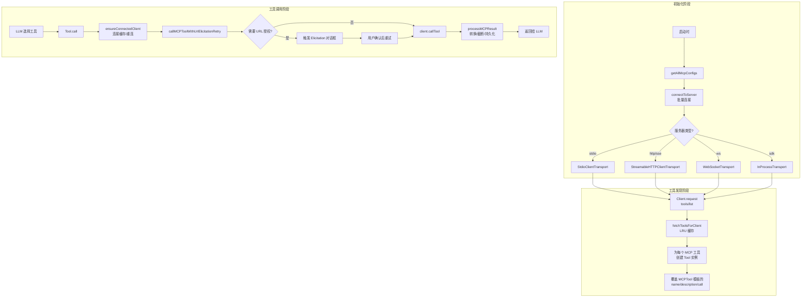
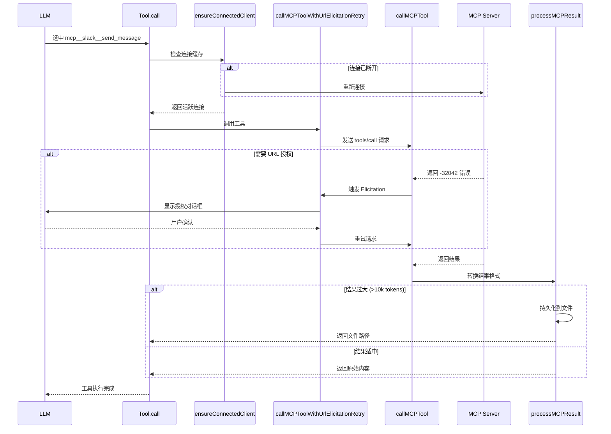
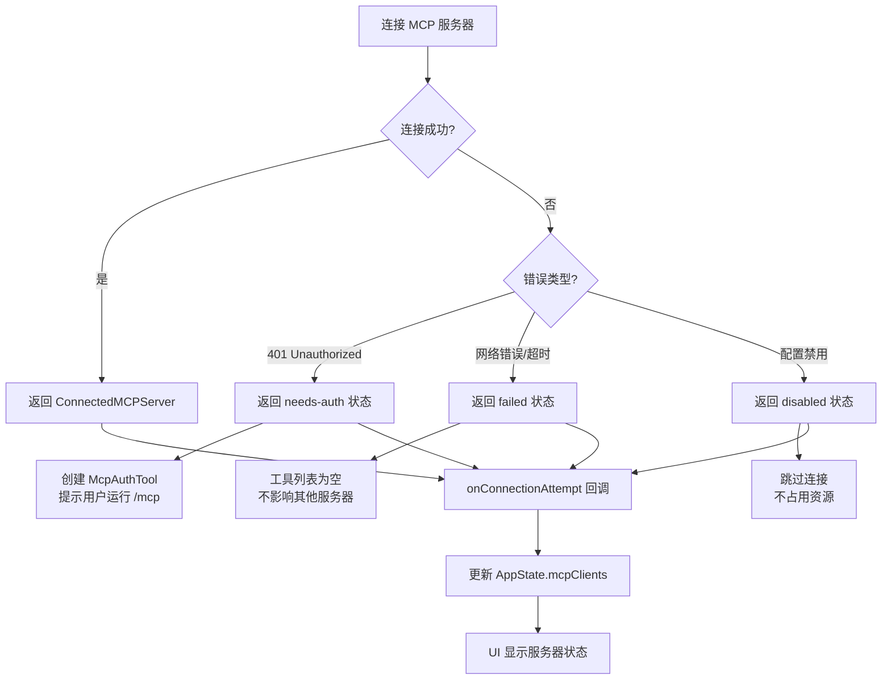

Claude Code 的 MCP（Model Context Protocol）集成通过 **MCPTool** 实现动态工具发现与调用，并通过 **ListMcpResourcesTool** 和 **ReadMcpResourceTool** 提供资源访问能力。这三个工具构成了 Claude Code 与外部 MCP 服务器交互的核心机制，支持 stdio、SSE、HTTP、WebSocket 等多种传输协议，实现了工具的动态注册、参数验证、权限控制和结果转换。

## 架构概览：从连接到调用的完整流程

MCP 工具调用系统采用 **延迟绑定（Lazy Binding）** 架构：MCPTool 本身只是一个占位符模板，真正的工具定义从 MCP 服务器动态获取。这种设计允许 Claude Code 在运行时发现并集成任意数量的 MCP 工具，而无需重新编译或重启。



**核心设计原则**：
- **连接复用**：通过 `memoizeWithLRU` 缓存 MCP 客户端连接，避免重复握手
- **优雅降级**：单个服务器连接失败不影响其他服务器，工具列表为空而非抛错
- **进度反馈**：支持 MCP SDK 的 `onprogress` 回调，实时显示工具执行进度
- **大型输出处理**：超过 10k tokens 的结果自动持久化到文件，避免上下文污染

Sources: [client.ts](src/services/mcp/client.ts#L1743-L1998) [client.ts](src/services/mcp/client.ts#L2829-L3027) [client.ts](src/services/mcp/client.ts#L3029-L3150)

## MCPTool 模板机制：动态工具的生成蓝图

MCPTool 的设计精妙之处在于 **模板-实例分离**：基础 MCPTool 定义了所有 MCP 工具共享的行为契约（权限检查、结果渲染、进度追踪），而具体工具的名称、描述、输入 schema 和调用逻辑在运行时从 MCP 服务器获取并覆盖。

### 基础模板定义

```typescript
// src/tools/MCPTool/MCPTool.ts
export const MCPTool = buildTool({
  isMcp: true,
  isOpenWorld() { return false },  // 安全默认值，实际由 MCP 服务器覆盖
  
  // 这些值在 fetchToolsForClient 中被覆盖
  name: 'mcp',
  async description() { return DESCRIPTION },  // 空字符串
  async prompt() { return PROMPT },            // 空字符串
  async call() { return { data: '' } },        // 占位符实现
  
  // 通用行为：所有 MCP 工具共享
  async checkPermissions(): Promise<PermissionResult> {
    return {
      behavior: 'passthrough',
      message: 'MCPTool requires permission.',
      suggestions: [{
        type: 'addRules',
        rules: [{ toolName: '...', ruleContent: undefined }],
        behavior: 'allow',
        destination: 'localSettings',
      }],
    }
  },
  
  renderToolUseMessage,        // 渲染工具调用输入
  renderToolUseProgressMessage, // 渲染进度条
  renderToolResultMessage,     // 渲染工具结果
  
  maxResultSizeChars: 100_000,  // 100k 字符上限
  isResultTruncated: isOutputLineTruncated,
})
```

**关键设计点**：
- **passthrough 权限模式**：MCP 工具的权限由用户在 `/mcp` 命令中显式批准，工具层不做额外拦截
- **passthrough input schema**：`z.object({}).passthrough()` 允许任意参数，实际 schema 由 MCP 服务器提供
- **可扩展的结果类型**：支持 `string` 或 `MCPToolResult`（内容块数组），统一处理文本、图像、资源引用

Sources: [MCPTool.ts](src/tools/MCPTool/MCPTool.ts#L27-L77)

### 动态实例化：从服务器工具到 Tool 对象

当 MCP 服务器连接成功后，`fetchToolsForClient` 函数遍历服务器提供的工具列表，为每个工具创建一个 **继承 MCPTool 模板** 的 Tool 实例：

```typescript
// src/services/mcp/client.ts#L1766-L1989
return toolsToProcess.map((tool): Tool => {
  const fullyQualifiedName = buildMcpToolName(client.name, tool.name)
  // 例如："slack" + "send_message" → "mcp__slack__send_message"
  
  return {
    ...MCPTool,  // 继承基础模板
    name: skipPrefix ? tool.name : fullyQualifiedName,  // SDK 模式可省略前缀
    mcpInfo: { serverName: client.name, toolName: tool.name },
    isMcp: true,
    
    // 从 MCP 工具的 annotations 提取元数据
    isConcurrencySafe() { return tool.annotations?.readOnlyHint ?? false },
    isReadOnly() { return tool.annotations?.readOnlyHint ?? false },
    isDestructive() { return tool.annotations?.destructiveHint ?? false },
    isOpenWorld() { return tool.annotations?.openWorldHint ?? false },
    
    // 动态描述和提示词（支持截断）
    async description() { return tool.description ?? '' },
    async prompt() {
      const desc = tool.description ?? ''
      return desc.length > MAX_MCP_DESCRIPTION_LENGTH
        ? desc.slice(0, MAX_MCP_DESCRIPTION_LENGTH) + '… [truncated]'
        : desc
    },
    
    // 核心调用逻辑：委托给 callMCPToolWithUrlElicitationRetry
    async call(args, context, _canUseTool, parentMessage, onProgress) {
      const connectedClient = await ensureConnectedClient(client)
      const mcpResult = await callMCPToolWithUrlElicitationRetry({
        client: connectedClient,
        tool: tool.name,
        args,
        meta: { 'claudecode/toolUseId': extractToolUseId(parentMessage) },
        signal: context.abortController.signal,
        onProgress: onProgress && toolUseId ? progressData => {
          onProgress({ toolUseID: toolUseId, data: progressData })
        } : undefined,
      })
      return { data: mcpResult.content, ... }
    },
    
    // 用户友好的显示名称
    userFacingName() {
      const displayName = tool.annotations?.title || tool.name
      return `${client.name} - ${displayName} (MCP)`
    },
  }
})
```

**实例化流程的关键决策**：
1. **命名空间隔离**：`mcp__<server>__<tool>` 格式避免不同服务器的工具名称冲突
2. **Annotation 优先**：MCP 服务器的 `annotations` 字段（readOnlyHint、destructiveHint）优先于模板默认值
3. **连接复用**：每次调用前调用 `ensureConnectedClient`，利用缓存避免重复连接
4. **元数据传递**：`toolUseId` 通过 `_meta` 字段传递给 MCP 服务器，用于关联请求和响应

Sources: [client.ts](src/services/mcp/client.ts#L1766-L1989)

## 工具调用执行：从参数验证到结果转换

### 调用链路：多层重试与错误处理



**调用链路的核心职责**：
- **ensureConnectedClient**：检查连接状态，失败时利用 `connectToServer` 的 memoize 缓存重新连接
- **callMCPToolWithUrlElicitationRetry**：处理 MCP 的 URL 授权流程（错误码 -32042），最多重试 3 次
- **callMCPTool**：执行实际的 SDK 调用，处理超时、进度回调、错误转换
- **processMCPResult**：统一结果格式，处理大型输出、二进制内容、图像块

Sources: [client.ts](src/services/mcp/client.ts#L1833-L1970) [client.ts](src/services/mcp/client.ts#L2829-L3027) [client.ts](src/services/mcp/client.ts#L2720-L2799)

### 进度追踪：实时反馈长时间运行的工具

MCP SDK 支持 **进度令牌（Progress Token）** 机制，允许服务器在长时间操作中报告进度。Claude Code 通过 `renderToolUseProgressMessage` 组件将进度可视化为进度条：

```typescript
// src/tools/MCPTool/UI.tsx#L57-L90
export function renderToolUseProgressMessage(
  progressMessagesForMessage: ProgressMessage<MCPProgress>[]
): React.ReactNode {
  const lastProgress = progressMessagesForMessage.at(-1)
  if (!lastProgress?.data) {
    return <MessageResponse height={1}>
      <Text dimColor>Running…</Text>
    </MessageResponse>
  }
  
  const { progress, total, progressMessage } = lastProgress.data
  if (total !== undefined && total > 0) {
    const ratio = Math.min(1, Math.max(0, progress / total))
    const percentage = Math.round(ratio * 100)
    return <MessageResponse>
      <Box flexDirection="column">
        {progressMessage && <Text dimColor>{progressMessage}</Text>}
        <Box flexDirection="row" gap={1}>
          <ProgressBar ratio={ratio} width={20} />
          <Text dimColor>{percentage}%</Text>
        </Box>
      </Box>
    </MessageResponse>
  }
  
  return <MessageResponse height={1}>
    <Text dimColor>{progressMessage ?? `Processing… ${progress}`}</Text>
  </MessageResponse>
}
```

**进度数据结构**：
```typescript
type MCPProgress = {
  type: 'mcp_progress'
  status: 'started' | 'progress' | 'completed' | 'failed'
  serverName: string
  toolName: string
  progress?: number      // 当前进度值
  total?: number         // 总量（可选）
  progressMessage?: string  // 进度描述
  elapsedTimeMs?: number    // 执行时长
}
```

**实际调用示例**：
- **Slack MCP** 的 `send_message` 工具可能显示 "Uploading attachment 1/3"
- **Filesystem MCP** 的 `search_files` 工具可能显示 "Scanned 1,234/5,678 files"
- **Database MCP** 的 `query` 工具可能显示 "Executing query (15s elapsed)"

Sources: [UI.tsx](src/tools/MCPTool/UI.tsx#L57-L90)

### 结果转换：三种 MCP 响应格式的统一处理

MCP 服务器可能返回三种不同的结果格式，Claude Code 通过 `transformMCPResult` 统一转换为标准格式：

| 格式类型 | 结构特征 | 处理方式 | 示例场景 |
|---------|---------|---------|---------|
| **toolResult** | `{ toolResult: string \| object }` | 直接字符串化 | 简单文本响应 |
| **structuredContent** | `{ structuredContent: object }` | JSON 序列化 + schema 推断 | 结构化数据（JSON、表格） |
| **contentArray** | `{ content: ContentBlock[] }` | 逐块转换（文本、图像、资源） | 多媒体响应（文本+图像） |

```typescript
// src/services/mcp/client.ts#L2662-L2706
export async function transformMCPResult(
  result: unknown,
  tool: string,
  name: string,
): Promise<TransformedMCPResult> {
  if (result && typeof result === 'object') {
    // 格式 1：简单字符串包装
    if ('toolResult' in result) {
      return {
        content: String(result.toolResult),
        type: 'toolResult',
      }
    }
    
    // 格式 2：结构化内容（MCP 2025-03-26 新增）
    if ('structuredContent' in result && result.structuredContent !== undefined) {
      return {
        content: jsonStringify(result.structuredContent),
        type: 'structuredContent',
        schema: inferCompactSchema(result.structuredContent),
        // schema 示例："{users: [{id: number, name: string}]}"
      }
    }
    
    // 格式 3：内容块数组（最通用）
    if ('content' in result && Array.isArray(result.content)) {
      const transformedContent = (
        await Promise.all(
          result.content.map(item => transformResultContent(item, name))
        )
      ).flat()
      return {
        content: transformedContent,
        type: 'contentArray',
        schema: inferCompactSchema(transformedContent),
      }
    }
  }
  
  // 未知格式：抛出遥测安全错误
  throw new TelemetrySafeError_I_VERIFIED_THIS_IS_NOT_CODE_OR_FILEPATHS(
    `MCP server "${name}" tool "${tool}": unexpected response format`,
    'MCP tool unexpected response format',
  )
}
```

**transformResultContent 的职责**：
- **文本块**：直接提取 `item.text`
- **图像块**：解码 base64 → 调整尺寸 → 重新编码为可嵌入格式
- **资源块**：提取 URI 和 MIME 类型，生成可读引用
- **二进制块**：持久化到临时文件，返回文件路径

Sources: [client.ts](src/services/mcp/client.ts#L2662-L2706) [client.ts](src/services/mcp/client.ts#L2596-L2627)

## 资源访问：ListMcpResourcesTool 与 ReadMcpResourceTool

MCP 协议不仅支持工具调用，还定义了 **资源（Resources）** 概念：服务器可以暴露可读的数据源（文件、数据库记录、API 端点），客户端通过 `resources/list` 和 `resources/read` 访问。Claude Code 通过两个专用工具提供资源访问能力。

### ListMcpResourcesTool：发现可用资源

```typescript
// src/tools/ListMcpResourcesTool/ListMcpResourcesTool.ts
export const ListMcpResourcesTool = buildTool({
  isConcurrencySafe() { return true },
  isReadOnly() { return true },
  name: 'listMcpResources',
  searchHint: 'list resources from connected MCP servers',
  
  inputSchema: z.object({
    server: z.string().optional().describe('Optional server name to filter'),
  }),
  
  outputSchema: z.array(z.object({
    uri: z.string(),
    name: z.string(),
    mimeType: z.string().optional(),
    description: z.string().optional(),
    server: z.string(),
  })),
  
  async call(input, { options: { mcpClients } }) {
    const { server: targetServer } = input
    const clientsToProcess = targetServer
      ? mcpClients.filter(client => client.name === targetServer)
      : mcpClients
    
    // 并发获取所有服务器的资源（失败的服务器返回空数组）
    const results = await Promise.all(
      clientsToProcess.map(async client => {
        if (client.type !== 'connected') return []
        try {
          const fresh = await ensureConnectedClient(client)
          return await fetchResourcesForClient(fresh)
        } catch (error) {
          logMCPError(client.name, errorMessage(error))
          return []  // 单个服务器失败不影响整体结果
        }
      }),
    )
    
    return { data: results.flat() }
  },
})
```

**典型使用场景**：
```
用户：列出所有 MCP 服务器的资源
LLM：调用 listMcpResources()
结果：[
  { uri: "file:///home/user/project", name: "Project Root", server: "filesystem" },
  { uri: "slack://channels/C12345", name: "#general", server: "slack" },
  { uri: "postgres://tables/users", name: "users table", server: "database" }
]
```

**LRU 缓存机制**：
- `fetchResourcesForClient` 使用 `memoizeWithLRU` 缓存，避免重复调用 `resources/list`
- 缓存在服务器断开连接（`onclose`）或资源变更通知（`resources/list_changed`）时失效
- 缓存大小限制为 20 个服务器，防止内存泄漏

Sources: [ListMcpResourcesTool.ts](src/tools/ListMcpResourcesTool/ListMcpResourcesTool.ts#L40-L123) [client.ts](src/services/mcp/client.ts#L2000-L2031)

### ReadMcpResourceTool：读取资源内容

```typescript
// src/tools/ReadMcpResourceTool/ReadMcpResourceTool.ts
export const ReadMcpResourceTool = buildTool({
  isConcurrencySafe() { return true },
  isReadOnly() { return true },
  name: 'ReadMcpResourceTool',
  searchHint: 'read a specific MCP resource by URI',
  
  inputSchema: z.object({
    server: z.string().describe('The MCP server name'),
    uri: z.string().describe('The resource URI to read'),
  }),
  
  outputSchema: z.object({
    contents: z.array(z.object({
      uri: z.string(),
      mimeType: z.string().optional(),
      text: z.string().optional(),
      blobSavedTo: z.string().optional(),  // 二进制内容的文件路径
    })),
  }),
  
  async call(input, { options: { mcpClients } }) {
    const { server: serverName, uri } = input
    const client = mcpClients.find(c => c.name === serverName)
    
    if (!client) throw new Error(`Server "${serverName}" not found`)
    if (client.type !== 'connected') throw new Error(`Server "${serverName}" is not connected`)
    if (!client.capabilities?.resources) throw new Error(`Server "${serverName}" does not support resources`)
    
    const connectedClient = await ensureConnectedClient(client)
    const result = await connectedClient.client.request(
      { method: 'resources/read', params: { uri } },
      ReadResourceResultSchema,
    )
    
    // 拦截二进制 blob 字段：解码 base64 → 保存到磁盘 → 替换为文件路径
    const contents = await Promise.all(
      result.contents.map(async (c, i) => {
        if ('text' in c) {
          return { uri: c.uri, mimeType: c.mimeType, text: c.text }
        }
        if (!('blob' in c) || typeof c.blob !== 'string') {
          return { uri: c.uri, mimeType: c.mimeType }
        }
        
        // 持久化二进制内容
        const persistId = `mcp-resource-${Date.now()}-${i}-${randomSuffix}`
        const persisted = await persistBinaryContent(
          Buffer.from(c.blob, 'base64'),
          c.mimeType,
          persistId,
        )
        
        if ('error' in persisted) {
          return {
            uri: c.uri,
            mimeType: c.mimeType,
            text: `Binary content could not be saved: ${persisted.error}`,
          }
        }
        
        return {
          uri: c.uri,
          mimeType: c.mimeType,
          blobSavedTo: persisted.filepath,
          text: getBinaryBlobSavedMessage(persisted.filepath, c.mimeType, persisted.size),
        }
      }),
    )
    
    return { data: { contents } }
  },
})
```

**二进制内容处理流程**：
1. **检测 blob 字段**：MCP 资源可能返回 `{ blob: "base64...", mimeType: "image/png" }`
2. **解码并持久化**：`persistBinaryContent` 将 base64 解码为 Buffer，保存到临时文件
3. **生成友好消息**：返回类似 `[Binary file saved to /tmp/mcp-resource-xxx.png (245 KB)]`
4. **避免上下文污染**：不将 base64 字符串直接注入 LLM 上下文

**实际使用示例**：
```
用户：读取 filesystem 服务器的 /home/user/project/package.json 资源
LLM：调用 ReadMcpResourceTool({ server: "filesystem", uri: "file:///home/user/project/package.json" })
结果：{
  contents: [{
    uri: "file:///home/user/project/package.json",
    mimeType: "application/json",
    text: '{"name": "my-project", "version": "1.0.0", ...}'
  }]
}
```

Sources: [ReadMcpResourceTool.ts](src/tools/ReadMcpResourceTool/ReadMcpResourceTool.ts#L49-L158)

## 错误处理与重连机制

### 连接失败的三层降级策略

当 MCP 服务器连接失败时，Claude Code 采用 **优雅降级** 策略，确保单个服务器的故障不影响整体功能：



**降级策略的关键点**：
- **needs-auth 状态**：缓存 401 错误 15 分钟，避免反复探测无 token 的服务器
- **failed 状态**：记录错误日志，但不阻塞其他服务器的连接
- **disabled 状态**：用户通过 `/mcp` 命令禁用的服务器，完全跳过连接流程

Sources: [client.ts](src/services/mcp/client.ts#L2307-L2336) [client.ts](src/services/mcp/client.ts#L2600-L2609)

### 会话过期与自动重连

MCP 服务器可能因为会话过期（Session Expired）断开连接，Claude Code 通过 **会话过期检测** 和 **透明重连** 机制保证工具调用的连续性：

```typescript
// src/services/mcp/client.ts#L1910-L1922
catch (error) {
  // 会话过期 — 连接缓存已清除，使用新客户端重试
  if (error instanceof McpSessionExpiredError && attempt < MAX_SESSION_RETRIES) {
    logMCPDebug(client.name, `Retrying tool '${tool.name}' after session recovery`)
    continue  // 重新循环，ensureConnectedClient 会返回新连接
  }
  
  // 其他错误：包装为遥测安全错误后抛出
  if (error instanceof Error && !(error instanceof TelemetrySafeError)) {
    throw new TelemetrySafeError_I_VERIFIED_THIS_IS_NOT_CODE_OR_FILEPATHS(
      error.message,
      error.constructor.name === 'McpError' 
        ? `McpError ${(error as McpError).code}` 
        : error.message.slice(0, 200),
    )
  }
  throw error
}
```

**会话过期检测机制**：
- **McpSessionExpiredError**：自定义错误类，标识服务器会话失效
- **缓存清除**：`connectToServer.cache.delete(key)` 清除旧连接
- **透明重试**：最多重试 1 次，重试时 `ensureConnectedClient` 返回新连接

Sources: [client.ts](src/services/mcp/client.ts#L1910-L1969)

### URL 授权流程（Elicitation）

部分 MCP 工具需要用户在浏览器中完成授权（如 OAuth 流程），服务器返回 **错误码 -32042（UrlElicitationRequired）** 触发授权对话框：

```typescript
// src/services/mcp/client.ts#L2864-L3026
if (error.code === ErrorCode.UrlElicitationRequired) {
  const elicitations = error.data.elicitations  // 提取授权 URL 列表
  
  for (const elicitation of elicitations) {
    // 1. 尝试通过 Hook 自动处理
    const hookResponse = await runElicitationHooks(serverName, elicitation, signal)
    if (hookResponse?.action === 'accept') continue  // Hook 已处理，跳过 UI
    
    // 2. REPL 模式：队列化到 ElicitationDialog
    if (!handleElicitation) {
      userResult = await new Promise(resolve => {
        setAppState(prev => ({
          ...prev,
          elicitation: {
            queue: [...prev.elicitation.queue, {
              serverName,
              requestId: `error-elicit-${elicitationId}`,
              params: elicitation,  // { url: "https://...", message: "Authorize app" }
              respond: result => {
                if (result.action === 'accept') return  // 用户点击 "Done"
                resolve(result)  // decline/cancel 立即返回
              },
              onWaitingDismiss: action => {
                resolve(action === 'retry' ? { action: 'accept' } : { action: 'cancel' })
              },
            }],
          },
        }))
      })
    }
    
    // 3. 用户拒绝：返回友好错误消息
    if (userResult.action !== 'accept') {
      return {
        content: `URL elicitation was ${userResult.action}. Tool "${tool}" requires authorization.`,
      }
    }
  }
  
  // 4. 所有授权完成：重试工具调用
  continue  // 回到 for 循环顶部，重新调用 callToolFn
}
```

**授权流程的用户体验**：
1. **对话框显示**：显示服务器名称、授权 URL、操作说明
2. **自动打开浏览器**：点击 "Open URL" 按钮启动系统浏览器
3. **等待用户完成**：显示 "Waiting for authorization..." 状态
4. **重试或取消**：用户完成授权后点击 "Done"，或点击 "Cancel" 取消

Sources: [client.ts](src/services/mcp/client.ts#L2864-L3026)

## 大型输出处理：持久化与上下文保护

当 MCP 工具返回超过 **10,000 tokens** 的结果时，Claude Code 自动将内容持久化到临时文件，避免污染 LLM 上下文窗口：

```typescript
// src/services/mcp/client.ts#L2720-L2799
export async function processMCPResult(
  result: unknown,
  tool: string,
  name: string,
): Promise<MCPToolResult> {
  const { content, type, schema } = await transformMCPResult(result, tool, name)
  
  // IDE 工具不走模型，直接返回
  if (name === 'ide') return content
  
  // 检查是否需要截断/持久化
  if (!(await mcpContentNeedsTruncation(content))) return content
  
  const sizeEstimateTokens = getContentSizeEstimate(content)
  
  // 功能开关：环境变量控制是否启用持久化
  if (isEnvDefinedFalsy(process.env.ENABLE_MCP_LARGE_OUTPUT_FILES)) {
    return await truncateMcpContentIfNeeded(content)  // 旧版截断逻辑
  }
  
  // 图像内容不适合持久化为 JSON
  if (contentContainsImages(content)) {
    return await truncateMcpContentIfNeeded(content)
  }
  
  // 持久化到文件
  const persistId = `mcp-${normalizeNameForMCP(name)}-${normalizeNameForMCP(tool)}-${Date.now()}`
  const contentStr = typeof content === 'string' ? content : jsonStringify(content, null, 2)
  const persistResult = await persistToolResult(contentStr, persistId)
  
  if (isPersistError(persistResult)) {
    return `Error: result exceeds maximum tokens. Failed to save: ${persistResult.error}`
  }
  
  // 返回文件路径和使用说明
  return getLargeOutputInstructions(
    persistResult.filepath,       // 例如：/tmp/mcp-slack-search-1234567890.json
    persistResult.originalSize,   // 例如：125,840 字符
    getFormatDescription(type, schema),  // 例如："JSON array of objects: {id: string, text: string}"
  )
}
```

**持久化后的用户消息示例**：
```
Large MCP response saved to /tmp/mcp-slack-search-1234567890.json (125,840 characters).

Format: JSON array of objects with schema: {id: string, user: string, text: string, timestamp: number}

To inspect this data:
- Read the file: /mcp-slack-search-1234567890.json
- Search within it: /grep "pattern" /tmp/mcp-slack-search-1234567890.json
- Or ask me to filter/summarize specific parts
```

**设计权衡**：
- **优点**：避免 100k+ tokens 的结果占用上下文，节省 token 成本
- **缺点**：需要额外的文件读取步骤，增加交互轮次
- **适用场景**：搜索结果、数据库导出、API 响应等大型数据集

Sources: [client.ts](src/services/mcp/client.ts#L2720-L2799)

## 与其他模块的协作关系

MCPTool 和资源访问工具与 Claude Code 的其他核心模块紧密集成：

| 模块 | 协作方式 | 关键接口 |
|-----|---------|---------|
| **AppState** | 存储 MCP 服务器状态、工具列表、资源列表 | `mcpClients: MCPServerConnection[]` |
| **QueryEngine** | 将 MCP 工具合并到可用工具池，传递给 LLM | `getMergedTools()` |
| **Permission System** | MCP 工具的权限在 `/mcp` 命令中统一批准 | `checkPermissions()` 返回 passthrough |
| **UI Components** | 渲染工具调用、进度、结果 | `MessageRow`, `ToolUseLoader`, `ElicitationDialog` |
| **Connection Manager** | React Context 提供重连和启用/禁用功能 | `useMcpReconnect()`, `useMcpToggleEnabled()` |

**工具合并流程**：
```typescript
// src/hooks/useMergedTools.ts
export function useMergedTools(): Tool[] {
  const appState = useAppState()
  const builtinTools = useBuiltinTools()
  const mcpTools = appState.mcpClients.flatMap(client => 
    client.type === 'connected' ? client.tools : []
  )
  return [...builtinTools, ...mcpTools]
}
```

**后续学习路径**：
- 了解 MCP 客户端如何发现和连接服务器：[MCP 客户端实现：连接管理与工具发现](15-mcp-ke-hu-duan-shi-xian-lian-jie-guan-li-yu-gong-ju-fa-xian)
- 深入 MCP 服务器配置和认证机制：[MCP 服务器配置与认证流程](17-mcp-fu-wu-qi-pei-zhi-yu-ren-zheng-liu-cheng)
- 探索 Bridge 系统如何与 MCP 集成：[Bridge 主循环：IDE 双向通信协议](18-bridge-zhu-xun-huan-ide-shuang-xiang-tong-xin-xie-yi)