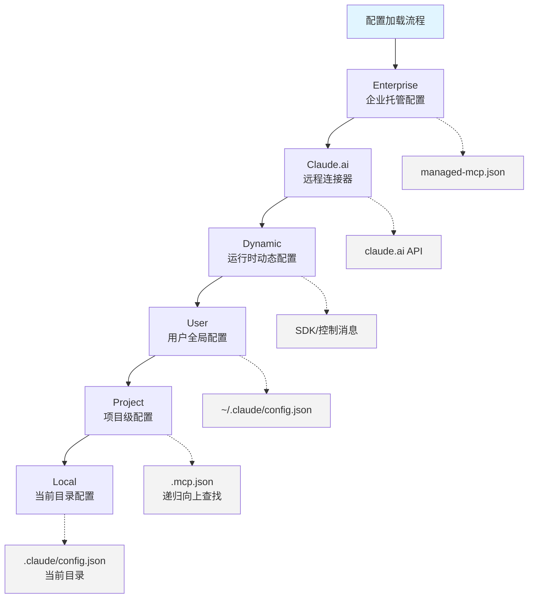
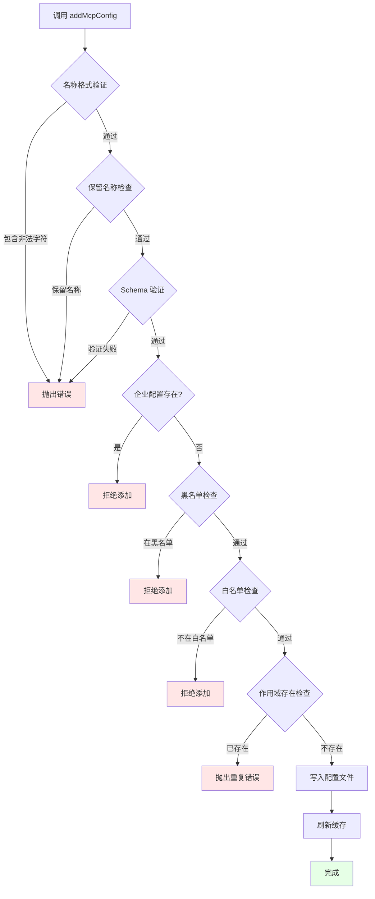
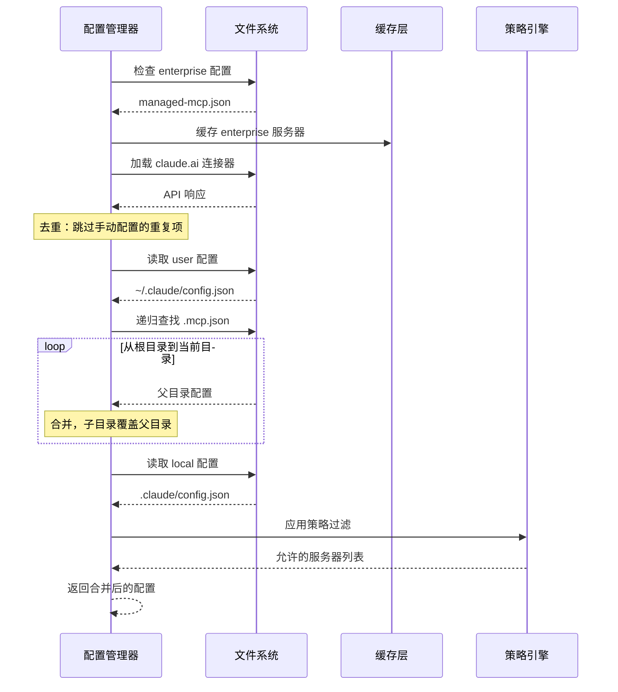
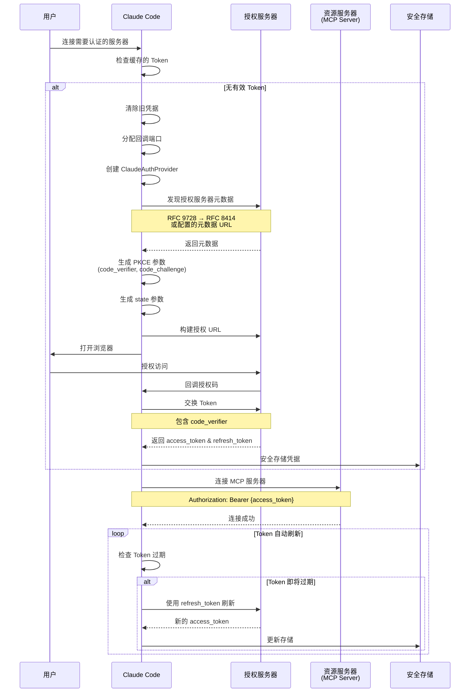
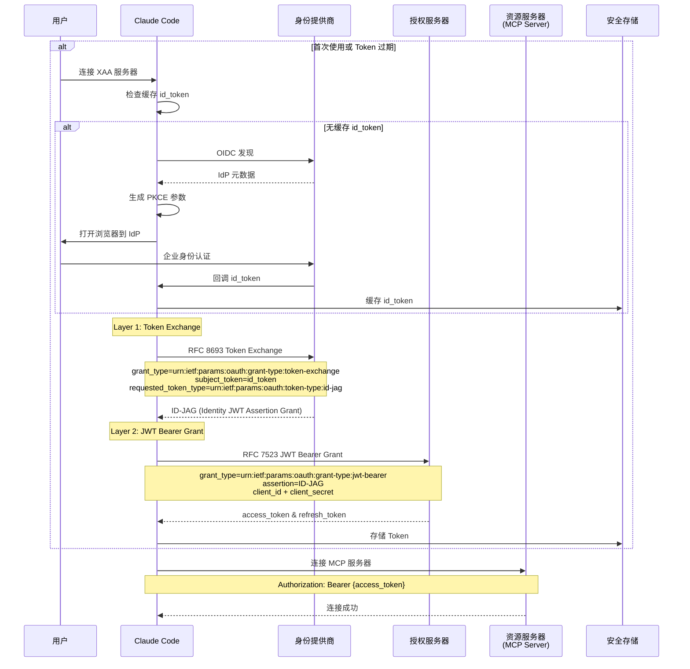
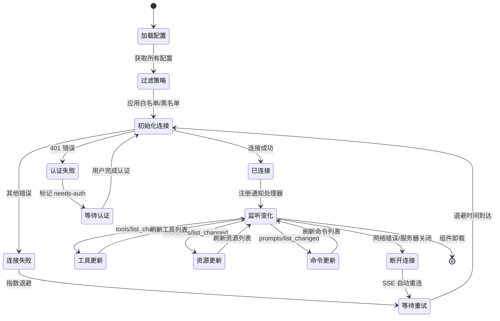

本文档深入解析 Claude Code 中 MCP（Model Context Protocol）服务器的配置管理与认证流程，揭示从配置声明到身份验证的完整生命周期。配置系统采用多作用域分层架构，认证流程支持标准 OAuth 2.0 和企业级 XAA（Cross-App Access）两种模式，通过安全存储和自动刷新机制确保持续可用性。

## 配置系统架构

### 多作用域配置层次

MCP 配置系统采用分层的配置作用域设计，每个作用域具有不同的优先级和持久化位置。配置加载时按照优先级从高到低合并，后加载的配置会覆盖先前的同名服务器定义。



配置作用域的优先级和用途如下表所示：

| 作用域 | 优先级 | 持久化位置 | 用途场景 |
|--------|--------|------------|----------|
| **enterprise** | 最高 | `~/.claude/managed/managed-mcp.json` | 企业 IT 集中管理的强制配置 |
| **claudeai** | 高 | Claude.ai 云端 API | 远程会话的云端连接器 |
| **dynamic** | 中高 | 运行时内存 | SDK 动态注入或控制消息 |
| **user** | 中 | `~/.claude/config.json` | 用户全局共享的服务器 |
| **project** | 中低 | `.mcp.json`（递归向上） | 项目共享的服务器配置 |
| **local** | 最低 | `.claude/config.json` | 当前目录的本地覆盖 |

Sources: [config.ts](src/services/mcp/config.ts#L10-L56)

### 传输类型与配置结构

MCP 服务器支持多种传输协议，每种类型对应不同的配置结构。系统通过 Zod Schema 进行严格的类型验证，确保配置的完整性和安全性。

**Stdio 传输配置**用于本地进程通信，是最常见的 MCP 服务器类型：

```typescript
{
  "type": "stdio",           // 可选，默认为 stdio
  "command": "npx",          // 必需：可执行命令
  "args": ["-y", "@modelcontextprotocol/server-filesystem", "/path"],
  "env": {                   // 可选：环境变量
    "API_KEY": "secret"
  }
}
```

**SSE/HTTP 传输配置**用于远程服务器，支持 OAuth 认证和自定义头部：

```typescript
{
  "type": "sse",             // 或 "http"
  "url": "https://api.example.com/mcp",
  "headers": {               // 可选：自定义 HTTP 头部
    "X-Custom-Header": "value"
  },
  "oauth": {                 // 可选：OAuth 配置
    "clientId": "xxx",
    "callbackPort": 8080,
    "authServerMetadataUrl": "https://auth.example.com/.well-known/oauth-authorization-server",
    "xaa": true              // 企业级 XAA 认证
  }
}
```

**WebSocket 传输配置**用于双向实时通信：

```typescript
{
  "type": "ws",
  "url": "wss://ws.example.com/mcp",
  "headers": {               // 可选：WebSocket 握手头部
    "Authorization": "Bearer token"
  }
}
```

Sources: [types.ts](src/services/mcp/types.ts#L28-L161)

### 配置验证与策略控制

配置系统实现了企业级的策略控制机制，支持白名单和黑名单两种模式。策略检查基于三个维度：服务器名称、命令数组（stdio 类型）和 URL 模式（远程类型）。

**白名单机制**：当设置 `allowedMcpServers` 时，只有匹配的服务器被允许连接。空数组表示禁止所有服务器。对于 stdio 服务器，如果存在任何 `serverCommand` 条目，则必须匹配命令数组；对于远程服务器，如果存在任何 `serverUrl` 条目，则必须匹配 URL 模式（支持通配符 `*`）。

**黑名单机制**：`deniedMcpServers` 具有绝对优先级，即使服务器在白名单中也会被拒绝。黑名单同样支持名称、命令和 URL 三种匹配方式。

```typescript
// 策略配置示例
{
  "allowedMcpServers": [
    { "serverName": "filesystem" },
    { "serverCommand": ["npx", "-y", "@modelcontextprotocol/server-*"] },
    { "serverUrl": "https://*.example.com/*" }
  ],
  "deniedMcpServers": [
    { "serverName": "dangerous-server" }
  ]
}
```

策略检查在配置加载、添加和连接时都会执行，确保企业安全策略的强制执行。当 `allowManagedMcpServersOnly` 设置启用时，只有策略设置中的白名单生效，用户无法自行添加服务器。

Sources: [config.ts](src/services/mcp/config.ts#L341-L551)

## 配置管理流程

### 添加服务器配置

通过 CLI 命令或 API 添加 MCP 服务器时，系统执行完整的验证和持久化流程。`addMcpConfig` 函数是配置添加的核心入口，实现了多层验证逻辑。



**名称验证规则**：服务器名称只能包含字母、数字、连字符和下划线（`[a-zA-Z0-9_-]`），并且不能使用保留名称（如 `claude-in-chrome`、`computer-use`）。

**环境变量展开**：配置中的字符串字段（command、args、url、headers、env）会自动展开环境变量。语法支持 `${VAR_NAME}` 和 `$VAR_NAME` 两种格式。如果引用的环境变量未定义，会记录到 `missingVars` 数组中，但不会阻止配置加载。

**原子性写入**：对于项目级配置（`.mcp.json`），系统采用原子性写入策略。先写入临时文件（`<path>.tmp.<pid>.<timestamp>`），刷新到磁盘后执行原子性重命名，避免写入过程中断导致配置文件损坏。写入时会保留原有文件的权限设置。

Sources: [config.ts](src/services/mcp/config.ts#L625-L834)

### 配置加载与合并

`getAllMcpConfigs` 函数负责从所有作用域加载配置并合并。合并过程按照作用域优先级从低到高执行，后加载的配置会覆盖先前的同名服务器。对于项目级配置，系统会从根目录递归向上查找到当前目录，距离当前目录越近的配置文件优先级越高。



**去重机制**：Claude.ai 远程连接器可能与用户手动配置的服务器重复。系统通过计算服务器签名（基于 command 或 url）进行去重，优先保留手动配置的服务器，被抑制的连接器记录到 `suppressed` 数组中用于调试。

**插件集成**：启用的插件可以提供 MCP 服务器配置。这些配置在 `pluginSource` 字段中标记插件来源，并在策略检查时享有特殊处理。插件提供的服务器同样需要通过策略验证。

Sources: [config.ts](src/services/mcp/config.ts#L200-L310)

### 配置作用域管理

不同作用域的配置存储位置和持久化方式不同，系统提供了统一的管理接口。

**项目级配置（.mcp.json）**：采用独立的 JSON 文件格式，便于项目共享和版本控制。文件结构简单，只包含 `mcpServers` 字段：

```json
{
  "mcpServers": {
    "server-name": {
      "type": "stdio",
      "command": "npx",
      "args": ["-y", "my-server"]
    }
  }
}
```

**用户级和本地级配置**：存储在统一的配置文件中，与其他设置共存。修改时通过 `saveGlobalConfig` 和 `saveCurrentProjectConfig` 函数执行，支持原子性更新和错误回滚。

**企业托管配置**：存储在 `~/.claude/managed/managed-mcp.json`，当此文件存在时，系统会禁止用户添加新服务器（抛出 "enterprise MCP configuration is active and has exclusive control" 错误），确保企业策略的绝对控制权。

Sources: [config.ts](src/services/mcp/config.ts#L800-L880)

## OAuth 2.0 认证流程

### 标准授权码流程

对于需要认证的远程 MCP 服务器（SSE/HTTP），系统实现完整的 OAuth 2.0 授权码流程，支持 PKCE（Proof Key for Code Exchange）扩展以增强安全性。



**授权服务器发现**：系统支持三种方式获取授权服务器元数据：
1. **配置的元数据 URL**：通过 `oauth.authServerMetadataUrl` 直接指定，必须使用 HTTPS 协议
2. **RFC 9728 发现**：探测 MCP 服务器的 `/.well-known/oauth-protected-resource`，从中提取授权服务器 URL，再执行 RFC 8414 发现
3. **RFC 8414 直接发现**：针对遗留服务器，直接在 MCP 服务器 URL 上执行发现（保留路径信息）

**回调服务器**：系统启动本地 HTTP 服务器监听授权回调。端口选择优先使用配置的 `callbackPort`，否则自动分配可用端口。回调处理包括：
- **State 验证**：防止 CSRF 攻击，回调中的 state 必须匹配请求时生成的值
- **错误处理**：OAuth 错误响应（`error`、`error_description`、`error_uri`）经过 XSS 过滤后显示给用户
- **超时机制**：5 分钟超时，避免无限等待
- **手动回调**：支持在远程环境中手动粘贴回调 URL

Sources: [auth.ts](src/services/mcp/auth.ts#L847-L1199)

### Token 管理与自动刷新

`ClaudeAuthProvider` 类实现了 OAuth Token 的生命周期管理，作为 MCP SDK 的认证提供者集成到传输层。

**Token 存储**：凭据通过操作系统安全存储机制持久化：
- **macOS**：使用 Keychain Services API
- **Windows**：使用 DPAPI（Data Protection API）
- **Linux**：使用 libsecret 或明文文件（根据系统配置）

存储的凭据包括：
```typescript
{
  serverName: string,
  serverUrl: string,
  accessToken: string,
  refreshToken?: string,
  expiresAt: number,           // Unix 时间戳（毫秒）
  scope?: string,
  clientId?: string,
  clientSecret?: string,       // 加密存储
  discoveryState: {
    authorizationServerUrl: string,
    resourceMetadataUrl?: string
  },
  stepUpScope?: string         // 步进认证所需 scope
}
```

**自动刷新策略**：每次调用 `tokens()` 方法时，系统检查 Token 是否即将过期（提前 5 分钟）。如果需要刷新，使用 `refresh_token` 向授权服务器的 `token_endpoint` 发送刷新请求。刷新失败会根据错误类型决定是否清除 `refresh_token`：
- `invalid_grant`、`invalid_token`：清除 `refresh_token`，需要重新认证
- 5xx 错误：保留 `refresh_token`，可能是临时服务器故障

**非标准错误处理**：部分 OAuth 服务器（如 Slack）使用非标准错误码。系统将这些错误码标准化为 `invalid_grant`：
- `invalid_refresh_token`
- `expired_refresh_token`
- `token_expired`

Sources: [auth.ts](src/services/mcp/auth.ts#L325-L616)

### Token 撤销机制

当用户清除认证或服务器返回 401 错误时，系统尝试在授权服务器端撤销 Token。撤销流程遵循 RFC 7009 规范，优先撤销 `refresh_token`（防止生成新的 access token），然后撤销 `access_token`。

**认证方法选择**：根据授权服务器元数据中的 `revocation_endpoint_auth_methods_supported` 选择认证方式：
- `client_secret_basic`：通过 Authorization 头部发送 Base64 编码的 client_id:client_secret
- `client_secret_post`：在请求体中发送 client_id 和 client_secret

对于公共客户端（无 client_secret），只在请求体中发送 `client_id`。如果撤销请求返回 401，系统会尝试使用 Bearer Token 认证作为后备方案（兼容非标准服务器）。

撤销失败不会阻止本地 Token 清除——撤销是尽力而为的操作，本地凭据清除才是关键步骤。

Sources: [auth.ts](src/services/mcp/auth.ts#L381-InLine59)

## XAA 企业级认证

### Cross-App Access 架构

XAA（Cross-App Access，SEP-990 规范）是企业级的免授权认证方案，通过 IdP（身份提供商）和企业 AS（授权服务器）的信任链，实现无浏览器授权界面的自动认证。



XAA 认证流程分为两个 RFC 层：

**Layer 1 - Token Exchange (RFC 8693)**：在 IdP 处将用户的 `id_token`（OpenID Connect 身份令牌）交换为 `ID-JAG`（Identity JWT Assertion Grant）。这是跨域身份断言，证明用户已通过企业 IdP 认证。

**Layer 2 - JWT Bearer Grant (RFC 7523)**：在 AS 处使用 `ID-JAG` 作为断言，配合 `client_id` 和 `client_secret` 获取 MCP 服务器的访问令牌。这一步验证客户端的合法性（通过 client credentials）和用户的身份（通过 ID-JAG）。

Sources: [xaa.ts](src/services/mcp/xaa.ts#L1-InLine200)

### XAA 配置与启用

XAA 需要在三个层面进行配置：

**1. IdP 配置**（全局一次性）：通过 `claude mcp xaa setup` 命令配置，存储在 `settings.xaaIdp` 中：
```json
{
  "issuer": "https://idp.example.com",
  "clientId": "idp-client-id",
  "callbackPort": 8765
}
```

**2. MCP 服务器配置**：在每个需要 XAA 的服务器配置中添加 `oauth.xaa: true`：
```json
{
  "type": "sse",
  "url": "https://mcp.example.com",
  "oauth": {
    "clientId": "as-client-id",
    "xaa": true
  }
}
```

**3. 环境变量**：必须设置 `CLAUDE_CODE_ENABLE_XAA=1` 才能启用 XAA 功能。这是特性开关，防止未准备好的环境误用。

**客户端密钥管理**：AS 的 `client_secret` 通过安全存储机制保存，不在配置文件中明文存储。添加服务器时使用 `--client-secret` 标志，系统会提示输入或从 `MCP_CLIENT_SECRET` 环境变量读取。

Sources: [addCommand.ts](src/commands/mcp/addCommand.ts#L100-L122)

### XAA 自动重认证

XAA 的核心优势是自动重认证能力。当 `access_token` 过期且 `refresh_token` 也失效时，系统不会要求用户重新授权，而是：

1. **检查缓存 id_token**：从安全存储读取之前获取的 `id_token`
2. **验证 id_token 有效性**：如果 id_token 仍然有效（未过期），直接使用它重新执行 Token Exchange → JWT Bearer 流程
3. **IdP 重新认证**（仅当 id_token 过期）：打开浏览器到 IdP 进行企业身份认证，获取新的 id_token

这意味着用户只需要在企业 IdP 认证一次，后续所有 XAA 服务器的认证都是自动的、静默的。即使所有 Token 都失效，也只需要在 IdP 认证一次，而不是为每个 MCP 服务器单独授权。

**错误处理**：Token Exchange 失败时，根据错误类型决定是否清除缓存的 id_token：
- 4xx 错误、`invalid_grant`、`invalid_token`：id_token 已失效，清除缓存
- 5xx 错误：IdP 可能临时故障，保留 id_token 以便重试

Sources: [auth.ts](src/services/mcp/auth.ts#L730-InLine845)

## 连接管理与状态同步

### MCPConnectionManager 架构

`MCPConnectionManager` 是 React Context Provider，封装了 MCP 连接管理的核心功能。它通过 `useManageMCPConnections` Hook 实现连接生命周期管理，并将关键操作暴露给组件树。

```typescript
interface MCPConnectionContextValue {
  reconnectMcpServer: (serverName: string) => Promise<{
    client: MCPServerConnection;
    tools: Tool[];
    commands: Command[];
    resources?: ServerResource[];
  }>;
  toggleMcpServer: (serverName: string) => Promise<void>;
}
```

**重连机制**：`reconnectMcpServer` 用于手动触发服务器重连，常用于认证后恢复连接或网络故障恢复。重连过程会：
1. 清除服务器缓存（工具、命令、资源列表）
2. 重新建立传输连接
3. 重新发现服务器能力（capabilities）
4. 刷新工具、命令、资源列表
5. 更新 AppState 中的客户端状态

**启用/禁用切换**：`toggleMcpServer` 切换服务器的启用状态。禁用的服务器不会建立连接，但配置仍然保留。这个操作会持久化到设置中的 `disabledMcpServers` 列表。

Sources: [MCPConnectionManager.tsx](src/services/mcp/MCPConnectionManager.tsx#L7-L72)

### 连接生命周期管理

`useManageMCPConnections` Hook 实现了完整的连接生命周期管理，包括初始化、监听变化、自动重连和清理。



**初始化流程**：
1. **加载配置**：调用 `getAllMcpConfigs` 获取合并后的配置
2. **过滤禁用服务器**：排除 `disabledMcpServers` 中的服务器
3. **应用策略**：执行企业策略过滤
4. **建立连接**：并行连接所有启用的服务器，使用 `pMap` 控制并发度
5. **发现能力**：查询服务器的 capabilities（tools、resources、prompts）
6. **更新状态**：将连接结果写入 AppState

**自动重连（SSE）**：对于 SSE 类型的服务器，SDK 内置了自动重连机制。当连接断开时，系统会尝试重新建立连接。如果重连成功，会自动重新订阅工具列表变更通知。

**指数退避重连**：对于连接失败的服务器，系统采用指数退避策略重试：
- 初始退避：1 秒
- 最大退避：30 秒
- 最大重试次数：5 次
- 退避计算：`min(INITIAL_BACKOFF_MS * 2^attempt, MAX_BACKOFF_MS)`

Sources: [useManageMCPConnections.ts](src/services/mcp/useManageMCPConnections.ts#L87-L150)

### 服务器状态模型

MCP 客户端在 AppState 中的状态分为几种类型，反映了连接的不同阶段：

| 状态类型 | 含义 | 用户可见行为 |
|----------|------|--------------|
| **connected** | 已连接且可用 | 服务器工具可调用，资源可访问 |
| **failed** | 连接失败 | 显示错误信息，可能需要配置检查 |
| **needs-auth** | 需要认证 | 显示认证按钮，等待用户授权 |
| **disabled** | 已禁用 | 不显示或灰显，可通过命令启用 |
| **connecting** | 正在连接 | 显示加载指示器 |

**状态转换触发器**：
- **connected → needs-auth**：传输层收到 401 错误，或 Token 刷新失败
- **needs-auth → connected**：用户完成 OAuth 流程，获得有效 Token
- **connected → failed**：网络错误、服务器不可用、协议错误
- **failed → connected**：自动重连成功，或用户手动重连
- **任意状态 → disabled**：用户执行禁用操作

**Channel 权限管理**：对于支持 Channel（频道）的 MCP 服务器，系统实现了额外的权限层。Channel 服务器的工具调用需要通过权限检查，权限决策通过 `ChannelPermissionNotification` 从服务器传递到客户端，用户批准后缓存到本地。

Sources: [types.ts](src/services/mcp/types.ts#L180-L199)

## UI 交互与用户流程

### MCPSettings 主界面

`/mcp` 命令打开 MCP 设置界面，这是用户管理 MCP 服务器的核心入口。界面采用标签页设计，分为"已配置服务器"和"代理服务器"两个视图。

**服务器列表**：显示所有已配置的服务器，包括：
- 服务器名称和作用域标签
- 连接状态指示器（已连接、需要认证、已禁用、连接失败）
- 传输类型图标（stdio、SSE、HTTP、WebSocket）
- 认证状态（对于远程服务器）

**服务器操作菜单**：点击服务器进入操作菜单，提供：
- **连接/断开**：手动控制连接状态
- **认证**：启动 OAuth 流程（仅限需要认证的服务器）
- **查看工具**：浏览服务器提供的工具列表
- **查看资源**：浏览服务器提供的资源（如果支持）
- **编辑配置**：修改服务器配置（未来功能）
- **删除**：从配置中移除服务器

Sources: [MCPSettings.tsx](src/components/mcp/MCPSettings.tsx#L21-L165)

### 认证流程 UI

当用户点击"认证"按钮时，系统启动完整的 OAuth 流程，UI 层面涉及多个步骤：

**1. 认证状态检查**：`MCPSettings` 组件在渲染服务器列表时，会为每个远程服务器创建 `ClaudeAuthProvider` 实例并调用 `tokens()` 方法检查认证状态。如果返回 `null` 或 Token 即将过期，标记为需要认证。

**2. 认证流程启动**：用户点击认证后，调用 `performMCPOAuthFlow` 函数。UI 显示进度指示器和取消按钮。

**3. 浏览器打开**：系统调用 `openBrowser` 打开默认浏览器到授权 URL。同时启动本地回调服务器监听端口。

**4. 等待回调**：UI 显示"等待浏览器授权..."消息，并监听以下事件：
- **回调成功**：浏览器重定向到 localhost，携带授权码
- **用户取消**：用户按 Esc 键或点击取消按钮
- **超时**：5 分钟无响应
- **错误**：OAuth 错误响应（access_denied、invalid_scope 等）

**5. Token 交换**：获取授权码后，系统在后台与授权服务器交换 Token。UI 显示"正在完成认证..."。

**6. 连接恢复**：Token 存储成功后，系统自动触发服务器重连。连接建立后，UI 更新服务器状态为"已连接"，并显示可用工具数量。

**手动回调模式**：在远程环境（SSH、WSL）中，浏览器可能无法访问 localhost。此时系统提供手动回调选项，用户在远程浏览器完成授权后，手动粘贴完整的回调 URL。

Sources: [auth.ts](src/services/mcp/auth.ts#L1054-L1097)

### 服务器详情视图

点击服务器工具列表进入详情视图，显示该服务器提供的所有 MCP 工具。每个工具卡片包含：

- **工具名称**：MCP 工具的原始名称（如 `read_file`）
- **显示名称**：Claude Code 中的工具名（如 `mcp__filesystem__read_file`）
- **描述**：工具的功能说明（从 MCP 服务器获取）
- **输入 Schema**：JSON Schema 格式的参数定义
- **使用统计**：调用次数、成功率、平均耗时

**工具过滤与搜索**：对于提供大量工具的服务器，用户可以通过搜索框快速定位。搜索支持工具名称和描述的模糊匹配。

**工具调用测试**：开发者模式下，可以直接在 UI 中测试工具调用。填写参数后执行，查看返回结果。这对于调试 MCP 服务器集成非常有用。

Sources: [MCPToolListView.tsx](src/components/mcp/MCPToolListView.tsx)

## 错误处理与恢复策略

### 认证错误分类

MCP 认证错误分为多个类别，每种类别对应不同的恢复策略：

| 错误类型 | 触发条件 | 恢复策略 |
|----------|----------|----------|
| **AuthenticationCancelledError** | 用户主动取消（Esc 键） | 不做任何操作，保留原状态 |
| **Token 过期** | access_token 超过 expiresAt | 自动使用 refresh_token 刷新 |
| **Refresh Token 失效** | 刷新时返回 invalid_grant | 清除凭据，标记需要认证 |
| **授权服务器不可达** | 元数据发现失败、网络错误 | 显示错误，提供重试选项 |
| **浏览器打开失败** | openBrowser 抛出异常 | 提供手动 URL 复制选项 |
| **State 不匹配** | 回调的 state 与请求不符 | 拒绝回调，记录安全警告 |
| **Port 被占用** | 回调端口 EADDRINUSE | 尝试下一个可用端口 |

**错误日志与遥测**：所有认证错误都会记录到 MCP 调试日志（通过 `logMCPDebug`），并可选地发送匿名遥测数据（`tengu_mcp_oauth_flow_failure` 事件）。遥测数据包含错误原因分类，但不包含敏感信息（服务器 URL、Token、用户数据）。

Sources: [auth.ts](src/services/mcp/auth.ts#L313-InLine363)

### 连接失败处理

MCP 服务器连接失败时，系统采用多层恢复策略：

**传输层重试**：对于暂时性错误（网络抖动、服务器重启），SDK 会自动重试连接。重试间隔采用指数退避，避免对服务器造成压力。

**状态持久化**：失败的服务器记录到 AppState 的 `mcp.clients` 数组中，类型为 `failed`。错误信息保存在 `error` 字段，供 UI 显示和调试。

**用户通知**：对于关键错误（如认证失败、配置错误），系统会显示通知消息，引导用户采取行动。通知内容包括：
- 错误描述（人性化语言）
- 可能的原因
- 建议的解决步骤
- 快速操作按钮（如"重新认证"、"查看日志"）

**诊断信息收集**：连接失败时，系统会收集诊断信息：
- 服务器配置（脱敏后的 URL、传输类型）
- 错误堆栈
- 时间戳和重试次数
- 网络环境（代理设置、TLS 配置）

这些信息可以通过 `/doctor` 命令导出，用于问题排查。

Sources: [client.ts](src/services/mcp/client.ts#L147-L199)

### 凭据清理与安全

当用户主动清除认证或系统检测到凭据失效时，执行完整的清理流程：

**1. Token 撤销**：尝试在授权服务器端撤销 access_token 和 refresh_token（如果服务器支持）。这是尽力而为的操作，失败不会阻止后续步骤。

**2. 本地存储清除**：从安全存储中删除该服务器的所有凭据，包括：
- access_token、refresh_token
- client_id、client_secret
- discoveryState（授权服务器元数据缓存）
- stepUpScope（步进认证所需 scope）

**3. 状态更新**：将服务器状态标记为 `needs-auth`，清除任何缓存的工具/资源列表。

**4. 传输断开**：关闭与 MCP 服务器的传输连接，释放资源。

**步进认证保留**：对于步进认证场景（服务器返回 401 要求更高权限 scope），用户重新认证时可以选择保留 `stepUpScope` 和 `resourceMetadataUrl`，避免重新探测服务器。

Sources: [auth.ts](src/services/mcp/auth.ts#L467-InLine599)

## 下一步阅读

本文档详细介绍了 MCP 服务器的配置管理和认证流程。要深入理解相关主题，建议继续阅读：

- **[MCP 客户端实现：连接管理与工具发现](15-mcp-ke-hu-duan-shi-xian-lian-jie-guan-li-yu-gong-ju-fa-xian)**：了解客户端如何建立连接、发现工具和管理传输层
- **[MCP 工具调用：MCPTool 与资源访问](16-mcp-gong-ju-diao-yong-mcptool-yu-zi-yuan-fang-wen)**：深入工具调用的执行流程和资源访问机制
- **[权限请求流程：用户交互与决策传播](11-quan-xian-qing-qiu-liu-cheng-yong-hu-jiao-hu-yu-jue-ce-chuan-bo)**：理解权限系统如何与 MCP 认证集成
- **[Bridge 主循环：IDE 双向通信协议](18-bridge-zhu-xun-huan-ide-shuang-xiang-tong-xin-xie-yi)**：探索 MCP 在 IDE 集成场景中的应用