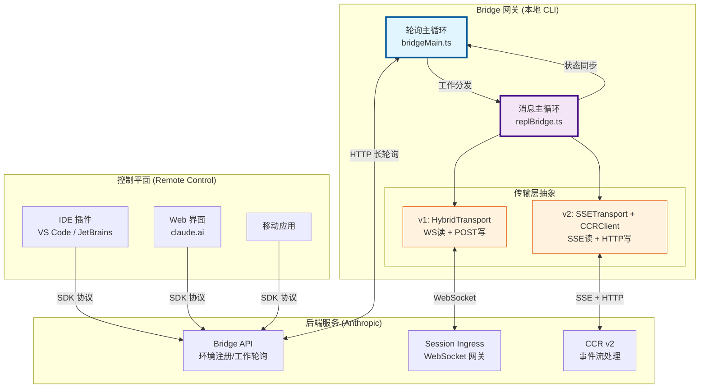
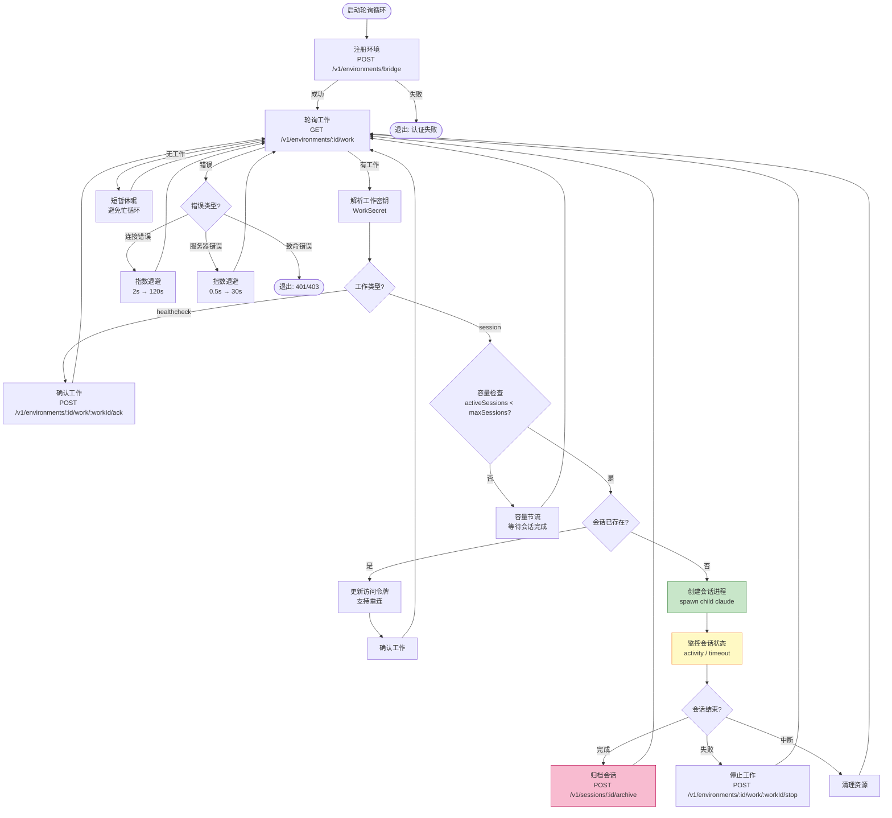
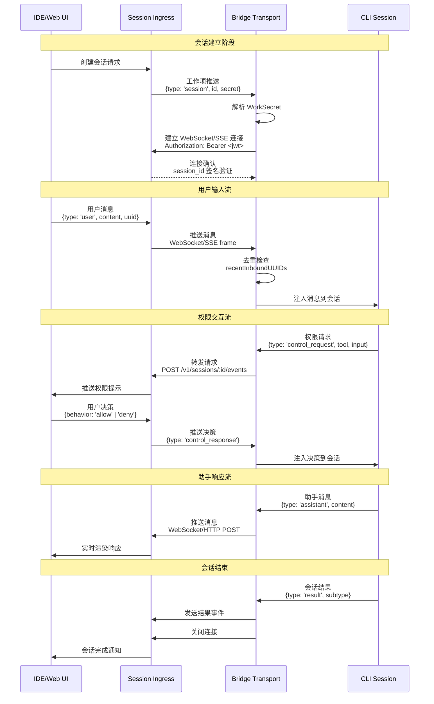
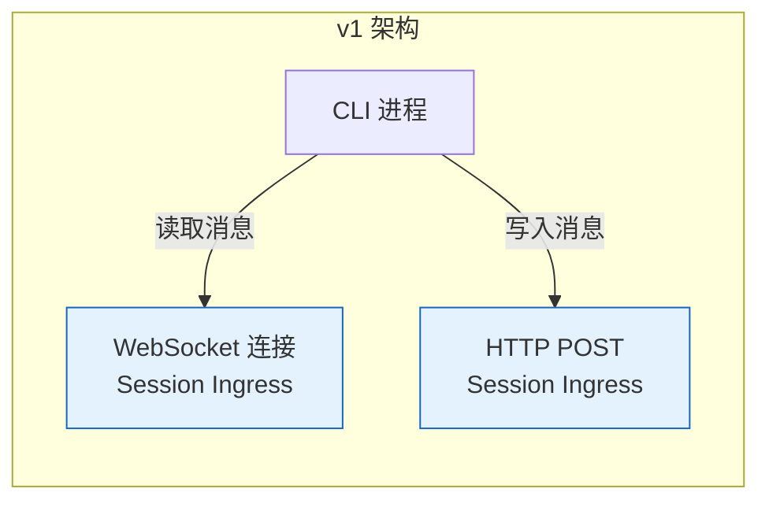
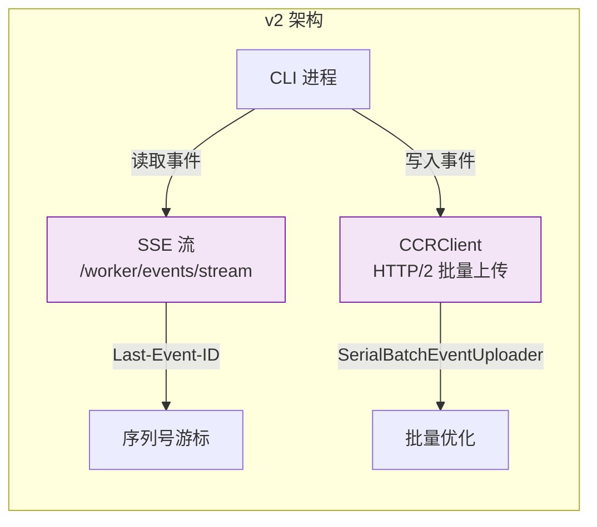
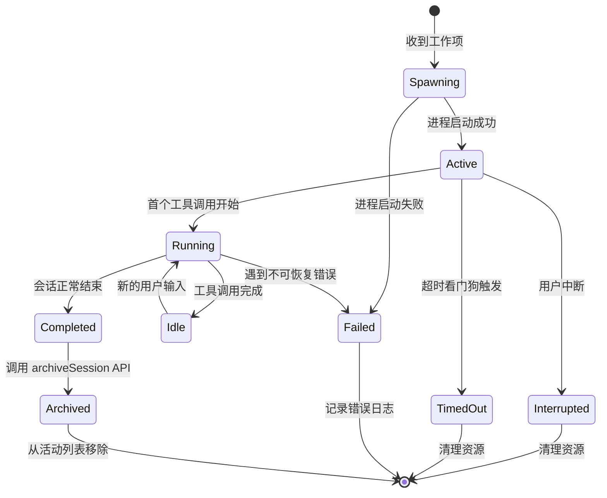
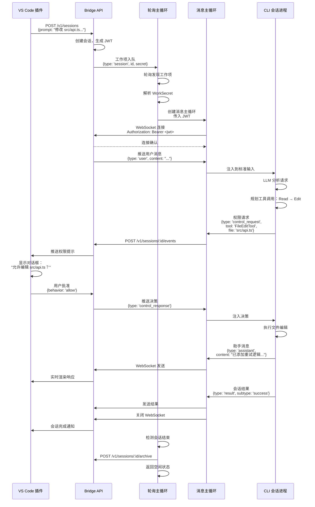

Bridge 系统是 Claude Code 与 IDE（VS Code、JetBrains 等）及 Web 界面之间实现**远程控制**的核心通信枢纽。它建立了一个持久化的双向通信通道，允许用户从任何位置（浏览器、移动设备、其他 IDE）远程操控本地 CLI 会话，同时将 CLI 的响应、工具执行状态和权限请求实时同步回控制端。这一架构解耦了**会话控制平面**（在哪里发号施令）与**执行平面**（在哪里实际运行代码），为多设备协作、后台任务监控和分布式开发工作流奠定了技术基础。

## 架构概览：三层通信模型

Bridge 系统采用**客户端-网关-服务端**的三层架构，通过两种不同的主循环协同工作：



**轮询主循环**（Polling Main Loop）负责**工作队列管理**：定期从后端拉取待处理的会话任务，管理会话的创建、监控和销毁，处理心跳和租约续期。这是**控制流**的核心，确保本地 CLI 能够接收远程发起的会话请求。

**消息主循环**（Messaging Main Loop）负责**实时消息路由**：建立持久的传输层连接（WebSocket 或 SSE），处理入站消息（用户输入、权限决策、控制指令）和出站消息（助手响应、工具状态、权限请求），维护会话状态的实时同步。这是**数据流**的核心，确保双向通信的低延迟和高可靠性。

Sources: [bridgeMain.ts](src/bridge/bridgeMain.ts#L85-L122), [replBridge.ts](src/bridge/replBridge.ts#L200-L399)

## 轮询主循环：工作队列的生命周期管理

轮询主循环通过 `runBridgeLoop` 函数实现，是一个**无限循环 + 指数退避**的健壮设计。其核心职责是从后端的**工作队列**中拉取任务，并管理本地会话的完整生命周期：



### 工作密钥解密与验证

每个工作项携带一个 **base64url 编码的 JSON 密钥**（WorkSecret），包含会话建立所需的所有敏感信息：

```typescript
type WorkSecret = {
  version: number                    // 版本号，当前为 1
  session_ingress_token: string      // JWT 令牌，用于 WebSocket 认证
  api_base_url: string               // API 基础 URL
  sources: Array<{                   // 代码源配置
    type: string
    git_info?: { 
      type: string
      repo: string
      ref?: string
      token?: string 
    }
  }>
  auth: Array<{                      // 认证凭据
    type: string
    token: string
  }>
  claude_code_args?: Record<string, string> | null
  mcp_config?: unknown | null        // MCP 服务器配置
  environment_variables?: Record<string, string> | null
  use_code_sessions?: boolean        // CCR v2 选择器
}
```

解密过程首先验证版本号和必填字段，然后提取 `session_ingress_token` 用于后续的 WebSocket 连接认证。这个 JWT 令牌由后端签发，包含会话 ID、过期时间和权限声明，避免了在本地存储长期凭据。

Sources: [workSecret.ts](src/bridge/workSecret.ts#L5-L40), [types.ts](src/bridge/types.ts#L36-L60)

### 会话创建与进程隔离

Bridge 支持三种**会话隔离模式**，通过 `spawnMode` 配置：

| 模式 | 工作目录 | 适用场景 | 隔离级别 |
|------|---------|---------|---------|
| **single-session** | `config.dir`（原始目录） | 传统单会话模式，会话结束后 Bridge 退出 | 无隔离 |
| **worktree** | 每个会话创建独立的 git worktree | 多会话并发，文件修改互不干扰 | 完全隔离 |
| **same-dir** | 所有会话共享 `config.dir` | 多会话并发，允许文件修改冲突 | 无隔离 |

在 **worktree 模式**下，Bridge 会为每个会话创建一个独立的 git worktree（路径如 `.worktrees/bridge-<session-id>`），确保并发会话不会互相干扰文件系统状态。会话结束后自动清理 worktree，保持工作区的整洁。

Sources: [bridgeMain.ts](src/bridge/bridgeMain.ts#L800-L900), [types.ts](src/bridge/types.ts#L62-L75)

### 心跳与租约续期

为防止网络分区导致的**僵尸会话**（客户端认为会话存活，但后端已超时清理），Bridge 实现了**双向心跳机制**：

1. **轮询心跳**：轮询主循环本身作为心跳，每次成功轮询都隐式确认环境存活
2. **显式心跳**：对于长时间无工作的环境，定期调用 `heartbeatWork` API 延长工作项的租约 TTL（300 秒）

心跳间隔通过 GrowthBook 特性开关动态配置（`non_exclusive_heartbeat_interval_ms`），允许运维团队在不重启服务的情况下调整频率。心跳失败不会立即终止会话，而是进入**指数退避重试**，只有在持续失败达到阈值（10 分钟）后才放弃。

Sources: [bridgeMain.ts](src/bridge/bridgeMain.ts#L1200-L1400)

## 消息主循环：双向实时通信

消息主循环通过 `initBridgeCore` 函数实现，负责建立**持久化的传输层连接**并路由所有实时消息。其核心是**传输层抽象**（ReplBridgeTransport），允许在 v1（WebSocket）和 v2（SSE + HTTP）之间无缝切换：



### 入站消息路由

入站消息（从 IDE 发送到 CLI）经过**三层过滤和路由**：

**第一层：类型守卫与协议验证**  
使用类型守卫函数（`isSDKMessage`、`isSDKControlResponse`、`isSDKControlRequest`）验证消息结构的合法性，防止畸形数据污染会话状态。

**第二层：去重与回声消除**  
维护两个**有界 UUID 集合**：
- `recentPostedUUIDs`：记录最近发送的消息 UUID，用于识别**回声**（服务器回放了我们自己发送的消息）
- `recentInboundUUIDs`：记录最近接收的消息 UUID，用于识别**重复投递**（网络分区后的历史回放）

**第三层：消息分发**  
根据消息类型路由到不同的处理器：
- **用户消息**（`type: 'user'`）：注入到会话的输入队列，触发 LLM 查询
- **权限响应**（`type: 'control_response'`）：解析用户对权限请求的决策，注入到会话的权限系统
- **控制请求**（`type: 'control_request'`）：处理服务器发起的指令（初始化、切换模型、中断会话等）

Sources: [bridgeMessaging.ts](src/bridge/bridgeMessaging.ts#L70-L180)

### 控制请求处理

控制请求是**服务器主动发起**的指令，要求客户端立即响应（否则服务器会在 10-14 秒后杀死连接）。Bridge 支持以下控制请求类型：

| 子类型 | 触发场景 | 响应内容 | 副作用 |
|--------|---------|---------|--------|
| **initialize** | 连接建立时 | 返回会话能力清单（命令、输出风格、模型列表） | 无 |
| **set_model** | 用户在 IDE 中切换模型 | 确认成功 | 更新会话的模型配置 |
| **set_max_thinking_tokens** | 调整思考 token 预算 | 确认成功 | 更新会话的 token 预算 |
| **set_permission_mode** | 切换权限模式 | 确认成功或错误 | 切换会话的权限模式 |
| **interrupt** | 用户点击"停止"按钮 | 确认成功 | 中断当前 LLM 查询 |

对于**仅出站模式**（outbound-only，如镜像模式的 Bridge），所有可变的控制请求（除 `initialize` 外）都返回错误响应，避免误导服务器认为操作成功。

Sources: [bridgeMessaging.ts](src/bridge/bridgeMessaging.ts#L220-L350)

### 出站消息与权限请求

出站消息（从 CLI 发送到 IDE）包括**常规消息**和**权限请求**两类：

**常规消息**通过 `writeMessages` 和 `writeSdkMessages` 发送：
- 用户消息（转发自 IDE 的输入，用于同步到其他客户端）
- 助手消息（LLM 的响应和工具调用）
- 系统消息（本地命令执行结果）

**权限请求**通过 `sendControlRequest` 发送，遵循**请求-响应模式**：
1. CLI 检测到需要权限的操作（如执行 Bash 命令、写入文件）
2. 构造 `control_request` 消息，包含工具名称、输入参数和唯一 `request_id`
3. 通过传输层发送到服务器，服务器推送到 IDE 显示权限提示
4. 用户在 IDE 中批准或拒绝
5. 服务器返回 `control_response`，包含用户决策（`behavior: 'allow' | 'deny'`）
6. CLI 根据决策执行或取消操作

这种设计确保**所有权限决策都在用户可见的上下文中进行**，避免在后台静默执行敏感操作。

Sources: [replBridge.ts](src/bridge/replBridge.ts#L30-L80), [bridgeMessaging.ts](src/bridge/bridgeMessaging.ts#L200-L220)

## 传输层设计：v1 与 v2 的演进

Bridge 系统的传输层经历了从 **WebSocket 优先**到**SSE + HTTP 分离**的架构演进，形成了两套并存的方案：

### v1：HybridTransport（WebSocket + POST）



v1 使用**单一 WebSocket 连接**处理所有读取操作，但写入操作通过**独立的 HTTP POST 请求**完成。这种混合设计的原因是：
- WebSocket 的**队头阻塞**问题：一个大消息的传输会阻塞后续消息
- HTTP POST 的**天然重试**能力：可以利用 axios 的重试机制，无需在 WebSocket 层实现
- **负载均衡友好**：POST 请求可以分散到多个后端实例，WebSocket 需要粘性会话

### v2：SSE + CCRClient（Server-Sent Events + HTTP/2）



v2 引入了**Server-Sent Events（SSE）**作为读取通道，并使用专门的 **CCRClient** 处理写入：

**SSE 的优势**：
- **序列号游标**：每个事件携带递增的序列号（`Last-Event-ID`），支持**断点续传**——传输层重连时只需携带最后一个序列号，服务器从该位置继续推送，避免全量历史回放
- **原生重连**：浏览器和 HTTP 客户端内置 SSE 重连逻辑，无需应用层实现
- **HTTP/2 多路复用**：SSE 和 CCRClient 可以共享同一个 TCP 连接，减少握手开销

**CCRClient 的优化**：
- **串行批量上传**（SerialBatchEventUploader）：将多个小消息合并为一个批量请求，减少网络往返
- **心跳保活**：定期发送心跳请求（默认 20 秒），保持 worker 注册状态
- **状态报告**：主动上报会话状态（`requires_action` 标志），让 IDE 显示"等待输入"指示器
- **投递追踪**：记录每个事件的 `processing_at` 和 `processed_at` 时间戳，用于性能监控

Sources: [replBridgeTransport.ts](src/bridge/replBridgeTransport.ts#L1-L200), [types.ts](src/bridge/types.ts#L150-L220)

### 传输层切换与会话恢复

Bridge 支持**无缝的传输层切换**，用于处理以下场景：
- **JWT 过期**：令牌刷新后，需要重新建立连接
- **网络分区**：连接断开后，使用新传输层重连
- **协议升级**：从 v1 迁移到 v2，无需重启会话

切换流程通过**序列号游标**实现：
1. 旧传输层关闭前，读取 `getLastSequenceNum()` 获取当前事件流的最高序列号
2. 创建新传输层时，传入 `initialSequenceNum` 参数
3. 新传输层的首次连接携带 `from_sequence_num` 查询参数（SSE）或 `Last-Event-ID` 头
4. 服务器从指定序列号继续推送事件，**避免重复投递**

这种设计确保了**零消息丢失**和**无重复处理**，即使在频繁切换传输层的情况下也能保持语义一致性。

Sources: [replBridgeTransport.ts](src/bridge/replBridgeTransport.ts#L130-L200)

## 会话管理：生命周期与状态同步

Bridge 的会话管理涵盖从创建到归档的**完整生命周期**，并通过**状态同步机制**保持本地 CLI 与远程控制端的视图一致：

### 会话状态机



每个会话的状态通过 `SessionHandle` 对象管理，包含：
- **进程控制**：`done` Promise（会话结束信号）、`kill()` 和 `forceKill()` 方法
- **活动追踪**：`activities` 环形缓冲区（最近 10 个活动）、`currentActivity` 当前状态
- **通信通道**：`writeStdin()` 直接写入进程标准输入、`updateAccessToken()` 刷新令牌
- **诊断信息**：`lastStderr` 错误输出环形缓冲区（最近 10 行）

Sources: [types.ts](src/bridge/types.ts#L150-L220), [sessionRunner.ts](src/bridge/sessionRunner.ts#L1-L200)

### 活动监控与状态显示

Bridge 实时解析 CLI 的标准输出（JSON Lines 格式），提取**会话活动**并更新状态显示：

```typescript
type SessionActivity = {
  type: 'tool_start' | 'text' | 'result' | 'error'
  summary: string              // 人类可读的活动描述
  timestamp: number
}
```

活动提取逻辑处理三种主要消息类型：
- **assistant 消息**：识别 `tool_use` 块（提取工具名称和目标文件）和 `text` 块（提取文本预览）
- **result 消息**：识别成功/失败状态，提取错误摘要
- **权限请求**：识别 `control_request`，提取工具名称和输入参数

状态显示通过**定时器**（每秒刷新）更新，展示：
- 会话运行时长（从启动开始计时）
- 当前活动（如 "Editing src/foo.ts"）
- 工具调用轨迹（最近 5 个工具调用的摘要）

Sources: [sessionRunner.ts](src/bridge/sessionRunner.ts#L60-L180)

### 超时看门狗

为防止**僵尸会话**无限期占用资源，Bridge 实现了**超时看门狗**机制：
- 每个会话启动时，设置一个延迟定时器（默认 24 小时，可通过 `--session-timeout` 配置）
- 定时器触发时，强制终止会话进程并标记为 `timedOut`
- 超时会话在 `onSessionDone` 中被当作**失败会话**处理（触发 `stopWork` 和错误日志）

超时机制确保即使网络完全中断，本地资源也能在合理时间内释放。

Sources: [bridgeMain.ts](src/bridge/bridgeMain.ts#L400-L500)

## 认证与安全：多层防御策略

Bridge 系统实现了**三层认证机制**，确保只有授权用户才能控制本地会话：

### OAuth 2.0 用户认证

首次连接时，Bridge 通过 OAuth 2.0 流程验证用户身份：
1. 检查本地是否存储有效的 OAuth 令牌（`claudeAiOAuthTokens`）
2. 如无令牌或令牌过期，引导用户执行 `/login` 命令
3. 使用 OAuth 令牌调用 `registerBridgeEnvironment` API，注册本地环境
4. 后端返回 `environment_id` 和 `environment_secret`，用于后续轮询

OAuth 令牌的**自动刷新**通过 `onAuth401` 回调实现：当 API 返回 401 时，尝试使用刷新令牌获取新的访问令牌，并重试请求。

Sources: [bridgeConfig.ts](src/bridge/bridgeConfig.ts#L1-L49), [bridgeApi.ts](src/bridge/bridgeApi.ts#L80-L130)

### JWT 会话令牌

每个工作项携带一个 **JWT 会话令牌**（`session_ingress_token`），用于 WebSocket/SSE 连接认证：
- **签名验证**：后端使用私钥签名，客户端验证签名确保令牌未被篡改
- **过期检查**：JWT 包含 `exp` 声明，客户端拒绝过期令牌
- **会话绑定**：JWT 的 `session_id` 声明必须与 URL 路径中的会话 ID 匹配

JWT 的**自动刷新**通过 `createTokenRefreshScheduler` 实现：
- 解析 JWT 的过期时间，在过期前 5 分钟调度刷新
- 刷新时，后端重新分发工作项（携带新 JWT），轮询主循环检测到现有会话，调用 `updateAccessToken` 更新令牌
- 新传输层使用新 JWT 建立连接，实现**无中断的令牌轮换**

Sources: [jwtUtils.ts](src/bridge/jwtUtils.ts#L1-L100), [workSecret.ts](src/bridge/workSecret.ts#L5-L40)

### 受信任设备认证

对于**高安全等级**的会话（如访问生产环境），Bridge 支持**受信任设备认证**：
- 用户首次在设备上执行远程控制时，需要在 claude.ai 网站上**确认设备信任**
- 信任确认后，后端签发一个**受信任设备令牌**（存储在本地密钥链）
- 后续请求携带 `X-Trusted-Device-Token` 头，后端跳过二次确认

这一机制通过 `getTrustedDeviceToken` 函数实现，仅在服务端的 `tengu_sessions_elevated_auth_enforcement` 开关启用时要求。

Sources: [trustedDevice.ts](src/bridge/trustedDevice.ts#L1-L100), [bridgeApi.ts](src/bridge/bridgeApi.ts#L30-L50)

## 错误处理与重连：指数退避策略

Bridge 的错误处理遵循**分级退避**原则，区分**临时性错误**（网络抖动、服务器过载）和**致命错误**（认证失败、权限不足）：

### 错误分类与响应策略

| 错误类型 | 检测条件 | 退避策略 | 最大等待时间 | 失败动作 |
|---------|---------|---------|------------|---------|
| **连接错误** | `ECONNREFUSED`、`ENOTFOUND`、超时 | 指数退避（2s → 120s） | 10 分钟 | 退出并报错 |
| **服务器错误** | HTTP 5xx | 指数退避（0.5s → 30s） | 10 分钟 | 退出并报错 |
| **认证失败** | HTTP 401/403 | 无退避 | 立即 | 退出并提示 `/login` |
| **环境过期** | `error_type: 'environment_expired'` | 无退避 | 立即 | 优雅退出 |

退避算法使用**抖动**（jitter）避免**惊群效应**：实际延迟在基础退避值上增加 ±25% 的随机偏移，防止多个客户端同时重试导致服务器过载。

Sources: [bridgeMain.ts](src/bridge/bridgeMain.ts#L1200-L1400)

### 系统睡眠检测

对于**笔记本电脑**等可能进入睡眠状态的设备，Bridge 实现了**睡眠检测**机制：
- 记录每次错误发生的时间戳
- 如果两次错误的时间间隔**远超**预期的退避时间（超过连接退避上限的 2 倍），判定为系统刚从睡眠中恢复
- **重置所有退避计数器**，立即重新尝试连接，避免在睡眠后继续等待过时的退避延迟

这一机制确保用户打开笔记本盖子后，Bridge 能**快速恢复**而不是等待几分钟的退避延迟。

Sources: [bridgeMain.ts](src/bridge/bridgeMain.ts#L1300-L1350)

### 优雅关闭与资源清理

Bridge 支持**优雅关闭**（SIGTERM 信号）和**强制关闭**（SIGKILL 信号）：
1. **停止接受新工作**：设置 `loopSignal.aborted` 标志，阻止轮询主循环继续
2. **等待活动会话完成**：给予 30 秒的宽限期（`shutdownGraceMs`）
3. **强制终止残留会话**：宽限期后调用 `forceKill()` 发送 SIGKILL
4. **清理工作树**：删除所有为会话创建的 git worktree
5. **注销环境**：调用 `deregisterEnvironment` API 通知后端
6. **写入诊断日志**：记录关闭原因和会话统计信息

优雅关闭确保**无数据丢失**和**资源完全释放**，避免僵尸进程和孤立文件。

Sources: [bridgeMain.ts](src/bridge/bridgeMain.ts#L500-L600)

## 实战示例：远程控制工作流

以下展示一个完整的远程控制工作流，从 IDE 发起请求到 CLI 执行并返回结果：

### 场景：在 VS Code 中远程执行文件编辑

1. **用户在 VS Code 中打开远程控制面板**，选择本地 CLI 环境
2. **输入指令**："修改 src/api.ts，添加错误重试逻辑"
3. **消息流**：



4. **用户在 VS Code 中看到**：
   - 实时的助手响应流
   - 文件编辑的 diff 预览
   - 会话完成的确认消息

这个工作流展示了 Bridge 如何**协调多个组件**（IDE、API、轮询循环、消息循环、CLI 进程）完成一个复杂的远程操作，同时保持**低延迟**（WebSocket 实时推送）和**高安全性**（权限审批流程）。

Sources: [bridgeMain.ts](src/bridge/bridgeMain.ts#L800-L1000), [replBridge.ts](src/bridge/replBridge.ts#L400-L600)

## 关键设计原则

Bridge 系统的架构体现了以下设计原则，这些原则确保了系统的**健壮性**、**可扩展性**和**可维护性**：

### 1. 关注点分离

**轮询主循环**与**消息主循环**的分离确保了**控制流**与**数据流**的解耦：
- 轮询主循环专注于**生命周期管理**（创建、监控、销毁），不关心消息内容
- 消息主循环专注于**实时通信**（路由、转换、去重），不关心会话调度

这种分离允许**独立演进**：例如，v2 传输层升级只影响消息主循环，轮询主循环无需修改。

### 2. 防御性编程

Bridge 在多个层次实施**防御性检查**：
- **协议验证**：类型守卫确保消息结构合法
- **去重保护**：有界 UUID 集合防止重复处理
- **超时保护**：看门狗定时器防止资源泄漏
- **睡眠检测**：自动恢复机制处理系统睡眠

这些检查确保**即使网络不可靠，系统也不会进入不一致状态**。

### 3. 优雅降级

Bridge 在遇到错误时采用**渐进式降级**策略：
- **首选重试**：指数退避 + 抖动，给予临时性错误恢复机会
- **次选重连**：传输层切换 + 序列号游标，保持会话连续性
- **最后退出**：仅在致命错误（认证失败、持续超时）时终止，并记录详细日志

这种策略最大化了**服务可用性**，同时避免**无限重试**导致的资源浪费。

### 4. 可观测性

Bridge 内置了**丰富的诊断日志**：
- **结构化日志**：所有日志包含 `sessionId`、`workId`、`environmentId` 等上下文
- **关键事件追踪**：环境注册、会话创建、传输层切换、错误恢复等事件都有专用日志
- **性能指标**：会话时长、工具调用次数、重连次数等指标用于性能分析

这些日志通过 `logForDebugging`（开发调试）和 `logForDiagnosticsNoPII`（生产诊断）两个通道输出，确保**开发环境详细，生产环境安全**。

Sources: [bridgeMain.ts](src/bridge/bridgeMain.ts#L1-L122), [bridgeMessaging.ts](src/bridge/bridgeMessaging.ts#L1-L100)

## 下一步探索

Bridge 系统与 Claude Code 的其他核心模块紧密集成，建议按以下顺序深入探索：

1. **[会话管理：sessionRunner 与多环境支持](19-hui-hua-guan-li-sessionrunner-yu-duo-huan-jing-zhi-chi)**：了解 Bridge 如何创建和管理 CLI 子进程，以及 worktree 隔离机制的实现细节
2. **[JWT 认证与受信任设备机制](20-jwt-ren-zheng-yu-shou-xin-ren-she-bei-ji-zhi)**：深入理解 JWT 令牌的签发、验证和自动刷新流程
3. **[权限模式系统：default、plan、auto、bypass 等模式解析](9-quan-xian-mo-shi-xi-tong-default-plan-auto-bypass-deng-mo-shi-jie-xi)**：探索 Bridge 的权限请求如何与本地权限系统集成
4. **[远程会话：RemoteSessionManager 与 WebSocket 通信](39-yuan-cheng-hui-hua-remotesessionmanager-yu-websocket-tong-xin)**：对比 Bridge 与其他远程会话管理方案的异同

通过这些探索，你将全面掌握 Claude Code 的**远程控制架构**，并能够为类似的分布式系统设计提供参考模式。