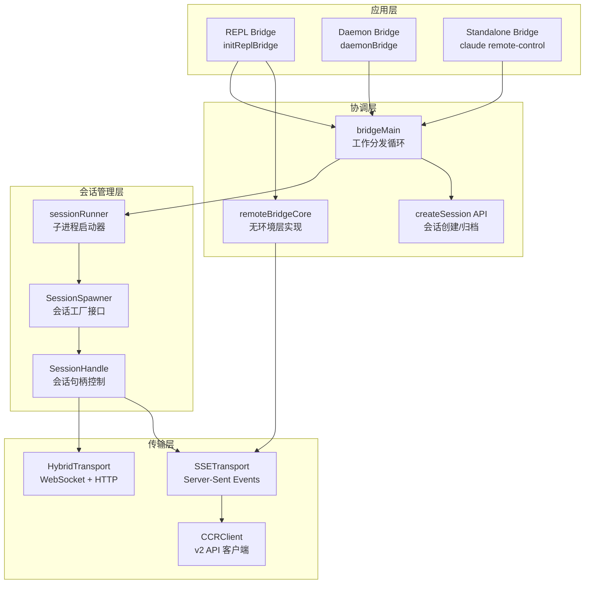

会话管理是 Bridge 系统的核心功能，负责在远程控制场景下创建、监控和清理 Claude Code 子进程会话。`sessionRunner` 模块通过子进程管理实现了本地 CLI 与云端 claude.ai 的双向通信桥梁，同时支持多种环境隔离策略以适应不同的并发场景。

## 架构概览：从会话启动到生命周期管理

Bridge 系统的会话管理采用分层架构设计：底层 `sessionRunner` 负责子进程启动与通信，中层 `bridgeMain` 实现工作分发循环，上层通过 `createSession` API 与云端进行会话协调。这种分层设计使得 REPL 模式、daemon 模式和 standalone bridge 可以共享核心逻辑，同时根据场景需求选择不同的传输协议和环境隔离策略。

Sources: [bridgeMain.ts](src/bridge/bridgeMain.ts#L141-L152), [remoteBridgeCore.ts](src/bridge/remoteBridgeCore.ts#L140-L184), [sessionRunner.ts](src/bridge/sessionRunner.ts#L248-L251)

## sessionRunner 核心机制

### 会话启动器工厂模式

`createSessionSpawner` 函数返回一个 `SessionSpawner` 对象，该对象通过工厂模式封装了子进程启动的复杂逻辑。这种设计允许调用方在不同环境下注入不同的依赖配置，实现测试友好和配置灵活的目标。`SessionSpawnerDeps` 接口定义了启动器所需的所有依赖：执行路径、环境变量、权限模式、调试输出回调以及权限请求处理器。

Sources: [sessionRunner.ts](src/bridge/sessionRunner.ts#L45-L67), [sessionRunner.ts](src/bridge/sessionRunner.ts#L248-L251)

### 子进程启动与通信配置

会话启动过程通过 Node.js 的 `spawn` API 创建子进程，配置了三路标准流管道：stdin 用于控制消息输入，stdout 用于 NDJSON 消息解析，stderr 用于错误捕获和诊断。启动参数包括 `--sdk-url`（指定 WebSocket 连接地址）、`--session-id`（标识会话身份）、`--input-format stream-json` 和 `--output-format stream-json`（启用流式 JSON 协议），以及 `--replay-user-messages`（重放用户消息以提取会话标题）。

环境变量配置采用多层策略：首先复制父进程环境，然后清除 `CLAUDE_CODE_OAUTH_TOKEN` 以避免子进程使用错误的认证令牌，设置 `CLAUDE_CODE_ENVIRONMENT_KIND` 为 `bridge` 标识运行环境，注入 `CLAUDE_CODE_SESSION_ACCESS_TOKEN` 作为会话级认证凭证。对于 CCR v2 模式，额外设置 `CLAUDE_CODE_USE_CCR_V2` 和 `CLAUDE_CODE_WORKER_EPOCH` 环境变量以启用新的传输协议。

Sources: [sessionRunner.ts](src/bridge/sessionRunner.ts#L287-L323), [sessionRunner.ts](src/bridge/sessionRunner.ts#L335-L340)

### 活动追踪与状态提取

`extractActivities` 函数从子进程的 NDJSON 输出流中解析并提取会话活动信息。该函数识别三类消息类型：`assistant` 消息中的 `tool_use` 块生成 `tool_start` 活动（附带工具摘要，如 "Editing src/foo.ts"），`text` 块生成文本活动；`result` 消息根据 `subtype` 字段生成成功或错误活动。所有活动存储在环形缓冲区中，最多保留最近 10 条记录，避免内存无限增长。

工具摘要生成通过 `toolSummary` 函数实现，该函数维护了一个工具名称到可读动词的映射表（如 `Read` → `Reading`、`Bash` → `Running`），然后从工具输入中提取关键参数（`file_path`、`command`、`url` 等）构建简洁的状态描述。这种设计使得 bridge 可以实时显示子进程正在执行的操作，提升用户体验。

Sources: [sessionRunner.ts](src/bridge/sessionRunner.ts#L107-L200), [sessionRunner.ts](src/bridge/sessionRunner.ts#L69-L105)

### 会话句柄与进程控制

`SessionHandle` 接口定义了会话控制的完整 API：`done` Promise 在会话结束时 resolve 为 `SessionDoneStatus`（'completed'、'failed' 或 'interrupted'），`kill` 方法发送 SIGTERM 信号优雅终止进程，`forceKill` 方法在 SIGTERM 超时后发送 SIGKILL 强制终止，`writeStdin` 方法直接向子进程 stdin 写入数据，`updateAccessToken` 方法通过 stdin 发送 `update_environment_variables` 消息更新会话令牌。

进程终止逻辑针对 Windows 平台做了特殊处理：Windows 上 `child.kill('SIGTERM')` 会抛出异常，因此直接调用 `child.kill()` 使用默认信号。这种跨平台适配确保了 bridge 系统在不同操作系统上的一致行为。错误处理通过监听 `child.on('error')` 事件捕获启动失败场景，并 resolve 为 'failed' 状态。

Sources: [sessionRunner.ts](src/bridge/sessionRunner.ts#L482-L543), [types.ts](src/bridge/types.ts#L178-L190)

## 多环境支持策略

### SpawnMode：三种隔离模式

Bridge 系统通过 `SpawnMode` 类型定义了三种环境隔离策略，满足不同的并发需求：

| 模式 | 描述 | 工作目录策略 | 会话隔离级别 | 适用场景 |
|------|------|-------------|-------------|---------|
| **single-session** | 单会话模式 | 当前工作目录 | 进程级隔离 | 临时调试、单次任务执行 |
| **worktree** | 工作树模式 | 每个 session 创建独立 git worktree | 文件系统级隔离 | 多任务并发、避免文件冲突 |
| **same-dir** | 共享目录模式 | 所有 session 共享同一目录 | 无隔离 | 只读操作、快速原型验证 |

`single-session` 模式是最简单的实现：bridge 启动后只接受一个会话，会话结束后自动关闭。这种模式适合临时性的远程控制需求，如快速调试或单次任务执行。`worktree` 模式为每个会话创建独立的 git worktree，确保文件系统级别的隔离，避免并发会话之间的文件冲突，适合长时间运行的多任务场景。`same-dir` 模式允许多个会话在同一目录下并发运行，虽然性能最高但存在数据竞争风险，适合只读操作或对隔离性要求不高的场景。

Sources: [types.ts](src/bridge/types.ts#L63-L69), [bridgeMain.ts](src/bridge/bridgeMain.ts#L86-L98)

### Worktree 管理与清理

在 `worktree` 模式下，bridge 为每个会话调用 `createAgentWorktree` 创建独立的 git 工作树，工作树路径存储在 `sessionWorktrees` Map 中。会话结束时，清理逻辑通过 `removeAgentWorktree` 删除工作树并释放资源。清理过程被包装在 Promise 中并通过 `trackCleanup` 函数注册到 `pendingCleanups` 集合，确保 shutdown 序列可以等待所有异步清理完成后再退出进程。

Worktree 分支命名遵循 `claude/{base-branch}` 模式，其中 `base-branch` 从 git 仓库的默认分支或当前分支推导而来。这种命名约定使得用户可以轻松识别 bridge 创建的工作树，并在需要时手动管理。清理逻辑同时处理正常终止和异常终止场景，通过 `try/catch` 包裹清理操作避免资源泄漏。

Sources: [bridgeMain.ts](src/bridge/bridgeMain.ts#L176-L184), [bridgeMain.ts](src/bridge/bridgeMain.ts#L316-L321)

### 容量管理与并发控制

Bridge 配置中的 `maxSessions` 参数定义了最大并发会话数，默认值为 32。当活跃会话数达到上限时，bridge 进入容量等待状态：工作分发循环暂停轮询，通过 `capacityWake` 信号量等待会话完成事件。一旦有会话结束，`capacityWake.wake()` 被调用，轮询循环立即恢复，接受新的工作项。

这种设计避免了在容量饱和时频繁轮询服务器造成的资源浪费，同时保证了会话完成后的即时响应。容量状态通过 `logger.updateSessionCount` 实时显示在状态栏，用户可以看到当前的会话使用情况（如 "Capacity: 3/32"）。对于 `single-session` 模式，`maxSessions` 被强制设置为 1，简化了状态显示逻辑。

Sources: [bridgeMain.ts](src/bridge/bridgeMain.ts#L83), [bridgeMain.ts](src/bridge/bridgeMain.ts#L193-L194), [bridgeMain.ts](src/bridge/bridgeMain.ts#L371-L379)

## 会话生命周期协调

### Bridge 主循环架构

`runBridgeLoop` 函数实现了 bridge 的核心工作分发循环，该循环持续轮询服务器获取工作项，为每个工作项启动子进程会话，并监控会话状态直到完成。循环使用 `AbortController` 实现优雅关闭：外部信号（如用户按 Ctrl+C）触发 `controller.abort()`，循环在下一次迭代时检测到 `loopSignal.aborted` 并退出。

循环内部维护了多个状态集合：`activeSessions` Map 存储活跃会话句柄，`sessionStartTimes` Map 记录会话启动时间（用于计算持续时间），`sessionWorkIds` Map 关联会话 ID 和工作项 ID，`sessionIngressTokens` Map 存储 JWT 令牌（与会话句柄中的 accessToken 分离，因为 token 刷新调度器会覆盖后者）。这些集合共同构成了会话状态管理的完整图景。

Sources: [bridgeMain.ts](src/bridge/bridgeMain.ts#L141-L194), [bridgeMain.ts](src/bridge/bridgeMain.ts#L154-L161)

### 心跳机制与租约续期

Bridge 通过定期心跳维持工作项的租约。`heartbeatActiveWorkItems` 函数遍历所有活跃会话，调用 `api.heartbeatWork` 向服务器发送心跳请求。心跳使用 Session Ingress JWT 认证（通过 `sessionIngressTokens` Map 获取），避免了每次心跳都查询数据库的性能开销。

当心跳收到 401 或 403 响应时，表明 JWT 已过期，函数调用 `api.reconnectSession` 触发服务器端的重新分发机制：服务器将工作项重新放入队列，下次轮询时 bridge 会收到包含新 JWT 的同一工作项，通过 `existingHandle` 路径更新会话令牌而不是重新启动子进程。这种设计实现了无感知的令牌刷新，避免了会话中断。

Sources: [bridgeMain.ts](src/bridge/bridgeMain.ts#L202-L270), [bridgeMain.ts](src/bridge/bridgeMain.ts#L279-L313)

### 令牌刷新调度器

`createTokenRefreshScheduler` 创建了一个主动令牌刷新机制，在 JWT 过期前 5 分钟触发刷新回调。对于 v1 会话（使用 HybridTransport），刷新回调调用 `handle.updateAccessToken` 直接更新子进程的环境变量；对于 v2 会话（使用 SSETransport + CCRClient），刷新回调调用 `api.reconnectSession` 触发服务器重新分发，因为 v2 端点要求 JWT 的 `session_id` 声明与注册时的值匹配，直接替换令牌会导致认证失败。

这种差异化的刷新策略确保了两种传输协议的兼容性。刷新调度器通过 `setInterval` 实现，间隔根据令牌的 `expires_in` 字段动态计算，确保在正确的时机触发刷新。如果刷新失败，错误被记录但不会中断会话，依赖于心跳机制的超时检测作为后备保护。

Sources: [bridgeMain.ts](src/bridge/bridgeMain.ts#L284-L313), [jwtUtils.ts](src/bridge/jwtUtils.ts#L1-L50)

### 会话完成与清理

会话完成时，`onSessionDone` 回调根据会话状态执行清理操作：对于 `completed` 状态，调用 `api.archiveSession` 归档会话（使其在 claude.ai 上不再显示为活跃）；对于 `interrupted` 状态，调用 `api.stopWork` 通知服务器停止工作项；对于 `timedOutSessions` 集合中的会话（超时 watchdog 触发的终止），跳过服务器通知因为超时检测已经调用了 `stopWork`。

清理逻辑同时处理 worktree 移除（如果是 `worktree` 模式）、会话计时器清除、活跃会话集合移除等操作。所有异步清理操作通过 `trackCleanup` 注册，shutdown 序列通过 `Promise.all(pendingCleanups)` 等待所有清理完成。这种设计确保了即使在高并发场景下，资源也能被正确释放，避免僵尸进程和孤立文件。

Sources: [bridgeMain.ts](src/bridge/bridgeMain.ts#L315-L321), [bridgeMain.ts](src/bridge/bridgeMain.ts#L800-L900)

## 会话创建与云端协调

### createBridgeSession API

`createBridgeSession` 函数通过 POST `/v1/sessions` 端点在云端创建会话记录。该函数接收环境 ID、标题、初始事件列表、git 仓库信息、分支名称等参数，构建包含 `session_context`（定义源代码来源和预期输出）的请求体。OAuth 访问令牌通过 `getOAuthHeaders` 转换为 Authorization 头，组织 UUID 通过 `x-organization-uuid` 头传递。

Git 上下文构建分为两个阶段：首先尝试通过 `parseGitRemote` 解析远程 URL，提取 host、owner 和 name 组件，构建 `git_source` 和 `git_outcome` 对象；如果解析失败，回退到 `parseGitHubRepository` 尝试匹配 owner/repo 格式。`git_outcome` 中的 `branches` 字段设置为 `["claude/{branch}"]`，指导云端创建相应的工作分支。

Sources: [createSession.ts](src/bridge/createSession.ts#L34-L136), [createSession.ts](src/bridge/createSession.ts#L77-L123)

### 会话归档与标题同步

`archiveBridgeSession` 函数通过 POST `/v1/sessions/{id}/archive` 端点归档会话。归档是显式的客户端操作，服务器不会自动归档会话。归档端点接受任何状态的会话（running、idle、requires_action、pending），如果会话已归档则返回 409 冲突状态。这种幂等性设计使得归档操作可以安全重试。

`updateBridgeSessionTitle` 函数通过 PATCH `/v1/sessions/{id}` 端点更新会话标题。该函数在用户执行 `/rename` 命令时被调用，确保本地标题与云端同步。函数内部调用 `toCompatSessionId` 将原始会话 ID（可能是 `cse_*` 格式）转换为兼容格式（`session_*`），因为兼容网关只接受 `session_*` 前缀的 ID。错误被静默处理，标题同步是尽力而为的操作。

Sources: [createSession.ts](src/bridge/createSession.ts#L263-L317), [createSession.ts](src/bridge/createSession.ts#L327-L384)

### Work Secret 解码与验证

`decodeWorkSecret` 函数解析 base64url 编码的工作密钥，该密钥包含会话启动所需的所有敏感信息：`session_ingress_token`（用于 WebSocket 认证的 JWT）、`api_base_url`（API 基础 URL）、`sources`（代码源定义）、`auth`（认证令牌列表）、`mcp_config`（MCP 服务器配置）、`environment_variables`（环境变量注入）。

函数验证密钥版本（必须为 1）和必需字段（`session_ingress_token` 和 `api_base_url` 必须存在且非空）。验证失败时抛出描述性错误，帮助调试配置问题。工作密钥由服务器在轮询响应中返回，bridge 解码后提取令牌和 URL 构建子进程启动参数。

Sources: [workSecret.ts](src/bridge/workSecret.ts#L6-L32), [types.ts](src/bridge/types.ts#L33-L51)

### SDK URL 构建策略

`buildSdkUrl` 函数根据 API 基础 URL 和会话 ID 构建 WebSocket 连接地址。函数检测 URL 是否包含 `localhost` 或 `127.0.0.1`，本地环境使用 `ws://` 协议和 `/v2/` 路径（直接连接 session-ingress，无 Envoy 重写），生产环境使用 `wss://` 协议和 `/v1/` 路径（Envoy 代理重写 `/v1/` 为 `/v2/`）。

`buildCCRv2SdkUrl` 函数为 CCR v2 模式构建 HTTP(S) URL，指向 `/v1/code/sessions/{id}` 端点。子进程 Claude Code 从这个基础 URL 推导 SSE 流路径（`/events`）和 worker 端点（`/worker/*`）。两种 URL 构建策略的差异反映了传输协议的演进：v1 使用自定义 WebSocket 协议，v2 使用标准的 SSE + REST 组合。

Sources: [workSecret.ts](src/bridge/workSecret.ts#L41-L48), [workSecret.ts](src/bridge/workSecret.ts#L81-L87)

## Env-Less Bridge：简化架构

### 无环境层的设计动机

`remoteBridgeCore.ts` 实现了绕过 Environments API 的直接连接模式。传统架构（`bridgeMain.ts`）通过 Environments API 的 register/poll/ack/stop/heartbeat/deregister 生命周期管理工作分发，这种设计源于 CCR 早期 `/worker/*` 端点要求 session_id+role=worker JWT 的限制。服务器 PR #292605 引入了 `/bridge` 端点作为直接的 OAuth→worker_jwt 交换机制，使得环境层对于 REPL 会话变得可选。

Env-less 模式的优势在于简化了生命周期管理：会话创建只需两步（POST `/v1/code/sessions` 创建会话，POST `/v1/code/sessions/{id}/bridge` 获取 worker JWT 和 epoch），然后直接建立 SSE 连接。没有轮询循环、没有工作项确认、没有租约心跳，令牌刷新通过重新调用 `/bridge` 端点获取新 JWT 实现。这种简化显著降低了复杂度和延迟。

Sources: [remoteBridgeCore.ts](src/bridge/remoteBridgeCore.ts#L1-L29), [remoteBridgeCore.ts](src/bridge/remoteBridgeCore.ts#L140-L184)

### Bridge 端点与凭证获取

`fetchRemoteCredentials` 函数调用 POST `/v1/code/sessions/{id}/bridge` 端点获取连接凭证。响应包含 `worker_jwt`（用于 SSE 认证的 JWT）、`expires_in`（JWT 过期时间，秒）、`api_base_url`（API 基础 URL）、`worker_epoch`（worker 纪元，用于请求去重）。每次调用 `/bridge` 端点都会递增 epoch，这本身就是注册操作，无需单独的 `/worker/register` 调用。

凭证获取失败时，函数返回 null 并触发状态变更为 'failed'。重试逻辑通过 `withRetry` 包装器实现，使用指数退避策略（初始延迟 500ms，上限 30s，放弃阈值 10 分钟）。这种重试机制确保了瞬态网络故障不会导致 bridge 初始化失败，同时避免了无限重试造成的资源浪费。

Sources: [remoteBridgeCore.ts](src/bridge/remoteBridgeCore.ts#L188-L199), [remoteBridgeCore.ts](src/bridge/remoteBridgeCore.ts#L250-L300)

### 传输层重建与 401 恢复

Env-less 模式的 SSE 连接在收到 401 响应时触发传输层重建。`rebuildTransport` 函数重新调用 `/bridge` 端点获取新凭证，使用这些凭证创建新的 `ReplBridgeTransport` 实例，并保持序列号连续性（避免消息丢失或重复）。重建过程对上层透明，`onInboundMessage` 回调继续接收消息流。

重建逻辑区分三种触发原因：'initial'（首次连接）、'proactive_refresh'（令牌刷新调度器触发）、'auth_401_recovery'（SSE 流收到 401 响应）。每种原因记录不同的遥测事件，帮助监控连接稳定性。如果连续重建失败超过阈值，bridge 进入 'failed' 状态并通知用户。

Sources: [remoteBridgeCore.ts](src/bridge/remoteBridgeCore.ts#L400-L500), [remoteBridgeCore.ts](src/bridge/remoteBridgeCore.ts#L79-L99)

## 权限请求处理

### 控制请求协议

当子进程需要执行特定工具调用时，它会发出 `control_request` 消息（subtype 为 `can_use_tool`），包含 `request_id`、`tool_name`、`input` 和 `tool_use_id` 字段。`sessionRunner.ts` 的 stdout 解析逻辑检测到这类消息后，调用 `deps.onPermissionRequest` 回调，将会话 ID、请求对象和访问令牌传递给上层。

上层（`bridgeMain.ts` 或 `remoteBridgeCore.ts`）通过 `api.sendPermissionResponseEvent` 将请求转发到云端，用户在 claude.ai 界面上看到权限提示并做出决策。决策结果通过 `control_response` 事件返回，包含原始的 `request_id` 和决策载荷（如 `{ behavior: 'allow' }`）。Bridge 将响应写入子进程 stdin，子进程的 StructuredIO 模块解析响应并继续或中止工具执行。

Sources: [sessionRunner.ts](src/bridge/sessionRunner.ts#L417-L430), [types.ts](src/bridge/types.ts#L33-L43)

### 权限响应路由

权限响应通过 Session Ingress JWT 认证的 API 调用发送，确保只有会话所有者可以响应权限请求。响应事件结构遵循 `{ type: 'control_response', response: { subtype: 'success', request_id: string, response: Record<string, unknown> } }` 格式。服务器验证 JWT 的 `session_id` 声明与目标会话匹配，拒绝跨会话的权限操作。

响应路由通过 WebSocket 或 SSE 连接实现，取决于传输协议版本。v1 使用 WebSocket 的双向通信能力直接推送响应，v2 通过 SSE 流接收响应事件。两种实现都保证响应的原子性：要么完整到达，要么完全丢失，不会出现部分响应导致的解析错误。

Sources: [types.ts](src/bridge/types.ts#L124-L131), [bridgeApi.ts](src/bridge/bridgeApi.ts#L150-L159)

## 调试与诊断

### 日志文件管理

Bridge 系统支持多层次的日志记录：`--debug-file` 参数指定主调试日志路径，sessionRunner 为每个会话生成带会话 ID 后缀的独立日志文件（如 `bridge-session-{session-id}.log`）。同时，在与调试日志相同的目录下创建 transcript 文件（`bridge-transcript-{session-id}.jsonl`），记录子进程发出的原始 NDJSON 消息，用于事后分析。

对于 ant 用户（内部测试），即使未指定 `--debug-file`，也会自动在临时目录生成会话日志。状态栏显示日志文件的 glob 模式（如 `bridge-session-*.log`），方便用户使用 `tail -f` 实时监控。日志文件通过 `WriteStream` 异步写入，错误通过 `stream.on('error')` 事件捕获并记录到 bridge 的 stderr。

Sources: [sessionRunner.ts](src/bridge/sessionRunner.ts#L256-L285), [sessionRunner.ts](src/bridge/sessionRunner.ts#L372-L375)

### Stderr 缓冲与错误提取

子进程的 stderr 输出被缓冲在环形数组中，最多保留最近 10 行。这些行在 verbose 模式下转发到 bridge 的 stderr，同时在会话句柄中可访问（`handle.lastStderr`）。当会话失败时，清理逻辑可以检查 `lastStderr` 内容，提取有用的错误信息显示给用户。

错误提取通过 `extractErrorDetail` 函数实现，该函数尝试解析 axios 响应的 `data` 字段，查找常见的错误结构（如 `{ error: { message: string } }` 或 `{ detail: string }`）。提取的详细信息附加到调试日志中，帮助定位问题根源。对于网络错误，函数使用 `errorMessage` 工具提取错误消息，处理各种异常类型（Error 对象、字符串、未知类型）。

Sources: [sessionRunner.ts](src/bridge/sessionRunner.ts#L353-L366), [debugUtils.ts](src/bridge/debugUtils.ts#L1-L50)

### 状态更新与实时显示

Bridge 通过 `BridgeLogger` 接口提供实时状态显示。`updateStatusDisplay` 函数每秒触发一次（通过 `setInterval`），更新会话计数、当前活动、运行时间等信息。对于多会话模式，每个会话的活动通过 `logger.updateSessionActivity` 推送到独立的列表项，用户可以看到所有并发会话的实时状态。

状态显示区分三种场景：空闲状态（无活跃会话）显示仓库/分支信息和闪烁动画，附加状态（会话正在运行）显示会话标题和当前工具活动，重连状态（连接断开后正在重试）显示重试延迟和已断开时间。状态栏使用 ANSI 转义序列实现原地更新，避免终端滚动干扰用户操作。

Sources: [bridgeMain.ts](src/bridge/bridgeMain.ts#L371-L399), [types.ts](src/bridge/types.ts#L213-L262), [bridgeUI.ts](src/bridge/bridgeUI.ts#L1-L100)

## 延伸阅读

Bridge 系统的会话管理是整个远程控制功能的基础，理解其工作原理有助于深入探索相关主题：

- **[Bridge 主循环：IDE 双向通信协议](18-bridge-zhu-xun-huan-ide-shuang-xiang-tong-xin-xie-yi)** 详细解析了工作分发循环的实现细节，包括轮询策略、退避机制和错误恢复
- **[JWT 认证与受信任设备机制](20-jwt-ren-zheng-yu-shou-xin-ren-she-bei-ji-zhi)** 解释了会话令牌的生命周期、刷新策略和安全考量
- **[权限请求流程：用户交互与决策传播](11-quan-xian-qing-qiu-liu-cheng-yong-hu-jiao-hu-yu-jue-ce-chuan-bo)** 深入探讨了权限请求从子进程到云端再到用户的完整路径
- **[远程会话：RemoteSessionManager 与 WebSocket 通信](39-yuan-cheng-hui-hua-remotesessionmanager-yu-websocket-tong-xin)** 展示了如何从客户端视角管理远程会话