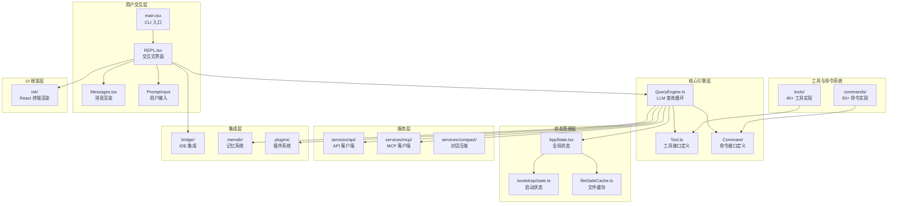
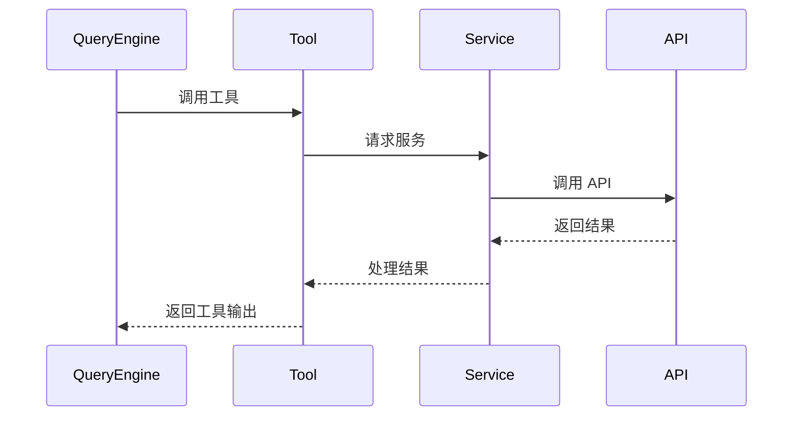
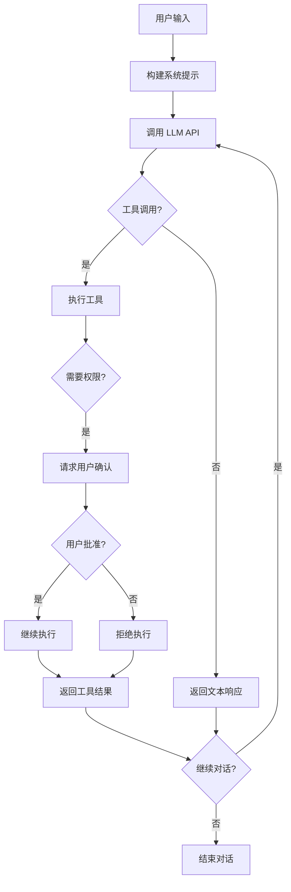
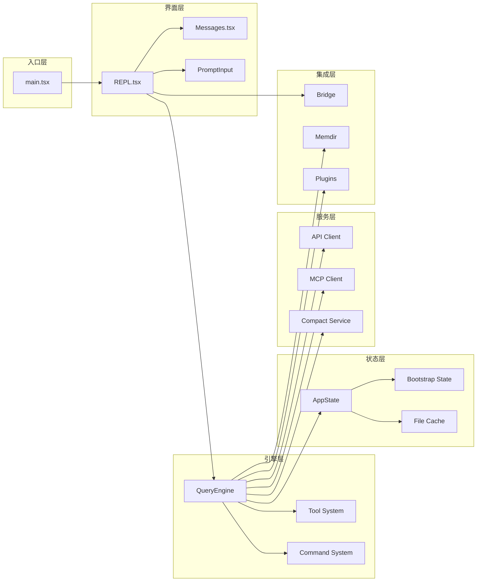

本文档旨在为初学者开发者提供 Claude Code 代码仓库的全景导航。通过解析目录结构与核心模块的组织方式，帮助您快速理解项目架构、定位关键代码，并建立对整个系统的认知框架。

## 架构全景图

Claude Code 是一个基于 TypeScript 构建的命令行 AI 编程助手，采用 **React + Ink** 框架实现终端 UI，通过 **QueryEngine** 驱动 LLM 查询循环，并集成 **工具系统**、**命令系统**、**MCP 协议** 等多个子系统。以下架构图展示了核心模块之间的依赖关系与数据流向：



**架构说明**：

1. **用户交互层**：`main.tsx` 作为 CLI 入口，启动 `REPL.tsx` 交互式界面，通过 `Messages.tsx` 渲染对话历史，`PromptInput` 处理用户输入。
2. **核心引擎层**：`QueryEngine` 是整个系统的"心脏"，负责驱动 LLM 查询循环，调用工具与命令，管理对话状态。
3. **工具与命令系统**：`tools/` 目录包含 40+ 工具实现（如文件操作、Bash 执行、Web 搜索等），`commands/` 目录包含 50+ 斜杠命令（如 `/init`、`/review`、`/commit` 等）。
4. **状态管理层**：`AppState` 使用 React Context 管理全局状态，`bootstrap/state.ts` 管理启动时的全局变量，`fileStateCache` 缓存文件读取结果。
5. **服务层**：封装 API 客户端、MCP 协议客户端、对话压缩服务等基础服务。
6. **集成层**：Bridge 系统支持 IDE 双向通信，memdir 实现长期记忆，plugins 支持插件扩展。
7. **UI 框架层**：Ink 是一个 React 终端渲染框架，类似 React DOM，但针对终端环境优化。

Sources: [main.tsx](src/main.tsx#L1-L50), [QueryEngine.ts](src/QueryEngine.ts#L1-L80), [Tool.ts](src/Tool.ts#L1-L100), [AppState.tsx](src/state/AppState.tsx#L1-L80)

## 顶层目录结构

项目采用扁平化的顶层目录结构，核心源码集中在 `src/` 目录，配置与文档独立管理：

```
claude-code/
├── src/                    # 核心源码（~1900 文件）
│   ├── main.tsx           # CLI 入口点
│   ├── QueryEngine.ts     # LLM 查询引擎核心
│   ├── Tool.ts            # 工具接口定义
│   ├── commands.ts        # 命令注册中心
│   ├── tools.ts           # 工具注册中心
│   ├── commands/          # 50+ 斜杠命令实现
│   ├── tools/             # 40+ 工具实现
│   ├── components/        # React UI 组件
│   ├── bridge/            # IDE 集成与远程控制
│   ├── services/          # 后端服务封装
│   ├── state/             # 状态管理
│   ├── ink/               # 终端 UI 框架
│   ├── memdir/            # 记忆系统
│   └── utils/             # 工具函数库
├── docs/                   # 文档目录
├── .zread/                 # Wiki 文档草稿
├── README.md              # 项目说明
└── AGENTS.md              # 代理说明
```

**关键文件说明**：

| 文件/目录 | 职责 | 关键度 |
|---------|------|--------|
| `main.tsx` | CLI 入口，初始化配置、解析参数、启动 REPL | ⭐⭐⭐⭐⭐ |
| `QueryEngine.ts` | LLM 查询循环核心，驱动工具调用与对话流转 | ⭐⭐⭐⭐⭐ |
| `Tool.ts` | 工具接口定义，所有工具必须实现此接口 | ⭐⭐⭐⭐⭐ |
| `commands.ts` | 命令注册中心，聚合所有斜杠命令 | ⭐⭐⭐⭐ |
| `tools.ts` | 工具注册中心，聚合所有工具实现 | ⭐⭐⭐⭐ |
| `components/` | React UI 组件，负责终端界面渲染 | ⭐⭐⭐⭐ |
| `bridge/` | IDE 集成系统，支持远程会话与双向通信 | ⭐⭐⭐⭐ |
| `services/` | 服务层封装，包括 API、MCP、压缩等 | ⭐⭐⭐ |

Sources: [main.tsx](src/main.tsx#L1-L50), [README.md](README.md#L1-L50)

## 核心模块详解

### 1. 命令系统

**目录**：`src/commands/`  
**核心文件**：`src/commands.ts`

Claude Code 提供 **50+ 斜杠命令**，用于执行特定任务（如初始化项目、提交代码、查看成本等）。每个命令独立目录，包含 `index.ts`（导出入口）和具体实现文件。

**命令分类**：

| 类别 | 命令示例 | 职责 |
|------|---------|------|
| **项目管理** | `/init`, `/doctor`, `/config` | 初始化项目、诊断问题、管理配置 |
| **版本控制** | `/commit`, `/review`, `/pr` | Git 操作、代码审查、PR 管理 |
| **会话管理** | `/resume`, `/session`, `/clear` | 恢复会话、列出会话、清空对话 |
| **成本与用量** | `/cost`, `/usage`, `/stats` | 查看成本、用量统计、性能数据 |
| **工具集成** | `/mcp`, `/plugins`, `/skills` | 管理 MCP 服务器、插件、技能 |
| **UI 控制** | `/theme`, `/color`, `/vim` | 切换主题、颜色、Vim 模式 |
| **调试工具** | `/debug-tool-call`, `/heapdump` | 调试工具调用、内存分析 |

**命令注册机制**：

所有命令通过 `commands.ts` 统一导入并注册：

```typescript
// src/commands.ts (简化示例)
import init from './commands/init.js'
import commit from './commands/commit.js'
import review from './commands/review.js'
// ... 导入其他命令

export const commands = {
  init,
  commit,
  review,
  // ... 其他命令
}
```

**命令接口**：每个命令实现 `Command` 接口（定义在 `types/command.ts`），包含：
- `name`：命令名称
- `description`：命令描述
- `handler`：命令处理函数
- `options`：命令行参数选项

Sources: [commands.ts](src/commands.ts#L1-L100)

### 2. 工具系统

**目录**：`src/tools/`  
**核心文件**：`src/tools.ts`, `src/Tool.ts`

Claude Code 提供 **40+ 工具**，供 LLM 调用以执行实际操作（如读写文件、执行 Bash 命令、搜索网络等）。每个工具独立目录，包含：
- `[ToolName].ts`：工具实现
- `UI.tsx`：工具 UI 组件（可选）
- `prompt.ts`：工具提示词
- `constants.ts`：常量定义（可选）

**工具分类**：

| 类别 | 工具示例 | 职责 |
|------|---------|------|
| **文件操作** | `FileReadTool`, `FileEditTool`, `FileWriteTool` | 读取、编辑、写入文件 |
| **代码搜索** | `GrepTool`, `GlobTool`, `LSPTool` | 正则搜索、文件匹配、LSP 查询 |
| **命令执行** | `BashTool`, `PowerShellTool` | 执行 Shell/PowerShell 命令 |
| **网络访问** | `WebFetchTool`, `WebSearchTool` | 抓取网页、搜索网络 |
| **任务管理** | `TaskCreateTool`, `TaskOutputTool`, `TaskStopTool` | 创建、查询、停止异步任务 |
| **多代理协作** | `AgentTool`, `TeamCreateTool` | 启动子代理、创建团队 |
| **MCP 集成** | `MCPTool`, `ListMcpResourcesTool` | 调用 MCP 工具、列出资源 |
| **模式切换** | `EnterPlanModeTool`, `ExitPlanModeTool` | 进入/退出计划模式 |
| **工作树管理** | `EnterWorktreeTool`, `ExitWorktreeTool` | 进入/退出 Git 工作树 |

**工具接口**：

所有工具实现 `Tool` 接口（定义在 `Tool.ts`），包含：
- `name`：工具名称
- `description`：工具描述
- `inputSchema`：输入参数 JSON Schema
- `validate`：参数验证函数
- `execute`：工具执行函数
- `render`：渲染 UI 组件（可选）

**工具注册机制**：

```typescript
// src/tools.ts (简化示例)
import { FileReadTool } from './tools/FileReadTool/FileReadTool.js'
import { BashTool } from './tools/BashTool/BashTool.js'
// ... 导入其他工具

export function getTools(context: ToolUseContext): Tools {
  return [
    new FileReadTool(),
    new BashTool(),
    // ... 其他工具实例
  ]
}
```

Sources: [tools.ts](src/tools.ts#L1-L100), [Tool.ts](src/Tool.ts#L1-L100)

### 3. 状态管理系统

**核心文件**：
- `src/state/AppState.tsx`：React 状态管理
- `src/state/AppStateStore.ts`：状态存储实现
- `src/bootstrap/state.ts`：启动时全局状态

Claude Code 采用 **React Context + Zustand** 模式管理全局状态，分为两类：

**1. AppState（React 状态）**：
- 管理会话状态、消息列表、工具权限、UI 状态等
- 通过 `AppStateProvider` 提供 Context
- 使用 `createStore` 创建 Zustand store

**2. Bootstrap State（全局状态）**：
- 管理启动时的一次性状态（如原始工作目录、项目根目录、会话 ID）
- 使用 Signal 模式实现响应式更新
- 避免在 React 组件树之外传递状态

**状态分类**：

| 状态类型 | 存储位置 | 示例字段 |
|---------|---------|---------|
| **会话状态** | AppState | `messages`, `tools`, `permissionMode` |
| **UI 状态** | AppState | `focusedMessageId`, `vimMode`, `theme` |
| **全局状态** | bootstrap/state.ts | `sessionId`, `projectRoot`, `originalCwd` |
| **文件缓存** | fileStateCache.ts | `fileCache`（已读取文件内容缓存） |

Sources: [AppState.tsx](src/state/AppState.tsx#L1-L80), [bootstrap/state.ts](src/bootstrap/state.ts#L1-L60)

### 4. 服务层

**目录**：`src/services/`  
**职责**：封装外部服务调用与复杂业务逻辑

**核心服务**：

| 服务目录 | 职责 | 关键文件 |
|---------|------|---------|
| `api/` | Anthropic API 客户端、错误处理、重试逻辑 | `claude.ts`, `errors.ts` |
| `mcp/` | MCP 协议客户端、连接管理、工具发现 | `MCPConnectionManager.tsx`, `client.ts` |
| `compact/` | 对话压缩、上下文管理、摘要生成 | `compact.ts`, `microCompact.ts` |
| `analytics/` | 遥测、事件日志、A/B 测试 | `index.ts`, `growthbook.ts` |
| `oauth/` | OAuth 2.0 认证、令牌刷新 | `index.ts`, `client.ts` |
| `plugins/` | 插件安装、管理、生命周期 | `PluginInstallationManager.ts` |
| `lsp/` | LSP 客户端、诊断管理 | `LSPClient.ts`, `LSPServerManager.ts` |

**服务调用流程**：



Sources: [services/](src/services/)

### 5. Bridge 系统（IDE 集成）

**目录**：`src/bridge/`  
**职责**：实现 Claude Code 与 IDE（如 VS Code、JetBrains）的双向通信，支持远程会话控制

**核心组件**：

| 文件 | 职责 |
|------|------|
| `bridgeMain.ts` | Bridge 主循环，管理会话生命周期 |
| `bridgeApi.ts` | API 客户端，与 Claude 服务端通信 |
| `sessionRunner.ts` | 会话启动器，创建本地或远程会话 |
| `replBridge.ts` | REPL Bridge，处理 IDE 发送的命令 |
| `jwtUtils.ts` | JWT 认证与令牌刷新 |
| `trustedDevice.ts` | 受信任设备管理 |

**Bridge 工作流程**：

1. **启动**：通过 `/bridge` 命令启动 Bridge 模式
2. **注册**：向 Claude 服务端注册 Worker，获取 JWT 令牌
3. **轮询**：定期轮询服务端，获取新会话请求
4. **执行**：在本地环境执行会话，将结果推送到服务端
5. **同步**：实时同步会话状态、工具调用、消息到 IDE

**远程会话支持**：
- 支持在远程服务器上启动 Claude Code
- 通过 WebSocket 实时同步会话
- 支持权限请求远程审批

Sources: [bridgeMain.ts](src/bridge/bridgeMain.ts#L1-L80)

### 6. 终端 UI 框架

**目录**：`src/ink/`  
**职责**：基于 React 的终端渲染引擎，类似 React DOM

**核心概念**：

| 文件/目录 | 职责 |
|----------|------|
| `ink.tsx` | Ink 核心，管理 React 渲染循环 |
| `reconciler.ts` | React Reconciler 适配器 |
| `renderer.ts` | 渲染器，将 React 组件转为终端输出 |
| `components/` | 内置组件（`<Box>`, `<Text>` 等） |
| `hooks/` | 自定义 Hooks（`useInput`, `useTheme` 等） |
| `dom.ts` | 虚拟 DOM 实现 |

**Ink 渲染流程**：


**性能优化**：
- **增量渲染**：只更新变化的区域
- **虚拟滚动**：支持大规模消息列表
- **帧节流**：限制渲染频率（默认 60 FPS）
- **Yoga 布局引擎**：原生布局计算

Sources: [ink.tsx](src/ink/ink.tsx#L1-L60)

### 7. 记忆系统

**目录**：`src/memdir/`  
**职责**：实现长期记忆机制，让 Claude 能够跨会话记住用户偏好、项目上下文等信息

**核心文件**：

| 文件 | 职责 |
|------|------|
| `memdir.ts` | 记忆系统核心，加载与管理记忆文件 |
| `memoryTypes.ts` | 记忆类型定义与提示词模板 |
| `paths.ts` | 记忆文件路径解析 |
| `memoryScan.ts` | 记忆扫描与检索 |

**记忆机制**：

1. **自动记忆**：Claude 自动提取对话中的关键信息，写入 `MEMORY.md`
2. **手动记忆**：用户通过 `/memory` 命令手动添加记忆
3. **团队记忆**：支持团队共享记忆（需启用 `TEAMMEM` 特性）
4. **记忆检索**：根据当前上下文自动检索相关记忆

**记忆文件结构**：

```markdown
# MEMORY.md

## What I Know About This Project
- 项目使用 TypeScript + Bun
- 主要功能是 CLI 工具

## User Preferences
- 喜欢使用 Vim 模式
- 偏好简洁的代码风格
```

Sources: [memdir.ts](src/memdir/memdir.ts#L1-L60)

## 关键入口点导航

### 启动流程

**入口文件**：`src/main.tsx`

```typescript
// 简化启动流程
1. profileCheckpoint('main_tsx_entry')  // 性能分析
2. startMdmRawRead()                    // 并行读取 MDM 配置
3. startKeychainPrefetch()              // 并行预取密钥链
4. init()                               // 初始化遥测、配置
5. initializeTelemetryAfterTrust()      // 初始化遥测
6. launchRepl()                         // 启动 REPL 界面
```

**关键步骤**：
1. **性能优化**：并行执行耗时操作（MDM 读取、密钥链预取）
2. **信任检查**：检查用户是否接受服务条款
3. **配置加载**：加载全局配置、项目配置
4. **遥测初始化**：初始化遥测系统
5. **REPL 启动**：启动交互式界面

Sources: [main.tsx](src/main.tsx#L1-L50)

### REPL 界面

**入口文件**：`src/screens/REPL.tsx`

**核心职责**：
- 渲染消息列表（`<Messages>`）
- 处理用户输入（`<PromptInput>`）
- 显示权限请求对话框（`<PermissionRequest>`）
- 管理对话循环（调用 `QueryEngine`）
- 处理命令执行

**关键状态**：
- `messages`：对话消息列表
- `queryGuard`：查询保护器（管理 LLM 查询）
- `toolUseConfirmQueue`：工具权限确认队列

Sources: [REPL.tsx](src/screens/REPL.tsx#L1-L80)

### 查询引擎

**入口文件**：`src/QueryEngine.ts`

**核心循环**：



**关键函数**：
- `query()`：发起 LLM 查询
- `processToolUse()`：处理工具调用
- `handlePermissionRequest()`：处理权限请求
- `accumulateUsage()`：累积用量统计

Sources: [QueryEngine.ts](src/QueryEngine.ts#L1-L80)

## 模块依赖关系图

以下图表展示了核心模块之间的依赖关系，帮助您理解代码组织逻辑：



## 如何导航代码库

### 1. 从功能出发

| 我想了解... | 从哪里开始 | 关键文件 |
|-----------|----------|---------|
| **CLI 如何启动** | `src/main.tsx` | `main.tsx`, `init.ts` |
| **对话如何流转** | `src/QueryEngine.ts` | `QueryEngine.ts`, `query.ts` |
| **工具如何工作** | `src/Tool.ts` + `src/tools/` | `Tool.ts`, `tools.ts` |
| **命令如何实现** | `src/commands/` | `commands.ts`, 具体命令目录 |
| **UI 如何渲染** | `src/components/` + `src/ink/` | `REPL.tsx`, `ink.tsx` |
| **状态如何管理** | `src/state/` | `AppState.tsx`, `store.ts` |
| **如何集成 IDE** | `src/bridge/` | `bridgeMain.ts`, `sessionRunner.ts` |
| **如何实现记忆** | `src/memdir/` | `memdir.ts`, `memoryTypes.ts` |

### 2. 从问题出发

| 遇到问题 | 检查哪里 |
|---------|---------|
| **工具调用失败** | `src/tools/[ToolName]/[ToolName].ts` 的 `execute` 方法 |
| **命令无法执行** | `src/commands/[command]/index.ts` 的 `handler` 函数 |
| **权限请求不弹窗** | `src/components/permissions/PermissionRequest.tsx` |
| **对话不同步** | `src/state/AppStateStore.ts` 的状态更新逻辑 |
| **API 调用失败** | `src/services/api/errors.ts` 的错误分类 |
| **MCP 连接失败** | `src/services/mcp/MCPConnectionManager.tsx` |
| **Bridge 无法启动** | `src/bridge/bridgeMain.ts` 的启动逻辑 |

### 3. 从类型定义出发

**关键类型文件**：

| 文件 | 定义的关键类型 |
|------|--------------|
| `src/Tool.ts` | `Tool`, `Tools`, `ToolUseContext`, `ToolProgress` |
| `src/types/message.ts` | `Message`, `UserMessage`, `AssistantMessage` |
| `src/types/permissions.ts` | `PermissionMode`, `PermissionResult` |
| `src/types/command.ts` | `Command`, `CommandResult` |
| `src/state/AppStateStore.ts` | `AppState`, `AppStateStore` |

## 代码风格与约定

### 命名约定

| 类型 | 约定 | 示例 |
|------|------|------|
| **文件名** | camelCase | `queryEngine.ts`, `fileStateCache.ts` |
| **组件名** | PascalCase | `REPL.tsx`, `Messages.tsx` |
| **工具名** | PascalCase + Tool 后缀 | `FileReadTool.ts`, `BashTool.ts` |
| **命令目录** | kebab-case | `add-dir/`, `commit-push-pr/` |
| **接口名** | PascalCase + I 前缀（可选） | `Tool`, `Command`, `AppState` |
| **常量** | UPPER_SNAKE_CASE | `MAX_ENTRYPOINT_LINES`, `DEFAULT_BACKOFF` |

### 目录组织模式

**工具目录结构**：
```
src/tools/[ToolName]/
├── [ToolName].ts       # 工具实现
├── UI.tsx              # UI 组件（可选）
├── prompt.ts           # 提示词
├── constants.ts        # 常量（可选）
└── utils.ts            # 工具函数（可选）
```

**命令目录结构**：
```
src/commands/[command]/
├── index.ts            # 导出入口
└── [command].tsx       # 命令实现
```

### 依赖注入模式

Claude Code 大量使用 **依赖注入** 模式，通过 Context 传递依赖：

```typescript
// 示例：工具上下文
type ToolUseContext = {
  appState: AppState
  canUseTool: CanUseToolFn
  cwd: string
  // ... 其他依赖
}

// 工具执行时接收上下文
class FileReadTool implements Tool {
  async execute(input: any, context: ToolUseContext) {
    // 使用 context 中的依赖
  }
}
```

## 特性开关机制

Claude Code 使用 **Bun bundle feature flags** 实现条件编译，支持不同构建版本：

**常见特性开关**：

| 特性名 | 用途 |
|--------|------|
| `BRIDGE_MODE` | 启用 Bridge 模式（IDE 集成） |
| `VOICE_MODE` | 启用语音模式 |
| `KAIROS` | 启用 Kairos 特性（内部代号） |
| `AGENT_TRIGGERS` | 启用代理触发器（Cron 调度） |
| `TEAMMEM` | 启用团队记忆功能 |
| `PROACTIVE` | 启用主动模式 |

**使用示例**：

```typescript
import { feature } from 'bun:bundle'

const bridgeCommand = feature('BRIDGE_MODE')
  ? require('./commands/bridge/index.js').default
  : null
```

Sources: [commands.ts](src/commands.ts#L65-L73)

## 调试技巧

### 1. 日志调试

**全局日志函数**：
- `logForDebugging()`：调试日志（需启用 `DEBUG` 环境变量）
- `logError()`：错误日志
- `logForDiagnosticsNoPII()`：诊断日志（无 PII）

**启用调试日志**：
```bash
DEBUG=1 claude-code
```

### 2. 性能分析

**启动性能分析**：
- `src/utils/startupProfiler.ts`：启动性能分析器
- `profileCheckpoint()`：标记检查点
- `profileReport()`：生成报告

**运行时性能**：
- `src/utils/fpsTracker.ts`：FPS 追踪
- `src/utils/headlessProfiler.ts`：无头性能分析

### 3. 诊断命令

- `/doctor`：诊断系统问题
- `/stats`：查看性能统计
- `/heapdump`：生成堆转储

## 下一步阅读建议

根据您的学习目标，建议按以下路径深入探索：

### 路径 1：理解核心流程（推荐新手）

1. **[从 main.tsx 开始：CLI 启动流程与初始化](3-cong-main-tsx-kai-shi-cli-qi-dong-liu-cheng-yu-chu-shi-hua)**  
   了解 CLI 如何启动、初始化配置、加载状态。

2. **[QueryEngine：LLM 查询循环与工具调度核心](5-queryengine-llm-cha-xun-xun-huan-yu-gong-ju-diao-du-he-xin)**  
   深入理解对话如何流转、工具如何被调用。

3. **[工具系统架构：从 Tool 接口到 40+ 工具实现](6-gong-ju-xi-tong-jia-gou-cong-tool-jie-kou-dao-40-gong-ju-shi-xian)**  
   学习工具如何设计、实现与注册。

### 路径 2：探索特定子系统

1. **[命令系统设计：50+ 斜杠命令的组织与注册](7-ming-ling-xi-tong-she-ji-50-xie-gang-ming-ling-de-zu-zhi-yu-zhu-ce)**  
   了解命令如何实现与组织。

2. **[AppState 设计：React 状态管理与订阅机制](12-appstate-she-ji-react-zhuang-tai-guan-li-yu-ding-yue-ji-zhi)**  
   学习状态管理模式。

3. **[Bridge 主循环：IDE 双向通信协议](18-bridge-zhu-xun-huan-ide-shuang-xiang-tong-xin-xie-yi)**  
   探索 IDE 集成机制。

### 路径 3：实践调试与分析

1. **[快照分析环境搭建与常用命令](4-kuai-zhao-fen-xi-huan-jing-da-jian-yu-chang-yong-ming-ling)**  
   搭建分析环境，学习常用调试命令。

2. **[调试技巧：日志、诊断与性能分析](44-diao-shi-ji-qiao-ri-zhi-zhen-duan-yu-xing-neng-fen-xi)**  
   掌握调试与性能分析方法。

3. **[静态分析方法：无构建环境下的代码探索](46-jing-tai-fen-xi-fang-fa-wu-gou-jian-huan-jing-xia-de-dai-ma-tan-suo)**  
   学习如何在没有构建环境的情况下分析代码。

## 总结

Claude Code 的代码库组织清晰，遵循 **模块化**、**分层架构**、**依赖注入** 等现代软件工程原则。通过本文档，您应该能够：

1. **理解整体架构**：从入口到引擎，从工具到服务，从状态到 UI。
2. **快速定位代码**：根据功能或问题，找到对应的模块与文件。
3. **建立认知框架**：为深入学习特定子系统打下基础。

建议您从 **[从 main.tsx 开始：CLI 启动流程与初始化](3-cong-main-tsx-kai-shi-cli-qi-dong-liu-cheng-yu-chu-shi-hua)** 开始，逐步深入探索各个子系统。Happy coding!