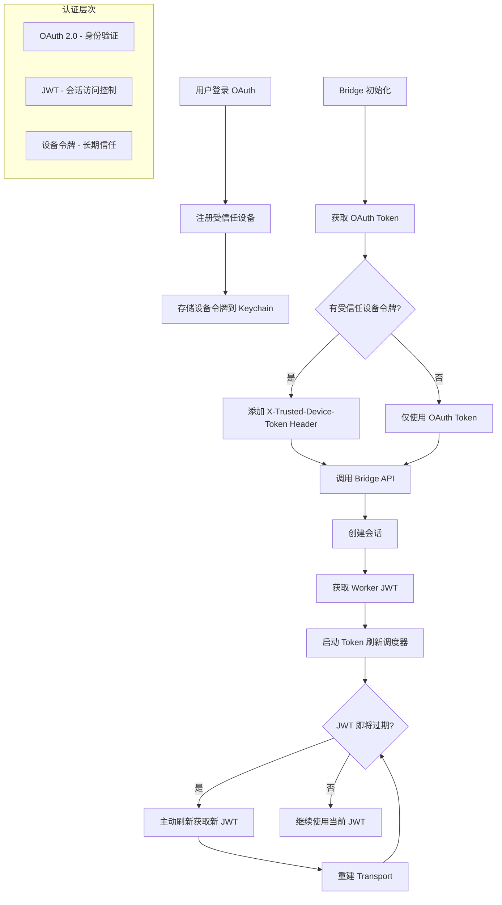
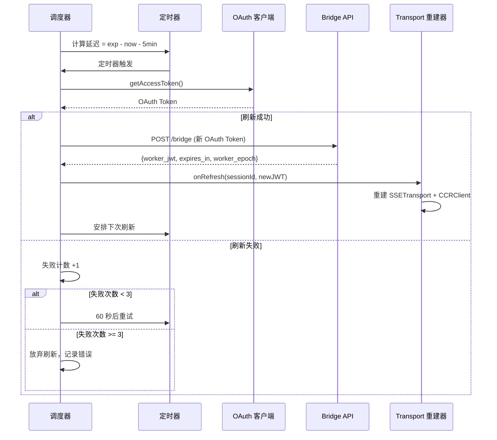
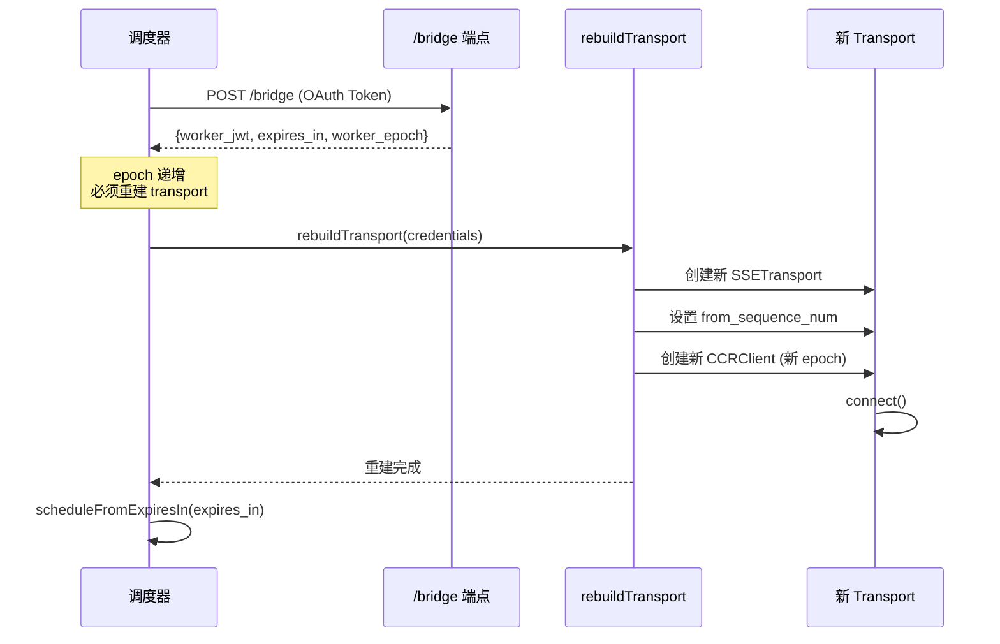

Claude Code 的 Bridge 系统实现了多层安全认证机制，通过 **JWT 令牌自动刷新**和**受信任设备注册**确保远程控制会话的安全性与连续性。这套机制支撑了 IDE 双向通信、会话持久化和跨设备协作等核心功能。

## 架构概览

Bridge 系统的认证架构分为三个层次：**OAuth 2.0 顶层认证**、**JWT 会话令牌**和**受信任设备令牌**。OAuth 用于初始身份验证，JWT 用于会话级别的细粒度访问控制，受信任设备令牌则提供设备级别的长期信任关系。



Sources: [bridgeApi.ts](src/bridge/bridgeApi.ts#L1-L89), [trustedDevice.ts](src/bridge/trustedDevice.ts#L1-L211), [jwtUtils.ts](src/bridge/jwtUtils.ts#L1-L257), [remoteBridgeCore.ts](src/bridge/remoteBridgeCore.ts#L1-L378)

## JWT 令牌管理

### 令牌结构和解码

Bridge 系统使用两种 JWT 格式：**标准 JWT**和带 `sk-ant-si-` 前缀的**会话入口令牌**。系统通过 `decodeJwtPayload` 函数自动处理这两种格式，提取 payload 数据而无需验证签名（签名验证由服务器端完成）。

核心解码逻辑首先剥离 `sk-ant-si-` 前缀（如果存在），然后按 `.` 分割 JWT 的三部分（header、payload、signature），使用 base64url 解码中间的 payload 部分。`decodeJwtExpiry` 函数进一步提取 `exp` 字段，用于判断令牌的过期时间。

```typescript
// JWT 解码示例（简化版）
function decodeJwtPayload(token: string): unknown | null {
  const jwt = token.startsWith('sk-ant-si-')
    ? token.slice('sk-ant-si-'.length)
    : token
  const parts = jwt.split('.')
  if (parts.length !== 3 || !parts[1]) return null
  return jsonParse(Buffer.from(parts[1], 'base64url').toString('utf8'))
}
```

Sources: [jwtUtils.ts](src/bridge/jwtUtils.ts#L15-L49)

### 主动刷新调度器

`createTokenRefreshScheduler` 是 JWT 管理的核心组件，它创建了主动式令牌刷新机制，**在令牌过期前 5 分钟**自动触发刷新，避免会话中断。调度器维护三个关键数据结构：**定时器映射**（sessionId → timer）、**失败计数器**（追踪连续刷新失败次数）和**代际计数器**（防止过期的异步操作干扰）。

调度器提供两种调度方式：`schedule` 从 JWT 的 `exp` 字段计算过期时间，`scheduleFromExpiresIn` 直接使用服务器返回的 `expires_in` 秒数。当触发刷新时，调度器调用 `getAccessToken` 获取新的 OAuth 令牌，然后通过 `onRefresh` 回调将新令牌传递给调用方。如果刷新失败，系统会安排 60 秒后重试，最多允许 3 次连续失败。



Sources: [jwtUtils.ts](src/bridge/jwtUtils.ts#L51-L256)

### 代际控制机制

代际计数器（generation counter）解决了并发刷新场景下的**竞态条件问题**。当会话被取消或重新调度时，代际计数器递增，使得正在执行的异步 `doRefresh` 操作能够检测到自己已经过时，从而跳过设置后续定时器。这种设计避免了以下场景：定时器 A 触发刷新，在等待 OAuth 令牌期间，用户重新启动会话导致定时器 B 被设置，如果不检查代际，定时器 A 的回调可能会覆盖定时器 B 的状态。

代际控制在 `schedule`、`cancel` 和 `cancelAll` 函数中都会递增计数器，并在 `doRefresh` 的异步操作完成后验证当前代际是否匹配。如果不匹配，说明会话已经被重新调度或取消，当前刷新操作应该被丢弃。

Sources: [jwtUtils.ts](src/bridge/jwtUtils.ts#L89-L100)

## 受信任设备机制

### 设备注册流程

受信任设备机制通过 **10 分钟时间窗口限制**确保只有刚刚完成登录的设备才能注册。这个设计防止了攻击者在会话建立后通过某种方式获取 OAuth 令牌后注册自己的设备，从而获得长期访问权限。注册流程在用户执行 `/login` 命令时触发，首先清除可能存在的旧设备令牌（防止账户切换时发送错误账户的令牌），然后调用 `enrollTrustedDevice` 向服务器发送注册请求。

注册请求包含设备的显示名称（格式：`Claude Code on {hostname} · {platform}`），服务器验证 `account_session.created_at` 是否在 10 分钟内，如果是则返回 `device_token` 和 `device_id`。客户端将 `device_token` 存储到系统钥匙串（macOS 的 Keychain、Windows 的 Credential Manager、Linux 的 Secret Service），并清除内存缓存以确保下次读取时获取新值。

```typescript
// 登录后的设备注册（简化版）
export async function call(onDone, context) {
  return <Login onDone={async success => {
    if (success) {
      // 清除旧账户的设备令牌
      clearTrustedDeviceToken()
      // 注册新设备（异步，不阻塞登录流程）
      void enrollTrustedDevice()
    }
    onDone(success ? 'Login successful' : 'Login interrupted')
  }} />
}
```

Sources: [trustedDevice.ts](src/bridge/trustedDevice.ts#L89-L211), [login.tsx](src/commands/login/login.tsx#L5-L42)

### 令牌存储和读取

设备令牌的存储使用 **memoize 缓存策略**，避免在每次 Bridge API 调用时都触发钥匙串读取（macOS 的 `security` 子进程调用约需 40ms）。`readStoredToken` 函数被 memoize 包装，只在第一次调用时读取钥匙串，后续调用直接返回缓存值。缓存会在以下情况清除：设备重新注册后、用户登出时、或通过 `clearTrustedDeviceTokenCache` 手动清除。

读取优先级遵循：**环境变量 > 钥匙串**。如果设置了 `CLAUDE_TRUSTED_DEVICE_TOKEN` 环境变量，系统会跳过钥匙串读取，直接使用环境变量的值。这个设计支持企业环境中的集中式令牌分发，以及测试场景中的令牌注入。

```typescript
// 令牌读取的 memoize 策略
const readStoredToken = memoize((): string | undefined => {
  // 环境变量优先（测试/企业场景）
  const envToken = process.env.CLAUDE_TRUSTED_DEVICE_TOKEN
  if (envToken) return envToken
  
  // 从钥匙串读取（生产场景）
  return getSecureStorage().read()?.trustedDeviceToken
})
```

Sources: [trustedDevice.ts](src/bridge/trustedDevice.ts#L39-L63)

### Feature Gate 控制

受信任设备功能受 **GrowthBook Feature Gate** `tengu_sessions_elevated_auth_enforcement` 控制。这个两层开关设计（CLI 端 + 服务器端）支持灰度发布：首先开启 CLI 端开关（客户端开始发送 `X-Trusted-Device-Token` header，但服务器仍然接受没有该 header 的请求），然后开启服务器端开关（服务器开始强制要求设备令牌）。

`getTrustedDeviceToken` 函数在返回令牌前会检查 feature gate 状态。如果 gate 关闭，函数返回 `undefined`，Bridge API 调用时不会包含 `X-Trusted-Device-Token` header。这个设计确保了功能的**渐进式 rollout**，不会影响未开启该功能的用户。

Sources: [trustedDevice.ts](src/bridge/trustedDevice.ts#L33-L59)

## 工作密钥与会话入口

### WorkSecret 结构

`WorkSecret` 是 Bridge 系统从服务器接收的**会话配置包**，通过 base64url 编码的 JSON 字符串传递。它包含会话入口令牌（`session_ingress_token`）、API 基础 URL（`api_base_url`）、源代码仓库信息（`sources`）、认证信息（`auth`）、MCP 配置（`mcp_config`）和环境变量（`environment_variables`）。

`decodeWorkSecret` 函数解码并验证工作密钥的结构：必须包含 `version: 1` 和非空的 `session_ingress_token`。这个验证确保客户端能够正确处理服务器返回的配置，如果版本不匹配或字段缺失，函数会抛出明确的错误信息。

```typescript
type WorkSecret = {
  version: number                          // 必须为 1
  session_ingress_token: string            // 会话入口 JWT
  api_base_url: string                     // API 基础 URL
  sources: Array<{                         // 源代码仓库
    type: string
    git_info?: { type: string; repo: string; ref?: string; token?: string }
  }>
  auth: Array<{ type: string; token: string }>  // 认证信息
  mcp_config?: unknown | null              // MCP 服务器配置
  environment_variables?: Record<string, string> | null  // 环境变量
  use_code_sessions?: boolean              // CCR v2 选择器
}
```

Sources: [workSecret.ts](src/bridge/workSecret.ts#L1-L73), [types.ts](src/bridge/types.ts#L33-L51)

### Worker 注册机制

在 CCR v2 架构中，Bridge 需要通过 `registerWorker` 向服务器**注册为会话的 worker**，获取 `worker_epoch`（单调递增的纪元号）。这个纪元号必须包含在后续的所有心跳、状态更新和事件提交请求中，服务器通过验证纪元号来确保只有一个活跃的 worker 实例。

如果多个 Bridge 实例尝试同时处理同一个会话（例如用户在两台机器上运行 `claude remote-control --session-id`），后注册的实例会获得更高的纪元号，先注册的实例在下次心跳时会收到 409 Conflict 错误，从而知道自己已经被取代。这种设计实现了**强制单 worker 语义**，避免了并发处理导致的状态不一致。

Sources: [workSecret.ts](src/bridge/workSecret.ts#L89-L127)

### URL 构建策略

Bridge 系统根据部署环境构建不同的 URL：**localhost 环境**使用 `ws://` 协议和 `/v2/` 路径（直接连接 session-ingress，不经过 Envoy 重写），**生产环境**使用 `wss://` 协议和 `/v1/` 路径（Envoy 会将 `/v1/` 重写为 `/v2/`）。`buildSdkUrl` 函数自动检测 URL 中是否包含 `localhost` 或 `127.0.0.1`，并据此选择正确的协议和路径版本。

这种差异化的 URL 构建支持**本地开发调试**：开发者可以在本地运行 session-ingress 服务，Bridge 客户端会自动连接到正确的端点，无需手动配置协议和路径。

Sources: [workSecret.ts](src/bridge/workSecret.ts#L34-L87)

## Bridge API 集成

### 双重认证头

`createBridgeApiClient` 创建的 Bridge API 客户端在每次请求时都会构建**双重认证头**：`Authorization: Bearer {oauth_token}` 和 `X-Trusted-Device-Token: {device_token}`。OAuth 令牌用于身份验证，设备令牌用于证明请求来自受信任的设备。如果设备令牌不可用（gate 关闭或未注册），请求只包含 OAuth 令牌。

```typescript
function getHeaders(accessToken: string): Record<string, string> {
  const headers: Record<string, string> = {
    'Authorization': `Bearer ${accessToken}`,
    'Content-Type': 'application/json',
    'anthropic-version': '2023-06-01',
    'anthropic-beta': BETA_HEADER,
    'x-environment-runner-version': deps.runnerVersion,
  }
  const deviceToken = deps.getTrustedDeviceToken?.()
  if (deviceToken) {
    headers['X-Trusted-Device-Token'] = deviceToken
  }
  return headers
}
```

Sources: [bridgeApi.ts](src/bridge/bridgeApi.ts#L68-L89)

### 401 自动重试机制

Bridge API 客户端实现了 **401 自动重试机制**：当收到 401 响应时，客户端调用 `onAuth401` 回调尝试刷新 OAuth 令牌，如果刷新成功，用新令牌重试原请求。这个机制对调用方透明，确保临时的令牌过期不会中断 Bridge 会话。

重试逻辑只执行一次：如果重试后仍然返回 401，说明刷新失败或账户权限有问题，客户端返回 401 响应由 `handleErrorStatus` 抛出 `BridgeFatalError`。这种设计平衡了**自动恢复能力**和**快速失败**：常见的令牌过期可以自动恢复，但真正的认证问题会立即报告给用户。

Sources: [bridgeApi.ts](src/bridge/bridgeApi.ts#L99-L139)

### 错误类型和安全 ID 验证

`BridgeFatalError` 类封装了**不可恢复的 Bridge 错误**，包含 HTTP 状态码和服务器提供的错误类型（如 `environment_expired`、`session_not_found`）。调用方可以通过 `error.status` 和 `error.errorType` 区分不同的失败场景，决定是否需要重新初始化 Bridge 或提示用户重新登录。

`validateBridgeId` 函数验证服务器返回的 ID（如 `environment_id`、`session_id`）是否只包含安全字符（`[a-zA-Z0-9_-]`），防止**路径遍历攻击**（如 `../../admin`）和**注入攻击**（如包含斜杠或点的 ID）。这个验证在将 ID 插入 URL 路径前执行，确保恶意构造的 ID 不会导致安全漏洞。

Sources: [bridgeApi.ts](src/bridge/bridgeApi.ts#L40-L66)

## Env-less Bridge 实现

### 架构对比

Env-less Bridge（`remoteBridgeCore.ts`）是 **无环境层的 Bridge 实现**，直接连接到 session-ingress 层，省去了 Environments API 的轮询/分发机制。与传统的 env-based Bridge（`replBridge.ts`，约 2400 行）相比，env-less Bridge（约 1000 行）更简洁，延迟更低（不需要等待 work dispatch），但功能也更受限（不支持多会话管理和 worktree 模式）。

| 特性 | Env-based Bridge | Env-less Bridge |
|------|-----------------|-----------------|
| 会话创建 | POST /v1/environments/bridge → poll → dispatch | POST /v1/code/sessions → POST /bridge |
| 认证流程 | OAuth + Environment Secret + Session JWT | OAuth + Worker JWT (直接交换) |
| 传输协议 | HybridTransport (WS + POST) 或 SSETransport + CCRClient | SSETransport + CCRClient (强制 v2) |
| 多会话管理 | 支持 (maxSessions > 1) | 不支持 (单会话) |
| 延迟 | 高 (需要 poll dispatch) | 低 (直接连接) |
| 代码复杂度 | 高 (~2400 行) | 中 (~1000 行) |

Sources: [remoteBridgeCore.ts](src/bridge/remoteBridgeCore.ts#L1-L29)

### Worker JWT 刷新流程

Env-less Bridge 使用 **POST /v1/code/sessions/{id}/bridge** 端点直接交换 OAuth 令牌为 Worker JWT，服务器返回 `{worker_jwt, expires_in, api_base_url, worker_epoch}`。每次调用 `/bridge` 都会递增 `worker_epoch`，因此 JWT 刷新时必须同时重建整个 transport（SSETransport + CCRClient），否则旧的 CCRClient 会用旧的 epoch 发送心跳，导致 409 Conflict。

`createTokenRefreshScheduler` 在 env-less Bridge 中的 `onRefresh` 回调实现了完整的**重建流程**：首先检查 `authRecoveryInFlight` 标志（防止并发重建导致双重 epoch 递增），然后调用 `fetchRemoteCredentials` 获取新的 Worker JWT，最后调用 `rebuildTransport` 重建 SSE 连接和 CCRClient。重建过程中，SSE 的 `from_sequence_num` 参数确保服务器从上次离开的位置继续发送事件，不会重放整个会话历史。



Sources: [remoteBridgeCore.ts](src/bridge/remoteBridgeCore.ts#L311-L378)

### Transport 重建和状态保持

`rebuildTransport` 函数实现了**无缝 transport 切换**：关闭旧 transport，创建新 transport，重新绑定回调，并保持所有状态变量（如 `recentPostedUUIDs`、`flushGate`、`lastTransportSequenceNum`）。关键的状态保持包括：SSE 序列号高水位（`lastTransportSequenceNum`）传递给新 transport 的 `initialSequenceNum` 参数，确保服务器从正确的位置恢复事件流；已发送消息的 UUID 集合（`recentPostedUUIDs`）继续用于回声过滤；flush gate 的状态在重建期间保持冻结，防止新消息与历史消息交错。

Transport 重建支持三种触发原因：**初始连接**（`connectCause = 'initial'`）、**主动刷新**（`connectCause = 'proactive_refresh'`，由调度器在 JWT 过期前 5 分钟触发）、**认证恢复**（`connectCause = 'auth_401_recovery'`，由 SSE 的 401 响应触发）。每种原因都会记录到遥测数据中，用于分析 Bridge 的稳定性。

Sources: [remoteBridgeCore.ts](src/bridge/remoteBridgeCore.ts#L379-L450)

## 实践建议

### 调试 JWT 刷新问题

当遇到 JWT 刷新失败时，首先检查**调试日志**中的 `[bridge:token]` 标签。正常情况下，日志会显示令牌的过期时间、刷新调度时间和实际刷新时间。如果看到 "No OAuth token available for refresh" 错误，说明 OAuth 令牌刷新失败，需要检查 OAuth 配置和网络连接。如果看到 "stale (gen X vs Y)" 日志，说明代际控制机制检测到了过期的刷新操作，这通常是正常的，表示会话已经被重新调度。

使用 `--debug` 标志启动 Bridge 可以看到更详细的 JWT 解码信息，包括 `exp` 字段的值和计算出的刷新延迟。如果 JWT 无法解码（返回 `null`），检查令牌格式是否正确，是否包含 `sk-ant-si-` 前缀，以及 payload 部分是否是有效的 base64url 编码。

Sources: [jwtUtils.ts](src/bridge/jwtUtils.ts#L102-L140)

### 管理受信任设备令牌

在生产环境中，**不要手动修改或删除钥匙串中的设备令牌**。如果令牌损坏或丢失，最安全的做法是执行 `/logout` 然后重新 `/login`，这会清除旧令牌并注册新设备。在测试环境中，可以使用 `CLAUDE_TRUSTED_DEVICE_TOKEN` 环境变量注入测试令牌，绕过钥匙串读取。

如果需要**禁用受信任设备功能**（例如调试认证问题时），可以临时关闭 GrowthBook 的 `tengu_sessions_elevated_auth_enforcement` feature gate。关闭后，Bridge API 调用不会包含 `X-Trusted-Device-Token` header，服务器会回退到不验证设备令牌的模式（假设服务器端 gate 也已关闭）。

Sources: [trustedDevice.ts](src/bridge/trustedDevice.ts#L33-L87)

### 处理并发会话冲突

当多个 Bridge 实例尝试处理同一个会话时，服务器会返回 409 Conflict 错误，指示 **worker epoch 不匹配**。这种情况下，被拒绝的实例应该**优雅退出**，而不是重试。在 env-less Bridge 中，`authRecoveryInFlight` 标志确保同一时间只有一个重建操作在进行，防止并发刷新导致的双重 epoch 递增。

如果用户确实需要在多台机器上访问同一个会话，应该使用**只读模式**（`outboundOnly: true`）连接第二个实例，而不是尝试注册为 worker。只读实例可以接收事件流和查看会话状态，但不能发送消息或执行工具，因此不会与主 worker 冲突。

Sources: [remoteBridgeCore.ts](src/bridge/remoteBridgeCore.ts#L328-L373), [replBridgeTransport.ts](src/bridge/replBridgeTransport.ts#L119-L236)

## 扩展阅读

- [Bridge 主循环：IDE 双向通信协议](18-bridge-zhu-xun-huan-ide-shuang-xiang-tong-xin-xie-yi) — 了解 JWT 认证如何在 Bridge 主循环中使用
- [会话管理：sessionRunner 与多环境支持](19-hui-hua-guan-li-sessionrunner-yu-duo-huan-jing-zhi-chi) — 深入 env-based Bridge 的实现细节
- [OAuth 2.0 流程：认证与令牌刷新](25-oauth-2-0-liu-cheng-ren-zheng-yu-ling-pai-shua-xin) — 理解 OAuth 令牌与 JWT 令牌的关系
- [远程会话：RemoteSessionManager 与 WebSocket 通信](39-yuan-cheng-hui-hua-remotesessionmanager-yu-websocket-tong-xin) — 探索远程会话的完整生命周期