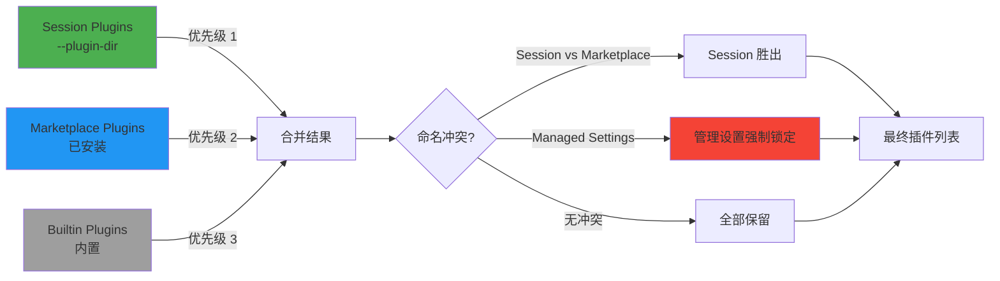
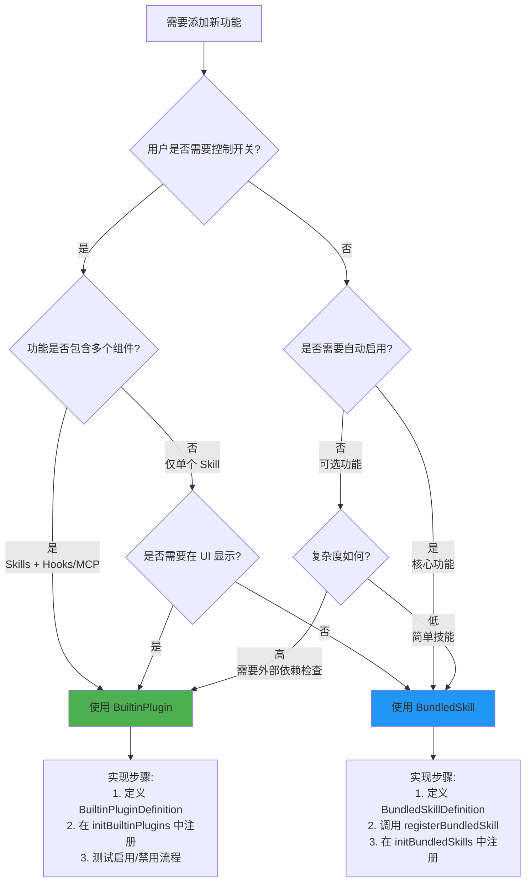

**BuiltinPlugin 机制**是 Claude Code 插件系统中用于管理随 CLI 发布且可由用户动态启停的内置功能的核心架构。该机制将预装功能从硬编码的命令系统迁移到统一的插件框架，使这些功能能够在 `/plugin` UI 中显示、由用户控制开关状态，并支持技能（skills）、钩子和 MCP 服务器等多种组件类型的组合注册。

## 核心概念：BuiltinPlugin 与 BundledSkill 的差异

Claude Code 提供了两种预装功能的注册机制：**BuiltinPlugin** 和 **BundledSkill**。理解两者的区别对于选择正确的实现方式至关重要。

| 维度 | BuiltinPlugin | BundledSkill |
|------|--------------|--------------|
| **用户控制** | ✅ 可在 `/plugin` UI 中启用/禁用 | ❌ 总是启用（除非代码级控制） |
| **持久化** | ✅ 用户选择保存到 `settings.json` | ❌ 每次启动重新注册 |
| **组件类型** | ✅ Skills + Hooks + MCP Servers | ⚠️ 仅单个 Skill |
| **可见性** | 在插件列表的 "Built-in" 分组中显示 | 在技能列表中显示 |
| **适用场景** | 用户可能不需要的功能、复杂多组件功能 | 核心功能、需要自动启用的功能 |
| **标识符格式** | `{name}@builtin` | `bundled`（在 Command.source 中） |

Sources: [src/plugins/builtinPlugins.ts](src/plugins/builtinPlugins.ts#L1-L22), [src/skills/bundledSkills.ts](src/skills/bundledSkills.ts#L1-L100)

## 架构设计：三层插件加载流程

BuiltinPlugin 系统嵌入在更广泛的插件加载架构中，与从市场安装的插件和会话临时插件协同工作。以下流程图展示了完整的插件发现与加载链路：

```mermaid
flowchart TD
    A[CLI 启动] --> B[init.ts 调用 initBuiltinPlugins]
    B --> C[registerBuiltinPlugin 注册内置插件定义]
    C --> D[BUILTIN_PLUGINS Map 存储插件]
    
    A --> E[getCommands 被调用]
    E --> F[getSkills 获取所有技能源]
    F --> G[并行加载四个来源]
    
    G --> H[getSkillDirCommands<br/>项目本地技能]
    G --> I[getPluginSkills<br/>市场插件技能]
    G --> J[getBundledSkills<br/>捆绑技能]
    G --> K[getBuiltinPluginSkillCommands<br/>内置插件技能]
    
    K --> L[getBuiltinPlugins]
    L --> M{检查 isAvailable}
    M -->|不可用| N[跳过该插件]
    M -->|可用| O[读取用户设置]
    O --> P{enabledPlugins[pluginId]?}
    P -->|undefined| Q[使用 defaultEnabled]
    P -->|true| R[标记为 enabled]
    P -->|false| S[标记为 disabled]
    
    R --> T[返回 LoadedPlugin 数组]
    S --> T
    Q --> T
    
    T --> U[转换为 Command 对象]
    U --> V[合并到最终命令列表]
    
    H --> V
    I --> V
    J --> V
    
    V --> W[用户可调用所有技能]
```

Sources: [src/commands.ts](src/commands.ts#L300-L400), [src/plugins/builtinPlugins.ts](src/plugins/builtinPlugins.ts#L54-L92), [src/utils/plugins/pluginLoader.ts](src/utils/plugins/pluginLoader.ts#L3100-L3200)

## 类型定义：BuiltinPluginDefinition 结构

每个内置插件通过 `BuiltinPluginDefinition` 类型定义其元数据、组件和可用性规则。该类型在编译时提供类型安全，确保注册时所有必需字段都被正确填充。

```typescript
type BuiltinPluginDefinition = {
  // 标识与展示
  name: string                    // 插件名称，用于生成 {name}@builtin 标识符
  description: string             // 在 /plugin UI 中显示的描述
  version?: string                // 可选版本字符串
  
  // 组件定义
  skills?: BundledSkillDefinition[]    // 提供的技能列表
  hooks?: HooksSettings                // 提供的钩子配置
  mcpServers?: Record<string, McpServerConfig>  // 提供的 MCP 服务器
  
  // 动态控制
  isAvailable?: () => boolean     // 可用性检查（返回 false 则完全隐藏）
  defaultEnabled?: boolean        // 默认启用状态（用户未设置时生效，默认 true）
}
```

Sources: [src/types/plugin.ts](src/types/plugin.ts#L25-L44)

### 关键字段详解

**`isAvailable()` 函数**：该可选函数在插件加载时被调用，用于基于系统环境动态决定插件是否应该显示。例如，某个插件可能仅在特定操作系统或满足特定依赖条件时才可用。当返回 `false` 时，插件会被完全隐藏（不显示在禁用列表中），避免在不适用的环境中干扰用户。

**`defaultEnabled` 字段**：该字段定义了插件在用户首次遇到时的初始状态。与 `isAvailable` 不同，`defaultEnabled` 仅影响启用/禁用的默认选择，不会隐藏插件。当用户在设置中显式启用或禁用插件后，该字段的值会被覆盖。

Sources: [src/plugins/builtinPlugins.ts](src/plugins/builtinPlugins.ts#L54-L92)

## 注册流程：从定义到可用

内置插件的注册分为三个阶段：**定义阶段**（编写插件定义）、**注册阶段**（在启动时调用注册函数）、**加载阶段**（在需要时转换为可用的插件对象）。

### 阶段一：定义插件

在 `src/plugins/bundled/index.ts` 中，通过调用 `registerBuiltinPlugin` 函数注册插件定义。虽然当前代码库中尚未注册实际的内置插件（该机制处于预备状态），但注册模式如下所示：

```typescript
import { registerBuiltinPlugin } from '../builtinPlugins.js'

registerBuiltinPlugin({
  name: 'example-plugin',
  description: 'An example built-in plugin for demonstration',
  version: '1.0.0',
  
  skills: [
    {
      name: 'example-skill',
      description: 'Example skill from built-in plugin',
      getPromptForCommand: async (args, context) => {
        return [{ type: 'text', text: 'Example skill executed' }]
      }
    }
  ],
  
  hooks: {
    SessionStart: [{
      command: 'echo "Session started"',
      timeout: 5000
    }]
  },
  
  mcpServers: {
    'example-server': {
      command: 'node',
      args: ['server.js']
    }
  },
  
  isAvailable: () => {
    // 仅在特定条件下显示此插件
    return process.platform === 'darwin'
  },
  
  defaultEnabled: true
})
```

Sources: [src/plugins/bundled/index.ts](src/plugins/bundled/index.ts#L1-L24)

### 阶段二：启动时初始化

`initBuiltinPlugins()` 函数在 CLI 启动时被调用（通过 `src/main.tsx` 中的导入链），负责触发所有内置插件的注册。该函数是同步的，注册过程直接修改全局的 `BUILTIN_PLUGINS` Map。

```typescript
export function initBuiltinPlugins(): void {
  // 当前为空实现 — 预留给未来迁移的用户可切换功能
  // 示例：将某些 bundled skills 迁移为 builtin plugins
}
```

Sources: [src/plugins/bundled/index.ts](src/plugins/bundled/index.ts#L17-L24)

### 阶段三：转换为 LoadedPlugin

当系统需要使用插件时（例如在 `/plugin` UI 显示或加载技能命令时），`getBuiltinPlugins()` 函数将定义转换为 `LoadedPlugin` 对象。该函数执行以下关键步骤：

1. **可用性检查**：调用每个插件的 `isAvailable()` 函数，过滤掉不可用的插件
2. **状态判定**：读取用户设置中的 `enabledPlugins[pluginId]`，结合 `defaultEnabled` 决定启用状态
3. **对象构建**：创建符合 `LoadedPlugin` 接口的对象，设置 `isBuiltin: true` 标志

```typescript
export function getBuiltinPlugins(): {
  enabled: LoadedPlugin[]
  disabled: LoadedPlugin[]
} {
  const settings = getSettings_DEPRECATED()
  const enabled: LoadedPlugin[] = []
  const disabled: LoadedPlugin[] = []

  for (const [name, definition] of BUILTIN_PLUGINS) {
    // 步骤 1: 可用性过滤
    if (definition.isAvailable && !definition.isAvailable()) {
      continue
    }

    const pluginId = `${name}@${BUILTIN_MARKETPLACE_NAME}`
    
    // 步骤 2: 状态判定（用户设置 > 插件默认 > true）
    const userSetting = settings?.enabledPlugins?.[pluginId]
    const isEnabled =
      userSetting !== undefined
        ? userSetting === true
        : (definition.defaultEnabled ?? true)

    // 步骤 3: 构建 LoadedPlugin 对象
    const plugin: LoadedPlugin = {
      name,
      manifest: {
        name,
        description: definition.description,
        version: definition.version,
      },
      path: BUILTIN_MARKETPLACE_NAME,  // 哨兵值，表示无文件系统路径
      source: pluginId,
      repository: pluginId,
      enabled: isEnabled,
      isBuiltin: true,  // 关键标志
      hooksConfig: definition.hooks,
      mcpServers: definition.mcpServers,
    }

    if (isEnabled) {
      enabled.push(plugin)
    } else {
      disabled.push(plugin)
    }
  }

  return { enabled, disabled }
}
```

Sources: [src/plugins/builtinPlugins.ts](src/plugins/builtinPlugins.ts#L54-L92)

## 技能转换：从 BundledSkillDefinition 到 Command

内置插件提供的技能通过 `getBuiltinPluginSkillCommands()` 函数转换为 `Command` 对象，使其能够集成到 Claude Code 的命令系统中。该转换过程与 bundled skills 的转换逻辑相似，但在 `source` 字段上有重要区别。

```typescript
export function getBuiltinPluginSkillCommands(): Command[] {
  const { enabled } = getBuiltinPlugins()  // 仅获取已启用的插件
  const commands: Command[] = []

  for (const plugin of enabled) {
    const definition = BUILTIN_PLUGINS.get(plugin.name)
    if (!definition?.skills) continue
    
    for (const skill of definition.skills) {
      commands.push(skillDefinitionToCommand(skill))
    }
  }

  return commands
}

function skillDefinitionToCommand(definition: BundledSkillDefinition): Command {
  return {
    type: 'prompt',
    name: definition.name,
    description: definition.description,
    hasUserSpecifiedDescription: true,
    allowedTools: definition.allowedTools ?? [],
    argumentHint: definition.argumentHint,
    whenToUse: definition.whenToUse,
    model: definition.model,
    disableModelInvocation: definition.disableModelInvocation ?? false,
    userInvocable: definition.userInvocable ?? true,
    contentLength: 0,
    source: 'bundled',  // 使用 'bundled' 而非 'builtin'
    loadedFrom: 'bundled',
    hooks: definition.hooks,
    context: definition.context,
    agent: definition.agent,
    isEnabled: definition.isEnabled ?? (() => true),
    isHidden: !(definition.userInvocable ?? true),
    progressMessage: 'running',
    getPromptForCommand: definition.getPromptForCommand,
  }
}
```

**关键设计决策**：虽然插件本身使用 `source: '{name}@builtin'`，但插件提供的技能使用 `source: 'bundled'`。这种区分确保技能能够正确出现在 Skill 工具的列表中，并享受与磁盘技能相同的提示截断豁免。用户可切换的特性通过 `LoadedPlugin.isBuiltin` 标志在插件层级追踪，而不影响技能的来源标识。

Sources: [src/plugins/builtinPlugins.ts](src/plugins/builtinPlugins.ts#L94-L160)

## 插件合并：多层次来源的优先级

`loadAllPlugins()` 函数是插件系统的核心入口，负责从多个来源加载插件并处理命名冲突。内置插件在该流程中处于最低优先级，确保用户显式安装的插件和会话临时插件能够覆盖内置实现。



**优先级规则详解**：

1. **Session Plugins（最高优先级）**：通过 `--plugin-dir` 标志指定的插件在当前会话中覆盖所有同名插件。这允许开发者在迭代插件时直接指向本地目录，无需卸载已安装版本。

2. **Managed Settings 强制锁定**：如果某个插件被企业管理设置锁定（无论强制启用或禁用），则该插件不能被 session plugins 覆盖。这确保企业策略的权威性。

3. **Marketplace Plugins**：从插件市场安装的常规插件。

4. **Builtin Plugins（最低优先级）**：内置插件提供默认实现，可被任何更高优先级的来源覆盖。

Sources: [src/utils/plugins/pluginLoader.ts](src/utils/plugins/pluginLoader.ts#L2900-L3100)

## UI 集成：在插件管理界面显示

内置插件在 `/plugin` 管理界面中以 `builtin` 作用域显示，与 `user`、`project`、`local` 等其他作用域并列。UI 层通过检查 `LoadedPlugin.isBuiltin` 标志来识别内置插件，并为其提供启用/禁用开关。

```typescript
// 在 ManagePlugins.tsx 中构建统一项目列表
const unifiedItems = useMemo(() => {
  // ... 构建插件项目列表 ...
  
  for (const state of pluginStates) {
    const pluginId = `${state.plugin.name}@${state.marketplace}`
    const isEnabled = mergedSettings?.enabledPlugins?.[pluginId] !== false
    
    // 内置插件使用 'builtin' 作用域
    const originalScope = state.plugin.isBuiltin ? 'builtin' : state.scope || 'user'
    
    pluginsWithChildren.push({
      item: {
        type: 'plugin',
        id: pluginId,
        name: state.plugin.name,
        description: state.plugin.manifest.description,
        marketplace: state.marketplace,
        scope: originalScope,  // 'builtin' 用于 UI 分组
        isEnabled,
        // ... 其他字段 ...
      },
      originalScope,
      childMcps: pluginMcpMap.get(state.plugin.name) || []
    })
  }
  
  // 作用域排序顺序：flagged, project, local, user, enterprise, managed, dynamic, builtin
  const scopeOrder: Record<string, number> = {
    flagged: -1,
    project: 0,
    local: 1,
    user: 2,
    enterprise: 3,
    managed: 4,
    dynamic: 5,
    builtin: 6  // 内置插件显示在最后
  }
  
  // ... 按作用域分组并渲染 ...
}, [pluginStates, mcpClients, pluginErrors])
```

**MCP 服务器的显示处理**：当内置插件提供 MCP 服务器时，这些服务器作为插件的子项目显示（缩进展示）。由于 MCP 配置的作用域类型不包含 `'builtin'`，内置插件的 MCP 服务器在显示时映射到 `'user'` 作用域。

Sources: [src/commands/plugin/ManagePlugins.tsx](src/commands/plugin/ManagePlugins.tsx#L400-L800)

## 实践指南：何时选择 BuiltinPlugin

以下决策树帮助开发者选择正确的实现方式：



**典型场景示例**：

- **选择 BuiltinPlugin**：一个集成特定云服务提供商的功能，包含用于认证的钩子、用于操作资源的技能和用于实时监控的 MCP 服务器。用户可能不需要此功能，应允许禁用。

- **选择 BundledSkill**：一个 `/verify` 技能，用于验证代码质量。这是大多数用户需要的核心功能，应自动启用并始终可用。

Sources: [src/plugins/builtinPlugins.ts](src/plugins/builtinPlugins.ts#L1-L22), [src/skills/bundledSkills.ts](src/skills/bundledSkills.ts#L1-L100)

## 总结：BuiltinPlugin 的设计哲学

BuiltinPlugin 机制体现了 Claude Code 插件系统的核心理念：**渐进式功能迁移**和**用户主权**。通过将硬编码功能迁移到插件框架，系统能够：

1. **统一管理**：所有可配置功能通过相同的 UI 和设置系统管理
2. **灵活控制**：用户可以根据需求启用或禁用功能，减少不必要的资源消耗
3. **架构一致性**：内置插件与市场插件使用相同的加载、验证和依赖解析流程
4. **平滑演进**：功能可以从 BundledSkill 逐步迁移到 BuiltinPlugin，无需一次性重构

该机制目前处于预备状态，为未来将复杂的 bundled skills 迁移到用户可控的插件形式提供了基础设施。开发者应根据功能的复杂度和用户需求，在 BuiltinPlugin 和 BundledSkill 之间做出明智选择。