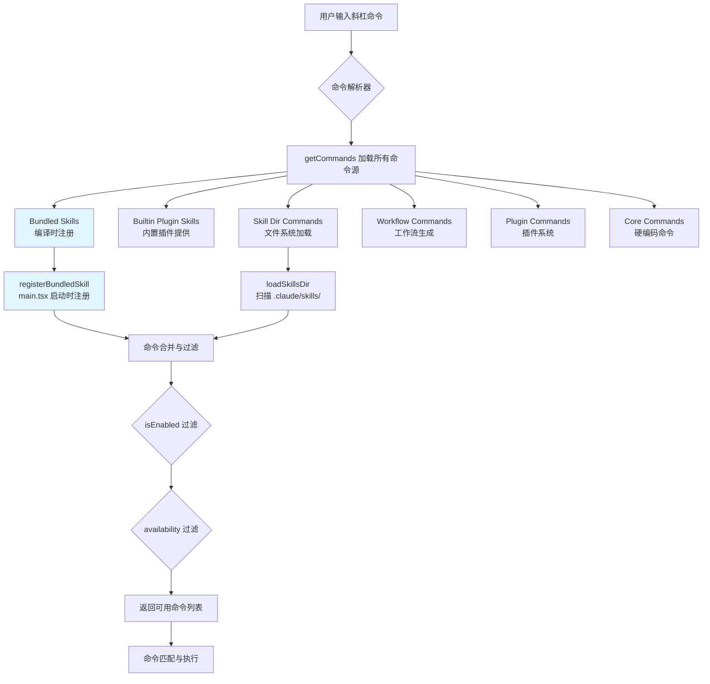

Claude Code 的技能系统提供了一种灵活的机制来扩展 AI 助手的能力，其中 **BundledSkill** 是编译进二进制文件的内置技能，与基于文件的技能、插件技能和 MCP 技能共同构成了完整的命令生态。本文档深入解析 BundledSkill 的设计理念、注册机制以及技能与命令系统的集成方式，帮助开发者理解如何构建和组织可复用的 AI 能力模块。

## 技能系统架构概览

Claude Code 的技能系统采用**分层加载**策略，从编译时绑定的内置技能到运行时动态发现的文件技能，每一层都有明确的职责边界和加载时机。



**核心概念辨析**：技能和命令在 Claude Code 中使用相同的 `Command` 类型定义，但来源不同。技能通常通过 Markdown frontmatter 或编程方式定义，具有更丰富的元数据；命令则是更通用的概念，包括交互式对话框、本地 JSX 组件等。所有技能最终都被转换为 `Command` 对象，通过统一的命令注册表进行管理。

Sources: [bundledSkills.ts](src/skills/bundledSkills.ts#L1-L221), [commands.ts](src/commands.ts#L449-L469), [types/command.ts](src/types/command.ts#L1-L217)

## BundledSkill 的定义与注册

### BundledSkillDefinition 接口设计

BundledSkill 通过 `BundledSkillDefinition` 接口定义，该接口继承自通用的 Command 类型，但增加了编译时绑定的特性。

```typescript
export type BundledSkillDefinition = {
  name: string                    // 技能名称，用于 /name 调用
  description: string             // 简短描述，显示在帮助和自动补全中
  aliases?: string[]              // 别名列表
  whenToUse?: string              // 详细使用场景说明
  argumentHint?: string           // 参数提示，显示为灰色文本
  allowedTools?: string[]         // 限制可用的工具列表
  model?: string                  // 覆盖默认模型
  disableModelInvocation?: boolean // 禁止模型自动调用
  userInvocable?: boolean         // 用户是否可手动调用
  isEnabled?: () => boolean       // 运行时启用条件
  hooks?: HooksSettings           // 技能级钩子配置
  context?: 'inline' | 'fork'     // 执行上下文：内联或子代理
  agent?: string                  // fork 模式下的代理类型
  files?: Record<string, string>  // 内嵌参考文件
  getPromptForCommand: (          // 生成提示词的函数
    args: string,
    context: ToolUseContext,
  ) => Promise<ContentBlockParam[]>
}
```

**关键字段解析**：
- **getPromptForCommand**：核心方法，接收用户输入的参数和执行上下文，返回发送给 LLM 的内容块数组。这是技能的逻辑核心，负责将用户意图转换为结构化的提示词。
- **files**：内嵌文件机制，允许技能携带参考文档或模板文件。首次调用时会自动解压到隔离目录，并通过 `Base directory for this skill` 前缀告知模型文件位置。
- **context 和 agent**：控制技能的执行模式。`inline`（默认）将技能内容展开到当前对话；`fork` 则启动独立的子代理，适用于长时间运行或需要隔离上下文的任务。

Sources: [bundledSkills.ts](src/skills/bundledSkills.ts#L15-L41)

### 注册机制与生命周期

BundledSkill 的注册发生在 CLI 启动的早期阶段，通过 `registerBundledSkill` 函数完成。注册过程是**同步的纯内存操作**，不涉及文件 I/O，因此性能开销极小（<1ms）。

```typescript
const bundledSkills: Command[] = []

export function registerBundledSkill(definition: BundledSkillDefinition): void {
  const { files } = definition
  
  let skillRoot: string | undefined
  let getPromptForCommand = definition.getPromptForCommand
  
  // 如果有内嵌文件，包装 getPromptForCommand 以实现延迟解压
  if (files && Object.keys(files).length > 0) {
    skillRoot = getBundledSkillExtractDir(definition.name)
    let extractionPromise: Promise<string | null> | undefined
    const inner = definition.getPromptForCommand
    
    getPromptForCommand = async (args, ctx) => {
      // 闭包级记忆化：每个进程只解压一次
      extractionPromise ??= extractBundledSkillFiles(definition.name, files)
      const extractedDir = await extractionPromise
      const blocks = await inner(args, ctx)
      if (extractedDir === null) return blocks
      return prependBaseDir(blocks, extractedDir)
    }
  }
  
  const command: Command = {
    type: 'prompt',
    name: definition.name,
    // ... 其他字段映射
    source: 'bundled',
    loadedFrom: 'bundled',
    getPromptForCommand,
  }
  
  bundledSkills.push(command)
}
```

**延迟解压策略**：内嵌文件不会在注册时立即写入磁盘，而是在**首次调用**时异步解压。这种设计避免了启动时的磁盘 I/O，同时通过 Promise 级别的记忆化确保并发调用不会重复解压。解压目录使用进程随机数作为隔离机制，防止符号链接攻击。

Sources: [bundledSkills.ts](src/skills/bundledSkills.ts#L53-L100), [bundledSkills.ts](src/skills/bundledSkills.ts#L131-L167)

## 初始化流程与技能发现

### main.tsx 中的初始化顺序

BundledSkill 的初始化位于 `main.tsx` 的 action handler 中，在 `setup()` 调用之前执行。这个位置的选择基于以下考虑：

1. **早期可用性**：技能需要在 `getCommands()` 被调用前注册完成，否则命令加载器会缓存空列表。
2. **与 setup() 并行**：`setup()` 包含大量异步操作（UDS socket 绑定约 20ms），而技能注册是同步的，可以安全地在并行路径中执行。

```typescript
// main.tsx action handler (简化版)
const preSetupCwd = getCwd()

// 在 setup() 之前注册内置技能和插件（纯内存操作）
if (process.env.CLAUDE_CODE_ENTRYPOINT !== 'local-agent') {
  initBuiltinPlugins()
  initBundledSkills()  // ← 关键调用点
}

// 并行执行 setup() 和命令加载
const setupPromise = setup(preSetupCwd, ...)
const commandsPromise = worktreeEnabled ? null : getCommands(preSetupCwd)

await setupPromise
```

**为什么不在 setup() 内部注册**：早期版本将 `initBundledSkills()` 放在 `setup()` 内部，但由于 `getCommands()` 与 `setup()` 并行执行，导致命令缓存了空的技能列表。将注册提前到并行分叉点之前解决了这个问题。

Sources: [main.tsx](src/main.tsx#L1919-L1926)

### initBundledSkills 的实现

`initBundledSkills()` 函数位于 `src/skills/bundled/index.ts`，负责调用所有内置技能的注册函数。该函数使用条件编译（`feature()` 标志）来控制某些技能的可见性。

```typescript
export function initBundledSkills(): void {
  // 无条件注册的技能
  registerUpdateConfigSkill()
  registerKeybindingsSkill()
  registerVerifySkill()
  registerDebugSkill()
  registerLoremIpsumSkill()
  registerSkillifySkill()
  registerRememberSkill()
  registerSimplifySkill()
  registerBatchSkill()
  registerStuckSkill()
  
  // 条件注册：KAIROS 特性
  if (feature('KAIROS') || feature('KAIROS_DREAM')) {
    const { registerDreamSkill } = require('./dream.js')
    registerDreamSkill()
  }
  
  // 条件注册：远程代理调度
  if (feature('AGENT_TRIGGERS_REMOTE')) {
    const { registerScheduleRemoteAgentsSkill } = require('./scheduleRemoteAgents.js')
    registerScheduleRemoteAgentsSkill()
  }
  
  // ... 其他条件注册
}
```

**特性开关的作用**：某些技能依赖实验性功能或内部特性（如 KAIROS 的自动化模式），通过 `feature()` 函数在编译时决定是否包含。这种设计允许同一份代码库生成不同功能集的二进制文件，而无需维护多个分支。

Sources: [bundled/index.ts](src/skills/bundled/index.ts#L24-L79)

## 技能实现示例解析

### 基础技能：/debug

`/debug` 技能展示了最简单的 BundledSkill 实现模式：固定提示词模板 + 参数插值。

```typescript
export function registerDebugSkill(): void {
  registerBundledSkill({
    name: 'debug',
    description: 'Enable debug logging for this session and help diagnose issues',
    allowedTools: ['Read', 'Grep', 'Glob'],
    argumentHint: '[issue description]',
    disableModelInvocation: true,  // 禁止自动调用，必须用户显式请求
    userInvocable: true,
    async getPromptForCommand(args) {
      // 启用调试日志
      const wasAlreadyLogging = enableDebugLogging()
      const debugLogPath = getDebugLogPath()
      
      // 读取日志尾部（避免加载完整日志导致内存峰值）
      let logInfo: string
      try {
        const stats = await stat(debugLogPath)
        const readSize = Math.min(stats.size, TAIL_READ_BYTES)
        const fd = await open(debugLogPath, 'r')
        const { buffer, bytesRead } = await fd.read({
          buffer: Buffer.alloc(readSize),
          position: stats.size - readSize,
        })
        const tail = buffer.toString('utf-8', 0, bytesRead)
          .split('\n')
          .slice(-DEFAULT_DEBUG_LINES_READ)
          .join('\n')
        logInfo = `Log size: ${formatFileSize(stats.size)}\n\n${tail}`
      } catch (e) {
        logInfo = isENOENT(e) 
          ? 'No debug log exists yet — logging was just enabled.'
          : `Failed to read log: ${errorMessage(e)}`
      }
      
      const prompt = `# Debug Skill

Help the user debug an issue they're encountering in this current Claude Code session.

## Session Debug Log

The debug log for the current session is at: \`${debugLogPath}\`

${logInfo}

## Issue Description

${args || 'The user did not describe a specific issue. Read the debug log and summarize any errors.'}

## Instructions

1. Review the user's issue description
2. Look for [ERROR] and [WARN] entries across the file
3. Explain what you found in plain language
4. Suggest concrete fixes or next steps
`
      return [{ type: 'text', text: prompt }]
    },
  })
}
```

**设计要点**：
- **disableModelInvocation: true**：调试技能不应被模型主动调用，只有在用户明确请求时才激活，避免上下文污染。
- **allowedTools 限制**：只允许文件读取类工具，防止调试会话意外修改系统状态。
- **尾部读取优化**：使用 `stat()` + 位置读取避免加载完整的调试日志（长期会话中可能达到数十 MB）。

Sources: [bundled/debug.ts](src/skills/bundled/debug.ts#L12-L103)

### 复杂技能：/batch

`/batch` 技能展示了更高级的模式：多阶段工作流、条件检查、动态提示词生成。

```typescript
export function registerBatchSkill(): void {
  registerBundledSkill({
    name: 'batch',
    description: 'Research and plan a large-scale change, then execute it in parallel across 5–30 isolated worktree agents',
    whenToUse: 'Use when the user wants to make a sweeping, mechanical change across many files',
    argumentHint: '<instruction>',
    userInvocable: true,
    disableModelInvocation: true,
    async getPromptForCommand(args) {
      const instruction = args.trim()
      if (!instruction) {
        return [{ type: 'text', text: MISSING_INSTRUCTION_MESSAGE }]
      }
      
      // 前置条件检查：必须是 Git 仓库
      const isGit = await getIsGit()
      if (!isGit) {
        return [{ type: 'text', text: NOT_A_GIT_REPO_MESSAGE }]
      }
      
      // 生成多阶段提示词
      return [{ type: 'text', text: buildPrompt(instruction) }]
    },
  })
}

function buildPrompt(instruction: string): string {
  return `# Batch: Parallel Work Orchestration

You are orchestrating a large, parallelizable change across this codebase.

## User Instruction

${instruction}

## Phase 1: Research and Plan (Plan Mode)

Call the EnterPlanMode tool now, then:
1. Understand the scope by launching subagents
2. Decompose into 5–30 independent units
3. Determine the e2e test recipe
4. Write the plan

## Phase 2: Spawn Workers (After Plan Approval)

Spawn one background agent per work unit using the Agent tool with isolation: "worktree".

## Phase 3: Track Progress

Render status table and update as agents complete.
`
}
```

**架构亮点**：
- **参数验证**：在生成提示词前检查必需参数和环境条件（Git 仓库），提前失败并给出明确错误信息。
- **结构化工作流**：将复杂任务分解为三个明确的阶段，每个阶段有清晰的输入输出契约。
- **与工具系统深度集成**：利用 `EnterPlanMode`、`Agent` 等工具实现编排逻辑，而非在技能内部重新实现。

Sources: [bundled/batch.ts](src/skills/bundled/batch.ts#L100-L124)

### 带内嵌文件的技能：/remember

`/remember` 技能使用 `files` 字段携带参考文档，展示延迟解压机制的实际应用。

```typescript
export function registerRememberSkill(): void {
  if (process.env.USER_TYPE !== 'ant') {
    return  // 仅限内部用户
  }

  registerBundledSkill({
    name: 'remember',
    description: 'Review auto-memory entries and propose promotions to CLAUDE.md or shared memory',
    whenToUse: 'Use when the user wants to review, organize, or promote their auto-memory entries',
    userInvocable: true,
    isEnabled: () => isAutoMemoryEnabled(),
    async getPromptForCommand(args) {
      let prompt = SKILL_PROMPT  // 预定义的模板
      
      if (args) {
        prompt += `\n## Additional context from user\n\n${args}`
      }
      
      return [{ type: 'text', text: prompt }]
    },
  })
}
```

虽然此示例未直接使用 `files` 字段，但 `isEnabled()` 回调展示了另一种动态控制机制：技能可以根据运行时状态（如配置标志）决定是否在命令列表中显示。

Sources: [bundled/remember.ts](src/skills/bundled/remember.ts#L64-L82)

## 命令加载与合并策略

### getCommands 的多层合并

`getCommands()` 函数是命令系统的核心入口，负责从所有来源加载命令并合并为一个统一的列表。

```typescript
const loadAllCommands = memoize(async (cwd: string): Promise<Command[]> => {
  const [
    { skillDirCommands, pluginSkills, bundledSkills, builtinPluginSkills },
    pluginCommands,
    workflowCommands,
  ] = await Promise.all([
    getSkills(cwd),           // 并行加载技能
    getPluginCommands(),      // 并行加载插件命令
    getWorkflowCommands?.(cwd) ?? Promise.resolve([]),
  ])
  
  // 合并顺序：bundled → builtin plugin → skill dir → workflow → plugin → core
  return [
    ...bundledSkills,
    ...builtinPluginSkills,
    ...skillDirCommands,
    ...workflowCommands,
    ...pluginCommands,
    ...pluginSkills,
    ...COMMANDS(),  // 硬编码的核心命令
  ]
})

export async function getCommands(cwd: string): Promise<Command[]> {
  const allCommands = await loadAllCommands(cwd)
  
  // 获取运行时动态发现的技能
  const dynamicSkills = getDynamicSkills()
  
  // 过滤：可用性 + 启用状态
  const baseCommands = allCommands.filter(
    cmd => meetsAvailabilityRequirement(cmd) && isCommandEnabled(cmd)
  )
  
  // 去重：动态技能可能与已加载技能重名
  const baseCommandNames = new Set(baseCommands.map(c => c.name))
  const uniqueDynamicSkills = dynamicSkills.filter(
    s => !baseCommandNames.has(s.name) && 
         meetsAvailabilityRequirement(s) && 
         isCommandEnabled(s)
  )
  
  return [...baseCommands, ...uniqueDynamicSkills]
}
```

**合并顺序的意义**：顺序决定了命令名称冲突时的优先级。Bundled Skills 优先级最高，确保内置行为不会被用户文件覆盖；Core Commands 优先级最低，允许所有扩展机制覆盖默认行为。

Sources: [commands.ts](src/commands.ts#L449-L500)

### 过滤机制：isEnabled 与 availability

命令系统使用两层过滤机制来控制命令的可见性：

1. **availability**：静态的认证/提供商要求，在编译时确定。例如 `'claude-ai'` 表示仅对 claude.ai 订阅者可见，`'console'` 表示仅对直接 API 密钥用户可见。

2. **isEnabled()**：运行时动态检查，可能依赖配置、环境变量或特性开关。每次调用 `getCommands()` 都会重新评估，因此可以在会话中动态变化（如用户登录后）。

```typescript
export function meetsAvailabilityRequirement(cmd: Command): boolean {
  if (!cmd.availability) return true
  
  for (const a of cmd.availability) {
    switch (a) {
      case 'claude-ai':
        if (isClaudeAISubscriber()) return true
        break
      case 'console':
        if (!isClaudeAISubscriber() && 
            !isUsing3PServices() && 
            isFirstPartyAnthropicBaseUrl()) {
          return true
        }
        break
    }
  }
  return false
}
```

Sources: [commands.ts](src/commands.ts#L417-L443)

## 与其他系统的集成

### 技能变更检测与热重载

Claude Code 通过 `skillChangeDetector` 监听技能目录的文件变化，实现开发时的热重载。

```typescript
const RELOAD_DEBOUNCE_MS = 300  // 防抖阈值

export function watchSkillDirectories(cwd: string): void {
  const watcher = chokidar.watch(skillDirectories, {
    ignoreInitial: true,
    awaitWriteFinish: {
      stabilityThreshold: FILE_STABILITY_THRESHOLD_MS,
      pollInterval: FILE_STABILITY_POLL_INTERVAL_MS,
    },
  })
  
  watcher.on('all', debounce((event, path) => {
    // 清除缓存
    clearSkillCaches()
    clearCommandsCache()
    
    // 通知监听器
    skillChangeSignal.emit()
    
    // 执行配置变更钩子
    void executeConfigChangeHooks('skills')
  }, RELOAD_DEBOUNCE_MS))
}
```

**防抖设计**：当多个技能文件同时变化（如 git pull 或批量编辑）时，防抖机制确保只触发一次重载，避免级联的缓存清除和通知风暴。

Sources: [skillChangeDetector.ts](src/utils/skills/skillChangeDetector.ts#L24-L50)

### MCP 技能构建器注册

MCP 服务器可以动态提供技能，这些技能使用与文件技能相同的前端解析逻辑。为了避免循环依赖，`loadSkillsDir.ts` 通过 `mcpSkillBuilders.ts` 注册解析函数。

```typescript
// mcpSkillBuilders.ts - 依赖图叶子节点
export type MCPSkillBuilders = {
  createSkillCommand: typeof createSkillCommand
  parseSkillFrontmatterFields: typeof parseSkillFrontmatterFields
}

let builders: MCPSkillBuilders | null = null

export function registerMCPSkillBuilders(b: MCPSkillBuilders): void {
  builders = b
}

export function getMCPSkillBuilders(): MCPSkillBuilders {
  if (!builders) {
    throw new Error('MCP skill builders not registered')
  }
  return builders
}
```

这种**注册-查找**模式允许 `loadSkillsDir.ts` 在模块初始化时注册函数，而 MCP 客户端代码在稍后通过 `getMCPSkillBuilders()` 获取它们，打破了直接的导入依赖。

Sources: [mcpSkillBuilders.ts](src/skills/mcpSkillBuilders.ts#L26-L44)

## 最佳实践与设计模式

### 1. 提示词模板化

将提示词定义为常量字符串，使用模板字面量进行参数插值：

```typescript
const SKILL_PROMPT = `# Skill Title

Core instructions here...

## Context
${dynamicContent}
`

async getPromptForCommand(args) {
  let prompt = SKILL_PROMPT
  if (args) {
    prompt += `\n## Additional Context\n\n${args}`
  }
  return [{ type: 'text', text: prompt }]
}
```

**优势**：提示词逻辑与注册代码分离，易于维护和测试。

### 2. 条件注册与特性开关

使用 `feature()` 函数控制技能的编译时包含：

```typescript
if (feature('EXPERIMENTAL_FEATURE')) {
  const { registerExperimentalSkill } = require('./experimental.js')
  registerExperimentalSkill()
}
```

**优势**：同一代码库生成不同功能集的二进制文件，无需维护特性分支。

### 3. 渐进式验证

在 `getPromptForCommand` 中进行前置条件检查，提前失败：

```typescript
async getPromptForCommand(args) {
  // 验证参数
  if (!args.trim()) {
    return [{ type: 'text', text: 'Error: Missing required argument' }]
  }
  
  // 验证环境
  const isGit = await getIsGit()
  if (!isGit) {
    return [{ type: 'text', text: 'Error: Not a git repository' }]
  }
  
  // 生成实际提示词
  return [{ type: 'text', text: buildPrompt(args) }]
}
```

**优势**：错误信息直接返回给用户，而非抛出异常中断流程。

### 4. 工具限制与安全边界

通过 `allowedTools` 限制技能可用的工具集：

```typescript
registerBundledSkill({
  name: 'readonly-analysis',
  allowedTools: ['Read', 'Grep', 'Glob'],
  // 禁止 Write, Edit, Bash 等修改性工具
})
```

**优势**：即使提示词被恶意构造，也无法绕过工具白名单执行危险操作。

## 相关页面

- **[命令系统设计：50+ 斜杠命令的组织与注册](7-ming-ling-xi-tong-she-ji-50-xie-gang-ming-ling-de-zu-zhi-yu-zhu-ce)**：了解完整的命令系统架构，包括交互式命令和本地 JSX 命令
- **[内置插件注册：BuiltinPlugin 机制](21-nei-zhi-cha-jian-zhu-ce-builtinplugin-ji-zhi)**：探索内置插件如何提供额外的技能和命令
- **[钩子系统：Hooks 配置与执行时机](23-gou-zi-xi-tong-hooks-pei-zhi-yu-zhi-xing-shi-ji)**：学习技能级钩子的配置方式和执行流程
- **[工具系统架构：从 Tool 接口到 40+ 工具实现](6-gong-ju-xi-tong-jia-gou-cong-tool-jie-kou-dao-40-gong-ju-shi-xian)**：理解 `allowedTools` 背后的工具系统设计