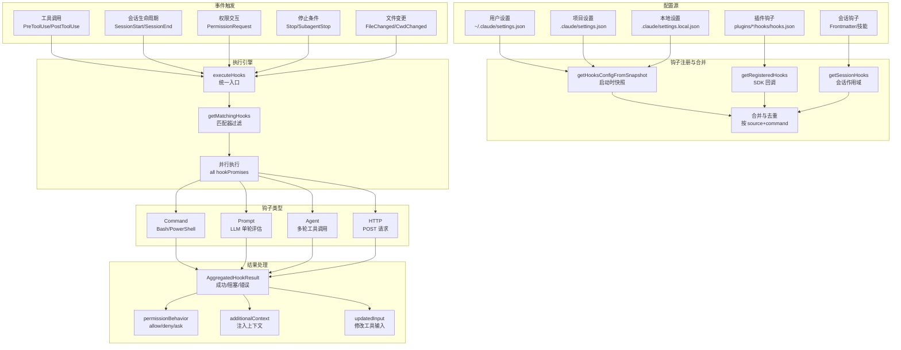
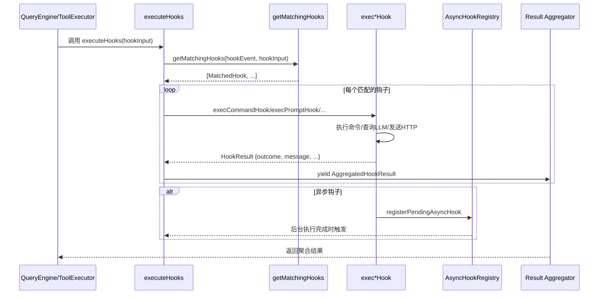

Claude Code 的钩子系统提供了一个强大的生命周期事件拦截机制，允许在工具执行、会话管理、权限请求等关键节点注入自定义逻辑。该系统采用事件驱动架构，支持 **26 种钩子事件**和 **4 种钩子实现类型**，通过配置文件或 API 动态注册，实现对 Claude 行为的细粒度控制和扩展。

## 架构概览：事件驱动的拦截框架

钩子系统的核心设计围绕 **事件匹配 → 钩子执行 → 结果聚合** 的三阶段流程。每个钩子事件（如 `PreToolUse`、`PostToolUse`、`Stop`）都关联一个或多个匹配器，匹配器通过工具名称、触发源等条件过滤，最终执行注册的钩子命令、LLM 提示、代理验证或 HTTP 请求。



钩子系统的设计遵循 **单一职责** 原则：`executeHooks` 作为统一执行入口，`getMatchingHooks` 负责事件匹配和去重，四种钩子类型各自封装执行逻辑（`execCommandHook`、`execPromptHook`、`execAgentHook`、`execHttpHook`），结果通过 `AggregatedHookResult` 类型系统聚合，支持阻塞错误、权限决策、上下文注入等多种交互模式。

Sources: [hooks.ts](src/utils/hooks.ts#L1800-L2000), [hooksConfigSnapshot.ts](src/utils/hooks/hooksConfigSnapshot.ts#L1-L134)

## 钩子事件全景：26 种生命周期拦截点

Claude Code 定义了 **26 种钩子事件**，覆盖工具执行、会话管理、权限控制、文件监视等核心场景。每个事件都有特定的触发时机和匹配器字段，用于精确过滤钩子执行。

### 事件分类与执行时机

| 事件类型 | 事件名称 | 触发时机 | 匹配器字段 | 典型用途 |
|---------|---------|---------|-----------|---------|
| **工具执行** | `PreToolUse` | 工具调用前 | `tool_name` | 输入验证、权限预审批 |
| | `PostToolUse` | 工具成功执行后 | `tool_name` | 输出后处理、日志记录 |
| | `PostToolUseFailure` | 工具执行失败后 | `tool_name` | 错误恢复、重试逻辑 |
| **会话生命周期** | `SessionStart` | 会话启动时 | `source` (cli/sdk) | 初始化检查、环境设置 |
| | `SessionEnd` | 会话结束时 | `reason` (clear/resume) | 清理资源、状态保存 |
| | `Setup` | 会话初始化 | `trigger` (auto/manual) | 依赖安装、配置同步 |
| **权限交互** | `PermissionRequest` | 权限对话框显示前 | `tool_name` | 自动审批/拒绝 |
| | `PermissionDenied` | 权限被拒绝后 | `tool_name` | 重试建议、替代方案 |
| **停止条件** | `Stop` | 主会话停止时 | - | 验证完成度、扩展对话 |
| | `StopFailure` | API 错误导致停止 | `error` | 错误分析、降级处理 |
| | `SubagentStart` | 子代理启动时 | `agent_type` | 代理配置、资源分配 |
| | `SubagentStop` | 子代理停止时 | `agent_type` | 结果验证、状态汇总 |
| **压缩与优化** | `PreCompact` | 上下文压缩前 | `trigger` (manual/auto) | 保存关键信息 |
| | `PostCompact` | 压缩完成后 | `trigger` | 恢复上下文、通知用户 |
| **用户交互** | `UserPromptSubmit` | 用户提交提示词时 | - | 输入过滤、上下文注入 |
| | `Notification` | 发送通知时 | `notification_type` | 通知转发、格式转换 |
| **团队协作** | `TeammateIdle` | 队友进入空闲状态 | - | 任务分配、唤醒检查 |
| | `TaskCreated` | 任务创建时 | - | 验证任务有效性 |
| | `TaskCompleted` | 任务完成时 | - | 结果验证、通知触发 |
| **MCP 交互** | `Elicitation` | MCP 服务器请求信息 | `mcp_server_name` | 自动响应、表单填充 |
| | `ElicitationResult` | Elicitation 结果返回 | `mcp_server_name` | 结果处理、验证 |
| **配置与文件** | `ConfigChange` | 配置文件变更时 | `source` (user/project) | 配置同步、重载 |
| | `InstructionsLoaded` | CLAUDE.md 加载时 | `load_reason` | 指令验证、扩展 |
| | `CwdChanged` | 工作目录变更时 | - | 环境变量更新 |
| | `FileChanged` | 监视文件变更时 | `file_path` basename | 自动重载、验证 |
| **Git Worktree** | `WorktreeCreate` | Worktree 创建时 | - | 环境设置、钩子复制 |
| | `WorktreeRemove` | Worktree 删除时 | - | 清理资源 |

### 事件匹配器机制

每个钩子事件通过 **匹配器** 字段过滤执行。匹配器支持通配符模式，例如 `PreToolUse:Bash(git *)` 仅匹配 Bash 工具中包含 `git` 命令的调用。匹配逻辑在 `getMatchingHooks` 中实现，首先通过 `matchesPattern` 函数比对匹配器与事件数据，然后去重（相同 `pluginRoot` + `command` 的钩子只保留一个），最后应用 `if` 条件过滤（权限规则语法，如 `Bash(git *)`）。

```typescript
// 钩子匹配示例（简化）
const matchQuery = hookInput.tool_name // "Bash"
const filteredMatchers = hookMatchers.filter(matcher =>
  !matcher.matcher || matchesPattern(matchQuery, matcher.matcher)
)
```

Sources: [coreTypes.ts](src/entrypoints/sdk/coreTypes.ts#L24-L52), [hooks.ts](src/utils/hooks.ts#L1600-L1800)

## 钩子类型实现：四种执行引擎

钩子系统支持 **4 种钩子实现类型**，每种类型针对不同的使用场景设计：**Command** 执行 Shell 命令，**Prompt** 使用 LLM 单轮评估，**Agent** 启动多轮工具调用代理，**HTTP** 发送 POST 请求。此外还有内部使用的 **Callback** 和 **Function** 类型，用于 SDK 回调和内存验证。

### Command 钩子：Shell 命令执行

Command 钩子通过 Bash（macOS/Linux）或 PowerShell（Windows）执行用户定义的命令。输入数据以 JSON 格式通过 **标准输入** 传递，钩子通过 **退出代码** 返回结果：`0` 表示成功，`2` 表示阻塞错误（提供反馈），其他非零代码为非阻塞错误。

```json
{
  "hooks": {
    "PreToolUse": [{
      "matcher": "Bash",
      "hooks": [{
        "type": "command",
        "command": "./scripts/validate-bash.sh",
        "shell": "bash",
        "timeout": 30,
        "if": "Bash(rm *)"
      }]
    }]
  }
}
```

Command 钩子的执行流程包括：
1. **Shell 解析**：根据 `hook.shell` 字段选择 `bash`（默认）或 `powershell`
2. **环境注入**：设置 `CLAUDE_SESSION_ID`、`CLAUDE_PROJECT_ROOT`、`CLAUDE_HOOK_INPUT_PATH` 等环境变量
3. **输入传递**：JSON 输入写入临时文件，路径通过 `CLAUDE_HOOK_INPUT_PATH` 传递
4. **超时控制**：默认 10 分钟（`TOOL_HOOK_EXECUTION_TIMEOUT_MS`），可通过 `timeout` 字段覆盖
5. **异步执行**：如果返回 `{"async": true}`，钩子在后台运行，通过 `AsyncHookRegistry` 跟踪

**Windows 兼容性**：在 Windows 上，Bash 钩子通过 Git Bash（Cygwin）执行，所有路径自动转换为 POSIX 格式（`C:\Users` → `/c/Users`），避免 Git Bash 无法解析 Windows 路径的问题。

Sources: [hooks.ts](src/utils/hooks.ts#L600-L900), [schemas/hooks.ts](src/schemas/hooks.ts#L35-L65)

### Prompt 钩子：LLM 单轮评估

Prompt 钩子使用 **小型 LLM**（默认 Haiku）评估钩子条件，通过 `$ARGUMENTS` 占位符接收 JSON 输入。适用于需要自然语言理解或复杂逻辑判断的场景，例如验证代码风格、检查提交消息格式。

```json
{
  "hooks": {
    "UserPromptSubmit": [{
      "matcher": "",
      "hooks": [{
        "type": "prompt",
        "prompt": "Verify the user's message does not contain sensitive data. Input: $ARGUMENTS. Return {\"ok\": true} or {\"ok\": false, \"reason\": \"...\"}",
        "model": "claude-sonnet-4-6",
        "timeout": 15
      }]
    }]
  }
}
```

Prompt 钩子的执行特点：
- **JSON Schema 强制**：LLM 必须返回符合 `hookResponseSchema` 的 JSON（`{ok: boolean, reason?: string}`）
- **单轮查询**：使用 `queryModelWithoutStreaming` 直接查询，不触发工具调用
- **禁用 Thinking**：`thinkingConfig: {type: 'disabled'}` 避免额外 token 消耗
- **上下文传递**：可选传入对话历史（`messages` 参数），用于需要上下文的验证

**执行流程**：
1. 替换 `$ARGUMENTS` 为 JSON 输入字符串
2. 创建用户消息（跳过 `processUserInput` 避免递归触发 `UserPromptSubmit` 钩子）
3. 调用 `queryModelWithoutStreaming`，强制 JSON 输出格式
4. 解析响应，验证 Schema，返回 `HookResult`

Sources: [execPromptHook.ts](src/utils/hooks/execPromptHook.ts#L1-L150), [hooks.ts](src/utils/hooks.ts#L2100-L2200)

### Agent 钩子：多轮工具调用验证

Agent 钩子启动一个 **独立代理**，可以调用工具验证复杂条件。适用于需要文件系统访问、代码分析或多步骤验证的场景，例如验证测试是否通过、检查代码覆盖率。

```json
{
  "hooks": {
    "Stop": [{
      "matcher": "",
      "hooks": [{
        "type": "agent",
        "prompt": "Verify that all unit tests passed and code coverage is above 80%. Use Bash to run tests and Read to check coverage reports. Input: $ARGUMENTS",
        "model": "claude-sonnet-4-6",
        "timeout": 60
      }]
    }]
  }
}
```

Agent 钩子的关键特性：
- **独立会话**：创建唯一 `hookAgentId`（`hook-agent-{uuid}`），避免污染主会话状态
- **工具访问**：继承主会话工具集，但过滤掉 `ALL_AGENT_DISALLOWED_TOOLS`（如 `Agent`、`EnterPlanMode`）
- **StructuredOutput 强制**：注入 `SyntheticOutputTool`，强制代理返回 `{ok: boolean, reason?: string}`
- **会话钩子隔离**：调用 `clearSessionHooks` 清理会话钩子，防止钩子代理触发主会话的 Stop 钩子（避免无限递归）
- **权限继承**：继承主会话的 `dontAsk` 模式，并自动添加 `Read(/{transcriptPath})` 权限规则

**执行流程**：
1. 创建 `hookAbortController`，结合超时和父信号
2. 过滤工具集，注入 `StructuredOutputTool`
3. 调用 `query()` 启动多轮查询（最大 50 轮）
4. 收集 `SyntheticOutputTool` 调用结果，返回 `HookResult`

Sources: [execAgentHook.ts](src/utils/hooks/execAgentHook.ts#L1-L150), [hooks.ts](src/utils/hooks.ts#L2200-L2400)

### HTTP 钩子：远程服务集成

HTTP 钩子通过 POST 请求将钩子输入发送到远程服务器，适用于与外部系统集成（如 CI/CD、监控系统）。支持自定义头部和环境变量插值。

```json
{
  "hooks": {
    "PostToolUse": [{
      "matcher": "Bash",
      "hooks": [{
        "type": "http",
        "url": "https://api.example.com/hooks/tool-complete",
        "headers": {
          "Authorization": "Bearer $MY_API_TOKEN",
          "X-Session-ID": "$CLAUDE_SESSION_ID"
        },
        "allowedEnvVars": ["MY_API_TOKEN", "CLAUDE_SESSION_ID"],
        "timeout": 10
      }]
    }]
  }
}
```

HTTP 钩子的安全特性：
- **环境变量白名单**：`allowedEnvVars` 显式声明可插值的环境变量，未列出的 `$VAR` 引用被替换为空字符串
- **SSRF 防护**：`ssrfGuard.ts` 检查 URL，阻止访问内网地址（如 `192.168.*`、`10.*`）
- **超时控制**：默认 10 秒，可通过 `timeout` 覆盖
- **JSON 响应解析**：自动解析响应体为 JSON，支持标准钩子输出格式

**限制**：HTTP 钩子不支持 `SessionStart` 和 `Setup` 事件，因为在 headless 模式下 sandbox 权限回调会死锁。

Sources: [execHttpHook.ts](src/utils/hooks/execHttpHook.ts#L1-L100), [hooks.ts](src/utils/hooks.ts#L2400-L2500)

## 配置层级与优先级：五层合并策略

钩子配置从 **5 个来源** 合并，按优先级从低到高：**用户设置** → **项目设置** → **本地设置** → **插件钩子** → **会话钩子**。合并逻辑在 `getHooksConfig` 中实现，通过 `Map` 去重（相同 `pluginRoot + command` 的钩子只保留一个）。

### 配置源详解

| 配置源 | 文件路径 | 作用域 | 优先级 | 典型用途 |
|-------|---------|--------|--------|---------|
| **用户设置** | `~/.claude/settings.json` | 全局所有项目 | 最低 | 个人偏好、全局验证 |
| **项目设置** | `.claude/settings.json` | 当前项目 | 中 | 项目特定规则、团队规范 |
| **本地设置** | `.claude/settings.local.json` | 当前项目（不提交） | 中高 | 本地开发环境、临时配置 |
| **插件钩子** | `~/.claude/plugins/*/hooks/hooks.json` | 插件作用域 | 高 | 插件扩展、第三方集成 |
| **会话钩子** | Frontmatter / 技能注册 | 当前会话/代理 | 最高 | 临时验证、技能特定逻辑 |

### 合并与去重逻辑

钩子合并遵循 **后置覆盖** 原则：相同事件和匹配器的钩子数组会被合并，但相同 `command/prompt/url` 的钩子会被去重。去重键为 `pluginRoot\0{hook_identity}`，确保跨插件的模板钩子（如 `${CLAUDE_PLUGIN_ROOT}/hook.sh`）不会误删。

```typescript
// 去重示例（简化）
const uniqueCommandHooks = Array.from(
  new Map(
    matchedHooks
      .filter(m => m.hook.type === 'command')
      .map(m => [
        `${m.pluginRoot ?? ''}\0${m.hook.shell ?? 'bash'}\0${m.hook.command}\0${m.hook.if ?? ''}`,
        m
      ])
  ).values()
)
```

### 策略控制：Managed Hooks 与权限限制

企业环境可通过 **策略设置**（`policySettings`）控制钩子执行：
- **`allowManagedHooksOnly: true`**：仅运行托管钩子（来自 `policySettings`），阻止用户/项目/本地钩子
- **`disableAllHooks: true`**：禁用所有钩子（包括托管钩子），用于完全锁定环境
- **`strictPluginOnlyCustomization`**：阻止非插件钩子，但允许插件和托管钩子

这些策略在 `getHooksFromAllowedSources` 中检查，优先级最高，覆盖所有其他配置源。

Sources: [hooksConfigSnapshot.ts](src/utils/hooks/hooksConfigSnapshot.ts#L20-L80), [hooksSettings.ts](src/utils/hooks/hooksSettings.ts#L60-L140)

## 执行流程与结果聚合

钩子执行通过 `executeHooks` 统一入口，该函数是一个 **异步生成器**，实时 yield 执行进度和结果。所有匹配的钩子通过 `all()` 辅助函数并行执行，结果通过 `AggregatedHookResult` 类型聚合。

### 执行流程图



### 结果类型与处理

`AggregatedHookResult` 定义了钩子执行的所有可能输出：

```typescript
type AggregatedHookResult = {
  outcome: 'success' | 'blocking' | 'non_blocking_error' | 'cancelled'
  hook: HookCommand | FunctionHook
  message?: Message              // 附件消息（显示给用户）
  blockingError?: {              // 阻塞错误（停止执行）
    blockingError: string
    command: string
  }
  permissionBehavior?: 'allow' | 'deny' | 'ask' | 'passthrough'
  updatedInput?: Record<string, unknown>  // 修改后的工具输入
  additionalContext?: string     // 注入到系统提示
  systemMessage?: string         // 警告消息
  preventContinuation?: boolean  // 停止整个查询
  stopReason?: string
  watchPaths?: string[]          // FileChanged 监视路径
  // ... 更多字段
}
```

**权限决策优先级**：当多个钩子返回 `permissionBehavior` 时，优先级为 `deny > ask > allow`。例如，一个钩子返回 `deny`，另一个返回 `allow`，最终结果为 `deny`。

**阻塞与非阻塞错误**：
- **阻塞错误**（`outcome: 'blocking'`）：退出代码 2，停止当前工具调用，向 LLM 提供反馈
- **非阻塞错误**（`outcome: 'non_blocking_error'`）：退出代码非 0 或执行失败，显示错误但继续执行

Sources: [hooks.ts](src/utils/hooks.ts#L2600-L2900), [types/hooks.ts](src/types/hooks.ts#L60-L150)

## 会话钩子与临时注册

会话钩子是 **内存作用域** 的临时钩子，通过 `sessionHooks.ts` 管理，用于代理 frontmatter、技能注册等场景。会话钩子存储在 `AppState.sessionHooks` Map 中，键为 `sessionId`（主会话）或 `agentId`（子代理），会话结束时自动清理。

### Frontmatter 钩子注册

代理和技能的 YAML frontmatter 中可以定义钩子，通过 `registerFrontmatterHooks` 注册为会话钩子：

```yaml
---
name: my-agent
hooks:
  PreToolUse:
    - matcher: "Bash"
      hooks:
        - type: command
          command: "./validate-bash.sh"
---

You are a helpful agent...
```

**代理特殊处理**：代理的 `Stop` 钩子自动转换为 `SubagentStop`，因为子代理完成时触发的是 `SubagentStop` 事件而非 `Stop`。

### Function 钩子：内存回调验证

Function 钩子是 **TypeScript 回调函数**，无法持久化到配置文件，仅用于程序化注册。适用于需要高性能验证的场景（如结构化输出强制）：

```typescript
addFunctionHook(
  setAppState,
  sessionId,
  'PreToolUse',
  'StructuredOutput',
  async (messages, signal) => {
    // 验证逻辑
    return isValid
  },
  'Output must be valid JSON',
  { timeout: 5000, id: 'json-validator' }
)
```

Function 钩子的特点：
- **同步/异步支持**：回调可以返回 `boolean` 或 `Promise<boolean>`
- **错误消息**：验证失败时显示 `errorMessage`
- **ID 管理**：可选提供 `id`，用于后续通过 `removeFunctionHook` 移除
- **会话隔离**：钩子作用域限定到 `sessionId`，避免跨会话污染

### 一次性钩子

钩子可以通过 `once: true` 标记为一次性，执行成功后自动移除。技能钩子通过 `onHookSuccess` 回调实现：

```typescript
const onHookSuccess = hook.once
  ? () => removeSessionHook(setAppState, sessionId, eventName, hook)
  : undefined
```

Sources: [sessionHooks.ts](src/utils/hooks/sessionHooks.ts#L1-L200), [registerFrontmatterHooks.ts](src/utils/hooks/registerFrontmatterHooks.ts#L1-L68)

## 异步钩子与文件监视

### 异步钩子机制

钩子可以返回 `{"async": true}` 在后台执行，不阻塞主查询循环。异步钩子通过 `AsyncHookRegistry` 跟踪，定期检查完成状态：

```typescript
// 钩子返回异步响应
{
  "async": true,
  "asyncTimeout": 15000  // 可选超时（毫秒）
}
```

**异步 Rewake**：如果钩子设置 `asyncRewake: true`，在退出代码 2（阻塞错误）时会重新唤醒模型，将错误反馈注入对话。适用于长时间运行的验证任务（如 CI 构建）。

**进度追踪**：异步钩子通过 `startHookProgressInterval` 每秒发射 `HookProgressEvent`，实时更新 stdout/stderr 输出。

### 文件变更监视

`FileChanged` 和 `CwdChanged` 钩子通过 `chokidar` 文件监视器实现动态触发：

```typescript
// FileChanged 钩子配置
{
  "hooks": {
    "FileChanged": [{
      "matcher": ".env|.envrc",  // 管道分隔多个文件名
      "hooks": [{
        "type": "command",
        "command": "./reload-env.sh"
      }]
    }]
  }
}
```

**动态监视路径**：钩子可以通过 `watchPaths` 输出动态添加监视路径，例如 `SessionStart` 钩子返回 `{"watchPaths": ["/path/to/.env"]}`，后续该文件变更会触发 `FileChanged` 钩子。

**工作目录变更**：`CwdChanged` 钩子在工作目录变更时触发，自动调用 `clearCwdEnvFiles` 清理环境变量缓存，并重新解析 `FileChanged` 匹配器路径。

Sources: [AsyncHookRegistry.ts](src/utils/hooks/AsyncHookRegistry.ts#L1-L200), [fileChangedWatcher.ts](src/utils/hooks/fileChangedWatcher.ts#L1-L192)

## 安全机制与权限控制

钩子系统实现了多层安全防护，防止远程代码执行（RCE）和权限提升攻击。

### 工作区信任检查

**所有钩子类型**（Command、Prompt、Agent、HTTP）在交互模式下都要求工作区信任。`shouldSkipHookDueToTrust()` 在 `executeHooks` 入口检查，未接受信任对话框时跳过钩子执行。

### 环境变量隔离

HTTP 钩子的 `allowedEnvVars` 白名单机制防止敏感环境变量泄露：

```json
{
  "type": "http",
  "url": "https://api.example.com/hook",
  "headers": {
    "Authorization": "Bearer $SECRET_TOKEN"  // 必须在 allowedEnvVars 中声明
  },
  "allowedEnvVars": ["SECRET_TOKEN"]  // 仅允许插值此变量
}
```

未在 `allowedEnvVars` 中的 `$VAR` 引用被替换为空字符串，避免意外泄露。

### SSRF 防护

HTTP 钩子通过 `ssrfGuard.ts` 检查 URL，阻止访问：
- 内网地址（`192.168.*`、`10.*`、`172.16-31.*`）
- 本地回环（`127.0.0.1`、`localhost`）
- 元数据服务（`169.254.169.254`）

### 插件环境变量注入

插件钩子自动注入 `CLAUDE_PLUGIN_ROOT` 环境变量，支持在命令中使用插件相对路径：

```json
{
  "type": "command",
  "command": "$CLAUDE_PLUGIN_ROOT/scripts/validate.sh"
}
```

Sources: [hooks.ts](src/utils/hooks.ts#L1850-L1900), [ssrfGuard.ts](src/utils/hooks/ssrfGuard.ts#L1-L50)

## 实际应用示例

### 示例 1：Git 提交前检查

```json
{
  "hooks": {
    "PreToolUse": [{
      "matcher": "Bash",
      "hooks": [{
        "type": "command",
        "command": "./scripts/pre-commit-check.sh",
        "if": "Bash(git commit*)",
        "timeout": 30
      }]
    }]
  }
}
```

**脚本示例**：
```bash
#!/bin/bash
# pre-commit-check.sh
INPUT=$(cat "$CLAUDE_HOOK_INPUT_PATH")
COMMAND=$(echo "$INPUT" | jq -r '.tool_input.command')

# 检查是否包含敏感文件
if echo "$COMMAND" | grep -q "credentials.json"; then
  echo '{"decision": "block", "reason": "Cannot commit credentials.json"}'
  exit 2
fi

echo '{"decision": "approve"}'
exit 0
```

### 示例 2：自动审批只读操作

```json
{
  "hooks": {
    "PermissionRequest": [{
      "matcher": "Read",
      "hooks": [{
        "type": "prompt",
        "prompt": "Automatically approve read operations for non-sensitive files. Input: $ARGUMENTS",
        "model": "claude-sonnet-4-6"
      }]
    }]
  }
}
```

### 示例 3：测试覆盖率验证

```json
{
  "hooks": {
    "Stop": [{
      "matcher": "",
      "hooks": [{
        "type": "agent",
        "prompt": "Verify test coverage is above 80% by reading coverage reports. Input: $ARGUMENTS",
        "timeout": 60
      }]
    }]
  }
}
```

### 示例 4：环境变量自动重载

```json
{
  "hooks": {
    "SessionStart": [{
      "matcher": "cli",
      "hooks": [{
        "type": "command",
        "command": "direnv export json | jq -r '.watchPaths // []'"
      }]
    }],
    "FileChanged": [{
      "matcher": ".envrc",
      "hooks": [{
        "type": "command",
        "command": "direnv reload"
      }]
    }]
  }
}
```

## 调试与监控

### 钩子事件发射

钩子执行通过 `hookEvents.ts` 发射事件，支持 SDK 集成和远程监控：
- **HookStartedEvent**：钩子开始执行
- **HookProgressEvent**：实时 stdout/stderr 更新
- **HookResponseEvent**：执行完成（成功/错误/取消）

启用所有钩子事件：`setAllHookEventsEnabled(true)`（通过 SDK `includeHookEvents` 选项或 `CLAUDE_CODE_REMOTE` 环境变量）。

### 诊断日志

钩子执行日志通过 `logForDebugging` 输出，级别为 `verbose`：
- 匹配的钩子数量和去重结果
- `if` 条件过滤详情
- 权限决策和输入修改
- 异步钩子注册和完成

**SessionEnd 钩子**：在会话结束时直接写入 `stderr`（Ink 已卸载），确保清理错误可见。

Sources: [hookEvents.ts](src/utils/hooks/hookEvents.ts#L1-L193), [hooks.ts](src/utils/hooks.ts#L4050-L4100)

## 总结

Claude Code 的钩子系统是一个高度可扩展的生命周期拦截框架，通过 **26 种事件** 覆盖工具执行、会话管理、权限控制等核心场景，支持 **4 种实现类型**（Command、Prompt、Agent、HTTP）满足不同复杂度需求。系统设计遵循单一职责原则，通过配置层级合并、匹配器过滤、并行执行、结果聚合等机制，实现了灵活且安全的扩展能力。

对于开发者而言，钩子系统提供了从简单命令验证到复杂代理验证的全谱系工具；对于企业用户，策略控制和工作区信任机制确保了安全合规。建议从 Command 钩子开始探索，逐步尝试 Prompt 和 Agent 钩子，最终结合文件监视和异步 Rewake 实现高级自动化工作流。