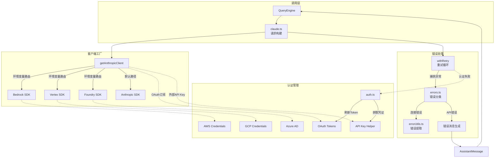
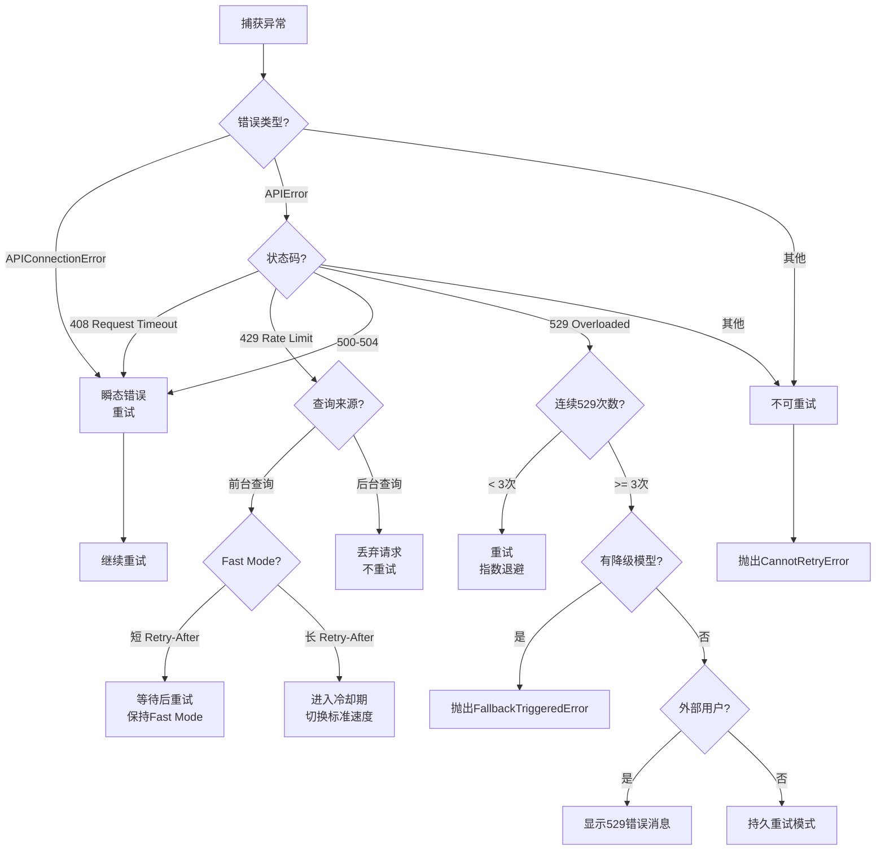

Claude Code 的 API 客户端层作为整个系统与 Anthropic API 通信的核心枢纽，承担着多云提供商适配、认证管理、错误处理、重试策略以及速率限制追踪等关键职责。该层通过统一的客户端接口屏蔽了 Anthropic API、AWS Bedrock、Google Vertex AI 和 Azure Foundry 之间的差异，为上层 QueryEngine 提供一致的调用体验，同时内置了复杂的错误恢复机制确保在各类异常场景下的系统稳定性。

## 架构概览与设计理念

API 客户端采用**工厂模式 + 适配器模式**的组合架构：`getAnthropicClient` 工厂函数根据环境变量和认证状态动态创建对应的 SDK 客户端实例，所有提供商的客户端均统一为 `Anthropic` 类型接口，使得上层代码无需感知底层差异。错误处理采用**多层防护策略**：从网络连接错误、SSL/TLS 证书问题、API 限流、认证失败到业务逻辑错误，每一层都有专门的错误识别和转换逻辑，将原始异常转化为用户友好的 AssistantMessage。



Sources: [client.ts](src/services/api/client.ts#L88-L316), [errors.ts](src/services/api/errors.ts#L425-L899), [withRetry.ts](src/services/api/withRetry.ts#L170-L400)

## 客户端创建与多云适配

### 工厂函数设计

`getAnthropicClient` 函数是整个 API 客户端层的入口点，其核心职责是根据当前环境配置创建正确的 SDK 客户端实例。该函数遵循**优先级检测链**：首先检查是否启用了 Bedrock/Vertex/Foundry 等第三方服务，然后根据认证状态选择 OAuth Token 或 API Key，最后应用全局配置（超时、重试、代理等）。这种设计确保了在混合环境（如同时配置了 API Key 和 OAuth Token）下的确定性行为。

客户端创建过程中最关键的决策点是**认证方式选择**：对于 Claude.ai 订阅用户，系统优先使用 OAuth Access Token（通过 `getClaudeAIOAuthTokens()` 获取），此时 `apiKey` 参数设置为 `null` 以避免 SDK 使用环境变量中的旧 API Key。对于非订阅用户或显式配置了外部认证的场景，系统则回退到 API Key 认证（通过 `getAnthropicApiKey()` 或 `apiKeyHelper` 获取）。这种双重认证路径的设计既支持了无缝的订阅体验，又保留了企业用户使用自定义认证网关的灵活性。

Sources: [client.ts](src/services/api/client.ts#L88-L138), [client.ts](src/services/api/client.ts#L300-L316)

### 多云提供商适配策略

Claude Code 通过环境变量路由机制支持四种部署方式，每种方式都有独立的 SDK 依赖和认证流程：

| 提供商 | 环境变量开关 | SDK 包 | 认证方式 | 特殊配置 |
|--------|-------------|--------|---------|---------|
| **Anthropic API** | 默认（无开关） | `@anthropic-ai/sdk` | API Key / OAuth Token | `ANTHROPIC_API_KEY` 或 OAuth |
| **AWS Bedrock** | `CLAUDE_CODE_USE_BEDROCK` | `@anthropic-ai/bedrock-sdk` | AWS Credentials | `AWS_REGION`、`AWS_BEARER_TOKEN_BEDROCK` |
| **Google Vertex** | `CLAUDE_CODE_USE_VERTEX` | `@anthropic-ai/vertex-sdk` | GCP Service Account | `ANTHROPIC_VERTEX_PROJECT_ID`、`CLOUD_ML_REGION` |
| **Azure Foundry** | `CLAUDE_CODE_USE_FOUNDRY` | `@anthropic-ai/foundry-sdk` | Azure AD / API Key | `ANTHROPIC_FOUNDRY_RESOURCE`、`ANTHROPIC_FOUNDRY_API_KEY` |

**AWS Bedrock 适配**的特殊性在于需要处理凭证刷新和区域选择：系统通过 `refreshAndGetAwsCredentials()` 主动刷新临时凭证（对于 AssumeRole 场景），同时支持通过 `ANTHROPIC_SMALL_FAST_MODEL_AWS_REGION` 为 Haiku 模型指定不同的区域（用于降低延迟或绕过区域容量限制）。Bedrock 还支持 `AWS_BEARER_TOKEN_BEDROCK` 环境变量用于 API Key 认证（跳过标准的 AWS Signature V4 签名流程），这种模式主要用于测试环境或通过代理网关访问 Bedrock 的场景。

**Google Vertex 适配**面临的最大挑战是避免元数据服务器超时：当在非 GCP 环境运行时，`google-auth-library` 会尝试连接 GCE 元数据服务器获取默认项目 ID，导致 12 秒延迟。Claude Code 通过**预检测 + 回退注入**策略解决这个问题：首先检查是否已通过环境变量（`GOOGLE_CLOUD_PROJECT`）或凭证文件（`GOOGLE_APPLICATION_CREDENTIALS`）配置了项目 ID，如果都没有，则使用 `ANTHROPIC_VERTEX_PROJECT_ID` 作为 `GoogleAuth` 构造函数的 `projectId` 参数，避免元数据服务器查询。这种设计的权衡在于：如果认证凭证中的项目 ID 与 API 目标项目不一致，可能导致计费/审计问题，但用户可以通过显式设置 `GOOGLE_CLOUD_PROJECT` 覆盖此行为。

Sources: [client.ts](src/services/api/client.ts#L153-L189), [client.ts](src/services/api/client.ts#L221-L298), [client.ts](src/services/api/client.ts#L191-L220)

### 自定义请求头与调试支持

客户端支持通过 `ANTHROPIC_CUSTOM_HEADERS` 环境变量注入自定义 HTTP 头（格式为 curl 风格的 `Name: Value` 列表，每行一个），这种机制主要用于企业代理服务器认证或 A/B 测试场景。系统还会自动注入多个**诊断头**：`x-app: cli` 标识客户端类型、`X-Claude-Code-Session-Id` 关联会话 ID、`x-client-request-id`（仅限 First-Party API）用于关联客户端日志与服务端日志（特别重要对于超时错误，因为服务端可能未记录请求 ID）。调试模式下（通过 `isDebugToStdErr()` 检测），客户端会注入自定义 logger 将 SDK 内部日志输出到 stderr，便于排查底层 HTTP 通信问题。

Sources: [client.ts](src/services/api/client.ts#L104-L130), [client.ts](src/services/api/client.ts#L330-L389)

## 错误处理体系

### 错误分类与识别策略

Claude Code 的错误处理采用**模式匹配 + 启发式规则**的组合策略，将原始异常分类为六大类别：连接错误（`APIConnectionError`、超时）、认证错误（401/403）、限流错误（429/529）、请求错误（400）、媒体错误（图片/PDF 尺寸超限）以及业务错误（余额不足、组织禁用等）。这种分类的复杂性来源于不同提供商的错误格式差异：Anthropic API 返回标准化的 JSON 错误，Bedrock 可能返回 XML 包装的错误，而 Vertex 则可能返回 Google 特有的错误结构。

**连接错误处理**的核心是 `extractConnectionErrorDetails` 函数，该函数遍历错误链的 `cause` 属性（最多 5 层）提取根因错误代码和消息。系统维护了一个 **SSL/TLS 错误代码集合**（如 `UNABLE_TO_VERIFY_LEAF_SIGNATURE`、`DEPTH_ZERO_SELF_SIGNED_CERT`），当检测到这些代码时，会生成特定的用户提示："SSL certificate error (...) If you are behind a corporate proxy or TLS-intercepting firewall, set NODE_EXTRA_CA_CERTS to your CA bundle path"。这种设计针对企业环境中的 TLS 拦截代理（如 Zscaler），这些代理会导致 OAuth 浏览器认证成功但 CLI 的 Token 交换失败（因为 CLI 使用不同的 CA 证书库）。

**API 错误的 HTML 清理**是另一个重要细节：某些代理服务器（如 CloudFlare）在拦截请求时返回 HTML 错误页面而非 JSON，如果直接展示给用户会造成界面混乱。`sanitizeMessageHTML` 函数检测 HTML 标签（`<!DOCTYPE html`、`<html`），如果存在则尝试提取 `<title>` 内容，否则返回空字符串。这种防御性清理确保了错误消息的文本可读性。

Sources: [errorUtils.ts](src/services/api/errorUtils.ts#L4-L100), [errorUtils.ts](src/services/api/errorUtils.ts#L102-L198), [errors.ts](src/services/api/errors.ts#L434-L599)

### 速率限制错误的精细化处理

速率限制（429 状态码）处理是整个错误体系中最复杂的部分，Claude Code 实现了**三层限流检测机制**：

1. **统一限流头解析**：现代 Anthropic API 返回 `anthropic-ratelimit-unified-*` 系列头，包括 `representative-claim`（触发限流的配额类型）、`reset`（重置时间戳）、`overage-status`（超额使用状态）等。系统将这些头解析为 `ClaudeAILimits` 对象，包含 `status`（`allowed`/`allowed_warning`/`rejected`）、`rateLimitType`（`five_hour`/`seven_day`/`seven_day_opus` 等）、`resetsAt` 等字段。

2. **提前警告机制**：系统维护了**配额消耗速度阈值表**（如 5 小时配额在 72% 时间消耗 90% 时触发警告，7 天配额在 15% 时间消耗 25% 时触发警告）。当服务端未发送 `surpassed-threshold` 头时，客户端使用这些阈值进行本地计算，生成提前警告消息（"You're using your weekly limit faster than usual..."）。

3. **超额使用（Overage）管理**：对于启用了 Extra Usage 的用户，系统跟踪 `overageStatus` 和 `overageDisabledReason`。当超额配额耗尽时，错误消息会区分不同的禁用原因（如 `out_of_credits`、`org_level_disabled`），提供针对性的解决建议。

限流错误消息的生成遵循**渐进式提示原则**：对于静默降级场景（如 Opus → Sonnet 自动切换），返回 `NO_RESPONSE_REQUESTED` 常量避免向用户展示错误；对于需要用户行动的场景，消息包含具体的重置时间、当前使用率以及操作建议（如 "/model 切换到 Sonnet"）。非交互式会话（SDK 模式）的消息会移除快捷键提示（如 "Double press esc"），改为提供命令行参数建议。

Sources: [errors.ts](src/services/api/errors.ts#L466-L558), [claudeAiLimits.ts](src/services/claudeAiLimits.ts#L53-L179)

### 认证错误的上下文感知

认证错误（401/403）的处理需要根据**认证来源**生成不同的用户指引：

```typescript
// 环境变量 API Key 场景
if (source === 'ANTHROPIC_API_KEY' && process.env.ANTHROPIC_API_KEY && !isClaudeAISubscriber()) {
  const hasStoredOAuth = getClaudeAIOAuthTokens()?.accessToken != null
  return hasStoredOAuth
    ? 'Your ANTHROPIC_API_KEY belongs to a disabled organization · Unset the environment variable to use your subscription instead'
    : 'Your ANTHROPIC_API_KEY belongs to a disabled organization · Update or unset the environment variable'
}

// 外部认证源（apiKeyHelper 或 ANTHROPIC_AUTH_TOKEN）
const isExternalSource = source === 'ANTHROPIC_API_KEY' || source === 'apiKeyHelper'
return isExternalSource
  ? 'Invalid API key · Fix external API key'
  : 'Not logged in · Please run /login'
```

**OAuth Token 撤销检测**通过匹配特定的错误消息（`'OAuth token has been revoked'`）识别，这种情况通常发生在用户在另一个终端执行了 `/logout` 或在 Claude.ai 网站上撤销了授权。**CCR（Claude Code Remote）模式**下的认证错误会被特殊处理为临时网络问题（"This may be a temporary network issue, please try again"），因为 CCR 使用 JWT 认证，401/403 错误更可能是网络抖动而非凭证失效。

Sources: [errors.ts](src/services/api/errors.ts#L782-L883)

### 媒体尺寸错误的交互式提示

图片和 PDF 尺寸错误需要根据**会话类型**（交互式 vs. 非交互式）提供不同的恢复路径：

```typescript
export function getPdfTooLargeErrorMessage(): string {
  const limits = `max ${API_PDF_MAX_PAGES} pages, ${formatFileSize(PDF_TARGET_RAW_SIZE)}`
  return getIsNonInteractiveSession()
    ? `PDF too large (${limits}). Try reading the file a different way (e.g., extract text with pdftotext).`
    : `PDF too large (${limits}). Double press esc to go back and try again, or use pdftotext to convert to text first.`
}
```

这种设计体现了**渐进式披露原则**：交互式用户可以快速通过快捷键返回编辑，而 SDK/自动化用户需要明确的替代方案。图片错误（`ImageSizeError`、`ImageResizeError`）在 API 调用前的验证阶段抛出，因此错误消息直接指向本地操作而非 API 配置。

Sources: [errors.ts](src/services/api/errors.ts#L170-L196), [errors.ts](src/services/api/errors.ts#L445-L453)

## 重试机制与容错策略

### withRetry 生成器架构

`withRetry` 是一个**异步生成器函数**，其设计目标是同时支持流式响应和重试控制。该函数采用**状态机模式**：主循环维护 `attempt`（当前尝试次数）、`consecutive529Errors`（连续 529 错误计数）、`retryContext`（包含模型、思考配置等可变状态）等状态，每次迭代执行操作并捕获异常，根据异常类型决定继续重试、降级模型或抛出 `CannotRetryError`。

生成器的 `yield` 机制用于**向 UI 层传递中间状态**：在持久重试模式（`CLAUDE_CODE_UNATTENDED_RETRY`）下，系统会定期 yield `SystemAPIErrorMessage` 对象作为心跳信号，防止宿主环境（如 CI/CD 系统）将会话标记为空闲。这种设计的权衡在于：心跳消息会出现在对话历史中，但对于无人值守的长时间运行任务（如大型代码库的自动修复），这是可接受的代价。

Sources: [withRetry.ts](src/services/api/withRetry.ts#L170-L253), [withRetry.ts](src/services/api/withRetry.ts#L100-L104)

### 重试决策树与分类策略

重试逻辑的核心是 `shouldRetry` 判断函数，该函数根据错误类型、状态码、查询来源等因素综合决策：



**前台查询 vs. 后台查询**的区分是关键优化：系统维护了 `FOREGROUND_529_RETRY_SOURCES` 集合（包括 `repl_main_thread`、`sdk`、`agent:*` 等），只有这些来源的查询在遇到 529 错误时才会重试。后台查询（如标题生成、建议提示、分类器）在容量级联期间立即失败，避免重试放大效应（每个重试请求可能导致 3-10 倍的网关负载增加）。这种设计的哲学是：用户永远不会看到后台查询的失败，因此静默丢弃优于加剧系统负载。

Sources: [withRetry.ts](src/services/api/withRetry.ts#L62-L89), [withRetry.ts](src/services/api/withRetry.ts#L316-L383)

### Fast Mode 的特殊重试路径

Fast Mode（通过 `claude-sonnet-4-20250514` 模型别名实现）的重试逻辑需要**平衡缓存保留与负载控制**：当遇到 429/529 错误时，如果 `Retry-After` 头指示的等待时间小于阈值（`SHORT_RETRY_THRESHOLD_MS`），系统会保持 Fast Mode 等待后重试，以利用 Prompt Cache；如果等待时间过长，则进入冷却期（`triggerFastModeCooldown`），切换到标准速度模型（`claude-sonnet-4-20250514` → `claude-sonnet-4-20250514` 的标准别名），避免在高负载期间持续消耗缓存配额。

**超额使用拒绝**的特殊处理：当 429 错误包含 `anthropic-ratelimit-unified-overage-disabled-reason` 头时，系统会永久禁用 Fast Mode（`handleFastModeOverageRejection`），因为这意味着用户的组织未启用 Extra Usage 或配额已耗尽。这种情况下继续重试 Fast Mode 毫无意义，立即降级可以避免无效的 API 调用。

Sources: [withRetry.ts](src/services/api/withRetry.ts#L261-L305), [withRetry.ts](src/services/api/withRetry.ts#L307-L314)

### 模型降级与 Opus → Sonnet 回退

对于使用 Opus 模型的外部用户，系统实现了**自动降级机制**：当连续遇到 3 次 529 错误且配置了 `fallbackModel` 时，抛出 `FallbackTriggeredError` 异常，上层调用者捕获该异常后会使用降级模型重新发起请求。这种设计的限制在于：降级决策基于模型名称（`isNonCustomOpusModel`），如果用户通过 `ANTHROPIC_MODEL` 环境变量设置了自定义 Opus 别名，降级逻辑不会触发。

**持久重试模式**（`CLAUDE_CODE_UNATTENDED_RETRY`）是为无人值守会话设计的特殊路径：该模式在遇到瞬态错误（429/529）时会**无限重试**，使用更高的退避上限（5 分钟）和周期性心跳（30 秒间隔）。这种模式适用于 CI/CD 管道或自动化任务，其中会话的完成比快速失败更重要。系统的保护机制包括：退避时间在 6 小时后重置（避免无限增长），心跳通过 yield 传递防止被标记为空闲。

Sources: [withRetry.ts](src/services/api/withRetry.ts#L326-L365), [withRetry.ts](src/services/api/withRetry.ts#L91-L104)

### 认证错误的客户端重建策略

当遇到 401 错误或 OAuth Token 撤销错误时，重试循环会**强制重建客户端实例**：`client = await getClient()`。这种重建触发了完整的认证流程：对于 OAuth 订阅用户，`checkAndRefreshOAuthTokenIfNeeded()` 会尝试使用 Refresh Token 获取新的 Access Token；对于 API Key 用户，`getAnthropicApiKey()` 会重新读取环境变量或执行 `apiKeyHelper` 命令。这种设计的核心假设是：认证错误通常是瞬态的（Token 过期、并发刷新导致的暂时失效），重建客户端可以自动恢复。

**连接池污染处理**：当检测到 `ECONNRESET` 或 `EPIPE` 错误时（表示 keep-alive socket 已失效），系统会调用 `disableKeepAlive()` 禁用连接池，强制后续请求建立新的 TCP 连接。这种处理对于长时间运行的会话特别重要，因为防火墙或负载均衡器可能在会话期间关闭空闲连接，导致后续请求失败。

Sources: [withRetry.ts](src/services/api/withRetry.ts#L212-L251), [withRetry.ts](src/services/api/withRetry.ts#L112-L118)

## 速率限制追踪与用户通知

### ClaudeAILimits 状态管理

`currentLimits` 是一个**全局单例状态对象**，存储当前的配额状态（`status`、`rateLimitType`、`utilization`、`resetsAt` 等）。该对象通过**响应式监听器模式**更新 UI：`statusListeners` 集合包含所有注册的监听器函数，每当 `emitStatusChange` 被调用时（通常在 API 响应头解析后），所本监听器都会收到新的 limits 对象。这种设计使得状态栏组件、警告对话框等 UI 元素能够实时反映配额变化，而无需轮询。

**原始利用率追踪**（`rawUtilization`）与**警告状态**（`currentLimits.utilization`）的分离是重要设计细节：`rawUtilization` 在每次 API 响应后更新（通过解析 `anthropic-ratelimit-unified-5h-utilization` 和 `anthropic-ratelimit-unified-7d-utilization` 头），用于状态栏的实时显示；而 `currentLimits.utilization` 仅在触发警告阈值时设置，用于生成用户可见的警告消息。这种分离确保了 UI 显示的连续性与警告的稀缺性。

Sources: [claudeAiLimits.ts](src/services/claudeAiLimits.ts#L138-L197), [claudeAiLimits.ts](src/services/claudeAiLimits.ts#L149-L179)

### 提前警告的计算逻辑

提前警告系统使用**时间-利用率二维阈值表**判断是否应该发出警告：

| 配额类型 | 时间进度阈值 | 利用率阈值 | 含义 |
|---------|------------|----------|-----|
| 5 小时 | 72% | 90% | 在 3.6 小时内消耗了 90% 的配额 |
| 7 天 | 60% | 75% | 在 4.2 天内消耗了 75% 的配额 |
| 7 天 | 35% | 50% | 在 2.45 天内消耗了 50% 的配额 |
| 7 天 | 15% | 25% | 在 1.05 天内消耗了 25% 的配额 |

计算公式为：`timeProgress = (now - windowStart) / windowSeconds`，当 `utilization >= threshold.utilization && timeProgress <= threshold.timePct` 时触发警告。这种设计的直觉是：如果用户在时间窗口的早期就消耗了大量配额，那么在窗口结束前很可能耗尽配额，应该提前警告。

**服务端优先原则**：现代 API 会在响应头中发送 `anthropic-ratelimit-unified-surpassed-threshold`（值为阈值索引），客户端优先使用该值而非本地计算。这种设计确保了警告逻辑的一致性（避免客户端与服务端阈值不同步），同时保留了本地计算作为旧版 API 的回退方案。

Sources: [claudeAiLimits.ts](src/services/claudeAiLimits.ts#L53-L103), [claudeAiLimits.ts](src/services/claudeAiLimits.ts#L164-L179)

## 请求构建与响应处理

### 工具模式转换与缓存优化

`toolToAPISchema` 函数负责将内部 `Tool` 对象转换为 Anthropic API 的 `BetaToolUnion` 格式，这个过程涉及多个优化策略：

1. **模式缓存**：工具的 JSON Schema 转换结果通过 `toolSchemaCache` 缓存（以工具名称 + schema 为键），避免在每次请求时重复执行 Zod → JSON Schema 转换。这种缓存对于包含大量工具的会话特别重要，因为 schema 转换可能消耗显著 CPU 时间。

2. **Swarm 字段过滤**：当 `isAgentSwarmsEnabled()` 返回 `false` 时（外部用户或未启用特性），系统会从 `AgentTool` 和 `ExitPlanModeTool` 的 schema 中删除 `launchSwarm`、`team_name` 等字段，确保外部用户不会在 schema 中看到未授权的功能。

3. **Strict 模式注入**：当特性开关 `tengu_tool_pear` 启用且工具标记为 `strict: true` 时，系统会在 schema 中添加 `strict: true` 字段，启用 API 的严格参数验证。这种验证可以捕获更多用户输入错误，但仅支持特定模型（通过 `modelSupportsStructuredOutputs` 检查）。

4. **细粒度工具流式传输（FGTS）**：对于 First-Party API，系统会在工具 schema 中添加 `eager_input_streaming: true` 字段，启用流式工具参数传输。这种优化可以显著改善大型工具输入（如长文件编辑）的响应延迟，因为 API 会在接收完整参数前就开始处理。

Sources: [api.ts](src/utils/api.ts#L119-L200), [api.ts](src/utils/api.ts#L86-L117)

### 消息规范化与系统提示分割

消息规范化（`normalizeMessagesForAPI`）处理多个边缘情况：移除 advisor 块（`stripAdvisorBlocks`）、确保工具调用与工具结果的配对（`ensureToolResultPairing`）、规范化内容格式（`normalizeContentFromAPI`）。**系统提示分割**（`splitSysPromptPrefix`）是一个特殊优化：系统提示被分割为多个块，每个块可以有不同的缓存作用域（`global`、`org` 或 `ephemeral`），通过 `cache_control` 字段传递给 API。

**Prompt Cache 的 1 小时作用域**是高级优化：对于符合条件的会话（通过 `getPromptCache1hEligible` 判断），系统会将静态系统提示块的 `ttl` 设置为 `1h`（而非默认的 `5m`），使得这些块在 1 小时内的多次请求中可以复用缓存。资格判断基于会话 ID、用户 ID 和组织 ID 的组合，确保缓存不会跨用户/组织泄漏。

Sources: [api.ts](src/utils/api.ts#L80-L85), [claude.ts](src/services/api/claude.ts#L56-L84)

### 成本追踪与诊断日志

每次 API 请求完成后，系统会从响应的 `usage` 字段提取 token 计数（`input_tokens`、`output_tokens`、`cache_creation_input_tokens`、`cache_read_input_tokens`），通过 `calculateUSDCost` 计算美元成本，累加到 `totalSessionCost` 全局变量。这种追踪对于**预算控制**和**用户透明度**至关重要：用户可以通过 `/cost` 命令查看当前会话的累计成本，状态栏也会在成本超过阈值时显示警告。

**请求/响应日志**通过 `captureAPIRequest` 和 `logForDebugging` 实现：在调试模式下，系统会记录完整的请求参数（模型、消息数量、工具数量）和响应元数据（请求 ID、token 使用量、延迟）。这些日志对于排查 API 行为异常（如意外的 token 计数、缓存命中率低）非常有价值，但仅在显式启用调试时才记录，避免性能开销。

Sources: [claude.ts](src/services/api/claude.ts#L147-L180), [claude.ts](src/services/api/claude.ts#L96-L103)

## 关键文件索引

| 文件路径 | 核心职责 | 关键函数/类 |
|---------|---------|-----------|
| `src/services/api/client.ts` | 客户端工厂与多云适配 | `getAnthropicClient`、`configureApiKeyHeaders`、`buildFetch` |
| `src/services/api/claude.ts` | 请求构建与响应处理 | `streamBetaMessages`、`makeBetaMessagesRequest`、`getAPIMetadata` |
| `src/services/api/errors.ts` | 错误分类与消息生成 | `getAssistantMessageFromError`、`isPromptTooLongMessage`、`isMediaSizeError` |
| `src/services/api/errorUtils.ts` | 错误提取与清理 | `extractConnectionErrorDetails`、`formatAPIError`、`getSSLErrorHint` |
| `src/services/api/withRetry.ts` | 重试循环与容错策略 | `withRetry`、`CannotRetryError`、`FallbackTriggeredError` |
| `src/services/claudeAiLimits.ts` | 速率限制追踪与警告 | `emitStatusChange`、`extractQuotaStatusFromHeaders`、`getRateLimitDisplayName` |
| `src/utils/auth.ts` | 认证管理与 Token 刷新 | `getAnthropicApiKey`、`checkAndRefreshOAuthTokenIfNeeded`、`isClaudeAISubscriber` |
| `src/utils/api.ts` | 工具模式转换与缓存 | `toolToAPISchema`、`splitSysPromptPrefix`、`CacheScope` |

## 相关主题

- **认证流程**：深入了解 OAuth Token 刷新和 API Key 管理机制，参见 [OAuth 2.0 流程：认证与令牌刷新](25-oauth-2-0-liu-cheng-ren-zheng-yu-ling-pai-shua-xin)
- **上下文管理**：了解配额耗尽时的自动压缩策略，参见 [上下文压缩：compact 服务与对话摘要](26-shang-xia-wen-ya-suo-compact-fu-wu-yu-dui-hua-zhai-yao)
- **查询引擎**：理解 API 客户端如何被 QueryEngine 调用，参见 [QueryEngine：LLM 查询循环与工具调度核心](5-queryengine-llm-cha-xun-xun-huan-yu-gong-ju-diao-du-he-xin)
- **成本追踪**：详细的 token 计费逻辑，参见 [成本追踪：token 计费与用量统计](42-cheng-ben-zhui-zong-token-ji-fei-yu-yong-liang-tong-ji)