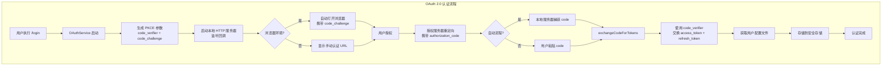
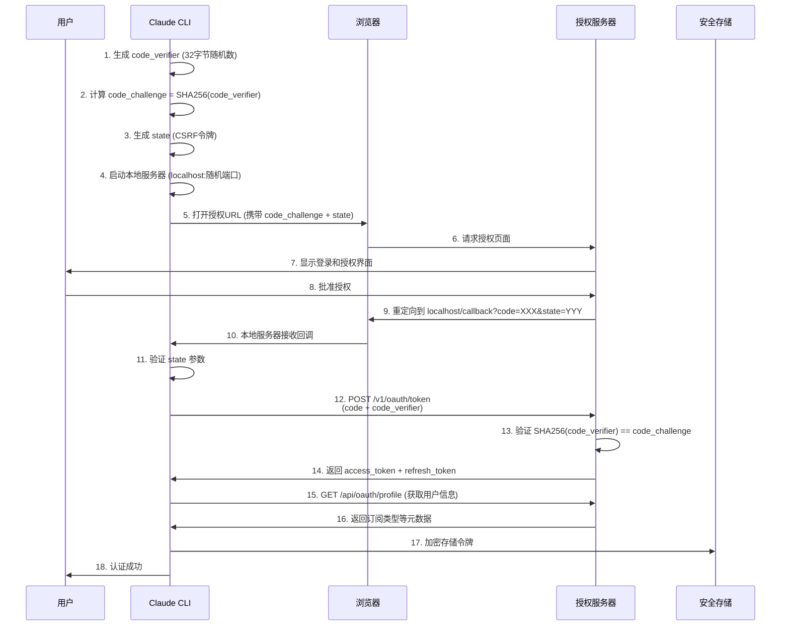
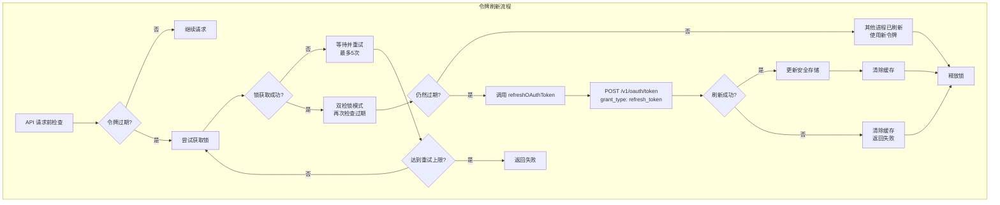

Claude Code 实现了完整的 OAuth 2.0 授权码流程，采用 PKCE（Proof Key for Code Exchange）扩展增强安全性。该系统支持 Claude.ai 订阅用户（Pro/Max/Team/Enterprise）通过 OAuth 令牌进行身份认证，并实现了自动化的令牌刷新机制以确保长期会话的连续性。

## OAuth 2.0 架构概览

Claude Code 的 OAuth 实现遵循标准 OAuth 2.0 授权码流程，同时针对 CLI 环境进行了优化。系统支持两种认证路径：自动流程（通过本地服务器捕获回调）和手动流程（用户复制粘贴授权码）。整个架构由三个核心组件构成：OAuth 客户端服务、令牌管理器和安全存储层。



OAuth 配置支持三种环境：生产环境（prod）、测试环境（staging）和本地开发环境（local）。配置通过 `getOauthConfig()` 函数动态获取，支持通过环境变量 `USE_LOCAL_OAUTH` 和 `USE_STAGING_OAUTH` 进行切换。

Sources: [oauth.ts](src/constants/oauth.ts#L1-L235), [index.ts](src/services/oauth/index.ts#L1-L199)

## PKCE 安全机制

PKCE（Proof Key for Code Exchange）是 OAuth 2.0 的安全扩展，专为无法安全存储 client_secret 的客户端（如 CLI 工具）设计。Claude Code 使用 SHA-256 哈希算法生成 code_challenge，确保授权码在传输过程中不被窃取和重放。

PKCE 流程涉及三个关键参数：`code_verifier`（随机生成的 32 字节字符串）、`code_challenge`（code_verifier 的 SHA-256 哈希值）和 `state`（CSRF 保护令牌）。这些参数通过加密模块生成，使用 Base64 URL 安全编码格式。



`generateCodeVerifier()` 函数使用 Node.js 的 `crypto.randomBytes(32)` 生成加密安全的随机值，然后通过 `base64URLEncode()` 转换为 URL 安全格式。`generateCodeChallenge()` 对 verifier 进行 SHA-256 哈希，确保挑战值的不可逆性。

Sources: [crypto.ts](src/services/oauth/crypto.ts#L1-L24), [client.ts](src/services/oauth/client.ts#L44-L95)

## 授权码监听器

`AuthCodeListener` 类实现了一个临时的本地 HTTP 服务器，用于捕获 OAuth 授权码重定向。该服务器监听 `localhost` 的操作系统分配端口（避免端口冲突），路径为 `/callback`。当授权服务器重定向时，服务器解析查询参数中的 `code` 和 `state`，验证 CSRF 令牌，然后关闭服务器。

服务器支持两种响应模式：自动重定向到成功页面（根据授权范围选择 Console 或 Claude.ai 的成功页）和自定义处理（用于特殊场景）。`handleSuccessRedirect()` 方法根据授予的 scope 决定重定向目标：包含 `user:inference` scope 的令牌重定向到 Claude.ai 成功页，否则重定向到 Console 成功页。

Sources: [auth-code-listener.ts](src/services/oauth/auth-code-listener.ts#L1-L212)

## 令牌交换与存储

授权码通过 `exchangeCodeForTokens()` 函数与授权服务器交换访问令牌。该函数向 `/v1/oauth/token` 端点发送 POST 请求，包含 `grant_type: 'authorization_code'`、授权码、重定向 URI、客户端 ID 和 code_verifier。服务器验证请求后返回包含 `access_token`、`refresh_token`、`expires_in` 和 `scope` 的 JSON 响应。

令牌存储采用多层安全机制。访问令牌和刷新令牌存储在操作系统级安全存储中（macOS Keychain、Windows Credential Manager 或 Linux Secret Service），通过 `SecureStorage` 抽象层访问。存储数据包括令牌本身、过期时间、授权范围、订阅类型和速率限制层级。

```typescript
// OAuth 令牌数据结构（推断自代码）
interface OAuthTokens {
  accessToken: string              // 访问令牌
  refreshToken: string | null      // 刷新令牌
  expiresAt: number | null         // 过期时间戳（毫秒）
  scopes: string[]                 // 授权范围数组
  subscriptionType: SubscriptionType | null  // 订阅类型：'pro' | 'max' | 'team' | 'enterprise'
  rateLimitTier: RateLimitTier | null       // 速率限制层级
  profile?: OAuthProfileResponse   // 用户配置文件
  tokenAccount?: {                 // 令牌关联账户信息
    uuid: string
    emailAddress: string
    organizationUuid?: string
  }
}
```

`saveOAuthTokensIfNeeded()` 函数负责将令牌持久化到安全存储。该函数首先检查令牌是否包含 Claude.ai 认证 scope（`user:inference`），然后跳过仅用于推理的令牌（来自环境变量，无刷新令牌）。存储时保留现有的订阅类型和速率限制层级，避免临时网络故障导致的数据丢失。

Sources: [client.ts](src/services/oauth/client.ts#L97-L186), [auth.ts](src/utils/auth.ts#L1100-L1299)

## 令牌刷新机制

Claude Code 实现了主动式令牌刷新策略，在令牌过期前 5 分钟自动刷新，避免请求中断。刷新机制由 `checkAndRefreshOAuthTokenIfNeeded()` 函数驱动，该函数在每次 API 请求前被调用，检查令牌是否即将过期。



刷新流程使用文件锁（`lockfile.lock()`）确保多个 Claude Code 实例不会同时刷新同一令牌。锁机制避免竞争条件：第一个获取锁的进程执行刷新，其他进程等待并使用刷新后的令牌。如果锁获取失败，函数会重试最多 5 次，每次等待 1-2 秒的随机延迟。

`refreshOAuthToken()` 函数向 `/v1/oauth/token` 端点发送刷新请求，包含 `grant_type: 'refresh_token'`、刷新令牌和请求的 scope。对于 Claude.ai 订阅用户，函数使用默认的 `CLAUDE_AI_OAUTH_SCOPES`，允许服务器在刷新时扩展授权范围（例如添加新的 `user:file_upload` scope），无需用户重新登录。

Sources: [auth.ts](src/utils/auth.ts#L1300-L1599), [client.ts](src/services/oauth/client.ts#L188-L334)

## 401 错误处理与令牌失效

当 API 返回 401 错误（令牌过期或无效）时，`handleOAuth401Error()` 函数触发强制刷新流程。该函数首先清除所有令牌缓存，然后异步读取安全存储中的当前令牌。如果存储中的令牌与失败令牌不同，说明另一个进程已刷新，直接使用新令牌；否则强制刷新，绕过本地过期检查。

这种设计处理了时钟偏差场景：服务器可能认为令牌已过期，而客户端的本地检查显示未过期。通过强制刷新，系统确保在服务器拒绝令牌时能够恢复，而不是依赖可能不准确的本地过期时间。

跨进程失效机制通过文件修改时间检测实现。`invalidateOAuthCacheIfDiskChanged()` 函数检查 `.credentials.json` 文件的 `mtime`，如果其他进程修改了文件（例如执行 `/login` 或刷新令牌），当前进程清除内存缓存，重新从磁盘读取。这解决了多个终端窗口同时运行时的令牌同步问题。

Sources: [auth.ts](src/utils/auth.ts#L1300-L1450)

## OAuth Scope 与权限模型

Claude Code 定义了两组 OAuth scope：Console scope 和 Claude.ai scope。Console scope（`org:create_api_key` 和 `user:profile`）用于通过 Console 创建 API 密钥。Claude.ai scope 包含完整的用户权限集：`user:profile`（访问用户配置）、`user:inference`（执行推理请求）、`user:sessions:claude_code`（管理 Claude Code 会话）、`user:mcp_servers`（访问 MCP 服务器）和 `user:file_upload`（上传文件）。

登录时，系统请求所有 scope 的并集（`ALL_OAUTH_SCOPES`），确保能够处理从 Console 到 Claude.ai 的重定向流程。刷新时，根据令牌类型选择 scope：Claude.ai 订阅用户的令牌使用默认 scope（允许扩展），其他令牌使用原始 scope。

`shouldUseClaudeAIAuth()` 函数检查令牌是否包含 `user:inference` scope，确定是否使用 Claude.ai 认证路径。`hasProfileScope()` 函数检查 `user:profile` scope，用于判断是否可以调用需要配置文件访问的端点（如 `/api/oauth/profile`）。

Sources: [oauth.ts](src/constants/oauth.ts#L24-L57), [client.ts](src/services/oauth/client.ts#L29-L42)

## Bridge 系统的 JWT 令牌刷新

Bridge 系统（用于 IDE 集成和远程会话）使用 JWT 令牌进行会话认证。`createTokenRefreshScheduler()` 函数实现了针对 JWT 的主动刷新调度器，解析 JWT 的 `exp` 声明（过期时间），在过期前 5 分钟调度刷新操作。

调度器支持两种模式：基于 JWT 解码的调度（`schedule()`）和基于显式 TTL 的调度（`scheduleFromExpiresIn()`）。后者用于服务器直接返回 `expires_in` 秒数的场景（例如 POST `/v1/code/sessions/{id}/bridge`）。刷新失败时，调度器重试最多 3 次，每次间隔 60 秒，然后放弃刷新链。

```typescript
// JWT 刷新调度器核心接口
interface TokenRefreshScheduler {
  schedule(sessionId: string, token: string): void        // 基于 JWT exp 调度
  scheduleFromExpiresIn(sessionId: string, expiresInSeconds: number): void  // 基于 TTL 调度
  cancel(sessionId: string): void                         // 取消调度
  cancelAll(): void                                       // 取消所有调度
}
```

Sources: [jwtUtils.ts](src/bridge/jwtUtils.ts#L1-L257)

## 配置文件与订阅类型管理

OAuth 认证成功后，系统获取用户的配置文件信息，包括订阅类型（`subscriptionType`）、速率限制层级（`rateLimitTier`）、账单类型（`billingType`）和组织信息。这些信息存储在全局配置文件（`~/.claude.json`）的 `oauthAccount` 字段中。

`fetchProfileInfo()` 函数调用 `/api/oauth/profile` 端点获取完整的用户配置。服务器的响应包含组织类型（`organization_type`），系统将其映射为订阅类型：`claude_max` → `'max'`、`claude_pro` → `'pro'`、`claude_enterprise` → `'enterprise'`、`claude_team` → `'team'`。

订阅类型决定了用户的模型访问权限和速率限制。`hasOpusAccess()` 函数检查用户是否有权访问 Opus 模型：Max、Enterprise、Team、Pro 订阅用户和 API 用户（`subscriptionType === null`）都有访问权限。`isOverageProvisioningAllowed()` 函数检查是否允许购买额外用量，仅支持 Stripe 和移动支付账单类型的订阅用户。

Sources: [client.ts](src/services/oauth/client.ts#L336-L437), [auth.ts](src/utils/auth.ts#L1600-L1750)

## 环境变量与特殊认证路径

Claude Code 支持多种环境变量覆盖认证路径，适用于 CI/CD、容器化和特殊部署场景。`CLAUDE_CODE_OAUTH_TOKEN` 环境变量直接设置 OAuth 访问令牌，跳过安全存储，创建仅用于推理的令牌（无刷新能力）。`CLAUDE_CODE_OAUTH_TOKEN_FILE_DESCRIPTOR` 环境变量指定文件描述符，从管道读取令牌（CCR 场景）。

`CLAUDE_CODE_CUSTOM_OAUTH_URL` 环境变量允许将所有 OAuth URL 重定向到自定义端点，但仅限于白名单中的 URL（FedStart/PubSec 部署），防止凭据泄露到任意端点。`USE_LOCAL_OAUTH` 和 `USE_STAGING_OAUTH` 环境变量（仅限内部构建）切换到本地开发或测试环境。

| 环境变量 | 用途 | 令牌类型 | 刷新支持 |
|---------|------|---------|---------|
| `CLAUDE_CODE_OAUTH_TOKEN` | 直接设置访问令牌 | 仅推理 | 否 |
| `CLAUDE_CODE_OAUTH_TOKEN_FILE_DESCRIPTOR` | 从文件描述符读取 | 仅推理 | 否 |
| `ANTHROPIC_API_KEY` | 直接设置 API 密钥 | API 密钥 | 不适用 |
| `CLAUDE_CODE_CUSTOM_OAUTH_URL` | 自定义 OAuth 端点 | 完整 | 是 |
| `USE_LOCAL_OAUTH` | 本地开发环境 | 完整 | 是 |
| `USE_STAGING_OAUTH` | 测试环境 | 完整 | 是 |

Sources: [oauth.ts](src/constants/oauth.ts#L1-L235), [auth.ts](src/utils/auth.ts#L200-L400)

## API 客户端集成

OAuth 令牌通过 API 客户端集成到请求流程中。`getAnthropicClient()` 函数在创建 Anthropic SDK 客户端前调用 `checkAndRefreshOAuthTokenIfNeeded()`，确保令牌有效。如果使用 Claude.ai 认证，客户端设置 `Authorization: Bearer {accessToken}` 头，并添加 `anthropic-beta: oauth-2025-04-20` 头以启用 OAuth 特性。

令牌刷新对 API 调用透明：客户端代码无需关心刷新逻辑，刷新在后台自动进行。如果刷新失败，API 请求会收到 401 错误，触发 `handleOAuth401Error()` 进行恢复。这种设计确保了长期运行会话的连续性，同时保持了代码的简洁性。