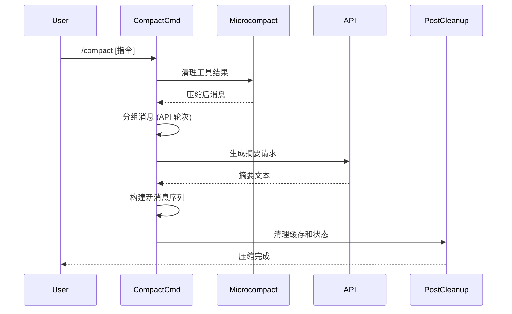
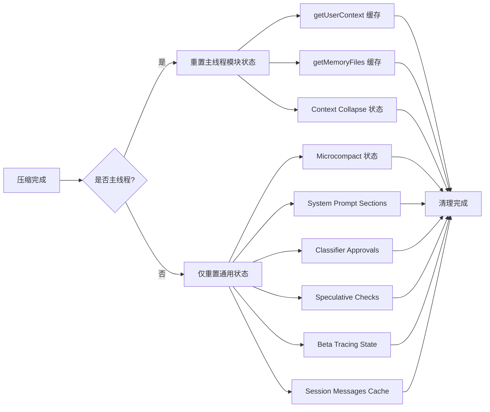

Claude Code 的上下文压缩（compact）服务是管理 LLM 上下文窗口限制的核心机制。当对话历史接近模型的 token 限制时，compact 服务会通过智能摘要和消息压缩策略，在保留关键信息的同时释放上下文空间，确保长时间会话的连续性和效率。

## 架构概览：三层压缩策略

compact 服务实现了多层次的上下文压缩策略，从最轻量级的 microcompact 到最完整的传统摘要，形成了一个渐进式的压缩阶梯：

```mermaid
graph TD
    A[上下文接近限制] --> B{检查触发条件}
    B -->|自动触发| C[autoCompact]
    B -->|手动触发| D[/compact 命令]
    
    C --> E{优先级选择}
    D --> E
    
    E -->|1. 最轻量| F[Session Memory Compact]
    E -->|2. 中等| G[Microcompact]
    E -->|3. 完整| H[传统 Compact]
    
    F --> I[保留最近消息<br/>仅压缩旧内容]
    G --> J[清理工具结果<br/>保持对话结构]
    H --> K[生成详细摘要<br/>重建对话历史]
    
    I --> L[Post-Compact Cleanup]
    J --> L
    K --> L
    
    L --> M[清理缓存<br/>重置状态]
    M --> N[继续对话]
```

**核心设计原则**：

1. **渐进式压缩**：从最小侵入性的操作开始，只在必要时执行完整的对话摘要
2. **信息保留优先**：优先保留用户消息、关键决策、代码片段和技术细节
3. **透明性**：压缩后的摘要对用户可见，支持通过 `Ctrl+O` 展开
4. **性能优化**：压缩过程本身不能触发无限循环或导致上下文爆炸

Sources: [compact.ts](src/services/compact/compact.ts#L1-L400), [autoCompact.ts](src/services/compact/autoCompact.ts#L1-L200)

## 触发机制：自动与手动

### 自动触发阈值

compact 服务通过精细的阈值管理自动触发压缩，避免用户手动干预：

**阈值计算公式**：
```
有效上下文窗口 = 模型上下文窗口 - 预留输出 token (20,000)
自动压缩阈值 = 有效上下文窗口 - 缓冲区 (13,000)
警告阈值 = 自动压缩阈值 - 警告缓冲区 (20,000)
阻塞阈值 = 有效上下文窗口 - 手动压缩缓冲区 (3,000)
```

**状态判定逻辑**：

| 状态 | 判定条件 | 用户界面表现 |
|------|---------|-------------|
| 正常 | token 使用 < 自动压缩阈值 | 无提示 |
| 警告 | token 使用 ≥ 警告阈值 | 显示剩余百分比警告 |
| 自动压缩 | token 使用 ≥ 自动压缩阈值 | 自动触发压缩 |
| 阻塞 | token 使用 ≥ 阻塞阈值 | 阻止新请求，强制压缩 |

**保护机制**：

```typescript
// 连续失败熔断器 - 避免无效重试浪费 API 调用
const MAX_CONSECUTIVE_AUTOCOMPACT_FAILURES = 3

// 递归保护 - 避免压缩代理自身触发压缩导致死锁
if (querySource === 'session_memory' || querySource === 'compact') {
  return false
}
```

Sources: [autoCompact.ts](src/services/compact/autoCompact.ts#L28-L158)

### 手动触发：`/compact` 命令

用户可通过 `/compact` 命令手动触发压缩，支持自定义摘要指令：

```typescript
// 命令实现优先级
1. Session Memory Compact (实验性) - 保留最近消息，仅压缩旧内容
2. Microcompact - 清理工具结果
3. 传统 Compact - 完整摘要生成
```

**自定义指令示例**：
```
/compact 重点关注 TypeScript 代码变更和错误修复
/compact 聚焦测试输出和代码改动，保留文件读取的完整内容
```

Sources: [compact.ts](src/commands/compact/compact.ts#L40-L137)

## 核心组件与职责

### 1. Session Memory Compact（实验性）

**设计目标**：最小化压缩侵入性，仅清理旧消息，保留最近的关键上下文。

**压缩策略**：
```typescript
配置参数:
- minTokens: 10,000 (最小保留 token)
- minTextBlockMessages: 5 (最小保留文本消息数)
- maxTokens: 40,000 (最大保留 token 硬上限)

算法流程:
1. 从最近消息向前计算 token 预算
2. 确保不破坏 tool_use/tool_result 配对
3. 保留相同 message.id 的 thinking 块
4. 插入 compact boundary 标记
```

**边界保护机制**：
- **Tool 配对保护**：如果保留的消息包含 `tool_result`，必须包含匹配的 `tool_use` 消息
- **Thinking 块完整性**：相同 `message.id` 的 thinking 和 tool_use 块必须保持在同一组
- **API 轮次边界**：只在 API 轮次边界切割，避免破坏对话完整性

Sources: [sessionMemoryCompact.ts](src/services/compact/sessionMemoryCompact.ts#L1-L200)

### 2. Microcompact：轻量级压缩

**核心思想**：在不生成摘要的情况下，通过清理冗余工具结果释放上下文空间。

**可压缩工具类型**：
```typescript
COMPACTABLE_TOOLS = {
  Read,        // 文件读取
  Bash,        // Shell 命令
  Grep,        // 搜索
  Glob,        // 文件模式匹配
  WebSearch,   // 网络搜索
  WebFetch,    // 网页获取
  Edit,        // 文件编辑
  Write        // 文件写入
}
```

**时间基础清理策略**：
```typescript
// 根据消息年龄动态调整保留策略
配置参数:
- recentThreshold: 5分钟 (最近工具结果完整保留)
- oldThreshold: 20分钟 (旧工具结果清理)
- 清理标记: '[Old tool result content cleared]'
```

**缓存优化（实验性）**：
- 使用 `cache_edits` 块标记已清理的工具结果
- 通过 Prompt Caching 机制避免重复传输
- 保持 `pinnedEdits` 在后续请求中重发

Sources: [microCompact.ts](src/services/compact/microCompact.ts#L1-L200)

### 3. 传统 Compact：完整摘要生成

**工作流程**：



**消息分组策略**：

按 API 轮次分组，确保每个分组是一个完整的请求-响应周期：
```typescript
分组边界 = 新的 assistant message.id 出现
分组内容 = [user messages, tool_results, assistant chunks] 

// 正确处理流式响应的交错消息
示例: [tool_use_A(id=X), result_A, tool_use_B(id=X)] → 一个分组
```

**摘要提示词结构**：
```
<analysis>
1. 按时间顺序分析每个消息段落
2. 识别用户意图、技术决策、代码模式
3. 记录文件名、代码片段、函数签名
4. 追踪错误及修复过程
</analysis>

<summary>
1. 主要请求和意图
2. 关键技术概念
3. 文件和代码段落
4. 错误和修复
5. 问题解决
6. 所有用户消息
7. 待处理任务
8. 当前工作
9. 可选的下一步
</summary>
```

**部分压缩支持**：
- `up_to` 模式：压缩到指定点之前的所有消息
- `from` 模式：压缩指定点之后的消息
- 保留早期上下文，仅摘要最近的冗长对话

Sources: [compact.ts](src/services/compact/compact.ts#L387-L599), [prompt.ts](src/services/compact/prompt.ts#L1-L150), [grouping.ts](src/services/compact/grouping.ts#L22-L63)

## 消息处理与内容优化

### 图像和文档剥离

**问题**：图像和文档会显著增加 token 计数，导致压缩请求本身触发 `prompt_too_long` 错误。

**解决方案**：
```typescript
// 替换图像/文档块为文本标记
if (block.type === 'image') {
  return [{ type: 'text', text: '[image]' }]
}
if (block.type === 'document') {
  return [{ type: 'text', text: '[document]' }]
}

// 递归处理 tool_result 中的嵌套媒体
if (block.type === 'tool_result') {
  // 清理 tool_result.content 数组中的图像/文档
}
```

**保留策略**：仅清理用户消息中的媒体块，assistant 消息不包含图像。

Sources: [compact.ts](src/services/compact/compact.ts#L145-L199)

### 附件过滤

**过滤重新注入的附件类型**：
```typescript
// 这些附件会在压缩后自动重新注入，无需摘要
过滤类型:
- skill_discovery  (技能发现建议)
- skill_listing    (技能列表)

// 仅在 EXPERIMENTAL_SKILL_SEARCH 启用时过滤
```

**理由**：避免浪费 token 摘要过时的技能建议，压缩后下一轮会重新发现。

Sources: [compact.ts](src/services/compact/compact.ts#L211-L223)

### Prompt-Too-Long 重试机制

**场景**：压缩请求本身触发 `prompt_too_long` 错误，用户陷入死锁。

**降级策略**：
```typescript
// 1. 解析 token gap (需要释放的 token 数)
tokenGap = getPromptTooLongTokenGap(error)

// 2. 从最旧的 API 轮次组开始丢弃
groups = groupMessagesByApiRound(messages)
累积 token 直到 ≥ tokenGap

// 3. 降级方案：丢弃 20% 的最旧组
dropCount = Math.floor(groups.length * 0.2)

// 4. 确保至少保留一个组用于摘要
dropCount = Math.min(dropCount, groups.length - 1)
```

**边界处理**：
- 丢弃第一组后，如果剩余消息以 assistant 开头，插入合成用户消息标记
- 使用 `[earlier conversation truncated for compaction retry]` 作为占位符

Sources: [compact.ts](src/services/compact/compact.ts#L243-L291)

## Post-Compact 清理与状态管理

### 清理职责划分



**关键设计决策**：
```typescript
// 不清理 invoked skill 内容
理由: Skill 内容必须在多次压缩中保留，
     createSkillAttachmentIfNeeded() 需要完整的技能文本
```

**主线程判定**：
```typescript
isMainThreadCompact = 
  querySource === undefined ||              // 手动 /compact
  querySource.startsWith('repl_main_thread') || 
  querySource === 'sdk'
```

Sources: [postCompactCleanup.ts](src/services/compact/postCompactCleanup.ts#L31-L77)

### 警告抑制机制

**目的**：压缩完成后，token 计数不准确（需等待下一次 API 响应），避免显示误导性警告。

**实现**：
```typescript
// 使用 React store 管理警告抑制状态
compactWarningStore = createStore<boolean>(false)

// 压缩成功后抑制
suppressCompactWarning() → setState(true)

// 新压缩尝试时清除
clearCompactWarningSuppression() → setState(false)

// React 组件订阅
useCompactWarningSuppression() → useSyncExternalStore(...)
```

Sources: [compactWarningState.ts](src/services/compact/compactWarningState.ts#L1-L19), [compactWarningHook.ts](src/services/compact/compactWarningHook.ts#L11-L16)

## 用户界面与交互

### CompactSummary 组件

**显示逻辑**：
```typescript
// 两种显示模式
1. 带元数据 (summarizeMetadata)
   - 显示压缩消息数量
   - 显示压缩方向
   - 显示自定义上下文指令
   
2. 标准模式
   - 显示 "Compact summary" 标题
   - 提供 Ctrl+O 展开 hint (非 transcript 模式)
   - 在 transcript 模式下显示完整摘要文本
```

**UI 结构**：
```
● Summarized conversation
  Summarized 42 messages up to this point
  Context: "Focus on TypeScript code changes"
  
[在 transcript 模式 (Ctrl+O) 下显示完整摘要内容]
```

Sources: [CompactSummary.tsx](src/components/CompactSummary.tsx#L14-L117)

### 上下文分析可视化

**Token 统计维度**：
```typescript
TokenStats = {
  toolRequests: Map<toolName, tokens>     // 按工具名称分组
  toolResults: Map<toolName, tokens>      // 工具结果 token
  humanMessages: number                    // 用户消息 token
  assistantMessages: number                // 助手消息 token
  localCommandOutputs: number              // 本地命令输出
  attachments: Map<type, count>            // 附件类型统计
  duplicateFileReads: Map<path, info>      // 重复文件读取
  total: number                            // 总 token 数
}
```

**重复读取检测**：
```typescript
// 识别同一文件的多次读取
if (data.count > 1) {
  averageTokensPerRead = data.totalTokens / data.count
  duplicateTokens = averageTokensPerRead * (data.count - 1)
  // 标记为优化机会
}
```

Sources: [contextAnalysis.ts](src/utils/contextAnalysis.ts#L27-L97)

## 性能优化与监控

### Token 估算策略

**快速估算**（用于阈值判定）：
```typescript
roughTokenCountEstimation(text) ≈ text.length / 4

// 对消息数组的估算
roughTokenCountEstimationForMessages(messages) = 
  sum(roughTokenCountEstimation(block) for each block)
```

**精确计数**（来自 API 响应）：
```typescript
tokenCountFromLastAPIResponse() 
  → 从最近的 API 响应中获取准确 token 计数
  → 用于压缩后的精确统计
```

**图像 token 估算**：
```typescript
// 图像和文档统一按 2000 token 估算
IMAGE_MAX_TOKEN_SIZE = 2000
```

Sources: [microCompact.ts](src/services/compact/microCompact.ts#L137-L157), [tokenEstimation.ts](src/services/tokenEstimation.ts)

### 分析事件追踪

**关键指标**：
```typescript
logEvent('tengu_compact', {
  // 压缩类型
  trigger: 'auto' | 'manual',
  strategy: 'session_memory' | 'microcompact' | 'traditional',
  
  // Token 变化
  preCompactTokenCount,
  postCompactTokenCount,
  truePostCompactTokenCount,  // API 返回的精确值
  
  // 压缩效率
  messagesSummarized,
  groupsDropped,
  
  // 重压缩追踪
  isRecompactionInChain,
  turnsSincePreviousCompact,
  
  // 性能指标
  compactionUsage: { input_tokens, output_tokens, cost }
})
```

**监控场景**：
- **H1/H5 检测**：跨代理的压缩循环
- **H2 检测**：同一链中的连续压缩
- **H3 检测**：手动 vs 自动压缩效率对比

Sources: [compact.ts](src/services/compact/compact.ts#L313-L323)

## 错误处理与恢复

### 错误类型与用户提示

| 错误类型 | 错误消息 | 用户操作 |
|---------|---------|---------|
| `NOT_ENOUGH_MESSAGES` | Not enough messages to compact. | 无需压缩 |
| `USER_ABORT` | Compaction canceled. | 用户取消 |
| `INCOMPLETE_RESPONSE` | Compaction interrupted · This may be due to network issues — please try again. | 重试压缩 |
| `PROMPT_TOO_LONG` | Conversation too long. Press esc twice to go up a few messages and try again. | 手动删除消息 |
| 通用错误 | Error during compaction: ${error} | 查看日志，联系支持 |

### 重试策略

**流式响应重试**：
```typescript
MAX_COMPACT_STREAMING_RETRIES = 2

// 指数退避
retryDelay = getRetryDelay(attempt, error)
```

**Prompt-Too-Long 降级**：
```typescript
MAX_PTL_RETRIES = 3

// 每次重试丢弃更多旧消息
第1次: 丢弃计算的 token gap
第2次: 丢弃 20% 最旧组
第3次: 继续降级或失败
```

Sources: [compact.ts](src/services/compact/compact.ts#L225-L298), [compact.ts](src/commands/compact/compact.ts#L125-L136)

## 配置与环境变量

**功能开关**：
```bash
# 完全禁用压缩（包括手动）
DISABLE_COMPACT=1

# 仅禁用自动压缩
DISABLE_AUTO_COMPACT=1

# 调整自动压缩窗口
CLAUDE_CODE_AUTO_COMPACT_WINDOW=100000

# 调整自动压缩百分比
CLAUDE_AUTOCOMPACT_PCT_OVERRIDE=80

# 调整阻塞限制（测试用）
CLAUDE_CODE_BLOCKING_LIMIT_OVERRIDE=150000
```

**运行时配置（GrowthBook）**：
```typescript
// Session Memory Compact 配置
tengu_sm_compact_config: {
  minTokens: 10000,
  minTextBlockMessages: 5,
  maxTokens: 40000
}

// Reactive Compact 模式开关
tengu_cobalt_raccoon: boolean
```

Sources: [autoCompact.ts](src/services/compact/autoCompact.ts#L40-L158), [sessionMemoryCompact.ts](src/services/compact/sessionMemoryCompact.ts#L102-L130)

## 最佳实践与建议

### 对于开发者

1. **优先 Session Memory Compact**：在实验性功能稳定后，它提供了最佳的信息保留/压缩比
2. **监控压缩指标**：关注 `tengu_compact` 事件，识别异常压缩频率
3. **测试边界情况**：确保 tool_use/tool_result 配对在压缩后仍然有效
4. **优化工具输出**：大型工具结果应考虑分页或摘要，减少压缩压力

### 对于用户

1. **定期手动压缩**：在上下文接近限制前使用 `/compact`，避免自动压缩打断工作流
2. **使用自定义指令**：通过 `/compact <指令>` 聚焦关键信息，提升摘要质量
3. **展开查看摘要**：使用 `Ctrl+O` 检查压缩结果，确保关键信息未丢失
4. **避免重复文件读取**：重复读取同一文件会累积 token，考虑使用 `Grep` 或更精确的查询

## 总结

Claude Code 的 compact 服务通过多层次压缩策略、智能触发机制和精细的状态管理，在保证对话连续性的同时有效管理上下文窗口限制。从轻量级的 microcompact 到完整的传统摘要，系统根据实际需求选择最优策略，最大化信息保留并最小化性能开销。

**关键设计亮点**：

- **渐进式压缩**：三层策略按需升级，避免过度压缩
- **API 轮次分组**：确保压缩边界不破坏对话完整性
- **智能清理**：Post-compact cleanup 精准重置必要状态，避免副作用
- **用户透明**：压缩过程可见、可控，支持自定义指令

这套机制使得 Claude Code 能够支持长时间、复杂的开发会话，而不会因为上下文限制中断工作流程。