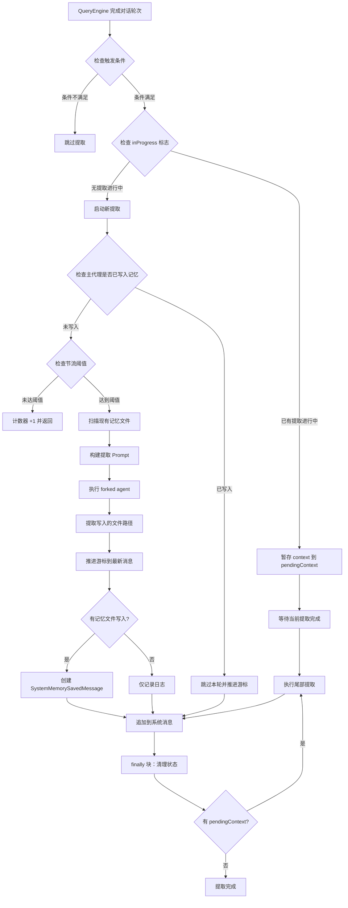

Claude Code 的 **内存自动提取系统**（extractMemories）是一个智能化的上下文持久化机制，通过后台代理（forked agent）在每次对话轮次结束时自动识别并保存跨会话有价值的信息。该系统采用**四类型分类法**（user、feedback、project、reference），将非推导性知识存储为结构化的 Markdown 文件，实现对话经验的持续积累与复用。

## 架构概览与设计哲学

extractMemories 系统遵循**最小干预原则**：仅在主代理未显式保存记忆时触发，避免重复工作。系统通过**完美分叉模式**（perfect fork）与主对话共享 prompt cache，在后台异步执行提取任务，对用户体验零阻塞。记忆存储采用**语义组织**而非时间顺序，通过 MEMORY.md 索引文件和类型化 frontmatter 实现高效检索与上下文注入。

### 核心设计决策

**闭包作用域状态管理**：所有可变状态（游标位置、重叠防护、待处理上下文）封装在 `initExtractMemories()` 创建的闭包中，避免模块级变量污染，支持测试环境的独立初始化。提取器返回的 Promise 被追踪在 `inFlightExtractions` 集合中，确保会话退出前所有后台任务完成。

**互斥执行策略**：通过 `inProgress` 标志防止重叠提取，新到达的请求通过 `pendingContext` 暂存，当前提取完成后执行**尾部提取**（trailing run）。尾部提取相对于已推进的游标计算 `newMessageCount`，仅处理两次调用间新增的消息，避免重复处理。

**游标推进机制**：`lastMemoryMessageUuid` 记录上次处理的消息 UUID，每次提取仅分析增量消息。若主代理已通过 Write/Edit 工具写入记忆文件（通过 `hasMemoryWritesSince` 检测），系统跳过本轮提取并推进游标，实现主代理与后台代理的**互斥覆盖**。

Sources: [extractMemories.ts](src/services/extractMemories/extractMemories.ts#L1-L111)

## 触发时机与执行流程

extractMemories 在 **QueryEngine 的停止钩子阶段**触发，位于 `handleStopHooks` 函数中。当模型产生最终响应（无工具调用）时，系统异步启动提取任务，与 prompt suggestion、auto-dream 等后台任务并行执行。

### 执行流程图



### 触发条件检查

```typescript
// 仅主代理触发，子代理跳过
if (context.toolUseContext.agentId) return;

// Feature gate 检查（tengu_passport_quail）
if (!getFeatureValue_CACHED_MAY_BE_STALE('tengu_passport_quail', false)) return;

// 自动记忆功能必须启用
if (!isAutoMemoryEnabled()) return;

// 远程模式跳过
if (getIsRemoteMode()) return;
```

**节流机制**：通过 `tengu_bramble_lintel` feature flag 控制提取频率（默认每轮提取）。`turnsSinceLastExtraction` 计数器跟踪符合条件的轮次，达到阈值后重置并执行提取。尾部提取绕过节流检查，确保已提交的工作不被丢弃。

Sources: [extractMemories.ts](src/services/extractMemories/extractMemories.ts#L527-L567), [stopHooks.ts](src/query/stopHooks.ts#L141-L153)

## Forked Agent 模式与 Prompt Cache 共享

extractMemories 使用 **runForkedAgent** 工具启动独立的查询循环，该循环与主对话共享关键缓存参数以确保 Anthropic API 的 prompt cache 命中。分叉代理继承主对话的系统提示、工具定义、模型配置和消息前缀，仅通过自定义用户消息触发记忆提取任务。

### CacheSafeParams 结构

```typescript
type CacheSafeParams = {
  systemPrompt: SystemPrompt;          // 系统提示 - 必须匹配
  userContext: { [k: string]: string }; // 用户上下文 - 影响缓存
  systemContext: { [k: string]: string }; // 系统上下文 - 影响缓存
  toolUseContext: ToolUseContext;      // 工具上下文（包含模型和工具）
  forkContextMessages: Message[];      // 父上下文消息
};
```

**关键约束**：分叉代理不能修改 `maxOutputTokens`，因为这会通过 `budget_tokens` 的调整改变 thinking 配置，而 thinking 配置是缓存键的一部分。`skipCacheWrite` 标志用于一次性分叉（如 speculative 工作），避免为无未来读取的前缀写入缓存条目。

### 分叉代理执行参数

```typescript
const result = await runForkedAgent({
  promptMessages: [createUserMessage({ content: userPrompt })],
  cacheSafeParams,
  canUseTool,                    // 沙箱化的权限检查
  querySource: 'extract_memories',
  forkLabel: 'extract_memories',
  skipTranscript: true,          // 不记录到会话转录
  maxTurns: 5,                   // 硬性上限防止验证死循环
});
```

**Turn Budget 设计**：记忆提取是轻量级任务，理想的执行路径为"读取现有文件 → 写入新记忆"（2-4 轮）。5 轮上限防止代理陷入验证循环（如反复 grep 确认模式存在），强制其专注于从对话内容中提取信息而非重新分析代码。

Sources: [extractMemories.ts](src/services/extractMemories/extractMemories.ts#L415-L427), [forkedAgent.ts](src/utils/forkedAgent.ts#L46-L113)

## 记忆类型分类法

系统采用**封闭式四类型分类**，仅捕获无法从当前项目状态推导的上下文。代码模式、架构、Git 历史和文件结构属于可推导信息，不应保存为记忆。

### 记忆类型对比表

| 类型 | 范围 | 保存时机 | 使用场景 | 示例 |
|------|------|----------|----------|------|
| **user** | 始终私有 | 学习用户角色、偏好、责任或知识时 | 工作应基于用户画像或视角调整 | "用户是数据科学家，专注可观测性/日志" |
| **feedback** | 默认私有，项目级约定时为团队 | 用户纠正方法或确认非显而易见方法时 | 避免重复提供相同指导 | "集成测试必须访问真实数据库，不使用 mock（曾有生产事故）" |
| **project** | 私有或团队，强烈偏向团队 | 学习谁在做什么、为什么、何时完成时 | 更全面理解用户请求细节和协调问题 | "2026-03-05 开始合并冻结，移动团队切发布分支" |
| **reference** | 通常团队 | 学习外部系统资源及其用途时 | 用户引用外部系统或信息可能在其中时 | "管道 Bug 在 Linear 项目 INGEST 中跟踪" |

### 记忆内容结构

**feedback 和 project 类型**要求特定结构以提供上下文：

```markdown
---
name: Integration Test Policy
description: Tests must hit real database, no mocks
type: feedback
---

Integration tests must hit a real database, not mocks.

**Why:** Prior incident where mock/prod divergence masked a broken migration.

**How to apply:** All database-interacting tests should use the test database instance.
```

**Why** 部分提供用户给出的理由（通常是过去事件或强烈偏好），**How to apply** 部分说明指导何时/何地生效。知道"为什么"让未来的代理判断边缘情况，而非盲目遵循规则。

Sources: [memoryTypes.ts](src/memdir/memoryTypes.ts#L14-L105)

## 记忆文件持久化机制

记忆以 **Markdown 文件**形式存储在项目作用域的目录中，路径结构为 `~/.claude/projects/<sanitized-cwd>/memory/`。每个记忆独占一个文件，通过 **MEMORY.md 索引文件**组织，索引条目限制为单行、~150 字符，确保加载效率。

### 文件路径解析

```typescript
// 基础目录优先级
export function getMemoryBaseDir(): string {
  if (process.env.CLAUDE_CODE_REMOTE_MEMORY_DIR) {
    return process.env.CLAUDE_CODE_REMOTE_MEMORY_DIR; // CCR 显式覆盖
  }
  return getClaudeConfigHomeDir(); // ~/.claude
}

// 项目作用域路径
export function getAutoMemPath(): string {
  const override = getAutoMemPathOverride();  // Cowork 空间作用域覆盖
  if (override) return override;
  
  const setting = getAutoMemPathSetting();    // settings.json 用户覆盖
  if (setting) return setting;
  
  // 默认：~/.claude/projects/<sanitized-project-root>/memory/
  return computeDefaultAutoMemPath();
}
```

**安全验证**：`validateMemoryPath` 函数拒绝危险路径，包括相对路径、根目录、Windows 驱动器根、UNC 路径和包含空字节的路径。settings.json 支持 `~/` 扩展（用户友好），但拒绝裸 `~` 或 `~/..` 等会扩展到 $HOME 或祖先目录的路径。

### 索引文件截断策略

MEMORY.md 受**双重上限**约束：200 行和 25KB 字节。截断逻辑先按行截断（自然边界），再在字节上限前的最后一个换行符处截断，避免切断行中部。长行（单行超过 125 字符平均值）通过字节上限捕获，警告信息明确指出哪个上限触发。

```typescript
export function truncateEntrypointContent(raw: string): EntrypointTruncation {
  const wasLineTruncated = lineCount > MAX_ENTRYPOINT_LINES;
  const wasByteTruncated = byteCount > MAX_ENTRYPOINT_BYTES;
  
  // 先按行截断，再按字节截断
  let truncated = wasLineTruncated
    ? contentLines.slice(0, MAX_ENTRYPOINT_LINES).join('\n')
    : trimmed;
  
  if (truncated.length > MAX_ENTRYPOINT_BYTES) {
    const cutAt = truncated.lastIndexOf('\n', MAX_ENTRYPOINT_BYTES);
    truncated = truncated.slice(0, cutAt > 0 ? cutAt : MAX_ENTRYPOINT_BYTES);
  }
  
  // 添加警告并说明原因
  return {
    content: truncated + `\n\n> WARNING: ${ENTRYPOINT_NAME} is ${reason}...`,
    lineCount, byteCount, wasLineTruncated, wasByteTruncated,
  };
}
```

Sources: [paths.ts](src/memdir/paths.ts#L30-L186), [memdir.ts](src/memdir/memdir.ts#L57-L103)

## 工具权限沙箱

extractMemories 的分叉代理运行在**严格权限沙箱**中，通过 `createAutoMemCanUseTool` 函数限制工具访问。沙箱设计遵循**最小权限原则**：允许只读操作和记忆目录内的写入，拒绝所有其他修改。

### 权限矩阵

| 工具 | 权限 | 条件 |
|------|------|------|
| **FILE_READ** | ✅ 允许 | 无限制 |
| **GREP** | ✅ 允许 | 无限制 |
| **GLOB** | ✅ 允许 | 无限制 |
| **BASH** | ✅ 允许 | 仅 `isReadOnly` 命令 |
| **FILE_EDIT** | ✅ 允许 | 仅 `isAutoMemPath(file_path)` |
| **FILE_WRITE** | ✅ 允许 | 仅 `isAutoMemPath(file_path)` |
| **REPL** | ✅ 允许 | 内部操作重新调用此检查 |
| **其他工具** | ❌ 拒绝 | - |

### REPL 工具的特殊处理

当 REPL 模式启用（ant-default）时，原始工具从工具列表隐藏，分叉代理调用 REPL 代替。REPL 的 VM 上下文为每个内部原始操作重新调用 `canUseTool`，因此底层的 Read/Bash/Edit/Write 检查仍然有效。这种设计避免了为分叉提供不同工具列表（工具列表是缓存键的一部分），保持了 prompt cache 共享。

```typescript
export function createAutoMemCanUseTool(memoryDir: string): CanUseToolFn {
  return async (tool: Tool, input: Record<string, unknown>) => {
    // REPL 特殊处理
    if (tool.name === REPL_TOOL_NAME) {
      return { behavior: 'allow' as const, updatedInput: input };
    }
    
    // 只读工具无限制
    if ([FILE_READ_TOOL_NAME, GREP_TOOL_NAME, GLOB_TOOL_NAME].includes(tool.name)) {
      return { behavior: 'allow' as const, updatedInput: input };
    }
    
    // Bash 仅允许只读命令
    if (tool.name === BASH_TOOL_NAME) {
      const parsed = tool.inputSchema.safeParse(input);
      if (parsed.success && tool.isReadOnly(parsed.data)) {
        return { behavior: 'allow' as const, updatedInput: input };
      }
      return denyAutoMemTool(tool, 'Only read-only shell commands permitted');
    }
    
    // Edit/Write 仅允许记忆目录内
    if ([FILE_EDIT_TOOL_NAME, FILE_WRITE_TOOL_NAME].includes(tool.name)) {
      if (typeof input.file_path === 'string' && isAutoMemPath(input.file_path)) {
        return { behavior: 'allow' as const, updatedInput: input };
      }
    }
    
    return denyAutoMemTool(tool, 'Only memory-directory operations allowed');
  };
}
```

**拒绝日志**：每次工具拒绝记录到 `tengu_auto_mem_tool_denied` 事件，包含工具名称，用于监控沙箱有效性。

Sources: [extractMemories.ts](src/services/extractMemories/extractMemories.ts#L154-L222)

## 团队记忆集成

当 `TEAMMEM` feature 启用且 `isTeamMemoryEnabled()` 返回 true 时，系统支持**双层记忆架构**：私有记忆（`memory/`）和团队记忆（`memory/team/`）。每个目录拥有独立的 MEMORY.md 索引，系统提示同时加载两个索引。

### 团队记忆路径结构

```typescript
// 团队记忆目录：memory/team/
export function getTeamMemPath(): string {
  return (join(getAutoMemPath(), 'team') + sep).normalize('NFC');
}

// 团队记忆索引：memory/team/MEMORY.md
export function getTeamMemEntrypoint(): string {
  return join(getAutoMemPath(), 'team', 'MEMORY.md');
}
```

### 提取 Prompt 差异

**Combined 模式**（auto + team）的提取 Prompt 在每个类型块中包含 `<scope>` 标签，指导代理选择私有或团队目录。**Individual 模式**（仅 auto）移除所有 scope 相关文本和团队/私有限定符。

| 模式 | Prompt 部分 | scope 标签 | 目录选择 |
|------|-------------|-----------|----------|
| **Individual** | TYPES_SECTION_INDIVIDUAL | ❌ 无 | 单一 memory/ |
| **Combined** | TYPES_SECTION_COMBINED | ✅ 有 | memory/ 或 memory/team/ |

**敏感数据防护**：Combined 模式的 Prompt 添加额外警告："You MUST avoid saving sensitive data within shared team memories. For example, never save API keys or user credentials."

Sources: [teamMemPaths.ts](src/memdir/teamMemPaths.ts#L73-L94), [prompts.ts](src/services/extractMemories/prompts.ts#L50-L154)

## 性能优化与监控

### 现有记忆预注入

提取代理启动前，系统通过 `scanMemoryFiles` 扫描记忆目录并格式化为清单，预注入到 Prompt 中。这避免了代理花费一轮执行 `ls` 命令，直接进入读取和写入阶段。

```typescript
const existingMemories = formatMemoryManifest(
  await scanMemoryFiles(memoryDir, createAbortController().signal)
);

const userPrompt = teamMemoryEnabled
  ? buildExtractCombinedPrompt(newMessageCount, existingMemories, skipIndex)
  : buildExtractAutoOnlyPrompt(newMessageCount, existingMemories, skipIndex);
```

**扫描优化**：`scanMemoryFiles` 使用 `readFileInRange` 在单次读取中获取内容和 mtime，避免单独的 stat 调用。对于常见情况（N ≤ 200），这减半了系统调用次数；对于大 N，读取少量额外小文件仍避免了双重点击。

### 缓存命中率监控

提取完成后，系统计算 prompt cache 命中率并记录到调试日志：

```typescript
const totalInput = result.totalUsage.input_tokens +
  result.totalUsage.cache_creation_input_tokens +
  result.totalUsage.cache_read_input_tokens;
const hitPct = totalInput > 0
  ? (result.totalUsage.cache_read_input_tokens / totalInput * 100).toFixed(1)
  : '0.0';

logForDebugging(
  `[extractMemories] finished — ${writtenPaths.length} files written, ` +
  `cache: read=${result.totalUsage.cache_read_input_tokens} ` +
  `create=${result.totalUsage.cache_creation_input_tokens} ` +
  `input=${result.totalUsage.input_tokens} (${hitPct}% hit)`
);
```

### 分析事件追踪

系统记录多个分析事件以监控提取行为：

| 事件名称 | 触发时机 | 关键指标 |
|----------|----------|----------|
| `tengu_extract_memories_extraction` | 提取完成 | input_tokens, output_tokens, cache_read, files_written, memories_saved, duration_ms |
| `tengu_extract_memories_skipped_direct_write` | 主代理已写入 | message_count |
| `tengu_extract_memories_coalesced` | 请求被合并 | - |
| `tengu_extract_memories_error` | 提取失败 | duration_ms |
| `tengu_auto_mem_tool_denied` | 工具被拒绝 | tool_name |

Sources: [extractMemories.ts](src/services/extractMemories/extractMemories.ts#L398-L486), [memoryScan.ts](src/memdir/memoryScan.ts#L35-L94)

## 记忆访问与召回策略

记忆系统在**系统提示构建阶段**加载，通过 `loadMemoryPrompt` 函数将 MEMORY.md 内容注入用户上下文。代理根据对话相关性主动访问记忆，或在用户明确要求时强制访问。

### 召回时机指导

**WHEN_TO_ACCESS_SECTION** 定义了记忆访问的触发条件：

1. **相关性触发**：记忆似乎相关，或用户引用之前对话的工作
2. **强制触发**：用户明确要求检查、回忆或记住某事
3. **忽略指令**：用户说"忽略"或"不使用"记忆时，视 MEMORY.md 为空，不应用、引用或提及记忆内容

### 记忆漂移警示

系统强调记忆是**时间点快照**，可能过时。`TRUSTING_RECALL_SECTION` 指导代理在推荐前验证：

- 如果记忆命名文件路径：检查文件是否存在
- 如果记忆命名函数或标志：grep 搜索它
- 如果用户即将基于推荐行动（非仅询问历史）：先验证

**核心原则**："记忆说 X 存在" ≠ "X 现在存在"。记忆总结的仓库状态（活动日志、架构快照）是时间冻结的；用户询问"最近"或"当前"状态时，优先使用 `git log` 或读取代码。

Sources: [memoryTypes.ts](src/memdir/memoryTypes.ts#L216-L256), [memdir.ts](src/memdir/memdir.ts#L243-L266)

## 与其他持久化机制的关系

记忆系统是 Claude Code 多种持久化机制之一，各有适用场景：

| 机制 | 作用域 | 使用场景 | 生命周期 |
|------|--------|----------|----------|
| **Memory** | 跨会话 | 用户画像、行为指导、项目上下文 | 持久 |
| **Plan** | 单会话 | 非平凡实现任务的对齐 | 会话内 |
| **Tasks** | 单会话 | 工作分解、进度跟踪 | 会话内 |
| **CLAUDE.md** | 项目级 | 代码约定、架构文档 | 项目持续 |

**关键区别**：记忆用于跨会话有用的信息，而非仅当前会话。当需要与用户对齐实现方法时使用 Plan；当需要分解工作或跟踪进度时使用 Tasks；当代码模式、架构、项目结构需要文档化时使用 CLAUDE.md（记忆的 WHAT_NOT_TO_SAVE_SECTION 明确排除这些）。

Sources: [memdir.ts](src/memdir/memdir.ts#L254-L261)

## 总结

extractMemories 系统通过**自动化、类型化、语义化**的记忆提取，实现了对话经验的持续积累。其架构设计平衡了**性能**（prompt cache 共享、预注入、节流）、**安全性**（工具沙箱、路径验证、敏感数据防护）和**可靠性**（互斥执行、游标推进、尾部提取）。四类型分类法确保记忆捕获不可推导的上下文，而非重复代码库中已存在的信息。

系统与 Claude Code 的其他持久化机制（Plan、Tasks、CLAUDE.md）协同工作，共同构成完整的上下文管理解决方案。通过严格的记忆边界定义（what NOT to save）和召回验证指导（trusting recall），系统避免了记忆污染和过时信息误导，确保了长期使用的有效性。

---

**延伸阅读**：
- [QueryEngine：LLM 查询循环与工具调度核心](5-queryengine-llm-cha-xun-xun-huan-yu-gong-ju-diao-du-he-xin) — 理解 stopHooks 的触发时机
- [AppState 设计：React 状态管理与订阅机制](12-appstate-she-ji-react-zhuang-tai-guan-li-yu-ding-yue-ji-zhi) — 记忆在应用状态中的位置
- [会话持久化：sessionStorage 与对话恢复](14-hui-hua-chi-jiu-hua-sessionstorage-yu-dui-hua-hui-fu) — 记忆与会话存储的交互
- [多代理协调：Coordinator 模式与团队协作](37-duo-dai-li-xie-diao-coordinator-mo-shi-yu-tuan-dui-xie-zuo) — 团队记忆在多代理场景的应用