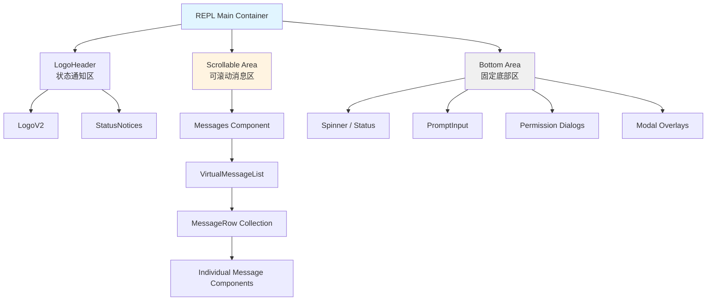
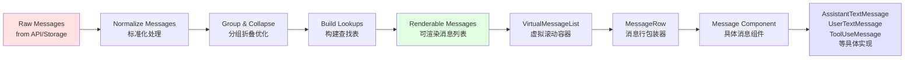
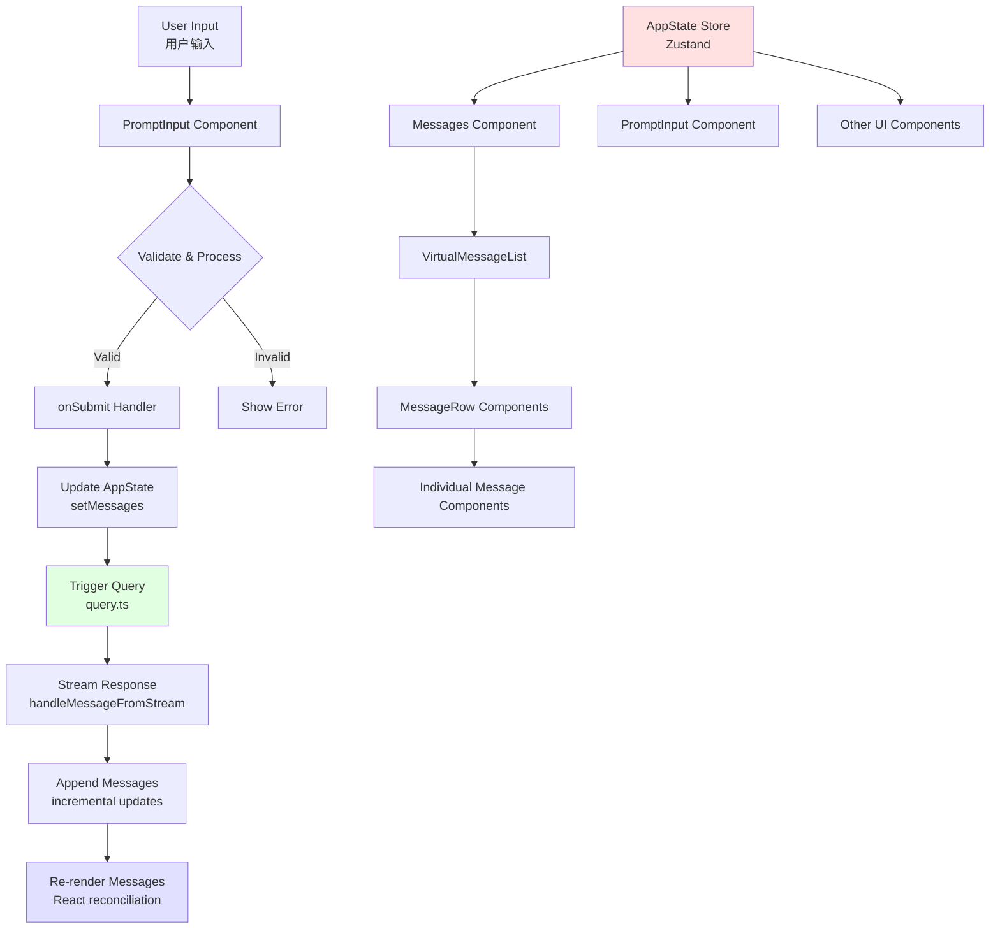
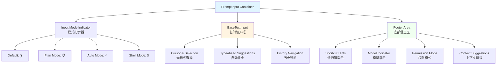
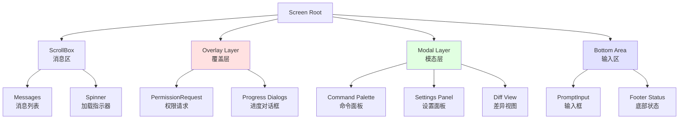

REPL 主界面是 Claude Code 的核心交互界面，负责将 LLM 对话、工具执行结果、用户输入等复杂内容组织成清晰、响应式的终端界面。该界面采用 **React + Ink** 框架构建，通过**分层布局架构**和**虚拟滚动技术**实现高性能的消息渲染，同时支持**全屏模式**与**传统终端模式**的智能切换。

## 屏幕组织架构：三段式布局设计

REPL 主界面采用经典的三段式布局：顶部 Logo/状态区、中部可滚动消息区、底部输入/控制区。这种设计在有限终端空间内最大化信息展示效率，同时保持用户输入的可见性和即时响应。

**核心布局组件** `FullscreenLayout` 将屏幕分为两个关键区域：`scrollable`（可滚动内容）和 `bottom`（固定底部）。在全屏模式下，`scrollable` 区域通过 `ScrollBox` 组件实现虚拟滚动，支持数千条消息的高效渲染；`bottom` 区域则保持固定高度，确保用户输入和关键控制元素始终可见。这种分离设计避免了滚动时输入框的抖动，同时为模态对话框（如权限请求、命令面板）预留了浮动层空间。布局还支持 `overlay`（覆盖层）和 `modal`（模态层）两个可选插槽，用于在消息区上方显示临时性 UI，例如权限请求对话框或斜杠命令面板。

Sources: [FullscreenLayout.tsx](src/components/FullscreenLayout.tsx#L31-L67)

### 全屏模式 vs 传统模式

Claude Code 支持两种终端渲染模式，通过环境变量 `isFullscreenEnvEnabled()` 动态切换：

| 模式 | 滚动机制 | 布局容器 | 适用场景 |
|------|---------|---------|---------|
| **全屏模式** | Ink `ScrollBox` 虚拟滚动 | `AlternateScreen` + `FullscreenLayout` | 现代终端（支持 ANSI 转义序列），提供完整的 UI 体验 |
| **传统模式** | 原生终端滚动条 | 简化布局，`height="100%"` | 兼容旧终端、管道输出、日志记录场景 |

全屏模式启用时，REPL 组件会被包裹在 `AlternateScreen` 组件中，该组件利用终端的备用屏幕缓冲区，退出时自动恢复原始终端内容。这种设计确保了 Claude Code 的交互不会污染用户的终端历史记录，同时支持复杂的 UI 元素如粘性头部、浮动按钮等。传统模式则回退到简单的垂直布局，依赖终端原生滚动功能，适用于不支持高级 ANSI 控制序列的环境或需要将输出重定向到文件的场景。

Sources: [REPL.tsx](src/screens/REPL.tsx#L4999-L5004), [FullscreenLayout.tsx](src/components/FullscreenLayout.tsx#L69-L103)

### 粘性提示符头部

当用户向上滚动查看历史消息时，REPL 界面会在顶部显示一个**粘性提示符头部**，展示当前可见区域最近的用户输入文本。这一功能通过 `VirtualMessageList` 中的 `StickyTracker` 组件实现，它监听滚动位置变化，动态计算并更新粘性头部内容，确保用户在浏览长对话时始终清楚当前上下文的起始点。

粘性头部的工作流程如下：`StickyTracker` 在每次滚动事件中，从当前可见的消息列表中逆向查找最近一条真实用户输入（排除工具结果、系统消息等），提取其文本内容并截断到 500 字符以内（避免超大粘贴内容占用过多头部空间）。提取的文本通过 `ScrollChromeContext` 上下文传递给 `FullscreenLayout`，后者在 `ScrollBox` 上方渲染一个固定位置的 `<Box>` 元素，使用 `overflow: hidden` 样式确保长文本被截断为单行显示。用户点击粘性头部时，界面会自动滚动回输入框位置，实现快速导航。

Sources: [VirtualMessageList.tsx](src/components/VirtualMessageList.tsx#L32-L150), [FullscreenLayout.tsx](src/components/FullscreenLayout.tsx#L26-L30)

## 消息渲染管道：从数据到 UI 的转化流程

消息渲染是 REPL 界面的核心功能，涉及从原始消息数据到可视化组件的完整转换管道。该管道包括**消息标准化**、**分组与折叠**、**组件映射**、**虚拟滚动** 四个关键阶段，每个阶段都经过精心优化以确保高性能和可维护性。

**消息标准化**阶段由 `normalizeMessages` 函数处理，它将 API 返回的原始消息格式转换为统一的 `NormalizedMessage` 类型，为每条消息分配稳定的 UUID、处理时间戳、提取内容块等。标准化后的消息进入**分组与折叠**阶段，系统通过 `applyGrouping`、`collapseReadSearchGroups`、`collapseHookSummaries` 等函数，将连续的文件读取、搜索操作合并为单个 `collapsed_read_search` 消息，将后台 Bash 执行通知合并为 `grouped_tool_use` 消息，显著减少 UI 中的消息数量，提升可读性。

Sources: [Messages.tsx](src/components/Messages.tsx#L1-L46)

### 消息类型与组件映射

REPL 界面支持多种消息类型，每种类型对应特定的 React 组件进行渲染。`Message` 组件作为分发器，根据消息的 `type` 字段路由到相应的具体实现：

| 消息类型 | 组件 | 渲染内容 | 特殊处理 |
|---------|------|---------|---------|
| `user` | `UserTextMessage` / `UserImageMessage` / `UserToolResultMessage` | 用户输入文本、图片、工具结果 | 支持多内容块（文本 + 图片） |
| `assistant` | `AssistantTextMessage` / `AssistantThinkingMessage` / `AssistantToolUseMessage` | 助手回复、思考过程、工具调用 | 流式渲染支持，实时更新 |
| `attachment` | `AttachmentMessage` | 文件附件、命令队列 | 区分真实附件与内部命令 |
| `system` | `SystemTextMessage` / `CompactBoundaryMessage` | 系统通知、压缩边界标记 | 低优先级，可折叠 |
| `grouped_tool_use` | `GroupedToolUseContent` | 合并的工具调用组 | 可展开查看详情 |
| `collapsed_read_search` | `CollapsedReadSearchContent` | 折叠的文件读取/搜索操作 | 显示摘要统计 |

`Message` 组件的核心逻辑是一个大型 `switch` 语句，根据 `message.type` 分发到对应的子组件。每个子组件接收标准化的 props：`message`（消息数据）、`lookups`（查找表，包含工具结果映射等）、`tools`（工具定义）、`verbose`（详细模式标志）等。这种设计确保了组件间的解耦，新增消息类型只需扩展 `switch` 语句并实现对应的组件，无需修改核心渲染逻辑。

Sources: [Message.tsx](src/components/Message.tsx#L32-L100)

### 虚拟滚动：大规模消息列表的性能优化

对于长对话（可能包含数千条消息），直接渲染所有消息会导致严重的性能问题。REPL 界面通过 **虚拟滚动技术** 解决这一挑战：`VirtualMessageList` 组件只渲染当前可见区域的消息（加上少量缓冲区），滚动时动态卸载不可见消息并加载新消息，保持 DOM 节点数量稳定。

虚拟滚动的核心是 `useVirtualScroll` Hook，它维护三个关键状态：`scrollTop`（当前滚动位置）、`viewportHeight`（可见区域高度）、`heightCache`（每条消息的预估高度）。基于这些状态，Hook 计算出当前应该渲染的消息索引范围 `[startIndex, endIndex]`，并通过 `itemKey` 函数为每条消息生成稳定的 React key，确保列表更新时的正确 diff 算法。高度缓存采用**指数退避策略**：首次渲染使用默认高度（3 行），实际渲染后测量真实高度并更新缓存，后续滚动时利用缓存值进行快速估算。

Sources: [VirtualMessageList.tsx](src/components/VirtualMessageList.tsx#L69-L113), [useVirtualScroll.ts](src/hooks/useVirtualScroll.ts)

### 消息查找表：加速工具结果关联

在渲染助手消息中的工具调用时，系统需要快速查找对应的工具结果（可能在后续的 `user` 消息中）。`buildMessageLookups` 函数构建了一个高效的数据结构，包含 `toolUseToResult`（工具调用 ID → 工具结果消息）、`toolResultToUse`（工具结果 → 工具调用）等映射表，以及 `progressMessages`（进度消息索引）。

查找表的构建是一次性 O(n) 扫描，后续访问为 O(1)。具体流程如下：遍历所有消息，遇到 `assistant` 消息中的 `tool_use` 块时，记录其 ID 到临时映射；遇到 `user` 消息中的 `tool_result` 块时，通过 `tool_use_id` 关联到之前的工具调用。构建完成后，`AssistantToolUseMessage` 组件可以直接通过 `lookups.toolUseToResult.get(toolUseID)` 获取结果，无需在每次渲染时重新遍历整个消息列表。对于流式渲染场景，查找表会随着新消息的到达动态更新，确保工具调用与结果的实时关联。

Sources: [messages.ts](src/utils/messages.ts)

## 状态管理与数据流：从用户输入到界面更新

REPL 界面的状态管理采用 **集中式状态存储 + 局部状态** 的混合模式。`AppState` 通过 `AppStateStore`（基于 Zustand）管理全局状态，包括消息列表、工具权限上下文、当前模型、UI 标志等；局部状态如输入框内容、滚动位置、对话框可见性则由各组件内部管理。

**用户输入流程**从 `PromptInput` 组件开始：用户键入文本后，内容存储在组件的局部状态 `inputValue` 中，支持实时预览、自动补全、语法高亮等功能。按下回车键触发 `onSubmit` 回调，该回调在 `REPL.tsx` 中定义，负责验证输入、处理引用（如 `@file`）、创建用户消息对象，并通过 `setMessages` 更新全局状态。新消息立即触发 React 的重新渲染，`Messages` 组件接收更新后的消息列表，通过虚拟滚动渲染到屏幕。

**流式响应处理**是状态管理的难点：助手回复以流式方式到达，每个 token 或内容块都需要实时更新 UI。`handleMessageFromStream` 函数处理流式数据，它维护一个"当前助手消息"的临时状态，每次接收到新内容时，通过 `setMessages(prev => [...prev.slice(0, -1), updatedMessage])` 替换最后一条消息（避免创建新数组导致整个列表重新渲染）。流式渲染还涉及 `inProgressToolUseIDs` 状态，用于标识正在执行的工具调用，为其显示加载动画。流式结束后，最终消息被持久化到 `sessionStorage`，支持会话恢复。

Sources: [REPL.tsx](src/screens/REPL.tsx#L4500-L4570), [handlePromptSubmit.ts](src/utils/handlePromptSubmit.ts), [AppState.tsx](src/state/AppState.tsx)

### 消息去重与增量更新

在流式渲染和会话恢复场景中，消息列表可能面临重复或顺序混乱的问题。REPL 采用 **UUID 去重** 策略：每条消息在标准化时分配唯一 UUID，`setMessages` 更新时通过 UUID 识别重复项，保留最新的版本。对于增量更新（如流式追加内容），系统使用 **不可变更新模式**：`setMessages(prev => [...prev, newMessage])` 或 `setMessages(prev => prev.map(m => m.uuid === targetUUID ? updated : m))`，确保 React 的 `key` 属性稳定，优化 diff 性能。

增量更新还涉及 **延迟值** 优化：`REPL.tsx` 中使用 `useDeferredValue` 创建 `deferredMessages`，在流式渲染期间降低消息列表的更新优先级，优先保证输入框的响应性。当流式结束或用户停止输入时，系统切换到同步渲染模式（`usesSyncMessages`），立即显示最新消息，避免延迟导致的视觉卡顿。这种策略在长对话中尤为关键，确保了 UI 的流畅性。

Sources: [REPL.tsx](src/screens/REPL.tsx#L4500-L4520)

## 用户输入组件：PromptInput 的多功能设计

`PromptInput` 组件是 REPL 界面的用户输入入口，不仅支持基本的文本输入，还集成了**多模式切换**、**自动补全**、**历史搜索**、**引用解析** 等高级功能。组件采用**分层架构**：底层是 `BaseTextInput`（处理原始键盘输入），中层是输入模式管理（如 Vim 模式、Shell 模式），顶层是 UI 装饰（提示符、快捷键提示、状态指示器）。

**输入模式系统**是 PromptInput 的核心特性之一。组件支持多种模式：`default`（普通对话）、`plan`（计划模式，限制工具调用）、`auto`（自动执行，减少确认）、`shell`（直接执行 Bash 命令）。模式通过 `inputMode` 状态管理，用户可通过快捷键（如 `Ctrl+P` 切换计划模式）或特殊前缀（如 `!` 进入 Shell 模式）切换。每种模式在输入框左侧显示不同的提示符（❯、📋、⚡、$），并在底部状态栏显示当前模式的说明和可用操作。

**自动补全系统**通过 `useTypeahead` Hook 实现，支持多种补全源：斜杠命令（`/help`）、文件路径（`@src/file.ts`）、MCP 资源（`#resource`）、历史命令等。Hook 监听输入变化，基于光标位置提取当前单词，查询相应的补全源，并渲染一个浮动菜单供用户选择。补全菜单支持键盘导航（上下箭头、Tab 键确认、Esc 键关闭）和模糊匹配，极大提升了输入效率。对于文件路径补全，系统还支持**目录扫描**和**缓存**，避免重复的文件系统访问。

Sources: [PromptInput.tsx](src/components/PromptInput/PromptInput.tsx#L1-L100), [useTypeahead.tsx](src/hooks/useTypeahead.tsx)

### 历史搜索与引用解析

`PromptInput` 集成了**历史命令搜索**功能，通过 `useHistorySearch` Hook 实现。用户按下 `Ctrl+R` 后，界面显示搜索对话框，支持增量搜索（每键入一个字符立即过滤结果）、正则表达式匹配、时间范围筛选等。搜索结果通过 `HistorySearchDialog` 组件渲染，用户选择后自动填充到输入框，避免重复输入相似命令。

**引用解析**是另一个关键功能，支持用户在输入中引用外部资源：`@file.ts` 引用文件内容、`#image.png` 引用图片、`&skill` 引用技能等。`parseReferences` 函数扫描输入文本，识别引用模式，并通过异步操作加载引用内容。加载完成后，引用被转换为 `ImageBlockParam` 或 `TextBlockParam`，附加到最终的用户消息中。引用解析还支持**错误处理**：如果文件不存在或图片格式不支持，系统显示友好的错误提示，而不是静默失败。

Sources: [useHistorySearch.ts](src/hooks/useHistorySearch.ts), [history.ts](src/history.ts)

## 模态对话框系统：临时 UI 的管理

REPL 界面中的许多交互通过**模态对话框**实现，如权限请求、命令面板、设置面板等。这些对话框采用**分层渲染**策略：底层是主界面（可滚动消息区），中层是 `overlay`（覆盖层，如权限对话框），顶层是 `modal`（模态层，如斜杠命令面板）。`FullscreenLayout` 组件通过 `overlay` 和 `modal` props 接收这些内容，并在相应的层级渲染。

**权限请求对话框**是最常见的模态 UI，当助手尝试执行需要用户确认的操作时（如写入文件、执行 Bash 命令），系统创建 `ToolUseConfirm` 对象并加入队列，`PermissionRequest` 组件渲染对话框，显示操作详情（工具名称、参数、风险评估），用户选择允许或拒绝后，结果通过回调传递给工具执行引擎。权限对话框支持**批量操作**：用户可选择"始终允许此类操作"，将权限规则持久化到设置文件。

**命令面板**（如 `/config`、`/theme`）通过 `toolJSX` 状态管理：当用户执行斜杠命令时，命令返回一个 JSX 元素，REPL 将其赋值给 `toolJSX` 状态，触发重新渲染。`FullscreenLayout` 检测到 `toolJSX` 后，根据命令类型（`isImmediate` 标志）决定渲染位置：立即型命令（如 `/btw`）渲染在底部区域，非立即型命令（如 `/diff`）渲染在模态层，覆盖整个消息区。命令面板通常包含自己的 `ScrollBox`，支持内部滚动而不影响主消息列表。

Sources: [FullscreenLayout.tsx](src/components/FullscreenLayout.tsx#L31-L67), [PermissionRequest.tsx](src/components/permissions/PermissionRequest.tsx)

### 对话框焦点管理与键盘导航

模态对话框激活时，需要捕获所有键盘输入，避免与主界面的快捷键冲突。REPL 通过 **焦点上下文** 实现这一机制：`ModalContext` 提供一个 `isModalActive` 标志，对话框组件将其设置为 `true`，全局键盘处理器（如 `ScrollKeybindingHandler`、`CancelRequestHandler`）检测到该标志后，禁用自身的快捷键。对话框内部则注册自己的键盘处理器，处理特定快捷键（如 `Esc` 关闭对话框、`Enter` 确认操作）。

对于复杂的对话框（如命令面板），系统还支持**嵌套焦点**：外层对话框可以打开内层对话框（如 `/mcp` 命令中打开服务器配置对话框），内层对话框获得焦点，外层对话框的键盘处理器被禁用。关闭内层对话框后，焦点自动返回外层。这种设计通过**焦点栈**实现：每次打开对话框时，将当前焦点状态压入栈；关闭时，弹出栈顶恢复焦点。焦点栈还支持**焦点陷阱**，确保 Tab 键循环在对话框内部，不会意外聚焦到背景元素。

Sources: [modalContext.tsx](src/context/modalContext.tsx), [overlayContext.tsx](src/context/overlayContext.tsx)

## 性能优化策略：保持流畅的用户体验

REPL 界面面临严峻的性能挑战：长对话可能包含数千条消息，每条消息可能包含复杂的 UI（代码高亮、差异视图、图片等），流式渲染需要每秒更新数十次。为保持流畅的用户体验，系统实施了多层优化策略：**虚拟滚动**、**React.memo 缓存**、**延迟渲染**、**离屏冻结** 等。

**虚拟滚动**（如前所述）是最关键的优化，将渲染复杂度从 O(n) 降低到 O(viewport)。**React.memo 缓存**应用于所有消息组件：`Message`、`MessageRow`、`AssistantTextMessage` 等都包裹在 `React.memo` 中，只有当 props 发生变化时才重新渲染。对于复杂的组件（如 `HighlightedCode`），还使用了 **useMemo** 缓存计算密集型的结果（如语法高亮），避免每次渲染重复计算。

**延迟渲染**通过 `useDeferredValue` 和 `useDeferredHookMessages` 实现：在流式渲染期间，消息列表的更新被标记为低优先级，React 会优先处理用户输入（如键盘事件、鼠标点击），在空闲时再更新消息列表。这确保了输入框的即时响应，即使在高速流式输出时也不会卡顿。流式结束后，系统立即切换到同步渲染，消除延迟。

**离屏冻结**通过 `OffscreenFreeze` 组件实现：对于不可见的消息（在虚拟滚动缓冲区之外），组件渲染一个占位符（空 `<Box>`），避免执行复杂的渲染逻辑。当消息进入可见区域时，`OffscreenFreeze` 自动解冻，渲染完整内容。这对于包含大量代码块或差异视图的消息尤为重要，显著减少了初始渲染时间和内存占用。

Sources: [VirtualMessageList.tsx](src/components/VirtualMessageList.tsx), [MessageRow.tsx](src/components/MessageRow.tsx#L93-L150), [OffscreenFreeze.tsx](src/components/OffscreenFreeze.tsx), [useDeferredHookMessages.ts](src/hooks/useDeferredHookMessages.ts)

### 编译器优化与代码分割

REPL 界面的代码库非常庞大（`REPL.tsx` 单文件超过 5000 行），为避免启动时的性能瓶颈，系统采用了 **Bun bundle 特性开关** 和 **动态导入**。许多功能通过 `feature('FEATURE_NAME')` 条件编译，在不支持的环境中完全移除相关代码（如 `VOICE_MODE`、`WEB_BROWSER_TOOL`）。大型组件（如 `WebBrowserPanel`）通过 `require()` 动态加载，只有在实际使用时才执行导入。

React Compiler 的应用进一步提升了性能：组件使用 `const $ = _c(n)` 编译器运行时，自动缓存计算结果和子组件。编译器通过静态分析，识别可以安全的跳过重新渲染的组件，减少不必要的 diff 计算。对于复杂的组件（如 `MessageRow`），编译器生成的缓存逻辑比手动 `React.memo` 更精细，支持部分 props 变化时只更新受影响的子树。

Sources: [REPL.tsx](src/screens/REPL.tsx#L96-L120)

## 下一步探索

本文档深入解析了 REPL 主界面的屏幕组织与消息渲染机制，涵盖了布局架构、消息渲染管道、状态管理、用户输入处理、模态对话框系统以及性能优化策略。要继续深入理解 Claude Code 的 UI 与交互系统，建议阅读以下相关文档：

- **[Ink 框架集成：React 终端渲染引擎](29-ink-kuang-jia-ji-cheng-react-zhong-duan-xuan-ran-yin-qing)**：了解 Ink 如何将 React 组件渲染到终端，包括布局算法、事件处理、ANSI 转义序列生成等底层机制
- **[消息组件：Message、MessageRow 与虚拟滚动](30-xiao-xi-zu-jian-message-messagerow-yu-xu-ni-gun-dong)**：深入分析各类消息组件的实现细节，包括文本消息、工具调用、差异视图等的渲染逻辑
- **[PromptInput：用户输入处理与模式切换](31-promptinput-yong-hu-shu-ru-chu-li-yu-mo-shi-qie-huan)**：详细探讨输入组件的高级功能，如自动补全、历史搜索、引用解析、Vim 模式等
- **[键盘绑定系统：快捷键配置与匹配](32-jian-pan-bang-ding-xi-tong-kuai-jie-jian-pei-zhi-yu-pi-pei)**：了解全局和上下文相关的快捷键系统，支持用户自定义键绑定
- **[权限请求对话框：PermissionRequest 组件](34-quan-xian-qing-qiu-dui-hua-kuang-permissionrequest-zu-jian)**：分析权限请求的 UI 交互流程，包括风险评估展示、批量操作、持久化规则等

通过掌握这些组件的协作机制，您将能够深入理解 Claude Code 如何在终端环境中构建复杂、高效、用户友好的交互界面，为扩展功能或调试问题打下坚实基础。