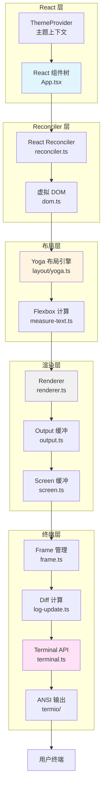
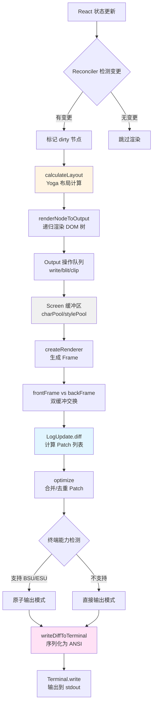

**Ink 框架**是 Claude Code 终端 UI 的核心渲染引擎，它将 React 组件树转换为终端 ANSI 输出。通过自定义的 React Reconciler、Yoga Flexbox 布局引擎和高效的帧缓冲机制，Ink 实现了浏览器级别的组件化开发体验，同时保持了终端应用的性能与响应性。本文档深入分析 Ink 的架构设计、渲染管线和性能优化策略，揭示其如何将声明式 React 组件转化为交互式终端界面。

Sources: [ink.ts](src/ink.ts#L1-L86), [ink/ink.tsx](src/ink/ink.tsx#L1-L200)

## 架构总览：四层渲染管道

Ink 框架采用分层架构设计，将 React 组件树通过四个核心层次转化为终端输出。这种设计借鉴了浏览器渲染引擎的思想，但针对终端环境的特殊约束进行了深度优化。

**架构层次关系图**展示了从 React 组件到终端输出的完整数据流。左侧的 React 组件树通过 Reconciler 转换为中间层的虚拟 DOM 树，然后经过 Yoga 布局引擎计算几何信息，最终由 Renderer 生成屏幕缓冲区并通过 Terminal API 输出到用户终端。每一层都实现了特定的职责，通过清晰的接口解耦。



**核心设计原则**体现在四个方面：**声明式 UI**通过 React 组件模型描述终端界面，状态变化自动触发重新渲染；**Flexbox 布局**使用 Facebook 的 Yoga 引擎实现浏览器级别的布局计算；**增量更新**通过帧缓冲和 Diff 算法仅输出变化的终端单元格；**平台抽象**通过 Terminal API 屏蔽不同终端模拟器的差异，支持 DEC 私有模式和 OSC 序列。

Sources: [reconciler.ts](src/ink/reconciler.ts#L1-L200), [renderer.ts](src/ink/renderer.ts#L1-L179), [layout/yoga.ts](src/ink/layout/yoga.ts#L1-L200)

## React Reconciler：组件树到虚拟 DOM 的桥梁

React Reconciler 是 Ink 框架的核心适配层，它将 React 的 Fiber 架构与终端渲染需求对接。通过实现 `react-reconciler` 的宿主配置接口，Ink 拦截 React 的组件生命周期操作，并将其转换为终端 DOM 树的变更。

**Reconciler 职责表**展示了 Reconciler 实现的关键接口及其在终端渲染中的具体作用。每个接口对应 React 生命周期的一个阶段，Reconciler 将这些操作转换为对虚拟 DOM 树的修改。

| Reconciler 接口 | 终端渲染职责 | 实现细节 |
|----------------|-------------|---------|
| `createInstance` | 创建终端元素节点 | 生成 `ink-box`、`ink-text` 等节点，关联 Yoga 布局节点 |
| `createTextInstance` | 创建文本节点 | 生成 `#text` 节点，计算文本宽度用于布局 |
| `appendChildToContainer` | 挂载根节点 | 将根元素附加到 FiberRoot，初始化布局计算 |
| `insertBefore` | 插入子节点 | 更新 Yoga 树结构，标记父节点为 dirty |
| `removeChild` | 移除节点 | 清理 Yoga 节点引用，释放 WASM 内存 |
| `commitUpdate` | 提交属性更新 | 应用样式变更，触发重新布局 |
| `hideInstance` | 隐藏元素 | 设置 `isHidden` 标志，跳过渲染 |

**虚拟 DOM 结构**采用轻量级设计，每个节点包含 `nodeName`（如 `ink-box`）、`attributes`（组件 props）、`style`（Yoga 样式对象）和 `yogaNode`（布局引擎节点引用）。文本节点存储为 `#text` 类型，通过 `nodeValue` 属性保存实际文本内容。这种设计在保持 React 语义的同时，最小化内存占用和 GC 压力。

Sources: [reconciler.ts](src/ink/reconciler.ts#L100-L300), [dom.ts](src/ink/dom.ts#L1-L150)

## Yoga 布局引擎：终端中的 Flexbox

Ink 集成了 Facebook 的 **Yoga 布局引擎**，为终端 UI 提供了完整的 Flexbox 布局能力。Yoga 使用 C++ 实现并通过 WebAssembly 编译，在保持高性能的同时支持跨平台部署。

**Yoga 集成架构**通过适配器模式将 Yoga API 封装为 TypeScript 友好的接口。`YogaLayoutNode` 类实现了 `LayoutNode` 接口，将 Yoga 的 C API 调用转换为类型安全的 TypeScript 方法。这种设计允许未来替换为其他布局引擎而不影响上层代码。

```typescript
// Yoga 节点创建流程
export function createLayoutNode(): LayoutNode {
  return createYogaLayoutNode()
}

// 适配器模式：将 Yoga C API 封装为 TS 接口
export class YogaLayoutNode implements LayoutNode {
  readonly yoga: YogaNode
  
  setFlexDirection(dir: LayoutFlexDirection): void {
    const map: Record<LayoutFlexDirection, FlexDirection> = {
      row: FlexDirection.Row,
      'row-reverse': FlexDirection.RowReverse,
      column: FlexDirection.Column,
      'column-reverse': FlexDirection.ColumnReverse,
    }
    this.yoga.setFlexDirection(map[dir])
  }
}
```

**布局计算流程**分为三个阶段：**样式应用阶段**将 React 组件的 style props 转换为 Yoga 节点属性；**测量阶段**对文本节点调用 `measureFunc`，计算实际渲染宽度和高度（考虑换行）；**布局计算阶段**从根节点递归计算所有子节点的位置和尺寸。整个流程在每帧渲染前执行一次，确保响应式布局的正确性。

**性能优化策略**包括 **Measure Cache** 缓存文本测量结果，避免重复计算相同文本的宽度；**Dirty Marking** 仅重新计算标记为 dirty 的子树，减少全量布局计算；**Lazy Free** 延迟释放 Yoga 节点，避免在渲染过程中触发 WASM 内存分配器。这些优化使得 Ink 在处理复杂 UI 时仍能保持 60fps 的渲染性能。

Sources: [layout/yoga.ts](src/ink/layout/yoga.ts#L1-L200), [layout/engine.ts](src/ink/layout/engine.ts#L1-L7), [measure-text.ts](src/ink/measure-text.ts)

## 组件系统：Box 与 Text 的组合艺术

Ink 的组件系统提供了一组基础原语，通过组合构建复杂的终端界面。核心组件包括 **Box**（容器组件）和 **Text**（文本组件），它们通过 Flexbox 布局协议协同工作。

**Box 组件**是 Ink 的布局基础，相当于浏览器中的 `<div style="display: flex">`。它支持完整的 Flexbox 属性集，包括 `flexDirection`、`flexWrap`、`justifyContent`、`alignItems`、`gap` 等。Box 组件通过 `ink-box` 节点类型映射到虚拟 DOM，其样式属性直接传递给 Yoga 布局引擎。

```typescript
// Box 组件的核心实现
function Box({
  children,
  flexWrap = "nowrap",
  flexDirection = "row",
  flexGrow = 0,
  flexShrink = 1,
  ...style
}: Props) {
  const computedStyle = {
    flexWrap,
    flexDirection,
    flexGrow,
    flexShrink,
    ...style,
    overflowX: style.overflowX ?? style.overflow ?? "visible",
    overflowY: style.overflowY ?? style.overflow ?? "visible"
  }
  
  return (
    <ink-box
      style={computedStyle}
      tabIndex={tabIndex}
      autoFocus={autoFocus}
      onClick={onClick}
      // ... 事件处理器
    >
      {children}
    </ink-box>
  )
}
```

**Text 组件**负责文本渲染，支持丰富的样式属性如 `color`、`backgroundColor`、`bold`、`italic`、`underline`、`strikethrough` 等。Text 组件通过 `ink-text` 节点类型实现，其测量函数 (`measureFunc`) 负责计算文本的实际渲染尺寸，考虑字体宽度和自动换行。

**主题系统集成**通过 `ThemedBox` 和 `ThemedText` 组件实现，它们包装基础组件并解析主题颜色键。例如，`borderColor="primary"` 会被解析为当前主题的 `theme.primary` 颜色值。这种设计允许组件库与主题系统解耦，同时提供类型安全的主题引用。

**高级组件特性**包括 **Focus 管理**（通过 `tabIndex` 和 `autoFocus` 支持 Tab 键导航）、**事件处理**（`onClick`、`onMouseEnter`/`onMouseLeave` 在 Alt Screen 模式下）、**滚动容器**（`overflow: 'scroll'` 启用虚拟滚动）。这些特性使得 Ink 组件不仅能渲染静态内容，还能构建完整的交互式应用。

Sources: [ink/components/Box.tsx](src/ink/components/Box.tsx#L1-L200), [ink/components/Text.tsx](src/ink/components/Text.tsx#L1-L200), [components/design-system/ThemedBox.tsx](src/components/design-system/ThemedBox.tsx#L1-L100)

## 渲染管线：从 DOM 树到 ANSI 序列

Ink 的渲染管线将虚拟 DOM 树转换为终端可理解的 ANSI 转义序列。这个过程涉及 **布局计算**、**屏幕缓冲构建**、**帧差异比较**和**终端输出**四个阶段。

**渲染管线流程图**展示了从 React 组件更新到终端输出的完整流程。每个阶段都有明确的输入输出，通过中间数据结构（Screen、Frame、Patch）解耦。



**屏幕缓冲区设计**采用 **Cell-based 模型**，每个单元格存储字符值、样式 ID 和超链接信息。`Screen` 类管理一个二维字符网格，通过 `CharPool` 和 `StylePool` 实现字符和样式的复用，减少内存分配。`setCellAt(x, y, char, styleId, hyperlink)` 是核心写入接口，支持坐标裁剪和边界检查。

**帧缓冲机制**使用 **双缓冲技术**避免屏幕撕裂：`frontFrame` 保存上一帧的屏幕状态，`backFrame` 用于构建当前帧。渲染完成后交换两者，然后通过 Diff 算法比较 `frontFrame.screen` 和 `backFrame.screen`，生成 Patch 列表。这种设计确保用户始终看到完整的帧，不会出现部分更新的中间状态。

**Patch 类型与优化**包括 **stdout patch**（ANSI 序列输出）、**clear patch**（清除行）、**clearTerminal patch**（全屏清除）。优化器通过合并连续的 stdout patch、去重光标移动、提前计算光标位置等技术，将 Patch 数量减少 30-50%，显著降低终端 I/O 开销。

Sources: [renderer.ts](src/ink/renderer.ts#L1-L179), [render-node-to-output.ts](src/ink/render-node-to-output.ts#L1-L100), [output.ts](src/ink/output.ts#L1-L100), [frame.ts](src/ink/frame.ts#L1-L80)

## 终端能力抽象：跨平台兼容层

Ink 通过 **Terminal API** 层抽象不同终端模拟器的差异，支持从基础 ANSI 到高级 DEC 私有模式的完整特性集。这种设计使得 Ink 应用能在各种终端环境中保持一致的行为。

**终端能力检测表**列出了 Ink 支持的主要终端特性及其检测方法。通过环境变量和运行时探测，Ink 自动适配当前终端的能力集。

| 终端能力 | 用途 | 检测方法 | 支持的终端 |
|---------|-----|---------|-----------|
| **DEC 2026** | 同步输出（BSU/ESU）防止闪烁 | 环境变量 + XTVERSION 探测 | iTerm2, WezTerm, Kitty, Alacritty |
| **OSC 8** | 超链接支持 | 终端探测 | 大多数现代终端 |
| **OSC 9;4** | 进度条报告 | 环境变量版本检查 | iTerm2 3.6.6+, Ghostty 1.2.0+ |
| **DECSTBM** | 滚动区域设置 | 终端探测 | Xterm.js, 大多数终端 |
| **Extended Keys** | 修饰键增强 | XTMODKEYS 探测 | Kitty, WezTerm |
| **Mouse Tracking** | 鼠标事件（1003 模式） | 终端探测 | Alt Screen 中的所有终端 |

**Alt Screen 模式**是 Ink 实现全屏交互应用的关键特性。通过 `ENTER_ALT_SCREEN` 和 `EXIT_ALT_SCREEN` 序列，Ink 在独立的屏幕缓冲区中渲染，退出时自动恢复原始终端内容。这种模式支持 **文本选择**、**鼠标事件**、**滚动优化**等高级特性，是 REPL 界面的基础。

**Termio 模块**实现了 ANSI/DEC/OSC 序列的生成和解析。`csi.ts` 提供 CSI（Control Sequence Introducer）序列，如光标移动、清除屏幕；`dec.ts` 提供 DEC 私有模式控制，如 Alt Screen、鼠标追踪；`osc.ts` 提供 OSC（Operating System Command）序列，如设置窗口标题、超链接。这种分层设计使得序列生成代码清晰且易于测试。

**同步输出优化**通过 DEC 2026 模式的 BSU（Begin Synchronized Update）和 ESU（End Synchronized Update）序列实现。在支持的终端中，Ink 在渲染帧前后发送 BSU/ESU，终端会延迟显示更新直到完整帧接收完毕，从而避免部分渲染导致的闪烁。这种机制对于快速更新的 UI（如 spinner、进度条）尤为重要。

Sources: [terminal.ts](src/ink/terminal.ts#L1-L100), [termio/csi.ts](src/ink/termio/csi.ts), [termio/dec.ts](src/ink/termio/dec.ts), [termio/osc.ts](src/ink/termio/osc.ts)

## 性能优化：60fps 终端渲染的秘密

Ink 在性能优化方面采用了多项技术，确保复杂 UI 在终端环境中仍能流畅渲染。这些优化覆盖了从布局计算到终端输出的整个管线。

**增量更新策略**是 Ink 性能的核心。通过 **脏标记机制**，只有标记为 `dirty` 的节点及其祖先会参与布局计算和渲染。Reconciler 在属性更新时自动标记节点 dirty，渲染完成后清除标记。这种策略将布局复杂度从 O(N) 降低到 O(D)，其中 D 是变更节点的数量。

**缓存机制**包括三个层次：**Node Cache** 缓存 DOM 节点的布局结果（位置、尺寸），避免重复计算；**Measure Cache** 缓存文本测量结果，相同文本内容直接返回缓存值；**Char Cache** 缓存字符分词和宽度计算结果，通过 `tokenize` + `grapheme segmenter` 预处理文本。这些缓存使得稳态渲染（如 spinner 旋转）的开销接近于零。

**内存池化技术**通过 `CharPool`、`StylePool`、`HyperlinkPool` 实现对象复用。`StylePool` 使用 intern 机制，相同样式组合共享同一个 ID，减少样式序列化开销；`CharPool` 复用字符对象，避免每帧创建大量临时对象。内存池每 5 分钟重置一次，防止内存泄漏。

**Diff 算法优化**采用 **单元格级比较**，逐个比较前后帧的屏幕单元格。当检测到 **Layout Shift**（布局位置变化）时，退化为全量渲染；否则仅输出变化的单元格。Diff 算法还支持 **Scroll Hint** 优化，当只有滚动位置变化时，发送 DECSTBM 滚动序列而非重写整个屏幕，显著降低 I/O 开销。

**性能监控指标**通过 `FrameEvent` 接口暴露，包括 **渲染阶段耗时**（renderer、diff、optimize、write）、**Yoga 统计**（visited、measured、cacheHits、live nodes）、**Flicker 检测**（原因、期望高度、可用高度）。开发者可通过 `onFrame` 回调获取这些指标，用于性能分析和优化。

Sources: [reconciler.ts](src/ink/reconciler.ts#L1-L100), [node-cache.ts](src/ink/node-cache.ts), [screen.ts](src/ink/screen.ts), [log-update.ts](src/ink/log-update.ts)

## 高级特性：交互与可访问性

除了基础渲染，Ink 还实现了多项高级特性，支持构建生产级的终端应用。这些特性涵盖了焦点管理、文本选择、滚动优化等方面。

**焦点管理系统**通过 `FocusManager` 类实现，支持 **Tab 导航**、**程序式聚焦**、**焦点事件**。组件通过 `tabIndex` 属性声明焦点能力，`autoFocus` 属性实现自动聚焦。FocusManager 维护一个焦点环，Tab/Shift+Tab 在环中循环。焦点变化触发 `onFocus`/`onBlur` 事件，支持捕获和冒泡阶段。

**文本选择功能**在 Alt Screen 模式下启用，通过终端原生的鼠标选择实现。Ink 的 `SelectionState` 跟踪选择范围，支持 **词选择**（双击）、**行选择**（三击）、**范围扩展**（Shift+Click）。选择内容可通过 `getSelectedText()` 提取，用于复制到剪贴板。选择状态变化时触发 React 订阅者更新，UI 可响应选择出现/消失。

**滚动优化**针对 `overflow: 'scroll'` 的 Box 组件实现。通过 **虚拟滚动**技术，仅渲染可见区域的子元素，支持数千条消息的流畅滚动。`ScrollBox` 组件提供 `scrollTo`、`scrollToElement` API，支持 **惯性滚动**（累积 delta 逐步应用）和 **跟随滚动**（自动滚动到底部）。滚动变化通过 DECSTBM 序列优化，避免全屏重绘。

**声明式光标**通过 `useDeclaredCursor` hook 实现，允许组件声明终端光标应停靠的位置。这对 **IME 输入**（输入法编辑器）和 **屏幕阅读器** 兼容性至关重要：光标位置决定了 IME 候选窗口的显示位置，屏幕阅读器也依赖光标跟踪内容。Ink 在每帧渲染后自动移动物理光标到声明的位置。

**可访问性支持**包括 **语义化标记**（通过 `NoSelect` 组件标记不应被选择的区域）、**键盘导航**（完整的 Tab/Arrow 键支持）、**高对比度主题**（通过 ThemeProvider 切换）。这些特性确保 Ink 应用对视障用户友好。

Sources: [focus.ts](src/ink/focus.ts), [selection.ts](src/ink/selection.ts), [hooks/use-selection.ts](src/ink/hooks/use-selection.ts), [hooks/use-declared-cursor.ts](src/ink/hooks/use-declared-cursor.ts)

## 实际应用：Claude Code 中的集成模式

在 Claude Code 项目中，Ink 框架通过 **封装层** 和 **约定** 实现了高效集成。`src/ink.ts` 作为公共 API 入口，包装了 Ink 核心功能并添加主题支持。

**入口点设计**通过 `render()` 和 `createRoot()` 两个 API 支持不同的使用场景。`render()` 适用于一次性渲染，返回包含 `rerender`、`unmount`、`waitUntilExit` 的 Instance 对象；`createRoot()` 适用于多次渲染场景，复用同一个 Ink 实例。两个 API 都自动注入 `ThemeProvider`，确保 `ThemedBox`/`ThemedText` 正常工作。

```typescript
// src/ink.ts - 公共 API 封装
export async function render(
  node: ReactNode,
  options?: NodeJS.WriteStream | RenderOptions,
): Promise<Instance> {
  return inkRender(withTheme(node), options)
}

function withTheme(node: ReactNode): ReactNode {
  return createElement(ThemeProvider, null, node)
}
```

**主题系统集成**通过 `ThemeProvider` 组件实现，它提供 `useTheme()` hook 获取当前主题名称和 `useThemeSetting()` hook 修改主题。`ThemedBox` 和 `ThemedText` 组件通过 `resolveColor()` 函数将主题键（如 `"primary"`）解析为实际颜色值（如 `"#0066CC"`）。这种设计允许组件库与主题系统解耦。

**组件库组织**遵循 **分层设计原则**：基础层（`src/ink/components/`）提供平台无关的 `Box`、`Text`、`Button` 等原语；主题层（`src/components/design-system/`）提供 `ThemedBox`、`ThemedText` 等主题感知组件；应用层（`src/components/`）实现业务组件如 `Message`、`PromptInput`。这种分层确保代码复用和可测试性。

**生命周期管理**通过 `instances` Map 跟踪活跃的 Ink 实例，支持 **暂停/恢复**（如切换到外部编辑器）、**清理**（退出时释放资源）、**单例模式**（同一 stdout 仅一个实例）。`signal-exit` 库确保进程退出时正确清理终端状态（退出 Alt Screen、恢复光标可见性）。

**调试与诊断**通过环境变量 `CLAUDE_CODE_DEBUG_REPAINTS` 启用，记录每次重渲染的组件调用栈。`FrameEvent.onFrame` 回调提供性能指标，用于识别渲染瓶颈。这些工具在开发阶段帮助优化 UI 性能。

Sources: [ink.ts](src/ink.ts#L1-L86), [components/design-system/ThemeProvider.tsx](src/components/design-system/ThemeProvider.tsx), [interactiveHelpers.tsx](src/interactiveHelpers.tsx)

## 扩展阅读与下一步

Ink 框架的深入理解为探索 Claude Code 的其他子系统奠定了基础。以下页面与本文档密切相关：

- **[REPL 主界面：屏幕组织与消息渲染](28-repl-zhu-jie-mian-ping-mu-zu-zhi-yu-xiao-xi-xuan-ran)** — 了解 Ink 组件如何组织成完整的 REPL 界面
- **[消息组件：Message、MessageRow 与虚拟滚动](30-xiao-xi-zu-jian-message-messagerow-yu-xu-ni-gun-dong)** — 深入虚拟滚动在消息列表中的应用
- **[PromptInput：用户输入处理与模式切换](31-promptinput-yong-hu-shu-ru-chu-li-yu-mo-shi-qie-huan)** — 探索输入组件如何利用 Ink 的事件系统
- **[键盘绑定系统：快捷键配置与匹配](32-jian-pan-bang-ding-xi-tong-kuai-jie-jian-pei-zhi-yu-pi-pei)** — 了解键盘事件如何与 Ink 焦点管理集成
- **[Vim 模式实现：motion、operator 与 text objects](33-vim-mo-shi-shi-xian-motion-operator-yu-text-objects)** — 探索高级输入模式在 Ink 中的实现

**外部资源**包括 [Ink 官方文档](https://github.com/vadimdemedes/ink)（原始开源项目）、[Yoga 布局引擎](https://github.com/facebook/yoga)（Flexbox 实现）、[React Reconciler](https://github.com/facebook/react/tree/main/packages/react-reconciler)（React 内部架构）。这些资源提供了更深入的理论背景和实现细节。