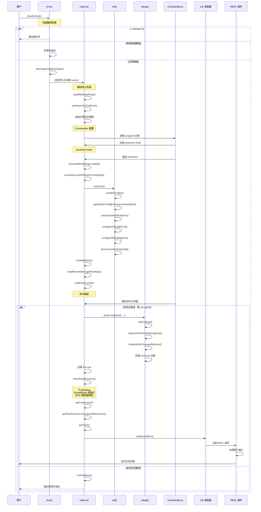
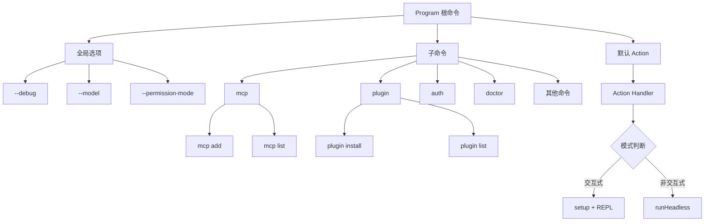

本文档深入剖析 Claude Code CLI 的启动机制，从入口文件 `cli.tsx` 到主逻辑 `main.tsx`，再到最终的 REPL 界面渲染。理解这一流程有助于开发者把握整个应用的架构脉络，为后续深入模块分析奠定基础。

## 入口点架构：三层启动体系

Claude Code 采用精心设计的三层入口点架构，通过 **快速路径优化** 和 **延迟加载策略** 实现毫秒级的启动响应。这一设计确保了常用命令（如 `--version`）几乎零开销执行，而完整功能仅在需要时才加载。

### 第一层：Bootstrap 入口 (cli.tsx)

`entrypoints/cli.tsx` 是整个 CLI 的最外层入口，负责处理快速路径和特性开关判定。该文件的核心策略是 **最小化模块加载** —— 对于简单命令（如版本查询），直接返回而不加载任何重型依赖。

Sources: [cli.tsx](src/entrypoints/cli.tsx#L33-L42)

```typescript
// Fast-path for --version/-v: zero module loading needed
if (args.length === 1 && (args[0] === '--version' || args[0] === '-v')) {
  console.log(`${MACRO.VERSION} (Claude Code)`);
  return;
}
```

快速路径还包括：
- **`--dump-system-prompt`**：输出系统提示词（仅限 Ant 内部）
- **`--claude-in-chrome-mcp`** 和 **`--chrome-native-host`**：Chrome 集成模式
- **`remote-control`/`rc`/`bridge`**：远程控制模式（需要特性开关）
- **`daemon`**：长期运行的后台守护进程
- **`ps`/`logs`/`attach`/`kill`**：后台会话管理命令
- **`new`/`list`/`reply`**：模板任务命令（特性开关控制）

这些快速路径通过 **特性开关** 和 **条件编译** 实现 Dead Code Elimination（DCE），确保外部构建版本不包含 Ant 专用的功能代码。

Sources: [cli.tsx](src/entrypoints/cli.tsx#L53-L162)

### 第二层：主逻辑入口

当快速路径都不匹配时，`cli.tsx` 会动态导入 `main.tsx` 并调用其导出的 `main()` 函数。`main.tsx` 是整个应用的核心协调器，负责：

1. **预启动优化**：在模块导入阶段并行启动 MDM 配置读取和 Keychain 预取
2. **环境准备**：配置全局警告处理器、检测调试模式
3. **迁移执行**：运行版本迁移脚本（如模型名称迁移）
4. **命令注册**：通过 Commander.js 构建完整的命令行接口
5. **初始化协调**：调用 `init()` 函数完成系统初始化

Sources: [main.tsx](src/main.tsx#L1-L209)

### 第三层：初始化模块

`entrypoints/init.ts` 提供了 `init()` 函数，这是应用启动的 **通用初始化阶段**。该函数通过 `memoize` 包装，确保整个应用生命周期内只执行一次。初始化流程包括：

- **配置系统启用**：调用 `enableConfigs()` 激活配置读取
- **安全环境变量应用**：仅应用非危险的环境变量（完整应用在信任对话框之后）
- **优雅退出设置**：注册 SIGINT/SIGTERM 处理器
- **网络配置**：配置 mTLS、代理、CA 证书
- **远程设置加载**：异步加载企业策略限制和远程管理设置
- **API 预连接**：提前建立与 Anthropic API 的 TCP+TLS 连接

Sources: [init.ts](src/entrypoints/init.ts#L57-L160)

## 启动流程时序图

以下 Mermaid 时序图展示了从命令行输入到 REPL 界面渲染的完整流程：



Sources: [cli.tsx](src/entrypoints/cli.tsx#L287-L298), [main.tsx](src/main.tsx#L907-L967), [init.ts](src/entrypoints/init.ts#L57-L200)

## 初始化阶段详解

### Phase 1: 模块导入期优化

`main.tsx` 在模块导入阶段启动了三个关键的后台任务，这些任务通过 **副作用导入** 触发，与后续的模块加载并行执行：

1. **MDM 配置预读** (`startMdmRawRead()`)：在 macOS 上读取 MDM 配置文件（`plutil`）和 Windows 注册表查询
2. **Keychain 预取** (`startKeychainPrefetch()`)：并行读取 OAuth 令牌和旧版 API 密钥
3. **性能分析检查点** (`profileCheckpoint('main_tsx_entry')`)：记录启动时间戳

这种设计的精妙之处在于：当 `main()` 函数被调用时，这些后台任务已经运行了约 135ms（模块加载时间），从而将原本串行的启动延迟转化为并行操作。

Sources: [main.tsx](src/main.tsx#L1-L20)

### Phase 2: 环境检测与客户端类型识别

`main()` 函数首先检测运行环境，确定客户端类型（`clientType`）和交互模式（`isInteractive`）。客户端类型包括：

| 客户端类型 | 判定条件 | 用途 |
|-----------|---------|------|
| `cli` | 默认类型 | 标准 CLI 使用 |
| `github-action` | `GITHUB_ACTIONS=true` | GitHub Actions 集成 |
| `sdk-typescript` | `CLAUDE_CODE_ENTRYPOINT=sdk-ts` | TypeScript SDK |
| `sdk-python` | `CLAUDE_CODE_ENTRYPOINT=sdk-py` | Python SDK |
| `claude-vscode` | `CLAUDE_CODE_ENTRYPOINT=claude-vscode` | VSCode 扩展 |
| `claude-desktop` | `CLAUDE_CODE_ENTRYPOINT=claude-desktop` | Claude Desktop |
| `remote` | 存在会话访问令牌 | 远程会话 |
| `local-agent` | `CLAUDE_CODE_ENTRYPOINT=local-agent` | 本地代理 |

交互模式通过检测 `-p/--print`、`--init-only`、`--sdk-url` 标志或 `!process.stdout.isTTY` 来判定。

Sources: [main.tsx](src/main.tsx#L800-L855)

### Phase 3: Commander.js 命令注册

`run()` 函数创建了 Commander.js 的 `program` 实例，并配置了 **preAction hook** 作为初始化的统一入口点。这种设计避免了在不同命令处理函数中重复初始化逻辑。

PreAction hook 的执行顺序：
1. **等待预读完成**：`ensureMdmSettingsLoaded()` 和 `ensureKeychainPrefetchCompleted()`
2. **执行 init()**：完成通用初始化
3. **设置进程标题**：`process.title = 'claude'`
4. **附加日志汇**：`initSinks()` 确保事件日志正常输出
5. **处理 --plugin-dir**：注册内联插件
6. **运行迁移**：执行版本迁移脚本
7. **加载远程设置**：异步加载企业策略和设置同步

Sources: [main.tsx](src/main.tsx#L907-L967)

### Phase 4: 交互式会话初始化

对于交互式会话，系统会调用 `setup()` 函数完成工作目录准备、Git 检测、Worktree 创建等操作。随后通过 `showSetupScreens()` 显示一系列设置对话框：

1. **Onboarding**：首次使用引导（仅当未完成时显示）
2. **TrustDialog**：工作区信任确认（检测 CLAUDE.md 外部包含）
3. **GrowthBook 初始化**：重置并初始化特性开关系统
4. **MCP 服务器审批**：处理 `mcp.json` 中的服务器配置
5. **ClaudeMd 外部包含审批**：确认外部 CLAUDE.md 文件访问权限

Sources: [setup.ts](src/setup.ts#L56-L200), [interactiveHelpers.tsx](src/interactiveHelpers.tsx#L104-L171)

### Phase 5: REPL 界面渲染

最后，系统通过 `launchRepl()` 函数渲染 REPL 界面。该函数接收以下核心参数：

- **initialState**：AppState 初始状态
- **commands**：可用斜杠命令列表
- **initialTools**：初始工具集合
- **initialMessages**：初始消息（如恢复会话时的历史消息）
- **mcpClients**：MCP 客户端实例
- **remoteSessionConfig**：远程会话配置（可选）

`launchRepl()` 动态导入 `App` 和 `REPL` 组件，并调用 `renderAndRun()` 启动 Ink 渲染循环。

Sources: [replLauncher.tsx](src/replLauncher.tsx#L12-L22), [interactiveHelpers.tsx](src/interactiveHelpers.tsx#L98-L103)

## 关键架构模式

### 1. 延迟加载策略

Claude Code 广泛使用动态导入实现延迟加载：

```typescript
// 仅在需要时加载重型模块
const { bridgeMain } = await import('../bridge/bridgeMain.js');
const { daemonMain } = await import('../daemon/main.js');
```

这种策略确保了快速路径的最小化加载，同时避免了循环依赖问题。

Sources: [cli.tsx](src/entrypoints/cli.tsx#L113-L179)

### 2. 特性开关系统

通过 `bun:bundle` 的 `feature()` 函数实现编译时特性开关：

```typescript
if (feature('BRIDGE_MODE') && args[0] === 'remote-control') {
  // Bridge 模式逻辑
}
```

特性开关与 Dead Code Elimination 结合，确保外部构建版本不包含 Ant 专用功能。

Sources: [cli.tsx](src/entrypoints/cli.tsx#L112-L162)

### 3. 信任边界机制

信任对话框是 Claude Code 安全模型的核心。该机制确保：
- **非交互模式**（CI/CD）：信任是隐式的，环境变量立即应用
- **交互模式**：必须显式确认工作区信任，防止恶意代码执行

信任确认后，系统才会应用完整的环境变量（包括潜在危险的配置）。

Sources: [interactiveHelpers.tsx](src/interactiveHelpers.tsx#L125-L184)

### 4. 并行预取优化

启动过程中的关键优化包括：
- **MDM/Keychain 预取**：在模块导入期并行执行
- **API 预连接**：提前建立 TCP+TLS 连接（100-200ms）
- **延迟预取**：`startDeferredPrefetches()` 在首次渲染后执行非关键任务

这些优化通过 **CPU 和 I/O 重叠** 显著降低了启动延迟。

Sources: [main.tsx](src/main.tsx#L388-L445), [init.ts](src/entrypoints/init.ts#L153-L159)

## 命令注册机制

Commander.js 的命令注册采用 **分层次注册** 策略：



每个子命令通过动态导入加载其处理函数，确保根命令的快速解析。

Sources: [main.tsx](src/main.tsx#L884-L1000)

## 迁移系统

Claude Code 包含版本迁移系统，用于处理配置格式变更和模型名称更新。当前迁移版本为 `CURRENT_MIGRATION_VERSION = 11`，包括：

- `migrateAutoUpdatesToSettings()`：自动更新设置迁移
- `migrateBypassPermissionsAcceptedToSettings()`：权限绕过设置迁移
- `migrateSonnet1mToSonnet45()`、`migrateSonnet45ToSonnet46()`：模型名称迁移
- `migrateFennecToOpus()`：Ant 专用迁移

迁移系统通过 **幂等性检查** 确保重复执行不会造成副作用。

Sources: [main.tsx](src/main.tsx#L326-L352)

## 核心文件清单

以下表格总结了 CLI 启动流程中的关键文件及其职责：

| 文件路径 | 核心职责 | 关键函数 |
|---------|---------|---------|
| `src/entrypoints/cli.tsx` | Bootstrap 入口、快速路径处理 | `main()` |
| `src/main.tsx` | 主逻辑协调器 | `main()`, `run()`, `runMigrations()` |
| `src/entrypoints/init.ts` | 通用初始化 | `init()` |
| `src/setup.ts` | 工作目录设置 | `setup()` |
| `src/interactiveHelpers.tsx` | UI 辅助函数 | `showSetupScreens()`, `renderAndRun()` |
| `src/replLauncher.tsx` | REPL 启动器 | `launchRepl()` |
| `src/screens/REPL.tsx` | REPL 主界面组件 | `REPL` 组件 |
| `src/components/App.tsx` | 应用根组件 | `App` 组件 |
| `src/bootstrap/state.ts` | 全局状态管理 | Session/Model/CWD 状态 |

Sources: [cli.tsx](src/entrypoints/cli.tsx), [main.tsx](src/main.tsx), [init.ts](src/entrypoints/init.ts), [setup.ts](src/setup.ts), [replLauncher.tsx](src/replLauncher.tsx)

## 性能优化要点

### 启动性能追踪

Claude Code 使用 `startupProfiler` 模块记录关键时间点：

```typescript
profileCheckpoint('main_tsx_entry');
profileCheckpoint('main_tsx_imports_loaded');
profileCheckpoint('run_function_start');
profileCheckpoint('preAction_after_init');
```

这些检查点通过环境变量 `CLAUDE_CODE_PROFILE_STARTUP=1` 激活，用于分析启动性能瓶颈。

Sources: [main.tsx](src/main.tsx#L12-L209)

### 早期输入捕获

`startCapturingEarlyInput()` 机制在模块加载期间捕获用户输入，避免在快速输入场景下丢失字符。这对于快速命令执行（如 `claude -p "prompt"`）尤为重要。

Sources: [cli.tsx](src/entrypoints/cli.tsx#L289-L291)

## 下一步阅读建议

理解 CLI 启动流程后，建议按以下顺序深入探索：

- **[QueryEngine：LLM 查询循环与工具调度核心](5-queryengine-llm-cha-xun-xun-huan-yu-gong-ju-diao-du-he-xin)**：了解初始化后的查询处理机制
- **[工具系统架构：从 Tool 接口到 40+ 工具实现](6-gong-ju-xi-tong-jia-gou-cong-tool-jie-kou-dao-40-gong-ju-shi-xian)**：深入工具注册与执行流程
- **[命令系统设计：50+ 斜杠命令的组织与注册](7-ming-ling-xi-tong-she-ji-50-xie-gang-ming-ling-de-zu-zhi-yu-zhu-ce)**：探索斜杠命令的注册机制
- **[AppState 设计：React 状态管理与订阅机制](12-appstate-she-ji-react-zhuang-tai-guan-li-yu-ding-yue-ji-zhi)**：理解 REPL 界面的状态管理
- **[权限模式系统：default、plan、auto、bypass 等模式解析](9-quan-xian-mo-shi-xi-tong-default-plan-auto-bypass-deng-mo-shi-jie-xi)**：深入了解权限控制机制

通过这些章节，您将全面掌握 Claude Code 的架构设计与实现细节。