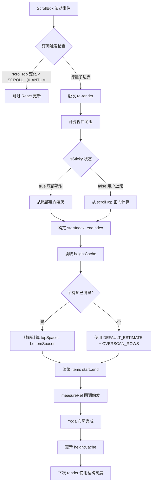

Claude Code 的消息渲染系统采用三层架构设计：Messages.tsx 作为顶层容器负责消息列表管理与优化策略，MessageRow.tsx 实现单条消息的行级渲染与交互逻辑，Message.tsx 作为底层组件负责具体内容块的类型分发与渲染。该架构的核心挑战在于平衡终端环境下的性能与可维护性 —— 单个 MessageRow 约占用 250KB 内存（React Fiber + Ink DOM + Yoga 布局），在长会话场景（2000+ 条消息）下若采用全量挂载策略将导致 500MB+ 内存占用与严重的 GC 抖动。解决方案是 `useVirtualScroll` hook 实现的 React 级虚拟化：仅渲染可视区域加上 80 行 overscan 范围内的消息，其余通过 spacer Box 维持滚动高度，将内存占用稳定在 O(viewport) 而非 O(total_messages)。

Sources: [Message.tsx](src/components/Message.tsx#L1-L100), [MessageRow.tsx](src/components/MessageRow.tsx#L1-L100), [Messages.tsx](src/components/Messages.tsx#L1-L100), [VirtualMessageList.tsx](src/components/VirtualMessageList.tsx#L1-L150), [useVirtualScroll.ts](src/hooks/useVirtualScroll.ts#L1-L150)

## 消息类型系统与数据流

消息系统的数据源是 Anthropic API 返回的 BetaMessage 对象，通过 `normalizeMessages` 函数转换为内部统一的 NormalizedMessage 类型。该转换过程实现了多项关键抽象：首先将 API 的 content block 数组按语义分组（连续的文件读取/搜索操作合并为 `collapsed_read_search` 类型），其次为每个消息派生稳定的 UUID 标识符（通过 `deriveUUID` 函数从 content hash 生成），最后构建辅助查询索引（toolUseID → message 的映射、tool_result → tool_use 的配对关系）。这些预处理使得组件层可以专注于渲染逻辑而非数据遍历。

Sources: [messages.ts](src/utils/messages.ts#L1-L150)

核心类型定义包含六个分支：

| 类型 | 来源 | 渲染组件 | 特殊处理 |
|------|------|---------|---------|
| `user` | 用户输入/工具结果 | UserTextMessage/UserToolResultMessage | 支持 `isMeta` 标记（系统注入的消息如 `/compact` 摘要） |
| `assistant` | Claude 响应 | AssistantTextMessage/AssistantToolUseMessage/AssistantThinkingMessage | content block 按类型分发到不同子组件 |
| `system` | 系统事件（权限重试、API 错误、hook 摘要） | SystemTextMessage | 根据 `level` 字段着色（info/warning/error） |
| `attachment` | 文件附件/粘贴内容 | AttachmentMessage | 区分图片与文件附件，支持缩略图渲染 |
| `grouped_tool_use` | 多个相同类型工具调用合并 | GroupedToolUseContent | 显示工具名称与调用次数，点击展开详情 |
| `collapsed_read_search` | 连续文件读取/搜索操作 | CollapsedReadSearchContent | 显示"Reading 5 files…"摘要，异步时显示 spinner |

Messages.tsx 的 `renderableMessages` 计算流程体现了多层优化策略：首先通过 `collapseReadSearchGroups` 将连续的文件读取操作（如用户输入"分析 src 目录下所有文件"触发的 50 次 FileReadTool 调用）合并为单个 `collapsed_read_search` 消息，其次通过 `collapseHookSummaries` 将 hook 执行摘要聚合，最后应用 `filterForBriefTool`（当启用 brief-only 模式时）过滤非关键内容。这些转换都在 `useMemo` 保护下执行，确保消息数组的 identity 在无关渲染中保持稳定。

Sources: [Messages.tsx](src/components/Messages.tsx#L200-L300)

## 组件层级与职责划分

**Messages.tsx** 作为顶层容器承担三重职责：消息预处理、虚拟化策略决策、以及全局状态注入。其核心渲染逻辑根据 `scrollRef` 的存在与否选择两条路径：当 `scrollRef` 存在（全屏模式）时委托给 `VirtualMessageList` 组件实现 React 级虚拟化，否则直接渲染 MessageRow 列表（此时应用 `MAX_MESSAGES_WITHOUT_VIRTUALIZATION` 容量限制，默认 2000 条消息）。该组件还负责构建 `buildMessageLookups` 返回的索引对象，包含 `toolUseIDToMessage`（通过工具调用 ID 反查消息）、`progressMessages`（进度消息分组）、`siblingToolUseIDs`（同批次工具调用集合）等辅助数据结构，这些索引通过 props 传递给子组件避免重复计算。

Sources: [Messages.tsx](src/components/Messages.tsx#L200-L300)

**MessageRow.tsx** 实现单条消息的行级封装，核心功能包括：时间戳显示（通过 `MessageTimestamp` 组件，仅在非 transcript 模式显示）、交互状态管理（点击切换 verbose 模式、悬停高亮）、以及消息内容解包。该组件的关键逻辑是 `shouldRenderStatically` 判定 —— 当消息类型为 `collapsed_read_search` 且所有工具调用已完成时，该消息被标记为静态（`isStatic=true`），从而跳过动画与实时更新逻辑，降低渲染开销。`hasContentAfterIndex` 辅助函数实现了前瞻性检查：扫描当前消息之后是否存在"真实内容"（非折叠的工具调用、非系统消息），用于决定折叠组的 spinner 是否应保持激活状态。

Sources: [MessageRow.tsx](src/components/MessageRow.tsx#L1-L200)

**Message.tsx** 是内容分发的核心枢纽，其 `MessageImpl` 函数通过 `switch (message.type)` 路由到六个主分支，每个分支进一步根据 content block 的 `type` 字段分发到具体的渲染组件。以 `assistant` 类型为例：当检测到 `content[0].type === 'thinking'` 时委托给 `AssistantThinkingMessage` 组件，`type === 'tool_use'` 时委托给 `AssistantToolUseMessage`，文本内容则由 `AssistantTextMessage` 处理。该组件使用 React Compiler 的 `_c` 缓存函数实现细粒度 memoization —— 每个条件分支的 props 变化被独立追踪，避免父组件重渲染导致的无关子组件更新。

Sources: [Message.tsx](src/components/Message.tsx#L1-L200)

## 虚拟滚动实现机制

`useVirtualScroll` hook 是性能优化的核心实现，其工作原理可通过以下流程图理解：

该 hook 的关键参数包括：`DEFAULT_ESTIMATE=3`（未测量项的预估高度，故意低估以避免过度稀疏的视口）、`OVERSCAN_ROWS=80`（上下缓冲区，用于吸收预估误差）、`SCROLL_QUANTUM=40`（滚动事件量化阈值，将频繁的 wheel 事件合并为批量更新）。核心状态包含 `range`（当前挂载的消息索引范围 `[start, end)`）、`topSpacer`/`bottomSpacer`（占位符高度）、以及 `heightCache`（通过 WeakMap 存储的已测量高度）。

Sources: [useVirtualScroll.ts](src/hooks/useVirtualScroll.ts#L1-L150), [useVirtualScroll.ts](src/hooks/useVirtualScroll.ts#L200-L350)

**滚动同步机制**通过 `useSyncExternalStore` 实现：订阅函数绑定到 ScrollBox 的 `subscribe` 方法，快照函数返回量化的 scrollTop 值（`Math.floor(scrollTop / SCROLL_QUANTUM)`），确保只有跨量子边界的滚动才触发 React 重渲染。实际的位置计算使用真实 scrollTop（而非量化值），保证滚动位置的精确性。`isSticky` 状态通过 ScrollBox 的 `isSticky()` 方法读取，该状态在用户滚动到底部、或调用 `scrollToBottom` 时设为 true，触发"尾部优先"的挂载策略 —— 从最后一项反向遍历直到覆盖 viewport + overscan，确保新消息实时可见。

Sources: [useVirtualScroll.ts](src/hooks/useVirtualScroll.ts#L200-L350)

**高度缓存与偏移计算**采用版本化缓存策略：`offsetsRef.current` 存储累积偏移数组（`offsets[i]` = 前 i 项的累计高度），`offsetVersionRef` 作为版本号在 `heightCache` 更新时递增。每次 render 检查版本号是否匹配，若不匹配则重新计算 offsets 数组。该设计避免了 setState 驱动的无效化（会触发额外的渲染帧），将重建延迟到读取时刻。`measureRef` 回调在组件挂载后由 Ink 的 Yoga 布局系统触发，读取 `DOMNode.yogaNode.computedLayout.height` 并存入 `heightCache`，同时递增 `offsetVersionRef` 使下次 render 重新计算偏移。

Sources: [useVirtualScroll.ts](src/hooks/useVirtualScroll.ts#L200-L350)

## VirtualMessageList 的搜索与导航功能

`VirtualMessageList` 组件在虚拟滚动基础上扩展了消息搜索与光标导航功能。搜索实现采用两阶段策略：**预热阶段**通过 `warmSearchIndex` 方法遍历所有消息，调用 `extractSearchText` 提取并缓存小写化的文本内容（避免每次按键触发 toLowerCase 分配），**查询阶段**在 `setSearchQuery` 时仅执行 indexOf 匹配。匹配结果存储在 `searchState.current.matches` 数组中，通过 `ptr` 指针跟踪当前位置，`prefixSum` 数组记录每个匹配消息之前的累计出现次数（用于计算全局序号如"3/47"）。

Sources: [VirtualMessageList.tsx](src/components/VirtualMessageList.tsx#L1-L150), [VirtualMessageList.tsx](src/components/VirtualMessageList.tsx#L400-L550)

**跳转与高亮机制**通过 `JumpHandle` 暴露的 `jumpToIndex` 方法实现：首先调用 `useVirtualScroll` 的 `scrollToIndex` 确保目标消息被挂载，然后等待一帧（通过 `seekGen` state 触发 passive effect）让 Yoga 布局完成，最后通过 `scanElement` 方法（由外部传入，调用 Ink 的 DOM 遍历 API）扫描消息内的所有匹配位置。高亮状态通过 `setPositions` 回调写入，包含 `positions` 数组（消息内的行列坐标）、`rowOffset`（消息顶部在屏幕上的位置）、以及 `currentIdx`（当前高亮的匹配序号）。该设计将位置信息与滚动状态解耦 —— 位置是消息相对的（稳定），rowOffset 随滚动实时计算。

Sources: [VirtualMessageList.tsx](src/components/VirtualMessageList.tsx#L400-L550)

**粘性提示符（Sticky Prompt）**功能在用户滚动离开底部时显示最近一条用户输入的文本摘要。实现通过 `StickyTracker` 组件在每帧滚动时遍历可见消息，通过 `stickyPromptText` 辅助函数提取用户输入文本（过滤掉系统提醒块与工具结果），截断到 `STICKY_TEXT_CAP=500` 字符避免大型粘贴内容撑爆内存。该组件通过 `ScrollChromeContext` 写入状态（而非回调 prop），使得状态提升到 `FullscreenLayout` 组件，避免 `VirtualMessageList` 的重渲染影响滚动性能。

Sources: [VirtualMessageList.tsx](src/components/VirtualMessageList.tsx#L1-L150)

## 性能优化策略总结

1. **React Compiler 集成**：所有核心组件使用 `_c` 缓存函数实现自动 memoization，props 变化检测粒度到单个字段级别。例如 Message.tsx 中，`addMargin` 与 `verbose` 的变化不会触发 `tools` 相关子组件的重渲染。

2. **量化滚动事件**：通过 `SCROLL_QUANTUM` 将高频 wheel 事件（每次滚轮 notch 产生 3-5 个事件）合并为 40 行边界的批量更新，减少 80% 的 React 提交与 Yoga 布局调用。

3. **悲观预估 + 渐进测量**：未测量项使用 `DEFAULT_ESTIMATE=3`（保守估计）配合 `OVERSCAN_ROWS=80`（大缓冲区），确保首次渲染覆盖充足内容；测量完成后精确高度被缓存，后续渲染使用真实值。

4. **WeakMap 缓存**：`heightCache`、`promptTextCache`、`fallbackLowerCache` 等使用 WeakMap 存储，当消息对象被替换（compact、clear 命令）时自动 GC，避免内存泄漏。

5. **OffscreenFreeze 组件**：对于复杂子树（如 LogoHeader、StatusNotices），使用 `OffscreenFreeze` 包裹 —— 该组件在 `offscreen=true` 时跳过子树渲染与布局计算，通过 `React.memo` 进一步优化。

Sources: [Message.tsx](src/components/Message.tsx#L1-L100), [Messages.tsx](src/components/Messages.tsx#L1-L100), [useVirtualScroll.ts](src/hooks/useVirtualScroll.ts#L1-L150)

## 与其他模块的交互

消息组件与多个核心模块存在依赖关系：**Tool 系统**通过 `tools` prop 传入，用于判断工具调用是否可折叠（`getToolSearchOrReadInfo` 检查工具名称与输入参数）、以及提取工具的搜索文本（`tool.extractSearchText` 方法）。**Command 系统**通过 `commands` prop 传入，用于渲染斜杠命令的友好名称与描述。**AppState Store** 通过 `useAppState` hook 订阅，获取 `inProgressToolUseIDs`（正在执行的工具调用集合）、`streamingToolUseIDs`（流式传输中的工具调用集合）等实时状态。**权限系统**通过 `onOpenRateLimitOptions` 回调与权限请求对话框交互，在消息渲染遇到速率限制错误时提供用户操作入口。