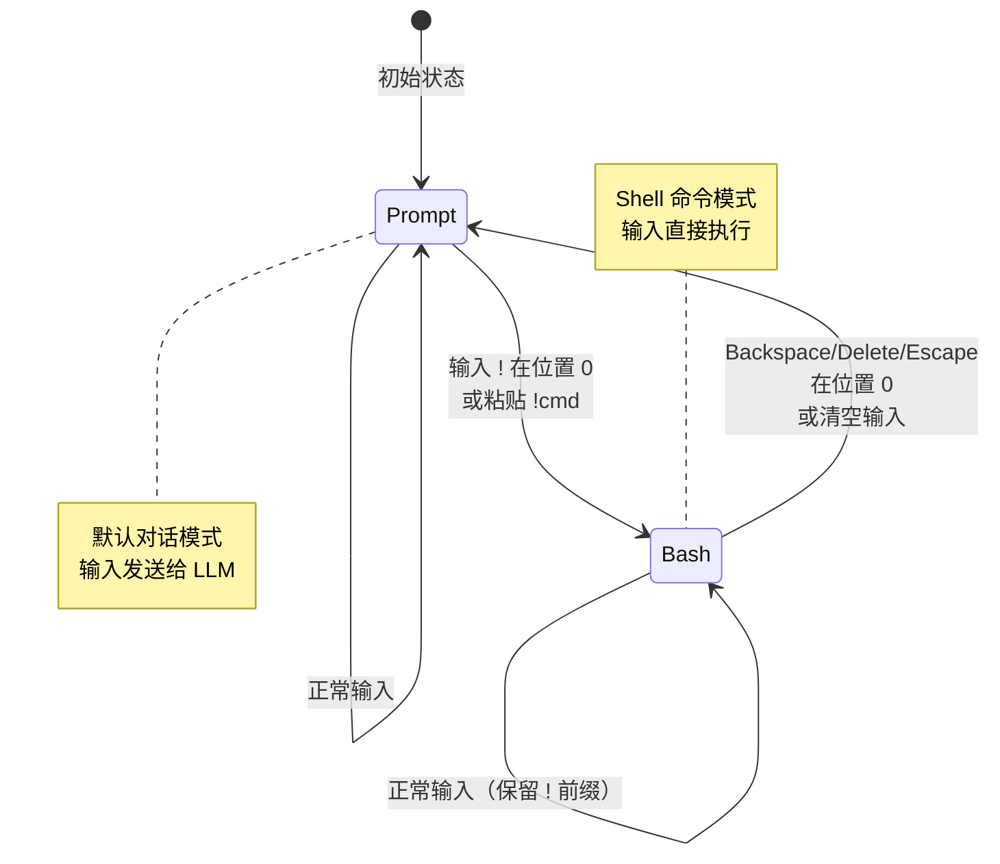
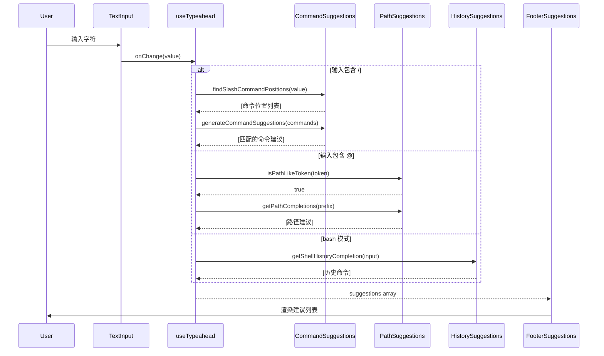
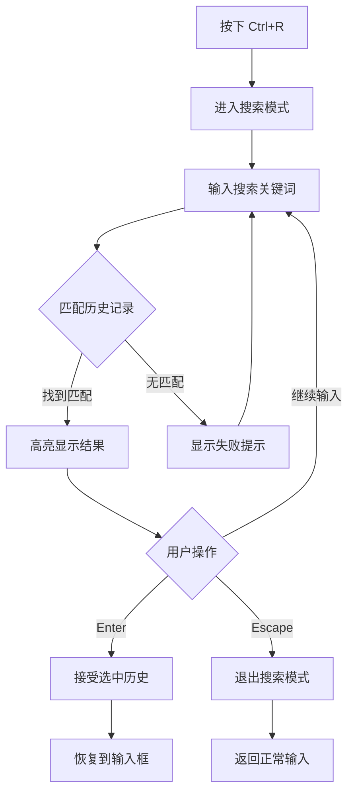
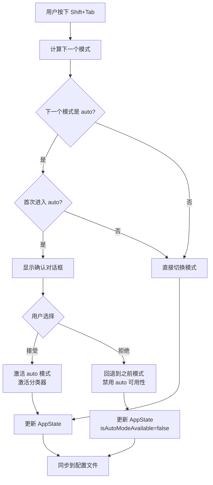

**PromptInput** 组件是 Claude Code REPL 界面的核心输入组件，负责用户交互、输入处理、模式切换、历史导航以及建议提示等关键功能。该组件采用 React 函数组件设计，通过组合多个子组件和自定义 Hooks，实现了功能丰富且高度可扩展的终端输入体验。

## 架构概览与职责边界

PromptInput 组件作为终端输入的统一入口，承担着以下核心职责：用户键盘输入的捕获与处理、多输入模式之间的智能切换、命令建议与自动补全的触发与展示、历史命令的导航与搜索、粘贴内容（文本与图像）的智能处理，以及与全局状态管理系统的集成。该组件通过精细的职责分离，将不同的功能模块委托给专门的子组件和 Hooks 处理，形成了清晰的层次结构。

```mermaid
graph TB
    subgraph "PromptInput Core"
        PI[PromptInput.tsx<br/>主协调器]
        TI[TextInput/VimTextInput<br/>底层输入处理]
        PMI[PromptInputModeIndicator<br/>模式指示器]
        PIF[PromptInputFooter<br/>底部状态栏]
    end
    
    subgraph "Input Modes"
        IM[inputModes.ts<br/>模式判定逻辑]
        PROMPT[prompt<br/>默认对话模式]
        BASH[bash<br/>Shell 命令模式]
    end
    
    subgraph "Typeahead System"
        UT[useTypeahead Hook<br/>建议生成]
        PIFS[PromptInputFooterSuggestions<br/>建议渲染]
        CS[Command Suggestions<br/>命令补全]
        PS[Path Suggestions<br/>路径补全]
    end
    
    subgraph "History & Navigation"
        UAH[useArrowKeyHistory<br/>历史导航]
        UHS[useHistorySearch<br/>历史搜索]
        HSD[HistorySearchDialog<br/>搜索对话框]
    end
    
    subgraph "State Management"
        AS[AppState<br/>全局状态]
        TPC[ToolPermissionContext<br/>权限上下文]
        SUG[PromptSuggestion<br/>建议状态]
    end
    
    PI --> TI
    PI --> PMI
    PI --> PIF
    PI --> IM
    PI --> UT
    PI --> UAH
    PI --> AS
    
    IM --> PROMPT
    IM --> BASH
    
    UT --> PIFS
    UT --> CS
    UT --> PS
    
    UAH --> UHS
    UHS --> HSD
    
    AS --> TPC
    AS --> SUG
    
    Sources: [PromptInput.tsx](src/components/PromptInput/PromptInput.tsx#L1-L200), [inputModes.ts](src/components/PromptInput/inputModes.ts#L1-L34), [useTypeahead.tsx](src/hooks/useTypeahead.tsx#L1-L100)
```

组件采用**单向数据流**设计模式，所有状态变更都通过 `onInputChange`、`onModeChange`、`onSubmit` 等回调函数向上传递，由父组件统一管理状态，确保了数据流的可预测性和可调试性。

Sources: [PromptInput.tsx](src/components/PromptInput/PromptInput.tsx#L200-L400)

## 输入模式系统：从 Prompt 到 Bash 的无缝切换

PromptInput 实现了一套灵活的**输入模式系统**，支持用户根据当前任务需求在不同模式间切换。当前主要支持两种模式：`prompt` 模式（默认的对话模式）和 `bash` 模式（直接执行 Shell 命令）。模式切换通过输入前缀字符触发，也可以通过编程方式显式调用 `onModeChange` 回调。

### 模式判定与切换机制

`inputModes.ts` 模块提供了模式判定的核心逻辑。系统通过检查输入字符串的第一个字符来确定当前模式：以感叹号 `!` 开头的输入被识别为 `bash` 模式，其他情况均为 `prompt` 模式。这种设计允许用户在不离开输入框的情况下快速切换执行环境。

```typescript
// 模式判定逻辑
export function getModeFromInput(input: string): HistoryMode {
  if (input.startsWith('!')) {
    return 'bash'
  }
  return 'prompt'
}

// 提取实际值（移除模式前缀）
export function getValueFromInput(input: string): string {
  const mode = getModeFromInput(input)
  if (mode === 'prompt') {
    return input
  }
  return input.slice(1)  // 移除 '!' 前缀
}
```

Sources: [inputModes.ts](src/components/PromptInput/inputModes.ts#L17-L34)

### 模式切换的触发时机

模式切换在以下场景中自动触发：**空输入时的单字符插入**（在光标位置 0 处输入 `!` 会立即切换到 bash 模式）、**粘贴操作**（粘贴以 `!` 开头的文本到空输入框时自动识别模式）、**退格键删除**（在光标位置 0 处按下退格键或 Escape 键会重置为 prompt 模式）、**显式调用**（通过 `onModeChange` 回调强制切换）。



Sources: [PromptInput.tsx](src/components/PromptInput/PromptInput.tsx#L800-L900)

### 视觉反馈：PromptInputModeIndicator 组件

`PromptInputModeIndicator` 组件负责在输入框左侧显示当前模式的视觉标识。在 `prompt` 模式下显示箭头符号 `❯`（由 `figures.pointer` 提供），在 `bash` 模式下显示感叹号 `!`，并根据 `isLoading` 状态调整颜色亮度。当用户查看队友任务时，指示器还会显示队友的名称和专属颜色，提供更丰富的上下文信息。

```typescript
// 模式指示器渲染逻辑
function PromptInputModeIndicator({ mode, isLoading, viewingAgentName, viewingAgentColor }) {
  return (
    <Box alignItems="flex-start">
      {viewingAgentName ? (
        <PromptChar isLoading={isLoading} themeColor={viewedTeammateThemeColor} />
      ) : mode === "bash" ? (
        <Text color="bashBorder" dimColor={isLoading}>! </Text>
      ) : (
        <PromptChar isLoading={isLoading} themeColor={teammateColor} />
      )}
    </Box>
  )
}
```

Sources: [PromptInputModeIndicator.tsx](src/components/PromptInput/PromptInputModeIndicator.tsx#L45-L93)

## Typeahead 与智能建议系统

PromptInput 集成了强大的**实时建议系统**，通过 `useTypeahead` Hook 在用户输入时动态生成命令、路径、文件等多种类型的建议。该系统采用**渐进式匹配**策略，根据输入内容的不同部分触发相应的建议生成器，支持模糊匹配、历史命令回溯以及上下文感知的智能推荐。

### 建议生成流程

`useTypeahead` Hook 是建议系统的核心引擎，它监听输入变化、光标位置、当前模式等状态，通过一系列正则匹配和启发式规则判断应该激活哪些建议类型。主要支持以下建议类型：**斜杠命令**（以 `/` 开头的内置命令）、**文件路径**（包含 `@` 符号的文件引用）、**目录补全**（路径片段的自动完成）、**Shell 历史**（bash 模式下的命令历史）、**Slack 频道**（集成 Slack MCP 服务器时的频道建议）。



Sources: [useTypeahead.tsx](src/hooks/useTypeahead.tsx#L1-L100), [PromptInput.tsx](src/components/PromptInput/PromptInput.tsx#L1100-L1200)

### 建议的接受与拒绝

用户可以通过多种方式与建议交互：**Tab 键**接受当前选中的建议并插入到输入中、**方向键**在建议列表中导航、**Escape 键**关闭建议列表、**继续输入**会触发建议的重新过滤。系统还支持**内联幽灵文本**（Inline Ghost Text），在用户输入斜杠命令时显示灰色的补全提示，用户只需按下 Tab 即可快速完成命令输入。

```typescript
// 建议接受逻辑（在 useTypeahead 中）
const acceptSuggestion = useCallback((suggestion: SuggestionItem) => {
  if (suggestion.type === 'command') {
    const newValue = applyCommandSuggestion(input, suggestion, cursorOffset)
    onInputChange(newValue)
    setCursorOffset(/* 新光标位置 */)
  } else if (suggestion.type === 'path') {
    const newValue = applyFileSuggestion(input, suggestion, cursorOffset)
    onInputChange(newValue)
    setCursorOffset(/* 新光标位置 */)
  }
  // 清空建议列表
  setSuggestionsState({ suggestions: [], selectedSuggestion: -1 })
}, [input, cursorOffset, onInputChange])
```

Sources: [PromptInput.tsx](src/components/PromptInput/PromptInput.tsx#L1000-L1100)

### 建议的可视化：PromptInputFooterSuggestions

当建议列表不为空时，`PromptInputFooter` 组件会渲染 `PromptInputFooterSuggestions` 子组件，显示格式化的建议列表。每条建议包含**显示文本**（带高亮的匹配部分）、**描述**（命令的简短说明）、**快捷键提示**（如适用）。当前选中的建议会以反色或高亮背景显示，提供清晰的视觉反馈。

Sources: [PromptInputFooter.tsx](src/components/PromptInput/PromptInputFooter.tsx#L100-L150)

## 历史导航与搜索功能

PromptInput 实现了完整的**命令历史系统**，允许用户通过方向键浏览历史输入、通过 `Ctrl+R` 进行增量搜索、通过 `Ctrl+P/Ctrl+N` 进行精确导航。历史记录不仅保存文本内容，还包括粘贴的图像和文本引用，确保恢复历史命令时能够完整重现当时的状态。

### 历史导航的触发条件

历史导航仅在特定条件下触发，避免与多行输入的光标移动冲突：**向上箭头**仅在光标位于输入的第一行时触发历史回溯、**向下箭头**仅在光标位于输入的最后一行时触发历史前进。这种设计确保了在多行输入场景下，方向键优先用于光标移动，而非历史导航。

```typescript
function handleHistoryUp() {
  // 如果有多个建议，不触发历史导航
  if (suggestions.length > 1) return
  
  // 仅在光标位于第一行时触发
  if (!isCursorOnFirstLine) return
  
  // 如果有可编辑的排队命令，优先弹出
  if (hasEditableCommand) {
    void popAllCommandsFromQueue()
    return
  }
  
  onHistoryUp()  // 调用历史回溯
}

function handleHistoryDown() {
  if (suggestions.length > 1) return
  
  // 仅在光标位于最后一行时触发
  if (!isCursorOnLastLine) return
  
  // 历史到底部时进入 footer 导航
  if (onHistoryDown() && footerItems.length > 0) {
    selectFooterItem(footerItems[0])
  }
}
```

Sources: [PromptInput.tsx](src/components/PromptInput/PromptInput.tsx#L900-L1000)

### 增量历史搜索

用户可以通过 `Ctrl+R` 激活历史搜索模式，此时输入框变为搜索框，输入的每个字符都会实时过滤历史记录。搜索结果以高亮形式显示匹配的文本片段，用户可以通过方向键选择目标条目，按下 Enter 键接受该历史命令并恢复到输入框中。搜索模式还会在输入框上方显示 `HistorySearchInput` 组件，提供搜索状态的视觉反馈。



Sources: [PromptInput.tsx](src/components/PromptInput/PromptInput.tsx#L400-L600), [HistorySearchInput.tsx](src/components/PromptInput/HistorySearchInput.tsx)

### 历史状态的管理

历史状态通过 `useArrowKeyHistory` Hook 管理，该 Hook 维护一个**历史索引**（指向当前浏览位置）、一个**历史栈**（存储所有历史条目），以及一个**临时缓冲区**（保存用户当前未提交的输入）。当用户浏览历史时，当前输入会被保存到临时缓冲区，确保用户可以通过向下箭头回到当前编辑中的输入。

Sources: [useArrowKeyHistory.tsx](src/hooks/useArrowKeyHistory.tsx)

## 键盘绑定与快捷键系统

PromptInput 通过 Ink 框架的 `useInput` Hook 和自定义的 `useKeybindings` Hook 实现了复杂的键盘事件处理。系统支持**上下文感知的快捷键**（同一按键在不同上下文中有不同行为）、**和弦快捷键**（如 `Ctrl+E S` 这样的组合键）、**优先级机制**（确保高优先级的处理器先响应），以及**可配置的键位映射**（通过 `keybindings` 配置文件自定义）。

### Chat 上下文的快捷键绑定

在 Chat 上下文中，PromptInput 注册了以下核心快捷键：

| 动作 | 默认快捷键 | 功能描述 |
|------|-----------|---------|
| `chat:submit` | Enter | 提交当前输入 |
| `chat:newline` | Shift+Enter 或 \+Enter | 插入换行符 |
| `chat:undo` | Ctrl+_ | 撤销最后一次编辑 |
| `chat:stash` | Ctrl+S | 暂存/恢复当前输入 |
| `chat:externalEditor` | Ctrl+E | 在外部编辑器中编辑 |
| `chat:modelPicker` | Ctrl+M | 切换模型选择器 |
| `chat:cycleMode` | Shift+Tab | 循环切换权限模式 |
| `chat:imagePaste` | Ctrl+V | 从剪贴板粘贴图像 |
| `chat:thinkingToggle` | Ctrl+T | 切换思考模式 |
| `chat:fastMode` | Ctrl+F | 切换快速模式 |
| `history:previous` | ↑ | 浏览上一条历史 |
| `history:next` | ↓ | 浏览下一条历史 |
| `history:search` | Ctrl+R | 激活历史搜索 |

Sources: [PromptInput.tsx](src/components/PromptInput/PromptInput.tsx#L1600-L1700)

### Footer 导航的专用绑定

当用户选中底部状态栏的指示器时，系统切换到 Footer 上下文，此时方向键的行为发生变化：**上/下箭头**在不同指示器之间切换、**左/右箭头**在团队成员列表中循环、**Enter 键**打开选中项的详细视图、**Escape 键**清除选择并返回输入框。这种上下文切换确保了导航操作不会与正常输入冲突。

```typescript
// Footer 上下文的键位绑定
useKeybindings({
  'footer:up': () => navigateFooter(-1, true),
  'footer:down': () => navigateFooter(1),
  'footer:next': () => {
    if (tasksSelected && isTeammateMode) {
      setTeammateFooterIndex(prev => (prev + 1) % totalAgents)
    } else {
      navigateFooter(1)
    }
  },
  'footer:previous': () => {
    if (tasksSelected && isTeammateMode) {
      setTeammateFooterIndex(prev => (prev - 1 + totalAgents) % totalAgents)
    } else {
      navigateFooter(-1)
    }
  },
  'footer:openSelected': () => { /* 打开选中项 */ },
  'footer:clearSelection': () => selectFooterItem(null),
}, { context: 'Footer', isActive: !!footerItemSelected })
```

Sources: [PromptInput.tsx](src/components/PromptInput/PromptInput.tsx#L1700-L1800)

### 输入过滤与延迟空格机制

PromptInput 实现了**延迟空格机制**（Lazy Space），用于处理图像粘贴后的用户体验问题。当用户粘贴图像后，系统会在下一个非空格可打印字符前自动插入一个空格，确保图像引用 `[Image #N]` 与后续文本之间有适当的间距。这个机制通过 `inputFilter` 回调实现，在原始输入到达 TextInput 之前进行预处理。

```typescript
// 延迟空格输入过滤器
const lazySpaceInputFilter = useCallback((input: string, key: Key): string => {
  if (!pendingSpaceAfterPillRef.current) return input
  pendingSpaceAfterPillRef.current = false
  
  // 如果下一个字符是非空格可打印字符，插入前导空格
  if (isNonSpacePrintable(input, key)) {
    return ' ' + input
  }
  return input
}, [])
```

Sources: [PromptInput.tsx](src/components/PromptInput/PromptInput.tsx#L1200-L1300), [utils.ts](src/components/PromptInput/utils.ts#L38-L61)

## 权限模式循环与状态管理

PromptInput 集成了 Claude Code 的**权限管理系统**，允许用户通过 `Shift+Tab` 快捷键在不同的权限模式之间循环切换。当前支持的模式包括：`default`（默认模式，每次工具调用都需要确认）、`acceptEdits`（自动接受文件编辑）、`plan`（计划模式，仅规划不执行）、`auto`（自动模式，基于分类器自动决策）、`bypassPermissions`（绕过所有权限检查）。

### 模式切换的决策流程

`handleCycleMode` 函数实现了模式切换的核心逻辑。当用户按下 `Shift+Tab` 时，系统会调用 `getNextPermissionMode` 计算下一个模式，然后根据目标模式执行相应的副作用（如激活分类器、移除危险权限规则）。对于 `auto` 模式，系统会显示**首次使用确认对话框**（AutoModeOptInDialog），确保用户了解自动模式的风险。



Sources: [PromptInput.tsx](src/components/PromptInput/PromptInput.tsx#L1400-L1600), [getNextPermissionMode.ts](src/utils/permissions/getNextPermissionMode.ts#L50-L102)

### 队友任务的模式隔离

当用户查看队友任务时，`Shift+Tab` 的行为会发生变化：不再循环主会话的权限模式，而是循环当前查看的队友任务的权限模式。这种隔离确保了用户可以为不同的子代理设置不同的权限级别，而不会相互干扰。系统通过 `viewingAgentTaskId` 状态判断当前是否在查看模式，并据此调整模式切换的目标。

```typescript
// 队友模式的切换逻辑
if (isAgentSwarmsEnabled() && viewedTeammate && viewingAgentTaskId) {
  const teammateContext = {
    ...toolPermissionContext,
    mode: viewedTeammate.permissionMode
  }
  const nextMode = getNextPermissionMode(teammateContext, undefined)
  
  // 直接更新队友任务的状态
  setAppState(prev => ({
    ...prev,
    tasks: {
      ...prev.tasks,
      [teammateTaskId]: {
        ...task,
        permissionMode: nextMode
      }
    }
  }))
  return
}
```

Sources: [PromptInput.tsx](src/components/PromptInput/PromptInput.tsx#L1400-L1500)

### 模式指示器的底部状态栏显示

`PromptInputFooterLeftSide` 组件负责在底部状态栏显示当前权限模式。它会渲染一个可点击的模式标签，显示当前模式的名称和符号，并根据模式类型应用不同的颜色。用户可以通过点击该标签触发模式切换，也可以通过 `Shift+Tab` 快捷键进行切换。状态栏还会显示其他信息，如 Vim 模式状态、粘贴提示、历史搜索输入框等。

Sources: [PromptInputFooterLeftSide.tsx](src/components/PromptInput/PromptInputFooterLeftSide.tsx#L150-L200)

## 粘贴处理与内容管理

PromptInput 实现了智能的**粘贴内容管理系统**，支持文本和图像的粘贴，并对大文本进行特殊处理以避免终端渲染性能问题。粘贴的内容会被分配唯一的 ID，并以引用形式插入到输入框中（如 `[Image #1]` 或 `[Pasted text #2 (15 lines)]`），实际内容存储在 `pastedContents` 状态中。

### 图像粘贴流程

当用户按下 `Ctrl+V` 粘贴图像时，系统会调用 `getImageFromClipboard` 函数（支持 macOS、Windows、Linux），读取剪贴板中的图像数据，将其转换为 Base64 编码，并调用 `onImagePaste` 回调。图像会被存储到磁盘（通过 `storeImage` 函数），并在输入框中插入引用占位符。系统还会自动缓存图像路径，确保后续引用能够快速加载。

```typescript
function onImagePaste(image: string, mediaType?: string, filename?: string, dimensions?: ImageDimensions, sourcePath?: string) {
  logEvent('tengu_paste_image', {})
  onModeChange('prompt')  // 切换到 prompt 模式
  
  const pasteId = nextPasteIdRef.current++
  const newContent: PastedContent = {
    id: pasteId,
    type: 'image',
    content: image,
    mediaType: mediaType || 'image/png',
    filename: filename || 'Pasted image',
    dimensions,
    sourcePath
  }
  
  // 立即缓存路径
  cacheImagePath(newContent)
  
  // 后台存储图像到磁盘
  void storeImage(newContent)
  
  // 更新状态
  setPastedContents(prev => ({ ...prev, [pasteId]: newContent }))
  
  // 插入引用占位符，并激活延迟空格机制
  const prefix = pendingSpaceAfterPillRef.current ? ' ' : ''
  insertTextAtCursor(prefix + formatImageRef(pasteId))
  pendingSpaceAfterPillRef.current = true
}
```

Sources: [PromptInput.tsx](src/components/PromptInput/PromptInput.tsx#L1100-L1200)

### 大文本粘贴的折叠处理

对于超过 `PASTE_THRESHOLD`（800 字符）或包含多行（超过可显示行数）的粘贴文本，系统会自动创建文本引用，而非直接插入原始内容。这种折叠机制避免了终端渲染大量文本时的性能问题，同时保留了完整内容的可访问性。用户可以通过 `@` 引用查看完整内容，或通过外部编辑器展开。

```typescript
function onTextPaste(rawText: string) {
  // 清理 ANSI 转义码和规范化行尾
  let text = stripAnsi(rawText).replace(/\r/g, '\n').replaceAll('\t', '    ')
  
  // 检查是否需要折叠
  const numLines = getPastedTextRefNumLines(text)
  const maxLines = Math.min(rows - 10, 2)
  
  if (text.length > PASTE_THRESHOLD || numLines > maxLines) {
    // 创建折叠引用
    const pasteId = nextPasteIdRef.current++
    const newContent: PastedContent = {
      id: pasteId,
      type: 'text',
      content: text
    }
    setPastedContents(prev => ({ ...prev, [pasteId]: newContent }))
    insertTextAtCursor(formatPastedTextRef(pasteId, numLines))
  } else {
    // 短文本直接插入
    insertTextAtCursor(text)
  }
}
```

Sources: [PromptInput.tsx](src/components/PromptInput/PromptInput.tsx#L1200-L1300), [inputPaste.ts](src/components/PromptInput/inputPaste.ts)

### 引用的自动清理

系统通过 `useEffect` Hook 监听输入内容的变化，自动清理不再被引用的粘贴内容。当用户删除图像引用或文本引用时，对应的 `pastedContents` 条目会被自动移除，释放内存和磁盘空间。这种清理机制确保了状态的一致性，避免了孤立资源的积累。

Sources: [PromptInput.tsx](src/components/PromptInput/PromptInput.tsx#L1200-L1250)

## 子组件协作与职责分离

PromptInput 采用了**组件组合**的设计模式，将不同的功能模块委托给专门的子组件处理，主组件仅负责协调和状态管理。这种架构确保了代码的可维护性和可测试性，每个子组件都可以独立开发和测试。

### 核心子组件概览

| 组件名称 | 职责 | 关键 Props |
|---------|------|-----------|
| `TextInput` / `VimTextInput` | 底层输入处理、光标管理、键盘事件 | `value`, `onChange`, `onSubmit`, `cursorOffset` |
| `PromptInputModeIndicator` | 显示当前模式标识 | `mode`, `isLoading`, `viewingAgentName` |
| `PromptInputFooter` | 底部状态栏、建议列表、通知 | `suggestions`, `toolPermissionContext`, `messages` |
| `PromptInputFooterSuggestions` | 渲染建议列表 | `suggestions`, `selectedSuggestion` |
| `Notifications` | 显示临时通知 | `apiKeyStatus`, `autoUpdaterResult` |
| `PromptInputQueuedCommands` | 显示排队的命令 | 无（从 AppState 读取） |
| `PromptInputStashNotice` | 显示暂存提示 | `hasStash` |
| `HistorySearchDialog` | 历史搜索对话框 | `initialQuery`, `onSelect` |
| `ModelPicker` | 模型选择器 | `initial`, `onSelect` |
| `AutoModeOptInDialog` | 自动模式确认对话框 | `onAccept`, `onDecline` |

Sources: [PromptInput.tsx](src/components/PromptInput/PromptInput.tsx#L2200-L2339)

### 状态提升与回调传递

PromptInput 遵循 React 的**状态提升原则**，所有关键状态（如 `input`、`mode`、`pastedContents`、`stashedPrompt`）都由父组件管理，并通过 props 传递给子组件。状态变更通过回调函数（如 `onInputChange`、`onModeChange`、`onSubmit`）向上传递，确保了单向数据流和可预测的状态变更。

```typescript
// Props 接口定义
type Props = {
  input: string
  onInputChange: (value: string) => void
  mode: PromptInputMode
  onModeChange: (mode: PromptInputMode) => void
  pastedContents: Record<number, PastedContent>
  setPastedContents: React.Dispatch<React.SetStateAction<Record<number, PastedContent>>>
  onSubmit: (input: string, helpers: PromptInputHelpers) => Promise<void>
  // ... 其他 props
}
```

Sources: [PromptInput.tsx](src/components/PromptInput/PromptInput.tsx#L50-L150)

### 子组件的渲染时机

PromptInput 根据不同的状态条件渲染不同的子组件，实现了**条件渲染**和**提前返回**模式：如果 `showBashesDialog` 为真，渲染 `BackgroundTasksDialog` 并提前返回；如果 `showModelPicker` 为真，渲染 `ModelPicker` 并提前返回；如果 `helpOpen` 为真，`PromptInputFooter` 会渲染 `PromptInputHelpMenu` 而非默认内容。这种设计确保了同一时间只有一个全屏对话框或菜单处于激活状态。

Sources: [PromptInput.tsx](src/components/PromptInput/PromptInput.tsx#L2000-L2200)

## 总结与最佳实践

PromptInput 组件是 Claude Code 终端界面的**输入处理中枢**，通过精心设计的架构实现了复杂的功能需求，同时保持了代码的可维护性和可扩展性。其核心设计原则包括：**职责分离**（每个子组件专注单一职责）、**状态提升**（关键状态由父组件统一管理）、**上下文感知**（根据当前模式调整行为）、**渐进增强**（基础功能优先，高级功能可选）。

对于开发者而言，理解 PromptInput 的关键在于把握其**事件处理流程**：用户输入 → `onChange` 回调 → 模式判定 → 建议生成 → 状态更新 → 重新渲染。任何扩展或修改都应该遵循这一流程，确保不破坏现有的状态管理机制。同时，建议充分利用现有的 Hooks 和工具函数（如 `useTypeahead`、`useArrowKeyHistory`、`inputModes`），而非重新实现类似功能。