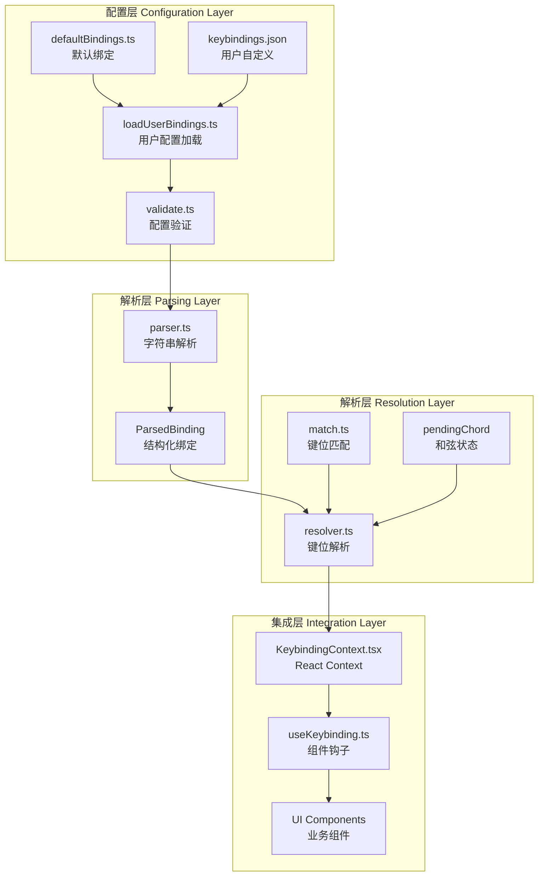
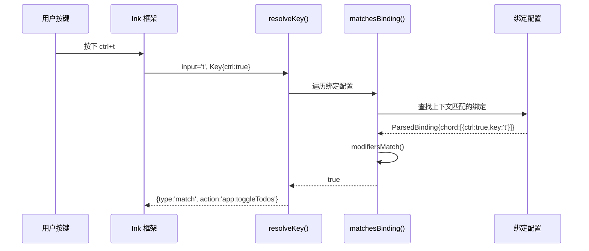
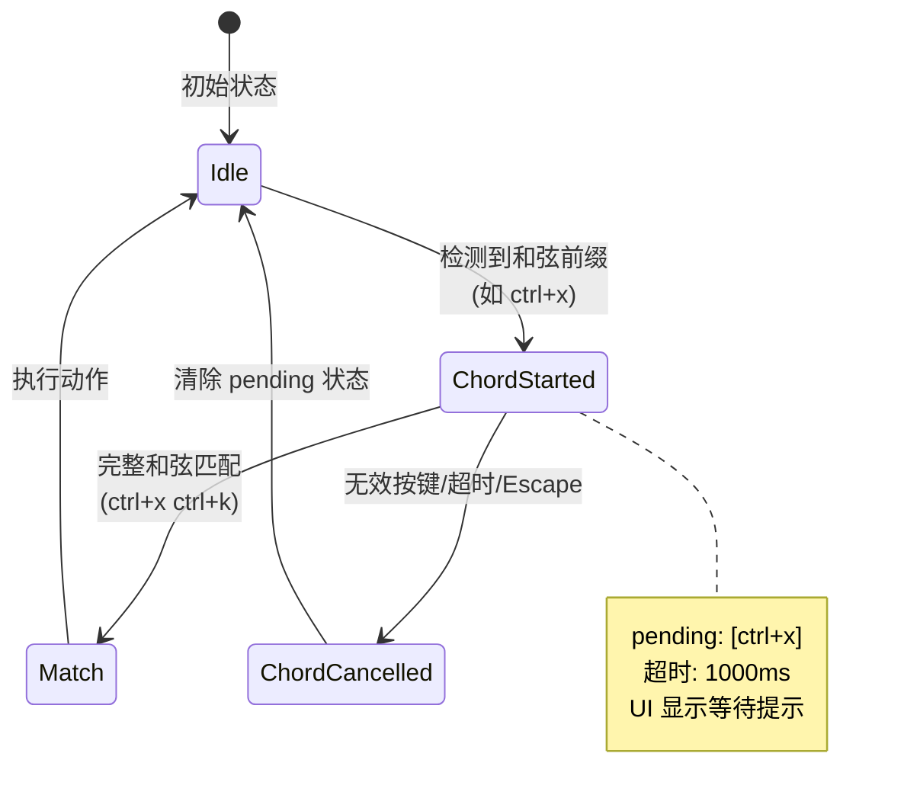

Claude Code 的键盘绑定系统采用**声明式配置 + React Context 架构**，将快捷键定义从组件逻辑中完全解耦。系统支持**多键序列**、**上下文优先级**、**用户自定义热重载**等高级特性，同时保持匹配算法的纯函数特性。这种设计让快捷键配置集中管理、易于测试，并通过 TypeScript 类型系统确保编译时安全。

Sources: [KeybindingContext.tsx](src/keybindings/KeybindingContext.tsx#L1-L50), [useKeybinding.ts](src/keybindings/useKeybinding.ts#L1-L50)

## 核心架构：四层职责分离

键盘绑定系统分为四个独立层次，每层通过明确的接口协作：



**配置层**负责加载和验证绑定定义：`defaultBindings.ts` 定义所有默认快捷键，`loadUserBindings.ts` 从 `~/.claude/keybindings.json` 加载用户配置并合并，`validate.ts` 执行类型和冲突检查。**解析层**将配置字符串（如 `"ctrl+shift+k"`）转换为结构化对象（`ParsedKeystroke`），支持修饰符别名和跨平台显示。**解析层**是纯函数核心，`match.ts` 执行键位匹配逻辑，`resolver.ts` 处理上下文优先级与和弦序列状态机。**集成层**通过 React Context 提供全局访问，`useKeybinding` 钩子让组件以声明式方式注册处理器。

Sources: [defaultBindings.ts](src/keybindings/defaultBindings.ts#L1-L50), [loadUserBindings.ts](src/keybindings/loadUserBindings.ts#L1-L50), [parser.ts](src/keybindings/parser.ts#L1-L50), [resolver.ts](src/keybindings/resolver.ts#L1-L50)

## 配置格式：KeybindingBlock 结构

键盘绑定配置采用 `KeybindingBlock` 数组格式，每个块定义一个上下文及其绑定映射：

```typescript
type KeybindingBlock = {
  context: KeybindingContextName  // 上下文名称
  bindings: {
    [keystroke: string]: string | null  // 快捷键 → 动作
  }
}
```

`context` 字段指定绑定生效的 UI 上下文（如 `'Global'`、`'Chat'`、`'Autocomplete'`），`bindings` 对象将快捷键字符串映射到动作标识符。动作标识符采用 `域:操作` 命名约定（如 `app:toggleTodos`、`chat:submit`），支持三种值类型：**预定义动作**（如 `'app:interrupt'`）、**命令绑定**（如 `'command:help'` 执行斜杠命令）、**空值解除**（`null` 用于禁用默认绑定）。系统按数组顺序处理块，后定义的绑定覆盖先前的，实现用户自定义优先于默认配置。

Sources: [schema.ts](src/keybindings/schema.ts#L120-L150), [defaultBindings.ts](src/keybindings/defaultBindings.ts#L30-L80)

### 默认绑定上下文分布

| 上下文 | 触发场景 | 典型绑定示例 |
|--------|----------|--------------|
| **Global** | 所有界面 | `ctrl+c` → `app:interrupt`<br/>`ctrl+t` → `app:toggleTodos`<br/>`ctrl+o` → `app:toggleTranscript` |
| **Chat** | 输入框聚焦时 | `enter` → `chat:submit`<br/>`shift+tab` → `chat:cycleMode`<br/>`meta+p` → `chat:modelPicker` |
| **Autocomplete** | 自动补全菜单可见 | `tab` → `autocomplete:accept`<br/>`escape` → `autocomplete:dismiss` |
| **Confirmation** | 确认对话框显示 | `y` → `confirm:yes`<br/>`n` → `confirm:no`<br/>`enter` → `confirm:yes` |
| **Transcript** | 查看历史记录 | `q` → `transcript:exit`<br/>`ctrl+e` → `transcript:toggleShowAll` |
| **HistorySearch** | 历史搜索模式（ctrl+r） | `ctrl+r` → `historySearch:next`<br/>`enter` → `historySearch:execute` |

上下文系统允许同一快捷键在不同场景下触发不同动作。例如，`escape` 在 `'Autocomplete'` 上下文关闭补全菜单，在 `'Chat'` 上下文取消当前输入，在 `'Confirmation'` 上下文拒绝确认。系统通过**活动上下文集合**管理当前生效的上下文，按注册顺序确定优先级。

Sources: [defaultBindings.ts](src/keybindings/defaultBindings.ts#L20-L200), [schema.ts](src/keybindings/schema.ts#L20-L80)

## 匹配算法：从键位到动作的解析流程

键位匹配是**纯函数**过程，输入为 Ink 框架提供的 `input` 字符串和 `Key` 对象，输出为 `ResolveResult` 类型：

```typescript
type ResolveResult = 
  | { type: 'match'; action: string }      // 匹配成功
  | { type: 'none' }                       // 无匹配
  | { type: 'unbound' }                    // 显式解绑
```

匹配流程分为三个阶段：**键名规范化**、**修饰符提取**、**绑定查找**。`match.ts` 中的 `getKeyName` 函数将 Ink 的布尔标志（`key.escape`、`key.return` 等）转换为标准化键名字符串（`'escape'`、`'enter'`），单字符输入转为小写。`modifiersMatch` 函数比较 Ink 的修饰符与 `ParsedKeystroke` 的修饰符字段，其中 `alt` 和 `meta` 在终端环境中被同等对待（历史遗留限制），`super`（Cmd/Win）通过 Kitty 键盘协议独立传输。

Sources: [match.ts](src/keybindings/match.ts#L30-L80), [resolver.ts](src/keybindings/resolver.ts#L30-L70)



`resolver.ts` 中的 `resolveKey` 函数遍历所有绑定，过滤出当前活动上下文的绑定，返回**最后一个匹配**（实现用户覆盖默认的逻辑）。特殊处理 `action === null` 的情况，返回 `{ type: 'unbound' }` 以阻止事件传播——这允许用户显式禁用某个快捷键，防止意外触发。

Sources: [resolver.ts](src/keybindings/resolver.ts#L35-L70), [match.ts](src/keybindings/match.ts#L80-L100)

## 和弦序列：多键组合的状态机实现

和弦序列支持多键组合快捷键（如 `ctrl+x ctrl+k`），通过**状态机模式**管理按键序列：

```typescript
type ChordResolveResult =
  | { type: 'match'; action: string }
  | { type: 'none' }
  | { type: 'unbound' }
  | { type: 'chord_started'; pending: ParsedKeystroke[] }  // 和弦开始
  | { type: 'chord_cancelled' }                             // 和弦取消
```

和弦解析的核心是 `resolveKeyWithChordState` 函数，它维护 `pending` 状态（当前已按下的键序列）。当用户按下 `ctrl+x`，系统检测到存在以 `ctrl+x` 开头的和弦绑定（如 `ctrl+x ctrl+k`），返回 `{ type: 'chord_started', pending: [ctrl+x] }`，UI 显示等待提示。后续按键与 `pending` 组合形成完整序列进行匹配，匹配成功返回动作，无效按键或超时（1000ms）返回 `chord_cancelled`。

Sources: [resolver.ts](src/keybindings/resolver.ts#L130-L200), [KeybindingProviderSetup.tsx](src/keybindings/KeybindingProviderSetup.tsx#L120-L180)



`KeybindingProviderSetup.tsx` 中的 `ChordInterceptor` 组件负责拦截所有输入事件，在和弦模式下阻止事件传播。和弦超时通过 `chordTimeoutRef` 管理，每次更新 `pendingChord` 时重置定时器。**Escape 键**是特殊的和弦取消信号——即使在和弦序列中，按下 Escape 也会立即清除 `pending` 状态。

Sources: [KeybindingProviderSetup.tsx](src/keybindings/KeybindingProviderSetup.tsx#L130-L200), [resolver.ts](src/keybindings/resolver.ts#L150-L230)

## 上下文系统：活动上下文注册与优先级

上下文系统通过**注册机制**动态管理活动上下文集合，实现场景化的快捷键切换：

```typescript
type KeybindingContextValue = {
  activeContexts: Set<KeybindingContextName>
  registerActiveContext: (context: KeybindingContextName) => void
  unregisterActiveContext: (context: KeybindingContextName) => void
  // ...
}
```

组件通过 `registerActiveContext` 在挂载时注册上下文，卸载时调用 `unregisterActiveContext` 清理。例如，`Autocomplete` 组件在菜单可见时注册 `'Autocomplete'` 上下文，隐藏时注销。`useKeybinding` 钩子自动将组件指定的 `context` 参数加入解析上下文列表，构建顺序为：`[...activeContexts, componentContext, 'Global']`，去重后按首次出现顺序确定优先级。

Sources: [KeybindingContext.tsx](src/keybindings/KeybindingContext.tsx#L30-L90), [useKeybinding.ts](src/keybindings/useKeybinding.ts#L60-L90)

**上下文优先级示例**：当 `'Autocomplete'` 和 `'Chat'` 上下文同时活动时，`escape` 键的解析顺序为 `['Autocomplete', 'Chat', 'Global']`。由于 `'Autocomplete'` 在前，`escape` 触发 `autocomplete:dismiss` 而非 `chat:cancel`。这种设计确保了**最具体的上下文优先**，避免快捷键冲突。

Sources: [useKeybinding.ts](src/keybindings/useKeybinding.ts#L70-L85), [KeybindingProviderSetup.tsx](src/keybindings/KeybindingProviderSetup.tsx#L80-L120)

## 用户自定义：热重载与配置合并

用户自定义配置存储在 `~/.claude/keybindings.json`，采用对象包装格式：

```json
{
  "bindings": [
    {
      "context": "Chat",
      "bindings": {
        "ctrl+j": "chat:submit",
        "ctrl+k": "chat:cancel"
      }
    }
  ]
}
```

`loadUserBindings.ts` 使用 **Chokidar 文件监视器**监听配置文件变化，变更时重新加载并验证。加载流程：读取文件 → JSON 解析 → 类型检查（`isKeybindingBlockArray`） → 验证（`validateBindings`） → 与默认配置合并（`[...defaults, ...user]`）。验证器检查上下文名称有效性、动作标识符合法性、快捷键格式正确性、保留快捷键冲突（如 `ctrl+c` 不可重绑定）。

Sources: [loadUserBindings.ts](src/keybindings/loadUserBindings.ts#L60-L150), [validate.ts](src/keybindings/validate.ts#L1-L80)

### 配置验证警告类型

| 警告类型 | 严重性 | 说明 | 示例 |
|----------|--------|------|------|
| `parse_error` | Error | JSON 格式错误或结构无效 | `"bindings" 字段缺失` |
| `invalid_context` | Error | 上下文名称不在白名单中 | `context: "UnknownContext"` |
| `invalid_action` | Error | 动作标识符未注册 | `action: "app:unknownAction"` |
| `reserved` | Error | 尝试重绑定保留快捷键 | `ctrl+c`、`ctrl+d` |
| `duplicate` | Warning | 同一上下文内快捷键重复定义 | 两个 `ctrl+k` 绑定 |

验证警告通过 `useNotifications` 钩子显示在 UI 中，提示用户运行 `/doctor` 命令查看详情。**自定义功能当前仅对 Anthropic 员工开放**（通过 GrowthBoard 特性开关 `tengu_keybinding_customization_release` 控制），外部用户使用默认配置。

Sources: [loadUserBindings.ts](src/keybindings/loadUserBindings.ts#L120-L200), [validate.ts](src/keybindings/validate.ts#L30-L80), [KeybindingProviderSetup.tsx](src/keybindings/KeybindingProviderSetup.tsx#L30-L70)

## React 集成：useKeybinding 钩子

`useKeybinding` 钩子是组件集成键盘绑定的主要接口，将配置驱动的动作映射到组件处理器：

```typescript
function useKeybinding(
  action: string,
  handler: () => void | false | Promise<void>,
  options?: { context?: KeybindingContextName; isActive?: boolean }
): void
```

钩子内部通过 `useInput` 订阅 Ink 的输入事件，调用 `keybindingContext.resolve()` 解析按键。当解析结果匹配 `action` 时，执行 `handler()`，返回值 `false` 表示不消费事件（允许传播到其他处理器），其他返回值调用 `event.stopImmediatePropagation()` 阻止传播。`isActive` 参数控制钩子激活状态，类似于 `useInput` 的同名参数。

Sources: [useKeybinding.ts](src/keybindings/useKeybinding.ts#L30-L90)

**处理器返回值语义**：
- **`void` / `undefined`**：事件已消费，阻止传播
- **`false`**：事件未消费，允许后续处理器处理（用于穿透场景，如滚动边界时将滚轮事件传递给列表导航）
- **`Promise<void>`**：异步处理器，按 `void` 处理（不等待 Promise 结算）

`useKeybindings` 变体支持一次注册多个处理器，减少 `useInput` 调用次数：

```typescript
useKeybindings({
  'chat:submit': () => handleSubmit(),
  'chat:cancel': () => handleCancel(),
  'chat:undo': () => handleUndo(),
}, { context: 'Chat' })
```

Sources: [useKeybinding.ts](src/keybindings/useKeybinding.ts#L100-L160)

## 快捷键显示：useShortcutDisplay 钩子

UI 组件需要显示用户配置的快捷键提示（如按钮旁的 "ctrl+t"），`useShortcutDisplay` 钩子提供动态查询：

```typescript
function useShortcutDisplay(
  action: string,
  context: KeybindingContextName,
  fallback: string
): string
```

钩子调用 `keybindingContext.getDisplayText(action, context)` 查询绑定配置，返回格式化的快捷键字符串（如 `"ctrl+t"`）。如果查询失败（上下文不可用或动作未定义），返回 `fallback` 参数作为后备。**Fallback 机制是迁移期的安全网**——在键盘绑定系统完全稳定前，确保即使配置加载失败也能显示合理的快捷键提示。

Sources: [useShortcutDisplay.ts](src/keybindings/useShortcutDisplay.ts#L20-L50)

**平台适配显示**：`parser.ts` 中的 `keystrokeToDisplayString` 函数根据平台调整修饰符名称——macOS 显示 `"opt"`，其他平台显示 `"alt"`；方向键显示为 Unicode 箭头（`↑`、`↓`、`←`、`→`），提升可读性：

```typescript
// macOS 显示
keystrokeToDisplayString({ alt: true, key: 'k' }, 'macos')
// 返回: "opt+k"

// Linux/Windows 显示
keystrokeToDisplayString({ alt: true, key: 'k' }, 'linux')
// 返回: "alt+k"
```

Sources: [parser.ts](src/keybindings/parser.ts#L120-L180), [useShortcutDisplay.ts](src/keybindings/useShortcutDisplay.ts#L30-L45)

## 平台兼容性：Windows 终端限制与 VT 模式

键盘绑定系统针对 Windows 终端的限制进行了特殊适配：

**图像粘贴快捷键**：Windows 上 `ctrl+v` 是系统粘贴，因此图像粘贴使用 `alt+v`，其他平台使用 `ctrl+v`。这是通过 `getPlatform()` 检测并在 `defaultBindings.ts` 中动态设置的。

**Shift+Tab 兼容性**：Windows Terminal 在不支持 VT 模式时无法可靠发送 `shift+tab`。系统检测 Node.js 版本（≥22.17.0 或 ≥24.2.0）或 Bun 版本（≥1.2.23），判断是否支持 VT 模式。不支持时，模式切换快捷键回退到 `meta+m`：

```typescript
const SUPPORTS_TERMINAL_VT_MODE =
  getPlatform() !== 'windows' ||
  (isRunningWithBun()
    ? satisfies(process.versions.bun, '>=1.2.23')
    : satisfies(process.versions.node, '>=22.17.0 <23.0.0 || >=24.2.0'))

const MODE_CYCLE_KEY = SUPPORTS_TERMINAL_VT_MODE ? 'shift+tab' : 'meta+m'
```

Sources: [defaultBindings.ts](src/keybindings/defaultBindings.ts#L15-L35)

**Kitty 键盘协议**：`super`（Cmd/Win）修饰符仅在支持 Kitty 键盘协议的终端中可用（如 Kitty、iTerm2、WezTerm）。在不支持的终端中，`cmd+` 绑定永远不会触发——这是预期行为，不会导致错误。默认配置为 `cmd+shift+f` 等绑定提供了 `ctrl+shift+` 替代方案。

Sources: [match.ts](src/keybindings/match.ts#L40-L70), [defaultBindings.ts](src/keybindings/defaultBindings.ts#L50-L80)

## 实战案例：全局快捷键处理器

`useGlobalKeybindings.tsx` 展示了如何组织复杂的全局快捷键逻辑：

```typescript
export function GlobalKeybindingHandlers({
  screen,
  setScreen,
  showAllInTranscript,
  setShowAllInTranscript,
  // ...
}: Props): null {
  // ctrl+t: 切换 Todo 列表
  useKeybinding('app:toggleTodos', () => {
    setAppState(prev => {
      const hasTeammates = count(getAllInProcessTeammateTasks(prev.tasks), 
                                  t => t.status === 'running') > 0
      // 根据是否有 teammates 循环切换视图
      return { ...prev, expandedView: nextView(prev.expandedView, hasTeammates) }
    })
  }, { context: 'Global' })

  // ctrl+o: 切换 Transcript 模式
  useKeybinding('app:toggleTranscript', () => {
    if (screen === 'transcript') {
      setScreen('prompt')
      onExitTranscript?.()
    } else {
      setScreen('transcript')
      onEnterTranscript?.()
    }
  }, { context: 'Global' })

  return null  // 不渲染任何 UI
}
```

组件返回 `null`，仅注册副作用。通过 `setAppState` 更新全局状态，触发 UI 重渲染。`useKeybinding` 的声明式风格让快捷键逻辑与 UI 组件解耦，便于测试和维护。

Sources: [useGlobalKeybindings.tsx](src/hooks/useGlobalKeybindings.tsx#L30-L100)

## 调试与诊断：/doctor 命令集成

键盘绑定系统的验证警告通过 `/doctor` 命令展示详细信息：

`loadUserBindings.ts` 在加载配置时收集所有验证警告，通过 `keybindingsChanged` 信号通知订阅者。`KeybindingProviderSetup.tsx` 订阅变更，调用 `useKeybindingWarnings` 钩子显示通知。通知内容包括错误数量和警告数量，提示用户运行 `/doctor` 查看详情。

`/doctor` 命令读取 `loadKeybindings()` 返回的警告列表，按严重性分组显示，提供修复建议。常见问题包括：
- **JSON 格式错误**：缺少 `"bindings"` 数组或结构不匹配
- **无效上下文**：使用了未注册的上下文名称
- **快捷键冲突**：尝试重绑定 `ctrl+c`、`ctrl+d` 等保留快捷键

Sources: [loadUserBindings.ts](src/keybindings/loadUserBindings.ts#L200-L250), [KeybindingProviderSetup.tsx](src/keybindings/KeybindingProviderSetup.tsx#L30-L70), [validate.ts](src/keybindings/validate.ts#L80-L150)

## 设计权衡与最佳实践

**纯函数解析器**：`match.ts` 和 `resolver.ts` 完全无副作用，便于单元测试和并发安全。所有状态（如 `pendingChord`）由 React 层管理，解析器仅接收输入和状态，返回结果。

**后置优先覆盖**：绑定数组中后定义的绑定覆盖先前的，实现用户配置覆盖默认配置。验证器检查同一配置文件内的重复定义（警告级别），但不阻止用户覆盖默认绑定。

**上下文而非焦点**：系统使用语义化上下文而非 DOM 焦点管理快捷键作用域。这避免了焦点管理的复杂性，但要求组件显式注册/注销上下文。

**和弦超时设计**：1000ms 超时平衡了用户输入速度和误触发风险。更长的超时增加误触发概率，更短的超时影响用户体验。未来可考虑用户可配置。

Sources: [resolver.ts](src/keybindings/resolver.ts#L1-L30), [match.ts](src/keybindings/match.ts#L1-L30), [KeybindingProviderSetup.tsx](src/keybindings/KeybindingProviderSetup.tsx#L130-L180)

## 扩展阅读

- **[PromptInput：用户输入处理与模式切换](31-promptinput-yong-hu-shu-ru-chu-li-yu-mo-shi-qie-huan)** — 了解键盘绑定如何与输入组件集成
- **[Vim 模式实现：motion、operator 与 text objects](33-vim-mo-shi-shi-xian-motion-operator-yu-text-objects)** — 探索基于键盘绑定的 Vim 模式扩展
- **[AppState 设计：React 状态管理与订阅机制](12-appstate-she-ji-react-zhuang-tai-guan-li-yu-ding-yue-ji-zhi)** — 理解全局状态如何响应键盘事件更新
- **[Ink 框架集成：React 终端渲染引擎](29-ink-kuang-jia-ji-cheng-react-zhong-duan-xuan-ran-yin-qing)** — 深入 Ink 的输入事件系统