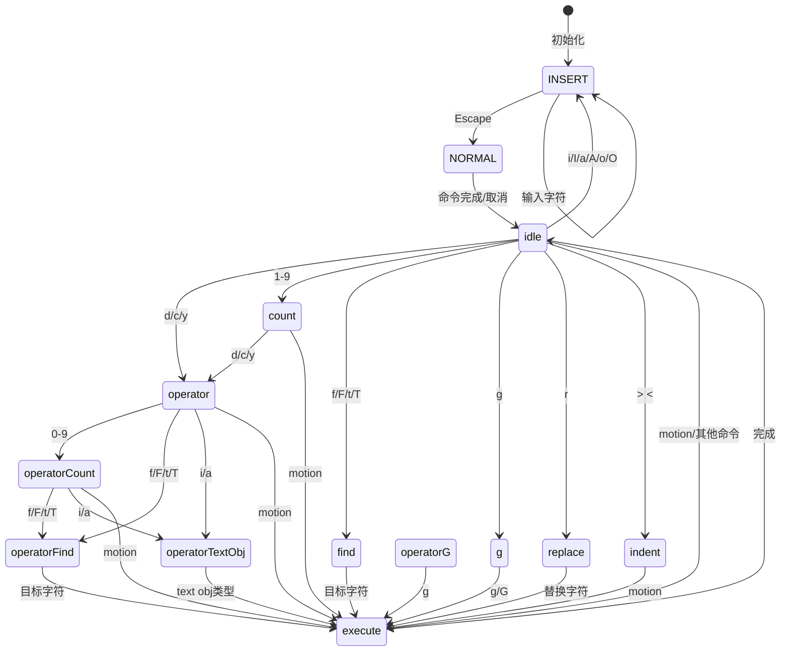
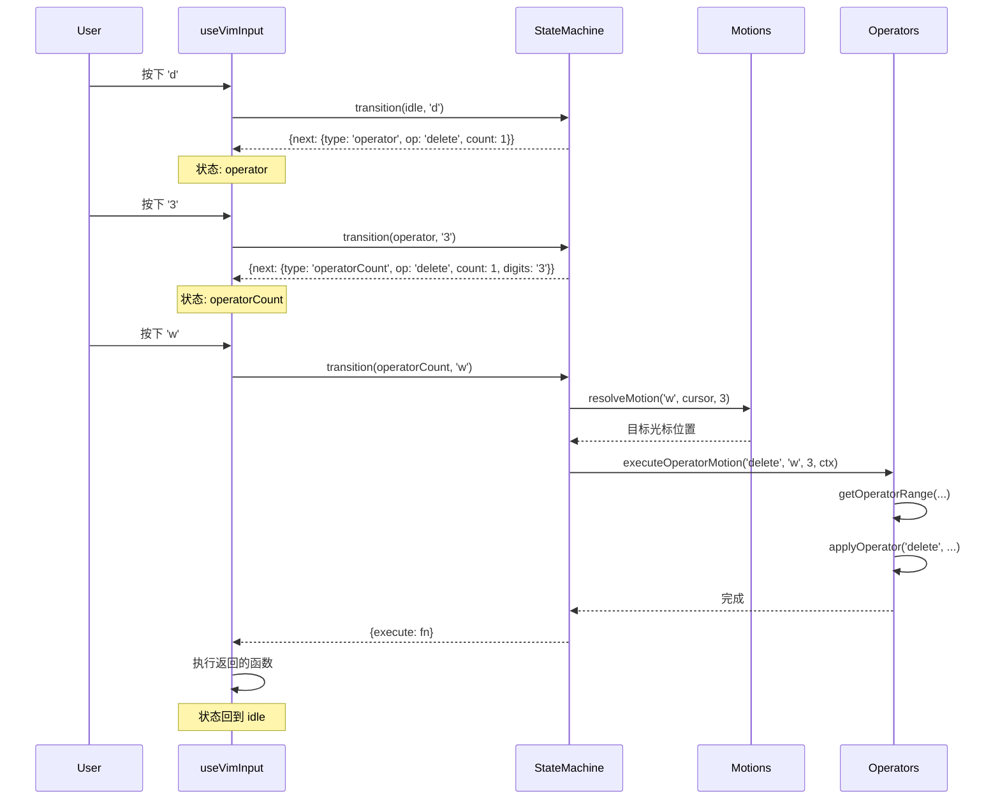

Claude Code 的 Vim 模式并非简单的按键映射，而是一个完整的状态机驱动系统，实现了 Vim 编辑器的核心操作模型。该系统将 Vim 的复杂交互分解为 **motion**（移动）、**operator**（操作符）和 **text objects**（文本对象）三个正交的概念，通过状态机协调它们之间的组合，实现了 `d3w`（删除三个词）、`ci"`（修改引号内容）等复杂命令的精确解析与执行。

## 架构概览：状态机驱动的命令解析

Vim 模式的核心是一个状态机，它追踪当前模式（INSERT/NORMAL）和命令构建过程。状态机定义在 [types.ts](src/vim/types.ts#L34-L83) 中，通过类型系统强制完整性检查，确保每个状态都有明确的处理逻辑。



状态机的实现采用函数式设计，[transitions.ts](src/vim/transitions.ts#L48-L66) 中的 `transition` 函数根据当前状态类型分派到对应的处理函数。每个状态转换函数返回 `TransitionResult`，包含可选的下一个状态和执行函数，这种设计使得状态转换逻辑易于测试和扩展。

**Sources**: [types.ts](src/vim/types.ts#L1-L200), [transitions.ts](src/vim/transitions.ts#L1-L200)

## Motion 系统：纯函数式的光标移动

Motion 是 Vim 中描述光标移动的抽象，包括基本的 `h`/`l`/`j`/`k` 移动、词级移动 `w`/`b`/`e`、行首尾 `0`/`$` 等。Claude Code 的实现将所有 motion 封装为纯函数，接收当前光标和重复次数，返回新光标位置，**不产生任何副作用**。

[motions.ts](src/vim/motions.ts#L9-L47) 中的 `resolveMotion` 函数是 motion 系统的入口，它通过循环应用单步 motion 来支持计数前缀（如 `3w` 移动三个词）。核心的单步移动函数 `applySingleMotion` 通过模式匹配分发到 Cursor 类的对应方法：

```typescript
function applySingleMotion(key: string, cursor: Cursor): Cursor {
  switch (key) {
    case 'h': return cursor.left()
    case 'l': return cursor.right()
    case 'j': return cursor.downLogicalLine()
    case 'k': return cursor.upLogicalLine()
    case 'w': return cursor.nextVimWord()
    case 'b': return cursor.prevVimWord()
    case 'e': return cursor.endOfVimWord()
    // ... 更多 motion
  }
}
```

**Motion 分类与 Operator 交互**

Motion 分为三种类型，影响它们与 operator 组合时的行为：

| 类型 | Motion | 与 Operator 组合时的行为 |
|------|--------|------------------------|
| **排他型** | `h`, `l`, `w`, `b`, `W`, `B` | 操作范围不包含终点字符 |
| **包含型** | `e`, `E`, `$` | 操作范围包含终点字符 |
| **行级** | `j`, `k`, `G`, `gg` | 操作整行而非字符范围 |

这种分类通过 [motions.ts](src/vim/motions.ts#L49-L63) 中的 `isInclusiveMotion` 和 `isLinewiseMotion` 辅助函数判断，在 operator 执行时决定如何计算操作范围。

**Sources**: [motions.ts](src/vim/motions.ts#L1-L83)

## Operator 系统：delete/change/yank 的统一执行

Operator（`d` 删除、`c` 修改、`y` 复制）是 Vim 操作模型的核心。Claude Code 将 operator 实现为独立的执行函数，它们接收操作范围和上下文，执行实际的文本修改。这种设计允许 operator 与任何 motion 或 text object 组合，而不需要为每种组合编写专门代码。

[operators.ts](src/vim/operators.ts#L24-L40) 定义了 `OperatorContext`，包含执行操作所需的所有依赖：光标对象、文本内容、修改回调、寄存器访问等。这种依赖注入模式使得 operator 函数易于测试，因为可以传入模拟的上下文对象。

**Operator 与 Motion 的组合**

`executeOperatorMotion` 函数展示了 operator 与 motion 的组合流程：

```typescript
export function executeOperatorMotion(
  op: Operator,
  motion: string,
  count: number,
  ctx: OperatorContext,
): void {
  // 1. 计算 motion 目标位置
  const target = resolveMotion(motion, ctx.cursor, count)
  
  // 2. 根据 motion 类型计算操作范围
  const range = getOperatorRange(ctx.cursor, target, motion, op, count)
  
  // 3. 应用操作（删除/修改/复制）
  applyOperator(op, range.from, range.to, ctx, range.linewise)
  
  // 4. 记录变更以支持 dot-repeat
  ctx.recordChange({ type: 'operator', op, motion, count })
}
```

关键步骤是 `getOperatorRange`，它根据 motion 类型（排他/包含/行级）调整操作范围的起止位置，确保符合 Vim 的语义。例如，`dw` 删除到下一个词首但不包含那个字符，而 `de` 删除到词尾并包含最后一个字符。

**行级操作的特殊处理**

当 operator 与行级 motion 组合时（如 `dd`、`yy`），系统调用专门的 `executeLineOp` 函数。这个函数处理整行操作的特殊语义：删除最后一行时避免留下空行、复制时在内容末尾添加换行符以便后续粘贴识别、修改时清空行而非删除行以保持光标在当前行。

**Sources**: [operators.ts](src/vim/operators.ts#L1-L200)

## Text Objects：结构化的文本范围选择

Text objects（文本对象）是 Vim 的强大特性，允许基于语义结构选择文本，如 `iw`（内词）、`a"`（包含引号）、`i(`（括号内）。Claude Code 的实现在 [textObjects.ts](src/vim/textObjects.ts#L1-L187) 中，提供了 `findTextObject` 函数，根据对象类型和位置返回文本范围。

**Text Object 类型分类**

| 类型 | 对象标识符 | 实现方式 | 示例 |
|------|-----------|---------|------|
| **词对象** | `w`, `W` | 扫描字符类别（词字符/空白/标点） | `diw` 删除光标下的词 |
| **引号对象** | `"`, `'`, `` ` `` | 在当前行查找匹配的引号对 | `ci"` 修改双引号内容 |
| **括号对象** | `()`, `[]`, `{}`, `<>` | 深度优先搜索匹配的开闭括号 | `da(` 删除括号及内容 |

**词对象的实现细节**

词对象（`w`/`W`）的实现需要处理 Unicode grapheme cluster（字素簇），因为单个视觉字符可能由多个 Unicode 码点组成。[textObjects.ts](src/vim/textObjects.ts#L45-L111) 使用 `getGraphemeSegmenter` 将文本预分割为 grapheme，然后基于字符类别（词字符、空白、标点）扩展选择范围：

```typescript
function findWordObject(
  text: string,
  offset: number,
  isInner: boolean,
  isWordChar: (ch: string) => boolean,
): TextObjectRange {
  // 1. 将文本分割为 grapheme 数组
  const graphemes = [...getGraphemeSegmenter().segment(text)]
  
  // 2. 找到光标所在的 grapheme 索引
  let graphemeIdx = findGraphemeIndex(graphemes, offset)
  
  // 3. 根据字符类别向两侧扩展
  if (isWord(graphemeIdx)) {
    while (startIdx > 0 && isWord(startIdx - 1)) startIdx--
    while (endIdx < graphemes.length && isWord(endIdx)) endIdx++
  }
  
  // 4. 如果是 "around" 模式，包含周围空白
  if (!isInner) {
    // 优先包含尾部空白，否则包含头部空白
  }
  
  return { start: offsetAt(startIdx), end: offsetAt(endIdx) }
}
```

**括号匹配的深度优先搜索**

括号对象需要正确处理嵌套结构。[textObjects.ts](src/vim/textObjects.ts#L155-L187) 使用双向扫描：先向后搜索匹配的开括号（维护深度计数器），再向前搜索匹配的闭括号。这种方法能正确处理嵌套的 `(())` 或 `{{}}` 结构。

**Sources**: [textObjects.ts](src/vim/textObjects.ts#L1-L187)

## 状态转换与命令解析流程

命令的完整生命周期从用户按键开始，经过状态机解析，最终执行操作。以 `d3w`（删除三个词）为例，展示状态转换流程：



[useVimInput.ts](src/hooks/useVimInput.ts#L94-L202) 中的 `handleVimInput` 函数是输入处理的入口，它将原始输入和按键信息传递给状态机。关键设计点：

1. **INSERT 模式**：直接将输入传递给底层文本输入处理器，同时追踪插入的文本以支持 dot-repeat
2. **NORMAL 模式**：调用 `transition` 函数解析命令，根据返回结果更新状态或执行操作
3. **模式切换**：`switchToInsertMode` 和 `switchToNormalMode` 函数处理模式转换时的副作用（如退出 INSERT 时向左移动光标）

**Escape 键的特殊处理**

Escape 键的行为被硬编码，不通过快捷键系统配置。这是有意为之的设计：Vim 用户期望 Escape 总是从 INSERT 切换到 NORMAL，这是 Vim 身份的核心部分，不应该被用户重新映射。

**Sources**: [useVimInput.ts](src/hooks/useVimInput.ts#L1-L317)

## Dot-repeat 机制：记录与重放变更

Vim 的 `.` 命令允许重复上一次变更，这是提升编辑效率的关键特性。Claude Code 通过 `RecordedChange` 类型系统实现 dot-repeat，每种可重复的操作都被记录为结构化数据。

[types.ts](src/vim/types.ts#L85-L107) 定义了 `RecordedChange` 联合类型，覆盖所有可重复的操作：

```typescript
export type RecordedChange =
  | { type: 'insert'; text: string }
  | { type: 'operator'; op: Operator; motion: string; count: number }
  | { type: 'operatorTextObj'; op: Operator; objType: string; scope: TextObjScope; count: number }
  | { type: 'replace'; char: string; count: number }
  | { type: 'x'; count: number }
  // ... 更多操作类型
```

**变更记录与重放**

在 [useVimInput.ts](src/hooks/useVimInput.ts#L107-L159) 中，`replayLastChange` 函数根据记录的变更类型调用对应的执行函数。关键是传递 `isReplay: true` 标志给 `createOperatorContext`，这会禁用二次记录，避免 dot-repeat 自身被记录。

**持久状态管理**

`PersistentState` 对象（[types.ts](src/vim/types.ts#L78-L83)）存储跨命令的生命周期数据：
- `lastChange`：用于 dot-repeat
- `lastFind`：用于 `;` 和 `,` 重复查找
- `register` 和 `registerIsLinewise`：用于粘贴操作

这种设计将临时状态（VimState）和持久状态分离，使得状态机保持简洁，同时支持跨命令的功能。

**Sources**: [types.ts](src/vim/types.ts#L78-L107), [useVimInput.ts](src/hooks/useVimInput.ts#L107-L159)

## 集成到输入系统：VimTextInput 组件

[VimTextInput.tsx](src/components/VimTextInput.tsx#L1-L140) 是将 Vim 模式集成到 UI 层的 React 组件。它作为薄包装层，将 `useVimInput` hook 返回的状态传递给底层的 `BaseTextInput` 组件。

组件的职责清晰分离：
1. **模式初始化**：通过 `initialMode` prop 支持从指定模式启动
2. **主题集成**：根据终端焦点状态调整光标渲染（聚焦时反色，否则普通显示）
3. **剪贴板提示**：调用 `useClipboardImageHint` hook 提供图片粘贴提示
4. **状态转发**：将 Vim 特定的 props（`onModeChange`, `onUndo`）传递给 hook

**模式切换的回调机制**

`onModeChange` 回调允许父组件响应模式变化，例如在 UI 中显示当前模式指示器。这种设计保持了组件的可组合性，父组件不需要直接访问内部状态。

**Sources**: [VimTextInput.tsx](src/components/VimTextInput.tsx#L1-L140)

## Cursor 类：文本操作的底层抽象

Vim 模式的所有文本操作都依赖于 [Cursor.ts](src/utils/Cursor.ts#L1-L100) 中的 `Cursor` 类，它封装了文本位置和操作逻辑。Cursor 对象是不可变的，所有操作返回新的 Cursor 实例，这避免了副作用并简化了状态管理。

Cursor 类提供的方法覆盖了 Vim motion 的所有需求：
- 基本移动：`left()`, `right()`, `up()`, `down()`
- 行级操作：`startOfLogicalLine()`, `endOfLogicalLine()`, `downLogicalLine()`
- 词级移动：`nextVimWord()`, `prevVimWord()`, `endOfVimWord()`
- 查找操作：`findCharacter()`（支持 `f/F/t/T` 命令）

**Unicode 正确性**

Cursor 类使用 grapheme segmenter 处理 Unicode 文本，确保复杂字符（如 emoji、组合字符）被视为单个单元。这对于国际化支持和正确处理现代文本内容至关重要。

**Sources**: [Cursor.ts](src/utils/Cursor.ts#L1-L100)

## 扩展 Vim 模式：添加新的 Motion 或 Operator

系统的模块化设计使得添加新功能相对直接。添加新 motion 的步骤：

1. **在 Cursor 类中实现移动逻辑**：例如添加 `nextSentence()` 方法
2. **在 motions.ts 中注册**：在 `applySingleMotion` 的 switch 语句中添加新 case
3. **更新类型定义**：如果需要新的 motion 分类，在 `SIMPLE_MOTIONS` 或相关集合中添加
4. **测试状态转换**：确保新 motion 能正确与 operator 组合

添加新 operator 的流程类似，但需要额外处理寄存器操作和变更记录。系统的类型安全性确保了添加新功能时不会破坏现有行为。

**Sources**: [motions.ts](src/vim/motions.ts#L9-L47), [operators.ts](src/vim/operators.ts#L1-L200)

---

**相关主题**：
- 想了解 Vim 模式如何集成到整体输入系统？参阅 [PromptInput：用户输入处理与模式切换](31-promptinput-yong-hu-shu-ru-chu-li-yu-mo-shi-qie-huan)
- 想了解快捷键系统如何与 Vim 模式共存？参阅 [键盘绑定系统：快捷键配置与匹配](32-jian-pan-bang-ding-xi-tong-kuai-jie-jian-pei-zhi-yu-pi-pei)
- 想了解 Cursor 类的完整实现？探索 [src/utils/Cursor.ts](src/utils/Cursor.ts)