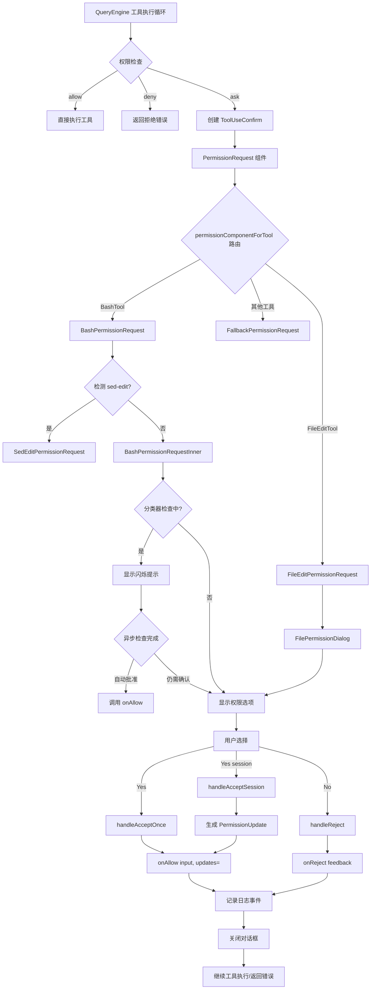

PermissionRequest 组件是 Claude Code 中所有用户交互权限请求的核心枢纽，负责将工具执行前的权限检查转化为用户可理解的对话框，并根据用户决策执行相应的权限更新或操作拒绝。该组件采用**工具路由模式**，根据不同的工具类型（Bash、FileEdit、FileWrite 等）自动选择对应的权限请求组件，实现了统一的权限交互入口和多样化的权限选项呈现。

## 架构设计：三层组件模型

PermissionRequest 采用三层架构实现权限请求的统一处理：

**第一层：路由分发层**（`PermissionRequest.tsx`）作为入口点，通过 `permissionComponentForTool` 函数将工具实例映射到对应的权限请求组件。路由表基于工具类型进行静态映射，例如 `BashTool` 映射到 `BashPermissionRequest`，`FileEditTool` 映射到 `FileEditPermissionRequest`，未识别的工具则回退到 `FallbackPermissionRequest`。路由逻辑在编译时确定，利用 TypeScript 的 switch-case 类型收窄确保所有工具分支都被正确处理。

**第二层：对话框容器层**（`PermissionDialog.tsx` + `PermissionRequestTitle.tsx`）提供统一的视觉框架。`PermissionDialog` 使用 Ink 的 `Box` 组件构建带边框的对话框容器，支持自定义主题颜色、标题、副标题和内部填充。`PermissionRequestTitle` 负责渲染标题和可选的工作者徽章（用于多代理场景中标识权限请求来源），标题颜色默认使用 `permission` 主题色，支持通过 `titleColor` 属性覆盖。

**第三层：业务逻辑层**（各具体权限组件）处理特定工具的权限交互细节。例如 `BashPermissionRequest` 集成了命令解析、sed-edit 检测、分类器自动审批逻辑；`FilePermissionDialog` 提供文件路径显示、IDE diff 预览、多种权限选项（单次允许、会话允许、拒绝）等功能。每个业务组件都实现统一的 `PermissionRequestProps` 接口，确保与路由层的无缝对接。

Sources: [PermissionRequest.tsx](src/components/permissions/PermissionRequest.tsx#L84-L124), [PermissionDialog.tsx](src/components/permissions/PermissionDialog.tsx#L22-L71), [PermissionRequestTitle.tsx](src/components/permissions/PermissionRequestTitle.tsx#L21-L66)

## 数据流：ToolUseConfirm 到用户决策

权限请求的数据流始于 `ToolUseConfirm` 对象的创建，该对象在 QueryEngine 的工具执行循环中构造，包含完整的上下文信息：

```typescript
type ToolUseConfirm<Input> = {
  assistantMessage: AssistantMessage    // 触发工具调用的消息
  tool: Tool<Input>                     // 工具实例
  description: string                   // 工具用途描述
  input: z.infer<Input>                 // 解析后的工具输入
  toolUseContext: ToolUseContext        // 工具执行上下文
  toolUseID: string                     // 唯一标识符
  permissionResult: PermissionDecision  // 权限检查结果
  permissionPromptStartTimeMs: number   // 提示开始时间
  
  // 分类器相关字段
  classifierCheckInProgress?: boolean
  classifierAutoApproved?: boolean
  classifierMatchedRule?: string
  
  // 回调函数
  onUserInteraction(): void
  onAbort(): void
  onAllow(updatedInput, permissionUpdates, feedback?, contentBlocks?): void
  onReject(feedback?, contentBlocks?): void
  recheckPermission(): Promise<void>
}
```

`PermissionDecision` 包含三种行为类型：`allow`（直接允许）、`deny`（拒绝并终止）、`ask`（需要用户确认）。当行为为 `ask` 时，`PermissionRequest` 组件被激活，展示对话框并等待用户交互。用户选择后，`onAllow` 或 `onReject` 回调被触发，携带 `PermissionUpdate` 数组用于更新权限规则（例如添加会话级规则避免重复询问），以及可选的 `feedback` 字符串传递用户的额外指示。

权限更新通过 `PermissionUpdate` 联合类型表达，支持六种操作：`addRules`（添加规则）、`replaceRules`（替换规则）、`removeRules`（移除规则）、`setMode`（设置权限模式）、`addDirectories`（添加工作目录）、`removeDirectories`（移除工作目录）。每个操作都指定 `destination`（更新目标：userSettings、projectSettings、localSettings、session、cliArg），实现灵活的权限配置持久化策略。

Sources: [PermissionRequest.tsx](src/components/permissions/PermissionRequest.tsx#L39-L70), [permissions.ts](src/types/permissions.ts#L108-L165), [permissions.ts](src/types/permissions.ts#L175-L199)

## 工具路由映射表

`permissionComponentForTool` 函数定义了工具到权限组件的静态映射关系。以下表格展示了主要工具及其对应的权限请求组件：

| 工具类 | 权限请求组件 | 特殊功能 |
|--------|-------------|---------|
| `FileEditTool` | `FileEditPermissionRequest` | Diff 预览、IDE 集成、多范围编辑 |
| `FileWriteTool` | `FileWritePermissionRequest` | 文件创建/覆盖警告、IDE diff |
| `BashTool` | `BashPermissionRequest` | 命令解析、sed-edit 检测、分类器自动审批 |
| `PowerShellTool` | `PowerShellPermissionRequest` | Windows 命令权限控制 |
| `NotebookEditTool` | `NotebookEditPermissionRequest` | Jupyter cell 编辑预览 |
| `GlobTool`/`GrepTool`/`FileReadTool` | `FilesystemPermissionRequest` | 文件系统只读操作 |
| `WebFetchTool` | `WebFetchPermissionRequest` | 外部 URL 访问控制 |
| `EnterPlanModeTool` | `EnterPlanModePermissionRequest` | 计划模式切换确认 |
| `ExitPlanModeV2Tool` | `ExitPlanModePermissionRequest` | 计划审查与批准 |
| `SkillTool` | `SkillPermissionRequest` | 技能执行权限 |
| `AskUserQuestionTool` | `AskUserQuestionPermissionRequest` | 多选问题导航 |
| 其他工具 | `FallbackPermissionRequest` | 通用权限请求 UI |

映射逻辑通过 `switch (tool)` 语句实现，每个 case 分支返回对应的 React 组件类型。特性开关控制的工具（如 `ReviewArtifactTool`、`WorkflowTool`、`MonitorTool`）通过动态 `require` 加载，并在特性未启用时回退到 `FallbackPermissionRequest`。

Sources: [PermissionRequest.tsx](src/components/permissions/PermissionRequest.tsx#L84-L124)

## BashPermissionRequest：智能命令审批

`BashPermissionRequest` 是最复杂的权限请求组件，实现了 Bash 命令的智能审批流程。组件首先通过 `parseSedEditCommand` 检测命令是否为 sed 流编辑操作，如果是则重定向到 `SedEditPermissionRequest` 以提供专门的文件编辑预览。对于常规 Bash 命令，组件进入 `BashPermissionRequestInner` 处理核心逻辑。

组件集成了**分类器自动审批**机制：当 `classifierCheckInProgress` 为 true 时，显示 "Attempting to auto-approve..." 的动态闪烁提示（通过 `useShimmerAnimation` 实现 20fps 动画），同时后台异步检查命令是否匹配已知的自动审批规则。分类器检查通过 `recheckPermission` 回调触发，可能将 `permissionResult.behavior` 从 `ask` 更新为 `allow`，从而自动关闭对话框并继续执行。

权限选项通过 `bashToolUseOptions` 函数生成，根据命令特征提供不同的选项集合：
- **基础选项**：Yes（单次允许）、No（拒绝）
- **会话选项**：Yes for session（会话期间允许同类命令）
- **智能选项**：基于命令前缀（如 `git`、`npm`）生成 "Yes, allow all [prefix] commands" 选项
- **危险命令警告**：对于 `rm -rf`、`sudo` 等命令显示额外的警告信息

用户选择后，`useShellPermissionFeedback` hook 处理反馈输入模式切换（按 Tab 展开 "tell Claude what to do next" 输入框），并调用 `onAllow` 或 `onReject` 回调传递用户决策和可选的反馈文本。

Sources: [BashPermissionRequest.tsx](src/components/permissions/BashPermissionRequest/BashPermissionRequest.tsx#L27-L150), [BashPermissionRequest.tsx](src/components/permissions/BashPermissionRequest/BashPermissionRequest.tsx#L39-L65)

## FilePermissionDialog：统一文件操作权限

`FilePermissionDialog` 是文件相关权限请求的基础组件，被 `FileEditPermissionRequest`、`FileWritePermissionRequest`、`NotebookEditPermissionRequest` 等复用。组件通过 `useFilePermissionDialog` hook 管理对话框状态和权限选项生成。

权限选项由 `getFilePermissionOptions` 函数根据文件路径和操作类型动态生成。核心逻辑包括：

1. **路径分类**：通过 `pathInAllowedWorkingPath` 判断文件是否在工作目录内，通过 `isInClaudeFolder` 和 `isInGlobalClaudeFolder` 检测是否为 `.claude/` 配置目录文件。

2. **选项生成策略**：
   - **工作目录内**：提供 "Yes"（单次）、"Yes, allow all edits during this session"（会话级）
   - **工作目录外**：显示目录名称，如 "Yes, allow all edits in [dirname]/ during this session"
   - **.claude/ 目录**：特殊选项 "Yes, and allow Claude to edit its own settings for this session"，用于允许 Claude 修改自身配置文件
   - **只读操作**：简化选项为 "Yes, during this session"（无 "edits" 字样）

3. **反馈输入模式**：支持 `yesInputMode` 和 `noInputMode` 状态，按 Tab 键切换到输入模式，提供 "tell Claude what to do next" 或 "tell Claude what to do differently" 的占位符提示。

权限处理通过 `PERMISSION_HANDLERS` 映射表分发到三个处理函数：
- `handleAcceptOnce`：记录日志并调用 `toolUseConfirm.onAllow`，无权限更新
- `handleAcceptSession`：生成 `PermissionUpdate` 数组（通过 `generateSuggestions` 函数），调用 `onAllow` 传递更新
- `handleReject`：记录拒绝日志，调用 `onReject` 并传递反馈文本

Sources: [FilePermissionDialog.tsx](src/components/permissions/FilePermissionDialog/FilePermissionDialog.tsx#L47-L150), [permissionOptions.tsx](src/components/permissions/FilePermissionDialog/permissionOptions.tsx#L56-L177), [usePermissionHandler.ts](src/components/permissions/FilePermissionDialog/usePermissionHandler.ts#L94-L186)

## PermissionPrompt：通用交互提示

`PermissionPrompt` 是通用的权限提示组件，被多个权限请求组件复用以提供标准化的 "Do you want to proceed?" 交互界面。组件接收 `PermissionPromptOption<T>` 数组，每个选项包含 `value`、`label`、可选的 `feedbackConfig` 和 `keybinding`。

反馈配置（`feedbackConfig`）定义了选项的反馈类型（`accept` 或 `reject`）和占位符文本。当用户聚焦到配置了反馈的选项时，组件显示 "Press Tab to add instructions" 提示（通过 `showTabHint` 状态控制）。按 Tab 键触发 `handleInputModeToggle`，将选项转换为输入类型，显示文本输入框。

输入模式切换时，组件调用 `setAcceptInputMode` 或 `setRejectInputMode` 状态更新，并记录分析事件：
- `tengu_accept_feedback_mode_entered` / `tengu_reject_feedback_mode_entered`：进入反馈输入模式
- `tengu_accept_feedback_mode_collapsed` / `tengu_reject_feedback_mode_collapsed`：退出反馈输入模式

用户提交选择时，`handleSelect` 函数提取对应选项的反馈文本（从 `acceptFeedback` 或 `rejectFeedback` 状态），修剪空白后通过 `onSelect(value, feedback)` 回调传递。同时记录 `tengu_accept_submitted` 或 `tengu_reject_submitted` 事件，包含反馈长度和是否进入过反馈模式的元数据。

Sources: [PermissionPrompt.tsx](src/components/permissions/PermissionPrompt.tsx#L28-L200)

## 权限解释与规则可视化

权限请求对话框集成了两个辅助系统帮助用户理解权限决策的原因：

**PermissionRuleExplanation** 组件解析 `PermissionDecisionReason` 并生成人类可读的解释文本。决策原因类型包括：
- **rule**：权限规则要求确认，显示规则内容和配置路径（`/permissions`）
- **hook**：Hook 函数要求确认，显示 Hook 名称、原因和来源
- **classifier**：分类器要求确认，显示分类器类型和匹配原因
- **safetyCheck**：安全检查要求确认，显示检查原因
- **workingDir**：工作目录限制要求确认

解释文本使用 `chalk` 库高亮关键信息（规则名称、Hook 名称），通过 `<Ansi>` 组件渲染 ANSI 颜色代码。当决策来源为 `policySettings` 时，隐藏配置路径提示（用户无法修改策略设置）。

**PermissionExplanation** 组件（通过 `usePermissionExplainerUI` hook 激活）提供基于 LLM 的自然语言解释。用户按 `Ctrl+E` 触发解释生成，组件调用 `generatePermissionExplanation` 函数（异步调用 LLM API）分析工具名称、输入和上下文，返回风险等级（LOW/MEDIUM/HIGH）和解释文本。解释内容在对话框底部展开，使用风险等级对应的主题色（success/warning/error）渲染。该功能通过 `isPermissionExplainerEnabled` 特性开关控制，仅在内部构建中启用。

Sources: [PermissionRuleExplanation.tsx](src/components/permissions/PermissionRuleExplanation.tsx#L23-L80), [PermissionExplanation.tsx](src/components/permissions/PermissionExplanation.tsx#L56-L100)

## 日志记录与分析

权限请求系统集成了完整的日志记录机制，通过 `usePermissionRequestLogging` hook 自动记录权限提示事件。Hook 在组件挂载时（`useEffect` 中）执行以下操作：

1. **权限提示计数**：调用 `setAppState` 增加 `attribution.permissionPromptCount`，用于归属追踪（分析权限提示对用户行为的影响）。

2. **通用分析事件**：记录 `tengu_tool_use_show_permission_request` 事件，包含消息 ID、工具名称、是否为 MCP 工具、决策原因类型、沙箱启用状态等元数据。

3. **Ant 内部事件**：当 `USER_TYPE === 'ant'` 时，记录额外的内部事件：
   - `tengu_internal_tool_use_permission_request_no_always_allow`：Bash 工具权限请求未提供 "always allow" 规则建议
   - `tengu_internal_bash_tool_use_permission_request`：Bash 工具权限请求详情，包含命令分词结果和决策原因

4. **Unary 事件**：调用 `logUnaryEvent` 记录权限提示的 completion_type、event 类型、平台信息和消息 ID，用于内部指标计算。

日志记录通过 `loggedToolUseID` ref 去重，避免 `toolUseConfirm` 对象引用变化导致的重复日志。组件使用 `useNotifyAfterTimeout` hook 在权限提示显示超过 5 秒后发送桌面通知，通知消息通过 `getNotificationMessage` 函数根据工具类型生成（例如 "Claude needs your permission to use Bash"）。

Sources: [hooks.ts](src/components/permissions/hooks.ts#L59-L210), [utils.ts](src/components/permissions/utils.ts#L8-L26), [PermissionRequest.tsx](src/components/permissions/PermissionRequest.tsx#L127-L134)

## 完整的权限请求流程

以下流程图展示了从工具调用到用户决策的完整权限请求生命周期：



该流程展示了权限请求系统的核心设计原则：**延迟决策**（仅在需要时创建对话框）、**异步优化**（分类器后台检查避免阻塞 UI）、**灵活配置**（单次/会话/持久化三级权限）、**完整追踪**（日志记录覆盖所有决策路径）。

Sources: [PermissionRequest.tsx](src/components/permissions/PermissionRequest.tsx#L127-L212), [BashPermissionRequest.tsx](src/components/permissions/BashPermissionRequest/BashPermissionRequest.tsx#L93-L150), [usePermissionHandler.ts](src/components/permissions/FilePermissionDialog/usePermissionHandler.ts#L94-L186)

## 相关页面导航

权限请求对话框与 Claude Code 的其他核心系统紧密集成，建议按以下顺序深入阅读：

- **上游系统**：[权限模式系统：default、plan、auto、bypass 等模式解析](9-quan-xian-mo-shi-xi-tong-default-plan-auto-bypass-deng-mo-shi-jie-xi) 解释了权限检查的决策逻辑和模式切换机制。
- **工具执行**：[工具系统架构：从 Tool 接口到 40+ 工具实现](6-gong-ju-xi-tong-jia-gou-cong-tool-jie-kou-dao-40-gong-ju-shi-xian) 详细说明了工具的定义、注册和执行流程。
- **权限规则**：[权限请求流程：用户交互与决策传播](11-quan-xian-qing-qiu-liu-cheng-yong-hu-jiao-hu-yu-jue-ce-chuan-bo) 深入分析了权限规则的存储、更新和传播机制。
- **Bash 安全**：[Bash 工具安全：只读判定与后台执行策略](10-bash-gong-ju-an-quan-zhi-du-pan-ding-yu-hou-tai-zhi-xing-ce-lue) 揭示了 Bash 命令的安全检查和分类器实现。
- **MCP 集成**：[MCP 服务器审批流程：MCPServerApprovalDialog](35-mcp-fu-wu-qi-shen-pi-liu-cheng-mcpserverapprovaldialog) 展示了 MCP 工具的专用权限审批界面。
- **状态管理**：[AppState 设计：React 状态管理与订阅机制](12-appstate-she-ji-react-zhuang-tai-guan-li-yu-ding-yue-ji-zhi) 解释了权限上下文和工具权限状态的全局管理。