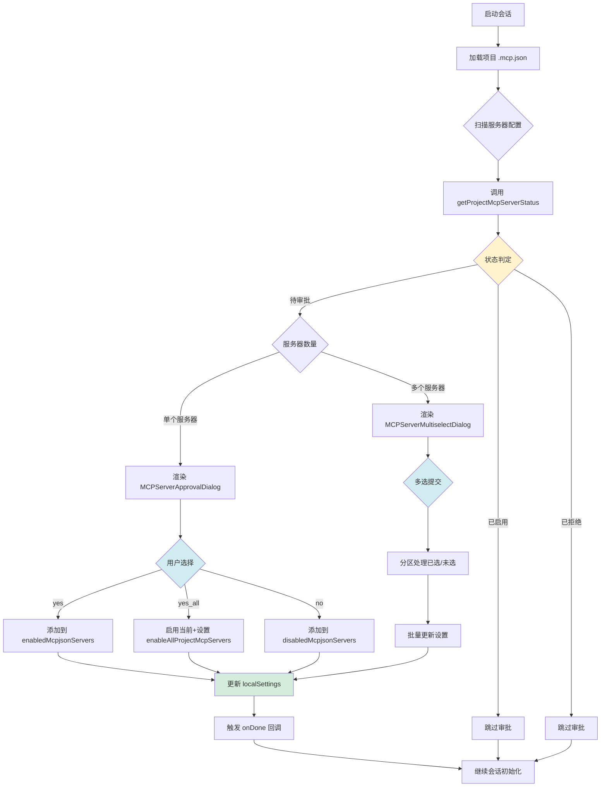
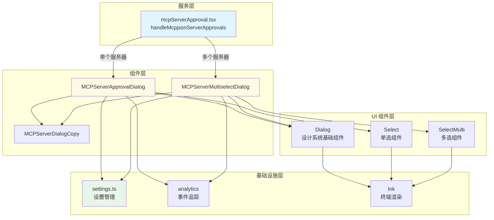
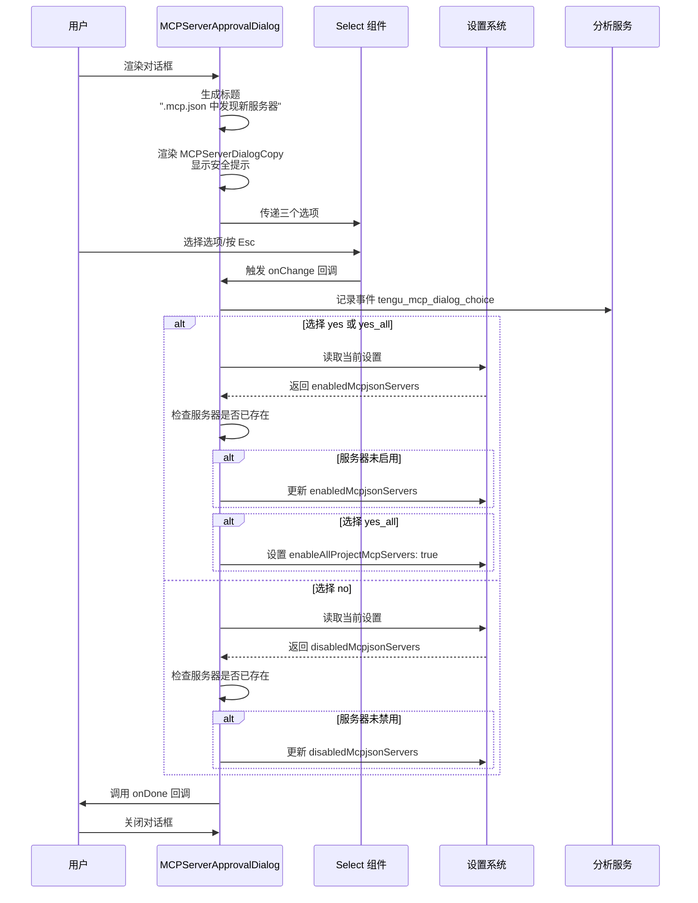

当 Claude Code 在项目的 `.mcp.json` 文件中发现新的 MCP（Model Context Protocol）服务器配置时，系统会自动触发审批流程。这是一个关键的安全机制，因为 MCP 服务器可能执行任意代码或访问系统资源，所有工具调用都需要用户批准。审批流程通过 `MCPServerApprovalDialog` 或 `MCPServerMultiselectDialog` 组件呈现交互界面，允许用户选择启用、拒绝或批量处理项目级别的 MCP 服务器，同时将决策持久化到本地设置中，确保后续会话能够自动应用这些安全策略。

Sources: [MCPServerApprovalDialog.tsx](src/components/MCPServerApprovalDialog.tsx#L1-L115), [mcpServerApproval.tsx](src/services/mcpServerApproval.tsx#L1-L41), [MCPServerDialogCopy.tsx](src/components/MCPServerDialogCopy.tsx#L1-L15)

## 审批流程架构概览

整个 MCP 服务器审批流程遵循清晰的状态机模型，从发现待审批服务器到用户决策持久化，每个环节都有明确的职责划分和安全检查。



Sources: [mcpServerApproval.tsx](src/services/mcpServerApproval.tsx#L14-L41), [utils.ts](src/services/mcp/utils.ts#L352-L411)

## 核心组件架构

### 组件职责划分

审批流程涉及三个核心 React 组件，每个组件承担特定的交互职责，共同构成完整的安全决策界面。

| 组件名称 | 文件路径 | 主要职责 | 使用场景 |
|---------|---------|---------|---------|
| **MCPServerApprovalDialog** | `src/components/MCPServerApprovalDialog.tsx` | 单服务器审批对话框，提供三种决策选项 | 仅发现 1 个待审批服务器 |
| **MCPServerMultiselectDialog** | `src/components/MCPServerMultiselectDialog.tsx` | 多服务器批量选择对话框，支持空间键多选 | 发现 2 个及以上待审批服务器 |
| **MCPServerDialogCopy** | `src/components/MCPServerDialogCopy.tsx` | 安全提示文本，包含 MCP 文档链接 | 被上述两个组件复用 |

Sources: [MCPServerApprovalDialog.tsx](src/components/MCPServerApprovalDialog.tsx#L1-L115), [MCPServerMultiselectDialog.tsx](src/components/MCPServerMultiselectDialog.tsx#L1-L133), [MCPServerDialogCopy.tsx](src/components/MCPServerDialogCopy.tsx#L1-L15)

### 组件依赖关系图



Sources: [MCPServerApprovalDialog.tsx](src/components/MCPServerApprovalDialog.tsx#L9-L21), [MCPServerMultiselectDialog.tsx](src/components/MCPServerMultiselectDialog.tsx#L5-L21), [Dialog.tsx](src/components/design-system/Dialog.tsx#L1-L100)

## 服务器状态判定逻辑

### 三态判定机制

`getProjectMcpServerStatus` 函数实现了核心的状态判定逻辑，返回 `'approved'`、`'rejected'` 或 `'pending'` 三种状态之一。该函数按照优先级顺序检查多个设置源，确保安全策略的正确应用。

**状态判定优先级**：
1. **显式拒绝**：检查 `disabledMcpjsonServers` 数组
2. **显式启用**：检查 `enabledMcpjsonServers` 数组或 `enableAllProjectMcpServers` 标志
3. **自动批准场景**：
   - 绕过权限模式（`--dangerously-skip-permissions`）且启用 `projectSettings`
   - 非交互式会话（SDK、`-p` 模式）且启用 `projectSettings`
4. **默认状态**：返回 `'pending'` 触发审批对话框

Sources: [utils.ts](src/services/mcp/utils.ts#L352-L411)

### 自动批准的安全边界

系统在两种特殊场景下会自动批准项目级 MCP 服务器，但这些场景都有严格的安全边界限制：

| 场景 | 触发条件 | 安全边界 | 配置源限制 |
|-----|---------|---------|-----------|
| **绕过权限模式** | `hasSkipDangerousModePermissionPrompt()` 返回 true | 必须同时启用 `projectSettings` | 仅检查 userSettings/localSettings/flagSettings/policySettings，**不检查** projectSettings |
| **非交互式会话** | `getIsNonInteractiveSession()` 返回 true | 必须同时启用 `projectSettings` | SDK 模式默认禁用 projectSettings，需显式启用 |

**安全设计要点**：
- **仓库级设置不能代用户做决策**：`hasSkipDangerousModePermissionPrompt()` 故意不检查 `projectSettings`，防止恶意仓库通过 `.claude/settings.json` 自动接受绕过对话框
- **会话绕过模式不适用**：不检查 `getSessionBypassPermissionsMode()`，因为该模式可能在对话框显示前被项目设置设置，导致 RCE 攻击风险

Sources: [utils.ts](src/services/mcp/utils.ts#L375-L411)

## 单服务器审批对话框

### 用户选项与行为映射

`MCPServerApprovalDialog` 为单个待审批服务器提供三种决策选项，每个选项对应不同的设置更新策略：

| 选项标签 | 选项值 | 设置更新操作 | 行为说明 |
|---------|-------|------------|---------|
| "Use this and all future MCP servers in this project" | `yes_all` | 1. 添加服务器到 `enabledMcpjsonServers`<br>2. 设置 `enableAllProjectMcpServers: true` | 启用当前服务器，并自动批准该项目中所有未来的 MCP 服务器 |
| "Use this MCP server" | `yes` | 添加服务器到 `enabledMcpjsonServers` | 仅启用当前服务器，未来服务器仍需审批 |
| "Continue without using this MCP server" | `no` | 添加服务器到 `disabledMcpjsonServers` | 拒绝当前服务器，会话中不加载该服务器的工具和资源 |

Sources: [MCPServerApprovalDialog.tsx](src/components/MCPServerApprovalDialog.tsx#L23-L57)

### 对话框渲染流程



Sources: [MCPServerApprovalDialog.tsx](src/components/MCPServerApprovalDialog.tsx#L23-L57), [Select.tsx](src/components/CustomSelect/select.tsx#L1-L50)

## 多服务器批量审批

### 分区处理策略

当项目中发现多个待审批 MCP 服务器时，系统会渲染 `MCPServerMultiselectDialog`，允许用户通过空格键多选要启用的服务器。该组件使用 **分区处理策略** 将服务器列表分为已批准和已拒绝两组，分别更新到不同的设置数组中。

**核心处理流程**：
1. 默认选中所有服务器（`defaultValue={serverNames}`）
2. 用户通过空格键取消选中不想启用的服务器
3. 提交时使用 `lodash/partition` 将原始 `serverNames` 数组分为：
   - **approvedServers**：用户选中的服务器（保留在选中列表中）
   - **rejectedServers**：用户取消选中的服务器（从选中列表移除）
4. 批量更新设置：
   - `approvedServers` → `enabledMcpjsonServers`（去重合并）
   - `rejectedServers` → `disabledMcpjsonServers`（去重合并）

Sources: [MCPServerMultiselectDialog.tsx](src/components/MCPServerMultiselectDialog.tsx#L22-L70)

### 键盘交互指南

多选对话框支持丰富的键盘交互，帮助用户快速完成批量审批：

| 快捷键 | 动作 | 说明 |
|-------|------|------|
| **Space** | 切换选中状态 | 在选中和取消选中之间切换当前高亮的服务器 |
| **Enter** | 确认提交 | 提交当前选中状态，选中的服务器将被启用 |
| **Esc** | 拒绝所有 | 将所有待审批服务器添加到 `disabledMcpjsonServers` |
| **↑/↓** | 导航 | 在服务器列表中上下移动高亮条 |

Sources: [MCPServerMultiselectDialog.tsx](src/components/MCPServerMultiselectDialog.tsx#L99-L114)

## 设置持久化机制

### localSettings 存储策略

所有审批决策都持久化到 `localSettings` 配置源中，该配置源存储在用户的全局 Claude 配置目录下，但作用域限定在当前项目。这意味着：

- **跨会话一致性**：用户在一个会话中的决策会在后续会话中自动应用
- **项目隔离**：不同项目的审批决策相互独立，不会相互影响
- **私有性保证**：`localSettings` 不会被提交到版本控制系统（通过 `.gitignore` 规则保证）

**设置更新 API**：
```typescript
updateSettingsForSource('localSettings', {
  enabledMcpjsonServers: [...enabledServers, serverName],
  // 或
  disabledMcpjsonServers: [...disabledServers, serverName],
  // 或
  enableAllProjectMcpServers: true
})
```

Sources: [MCPServerApprovalDialog.tsx](src/components/MCPServerApprovalDialog.tsx#L28-L56), [settings.ts](src/utils/settings/settings.ts#L1-L50)

### 名称规范化与去重

系统在判定服务器状态和更新设置时，会对服务器名称进行规范化处理，确保名称比较的一致性：

- **规范化函数**：`normalizeNameForMCP(serverName)` 将服务器名称转换为标准格式
- **去重逻辑**：使用 `new Set([...array])` 确保不会重复添加相同的服务器
- **状态匹配**：在检查 `enabledMcpjsonServers` 和 `disabledMcpjsonServers` 时，先规范化再比较

Sources: [utils.ts](src/services/mcp/utils.ts#L352-L380), [MCPServerMultiselectDialog.tsx](src/components/MCPServerMultiselectDialog.tsx#L39-L52)

## 审批流程触发时机

### 会话初始化集成

`handleMcpjsonServerApprovals` 函数在会话初始化阶段被调用，通过 Ink 的 `root.render()` 方法复用现有的渲染实例，而不是创建独立的渲染树。这种设计确保了：

- **性能优化**：避免重复创建 Ink 实例的开销
- **状态共享**：对话框可以访问应用的全局状态和键盘绑定
- **一致性体验**：对话框的样式和交互与应用其他部分保持一致

**调用模式**：
```typescript
await handleMcpjsonServerApprovals(root)
// 阻塞等待用户完成所有待审批服务器的决策
// 完成后继续会话初始化流程
```

Sources: [mcpServerApproval.tsx](src/services/mcpServerApproval.tsx#L14-L41)

### 条件渲染逻辑

系统根据待审批服务器的数量动态选择渲染哪个对话框组件：

| 待审批服务器数量 | 渲染组件 | 用户体验 |
|----------------|---------|---------|
| **0** | 无 | 直接跳过，不显示任何对话框 |
| **1** | `MCPServerApprovalDialog` | 显示三个选项的单选对话框 |
| **≥ 2** | `MCPServerMultiselectDialog` | 显示多选列表，支持批量处理 |

Sources: [mcpServerApproval.tsx](src/services/mcpServerApproval.tsx#L24-L41)

## 安全设计考量

### 防御恶意仓库攻击

审批流程的核心安全目标是防止恶意仓库通过 `.mcp.json` 配置执行任意代码。系统通过以下机制实现防御：

**多层防御策略**：
1. **默认拒绝**：未知服务器默认处于 `'pending'` 状态，必须显式批准
2. **用户显式同意**：所有批准操作都通过交互式对话框完成，用户必须主动选择
3. **安全提示**：对话框显示明确的警告信息，说明 MCP 服务器可能执行代码和访问资源
4. **文档链接**：提供 MCP 文档链接，帮助用户了解风险和最佳实践

Sources: [MCPServerDialogCopy.tsx](src/components/MCPServerDialogCopy.tsx#L6-L12), [utils.ts](src/services/mcp/utils.ts#L375-L411)

### 绕过模式的限制

即使在用户启用了 `--dangerously-skip-permissions` 绕过模式的情况下，系统仍然对项目级 MCP 服务器的自动批准施加限制：

**限制条件**：
- 必须同时启用 `projectSettings` 配置源
- `hasSkipDangerousModePermissionPrompt()` 故意不检查 `projectSettings`（防止仓库代用户做决策）
- 不检查会话级别的绕过模式（防止通过项目设置设置会话绕过标志）

**安全原理**：
项目级设置（`.claude/settings.json`）可能被仓库所有者控制，如果允许项目设置自动接受绕过对话框，攻击者可以通过克隆恶意仓库触发 RCE 攻击。系统通过只信任用户级别的设置源来规避这一风险。

Sources: [utils.ts](src/services/mcp/utils.ts#L383-L399)

## 分析追踪与可观测性

### 用户决策追踪

系统通过分析服务记录用户的审批决策，帮助团队了解 MCP 服务器的使用情况和安全态势：

**追踪事件**：
- **单服务器对话框**：`tengu_mcp_dialog_choice`，记录用户选择（`yes`、`yes_all`、`no`）
- **多服务器对话框**：`tengu_mcp_multidialog_choice`，记录批准和拒绝的服务器数量

**数据用途**：
- 评估 MCP 功能的采用率
- 识别潜在的安全风险模式
- 优化对话框的用户体验

Sources: [MCPServerApprovalDialog.tsx](src/components/MCPServerApprovalDialog.tsx#L25-L27), [MCPServerMultiselectDialog.tsx](src/components/MCPServerMultiselectDialog.tsx#L34-L38)

## 相关主题

要深入了解 MCP 协议的完整集成架构，建议阅读以下相关页面：

- **[MCP 客户端实现：连接管理与工具发现](15-mcp-ke-hu-duan-shi-xian-lian-jie-guan-li-yu-gong-ju-fa-xian)** - 了解 MCP 客户端如何建立连接并发现可用工具
- **[MCP 工具调用：MCPTool 与资源访问](16-mcp-gong-ju-diao-yong-mcptool-yu-zi-yuan-fang-wen)** - 深入理解审批后如何调用 MCP 工具和访问资源
- **[MCP 服务器配置与认证流程](17-mcp-fu-wu-qi-pei-zhi-yu-ren-zheng-liu-cheng)** - 学习如何配置 MCP 服务器和处理认证流程
- **[权限请求对话框：PermissionRequest 组件](34-quan-xian-qing-qiu-dui-hua-kuang-permissionrequest-zu-jian)** - 对比其他权限请求组件的设计模式