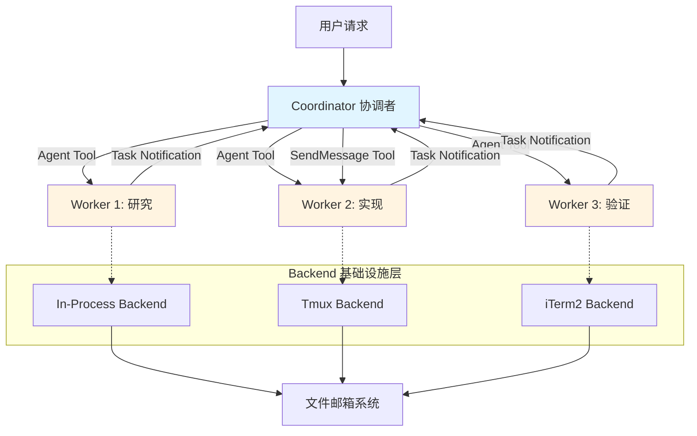

Claude Code 的多代理协调系统通过 **Coordinator 模式**实现了复杂任务的并行分解与协作执行。该系统允许一个协调者（Coordinator）管理多个工作代理（Worker），通过工具委派、消息传递和上下文隔离机制，构建了高度可扩展的智能代理团队架构。这种设计使得 Claude Code 能够处理需要并行研究、多层验证和跨模块协调的复杂软件工程任务。

## 核心架构：三层抽象模型

多代理系统建立在三个核心抽象层之上：**Coordinator 协调层**负责战略规划与任务分解，**Agent 执行层**处理具体任务的自主执行，**Backend 基础设施层**提供进程隔离与通信机制。这种分层设计确保了关注点分离——协调者专注于"做什么"和"何时做"，代理专注于"怎么做"，而基础设施透明地处理"在哪里运行"。



**Coordinator 模式**通过环境变量 `CLAUDE_CODE_COORDINATOR_MODE` 激活，启动后协调者获得访问 `Agent` 工具的权限，可以生成任意数量的工作代理。协调者的系统提示词明确规定了其角色定位：帮助用户达成目标、指导代理研究/实现/验证代码变更、综合结果并与用户沟通。关键原则是"**直接回答用户问题**——不要委派你无需工具就能处理的工作"，这确保了协调者不会过度工程化简单任务。

Sources: [coordinatorMode.ts](src/coordinator/coordinatorMode.ts#L1-L75)

## Agent 工具与 Worker 生命周期

`Agent` 工具是多代理系统的核心入口，协调者通过该工具生成工作代理并委派任务。工具接受 `description`（3-5 词任务描述）、`prompt`（详细任务指令）和可选的 `subagent_type`（代理类型）参数。当代理完成时，系统通过 `<task-notification>` XML 标签将结果作为用户角色消息发送回协调者，确保消息流与正常对话一致但可被系统识别。

```typescript
// 代理工具调用示例
Agent({
  description: "Investigate auth bug",
  subagent_type: "worker",
  prompt: "Investigate the auth module in src/auth/..."
})

// 任务完成通知格式
<task-notification>
<task-id>agent-a1b</task-id>
<status>completed|failed|killed</status>
<summary>Agent "Investigate auth bug" completed</summary>
<result>Found null pointer in src/auth/validate.ts:42...</result>
<usage>
  <total_tokens>15234</total_tokens>
  <tool_uses>12</tool_uses>
  <duration_ms>45678</duration_ms>
</usage>
</task-notification>
```

**Worker 的工具权限**受到严格限制，只能访问 `ASYNC_AGENT_ALLOWED_TOOLS` 集合中定义的工具，包括文件读写、Bash 执行、Grep/Glob 搜索、Web 搜索/抓取、技能调用等，但明确禁止递归调用 Agent 工具（防止无限嵌套）、访问 TaskOutput 工具（防止循环依赖）以及操作 Plan 模式（主线程抽象）。这种安全边界确保了代理行为可预测且不会破坏系统完整性。

Sources: [AgentTool.tsx](src/tools/AgentTool/AgentTool.tsx#L1-L100) [constants.ts](src/constants/tools.ts#L1-L100)

## 协调策略：并行执行与上下文综合

Coordinator 系统提示词强调"**并行性是你的超能力**"。协调者被指导在可能的情况下并发启动独立的工作代理——不要序列化可以同时运行的工作。对于只读任务（研究），可以自由并行；对于写密集型任务（实现），每个文件集一次一个；验证有时可以与实现并行运行在不同文件区域。

**任务工作流**被分解为四个阶段：**Research**（研究阶段，代理并行调查代码库）、**Synthesis**（综合阶段，协调者阅读发现并理解问题）、**Implementation**（实现阶段，代理按规格进行针对性修改）、**Verification**（验证阶段，代理证明代码有效）。协调者在综合阶段必须**亲自理解研究结果**，然后编写包含具体文件路径、行号和变更细节的实现规格，绝不能写"根据你的发现修复错误"这样懒惰的委派语句。

```typescript
// 反模式：懒惰委派（错误）
Agent({ prompt: "Based on your findings, fix the auth bug", ... })
Agent({ prompt: "The worker found an issue. Please fix it.", ... })

// 正确模式：综合规格（包含具体细节）
Agent({
  prompt: "Fix the null pointer in src/auth/validate.ts:42. The user field on Session (src/auth/types.ts:15) is undefined when sessions expire but the token remains cached. Add a null check before user.id access — if null, return 401 with 'Session expired'. Commit and report the hash.",
  ...
})
```

**继续 vs. 新建的决策矩阵**基于上下文重叠度：如果研究探索的文件正是需要编辑的文件，则**继续**（SendMessage）现有代理，因为它已有文件上下文且现在获得清晰计划；如果研究广泛但实现狭窄，则**新建**代理以避免拖累探索噪声；如果验证不同代理刚写的代码，则**新建**代理以获得全新视角，不应携带实现假设。没有通用默认值——必须思考代理的上下文有多少与下一个任务重叠。

Sources: [coordinatorMode.ts](src/coordinator/coordinatorMode.ts#L200-L370)

## Team 系统：团队结构与成员管理

当启用 **Agent Swarms** 功能时，Coordinator 模式扩展为完整的团队协作系统。团队由一个 **team-lead**（团队领导）和多个 **teammates**（队友）组成，团队配置存储在 `.claude/teams/{team_name}/config.json` 文件中。团队文件记录了创建时间、领导代理 ID、成员列表（包括代理 ID、名称、类型、模型、颜色、权限模式等）以及团队范围的允许路径规则。

**Backend 选择机制**决定了代理的运行环境。系统支持三种后端：**In-Process**（在同一 Node.js 进程中使用 AsyncLocalStorage 隔离上下文）、**Tmux**（在独立的 tmux 面板中运行）、**iTerm2**（使用 iTerm2 原生分屏功能）。后端选择通过 `detectBackend()` 函数自动进行：优先检测 iTerm2（如果在 iTerm2 中运行且 it2 CLI 可用），然后检测 tmux（如果 tmux 可用），最后回退到 In-Process。

```typescript
// Backend 类型定义
type BackendType = 'tmux' | 'iterm2' | 'in-process'

type PaneBackend = {
  readonly type: BackendType
  readonly displayName: string
  readonly supportsHideShow: boolean
  
  isAvailable(): Promise<boolean>
  isRunningInside(): Promise<boolean>
  createTeammatePaneInSwarmView(name: string, color: AgentColorName): Promise<CreatePaneResult>
  sendCommandToPane(paneId: PaneId, command: string): Promise<void>
  setPaneBorderColor(paneId: PaneId, color: AgentColorName): Promise<void>
  killPane(paneId: PaneId): Promise<boolean>
  // ... 更多方法
}
```

**In-Process Backend** 是最轻量的实现，适合快速生成代理且无需外部依赖。它使用 `AsyncLocalStorage` API 为每个队友创建隔离的执行上下文，通过 `runWithTeammateContext()` 函数在代理循环期间设置队友身份信息（agentId、agentName、teamName、color、planModeRequired）。这种设计允许队友共享资源（API 客户端、MCP 连接）同时保持独立的身份和状态。

Sources: [teamHelpers.ts](src/utils/swarm/teamHelpers.ts#L1-L200) [types.ts](src/utils/swarm/backends/types.ts#L1-L200) [InProcessBackend.ts](src/utils/swarm/backends/InProcessBackend.ts#L1-L150)

## 消息传递：文件邮箱系统

队友之间的通信通过**文件邮箱系统**实现，每个队友在 `.claude/teams/{team_name}/inboxes/{agent_name}.json` 拥有一个收件箱文件。其他队友可以使用 `SendMessage` 工具向收件箱写入消息，接收者在下一次查询循环时看到消息作为附件。邮箱系统使用文件锁（`proper-lockfile`）防止并发写入竞争，并通过指数退避重试机制确保高并发场景下的可靠性。

**消息结构**包含发送者（from）、文本内容（text）、时间戳（timestamp）、已读标志（read）、发送者颜色（color）和可选摘要（summary，5-10 词预览）。`writeToMailbox()` 函数首先确保收件箱目录存在，然后获取文件锁，读取现有消息数组，追加新消息，并写回文件。`readMailbox()` 函数读取所有消息，`readUnreadMessages()` 过滤未读消息，`markMessageAsRead()` 更新已读标志。

```typescript
type TeammateMessage = {
  from: string           // 发送者名称
  text: string           // 消息内容
  timestamp: string      // ISO 时间戳
  read: boolean          // 已读标志
  color?: string         // 发送者颜色（如 'red', 'blue'）
  summary?: string       // 5-10 词摘要（UI 预览）
}

// 写入邮箱示例
await writeToMailbox('researcher', {
  from: 'team-lead',
  text: 'Fix the null pointer in validate.ts:42...',
  timestamp: new Date().toISOString(),
  color: 'green',
  summary: 'Fix auth null pointer'
})
```

**空闲通知机制**确保队友在完成任务后通知领导。`initializeTeammateHooks()` 函数为每个队友注册一个 Stop 钩子，当队友的会话停止时，自动调用 `createIdleNotification()` 并通过 `writeToMailbox()` 发送给 team-lead。通知消息包含代理 ID、代理名称和状态（如 "idle"），领导收到后可以决定是否继续该代理或委派新任务。

Sources: [teammateMailbox.ts](src/utils/teammateMailbox.ts#L1-L150) [teammateInit.ts](src/utils/swarm/teammateInit.ts#L1-L100)

## 任务跟踪与进度可视化

**LocalAgentTask** 是跟踪代理执行状态的核心数据结构，继承自 `TaskStateBase` 并添加了代理特定字段：`agentId`（代理标识符）、`prompt`（初始提示）、`selectedAgent`（代理定义）、`model`（模型覆盖）、`abortController`（中止控制器）、`progress`（进度信息）、`pendingMessages`（排队消息）和 `evictAfter`（面板可见性截止时间）。

**进度跟踪器**（ProgressTracker）记录工具使用计数、令牌计数（分离输入/输出以避免双重计数）和最近活动列表（最多 5 个）。`updateProgressFromMessage()` 函数从助手消息中提取使用统计和工具调用，`getProgressUpdate()` 返回当前进度快照。活动描述通过 `ActivityDescriptionResolver` 从工具的 `getActivityDescription()` 方法预计算，提供人类可读的进度预览（如 "Reading src/foo.ts"）。

```typescript
type AgentProgress = {
  toolUseCount: number           // 工具使用次数
  tokenCount: number             // 总令牌数
  lastActivity?: ToolActivity    // 最近活动
  recentActivities?: ToolActivity[]  // 最近 5 个活动
  summary?: string               // 进度摘要
}

type ToolActivity = {
  toolName: string               // 工具名称
  input: Record<string, unknown> // 工具输入
  activityDescription?: string   // 活动描述（如 "Reading src/foo.ts"）
  isSearch?: boolean            // 是否为搜索操作
  isRead?: boolean              // 是否为读取操作
}
```

**CoordinatorAgentStatus 组件**在终端 UI 底部显示运行中的代理列表，使用 `getVisibleAgentTasks()` 过滤出可见任务（`evictAfter !== 0`）。每行显示代理名称、状态图标（播放/暂停）、运行时间、令牌计数和排队消息数。组件使用 1 秒定时器更新经过时间并驱逐过期任务。用户可以通过 Enter 键进入代理视图（调用 `enterTeammateView()`），或通过 'x' 键停止/清除代理（调用 `evictTerminalTask()`）。

Sources: [LocalAgentTask.tsx](src/tasks/LocalAgentTask/LocalAgentTask.tsx#L1-L150) [CoordinatorAgentStatus.tsx](src/components/CoordinatorAgentStatus.tsx#L1-L200)

## 验证哲学与失败处理

Coordinator 系统提示词强调"**真正的验证意味着证明代码有效，而不是确认代码存在**"。验证代理必须运行启用了功能的测试（不仅仅是"测试通过"），运行类型检查并调查错误（不要 dismiss 为"不相关"），保持怀疑态度（如果看起来不对，深入挖掘），并独立测试（证明变更有效，不要 rubber-stamp）。一个 rubber-stamp 弱工作的验证者会破坏一切。

**失败处理策略**指导协调者在代理报告失败（测试失败、构建错误、文件未找到）时使用 `SendMessage` 继续该代理——它有完整的错误上下文。如果纠正尝试失败，尝试不同的方法或向用户报告。**停止代理**使用 `TaskStop` 工具在意识到方向错误或用户更改需求后停止已启动的代理。传递从 `Agent` 工具启动结果中获得的 `task_id`。停止的代理仍会发送任务通知，状态为 "killed"。

```typescript
// 停止代理示例
// 启动代理进行 JWT 重构
Agent({ description: "Refactor auth to JWT", prompt: "Replace session-based auth with JWT..." })
// 返回 task_id: "agent-x7q"

// 用户澄清："实际上，保持会话——只需修复空指针"
TaskStop({ task_id: "agent-x7q" })

// 使用修正指令继续
SendMessage({ to: "agent-x7q", message: "Stop the JWT refactor. Instead, fix the null pointer..." })
```

**Prompt 编写技巧**强调包含文件路径、行号、错误消息——代理从新开始，需要完整上下文。明确"完成"的样子（对于实现："运行相关测试和类型检查，然后提交变更并报告哈希"；对于研究："报告发现——不要修改文件"）。对于 git 操作要精确——指定分支名称、提交哈希、draft vs ready、审查者。对于纠正（继续的代理）：引用代理做了什么（"你添加的空检查"）而不是你与用户讨论的内容。

Sources: [coordinatorMode.ts](src/coordinator/coordinatorMode.ts#L200-L370)

## 会话恢复与上下文持久化

**会话恢复机制**确保代理会话可以在重启后正确恢复。`matchSessionMode()` 函数检查当前协调器模式是否与会话存储的模式匹配，如果不匹配则翻转环境变量以使 `isCoordinatorMode()` 为恢复的会话返回正确的值。这防止了在协调器模式会话恢复时以普通模式运行（反之亦然）。

**Swarm 初始化钩子**（`useSwarmInitialization`）在组件挂载时检测是否为恢复的代理会话。恢复的会话在转录消息中存储了 `teamName` 和 `agentName`，钩子从第一条消息中提取这些信息，调用 `initializeTeammateContextFromSession()` 设置团队上下文，并从团队文件中获取 `agentId` 以初始化队友钩子。对于新生成的代理或独立会话，上下文已经通过 `computeInitialTeamContext()` 在 `main.tsx` 中计算并包含在初始状态中。

**转录存储**为每个代理维护独立的副链 JSONL 文件，记录代理的对话历史和工具调用。`recordSidechainTranscript()` 函数将消息追加到代理特定的转录文件，`setAgentTranscriptSubdir()` 和 `clearAgentTranscriptSubdir()` 管理转录目录的生命周期。当用户进入代理视图时，系统从磁盘加载副链转录并 UUID 合并到消息列表中，实现跨会话的上下文连续性。

Sources: [coordinatorMode.ts](src/coordinator/coordinatorMode.ts#L76-L115) [useSwarmInitialization.ts](src/hooks/useSwarmInitialization.ts#L1-L82) [inProcessRunner.ts](src/utils/swarm/inProcessRunner.ts#L1-L100)

## 安全边界与权限隔离

**代理工具限制**通过 `ASYNC_AGENT_ALLOWED_TOOLS` 和 `ALL_AGENT_DISALLOWED_TOOLS` 集合强制执行。允许的工具包括文件操作、Shell 执行、搜索工具、Web 工具、技能调用等，而禁止的工具包括 Agent 工具（防止递归）、AskUserQuestion（代理不应直接与用户交互）、TaskStop（需要访问主线程任务状态）和 Plan 模式工具（主线程抽象）。

**In-Process 队友额外权限**通过 `IN_PROCESS_TEAMMATE_ALLOWED_TOOLS` 集合定义，包括任务管理工具（TaskCreate、TaskGet、TaskList、TaskUpdate）和 SendMessage 工具。这些工具通过 `inProcessRunner.ts` 注入，并通过 `filterToolsForAgent()` 中的 `isInProcessTeammate()` 检查允许通过。队友创建的 cron 任务标记有创建 agentId，并路由到该队友的 `pendingUserMessages` 队列。

**团队范围的允许路径**允许团队领导定义所有队友无需询问即可编辑的路径。`TeamAllowedPath` 类型记录路径、工具名称、添加者和时间戳，`initializeTeammateHooks()` 函数在队友初始化时将这些规则应用到 `toolPermissionContext`。对于绝对路径（以 / 开头），规则内容为 `//path/**`；对于相对路径，为 `path/**`。这实现了跨队友的权限继承和一致性。

Sources: [constants.ts](src/constants/tools.ts#L1-L100) [teammateInit.ts](src/utils/swarm/teammateInit.ts#L1-L100) [teamHelpers.ts](src/utils/swarm/teamHelpers.ts#L1-L200)

## 总结

Claude Code 的多代理协调系统通过 Coordinator 模式实现了复杂任务的智能分解与并行执行。系统设计体现了多个关键原则：**分层抽象**（协调层、执行层、基础设施层）、**并行优先**（最大化独立任务的并发执行）、**上下文隔离**（通过 AsyncLocalStorage 或独立进程）、**消息驱动**（文件邮箱系统实现异步通信）、**安全边界**（严格的工具权限控制）和**可观测性**（进度跟踪和可视化）。

这种架构使得 Claude Code 能够处理传统单代理系统难以应对的复杂场景：并行研究多个独立问题、跨模块协调实现、多轮验证与迭代、以及需要长时间运行的后台任务。Coordinator 的"综合优先"原则确保了协调者始终保持对任务的全局理解，而不是简单地在代理之间传递消息，这是系统智能性的关键保证。通过 Team 系统的扩展，多代理协作从父子委派进化为真正的团队协作，为未来的大规模代理网络奠定了基础。