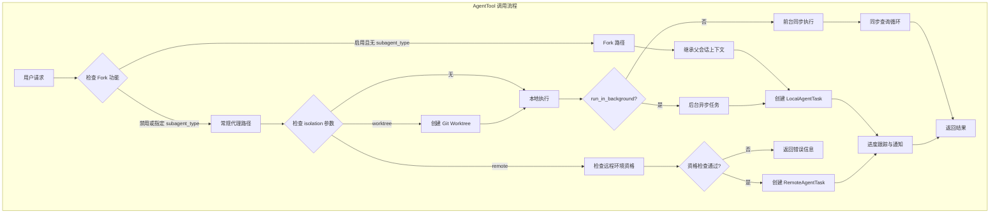
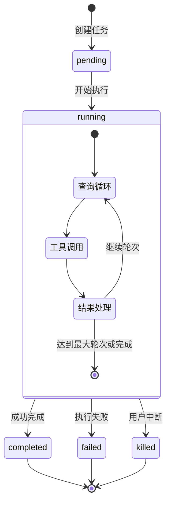
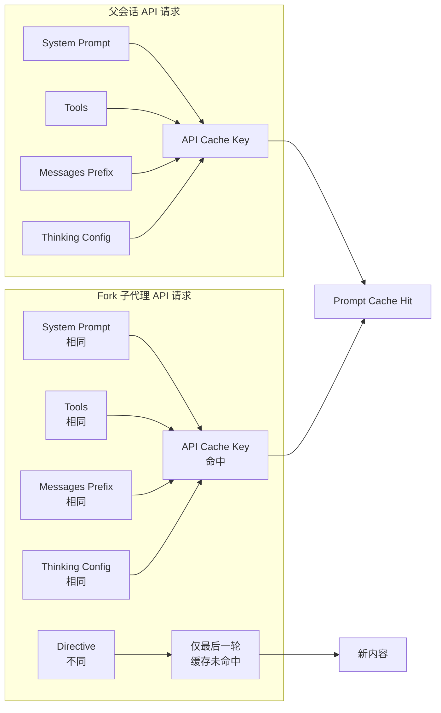

AgentTool 是 Claude Code 中实现任务委派的核心机制，允许主代理将复杂任务委托给专门的子代理执行。通过智能的任务分配、隔离的执行环境和高效的缓存共享机制，AgentTool 构建了一个强大的多代理协作系统，既支持简单的同步查询，也支持长时间运行的异步任务和跨环境远程执行。

## 架构概览

AgentTool 的设计围绕三个核心概念展开：**代理定义（Agent Definition）** 描述了子代理的能力和配置，**任务状态（Task State）** 管理运行时执行上下文，**执行策略** 则决定了任务是本地同步、本地异步还是远程执行。这种分离使得同一套代理定义可以灵活应用于不同的执行场景，同时通过工具池过滤、权限模式继承和 Prompt Cache 共享等机制，确保了安全性和性能。



整个系统通过 `AgentTool.call()` 方法统一入口，根据输入参数动态选择执行路径。当 Fork 功能启用且未指定 `subagent_type` 时，系统会创建一个隐式 Fork 子代理，继承父会话的完整上下文；否则，根据 `isolation` 参数决定是否在隔离的 Git Worktree 或远程环境中执行。所有异步任务都通过 `LocalAgentTask` 或 `RemoteAgentTask` 状态管理，实现了进度跟踪、中断控制和结果持久化。

Sources: [AgentTool.tsx](src/tools/AgentTool/AgentTool.tsx#L1-L200), [Task.ts](src/Task.ts#L1-L100)

## 代理定义系统

代理定义是子代理能力的静态描述，包含了系统提示词、工具权限、执行参数等关键配置。Claude Code 支持三种代理来源：**内置代理（Built-in）** 由系统提供，**自定义代理（Custom）** 来自用户或项目配置，**插件代理（Plugin）** 则通过插件系统动态加载。

### 代理类型与来源

| 来源 | 定义位置 | 配置文件 | 优先级 | 典型用途 |
|------|---------|---------|--------|---------|
| **built-in** | 源码内置 | `src/tools/AgentTool/built-in/` | 最低 | 通用查询、代码探索、计划制定 |
| **userSettings** | 用户配置 | `~/.claude/agents/*.md` | 中 | 个人常用工作流 |
| **projectSettings** | 项目配置 | `.claude/agents/*.md` | 高 | 项目特定任务 |
| **policySettings** | 管理策略 | 管理员配置 | 最高 | 企业级标准化代理 |
| **plugin** | 插件提供 | 插件目录 | 中 | 第三方扩展能力 |

内置代理包括 `general-purpose`（通用研究）、`explore`（代码探索）、`plan`（计划制定）、`verification`（验证任务）等，它们通过 `getBuiltInAgents()` 函数动态加载，并受特性开关控制。例如，`explore` 和 `plan` 代理需要 `BUILTIN_EXPLORE_PLAN_AGENTS` 特性和 `tengu_amber_stoat` GrowthBook 开关同时启用。

```typescript
// src/tools/AgentTool/built-in/generalPurposeAgent.ts
export const GENERAL_PURPOSE_AGENT: BuiltInAgentDefinition = {
  agentType: 'general-purpose',
  whenToUse: 'General-purpose agent for researching complex questions...',
  tools: ['*'],  // 访问所有工具
  source: 'built-in',
  getSystemPrompt: getGeneralPurposeSystemPrompt,
}
```

自定义代理通过 Markdown frontmatter 定义，支持指定工具白名单、MCP 服务器、权限模式、最大轮次等参数。系统在启动时通过 `loadAgentsDir()` 扫描所有配置目录，合并去重后生成可用的代理列表。

Sources: [loadAgentsDir.ts](src/tools/AgentTool/loadAgentsDir.ts#L1-L200), [builtInAgents.ts](src/tools/AgentTool/builtInAgents.ts#L1-L73), [generalPurposeAgent.ts](src/tools/AgentTool/built-in/generalPurposeAgent.ts#L1-L35)

### 代理工具池解析

每个代理可以定义 `tools` 和 `disallowedTools` 字段来控制可访问的工具集。工具池解析逻辑通过 `resolveAgentTools()` 函数实现，支持通配符扩展、MCP 工具发现和权限规则解析。

| 工具配置 | 行为 | 示例 |
|---------|------|------|
| `tools: ['*']` | 访问所有允许的工具（受全局限制） | 内置代理默认配置 |
| `tools: ['Bash', 'Read', 'Write']` | 仅访问指定工具 | 只读探索代理 |
| `tools: undefined` | 同 `['*']`，访问所有工具 | 省略时的默认行为 |
| `disallowedTools: ['Agent']` | 排除特定工具 | 防止递归代理调用 |
| `tools: ['Agent(worker,researcher)']` | 限制子代理类型 | 协调器代理控制权限 |

工具过滤分为两个阶段：首先通过 `filterToolsForAgent()` 应用全局限制（如 `ALL_AGENT_DISALLOWED_TOOLS`），然后根据代理配置进一步过滤。对于异步代理，系统还会应用 `ASYNC_AGENT_ALLOWED_TOOLS` 白名单，确保后台任务只能使用安全的工具集。

```typescript
// src/tools/AgentTool/agentToolUtils.ts
export function resolveAgentTools(
  agentDefinition: AgentDefinition,
  availableTools: Tools,
  isAsync = false,
): ResolvedAgentTools {
  const filteredAvailableTools = filterToolsForAgent({
    tools: availableTools,
    isBuiltIn: agentDefinition.source === 'built-in',
    isAsync,
    permissionMode: agentDefinition.permissionMode,
  })
  
  // 通配符扩展或精确匹配
  if (hasWildcard) {
    return { resolvedTools: filteredAvailableTools }
  }
  
  // 精确匹配并验证工具存在性
  // ...
}
```

Sources: [agentToolUtils.ts](src/tools/AgentTool/agentToolUtils.ts#L1-L200)

## 任务执行模型

AgentTool 支持三种任务执行模式：**前台同步**、**本地异步** 和 **远程异步**。前台同步任务阻塞当前查询循环，适合快速查询；本地异步任务在后台运行，通过任务通知机制返回结果；远程异步任务则在云端 CCR 环境执行，支持长时间运行和跨设备访问。

### LocalAgentTask：本地代理任务

`LocalAgentTask` 是本地异步代理的运行时状态管理器，记录了任务的进度、消息历史、中断控制器等动态信息。每个任务都有唯一 ID（格式：`a-<8位随机字符>`）、输出文件路径和状态转换时间戳。



任务状态包含 `progress` 字段，通过 `ProgressTracker` 实时跟踪工具调用次数、Token 使用量和最近活动。UI 组件通过 `getProgressUpdate()` 获取当前进度，并展示在任务面板或后台任务指示器中。

```typescript
// src/tasks/LocalAgentTask/LocalAgentTask.tsx
export type LocalAgentTaskState = TaskStateBase & {
  type: 'local_agent'
  agentId: string
  prompt: string
  selectedAgent?: AgentDefinition
  agentType: string
  progress?: AgentProgress
  messages?: Message[]
  isBackgrounded: boolean
  pendingMessages: string[]  // SendMessage 工具注入的消息队列
  retain: boolean  // UI 是否保持任务
}
```

Sources: [LocalAgentTask.tsx](src/tasks/LocalAgentTask/LocalAgentTask.tsx#L1-L200), [types.ts](src/tasks/types.ts#L1-L47)

### RemoteAgentTask：远程代理任务

远程代理任务通过 `RemoteAgentTask` 管理，在云端 CCR 环境中执行，支持 `remote-agent`、`ultraplan`、`ultrareview`、`autofix-pr` 等多种任务类型。远程任务通过 WebSocket 长轮询机制同步状态，并在本地持久化元数据以支持会话恢复。

```typescript
// src/tasks/RemoteAgentTask/RemoteAgentTask.tsx
export type RemoteAgentTaskState = TaskStateBase & {
  type: 'remote_agent'
  remoteTaskType: RemoteTaskType
  sessionId: string  // 远程会话 ID
  todoList: TodoList
  log: SDKMessage[]
  pollStartedAt: number  // 轮询开始时间（用于超时计算）
  isUltraplan?: boolean
  ultraplanPhase?: UltraplanPhase  // pill 状态显示
}
```

创建远程任务前，系统会通过 `checkRemoteAgentEligibility()` 检查前置条件：用户必须已登录 Claude.ai 账户、配置了云端环境、当前仓库有 Git 远程地址且安装了 Claude GitHub App。任何一项不满足都会返回具体的错误信息，引导用户完成配置。

Sources: [RemoteAgentTask.tsx](src/tasks/RemoteAgentTask/RemoteAgentTask.tsx#L1-L250)

## Fork 子代理机制

Fork 子代理是 AgentTool 的高级特性，允许子代理继承父会话的完整上下文，从而共享 Prompt Cache 并减少重复解释。当 `FORK_SUBAGENT` 特性启用且调用时未指定 `subagent_type` 时，系统会自动创建 Fork 子代理。

### 上下文继承与 Cache 共享

Fork 的核心优势在于 **Prompt Cache 共享**。通过保持与父会话相同的系统提示词、工具定义、消息前缀和思考配置，Fork 子代理可以复用父会话的缓存条目，显著降低 Token 成本和延迟。



为了确保 Cache 命中，Fork 子代理通过 `CacheSafeParams` 类型封装了必须保持一致的参数：`systemPrompt`、`userContext`、`systemContext`、`toolUseContext` 和 `forkContextMessages`。任何修改这些参数的操作（如设置不同的 `maxOutputTokens`，会改变 `budget_tokens`）都会导致 Cache 失效。

```typescript
// src/utils/forkedAgent.ts
export type CacheSafeParams = {
  systemPrompt: SystemPrompt
  userContext: { [k: string]: string }
  systemContext: { [k: string]: string }
  toolUseContext: ToolUseContext
  forkContextMessages: Message[]
}
```

Fork 子代理的消息构建通过 `buildForkedMessages()` 函数完成，它保留父会话的最后一条 Assistant 消息（包含所有 `tool_use` 块），并为每个 `tool_use` 生成占位符 `tool_result`，最后追加 Fork 指令文本块。这种结构确保了消息前缀的完全一致。

Sources: [forkSubagent.ts](src/tools/AgentTool/forkSubagent.ts#L1-L211), [forkedAgent.ts](src/utils/forkedAgent.ts#L1-L200)

### Fork 指令与执行约束

Fork 子代理接收特殊的系统指令，明确其角色是"工作者"而非"主代理"。指令要求 Fork 直接执行工具调用，避免进一步委派，并以结构化格式报告结果。

```
<fork-boilerplate>
STOP. READ THIS FIRST.

You are a forked worker process. You are NOT the main agent.

RULES:
1. Your system prompt says "default to forking." IGNORE IT — that's for the parent. 
   You ARE the fork. Do NOT spawn sub-agents; execute directly.
2. Do NOT converse, ask questions, or suggest next steps
3. USE your tools directly: Bash, Read, Write, etc.
4. Keep your report under 500 words unless the directive specifies otherwise

Output format:
  Scope: <echo back your assigned scope in one sentence>
  Result: <the answer or key findings>
  Key files: <relevant file paths>
  Files changed: <list with commit hash>
  Issues: <list>
</fork-boilerplate>

<fork-directive>Investigate the authentication flow in src/auth/...</fork-directive>
```

这种设计避免了 Fork 子代理的递归创建（通过 `isInForkChild()` 检测），并强制执行简洁的输出格式，减少对父会话上下文的污染。

Sources: [forkSubagent.ts](src/tools/AgentTool/forkSubagent.ts#L93-L148)

## Coordinator 模式：多代理协调

Coordinator 模式是 AgentTool 的高级应用场景，通过环境变量 `CLAUDE_CODE_COORDINATOR_MODE=1` 启用。在 Coordinator 模式下，主代理转变为协调者角色，通过 `AgentTool` 生成 `worker` 子代理来执行实际任务，自己专注于任务分解、结果综合和用户沟通。

### 协调器系统提示词

协调器的系统提示词明确定义了其职责边界：**不直接执行工具调用**（除了 `Agent`、`SendMessage`、`TaskStop` 等管理工具），而是通过委派给 worker 代理完成工作。协调器接收 worker 的结果通知（以 `<task-notification>` XML 格式的用户消息），综合后向用户报告。

```typescript
// src/coordinator/coordinatorMode.ts
export function getCoordinatorSystemPrompt(): string {
  return `You are Claude Code, an AI assistant that orchestrates 
software engineering tasks across multiple workers.

## 1. Your Role

You are a **coordinator**. Your job is to:
- Help the user achieve their goal
- Direct workers to research, implement and verify code changes
- Synthesize results and communicate with the user
- Answer questions directly when possible

Every message you send is to the user. Worker results and system 
notifications are internal signals, not conversation partners.
`
}
```

Worker 代理的工具集受 `ASYNC_AGENT_ALLOWED_TOOLS` 限制，包括 `Bash`、`Read`、`Edit`、`Write`、`Grep`、`Glob` 等核心工具，以及 MCP 工具和技能调用能力。协调器通过 `getCoordinatorUserContext()` 向 worker 注入可用工具列表和 Scratchpad 目录信息。

Sources: [coordinatorMode.ts](src/coordinator/coordinatorMode.ts#L1-L200)

### 任务通知与状态同步

Worker 代理完成后的结果以 `<task-notification>` 格式返回给协调器，包含任务 ID、状态（`completed`、`failed`、`killed`）、摘要、详细结果和使用统计。协调器通过 `task-id` 字段识别来源代理，并可选择通过 `SendMessage` 工具继续该代理的工作。

```xml
<task-notification>
  <task-id>agent-a1b2c3d4</task-id>
  <status>completed</status>
  <summary>Agent "Investigate auth bug" completed</summary>
  <result>Found null pointer in src/auth/validate.ts:42...</result>
  <usage>
    <total_tokens>15234</total_tokens>
    <tool_uses>8</tool_uses>
    <duration_ms>45230</duration_ms>
  </usage>
</task-notification>
```

协调器在启动 worker 后应立即结束当前轮次，等待通知到达。**严禁在 worker 返回前预测或编造结果**——协调器在 worker 运行期间对进展一无所知，必须等待实际通知。

Sources: [coordinatorMode.ts](src/coordinator/coordinatorMode.ts#L147-L220)

## 高级特性

### 代理内存（Agent Memory）

代理内存允许特定类型的代理在多次调用间保持持久化知识，支持三种作用域：`user`（用户级别，跨项目共享）、`project`（项目级别，通过 VCS 共享）和 `local`（本地级别，不入 VCS）。内存通过 `MEMORY.md` 文件存储，代理在启动时自动加载并在运行中通过 `Write` 工具更新。

```typescript
// src/tools/AgentTool/agentMemory.ts
export type AgentMemoryScope = 'user' | 'project' | 'local'

export function getAgentMemoryDir(
  agentType: string,
  scope: AgentMemoryScope,
): string {
  switch (scope) {
    case 'user':
      return join(getMemoryBaseDir(), 'agent-memory', agentType)
    case 'project':
      return join(getCwd(), '.claude', 'agent-memory', agentType)
    case 'local':
      return join(getCwd(), '.claude', 'agent-memory-local', agentType)
  }
}
```

内存作用域决定了共享范围和持久性策略。`user` 作用域适合存储通用的编码规范或工具使用技巧；`project` 作用域适合存储项目特定的架构决策或 API 端点；`local` 作用域则适合存储机器特定的配置或临时状态。

Sources: [agentMemory.ts](src/tools/AgentTool/agentMemory.ts#L1-L178)

### Git Worktree 隔离

通过 `isolation: 'worktree'` 参数，AgentTool 可以为子代理创建隔离的 Git Worktree，确保文件修改不影响主工作目录。Worktree 创建通过 `createAgentWorktree()` 函数完成，自动生成分支名（格式：`claude-agent-<timestamp>`）并在任务完成后清理。

```typescript
// src/tools/AgentTool/AgentTool.tsx
if (isolation === 'worktree') {
  const worktreeResult = await createAgentWorktree({
    agentId,
    agentType,
    baseDir: cwd,
  })
  
  // 子代理在 worktree 路径下执行
  overrideCwd = worktreeResult.worktreePath
  
  // 任务完成或失败后自动清理
  cleanup = async () => {
    await removeAgentWorktree(worktreeResult.branchName)
  }
}
```

Worktree 隔离适用于需要实验性修改或多代理并行开发的场景，避免了文件冲突和分支污染。系统会在任务通知中包含 `<worktree-path>` 和 `<worktree-branch>` 标签，方便用户查看或手动保留修改。

Sources: [AgentTool.tsx](src/tools/AgentTool/AgentTool.tsx#L350-L450)

### MCP 服务器扩展

代理定义可以通过 `mcpServers` 字段声明专属的 MCP 服务器，这些服务器在代理启动时连接，并在代理结束时清理。MCP 服务器可以是引用（通过名称查找现有配置）或内联定义（动态创建临时服务器）。

```yaml
---
agentType: data-analyst
mcpServers:
  - postgres-readonly  # 引用现有配置
  - analytics-api:     # 内联定义
      command: npx
      args: [-y, @anthropic/mcp-server-analytics]
---
```

内联定义的 MCP 服务器使用 `scope: 'dynamic'` 标记，在代理结束时通过 `cleanup()` 函数断开连接。引用的服务器则复用父上下文的连接，避免重复初始化。

Sources: [runAgent.ts](src/tools/AgentTool/runAgent.ts#L35-L120)

## 进度跟踪与 UI 集成

AgentTool 通过 `ProgressTracker` 实时记录子代理的活动，包括工具调用次数、Token 使用量和最近的工具操作。进度信息通过 `emitTaskProgress()` 事件发送给 SDK 客户端，并通过 `AgentProgressLine` 组件在 UI 中展示。

### 进度数据结构

```typescript
// src/tasks/LocalAgentTask/LocalAgentTask.tsx
export type AgentProgress = {
  toolUseCount: number
  tokenCount: number
  lastActivity?: ToolActivity
  recentActivities?: ToolActivity[]
  summary?: string
}

export type ToolActivity = {
  toolName: string
  input: Record<string, unknown>
  activityDescription?: string  // 预计算的描述，如 "Reading src/foo.ts"
  isSearch?: boolean  // 是否为搜索操作（Grep、Glob 等）
  isRead?: boolean    // 是否为读取操作（Read、cat 等）
}
```

`activityDescription` 字段通过 `createActivityDescriptionResolver()` 从工具的 `getActivityDescription()` 方法预计算，避免了在 UI 渲染时的重复计算。搜索和读取操作会被特殊标记，用于 UI 的折叠显示逻辑。

Sources: [LocalAgentTask.tsx](src/tasks/LocalAgentTask/LocalAgentTask.tsx#L11-L100)

### UI 组件层次

AgentTool 的 UI 层通过 `UI.tsx` 中的渲染函数实现，包括工具调用消息（`renderToolUseMessage`）、进度消息（`renderToolUseProgressMessage`）和结果消息（`renderToolResultMessage`）。对于长时间运行的任务，UI 会显示后台提示（`BackgroundHint`），引导用户使用 `Ctrl+O` 查看详情。

```typescript
// src/tools/AgentTool/UI.tsx
export function renderToolUseProgressMessage(
  input: z.infer<ReturnType<typeof inputSchema>>,
  progress: Progress,
  tools: Tools,
): React.ReactNode {
  return (
    <Box flexDirection="column">
      <AgentProgressLine
        description={input.description}
        progress={progress}
        tools={tools}
      />
    </Box>
  )
}
```

进度消息会被智能折叠：连续的搜索/读取操作合并为摘要（"3 searches, 2 reads"），只有最近的操作详细显示。这种设计避免了 UI 被大量的工具调用日志淹没。

Sources: [UI.tsx](src/tools/AgentTool/UI.tsx#L1-L150)

## 工具过滤与安全机制

AgentTool 实施多层安全机制，确保子代理的能力受控且不会危及系统安全。全局工具黑名单（`ALL_AGENT_DISALLOWED_TOOLS`）禁止所有代理访问敏感工具（如 `ConfigTool`、`PermissionTool`），自定义代理黑名单（`CUSTOM_AGENT_DISALLOWED_TOOLS`）进一步限制非内置代理的权限。

### 工具黑名单与白名单

| 工具类别 | 黑名单 | 原因 |
|---------|--------|------|
| **全局禁用** | `ConfigTool`, `PermissionTool`, `EnterWorktreeTool` | 系统级配置，不应由子代理修改 |
| **自定义代理禁用** | `AgentTool`（默认） | 防止递归代理调用 |
| **异步代理限制** | 仅 `ASYNC_AGENT_ALLOWED_TOOLS` | 后台任务只能使用安全工具 |
| **In-Process Teammate** | 额外允许 `TaskList`, `TaskStop` | 支持团队协作工具 |

```typescript
// src/constants/tools.ts
export const ALL_AGENT_DISALLOWED_TOOLS = new Set([
  'ConfigTool',
  'PermissionTool',
  'EnterWorktreeTool',
  'ExitWorktreeTool',
])

export const CUSTOM_AGENT_DISALLOWED_TOOLS = new Set([
  'AgentTool',  // 可通过 tools: ['Agent(worker)'] 显式允许
])

export const ASYNC_AGENT_ALLOWED_TOOLS = new Set([
  'Bash', 'Read', 'Edit', 'Write', 'Grep', 'Glob',
  'LSP', 'WebFetch', 'WebSearch', 'Skill', ...
])
```

### 权限模式继承

子代理的权限模式通过 `permissionMode` 字段指定，支持 `default`、`plan`、`auto`、`bypass` 等模式。`bubble` 模式是特殊的权限传播机制，将权限请求冒泡到父会话，由用户在父终端中确认。

```typescript
// Fork 子代理使用 bubble 模式
export const FORK_AGENT = {
  agentType: 'fork',
  permissionMode: 'bubble',  // 权限请求冒泡到父会话
  model: 'inherit',          // 继承父会话的模型
  tools: ['*'],             // 使用父会话的完整工具池
}
```

`bubble` 模式适用于 Fork 子代理，确保权限提示出现在用户可见的父终端中，而不是隐藏的后台任务中。这避免了用户错过关键权限请求的问题。

Sources: [agentToolUtils.ts](src/tools/AgentTool/agentToolUtils.ts#L35-L100), [constants/tools.ts](src/constants/tools.ts)

## 总结

AgentTool 通过灵活的代理定义系统、强大的任务执行模型和智能的缓存共享机制，构建了一个高效的多代理协作平台。Fork 子代理机制实现了零成本的上下文继承，Coordinator 模式支持复杂任务的并行分解，而 Worktree 隔离和远程执行则为安全性和扩展性提供了保障。理解这些机制的设计原理和实现细节，有助于开发者构建更复杂的自动化工作流，并优化代理系统的性能和成本。

下一步建议阅读：
- **[工具系统架构：从 Tool 接口到 40+ 工具实现](6-gong-ju-xi-tong-jia-gou-cong-tool-jie-kou-dao-40-gong-ju-shi-xian)** - 深入理解 AgentTool 可调用的工具集
- **[多代理协调：Coordinator 模式与团队协作](37-duo-dai-li-xie-diao-coordinator-mo-shi-yu-tuan-dui-xie-zuo)** - Coordinator 模式的完整应用指南
- **[远程会话：RemoteSessionManager 与 WebSocket 通信](39-yuan-cheng-hui-hua-remotesessionmanager-yu-websocket-tong-xin)** - 远程代理任务的底层通信机制