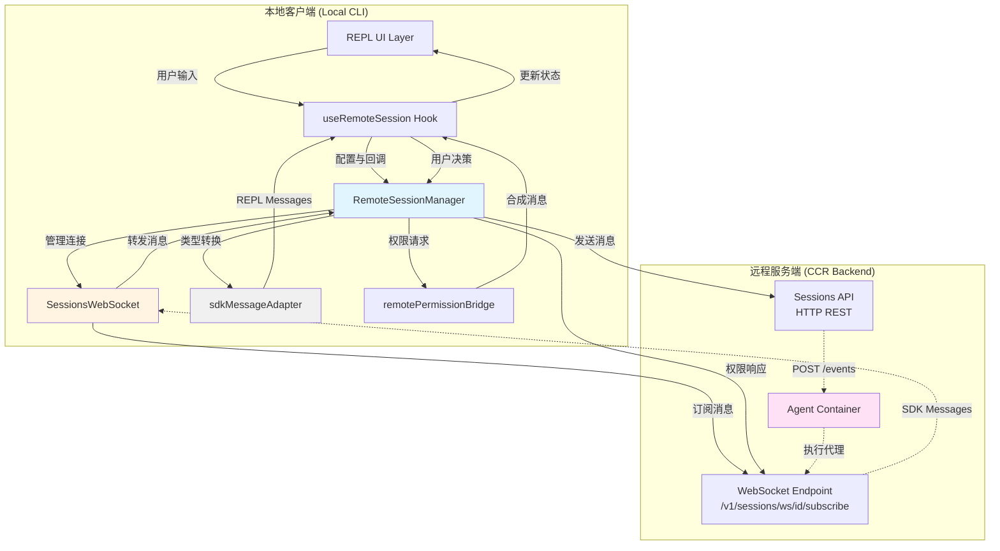
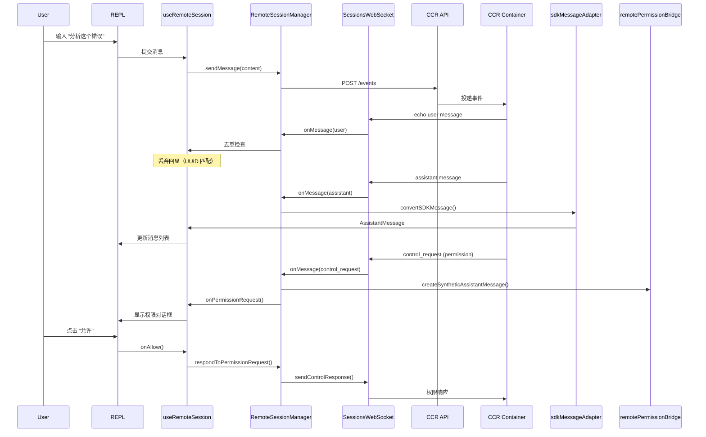
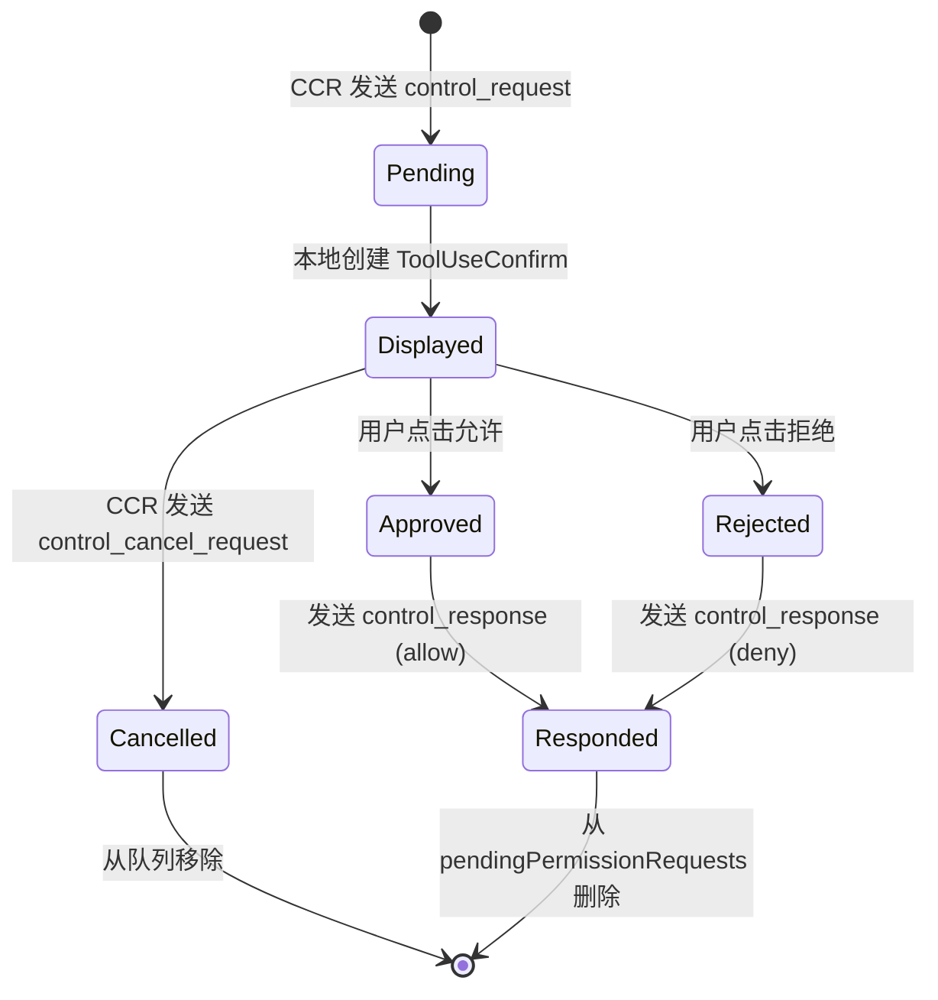

**RemoteSessionManager** 是 Claude Code 远程会话系统的核心编排器，负责管理与云端容器运行时（CCR，Cloud Container Runtime）的双向通信、权限请求处理和会话生命周期管理。该系统采用 **双通道架构**——WebSocket 接收实时消息流，HTTP POST 发送用户输入——实现了本地 REPL 界面与远程执行环境的无缝集成。

## 架构概览

远程会话系统由四个核心模块协同工作，形成完整的通信与状态管理链路：



该架构的**核心设计理念**是分离关注点：**SessionsWebSocket** 专注于连接管理与消息传输，**RemoteSessionManager** 负责业务逻辑协调，**sdkMessageAdapter** 处理协议转换，**remotePermissionBridge** 构建权限交互上下文。这种分层设计使得每个组件职责单一，便于测试和维护。

Sources: [RemoteSessionManager.ts](src/remote/RemoteSessionManager.ts#L1-L100), [SessionsWebSocket.ts](src/remote/SessionsWebSocket.ts#L1-L100), [sdkMessageAdapter.ts](src/remote/sdkMessageAdapter.ts#L1-L100), [remotePermissionBridge.ts](src/remote/remotePermissionBridge.ts#L1-L79)

## 核心组件详解

### RemoteSessionManager：会话编排器

**RemoteSessionManager** 是远程会话的中央协调器，管理三个关键职责：

1. **WebSocket 生命周期管理**：创建和配置 `SessionsWebSocket` 实例，注册消息处理回调
2. **权限请求队列**：维护待处理的权限请求映射表（`pendingPermissionRequests`），支持请求的创建、响应和取消
3. **双向消息路由**：接收 WebSocket 消息并分发给相应处理器，通过 HTTP POST 发送用户输入

其配置对象 `RemoteSessionConfig` 定义了会话的关键参数：

| 配置项 | 类型 | 说明 |
|--------|------|------|
| `sessionId` | `string` | 远程会话唯一标识符 |
| `getAccessToken` | `() => string` | OAuth 访问令牌获取函数（每次连接时调用以获取最新令牌） |
| `orgUuid` | `string` | 组织 UUID，用于 API 请求鉴权 |
| `hasInitialPrompt` | `boolean` | 会话是否包含正在处理的初始提示（影响超时策略） |
| `viewerOnly` | `boolean` | 纯查看模式：禁用中断信号、禁用重连超时、不更新会话标题（用于 `claude assistant` 命令） |

Sources: [RemoteSessionManager.ts](src/remote/RemoteSessionManager.ts#L50-L103)

### SessionsWebSocket：WebSocket 客户端

**SessionsWebSocket** 实现了与 CCR 后端的 WebSocket 通信协议，具备以下特性：

**连接管理**：
- 支持 **Bun 原生 WebSocket** 和 **Node.js ws 库** 双运行时
- 通过 HTTP 头进行认证（`Authorization: Bearer <token>`），无需额外的认证消息握手
- 内置 **Ping/Pong 心跳机制**（30 秒间隔）检测连接活性

**重连策略**：
- 指数退避重连：2 秒基础延迟，最多 5 次重试
- **特殊处理 4001（Session Not Found）**：会话在压缩期间可能暂时不可用，给予 3 次重试机会，每次延迟递增
- **永久关闭码**（如 4003 未授权）：立即停止重连，触发 `onClose` 回调

**消息过滤**：
- 使用类型守卫 `isSessionsMessage()` 验证消息格式
- 接受任何包含字符串 `type` 字段的消息，由下游处理器决定如何处理未知类型（向前兼容新消息类型）

Sources: [SessionsWebSocket.ts](src/remote/SessionsWebSocket.ts#L17-L100), [SessionsWebSocket.ts](src/remote/SessionsWebSocket.ts#L234-L288)

### sdkMessageAdapter：协议转换层

**sdkMessageAdapter** 将 CCR 后端发送的 **SDK 消息格式** 转换为 REPL 内部使用的 **Message 类型**，实现两个系统间的协议桥接。核心转换函数 `convertSDKMessage()` 处理以下消息类型：

| SDK 消息类型 | REPL 类型 | 转换逻辑 |
|-------------|----------|---------|
| `assistant` | `AssistantMessage` | 直接映射消息内容和元数据 |
| `stream_event` | `StreamEvent` | 传递流式事件用于实时 UI 更新 |
| `result` | `SystemMessage` | 仅错误时显示（成功结果被视为噪音） |
| `system.init` | `SystemMessage` | 显示会话初始化信息（包含模型名称） |
| `system.status` | `SystemMessage` | 状态更新（如 "Compacting conversation…"） |
| `system.compact_boundary` | `SystemMessage` | 压缩边界标记，包含压缩元数据 |
| `tool_progress` | `SystemMessage` | 工具执行进度（如 "Tool Bash running for 5s…"） |
| `user` | `UserMessage` | 可选转换（根据 `convertToolResults` 和 `convertUserTextMessages` 选项） |

**转换选项**：
- `convertToolResults`：将包含 `tool_result` 块的用户消息转换为可渲染的 `UserMessage`（用于直接连接模式）
- `convertUserTextMessages`：转换纯文本用户消息（用于历史事件回放，实时模式已在本地添加）

**未知类型处理**：对于无法识别的消息类型（如 `auth_status`、`tool_use_summary`、`rate_limit_event`），返回 `{ type: 'ignored' }` 而不是抛出错误，确保客户端与后端版本不匹配时不会崩溃。

Sources: [sdkMessageAdapter.ts](src/remote/sdkMessageAdapter.ts#L168-L278)

### remotePermissionBridge：权限上下文构建器

当远程 CCR 容器请求权限时，本地 CLI 没有实际的 `AssistantMessage` 或 `Tool` 对象（因为工具调用发生在远程）。**remotePermissionBridge** 提供两个关键工厂函数来构建权限交互所需的上下文：

**createSyntheticAssistantMessage**：
- 生成合成的 `AssistantMessage`，包含 `tool_use` 内容块
- 使用 `remote-{requestId}` 作为消息 ID，确保唯一性
- 填充必要的元数据字段（timestamp、usage 等）以满足类型约束

**createToolStub**：
- 为本地未知的工具（如远程特有的 MCP 工具）创建最小化的 `Tool` 存根
- 实现基本的 `renderToolUseMessage()` 方法，显示输入参数的前三项
- 路由到 `FallbackPermissionRequest` 组件，提供通用的权限请求 UI

这种设计允许远程会话使用本地不存在的工具，同时保持权限请求流程的一致性。

Sources: [remotePermissionBridge.ts](src/remote/remotePermissionBridge.ts#L12-L78)

## 通信协议与消息流

### 双通道架构

远程会话系统使用**双通道通信模式**，分离消息接收和发送路径：

**接收通道**：
```
wss://api.anthropic.com/v1/sessions/ws/{sessionId}/subscribe?organization_uuid={orgUuid}
```
- 长连接订阅模式，实时推送会话事件
- 支持重连和心跳保活
- 传输 SDK 消息和控制消息（权限请求/响应）

**发送通道**：
```
POST https://api.anthropic.com/v1/sessions/{sessionId}/events
```
- 短连接 HTTP 请求，发送用户输入
- 请求体包含事件数组，支持批量提交
- 返回后会立即在 WebSocket 上收到回显（需要去重处理）

### 消息流示例



**关键细节**：
1. **回显去重**：用户消息通过 HTTP POST 发送后，WebSocket 会回显相同 UUID 的消息，使用 `BoundedUUIDSet`（容量 50）过滤重复
2. **控制消息分离**：`control_request`、`control_response`、`control_cancel_request` 与 SDK 消息使用不同的 `type` 字段，便于路由
3. **权限请求生命周期**：从 `onPermissionRequest` 到 `respondToPermissionRequest` 之间，请求存储在 `pendingPermissionRequests` 映射表中

Sources: [RemoteSessionManager.ts](src/remote/RemoteSessionManager.ts#L216-L242), [RemoteSessionManager.ts](src/remote/RemoteSessionManager.ts#L247-L282), [SessionsWebSocket.ts](src/remote/SessionsWebSocket.ts#L75-L81), [useRemoteSession.ts](src/hooks/useRemoteSession.ts#L177-L191)

## 权限请求流程

远程会话的权限处理面临独特挑战：**工具在远程容器执行，但权限决策在本地用户界面**。系统通过控制协议和合成消息机制实现端到端的权限流程：

### 权限请求生命周期



### 实现细节

**1. 权限请求接收**：
```typescript
// RemoteSessionManager.handleControlRequest()
if (inner.subtype === 'can_use_tool') {
  this.pendingPermissionRequests.set(request_id, inner)
  this.callbacks.onPermissionRequest(inner, request_id)
}
```

**2. 合成上下文构建**：
```typescript
// useRemoteSession onPermissionRequest callback
const tool = findToolByName(toolsRef.current, request.tool_name) 
  ?? createToolStub(request.tool_name)

const syntheticMessage = createSyntheticAssistantMessage(request, requestId)

const toolUseConfirm: ToolUseConfirm = {
  assistantMessage: syntheticMessage,
  tool,
  input: request.input,
  onAllow(updatedInput) {
    manager.respondToPermissionRequest(requestId, {
      behavior: 'allow',
      updatedInput
    })
  },
  onReject(feedback) {
    manager.respondToPermissionRequest(requestId, {
      behavior: 'deny',
      message: feedback ?? 'User denied permission'
    })
  }
}
```

**3. 权限响应发送**：
```typescript
// RemoteSessionManager.respondToPermissionRequest()
const response: SDKControlResponse = {
  type: 'control_response',
  response: {
    subtype: 'success',
    request_id: requestId,
    response: {
      behavior: result.behavior,
      ...(result.behavior === 'allow' 
        ? { updatedInput: result.updatedInput }
        : { message: result.message })
    }
  }
}
this.websocket?.sendControlResponse(response)
```

**4. 权限取消处理**：
当远程容器取消权限请求时（例如工具执行被中断），`onPermissionCancelled` 回调负责清理 UI 状态并恢复加载指示器。

Sources: [RemoteSessionManager.ts](src/remote/RemoteSessionManager.ts#L189-L214), [useRemoteSession.ts](src/hooks/useRemoteSession.ts#L330-L406), [remotePermissionBridge.ts](src/remote/remotePermissionBridge.ts#L12-L46)

## 连接管理与容错机制

### 重连策略矩阵

SessionsWebSocket 实现了精细化的重连策略，根据关闭码和会话状态采取不同行动：

| 关闭码 | 含义 | 行为 | 重试次数 | 延迟策略 |
|-------|------|------|---------|---------|
| 4003 | Unauthorized | 永久关闭 | 0 | N/A |
| 4001 | Session Not Found | 有限重试 | 3 | 递增延迟（2s × 重试次数） |
| 其他 | 瞬态错误 | 指数退避 | 5 | 固定 2s |
| 正常关闭 | 会话结束 | 不重连 | 0 | N/A |

**4001 特殊处理的原因**：会话压缩期间，服务器可能暂时认为会话已过期，而 CLI 工作线程正忙于调用压缩 API，无法立即发送心跳。给予短暂的重试窗口可避免误判导致的会话中断。

Sources: [SessionsWebSocket.ts](src/remote/SessionsWebSocket.ts#L17-L36), [SessionsWebSocket.ts](src/remote/SessionsWebSocket.ts#L254-L272)

### 状态同步与一致性

远程会话需要维护多个状态同步，以保持 UI 与远程容器的一致性：

**1. 后台任务计数**：
```typescript
// 通过 system.task_started 和 system.task_notification 事件跟踪
runningTaskIdsRef.current.add(sdkMessage.task_id)  // task_started
runningTaskIdsRef.current.delete(sdkMessage.task_id)  // task_notification
```
显示 "N in background" 指示器，帮助用户了解远程代理的并发活动。

**2. 工具执行进度**：
```typescript
// 标记 tool_use 块为 in-progress，显示正确的加载状态
setInProgressToolUseIDs(prev => {
  const next = new Set(prev)
  for (const id of toolUseIds) next.add(id)
  return next
})
```

**3. 压缩状态跟踪**：
```typescript
// 检测压缩状态，调整超时阈值
if (sdkMessage.subtype === 'status') {
  isCompactingRef.current = sdkMessage.status === 'compacting'
}
```
压缩期间将超时从 60 秒延长到 180 秒，避免误报 "会话无响应" 警告。

**4. 连接状态管理**：
```typescript
// 通过 AppState.remoteConnectionStatus 传播连接状态
setConnStatus('connected' | 'reconnecting' | 'disconnected')
```
UI 层根据状态显示连接指示器或错误提示。

Sources: [useRemoteSession.ts](src/hooks/useRemoteSession.ts#L100-L236), [useRemoteSession.ts](src/hooks/useRemoteSession.ts#L417-L439)

### 心跳与超时机制

**Ping/Pong 心跳**：
- 每 30 秒发送一次 ping，检测连接活性
- 服务器响应 pong，重置超时计时器
- 失败时不主动断开，依赖 close 事件处理

**响应超时**：
- 正常超时：60 秒无消息则显示 "会话无响应" 警告
- 压缩超时：180 秒（3 分钟），适应压缩 API 的长时间阻塞
- **关键设计**：任何 WebSocket 消息（包括回显）都会重置超时，确保慢启动代理不会误触发警告

Sources: [useRemoteSession.ts](src/hooks/useRemoteSession.ts#L36-L41), [SessionsWebSocket.ts](src/remote/SessionsWebSocket.ts#L301-L313)

## useRemoteSession 集成层

**useRemoteSession** 是连接远程会话基础设施与 REPL UI 的 React Hook，负责将底层事件转换为状态更新和用户交互。

### 核心职责

1. **会话初始化**：创建 `RemoteSessionManager` 实例，注册所有回调处理器
2. **消息去重**：使用 `BoundedUUIDSet` 过滤回显的用户消息
3. **状态转换**：将 SDK 消息转换为 REPL 消息，更新消息列表和加载状态
4. **权限队列管理**：将远程权限请求推入 `ToolUseConfirm` 队列，触发权限对话框
5. **流式事件处理**：通过 `handleMessageFromStream` 实时更新工具执行进度

### 关键实现模式

**消息去重策略**：
```typescript
// 保存已发送消息的 UUID（环形缓冲，容量 50）
const sentUUIDsRef = useRef(new BoundedUUIDSet(50))

// 发送时记录 UUID
sentUUIDsRef.current.add(uuid)

// 接收时过滤回显
if (sdkMessage.type === 'user' && sentUUIDsRef.current.has(sdkMessage.uuid)) {
  return  // 丢弃回显
}
```

**权限请求处理**：
```typescript
// 创建合成上下文
const syntheticMessage = createSyntheticAssistantMessage(request, requestId)
const tool = findToolByName(tools, request.tool_name) ?? createToolStub(request.tool_name)

// 构建 ToolUseConfirm 对象
const toolUseConfirm: ToolUseConfirm = {
  assistantMessage: syntheticMessage,
  tool,
  input: request.input,
  onAllow(updatedInput) {
    manager.respondToPermissionRequest(requestId, {
      behavior: 'allow',
      updatedInput
    })
    setIsLoading(true)  // 恢复加载指示器
  },
  onReject(feedback) {
    manager.respondToPermissionRequest(requestId, {
      behavior: 'deny',
      message: feedback
    })
  }
}

// 推入权限队列，触发 UI
setToolUseConfirmQueue(queue => [...queue, toolUseConfirm])
setIsLoading(false)  // 暂停加载指示器，等待用户决策
```

**清理与卸载**：
```typescript
useEffect(() => {
  // ... 初始化代码
  
  return () => {
    // 清理超时计时器
    if (responseTimeoutRef.current) {
      clearTimeout(responseTimeoutRef.current)
    }
    // 断开连接
    manager.disconnect()
  }
}, [config])  // config 变化时重新初始化
```

Sources: [useRemoteSession.ts](src/hooks/useRemoteSession.ts#L76-L150), [useRemoteSession.ts](src/hooks/useRemoteSession.ts#L330-L406), [useRemoteSession.ts](src/hooks/useRemoteSession.ts#L448-L460)

## 与 Bridge 系统的对比

远程会话系统与 [Bridge 主循环：IDE 双向通信协议](18-bridge-zhu-xun-huan-ide-shuang-xiang-tong-xin-xie-yi) 在架构上有相似之处（都涉及双向通信和权限管理），但核心差异显著：

| 维度 | 远程会话 | Bridge 系统 |
|-----|-------------------|------------|
| **执行位置** | 云端容器（CCR） | 本地进程 |
| **通信协议** | WebSocket + HTTP REST | 进程间通信（stdin/stdout 或 WebSocket） |
| **权限模型** | 远程请求 → 本地决策 → 远程执行 | 本地请求 → 本地决策 → 本地执行 |
| **状态管理** | 需要跨进程同步（任务计数、压缩状态） | 单进程内状态 |
| **消息格式** | SDK 协议（JSON） | Bridge 协议（JSON） |
| **连接持久性** | 长连接订阅，支持重连 | 会话生命周期绑定 |

**设计启示**：两个系统都采用**分离式架构**（通信层与业务逻辑解耦），但远程会话额外需要处理**网络不可靠性**（重连、超时、去重）和**跨进程状态一致性**（压缩状态、任务计数）。

Sources: [RemoteSessionManager.ts](src/remote/RemoteSessionManager.ts#L87-L94), [Bridge 对比分析](src/bridge/README.md)

## 总结

远程会话系统通过 **RemoteSessionManager**、**SessionsWebSocket**、**sdkMessageAdapter** 和 **remotePermissionBridge** 四个协同组件，构建了一个健壮的远程执行环境集成方案。其核心设计亮点包括：

1. **双通道架构**：分离接收（WebSocket）和发送（HTTP）路径，优化延迟和可靠性
2. **精细化重连策略**：区分永久错误和瞬态错误，针对会话压缩场景的特殊处理
3. **合成上下文机制**：为远程权限请求构建本地 UI 所需的完整上下文，支持未知工具
4. **状态同步框架**：跨进程同步任务计数、压缩状态、工具进度，保持 UI 一致性
5. **协议转换层**：优雅处理 SDK 消息到内部格式的转换，向前兼容新消息类型

该系统为 Claude Code 提供了云端执行能力，同时保持了本地 REPL 的交互体验，是分布式系统设计中**本地透明性**原则的优秀实践。