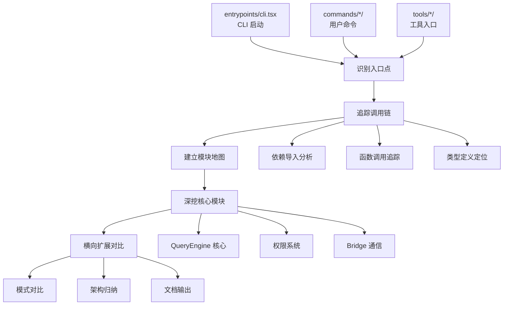

本文档介绍如何在没有完整构建环境的情况下，搭建 Claude Code 源码快照的分析环境，并掌握常用的静态分析命令与技巧。这个快照通过 npm source map 暴露，包含约 1,900 个 TypeScript/TSX 文件，总计 512,000+ 行代码，是一个纯静态分析的理想研究对象。

Sources: [README.md](README.md#L1-L50), [AGENTS.md](AGENTS.md#L1-L42)

## 快照特性与环境约束

Claude Code 源码快照具有独特的结构特征：它缺少根目录的 `package.json`、lockfile、CI 配置等构建元数据，仅保留了完整的 `src/` 目录和核心文档。这意味着**不能直接运行** `npm install`、`bun test` 等命令，所有分析必须基于静态代码阅读。原始项目使用 Bun 运行时、TypeScript 语言、React + Ink 终端 UI 框架，但分析环境不需要安装这些依赖。

这种"无构建环境"的设计反而带来了优势：分析者无需处理复杂的依赖树和构建脚本，可以专注于代码逻辑本身。快照已经过格式化和去混淆，保留了完整的类型信息和注释，非常适合教育研究和架构学习。

Sources: [README.md](README.md#L46-L50), [AGENTS.md](AGENTS.md#L4-L8)

## 核心工具准备

### 必备工具清单

| 工具 | 用途 | Windows 安装建议 | 验证命令 |
|------|------|------------------|----------|
| **ripgrep (rg)** | 高性能代码搜索 | `winget install BurntSushi.ripgrep.MSVC` 或从 GitHub releases 下载 | `rg --version` |
| **Git** | 版本历史查看 | 已预装或从 git-scm.com 下载 | `git --version` |
| **PowerShell 7+** | 脚本执行与管道操作 | Windows 11 已预装，或从 GitHub 下载 | `$PSVersionTable.PSVersion` |
| **VS Code** 或其他编辑器 | 代码浏览与导航 | `winget install Microsoft.VisualStudioCode` | `code --version` |
| **TypeScript 语法高亮** | 编辑器插件 | VS Code 内置或安装 TypeScript extension | - |

### 推荐增强工具

| 工具 | 用途 | 获取方式 |
|------|------|----------|
| **fzf** | 模糊搜索与历史查找 | `winget install junegunn.fzf` |
| **bat** | 带语法高亮的 cat | `winget install sharkdp.bat` |
| **delta** | 更好的 diff 显示 | `winget install dandavison.delta` |

ripgrep 是本快照分析的**核心工具**，因为它比传统 `findstr` 快 10-100 倍，支持正则表达式、多文件并行搜索、自动过滤 `.gitignore` 条目。所有后续的分析命令都围绕 `rg` 展开。

Sources: [docs/posts/2026-04-03-command-module-map.md](docs/posts/2026-04-03-command-module-map.md#L47-L59)

## 目录导航与模块地图

### 顶层目录结构

快照采用分层架构，理解目录职责是高效分析的第一步：

```
src/
├── entrypoints/          # 启动入口（CLI、SDK、MCP）
├── commands/             # 用户命令（50+ 斜杠命令）
├── tools/                # 工具执行（40+ Agent 工具）
├── components/           # React/Ink UI 组件（140+）
├── hooks/                # React hooks
├── services/             # 服务层集成（API、MCP、OAuth）
├── utils/                # 工具函数库
├── types/                # TypeScript 类型定义
├── bridge/               # IDE 双向通信
├── coordinator/          # 多代理协调
├── state/                # 状态管理
├── screens/              # 全屏 UI（REPL、Doctor）
└── ink/                  # Ink 渲染引擎封装
```

Sources: [README.md](README.md#L56-L95)

### 快速导航命令

使用以下 PowerShell 命令快速建立模块地图：

```powershell
# 1) 查看顶层目录结构
Get-ChildItem src -Directory | 
  Select-Object -ExpandProperty Name | 
  Sort-Object

# 2) 查看所有命令模块
Get-ChildItem src/commands -Directory | 
  Select-Object -ExpandProperty Name | 
  Sort-Object

# 3) 查看所有工具模块
Get-ChildItem src/tools -Directory | 
  Select-Object -ExpandProperty Name | 
  Sort-Object

# 4) 统计各目录文件数
Get-ChildItem src -Directory -Recurse -Depth 1 | 
  ForEach-Object { 
    $count = (Get-ChildItem $_.FullName -File -Recurse | Measure-Object).Count
    [PSCustomObject]@{ Path=$_.FullName.Replace($PWD.Path, ''); Files=$count }
  } | Sort-Object Files -Descending | Select-Object -First 15
```

这些命令帮助你快速建立"入口地图"，避免在 1,900 个文件中迷失方向。建议将结果保存到文档中，作为后续分析的索引。

Sources: [docs/posts/2026-04-03-command-module-map.md](docs/posts/2026-04-03-command-module-map.md#L47-L59)

## 核心分析命令详解

### 文件发现与枚举

```powershell
# 列出所有源文件（快速了解规模）
rg --files src

# 列出特定类型文件
rg --files src | rg "\.tsx$"
rg --files src | rg "\.ts$"

# 查找特定命名模式
rg --files src | rg "Tool\.tsx?$"
rg --files src | rg "Command\."
```

### 代码搜索模式

**基础搜索**：
```powershell
# 搜索关键词（显示文件名和行号）
rg -n "QueryEngine" src

# 搜索并显示上下文（前后 3 行）
rg -n -C 3 "export async function query" src

# 只统计匹配次数
rg -c "TODO|FIXME|HACK" src
```

**高级搜索**：
```powershell
# 搜索特定标识符（精确匹配）
rg -n "\bquery\b" src --type ts

# 搜索导入语句
rg -n "from 'src/tools" src

# 搜索类型定义
rg -n "^(export )?(interface|type)" src --type ts

# 搜索 React 组件
rg -n "export function [A-Z]" src --type tsx

# 搜索异步函数
rg -n "export async function" src --type ts
```

**多模式组合**：
```powershell
# 查找权限相关代码（不区分大小写）
rg -n -i "permission|Permission" src

# 查找工具注册逻辑
rg -n "registerTool|toolRegistry" src

# 查找错误处理模式
rg -n "catch.*error|throw new" src
```

Sources: [AGENTS.md](AGENTS.md#L17-L21), [docs/posts/2026-04-03-memory-agent-loop-bash.md](docs/posts/2026-04-03-memory-agent-loop-bash.md#L19-L28)

### 依赖追踪与调用链分析

**追踪导入依赖**：
```powershell
# 查找模块导入
rg -n "from 'src/query'" src
rg -n "import.*QueryEngine" src

# 查找特定函数调用
rg -n "runToolUse\(" src
rg -n "await query\(" src
```

**追踪调用链**：
```powershell
# 从命令入口追踪到服务层
rg -n "export.*command" src/commands/memory
rg -n "getMemoryFiles" src
rg -n "parseMemoryFileContent" src
```

Sources: [docs/posts/2026-04-03-memory-agent-loop-bash.md](docs/posts/2026-04-03-memory-agent-loop-bash.md#L61-L65)

### Git 历史分析

虽然快照历史极简（仅 `asdf` 提交），但可以分析变更意图：

```powershell
# 查看最近提交
git log --pretty=format:"%h %ad %s" --date=short -n 20

# 查看文件变更历史
git log --follow --oneline -- src/QueryEngine.ts

# 查看特定作者变更
git log --author="pattern" --oneline
```

Sources: [AGENTS.md](AGENTS.md#L20-L21)

## 分层分析方法论

### 入口点优先策略

快照分析应遵循"入口点优先"原则，避免陷入细节：



### 分层分析流程

**第 1 层：入口层**
- 聚焦：`src/entrypoints/`、`src/main.tsx`
- 目标：理解 CLI 启动参数和路由逻辑
- 命令：`rg -n "commander|yargs" src/entrypoints`

**第 2 层：命令层**
- 聚焦：`src/commands/` 各子目录
- 目标：建立"命令 → 功能"映射表
- 命令：`rg -n "export.*command" src/commands`

**第 3 层：工具层**
- 聚焦：`src/tools/` 各子目录
- 目标：理解 Agent 能力边界
- 命令：`rg -n "Tool implements" src/tools`

**第 4 层：服务层**
- 聚焦：`src/services/`、`src/utils/`
- 目标：分析集成模式和工具函数
- 命令：`rg -n "export (class|function)" src/services`

**第 5 层：UI 层**
- 聚焦：`src/components/`、`src/hooks/`
- 目标：理解交互流程
- 命令：`rg -n "export function [A-Z]" src/components`

Sources: [docs/posts/2026-04-03-command-module-map.md](docs/posts/2026-04-03-command-module-map.md#L16-L28)

## 常见分析场景与命令组合

### 场景 1：追踪某个命令的完整执行链

**目标**：理解 `/memory` 命令如何工作

```powershell
# 1. 定位命令入口
rg -n "memory" src/commands --type ts

# 2. 查看命令注册
rg -n "command.*memory" src/commands/memory

# 3. 追踪核心函数调用
rg -n "getMemoryFiles|editFileInEditor" src

# 4. 定位服务层实现
rg -n "parseMemoryFileContent" src/utils/claudemd.ts

# 5. 查找类型定义
rg -n "interface.*Memory|type.*Memory" src/types
```

Sources: [docs/posts/2026-04-03-memory-agent-loop-bash.md](docs/posts/2026-04-03-memory-agent-loop-bash.md#L12-L18)

### 场景 2：理解工具执行与权限机制

**目标**：分析 Bash 工具的安全判定逻辑

```powershell
# 1. 定位工具入口
rg -n "class BashTool" src/tools/BashTool

# 2. 查找权限判定逻辑
rg -n "isConcurrencySafe|isReadOnly" src/tools/BashTool

# 3. 追踪权限请求流程
rg -n "permissionDecision|resolveHookPermission" src/services/tools

# 4. 查找只读约束定义
rg -n "checkReadOnlyConstraints" src/tools/BashTool
```

Sources: [docs/posts/2026-04-03-memory-agent-loop-bash.md](docs/posts/2026-04-03-memory-agent-loop-bash.md#L24-L28)

### 场景 3：分析 Agent Loop 核心机制

**目标**：理解 `query()` 如何驱动工具执行

```powershell
# 1. 定位主循环
rg -n "export async function.*query" src/query.ts

# 2. 查找工具执行分流
rg -n "runTools|getRemainingResults" src/query.ts

# 3. 追踪并发调度逻辑
rg -n "runToolsConcurrently|partitionToolCalls" src/services/tools

# 4. 定位执行器
rg -n "StreamingToolExecutor|runToolUse" src/services/tools
```

Sources: [docs/posts/2026-04-03-memory-agent-loop-bash.md](docs/posts/2026-04-03-memory-agent-loop-bash.md#L61-L79)

### 场景 4：发现潜在问题区域

**目标**：识别高风险代码和未完成功能

```powershell
# 1. 查找 TODO/FIXME 标记
rg -n "TODO|FIXME|HACK|XXX" src

# 2. 查找错误处理缺失
rg -n "\.catch\(" src | rg -v "error"

# 3. 查找类型断言（潜在类型安全问题）
rg -n " as " src --type ts

# 4. 查找 eslint-disable 注释
rg -n "eslint-disable|biome-ignore" src
```

Sources: [AGENTS.md](AGENTS.md#L18-L19)

## 编码风格与模式识别

### 命名约定快速参考

| 类型 | 命名模式 | 示例 | 搜索命令 |
|------|----------|------|----------|
| React 组件 | `PascalCase.tsx` | `PermissionDialog.tsx` | `rg --files src/components \| rg "\.tsx$"` |
| 工具模块 | `*Tool.ts/tsx` | `BashTool.tsx` | `rg --files src/tools \| rg "Tool\."` |
| 服务模块 | `camelCase.ts` | `sessionRestore.ts` | `rg --files src/services` |
| 命令模块 | `camelCase.tsx` | `memory.tsx` | `rg --files src/commands` |
| 类型定义 | `camelCase.ts` | `ids.ts` | `rg --files src/types` |
| 工具函数 | `camelCase.ts` | `claudemd.ts` | `rg --files src/utils` |

### 代码模式特征

**异步函数模式**：
```typescript
// 搜索：rg -n "export async function" src
export async function* query(...) { ... }
export async function runToolUse(...) { ... }
```

**React Hook 模式**：
```typescript
// 搜索：rg -n "export function use" src/hooks
export function useAppState() { ... }
export function useSettings() { ... }
```

**工具注册模式**：
```typescript
// 搜索：rg -n "registerTool|Tool implements" src
class BashTool implements Tool { ... }
```

Sources: [AGENTS.md](AGENTS.md#L24-L32)

## 实用技巧与最佳实践

### 技巧 1：建立个人知识库

将常用搜索命令保存为 PowerShell 函数：

```powershell
function Find-Command {
    param($name)
    rg -n "export.*$name" src/commands
}

function Find-Tool {
    param($name)
    rg -n "class ${name}Tool" src/tools
}

function Trace-Import {
    param($module)
    rg -n "from 'src/$module'" src
}
```

### 技巧 2：使用 VS Code 集成

在项目根目录创建 `.vscode/settings.json`：

```json
{
  "search.exclude": {
    "**/node_modules": true,
    "**/.git": true
  },
  "search.useIgnoreFiles": true,
  "typescript.preferences.importModuleSpecifier": "relative"
}
```

使用快捷键：
- `Ctrl+Shift+F`：全局搜索
- `Ctrl+P`：快速打开文件
- `F12`：跳转到定义
- `Shift+F12`：查找所有引用

### 技巧 3：并行分析策略

针对大型模块（如 `components/`、`utils/`），采用"分而治之"策略：

```powershell
# 按首字母分组分析
Get-ChildItem src/components -Directory | 
  Where-Object { $_.Name -like "A*" } | 
  ForEach-Object { rg -l "export" $_.FullName }
```

### 技巧 4：导出分析结果

将搜索结果保存为 Markdown 文档：

```powershell
# 导出命令地图
rg -n "export.*command" src/commands | 
  Out-File -Encoding UTF8 "analysis/command-map.md"

# 导出工具清单
rg -n "class.*Tool implements" src/tools | 
  Out-File -Encoding UTF8 "analysis/tool-list.md"
```

## 故障排查与常见问题

### 问题 1：搜索结果太多

**症状**：`rg -n "query" src` 返回数千行

**解决方案**：
1. 增加上下文限定：`rg -n "export async function query" src`
2. 限定文件类型：`rg -n "query" src --type ts -g '!*.test.ts'`
3. 使用精确匹配：`rg -n "\bquery\b" src`

### 问题 2：无法定位函数定义

**症状**：找到调用点但找不到定义

**解决方案**：
1. 搜索导出语句：`rg -n "export (function|class|const) query" src`
2. 查找类型定义：`rg -n "interface.*Query|type.*Query" src/types`
3. 检查 re-export：`rg -n "export.*from" src/index.ts`

### 问题 3：依赖关系复杂

**症状**：模块间导入关系混乱

**解决方案**：
1. 建立依赖图：手动记录关键导入路径
2. 分层分析：先看 services 再看 utils
3. 使用 VS Code 的 "Call Hierarchy" 功能

Sources: [docs/posts/2026-04-03-command-module-map.md](docs/posts/2026-04-03-command-module-map.md#L35-L38)

## 进阶分析方向

完成基础环境搭建后，可以按照以下路径深入探索：

1. **核心机制分析**：从 [QueryEngine：LLM 查询循环与工具调度核心](5-queryengine-llm-cha-xun-xun-huan-yu-gong-ju-diao-du-he-xin) 开始，理解 Agent Loop 的核心逻辑
2. **工具系统研究**：阅读 [工具系统架构：从 Tool 接口到 40+ 工具实现](6-gong-ju-xi-tong-jia-gou-cong-tool-jie-kou-dao-40-gong-ju-shi-xian)，掌握工具扩展模式
3. **权限安全机制**：深入 [权限模式系统：default、plan、auto、bypass 等模式解析](9-quan-xian-mo-shi-xi-tong-default-plan-auto-bypass-deng-mo-shi-jie-xi)，理解安全边界
4. **MCP 集成探索**：研究 [MCP 客户端实现：连接管理与工具发现](15-mcp-ke-hu-duan-shi-xian-lian-jie-guan-li-yu-gong-ju-fa-xian)，了解外部工具集成

每个主题都可以使用本文档介绍的命令组合进行深度源码分析，建议先建立整体认知再深入细节。

Sources: [README.md](README.md#L99-L130)

## 小结

Claude Code 源码快照的分析环境搭建核心在于：**放弃构建尝试，拥抱静态分析**。ripgrep 是最重要的工具，"入口点优先"是最有效的方法论，"分层追踪"是最清晰的路径。掌握本文档介绍的命令组合后，你可以在无构建环境的情况下，对 512,000+ 行代码进行高效、系统的分析，这正是快照研究的核心价值所在。

记住关键原则：先建地图再深挖，先找入口再看实现，先理解架构再阅读细节。这种自顶向下的分析方法，能够帮助你在复杂的代码库中快速定位目标，建立清晰的心智模型。