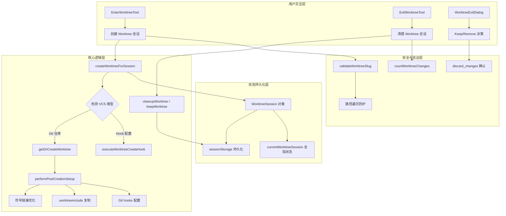
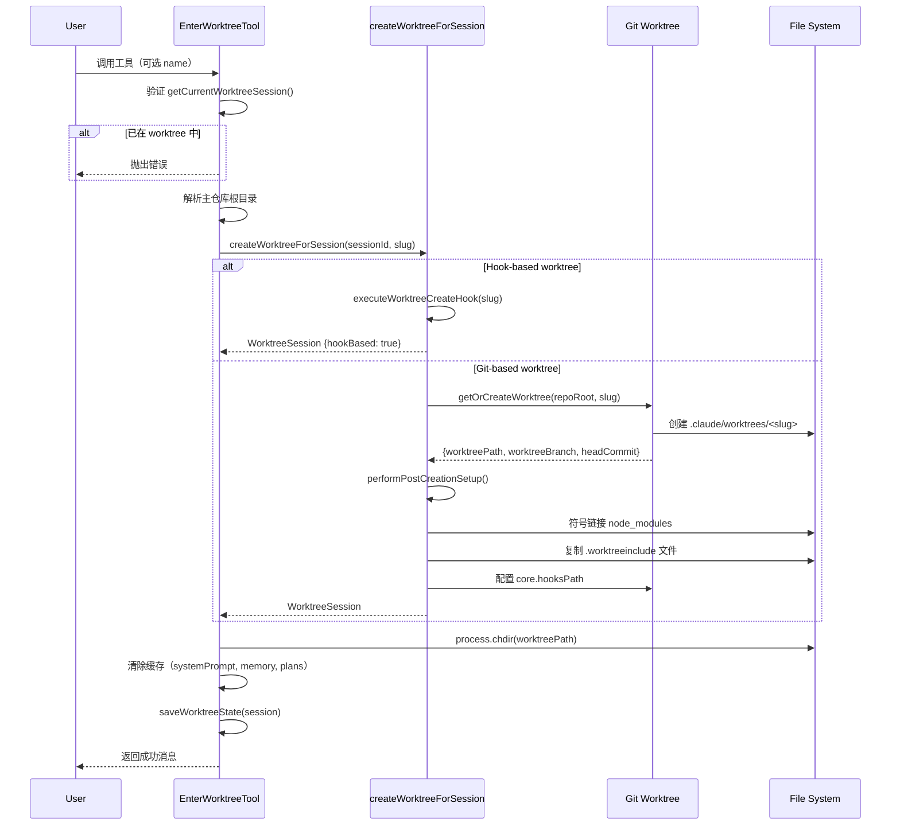
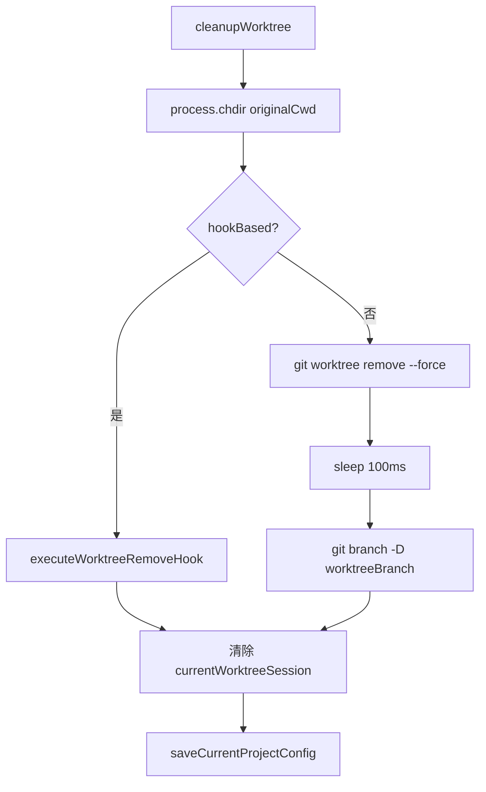

Git Worktree 集成为 Claude Code 提供了**隔离的工作环境**，允许在独立的 Git worktree 中执行任务，而不会干扰主工作目录。这一特性通过 `EnterWorktree` 和 `ExitWorktree` 两个工具实现，支持会话级别的环境隔离、自动清理机制以及与多种版本控制系统（通过 hooks）的集成。

## 架构概览

Git Worktree 集成的核心架构围绕三个关键组件展开：**工具层**（EnterWorktreeTool/ExitWorktreeTool）负责用户交互和会话管理，**工具函数层**（`worktree.ts`）处理 Git 操作和文件系统操作，**状态管理层**（`WorktreeSession`）维护当前 worktree 会话的元数据。系统采用**延迟初始化**策略，仅在用户显式请求时创建 worktree，并通过**会话持久化**机制支持跨会话恢复。



### 核心数据结构

`WorktreeSession` 类型定义了 worktree 会话的完整状态信息，包括原始工作目录、worktree 路径、分支信息以及性能指标。该对象在创建时初始化，并保存到项目配置中以支持会话恢复。

```typescript
type WorktreeSession = {
  originalCwd: string           // 原始工作目录
  worktreePath: string          // worktree 目录路径
  worktreeName: string          // worktree 名称（slug）
  worktreeBranch?: string       // worktree 分支名
  originalBranch?: string       // 原始分支名
  originalHeadCommit?: string   // 原始 HEAD commit SHA
  sessionId: string             // 会话 ID
  tmuxSessionName?: string      // tmux 会话名（可选）
  hookBased?: boolean           // 是否使用 hook-based worktree
  creationDurationMs?: number   // 创建耗时（毫秒）
  usedSparsePaths?: boolean     // 是否使用了 sparse checkout
}
```

Sources: [worktree.ts](src/utils/worktree.ts#L140-L154)

## 工具实现：EnterWorktreeTool

### 输入与输出 Schema

`EnterWorktreeTool` 接受一个可选的 `name` 参数作为 worktree 标识符。该参数经过严格的**路径安全验证**，防止路径遍历攻击和目录逃逸。验证规则包括：最大长度 64 字符、允许字母/数字/点/下划线/短横线、禁止 `.` 或 `..` 路径段。如果用户未提供名称，系统将自动生成随机名称。

```typescript
const inputSchema = z.strictObject({
  name: z.string()
    .superRefine((s, ctx) => {
      try {
        validateWorktreeSlug(s)
      } catch (e) {
        ctx.addIssue({ code: 'custom', message: (e as Error).message })
      }
    })
    .optional()
    .describe('Optional name for the worktree...')
})
```

Sources: [EnterWorktreeTool.ts](src/tools/EnterWorktreeTool/EnterWorktreeTool.ts#L23-L39)

### 执行流程

工具的核心执行流程分为五个阶段：**前置验证**（检查是否已在 worktree 会话中）、**路径解析**（切换到主仓库根目录）、**worktree 创建**（调用 `createWorktreeForSession`）、**状态更新**（切换工作目录并清除缓存）、**遥测记录**（记录创建事件）。



Sources: [EnterWorktreeTool.ts](src/tools/EnterWorktreeTool/EnterWorktreeTool.ts#L77-L119)

### 路径安全验证

`validateWorktreeSlug` 函数实施**多层防御**策略，阻止恶意输入导致的目录逃逸。验证逻辑检查三个条件：长度限制（≤64 字符）、禁止 `.` 或 `..` 路径段（防止 `../../../etc/passwd` 攻击）、正则表达式白名单（仅允许 `[a-zA-Z0-9._-]` 字符）。对于嵌套 slug（如 `user/feature`），系统使用 `flattenSlug` 函数将 `/` 替换为 `+`，避免 Git refs 的 D/F 冲突和目录嵌套问题。

```typescript
export function validateWorktreeSlug(slug: string): void {
  if (slug.length > MAX_WORKTREE_SLUG_LENGTH) {
    throw new Error(`Invalid worktree name: must be ${MAX_WORKTREE_SLUG_LENGTH} characters or fewer`)
  }
  for (const segment of slug.split('/')) {
    if (segment === '.' || segment === '..') {
      throw new Error(`Invalid worktree name "${slug}": must not contain "." or ".." path segments`)
    }
    if (!VALID_WORKTREE_SLUG_SEGMENT.test(segment)) {
      throw new Error(`Invalid worktree name "${slug}": each segment must contain only letters, digits, dots, underscores, and dashes`)
    }
  }
}
```

Sources: [worktree.ts](src/utils/worktree.ts#L66-L87)

## Worktree 创建机制

### Git Worktree 创建流程

`getOrCreateWorktree` 函数实现了**快速恢复路径**优化：如果目标 worktree 已存在（通过直接读取 `.git` 指针文件检测，避免启动 Git 子进程的 15ms 开销），则跳过 fetch 和创建步骤，直接返回现有路径。对于新 worktree，函数执行分支获取（优先使用本地 `origin/<branch>` ref，避免大型仓库中 6-8 秒的网络 fetch）、worktree 创建（使用 `-B` 标志重置孤立分支）、sparse checkout 配置（如果启用）。

```typescript
async function getOrCreateWorktree(
  repoRoot: string,
  slug: string,
  options?: { prNumber?: number },
): Promise<WorktreeCreateResult> {
  const worktreePath = worktreePathFor(repoRoot, slug)
  const worktreeBranch = worktreeBranchName(slug)
  
  // Fast resume: 直接读取 .git 指针文件，避免 subprocess
  const existingHead = await readWorktreeHeadSha(worktreePath)
  if (existingHead) {
    return { worktreePath, worktreeBranch, headCommit: existingHead, existed: true }
  }
  
  // 新 worktree: fetch 基础分支并创建
  await mkdir(worktreesDir(repoRoot), { recursive: true })
  
  // 优化：如果 origin/<branch> 已在本地，跳过 fetch
  const originSha = await resolveRef(gitDir, `refs/remotes/origin/${defaultBranch}`)
  if (!originSha) {
    await execFileNoThrowWithCwd(gitExe(), ['fetch', 'origin', defaultBranch], { cwd: repoRoot })
  }
  
  // 创建 worktree（-B 重置孤立分支）
  await execFileNoThrowWithCwd(gitExe(), ['worktree', 'add', '-B', worktreeBranch, worktreePath, baseBranch])
  
  return { worktreePath, worktreeBranch, headCommit: baseSha, baseBranch, existed: false }
}
```

Sources: [worktree.ts](src/utils/worktree.ts#L235-L375)

### Post-Creation Setup

`performPostCreationSetup` 函数执行**环境一致性配置**，确保 worktree 具备与主仓库相同的开发环境。配置步骤包括：复制 `settings.local.json`（传播本地设置和密钥）、配置 Git hooks 路径（解决 Husky 等工具的相对路径问题）、符号链接大型目录（通过 `symlinkDirectories` 避免重复 `node_modules`）、复制 `.worktreeinclude` 文件（使用 `ignore` 库匹配 gitignore 文件）。

| 配置项 | 目的 | 实现方式 |
|--------|------|----------|
| `settings.local.json` | 传播本地配置和密钥 | `copyFile` 到 worktree 的 `.claude` 目录 |
| `core.hooksPath` | 共享主仓库的 Git hooks | `git config core.hooksPath <main-repo-hooks>` |
| 符号链接目录 | 避免磁盘空间浪费 | `symlink(sourcePath, destPath, 'dir')` |
| `.worktreeinclude` 文件 | 复制 gitignore 文件 | `copyWorktreeIncludeFiles` + `ignore` 库过滤 |

Sources: [worktree.ts](src/utils/worktree.ts#L510-L624)

### Sparse Checkout 支持

对于包含大量文件的项目（如 210k 文件、16M 对象的仓库），`sparsePaths` 配置允许 worktree **仅检出必要的子目录**，显著减少磁盘占用和检出时间。实现使用 `git worktree add --no-checkout` 创建空 worktree，然后执行 `git sparse-checkout set --cone -- <paths>` 配置稀疏检出模式，最后通过 `git checkout HEAD` 应用检出。

```typescript
const sparsePaths = getInitialSettings().worktree?.sparsePaths
if (sparsePaths?.length) {
  addArgs.push('--no-checkout')
  // ... worktree add ...
  
  await execFileNoThrowWithCwd(gitExe(), 
    ['sparse-checkout', 'set', '--cone', '--', ...sparsePaths], 
    { cwd: worktreePath }
  )
  await execFileNoThrowWithCwd(gitExe(), ['checkout', 'HEAD'], { cwd: worktreePath })
}
```

Sources: [worktree.ts](src/utils/worktree.ts#L321-L366)

## Hook-Based Worktree（VCS 无关）

### 设计动机

Hook-based worktree 机制允许用户通过配置 `WorktreeCreate` 和 `WorktreeRemove` hooks 来**支持非 Git 版本控制系统**（如 Mercurial、SVN、Perforce）。这种设计将 VCS 特定逻辑委托给用户脚本，Claude Code 仅负责会话管理和路径切换，实现了**关注点分离**。

### Hook 执行流程

当检测到 `WorktreeCreate` hook 配置时，`createWorktreeForSession` 函数跳过 Git worktree 创建，直接调用 `executeWorktreeCreateHook` 并传入 slug 参数。Hook 脚本负责创建隔离的工作目录，并通过 JSON 输出返回 worktree 路径。退出时，`ExitWorktreeTool` 调用 `executeWorktreeRemoveHook` 进行清理。

```typescript
if (hasWorktreeCreateHook()) {
  const hookResult = await executeWorktreeCreateHook(slug)
  currentWorktreeSession = {
    originalCwd,
    worktreePath: hookResult.worktreePath,
    worktreeName: slug,
    sessionId,
    tmuxSessionName,
    hookBased: true,
  }
}
```

Sources: [worktree.ts](src/utils/worktree.ts#L714-L728)

### Hook Output Schema

`WorktreeCreate` hook 必须返回包含 `worktreePath` 字段的 JSON 对象，该路径将被设置为会话的工作目录。Hook 输出通过 Zod schema 验证，确保类型安全。

```typescript
z.object({
  hookEventName: z.literal('WorktreeCreate'),
  worktreePath: z.string(),
})
```

Sources: [hooks.ts](src/types/hooks.ts#L160-L162)

## 工具实现：ExitWorktreeTool

### 输入 Schema 与验证

`ExitWorktreeTool` 接受两个参数：`action`（必填，`"keep"` 或 `"remove"`）和 `discard_changes`（可选，用于强制删除包含未提交更改的 worktree）。工具在执行前进行**范围守卫检查**：仅当 `getCurrentWorktreeSession()` 返回非空值（即当前会话通过 `EnterWorktree` 创建了 worktree）时才允许操作，防止误删手动创建的 worktree。

```typescript
const inputSchema = z.strictObject({
  action: z.enum(['keep', 'remove'])
    .describe('"keep" leaves the worktree and branch on disk; "remove" deletes both.'),
  discard_changes: z.boolean().optional()
    .describe('Required true when action is "remove" and the worktree has uncommitted files...'),
})
```

Sources: [ExitWorktreeTool.ts](src/tools/ExitWorktreeTool/ExitWorktreeTool.ts#L30-L44)

### 变更检测机制

`countWorktreeChanges` 函数实现了**失败关闭**（fail-closed）的变更检测策略，当无法可靠确定 worktree 状态时返回 `null`（而非假设 0 更改），防止意外删除未保存的工作。检测包括两个维度：**未提交文件数**（通过 `git status --porcelain` 统计）和**未合并提交数**（通过 `git rev-list --count <originalHeadCommit>..HEAD` 统计）。

```typescript
async function countWorktreeChanges(
  worktreePath: string,
  originalHeadCommit: string | undefined,
): Promise<ChangeSummary | null> {
  const status = await execFileNoThrow('git', ['-C', worktreePath, 'status', '--porcelain'])
  if (status.code !== 0) return null
  
  const changedFiles = count(status.stdout.split('\n'), l => l.trim() !== '')
  
  if (!originalHeadCommit) return null  // Hook-based worktree 无基线
  
  const revList = await execFileNoThrow('git', 
    ['-C', worktreePath, 'rev-list', '--count', `${originalHeadCommit}..HEAD`]
  )
  if (revList.code !== 0) return null
  
  const commits = parseInt(revList.stdout.trim(), 10) || 0
  return { changedFiles, commits }
}
```

Sources: [ExitWorktreeTool.ts](src/tools/ExitWorktreeTool/ExitWorktreeTool.ts#L79-L113)

### 清理流程

`cleanupWorktree` 函数执行**多阶段清理**：首先切换回原始目录（防止 Git 锁定问题），然后根据 worktree 类型执行删除（Git worktree 使用 `git worktree remove --force`，hook-based worktree 调用 `executeWorktreeRemoveHook`），等待 100ms 以确保 Git 释放所有锁，最后删除临时分支（仅 Git worktree）。



Sources: [worktree.ts](src/utils/worktree.ts#L813-L894)

### 会话状态恢复

`restoreSessionToOriginalCwd` 函数负责**逆向恢复会话状态**，包括重置工作目录（`setCwd`）、恢复原始路径（`setOriginalCwd`）、重置项目根（仅在 `--worktree` 启动模式下）、重新加载 hooks 配置（`updateHooksConfigSnapshot`）、清除缓存（system prompt、memory files、plans directory）。

```typescript
function restoreSessionToOriginalCwd(
  originalCwd: string,
  projectRootIsWorktree: boolean,
): void {
  setCwd(originalCwd)
  setOriginalCwd(originalCwd)
  if (projectRootIsWorktree) {
    setProjectRoot(originalCwd)
    updateHooksConfigSnapshot()
  }
  saveWorktreeState(null)
  clearSystemPromptSections()
  clearMemoryFileCaches()
  getPlansDirectory.cache.clear?.()
}
```

Sources: [ExitWorktreeTool.ts](src/tools/ExitWorktreeTool/ExitWorktreeTool.ts#L122-L146)

## UI 组件：WorktreeExitDialog

### 交互流程

`WorktreeExitDialog` 组件在会话退出时提供**可视化决策界面**，显示未提交文件数和提交数，并提供三个选项：**保留 worktree**（继续在独立目录工作）、**保留并终止 tmux**（清理 tmux 会话但保留文件）、**删除 worktree**（彻底清理）。如果 worktree 无任何更改，组件自动执行清理，无需用户确认。

```typescript
// 自动清理逻辑
if (changeLines.length === 0 && count === 0) {
  setStatus('removing')
  void cleanupWorktree().then(() => {
    process.chdir(worktreeSession.originalCwd)
    setCwd(worktreeSession.originalCwd)
    recordWorktreeExit()
    getPlansDirectory.cache.clear?.()
    setResultMessage('Worktree removed (no changes)')
  }).then(() => setStatus('done'))
  return
}
```

Sources: [WorktreeExitDialog.tsx](src/components/WorktreeExitDialog.tsx#L57-L73)

### Tmux 集成

当 worktree 关联了 tmux 会话时，对话框提供**附加选项**：保留 worktree 时可选择保持 tmux 会话运行（用户可通过 `tmux attach -t <session-name>` 重新连接）或终止会话。删除 worktree 时自动终止关联的 tmux 会话，防止孤儿进程。

```typescript
async function handleSelect(value: string) {
  const hasTmux = Boolean(worktreeSession.tmuxSessionName)
  
  if (value === 'keep-with-tmux') {
    await keepWorktree()
    setResultMessage(`Worktree kept. Reattach to tmux with: tmux attach -t ${worktreeSession.tmuxSessionName}`)
  } else if (value === 'keep-kill-tmux') {
    await killTmuxSession(worktreeSession.tmuxSessionName!)
    await keepWorktree()
    setResultMessage(`Worktree kept. Tmux session terminated.`)
  }
}
```

Sources: [WorktreeExitDialog.tsx](src/components/WorktreeExitDialog.tsx#L97-L132)

## 会话持久化与恢复

### 状态存储

`saveWorktreeState` 函数将 `WorktreeSession` 对象**序列化到 sessionStorage**，支持跨进程恢复。当会话通过 `--resume` 标志恢复时，`restoreWorktreeSession` 函数从存储中读取会话状态，并验证目录是否存在（通过 `process.chdir` 成功与否判断）。

```typescript
export function restoreWorktreeSession(session: WorktreeSession | null): void {
  currentWorktreeSession = session
}
```

Sources: [worktree.ts](src/utils/worktree.ts#L167-L169)

### 项目配置同步

`saveCurrentProjectConfig` 函数将 `activeWorktreeSession` 字段写入项目配置文件（`.claude/project.json`），实现**项目级持久化**。这允许不同会话共享 worktree 状态，支持多人协作场景下的 worktree 管理。

```typescript
saveCurrentProjectConfig(current => ({
  ...current,
  activeWorktreeSession: currentWorktreeSession ?? undefined,
}))
```

Sources: [worktree.ts](src/utils/worktree.ts#L772-L775)

## 安全与防护机制

### 路径遍历防护

`validateWorktreeSlug` 函数实施**白名单验证**，仅允许安全字符（字母、数字、点、下划线、短横线）。对于包含 `/` 的嵌套 slug，系统使用 `flattenSlug` 函数将路径分隔符替换为 `+`，避免目录嵌套导致的父 worktree 删除子 worktree 问题。

```typescript
function flattenSlug(slug: string): string {
  return slug.replaceAll('/', '+')
}
```

Sources: [worktree.ts](src/utils/worktree.ts#L217-L219)

### 信任机制

Hook 执行前进行**工作区信任检查**（`shouldSkipHookDueToTrust`），所有 hooks（包括 `WorktreeCreate` 和 `WorktreeRemove`）仅在用户接受信任对话框后执行。这防止恶意配置的 hooks 在未授权的工作区中执行任意命令。

```typescript
export function shouldSkipHookDueToTrust(): boolean {
  const isInteractive = !getIsNonInteractiveSession()
  if (!isInteractive) return false  // SDK 模式隐式信任
  
  const hasTrust = checkHasTrustDialogAccepted()
  return !hasTrust
}
```

Sources: [hooks.ts](src/utils/hooks.ts#L286-L296)

### 更改保护

`ExitWorktreeTool` 的 `validateInput` 方法实施**强制确认机制**：当 `action` 为 `"remove"` 且 `discard_changes` 未设置时，工具检测未提交文件和提交数，如果存在更改则拒绝删除并返回错误消息，要求用户显式设置 `discard_changes: true`。

```typescript
if (input.action === 'remove' && !input.discard_changes) {
  const summary = await countWorktreeChanges(session.worktreePath, session.originalHeadCommit)
  if (summary === null) {
    return {
      result: false,
      message: `Could not verify worktree state. Refusing to remove without explicit confirmation. Re-invoke with discard_changes: true to proceed.`,
      errorCode: 3,
    }
  }
  if (summary.changedFiles > 0 || summary.commits > 0) {
    return {
      result: false,
      message: `Worktree has ${summary.changedFiles} uncommitted files and ${summary.commits} commits. Re-invoke with discard_changes: true to proceed.`,
      errorCode: 2,
    }
  }
}
```

Sources: [ExitWorktreeTool.ts](src/tools/ExitWorktreeTool/ExitWorktreeTool.ts#L190-L215)

## 性能优化

### 快速恢复路径

`readWorktreeHeadSha` 函数直接读取 worktree 的 `.git` 指针文件（格式为 `gitdir: <path>`），避免启动 Git 子进程的 15ms 开销。对于已存在的 worktree，系统跳过 `git fetch`（大型仓库中耗时 6-8 秒）和 `git worktree add`，直接返回现有路径。

Sources: [worktree.ts](src/utils/worktree.ts#L247-L255)

### Git Refs 优化

`resolveRef` 函数直接读取 loose/packed refs 文件，避免调用 `git rev-parse`。当 `origin/<branch>` 已在本地存在时，系统跳过网络 fetch，使用本地缓存的 SHA。

Sources: [worktree.ts](src/utils/worktree.ts#L284-L302)

### 符号链接优化

`symlinkDirectories` 函数通过创建目录符号链接，避免在 worktree 中复制 `node_modules` 等大型目录。这显著减少磁盘占用（对于 500MB 的 `node_modules`，从 1GB 降至 500MB）和复制时间。

Sources: [worktree.ts](src/utils/worktree.ts#L102-L138)

## 与其他系统的集成

### Tmux 会话管理

`createTmuxSessionForWorktree` 函数在 worktree 目录中创建独立的 tmux 会话，会话名通过 `generateTmuxSessionName` 生成（格式为 `<repoName>_<branch>`）。退出 worktree 时，`killTmuxSession` 函数清理关联的 tmux 会话。

Sources: [worktree.ts](src/utils/worktree.ts#L673-L699)

### PR 支持

`parsePRReference` 函数解析 GitHub PR 引用（支持 URL 格式和 `#N` 格式），并传递给 `getOrCreateWorktree`。创建 worktree 时，系统执行 `git fetch origin pull/<prNumber>/head` 获取 PR 分支，而非默认分支。

Sources: [worktree.ts](src/utils/worktree.ts#L633-L651)

### Commit Attribution Hook

对于启用了 `COMMIT_ATTRIBUTION` 特性的项目，`performPostCreationSetup` 动态导入 `postCommitAttribution` 模块，并在 worktree 的 `.husky` 目录中安装 `prepare-commit-msg` hook。这确保在 worktree 中的提交能够正确归属到 Claude Code 会话。

Sources: [worktree.ts](src/utils/worktree.ts#L603-L623)

## 配置选项

Worktree 行为通过 `settings.json` 中的 `worktree` 字段配置：

| 配置项 | 类型 | 描述 | 默认值 |
|--------|------|------|--------|
| `sparsePaths` | `string[]` | Sparse checkout 的路径列表 | `[]` |
| `symlinkDirectories` | `string[]` | 需要符号链接的目录名 | `[]` |

示例配置：
```json
{
  "worktree": {
    "sparsePaths": ["src/core", "src/utils"],
    "symlinkDirectories": ["node_modules", ".venv"]
  }
}
```

Sources: [worktree.ts](src/utils/worktree.ts#L321-L323), [worktree.ts](src/utils/worktree.ts#L582-L584)

## 遥测与分析

系统记录以下遥测事件用于性能监控和用户行为分析：

- `tengu_worktree_created`：记录 worktree 创建事件，包含 `mid_session` 标志
- `tengu_worktree_kept`：记录保留 worktree 决策，包含 `commits` 和 `changed_files` 数量
- `tengu_worktree_removed`：记录删除 worktree 决策
- `tengu_worktree_detection`：记录 worktree 路径检测的耗时和成功状态

Sources: [EnterWorktreeTool.ts](src/tools/EnterWorktreeTool/EnterWorktreeTool.ts#L104-L106), [WorktreeExitDialog.tsx](src/components/WorktreeExitDialog.tsx#L102-L105)

## 相关页面

- **[权限模式系统：default、plan、auto、bypass 等模式解析](9-quan-xian-mo-shi-xi-tong-default-plan-auto-bypass-deng-mo-shi-jie-xi)**：了解 worktree 工具的权限控制机制
- **[钩子系统：Hooks 配置与执行时机](23-gou-zi-xi-tong-hooks-pei-zhi-yu-zhi-xing-shi-ji)**：深入学习 WorktreeCreate/WorktreeRemove hooks 的配置方法
- **[会话持久化：sessionStorage 与对话恢复](14-hui-hua-chi-jiu-hua-sessionstorage-yu-dui-hua-hui-fu)**：了解 worktree 会话状态的存储与恢复机制
- **[工具系统架构：从 Tool 接口到 40+ 工具实现](6-gong-ju-xi-tong-jia-gou-cong-tool-jie-kou-dao-40-gong-ju-shi-xian)**：探索 EnterWorktreeTool 和 ExitWorktreeTool 的工具定义模式