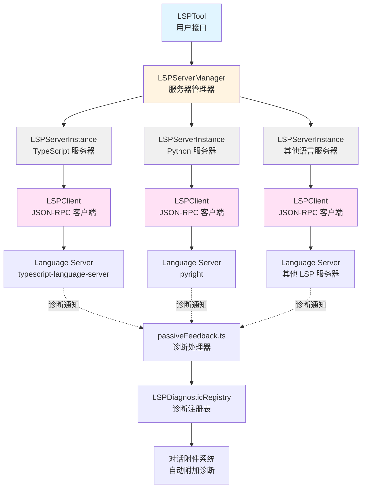
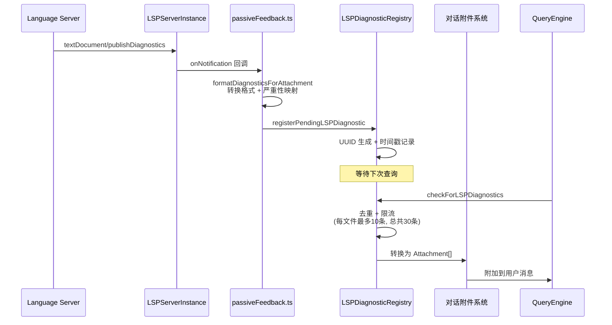

Claude Code 通过集成 Language Server Protocol (LSP) 实现了强大的代码智能功能，包括定义跳转、引用查找、悬停提示、符号搜索等。该系统采用分层架构设计，通过插件机制配置 LSP 服务器，支持多语言服务器的并发管理和自动诊断反馈，为 AI 助手提供了深度的代码理解能力。

## 架构概览

LSP 集成系统采用**四层架构**设计，每层职责清晰分离：**Tool 层**负责用户交互和结果格式化；**Manager 层**负责服务器生命周期管理和请求路由；**Instance 层**负责单个服务器的状态监控和健康检查；**Client 层**负责底层 JSON-RPC 通信协议实现。这种分层设计使得系统具有良好的可扩展性和可维护性。



Sources: [LSPTool.ts](src/tools/LSPTool/LSPTool.ts#L1-L861), [LSPServerManager.ts](src/services/lsp/LSPServerManager.ts#L1-L421), [LSPServerInstance.ts](src/services/lsp/LSPServerInstance.ts#L1-L512), [LSPClient.ts](src/services/lsp/LSPClient.ts#L1-L448)

## 核心组件职责

### Tool 层：LSPTool 实现

LSPTool 是用户与 LSP 系统交互的主要接口，实现了 **Tool 接口规范**并提供了九种代码智能操作。该组件负责输入验证、权限检查、文件同步和结果格式化，通过 `buildTool` 工厂函数注册到工具系统中。工具设计遵循**只读安全**原则，所有操作都不会修改文件系统状态。

**操作类型映射表**：

| 操作名称 | LSP 方法 | 功能描述 | 返回类型 |
|---------|---------|---------|---------|
| `goToDefinition` | `textDocument/definition` | 跳转到符号定义位置 | Location[] |
| `findReferences` | `textDocument/references` | 查找所有引用位置 | Location[] |
| `hover` | `textDocument/hover` | 获取悬停信息（类型、文档） | Hover |
| `documentSymbol` | `textDocument/documentSymbol` | 获取文档内所有符号 | DocumentSymbol[] |
| `workspaceSymbol` | `workspace/symbol` | 搜索工作区符号 | SymbolInformation[] |
| `goToImplementation` | `textDocument/implementation` | 跳转到接口实现 | Location[] |
| `prepareCallHierarchy` | `textDocument/prepareCallHierarchy` | 准备调用层次项 | CallHierarchyItem[] |
| `incomingCalls` | `callHierarchy/incomingCalls` | 查找调用者 | CallHierarchyIncomingCall[] |
| `outgoingCalls` | `callHierarchy/outgoingCalls` | 查找被调用者 | CallHierarchyOutgoingCall[] |

工具执行流程采用**文件优先打开**策略：在执行任何 LSP 操作前，系统会检查目标文件是否已在服务器中打开，若未打开则自动读取文件内容并发送 `textDocument/didOpen` 通知。这确保了 LSP 服务器具有完整的文件上下文，从而提供准确的代码分析结果。

Sources: [LSPTool.ts](src/tools/LSPTool/LSPTool.ts#L127-L224), [schemas.ts](src/tools/LSPTool/schemas.ts#L1-L216), [prompt.ts](src/tools/LSPTool/prompt.ts#L1-L22)

### Manager 层：服务器管理器

LSPServerManager 作为**中央协调器**，管理着多个 LSP 服务器实例的生命周期。该组件通过**扩展名映射表**（extensionMap）将文件类型路由到对应的语言服务器，支持同一扩展名映射到多个服务器（当前使用第一个注册的服务器）。管理器采用**工厂函数模式**实现，通过闭包封装私有状态，避免了类的复杂性。

管理器的核心职责包括：

1. **配置加载与验证**：从插件系统加载 LSP 服务器配置，验证必需字段（command、extensionToLanguage），构建扩展名到服务器的映射关系
2. **延迟启动策略**：服务器实例在创建时处于 `stopped` 状态，仅在首次使用时通过 `ensureServerStarted` 启动，避免不必要的资源占用
3. **文件同步管理**：维护 `openedFiles` 映射表跟踪已打开文件，确保 `didOpen`/`didChange`/`didSave`/`didClose` 通知正确发送
4. **请求路由分发**：根据文件扩展名自动选择合适的 LSP 服务器，将请求转发到对应的实例

```typescript
// 文件同步流程示例
async function openFile(filePath: string, content: string): Promise<void> {
  const server = await ensureServerStarted(filePath)
  if (!server) return
  
  const fileUri = pathToFileURL(path.resolve(filePath)).href
  const ext = path.extname(filePath).toLowerCase()
  const languageId = server.config.extensionToLanguage[ext] || 'plaintext'
  
  await server.sendNotification('textDocument/didOpen', {
    textDocument: { uri: fileUri, languageId, version: 1, text: content }
  })
  
  openedFiles.set(fileUri, server.name) // 跟踪已打开文件
}
```

Sources: [LSPServerManager.ts](src/services/lsp/LSPServerManager.ts#L59-L421), [manager.ts](src/services/lsp/manager.ts#L1-L290)

### Instance 层：服务器实例管理

LSPServerInstance 封装了单个 LSP 服务器的**完整生命周期管理**，包括启动、停止、重启和健康检查。该组件实现了**状态机模式**，状态转换遵循严格规则：`stopped → starting → running → stopping → stopped`，任何阶段的失败都会转入 `error` 状态。实例还提供了**崩溃恢复机制**，通过 `crashRecoveryCount` 限制重启次数（默认最多 3 次），防止无限重启循环。

**关键实现细节**：

- **瞬态错误重试**：针对 LSP 错误代码 `-32801`（Content Modified）实现指数退避重试策略，延迟序列为 500ms → 1000ms → 2000ms，适用于 rust-analyzer 等需要索引时间的服务器
- **工作区配置处理**：虽然客户端能力声明中禁用了 `workspace/configuration`，但实例仍注册了空处理器返回 `null`，满足某些服务器（如 TypeScript）的协议要求
- **初始化参数构建**：同时提供现代（workspaceFolders）和已弃用（rootPath/rootUri）字段，确保与各种 LSP 服务器版本的兼容性

```typescript
// 初始化参数构建示例
const initParams: InitializeParams = {
  processId: process.pid,
  initializationOptions: config.initializationOptions ?? {},
  
  // 现代方法 (LSP 3.16+)
  workspaceFolders: [{
    uri: workspaceUri,
    name: path.basename(workspaceFolder)
  }],
  
  // 已弃用字段 - 某些服务器仍需要
  rootPath: workspaceFolder,
  rootUri: workspaceUri,
  
  capabilities: {
    workspace: {
      configuration: false,
      workspaceFolders: false
    },
    textDocument: {
      synchronization: { dynamicRegistration: false }
    }
  }
}
```

Sources: [LSPServerInstance.ts](src/services/lsp/LSPServerInstance.ts#L90-L260)

### Client 层：JSON-RPC 通信实现

LSPClient 是与 LSP 服务器进程通信的**底层基础设施**，基于 `vscode-jsonrpc` 库实现了完整的 JSON-RPC 协议。客户端通过**子进程通信**（stdio）与 LSP 服务器交互，使用 `StreamMessageReader` 和 `StreamMessageWriter` 处理消息流。

**进程生命周期管理的关键挑战**：

1. **异步启动等待**：Node.js 的 `spawn()` 是异步的，错误事件（如 ENOENT）在进程启动后触发。客户端通过监听 `spawn` 和 `error` 事件的 Promise 竞争，确保流操作前进程已成功启动
2. **崩溃检测与传播**：通过 `onCrash` 回调将进程崩溃状态传播到上层实例，避免僵尸状态（state='running' 但进程已退出）
3. **优雅关闭**：使用 `isStopping` 标志区分主动关闭和异常崩溃，避免在正常关闭时记录错误日志

```typescript
// 关键的启动等待逻辑
const spawnedProcess = process
await new Promise<void>((resolve, reject) => {
  const onSpawn = (): void => {
    cleanup()
    resolve()
  }
  const onError = (error: Error): void => {
    cleanup()
    reject(error)
  }
  const cleanup = (): void => {
    spawnedProcess.removeListener('spawn', onSpawn)
    spawnedProcess.removeListener('error', onError)
  }
  spawnedProcess.once('spawn', onSpawn)
  spawnedProcess.once('error', onError)
})
```

客户端还实现了**延迟加载优化**：通过 `require()` 动态加载 `vscode-jsonrpc`（约 129KB），仅在首次创建 LSP 服务器实例时加载，避免在不需要 LSP 功能时增加启动时间。

Sources: [LSPClient.ts](src/services/lsp/LSPClient.ts#L51-L268)

## 诊断系统集成

LSP 集成的**被动反馈机制**通过监听 `textDocument/publishDiagnostics` 通知，将 LSP 服务器的诊断信息自动附加到对话上下文中。该系统采用**注册表模式**（LSPDiagnosticRegistry），使用 LRU 缓存防止内存无限增长，并通过**跨轮次去重**避免重复推送相同诊断。

### 诊断处理流程



**严重性映射**将 LSP 的数字编码转换为 Claude 的字符串格式：Error(1) → 'Error'，Warning(2) → 'Warning'，Information(3) → 'Info'，Hint(4) → 'Hint'。未知值默认为 'Error' 以确保不遗漏重要问题。

**去重策略**基于诊断内容的**复合键**：包含 message、severity、range、source 和 code 字段的 JSON 序列化字符串。系统维护两级去重：**批次内去重**（防止同一通知重复）和**跨轮次去重**（使用 LRUCache 跟踪已推送诊断，最多缓存 500 个文件）。

Sources: [passiveFeedback.ts](src/services/lsp/passiveFeedback.ts#L1-L329), [LSPDiagnosticRegistry.ts](src/services/lsp/LSPDiagnosticRegistry.ts#L1-L387)

## 插件配置系统

LSP 服务器**完全通过插件机制配置**，不支持用户/项目级配置文件。这种设计确保了 LSP 服务器的**标准化管理**和**安全性**：所有服务器配置都经过插件审核流程，避免用户配置错误的服务器命令导致安全风险。

### 配置加载流程

```typescript
// config.ts - 从插件加载 LSP 服务器配置
export async function getAllLspServers(): Promise<{
  servers: Record<string, ScopedLspServerConfig>
}> {
  const allServers: Record<string, ScopedLspServerConfig> = {}
  
  // 并行加载所有插件的 LSP 配置
  const { enabled: plugins } = await loadAllPluginsCacheOnly()
  const results = await Promise.all(
    plugins.map(async plugin => {
      const scopedServers = await getPluginLspServers(plugin, errors)
      return { plugin, scopedServers, errors }
    })
  )
  
  // 合并配置（后加载的插件优先）
  for (const { scopedServers } of results) {
    Object.assign(allServers, scopedServers)
  }
  
  return { servers: allServers }
}
```

**配置作用域**通过服务器名称前缀实现：`pluginId:serverName` 格式确保不同插件的同名服务器不会冲突。每个配置包含必需字段：`command`（可执行文件路径）、`args`（命令行参数）、`extensionToLanguage`（文件扩展名到语言 ID 的映射），以及可选字段：`env`（环境变量）、`workspaceFolder`（工作区路径）、`initializationOptions`（服务器特定初始化参数）。

Sources: [config.ts](src/services/lsp/config.ts#L1-L80)

## LSP 插件推荐系统

系统通过**智能推荐机制**主动引导用户安装 LSP 插件。当检测到用户编辑的文件扩展名匹配某个 LSP 插件，且对应的服务器二进制文件已在系统上安装时，会弹出推荐对话框（`LspRecommendationMenu`），提供四个选项：立即安装、暂不安装、永久忽略该插件、禁用所有 LSP 推荐。

**推荐触发条件**：

1. 当前会话尚未显示过任何 LSP 推荐（每会话最多一次）
2. 文件扩展名匹配已注册的 LSP 插件
3. LSP 服务器二进制文件已在系统 PATH 中找到（通过 `which` 检测）
4. 插件尚未安装
5. 用户未在全局配置中禁用 LSP 推荐

推荐对话框具有**30 秒自动关闭**机制，若用户未在 28 秒内响应（通过时间戳判断），系统将视为超时忽略而非主动拒绝，避免误增忽略计数器影响未来推荐。

Sources: [useLspPluginRecommendation.tsx](src/hooks/useLspPluginRecommendation.tsx#L1-L194), [LspRecommendationMenu.tsx](src/components/LspRecommendation/LspRecommendationMenu.tsx#L1-L88)

## 关键实现模式

### 延迟初始化策略

LSP 系统采用**双重延迟加载**优化启动性能：

1. **管理器延迟初始化**：`initializeLspServerManager()` 在 Claude Code 启动时同步创建管理器实例，但异步加载配置（`getAllLspServers()`）在后台执行，不阻塞主流程
2. **服务器延迟启动**：LSP 服务器进程仅在首次使用时启动（通过 `ensureServerStarted`），避免为不需要的语言启动服务器

初始化状态机包含四种状态：`not-started`、`pending`、`success`、`failed`，通过 `initializationGeneration` 计数器防止过期的初始化 Promise 更新状态。

Sources: [manager.ts](src/services/lsp/manager.ts#L145-L210)

### 错误处理与降级

系统在多个层级实现**优雅降级**：

- **工具层**：若 LSP 管理器未初始化，返回友好错误消息而非抛出异常
- **管理器层**：配置加载失败时记录错误但不中断初始化，允许部分服务器工作
- **实例层**：单个服务器启动失败不影响其他服务器，通过 `maxRestarts` 限制崩溃循环
- **客户端层**：进程崩溃通过 `onCrash` 回调传播到实例层，触发状态转换和重启逻辑

**瞬态错误重试**针对特定 LSP 错误代码实现指数退避，避免因服务器临时状态（如索引中）导致操作失败。

Sources: [LSPTool.ts](src/tools/LSPTool/LSPTool.ts#L224-L252), [LSPServerInstance.ts](src/services/lsp/LSPServerInstance.ts#L135-L150)

### Git 忽略文件过滤

对于返回文件位置的操作（`findReferences`、`goToDefinition`、`workspaceSymbol`），系统会**自动过滤 gitignored 文件**，避免将 node_modules、build 输出等无关文件包含在结果中。过滤通过 `filterGitIgnoredLocations` 函数实现，使用 `git check-ignore` 命令批量检查文件状态。

Sources: [LSPTool.ts](src/tools/LSPTool/LSPTool.ts#L336-L374)

## 性能优化特性

### 结果格式化与截断

LSPTool 的输出经过**智能格式化**以提高可读性：文件路径转换为相对路径（当更短且不以 `../../` 开头时），位置信息格式化为 `file:line:character` 标准格式，符号按类型分组显示。对于大量结果，系统按文件分组并添加统计信息（结果数量、文件数量），帮助 AI 快速理解结果规模。

Sources: [formatters.ts](src/tools/LSPTool/formatters.ts#L1-L593)

### 文件大小限制

为避免处理超大文件导致性能问题，系统实施**10MB 文件大小限制**：在打开文件前检查文件大小，超过限制时返回友好错误消息而不尝试 LSP 分析。这防止了向 LSP 服务器发送过大的文本内容，避免了内存和 CPU 资源的过度消耗。

Sources: [LSPTool.ts](src/tools/LSPTool/LSPTool.ts#L261-L278)

### 诊断限流

LSPDiagnosticRegistry 实施两级限流策略防止诊断洪泛：**单文件限制**（最多 10 条诊断）和**全局限制**（总共最多 30 条诊断）。超出限制时按严重性排序（Error > Warning > Info > Hint），优先保留最严重的问题。这确保了即使在大型项目中，诊断信息也不会占据过多对话上下文。

Sources: [LSPDiagnosticRegistry.ts](src/services/lsp/LSPDiagnosticRegistry.ts#L42-L44)

## 与其他系统的集成

LSP 系统与 Claude Code 的多个核心子系统深度集成：

- **工具系统**：通过 `buildTool` 注册为标准工具，享受权限检查、并发控制、结果缓存等基础能力
- **状态管理**：通过 `AppState` 跟踪文件编辑历史，触发 LSP 插件推荐
- **插件系统**：从插件加载 LSP 服务器配置，通过插件安装流程管理 LSP 插件生命周期
- **诊断跟踪**：与 `diagnosticTracking` 服务集成，将 LSP 诊断统一到 Claude 的诊断附件系统
- **权限系统**：所有文件访问通过 `checkReadPermissionForTool` 验证，确保遵守沙箱限制