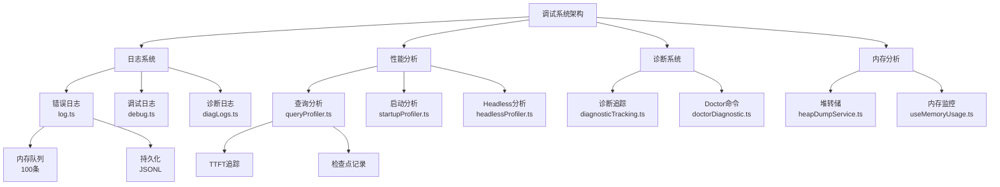
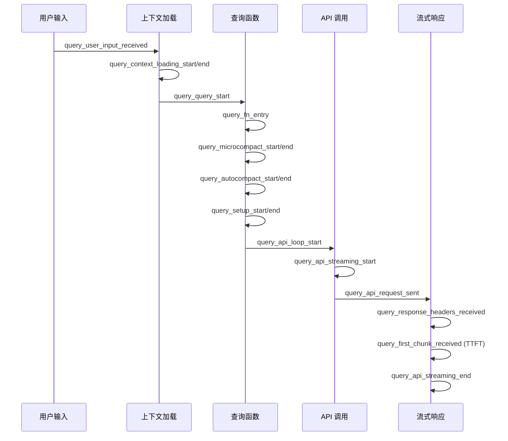

Claude Code 构建了多层次的调试基础设施，从错误日志收集到细粒度的性能分析，为开发者提供了完整的工具链来诊断问题、优化性能并理解系统行为。这套系统设计遵循**渐进式启用**原则——默认情况下零开销，仅在需要时通过环境变量或命令行参数激活。

## 核心架构概览

调试系统分为四个主要子系统，每个系统针对不同的诊断场景：



**Sources**: [log.ts](src/utils/log.ts#L1-L363), [debug.ts](src/utils/debug.ts#L1-L269), [queryProfiler.ts](src/utils/queryProfiler.ts#L1-L302), [startupProfiler.ts](src/utils/startupProfiler.ts#L1-L195), [heapDumpService.ts](src/utils/heapDumpService.ts#L1-L304)

## 日志系统：三层架构

### 错误日志：内存队列 + 持久化

错误日志系统采用**双轨制**：内存队列提供快速访问，持久化文件确保长期保留。系统维护一个**环形缓冲区**存储最近 100 条错误，同时将错误异步写入 JSONL 格式的日志文件。

```typescript
// 内存队列实现
const MAX_IN_MEMORY_ERRORS = 100
let inMemoryErrorLog: Array<{ error: string; timestamp: string }> = []

function addToInMemoryErrorLog(errorInfo: {
  error: string
  timestamp: string
}): void {
  if (inMemoryErrorLog.length >= MAX_IN_MEMORY_ERRORS) {
    inMemoryErrorLog.shift() // 移除最旧的错误
  }
  inMemoryErrorLog.push(errorInfo)
}
```

**队列式设计**：在应用启动早期，当日志 sink 尚未初始化时，所有错误事件被推入队列。一旦 sink 附加，队列立即排空，确保无错误丢失。这种设计避免了循环依赖——`log.ts` 不依赖任何重型模块，所有事件通过队列传递。

```typescript
// 队列机制
type QueuedErrorEvent =
  | { type: 'error'; error: Error }
  | { type: 'mcpError'; serverName: string; error: unknown }
  | { type: 'mcpDebug'; serverName: string; message: string }

const errorQueue: QueuedErrorEvent[] = []

export function attachErrorLogSink(newSink: ErrorLogSink): void {
  if (errorLogSink !== null) return // 幂等性：只附加一次
  
  errorLogSink = newSink
  
  // 立即排空队列
  if (errorQueue.length > 0) {
    const queuedEvents = [...errorQueue]
    errorQueue.length = 0
    
    for (const event of queuedEvents) {
      // 分发到对应的日志方法
      switch (event.type) {
        case 'error':
          errorLogSink.logError(event.error)
          break
        case 'mcpError':
          errorLogSink.logMCPError(event.serverName, event.error)
          break
        case 'mcpDebug':
          errorLogSink.logMCPDebug(event.serverName, event.message)
          break
      }
    }
  }
}
```

**隐私保护**：错误报告默认禁用，仅在满足条件时启用——非云提供商（Bedrock/Vertex/Foundry）、非 essential traffic only 模式、且未设置 `DISABLE_ERROR_REPORTING` 环境变量。

**Sources**: [log.ts](src/utils/log.ts#L22-L113), [errorLogSink.ts](src/utils/errorLogSink.ts#L1-L236)

### 调试日志：缓冲写入 + 智能过滤

调试日志系统支持**多级日志级别**和**模式过滤**，通过缓冲写入器减少 I/O 开销。系统默认使用 `debug` 级别，过滤掉 `verbose` 级别的高频诊断消息。

**日志级别系统**：

| 级别 | 数值 | 用途 | 环境变量 |
|------|------|------|----------|
| verbose | 0 | 高频诊断（完整 statusLine、shell、stdout/stderr） | `CLAUDE_CODE_DEBUG_LOG_LEVEL=verbose` |
| debug | 1 | 默认调试输出 | 默认值 |
| info | 2 | 信息性消息 | - |
| warn | 3 | 警告 | - |
| error | 4 | 错误 | - |

**模式过滤**：通过 `--debug=<pattern>` 语法按类别过滤调试消息。支持**包含模式**（只显示指定类别）和**排除模式**（排除指定类别），但不能混合使用。

```typescript
// 过滤器解析示例
"api,hooks"        // 包含模式：只显示 api 和 hooks 类别
"!1p,!file"        // 排除模式：排除 1p 和 file 类别
undefined/empty    // 无过滤：显示所有消息

// 类别提取逻辑
"MCP server \"name\": message"         → ["mcp", "name"]
"[ANT-ONLY] 1P event: tengu_timer"     → ["ant-only", "1p"]
"AutoUpdaterWrapper: Installation..."  → ["autoupdaterwrapper"]
```

**缓冲写入策略**：非调试模式下使用**异步缓冲写入**，每秒刷新一次，最大缓冲 100 条消息。调试模式下切换到**同步立即写入**，确保在 `process.exit()` 时日志不丢失。

**Sources**: [debug.ts](src/utils/debug.ts#L1-L269), [debugFilter.ts](src/utils/debugFilter.ts#L1-L158)

### 诊断日志：无 PII 的结构化日志

诊断日志系统专为**容器化环境监控**设计，通过 `session-ingress` 发送至环境管理器。关键约束：**绝对不能包含 PII**（文件路径、项目名、仓库名、提示词等）。

**计时包装器**：`withDiagnosticsTiming` 自动记录操作的开始、完成和失败事件，包含持续时间：

```typescript
export async function withDiagnosticsTiming<T>(
  event: string,
  fn: () => Promise<T>,
  getData?: (result: T) => Record<string, unknown>,
): Promise<T> {
  const startTime = Date.now()
  logForDiagnosticsNoPII('info', `${event}_started`)
  
  try {
    const result = await fn()
    const additionalData = getData ? getData(result) : {}
    logForDiagnosticsNoPII('info', `${event}_completed`, {
      duration_ms: Date.now() - startTime,
      ...additionalData,
    })
    return result
  } catch (error) {
    logForDiagnosticsNoPII('error', `${event}_failed`, {
      duration_ms: Date.now() - startTime,
    })
    throw error
  }
}
```

**Sources**: [diagLogs.ts](src/utils/diagLogs.ts#L1-L95), [internalLogging.ts](src/services/internalLogging.ts#L1-L91)

## 性能分析系统：三个分析器

性能分析系统基于 Node.js 内置的 `perf_hooks` API，提供三个专用分析器，分别针对查询、启动和 headless 模式。

### 查询性能分析器：TTFT 追踪

查询分析器追踪**从用户输入到首令牌到达**的完整时间线，识别瓶颈。启用方式：`CLAUDE_CODE_PROFILE_QUERY=1`。

**检查点时间线**：



**慢操作检测**：自动标记超过阈值的操作：
- 超过 1000ms：`⚠️ VERY SLOW`
- 超过 100ms：`⚠️ SLOW`
- git status > 50ms：`⚠️ git status`
- tool schema > 50ms：`⚠️ tool schemas`

**报告格式**：

```
================================================================================
QUERY PROFILING REPORT - Query #1
================================================================================

[+     0.000ms] (+     0.000ms) query_user_input_received | RSS: 45.2 MB, Heap: 22.1 MB
[+    15.234ms] (+    15.234ms) query_context_loading_start | RSS: 45.5 MB, Heap: 22.3 MB
[+    45.678ms] (+    30.444ms) query_context_loading_end | RSS: 46.1 MB, Heap: 22.8 MB
[+    50.123ms] (+     4.445ms) query_api_request_sent | RSS: 46.2 MB, Heap: 22.9 MB
[+   125.456ms] (+    75.333ms) query_first_chunk_received | RSS: 48.3 MB, Heap: 24.1 MB

--------------------------------------------------------------------------------
Total TTFT: 125.456ms
  - Pre-request overhead: 50.123ms (39.9%)
  - Network latency: 75.333ms (60.1%)
================================================================================
```

**Sources**: [queryProfiler.ts](src/utils/queryProfiler.ts#L1-L302), [profilerBase.ts](src/utils/profilerBase.ts#L1-L47)

### 启动性能分析器：采样 + 详细分析

启动分析器采用**双模式设计**：采样模式用于生产环境监控，详细模式用于深度分析。

**采样策略**：
- 内部用户：100% 采样
- 外部用户：0.5% 采样
- 详细分析：`CLAUDE_CODE_PROFILE_STARTUP=1`

**阶段定义**：

| 阶段 | 起始检查点 | 结束检查点 | 描述 |
|------|-----------|-----------|------|
| import_time | cli_entry | main_tsx_imports_loaded | 模块导入时间 |
| init_time | init_function_start | init_function_end | 初始化函数时间 |
| settings_time | eagerLoadSettings_start | eagerLoadSettings_end | 设置加载时间 |
| total_time | cli_entry | main_after_run | 总启动时间 |

**内存快照**：仅在详细模式下捕获，记录每个检查点的 RSS 和堆使用情况。

**Sources**: [startupProfiler.ts](src/utils/startupProfiler.ts#L1-L195)

### Headless 性能分析器：转向延迟

Headless 分析器追踪**非交互模式**（`-p` 打印模式）的转向延迟，采样策略：内部用户 100%，外部用户 5%。

**关键指标**：
- **首系统消息时间**（turn 0）：从进程启动到输出系统消息
- **查询启动时间**：从转向开始到查询发起
- **首响应时间**：从转向开始到首块到达
- **查询开销**：查询启动到 API 请求发送的时间

**Sources**: [headlessProfiler.ts](src/utils/headlessProfiler.ts#L1-L179)

### FPS 追踪器：渲染性能

FPS 追踪器测量终端 UI 的渲染性能，计算**平均 FPS** 和**低 1% FPS**（最差的 1% 帧的 FPS 值）。

```typescript
export class FpsTracker {
  private frameDurations: number[] = []
  private firstRenderTime: number | undefined
  private lastRenderTime: number | undefined

  record(durationMs: number): void {
    const now = performance.now()
    if (this.firstRenderTime === undefined) {
      this.firstRenderTime = now
    }
    this.lastRenderTime = now
    this.frameDurations.push(durationMs)
  }

  getMetrics(): FpsMetrics | undefined {
    const totalTimeMs = this.lastRenderTime! - this.firstRenderTime!
    const totalFrames = this.frameDurations.length
    const averageFps = totalFrames / (totalTimeMs / 1000)

    // 计算 P99 帧时间（最慢的 1%）
    const sorted = this.frameDurations.slice().sort((a, b) => b - a)
    const p99Index = Math.max(0, Math.ceil(sorted.length * 0.01) - 1)
    const p99FrameTimeMs = sorted[p99Index]!
    const low1PctFps = p99FrameTimeMs > 0 ? 1000 / p99FrameTimeMs : 0

    return {
      averageFps: Math.round(averageFps * 100) / 100,
      low1PctFps: Math.round(low1PctFps * 100) / 100,
    }
  }
}
```

**Sources**: [fpsTracker.ts](src/utils/fpsTracker.ts#L1-L48), [fpsMetrics.tsx](src/context/fpsMetrics.tsx#L1-L30)

## 诊断系统：IDE 集成 + 系统检查

### 诊断追踪服务：文件编辑前后对比

诊断追踪服务与 IDE 集成，捕获**文件编辑前后的诊断变化**（错误、警告、信息、提示）。服务维护基线诊断，在每次文件编辑后获取新诊断，通过对比识别**新增问题**。

**协议前缀处理**：
- `file://`：普通文件
- `_claude_fs_right:`：右侧文件（diff 视图）
- `_claude_fs_left:`：左侧文件（diff 视图）

**路径规范化**：Windows 平台上路径比较使用**大小写不敏感**匹配，确保跨平台一致性。

**诊断结构**：

```typescript
export interface Diagnostic {
  message: string
  severity: 'Error' | 'Warning' | 'Info' | 'Hint'
  range: {
    start: { line: number; character: number }
    end: { line: number; character: number }
  }
  source?: string
  code?: string
}

export interface DiagnosticFile {
  uri: string
  diagnostics: Diagnostic[]
}
```

**Sources**: [diagnosticTracking.ts](src/services/diagnosticTracking.ts#L1-L398), [DiagnosticsDisplay.tsx](src/components/DiagnosticsDisplay.tsx#L1-L95)

### Doctor 命令：全面系统诊断

Doctor 命令（`/doctor`）执行**全面的系统诊断**，检查安装类型、版本、权限、MCP 配置、沙箱状态等。

**诊断信息结构**：

```typescript
export type DiagnosticInfo = {
  installationType: InstallationType  // npm-global/npm-local/native/package-manager/development/unknown
  version: string
  installationPath: string
  invokedBinary: string
  configInstallMethod: InstallMethod | 'not set'
  autoUpdates: string
  hasUpdatePermissions: boolean | null
  multipleInstallations: Array<{ type: string; path: string }>
  warnings: Array<{ issue: string; fix: string }>
  recommendation?: string
  packageManager?: string
  ripgrepStatus: {
    working: boolean
    mode: 'system' | 'builtin' | 'embedded'
    systemPath: string | null
  }
}
```

**安装类型检测逻辑**：

1. **开发模式**：`NODE_ENV === 'development'`
2. **打包模式**：`isInBundledMode()` 检测
   - 如果检测到包管理器→ `package-manager`
   - 否则 → `native`
3. **本地 npm 安装**：`isRunningFromLocalInstallation()`
4. **全局 npm 安装**：路径包含标准 npm 全局位置，或通过 `npm config get prefix` 验证
5. **未知**：无法确定

**Sources**: [doctorDiagnostic.ts](src/utils/doctorDiagnostic.ts#L1-L626), [Doctor.tsx](src/screens/Doctor.tsx#L1-L575)

## 内存分析系统：堆转储 + 实时监控

### 堆转储服务：内存诊断 + 快照

堆转储服务捕获**V8 堆快照**和**详细的内存诊断**，帮助识别内存泄漏。触发方式：手动（`/heapdump` 命令）或自动（RSS 达 1.5GB）。

**内存诊断结构**：

```typescript
export type MemoryDiagnostics = {
  timestamp: string
  sessionId: string
  trigger: 'manual' | 'auto-1.5GB'
  dumpNumber: number  // 第几次自动转储
  uptimeSeconds: number
  memoryUsage: {
    heapUsed: number
    heapTotal: number
    external: number
    arrayBuffers: number
    rss: number
  }
  memoryGrowthRate: {
    bytesPerSecond: number
    mbPerHour: number
  }
  v8HeapStats: {
    heapSizeLimit: number
    mallocedMemory: number        // V8 堆外分配的内存
    peakMallocedMemory: number
    detachedContexts: number      // 泄漏的上下文 - 关键泄漏指标！
    nativeContexts: number
  }
  v8HeapSpaces?: Array<{
    name: string
    size: number
    used: number
    available: number
  }>
  resourceUsage: {
    maxRSS: number
    userCPUTime: number
    systemCPUTime: number
  }
  activeHandles: number           // 活跃的定时器、socket、文件句柄
  activeRequests: number          // 待处理的异步操作
  openFileDescriptors?: number    // Linux/macOS - 指示资源泄漏
  analysis: {
    potentialLeaks: string[]
    recommendation: string
  }
  smapsRollup?: string            // Linux 专用 - 详细内存分解
}
```

**潜在泄漏检测**：

```typescript
const potentialLeaks: string[] = []

if (heapStats.number_of_detached_contexts > 0) {
  potentialLeaks.push(
    `${heapStats.number_of_detached_contexts} detached context(s) - possible iframe/context leak`
  )
}
if (activeHandles > 100) {
  potentialLeaks.push(
    `${activeHandles} active handles - possible timer/socket leak`
  )
}
if (nativeMemory > usage.heapUsed) {
  potentialLeaks.push(
    'Native memory > heap - leak may be in native addons (node-pty, sharp, etc.)'
  )
}
if (mbPerHour > 100) {
  potentialLeaks.push(
    `High memory growth rate: ${mbPerHour.toFixed(1)} MB/hour`
  )
}
if (openFileDescriptors && openFileDescriptors > 500) {
  potentialLeaks.push(
    `${openFileDescriptors} open file descriptors - possible file/socket leak`
  )
}
```

**Sources**: [heapDumpService.ts](src/utils/heapDumpService.ts#L1-L304)

### 内存使用监控：实时轮询

内存监控 hook 每 10 秒轮询一次堆使用情况，仅在**内存异常时返回数据**，避免不必要的重新渲染。

**阈值定义**：

| 状态 | 阈值 | 显示颜色 |
|------|------|----------|
| normal | < 1.5GB | 不显示 |
| high | 1.5GB - 2.5GB | warning (黄色) |
| critical | >= 2.5GB | error (红色) |

```typescript
const HIGH_MEMORY_THRESHOLD = 1.5 * 1024 * 1024 * 1024      // 1.5GB
const CRITICAL_MEMORY_THRESHOLD = 2.5 * 1024 * 1024 * 1024  // 2.5GB

export function useMemoryUsage(): MemoryUsageInfo | null {
  const [memoryUsage, setMemoryUsage] = useState<MemoryUsageInfo | null>(null)

  useInterval(() => {
    const heapUsed = process.memoryUsage().heapUsed
    const status: MemoryUsageStatus =
      heapUsed >= CRITICAL_MEMORY_THRESHOLD
        ? 'critical'
        : heapUsed >= HIGH_MEMORY_THRESHOLD
          ? 'high'
          : 'normal'
    
    setMemoryUsage(prev => {
      // 正常状态时不返回数据，避免重新渲染
      if (status === 'normal') return prev === null ? prev : null
      return { heapUsed, status }
    })
  }, 10_000)

  return memoryUsage
}
```

**Sources**: [useMemoryUsage.ts](src/hooks/useMemoryUsage.ts#L1-L40), [MemoryUsageIndicator.tsx](src/components/MemoryUsageIndicator.tsx#L1-L37)

## 实用命令与技巧

### 调试命令

| 命令/参数 | 用途 | 示例 |
|-----------|------|------|
| `--debug` | 启用调试模式 | `claude --debug` |
| `--debug=<pattern>` | 过滤调试日志 | `claude --debug=api,hooks` |
| `--debug-to-stderr` | 输出到 stderr | `claude --debug-to-stderr` |
| `--debug-file=<path>` | 指定日志文件 | `claude --debug-file=./debug.log` |
| `/doctor` | 系统诊断 | 在 REPL 中输入 `/doctor` |
| `/heapdump` | 堆转储 | 在 REPL 中输入 `/heapdump` |

### 环境变量

| 变量 | 用途 | 默认值 |
|------|------|--------|
| `DEBUG` | 启用调试模式 | false |
| `CLAUDE_CODE_DEBUG_LOG_LEVEL` | 日志级别 | debug |
| `CLAUDE_CODE_PROFILE_QUERY` | 查询分析 | false |
| `CLAUDE_CODE_PROFILE_STARTUP` | 启动分析 | false |
| `DISABLE_ERROR_REPORTING` | 禁用错误报告 | false |

### 日志文件位置

所有日志存储在平台特定的缓存目录：

```
~/.cache/claude-cli/<project-hash>/
├── debug/
│   ├── latest -> <session-id>.txt  # 最新日志符号链接
│   └── <session-id>.txt            # 调试日志
├── errors/
│   └── <date>.jsonl                # 错误日志
├── mcp-logs-<server-name>/
│   └── <date>.jsonl                # MCP 日志
└── messages/
    └── <session-id>.jsonl          # 消息日志
```

**Sources**: [cachePaths.ts](src/utils/cachePaths.ts#L1-L39)

## 设计原则与最佳实践

### 渐进式启用

所有分析器遵循**零默认开销**原则——只有在显式启用时才产生性能成本。采样机制确保生产环境中的监控开销最小化（外部用户仅 0.5%-5% 采样）。

### 队列式解耦

错误日志系统通过队列机制避免循环依赖，允许 `log.ts` 在应用启动早期加载，而将重型实现（文件 I/O、网络上传）延迟到 sink 附加时。

### 隐私优先

诊断日志系统**绝对禁止 PII**，确保在容器化环境中安全传输。错误报告默认禁用，仅在用户未配置隐私保护时启用。

### 内存效率

内存监控 hook 通过**条件返回**避免每 10 秒触发一次重新渲染——仅在内存异常时返回数据，正常状态下返回 null。

### 同步 vs 异步

调试日志在**调试模式**下使用同步写入，确保 `process.exit()` 时日志完整。非调试模式下使用异步缓冲写入，每秒刷新一次，减少 I/O 开销。

**Sources**: [log.ts](src/utils/log.ts#L22-L113), [debug.ts](src/utils/debug.ts#L130-L199), [useMemoryUsage.ts](src/hooks/useMemoryUsage.ts#L25-L35)

## 延伸阅读

- **工具系统架构**：了解工具执行如何与日志系统集成 - [工具系统架构：从 Tool 接口到 40+ 工具实现](6-gong-ju-xi-tong-jia-gou-cong-tool-jie-kou-dao-40-gong-ju-shi-xian)
- **性能优化策略**：探索并发执行与批处理如何影响性能分析 - [并发执行策略：工具批处理与安全判定](8-bing-fa-zhi-xing-ce-lue-gong-ju-pi-chu-li-yu-an-quan-pan-ding)
- **React 状态管理**：理解日志状态如何集成到全局状态 - [AppState 设计：React 状态管理与订阅机制](12-appstate-she-ji-react-zhuang-tai-guan-li-yu-ding-yue-ji-zhi)
- **代码风格与约定**：学习日志相关的命名约定 - [代码风格与命名约定](43-dai-ma-feng-ge-yu-ming-ming-yue-ding)