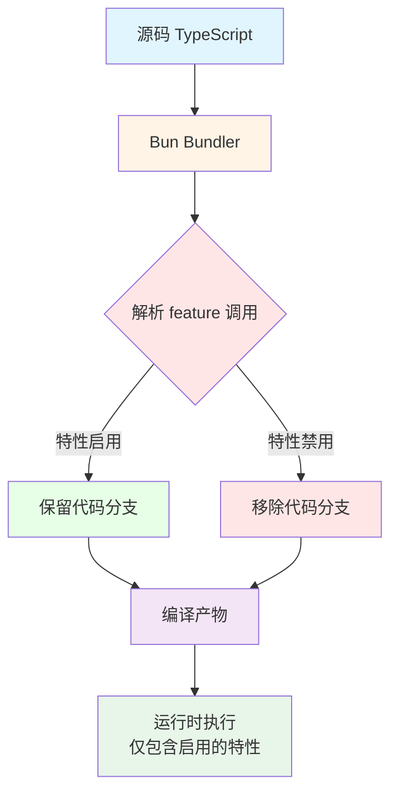
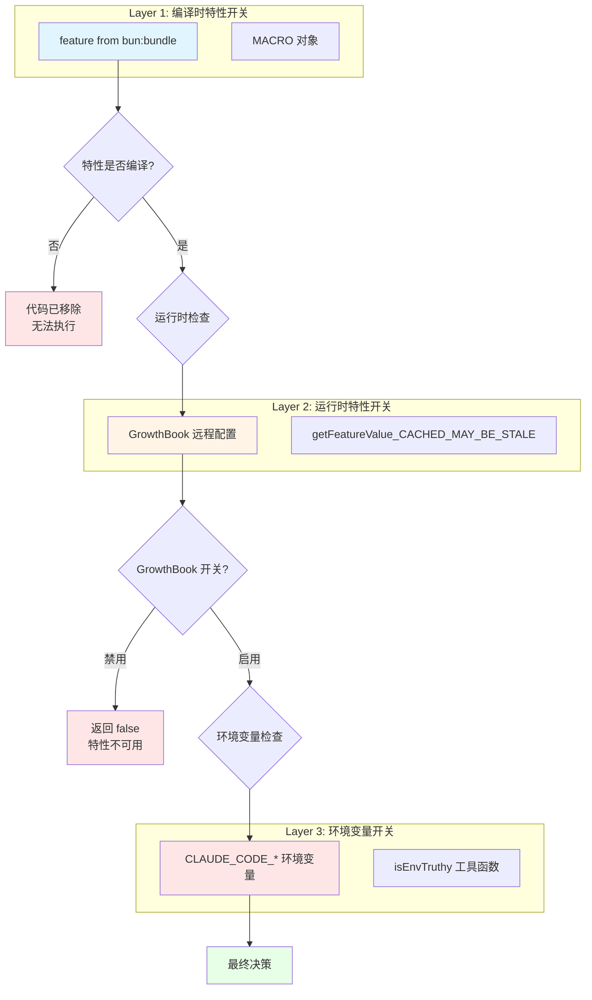

Claude Code 采用 **Bun bundler 的编译时特性开关系统**实现代码的条件编译与死代码消除。这套机制允许源码同时支持内部版本与外部发布版本，通过 `feature()` 函数在构建时决定哪些代码路径被保留、哪些被完全剔除。本页深入剖析该机制的设计原理、实现模式与最佳实践。

## 核心机制：编译时特性开关

Bun bundle feature flags 是 **静态编译时机制**，与运行时特性开关（如 GrowthBook）本质不同。当执行 `bun build` 编译时，Bun 的打包器会解析 `import { feature } from 'bun:bundle'` 调用，根据特性配置将条件分支中不可达的代码完全移除。



核心导入语法为：

```typescript
import { feature } from 'bun:bundle'

// 编译时决定：如果 BRIDGE_MODE 特性未启用，整个 if 分支被移除
if (feature('BRIDGE_MODE') && args[0] === 'remote-control') {
  // 此代码块仅存在于启用了 BRIDGE_MODE 的构建版本中
  await bridgeMain(args.slice(1))
}
```

**关键特性**：
- **零运行时开销**：特性判断在构建时完成，运行时直接执行保留的代码路径
- **完全移除**：被剔除的代码不会出现在最终构建产物中，包括字符串字面量
- **类型安全**：TypeScript 编译器仍会检查所有代码路径，确保类型一致性
- **构建隔离**：不同构建目标（内部 vs 外部）生成完全不同的二进制文件

Sources: [cli.tsx](src/entrypoints/cli.tsx#L1-L50)

## 构建时宏：MACRO 对象

除了布尔型的 `feature()` 开关，Claude Code 还使用 **MACRO 对象**注入构建时常量。这些宏在编译时被替换为字面值，常用于版本号、构建时间戳等元信息。

```typescript
// --version 快速路径：零模块加载，仅使用编译时注入的版本号
if (args[0] === '--version') {
  console.log(`${MACRO.VERSION} (Claude Code)`)
  return
}

// /version 命令：根据构建配置显示不同信息
const call = async () => {
  return {
    type: 'text',
    value: MACRO.BUILD_TIME
      ? `${MACRO.VERSION} (built ${MACRO.BUILD_TIME})`
      : MACRO.VERSION,
  }
}
```

**MACRO vs feature() 的区别**：

| 维度 | `feature()` | `MACRO.*` |
|------|-------------|-----------|
| **返回类型** | 布尔值 | 任意类型（字符串、数字、对象） |
| **典型用途** | 条件编译、特性开关 | 注入构建元数据、配置值 |
| **代码移除** | 移除整个 false 分支 | 不移除代码，仅替换值 |
| **示例** | `feature('VOICE_MODE')` | `MACRO.VERSION`, `MACRO.BUILD_TIME` |

Sources: [cli.tsx](src/entrypoints/cli.tsx#L25-L31), [version.ts](src/commands/version.ts#L5-L9)

## 死代码消除模式

Claude Code 遵循 **正向三元组模式** 确保死代码消除效果最大化。关键规则是：**避免使用 `if (!feature(...))` 负向判断**，因为负向分支中的字符串字面量可能无法被完全移除。

```typescript
// ✅ 正确模式：正向三元组
export function isVoiceGrowthBookEnabled(): boolean {
  // Positive ternary pattern — see docs/feature-gating.md.
  // 负向模式 if (!feature(...)) return 无法从外部构建中
  // 移除内联字符串字面量
  return feature('VOICE_MODE')
    ? !getFeatureValue_CACHED_MAY_BE_STALE('tengu_amber_quartz_disabled', false)
    : false
}

// ❌ 错误模式：负向判断
if (!feature('VOICE_MODE')) {
  return false // 字符串可能残留
}
return !getFeatureValue_CACHED_MAY_BE_STALE(...)
```

**DCE 保证**：
- 当 `feature('VOICE_MODE')` 为 `false` 时，整个三元表达式折叠为 `false`
- GrowthBook 相关的字符串 `'tengu_amber_quartz_disabled'` 和函数调用 `getFeatureValue_CACHED_MAY_BE_STALE` 被完全移除
- 外部构建版本中不存在任何语音模式的运行时检查代码

Sources: [voiceModeEnabled.ts](src/voice/voiceModeEnabled.ts#L11-L20)

## 多层特性开关架构

Claude Code 实际上使用 **三层特性开关系统**，每层解决不同的问题域。理解这些层次的交互是掌握整个特性管理机制的关键。



### 第一层：编译时特性开关

**作用域**：决定哪些代码路径存在于构建产物中。  
**触发时机**：`bun build` 编译时。  
**典型应用**：区分内部版本与外部发布版本的功能集。

```typescript
// 内部特性：DAEMON（守护进程模式）
if (feature('DAEMON') && args[0] === 'daemon') {
  await daemonMain(args.slice(1))
  return
}

// 内部特性：TEMPLATES（模板任务系统）
if (feature('TEMPLATES') && args[0] === 'new') {
  await templatesMain(args)
  process.exit(0)
}

// 平台检测：IS_LIBC_MUSL / IS_LIBC_GLIBC
function isMuslEnvironment(): boolean {
  if (feature('IS_LIBC_MUSL')) return true  // 原生 Linux 构建
  if (feature('IS_LIBC_GLIBC')) return false
  // 回退到运行时检测（仅限未打包的 node 环境）
  return muslRuntimeCache ?? false
}
```

Sources: [cli.tsx](src/entrypoints/cli.tsx#L115-L119), [cli.tsx](src/entrypoints/cli.tsx#L200-L210), [envDynamic.ts](src/utils/envDynamic.ts#L38-L49)

### 第二层：运行时特性开关

**作用域**：在编译时特性已启用的前提下，通过远程配置动态控制功能可用性。  
**触发时机**：应用启动时从 GrowthBook 服务拉取配置，运行时缓存查询。  
**典型应用**：灰度发布、紧急开关、A/B 测试。

```typescript
export function isAgentSwarmsEnabled(): boolean {
  // Ant 内部版本：始终启用
  if (process.env.USER_TYPE === 'ant') {
    return true
  }

  // 外部版本：需要显式选择启用
  if (!isEnvTruthy(process.env.CLAUDE_CODE_EXPERIMENTAL_AGENT_TEAMS)) {
    return false
  }

  // Killswitch：GrowthBook 可以在任何时候关闭外部用户的功能
  if (!getFeatureValue_CACHED_MAY_BE_STALE('tengu_amber_flint', true)) {
    return false
  }

  return true
}
```

**缓存策略**：`_CACHED_MAY_BE_STALE` 后缀表示函数返回的值可能是磁盘缓存（陈旧值）。这是性能与实时性的权衡：首次启动时使用缓存避免阻塞，后台异步刷新 GrowthBook 配置。

Sources: [agentSwarmsEnabled.ts](src/utils/agentSwarmsEnabled.ts#L22-L43)

### 第三层：环境变量开关

**作用域**：用户级别的功能选择启用或调试控制。  
**触发时机**：进程启动时读取环境变量。  
**典型应用**：实验性功能、调试模式、性能优化。

```typescript
// 环境变量 + 编译时特性的组合示例
export function isFastModeEnabled(): boolean {
  return !isEnvTruthy(process.env.CLAUDE_CODE_DISABLE_FAST_MODE)
}

// 多层检查示例：Ablation baseline
if (feature('ABLATION_BASELINE') && process.env.CLAUDE_CODE_ABLATION_BASELINE) {
  // 仅在编译时启用 AND 环境变量设置时执行
  for (const k of ['CLAUDE_CODE_SIMPLE', 'CLAUDE_CODE_DISABLE_THINKING']) {
    process.env[k] ??= '1'
  }
}
```

Sources: [fastMode.ts](src/utils/fastMode.ts#L15-L17), [cli.tsx](src/entrypoints/cli.tsx#L16-L24)

## 已知特性开关清单

通过代码考古分析，以下是 Claude Code 源码中已识别的编译时特性开关：

| 特性名称 | 用途 | 启用范围 |
|---------|------|---------|
| `ABLATION_BASELINE` | Harness-science L0 消融基线实验 | 内部版本 |
| `DUMP_SYSTEM_PROMPT` | 导出系统提示词（用于评估） | 内部版本 |
| `CHICAGO_MCP` | Computer Use MCP 服务器 | 内部版本 |
| `DAEMON` | 守护进程模式（长期运行的后台服务） | 内部版本 |
| `BG_SESSIONS` | 后台会话管理 | 内部版本 |
| `TEMPLATES` | 模板任务系统 | 内部版本 |
| `BRIDGE_MODE` | IDE 远程控制桥接模式 | 内部版本 |
| `BYOC_ENVIRONMENT_RUNNER` | 自定义环境运行器 | 内部版本 |
| `SELF_HOSTED_RUNNER` | 自托管运行器 | 内部版本 |
| `VOICE_MODE` | 语音输入模式 | 内部版本（外部需环境变量 + GrowthBook） |
| `IS_LIBC_MUSL` | Linux MUSL libc 检测（原生构建） | Linux 原生构建 |
| `IS_LIBC_GLIBC` | Linux glibc 检测（原生构建） | Linux 原生构建 |

Sources: [cli.tsx](src/entrypoints/cli.tsx#L16-L100), [envDynamic.ts](src/utils/envDynamic.ts#L38-L49), [voiceModeEnabled.ts](src/voice/voiceModeEnabled.ts#L11-L20)

## 实现模式与最佳实践

### 模式 1：快速路径优化

利用特性开关实现零开销的快速路径。当特性未启用时，整个代码块被移除，不产生任何运行时成本。

```typescript
async function main(): Promise<void> {
  const args = process.argv.slice(2)

  // 快速路径：--version 零模块加载
  if (args[0] === '--version') {
    console.log(`${MACRO.VERSION} (Claude Code)`)
    return
  }

  // 特性门控的快速路径：仅当 DAEMON 启用时才加载守护进程代码
  if (feature('DAEMON') && args[0] === 'daemon') {
    const { daemonMain } = await import('../daemon/main.js')
    await daemonMain(args.slice(1))
    return
  }

  // 默认路径：加载完整 CLI
  const { main: cliMain } = await import('../main.js')
  await cliMain()
}
```

**优势**：
- 版本检查路径不加载任何模块，响应时间 <10ms
- 守护进程代码仅在需要时加载，减少主路径的模块解析成本
- 外部版本完全不包含内部命令的导入语句

Sources: [cli.tsx](src/entrypoints/cli.tsx#L22-L100)

### 模式 2：组合特性检查

将编译时特性、运行时特性、环境变量组合为多层防护，确保安全性与灵活性。

```typescript
export function isVoiceModeEnabled(): boolean {
  // 第一层：编译时特性
  // 第二层：GrowthBook killswitch
  const growthBookEnabled = feature('VOICE_MODE')
    ? !getFeatureValue_CACHED_MAY_BE_STALE('tengu_amber_quartz_disabled', false)
    : false
  
  if (!growthBookEnabled) {
    return false
  }

  // 第三层：运行时认证检查
  const tokens = getClaudeAIOAuthTokens()
  return Boolean(tokens?.accessToken)
}
```

**防御深度**：
1. 外部构建版本：`feature('VOICE_MODE')` 为 false，所有语音代码被移除
2. 内部构建但 GrowthBook 关闭：返回 false，不加载语音模块
3. GrowthBook 启用但未认证：返回 false，提示用户登录
4. 所有检查通过：启用语音模式

Sources: [voiceModeEnabled.ts](src/voice/voiceModeEnabled.ts#L43-L55)

### 模式 3：条件模块导入

使用动态导入（`import()`）结合特性开关，避免加载不需要的模块及其依赖树。

```typescript
// 条件导入：仅当特性启用时才加载重量级模块
if (feature('DUMP_SYSTEM_PROMPT') && args[0] === '--dump-system-prompt') {
  const { enableConfigs } = await import('../utils/config.js')
  enableConfigs()
  
  const { getMainLoopModel } = await import('../utils/model/model.js')
  const { getSystemPrompt } = await import('../constants/prompts.js')
  
  const prompt = await getSystemPrompt([], getMainLoopModel())
  console.log(prompt.join('\n'))
  return
}
```

**模块加载优化**：
- `enableConfigs()`、`getMainLoopModel()`、`getSystemPrompt()` 仅在此路径加载
- 外部版本不包含这些函数的导入语句，减少包体积
- 避免在启动时加载仅用于特殊命令的依赖

Sources: [cli.tsx](src/entrypoints/cli.tsx#L52-L67)

### 模式 4：平台特定代码路径

使用特性开关实现跨平台构建的代码隔离，避免运行时平台检测开销。

```typescript
// 原生构建：编译时已确定 libc 类型
// Node 构建：回退到异步运行时检测
function isMuslEnvironment(): boolean {
  // 编译时常量：原生 Linux 构建时 Bun 注入 IS_LIBC_MUSL/IS_LIBC_GLIBC
  if (feature('IS_LIBC_MUSL')) return true
  if (feature('IS_LIBC_GLIBC')) return false

  // 回退路径：仅当两个特性都为 false（未打包的 node 环境）
  // 此时使用预填充的缓存避免同步 I/O
  if (process.platform !== 'linux') return false
  return muslRuntimeCache ?? false
}

// 模块加载时启动异步缓存预热（仅 node 路径需要）
if (process.platform === 'linux') {
  const muslArch = process.arch === 'x64' ? 'x86_64' : 'aarch64'
  void stat(`/lib/libc.musl-${muslArch}.so.1`).then(
    () => { muslRuntimeCache = true },
    () => { muslRuntimeCache = false }
  )
}
```

**平台优化策略**：
- 原生 Linux 构建：`feature('IS_LIBC_MUSL')` 或 `feature('IS_LIBC_GLIBC')` 为 true，整个回退路径被移除
- macOS/Windows 构建：所有 Linux 相关代码被移除
- Node 运行：两个特性都为 false，使用异步缓存预热

Sources: [envDynamic.ts](src/utils/envDynamic.ts#L32-L55)

## 调试与分析方法

在静态分析环境中（无构建工具），理解特性开关的实际效果需要通过以下方法：

### 1. 识别特性开关调用

搜索模式：
```bash
# 查找所有特性开关调用
findstr /s /n "feature(" src\*.ts src\*.tsx

# 查找所有 MACRO 使用
findstr /s /n "MACRO\." src\*.ts src\*.tsx
```

### 2. 理解特性作用域

通过代码注释和上下文推断特性的用途：
- **内部特性**：通常带有 "ant-only"、"internal" 注释，用于内部工具和实验
- **平台特性**：如 `IS_LIBC_MUSL`，用于跨平台构建
- **功能特性**：如 `VOICE_MODE`、`DAEMON`，控制用户可见功能

### 3. 分析代码路径可达性

对于每个 `feature()` 调用，分析：
- **条件分支**：`if (feature(...))` 保留哪个分支？
- **依赖导入**：哪些动态导入仅在特性启用时加载？
- **字符串字面量**：负向判断中的字符串可能残留（应使用正向模式）

### 4. 验证 DCE 效果

通过构建产物的差异验证死代码消除：
- **内部版本**：应包含所有内部特性的代码路径
- **外部版本**：应完全移除内部特性相关的代码和字符串

## 架构决策记录

### 为什么选择 Bun bundle feature flags？

**性能考量**：
- 零运行时开销：特性判断在构建时完成
- 减少包体积：外部版本不包含内部实验代码
- 加快启动速度：快速路径避免加载重量级模块

**安全考量**：
- 代码隔离：内部工具的代码不会泄露到外部发布版本
- 防止误用：外部用户无法通过环境变量启用内部特性
- 减少攻击面：移除未使用代码减少潜在漏洞

**维护性考量**：
- 单一代码库：内部和外部版本共享同一份源码
- 类型安全：TypeScript 检查所有代码路径
- 渐进发布：通过 GrowthBook 控制灰度节奏

### 为什么需要三层特性开关？

每层解决不同的问题，组合使用实现灵活的功能管理：

| 层次 | 问题域 | 响应速度 | 控制粒度 |
|------|--------|---------|---------|
| **编译时** | 代码存在性 | 构建时确定 | 二进制级别 |
| **运行时** | 功能可用性 | 秒级（GrowthBook 刷新） | 用户级别 |
| **环境变量** | 用户选择 | 进程启动 | 会话级别 |

**组合优势**：
- 编译时特性确保代码隔离
- 运行时特性支持灰度发布和紧急关闭
- 环境变量允许用户选择启用实验功能

Sources: [README.md](README.md#L150-L160)

## 与其他页面的关联

- **[QueryEngine：LLM 查询循环与工具调度核心](5-queryengine-llm-cha-xun-xun-huan-yu-gong-ju-diao-du-he-xin)**：QueryEngine 在启动时可能根据特性开关加载不同的优化策略
- **[命令系统设计：50+ 斜杠命令的组织与注册](7-ming-ling-xi-tong-she-ji-50-xie-gang-ming-ling-de-zu-zhi-yu-zhu-ce)**：许多命令通过 `feature()` 控制是否注册到命令系统
- **[Bash 工具安全：只读判定与后台执行策略](10-bash-gong-ju-an-quan-zhi-du-pan-ding-yu-hou-tai-zhi-xing-ce-lue)**：`BG_SESSIONS` 特性控制后台会话管理功能的可用性
- **[多代理协调：Coordinator 模式与团队协作](37-duo-dai-li-xie-diao-coordinator-mo-shi-yu-tuan-dui-xie-zuo)**：`DAEMON` 特性启用守护进程模式，支持长期运行的协调器
- **[静态分析方法：无构建环境下的代码探索](46-jing-tai-fen-xi-fang-fa-wu-gou-jian-huan-jing-xia-de-dai-ma-tan-suo)**：本页演示的静态分析方法适用于分析特性开关的实际效果

## 总结

Bun bundle feature flags 机制是 Claude Code 架构的关键设计决策，通过 **编译时死代码消除** 实现代码隔离、性能优化和安全防护。核心要点：

1. **零运行时开销**：`feature()` 调用在构建时解析，不可达代码被完全移除
2. **正向模式优先**：使用 `feature() ? truePath : falsePath` 而非 `if (!feature())` 避免字符串残留
3. **多层防护**：编译时特性 → 运行时开关 → 环境变量的三层架构实现灵活控制
4. **快速路径优化**：结合动态导入避免加载不需要的模块，减少启动时间
5. **平台代码隔离**：使用特性开关实现跨平台构建，避免运行时检测开销

理解这套机制是深入分析 Claude Code 源码的关键，它解释了为什么同一份源码可以生成功能差异显著的内部版本和外部发布版本。