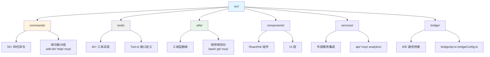
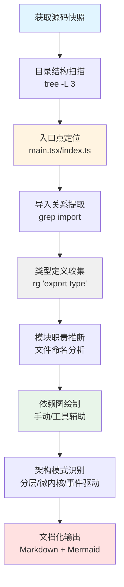
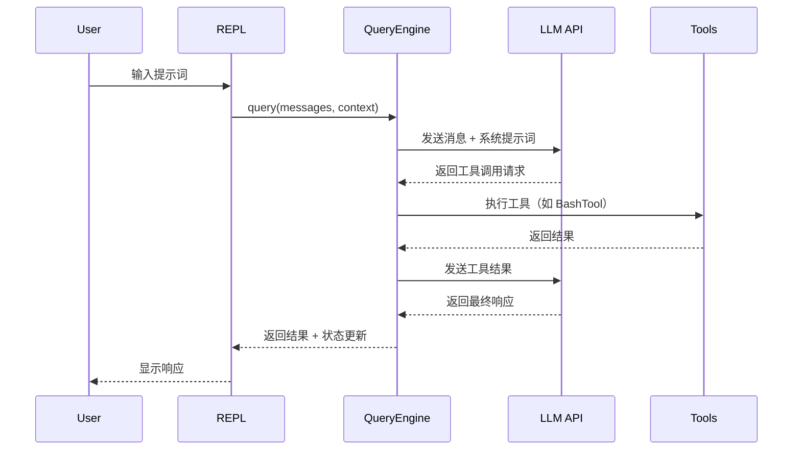

在软件供应链安全研究和快速架构理解场景中，开发者常常面临**无构建环境**的代码分析挑战——没有 `package.json`、`tsconfig.json` 或依赖安装，仅有原始源码快照。本页面系统化介绍静态分析方法论，帮助中级开发者掌握在不运行、不编译代码的前提下，通过**目录结构、命名约定、导入关系、类型签名**等表面特征推断系统架构和核心机制的技术。

## 核心挑战与应对策略

无构建环境下的静态分析面临三大核心挑战：**依赖关系不可见**（无 `package.json` 或 `node_modules`）、**类型系统断连**（无 `tsconfig.json` 编译上下文）、**运行时行为未知**（无法执行测试或调试）。应对策略是采用**代码考古学方法**：从文件系统布局推断模块边界，从导入语句重构依赖图，从函数签名推导数据流，从目录命名模式识别架构分层。

这种分析方法特别适用于：**安全审计**（分析泄露的源码快照）、**架构评估**（快速理解大型项目结构）、**技术调研**（评估第三方库实现）、**学习研究**（深入理解成熟项目设计）。其核心优势在于**零依赖启动**——仅需文本编辑器和目录浏览工具即可展开深度分析。

Sources: [README.md](README.md#L1-L50)

## 目录结构拓扑分析

### 层次化命名模式识别

TypeScript/JavaScript 项目通常遵循**约定优于配置**原则，目录名称直接反映架构层次。以 Claude Code 为例，顶层目录映射清晰：



**命名约定解析表**：

| 目录/文件模式 | 架构含义 | Claude Code 实例 |
|--------------|---------|-----------------|
| `src/commands/` | CLI 命令处理器，用户交互入口 | `help/`, `mcp/`, `plugin/` 各自包含 `index.ts` 导出 |
| `src/tools/` | LLM 可调用工具，实现 Tool 接口 | `BashTool/`, `FileEditTool/` 含 `Tool.tsx` 主文件 |
| `src/utils/` | 跨模块工具函数，无状态 | `platform.ts`, `config.ts` 提供基础能力 |
| `src/services/` | 外部服务集成，有状态管理 | `api/`, `mcp/`, `analytics/` 独立子系统 |
| `src/bridge/` | 跨进程通信，RPC 桥接 | `bridgeMain.ts`, `bridgeApi.ts` 定义协议 |
| `src/components/` | UI 组件，React/Ink 渲染 | `Message.tsx`, `PromptInput/` 复杂交互 |
| `*.tsx` 文件 | 含 JSX 的 UI 组件 | `BashTool/BashTool.tsx` 工具 UI 渲染 |
| `*.ts` 文件 | 纯逻辑，无 UI | `Tool.ts` 定义核心接口 |

**深度探测技巧**：使用 `tree -L 2 -d` 查看两层目录结构，重点关注**单文件目录**（如 `src/commands/help/` 通常只有 `help.tsx` 和 `index.ts`）与**多文件目录**（如 `src/tools/BashTool/` 包含权限、安全、验证等多个关注点分离文件）。单文件目录暗示简单命令，多文件目录暗示复杂子系统。

Sources: [README.md](README.md#L30-L50), [src/commands](src/commands), [src/tools](src/tools), [src/utils](src/utils)

### 入口点逆向工程

无构建环境下，**入口文件定位**是理解程序启动流程的关键。TypeScript 项目通常在 `src/` 根目录或 `src/entrypoints/` 中定义入口：

**入口文件特征模式**：
1. **`main.tsx` / `index.ts`**：CLI 主入口，导入大量模块，包含 `Commander` 或类似 CLI 框架初始化
2. **副作用导入链**：入口文件顶部连续的 `import` 语句，特别是带有注释的"必须在其他导入前执行"
3. **框架引导代码**：`init()`, `bootstrap()`, `launch()` 等函数调用

Claude Code 的 `main.tsx` 展示了典型的**性能优化导入模式**：

```typescript
// 第一阶段：性能分析标记
import { profileCheckpoint } from './utils/startupProfiler.js';
profileCheckpoint('main_tsx_entry');

// 第二阶段：并行启动异步操作（MDM 读取、密钥链预取）
import { startMdmRawRead } from './utils/settings/mdm/rawRead.js';
startMdmRawRead(); // 立即触发，不等待

import { startKeychainPrefetch } from './utils/secureStorage/keychainPrefetch.js';
startKeychainPrefetch(); // 与后续导入并行执行

// 第三阶段：主依赖导入
import { Command } from '@commander-js/extra-typings';
import React from 'react';
// ... 大量业务模块导入
```

**启动流程推断表**：

| 代码模式 | 推断含义 | 分析价值 |
|---------|---------|---------|
| `profileCheckpoint('entry')` | 性能分析埋点 | 系统关注启动性能，有性能监控基础设施 |
| `startXxx()` 立即调用 | 并行异步初始化 | 识别启动瓶颈和关键路径 |
| `feature('FLAG_NAME')` | 特性开关检查 | 理解条件编译和发布策略 |
| `require('./module')` 动态导入 | 延迟加载或避免循环依赖 | 模块依赖复杂度信号 |
| `lazy const module = () => require()` | 惰性加载优化 | 减少启动时间的设计模式 |

**实际操作方法**：使用 `grep -n "import.*from" main.tsx | head -30` 提取前 30 行导入，按**第三方库**（React, Commander）与**内部模块**（`./utils`, `./services`）分类，绘制依赖优先级图。

Sources: [src/main.tsx](src/main.tsx#L1-L80)

## 接口与类型系统逆向

### 核心接口推断

在无 `tsconfig.json` 环境下，**接口定义文件**是理解系统架构的金矿。关键策略是寻找**基础类型文件**（通常命名为 `types.ts`, `interfaces.ts`, 或在 `Tool.ts` 等核心模块中定义）：

**Tool 接口分析**（Claude Code 核心抽象）：

```typescript
// src/Tool.ts 暴露的核心类型
export type ToolUseContext = {
  options: {
    commands: Command[]        // 可用斜杠命令
    tools: Tools               // 可用工具集合
    mcpClients: MCPServerConnection[]  // MCP 服务器连接
    mainLoopModel: string      // 当前使用的 LLM 模型
    // ...
  }
  abortController: AbortController    // 取消机制
  readFileState: FileStateCache       // 文件状态缓存
  getAppState(): AppState             // 全局状态访问器
  setAppState(f: (prev: AppState) => AppState): void  // 状态更新器
}
```

**类型定义命名模式**：

| 文件位置 | 类型名称 | 架构角色 |
|---------|---------|---------|
| `src/Tool.ts` | `ToolUseContext` | 工具执行上下文，贯穿整个系统 |
| `src/types/permissions.ts` | `PermissionMode` | 权限模式枚举（'default' \| 'plan' \| 'auto'） |
| `src/types/message.ts` | `Message` | 消息类型联合，UI 渲染基础 |
| `src/state/AppState.tsx` | `AppState` | 全局状态树，React 状态管理核心 |
| `src/services/mcp/types.ts` | `MCPServerConnection` | MCP 协议连接抽象 |

**接口继承关系推断**：通过 `extends` 关键字追踪类型层次。例如搜索 `grep -rn "extends.*Tool" src/` 可发现所有工具实现，搜索 `grep -rn "type.*=.*Tool" src/` 可找到类型别名定义。

Sources: [src/Tool.ts](src/Tool.ts#L1-L200)

### 依赖注入模式识别

TypeScript 项目常通过**函数参数类型**推断依赖注入模式。关键信号：

1. **上下文参数**：`context: ToolUseContext`, `ctx: QueryContext` 等命名暗示共享状态传递
2. **配置对象**：`options: { commands, tools, mcpClients }` 批量注入依赖
3. **回调函数**：`setAppState: (f: (prev: AppState) => AppState) => void` 暗示不可变更新模式

**依赖关系可视化技巧**：提取函数签名中的所有参数类型，绘制**类型依赖图**。例如 `QueryEngine` 的主函数签名：

```typescript
// 推断的依赖关系（从函数签名逆向）
query(
  messages: Message[],           // 依赖 Message 类型
  context: QueryContext          // 依赖 QueryContext（包含 tools, commands, state 等）
): Promise<QueryResult>
```

这揭示 `QueryEngine` 是**消息驱动**的核心循环，依赖外部注入的工具集和状态管理器。

Sources: [src/QueryEngine.ts](src/QueryEngine.ts#L1-L100)

## 模块边界与职责推断

### 单一职责原则验证

通过**文件命名**和**导出内容**验证模块是否遵循 SRP（Single Responsibility Principle）：

**BashTool 模块分析**（示例）：

```
src/tools/BashTool/
├── BashTool.tsx           # 主工具实现（UI + 逻辑）
├── bashPermissions.ts     # 权限判定逻辑
├── bashSecurity.ts        # 安全检查（危险命令识别）
├── readOnlyValidation.ts  # 只读命令验证
├── commandSemantics.ts    # 命令语义分析
├── pathValidation.ts      # 路径安全验证
└── prompt.ts              # LLM 提示词生成
```

**职责分离模式**：
- **主文件**（`BashTool.tsx`）：协调各子模块，实现 Tool 接口
- **权限模块**（`bashPermissions.ts`）：独立判定逻辑，易于测试
- **安全模块**（`bashSecurity.ts`）：危险模式匹配，可单独审计
- **验证模块**（`readOnlyValidation.ts`）：特定规则（如只读命令白名单）
- **提示词模块**（`prompt.ts`）：与 LLM 交互的元数据

**反模式识别**：若发现单文件超过 500 行且包含多个不相关函数（如同时处理 UI 渲染、网络请求、文件操作），则模块职责混乱。Claude Code 通过**目录级拆分**保持每个文件聚焦单一关注点。

Sources: [src/tools/BashTool](src/tools/BashTool)

### 导入图重构

使用 `grep -h "^import.*from '\./" src/**/*.ts | sort | uniq` 提取所有相对导入，构建**模块依赖图**：

**导入模式分类**：

| 导入路径模式 | 依赖方向 | 架构层次 |
|-------------|---------|---------|
| `from './utils/xxx'` | 向下依赖（高层 → 低层） | 业务逻辑依赖工具函数 |
| `from '../types'` | 跨层依赖 | 模块依赖共享类型定义 |
| `from '../../services/xxx'` | 跨目录依赖 | 模块依赖外部服务 |
| `from 'src/xxx'` | 绝对路径导入 | 项目配置了路径别名 |

**循环依赖检测**：若发现 A 导入 B，B 导入 C，C 又导入 A，则架构设计有问题。通过 `grep` 提取的导入关系可手动绘制有向图，检查是否存在环。

**实际案例**：Claude Code 的 `Tool.ts` 注释明确提到"Import permission types from centralized location to break import cycles"，说明项目曾经历循环依赖重构，通过**集中式类型定义**（`src/types/permissions.ts`）打破循环。

Sources: [src/Tool.ts](src/Tool.ts#L30-L50)

## 运行时行为推断

### 状态管理架构

从**状态文件命名**推断状态管理模式：

**AppState 设计模式**（Claude Code 实例）：

```typescript
// 推断的状态结构（从文件名和类型引用逆向）
interface AppState {
  messages: Message[]              // 对话历史
  permissionMode: PermissionMode   // 当前权限模式
  tools: Tools                     // 可用工具集合
  mcpClients: MCPServerConnection[] // MCP 连接状态
  // ... 更多状态字段
}

// 状态更新模式（从 setAppState 签名推断）
setAppState((prev: AppState) => ({
  ...prev,
  messages: [...prev.messages, newMessage]
}))
```

**状态管理模式识别表**：

| 文件命名 | 状态管理方案 | 特征 |
|---------|------------|------|
| `AppState.tsx` + `useAppState()` | React Context + Hooks | 函数式更新，不可变数据 |
| `store.ts` + `selectors.ts` | Redux 模式 | 单一状态树，选择器函数 |
| `zustand.ts` | Zustand 库 | 简化的 Redux，无 action |
| `recoil.ts` + `atoms/` | Recoil 库 | 原子化状态，细粒度订阅 |

Claude Code 采用**自定义 React Hooks** 模式（`useAppState` / `setAppState`），避免了重量级状态管理库，同时保持不可变更新特性。

Sources: [src/state/AppState.tsx](src/state/AppState.tsx)

### 事件驱动架构

从**事件命名**和**回调注册**推断事件系统：

**事件系统信号**：
1. **文件命名**：`events.ts`, `hooks.ts`, `listeners.ts`
2. **函数命名**：`onXxx()`, `registerXxx()`, `subscribeXxx()`
3. **类型定义**：`type EventHandler = (event: Event) => void`

**Claude Code 钩子系统分析**：

```
src/utils/hooks/
├── hookEvents.ts          # 事件类型定义
├── hookHelpers.ts         # 工具函数
├── sessionHooks.ts        # 会话级钩子
├── registerSkillHooks.ts  # 技能钩子注册
└── AsyncHookRegistry.ts   # 异步钩子注册表
```

从目录结构推断：项目实现了**可扩展钩子系统**，允许在特定时机（如工具执行前后、会话开始/结束）注入自定义逻辑。

Sources: [src/utils/hooks](src/utils/hooks)

## 架构模式识别

### 分层架构验证

通过**导入方向**验证分层架构：

**标准分层架构**：
```
UI 层 (components/) 
  ↓ 依赖
业务逻辑层 (tools/, commands/) 
  ↓ 依赖
服务层 
  ↓ 依赖
基础设施层
```

**违反分层信号**：
- `utils/` 导入 `components/`（底层依赖高层）
- `services/` 导入 `tools/`（服务层依赖业务层）
- 循环导入（同层互相依赖）

**验证方法**：提取各层导入语句，检查是否严格单向依赖。Claude Code 通过**清晰的目录命名**（`utils` = 最底层，`components` = 最顶层）和**类型集中定义**（`types/` 目录）避免跨层污染。

Sources: [src/utils](src/utils), [src/components](src/components)

### 微内核架构

从**插件目录**和**注册机制**推断微内核架构：

**微内核模式信号**：
1. **插件目录**：`plugins/`, `extensions/`, `addons/`
2. **注册表文件**：`registry.ts`, `loader.ts`, `manager.ts`
3. **生命周期钩子**：`onLoad`, `onUnload`, `onActivate`

**Claude Code 插件系统**：

```
src/utils/plugins/
├── pluginLoader.ts        # 插件加载器
├── installedPluginsManager.ts  # 已安装插件管理
├── pluginDirectories.ts   # 插件目录配置
├── validatePlugin.ts      # 插件验证
└── pluginAutoupdate.ts    # 自动更新机制
```

从文件命名推断：项目实现了**动态插件加载**和**生命周期管理**，支持运行时扩展功能。

Sources: [src/utils/plugins](src/utils/plugins)

## 实用工具与方法论

### 静态分析工具链

**零依赖分析工具**：

| 工具 | 用途 | 示例命令 |
|------|------|---------|
| `grep` / `ripgrep` | 文本搜索，提取导入/类型 | `rg "export type" src/` |
| `tree` | 目录结构可视化 | `tree src -L 2 -d` |
| `find` | 文件查找，模式匹配 | `find src -name "*.tsx"` |
| `wc` | 代码行数统计 | `wc -l src/**/*.ts` |
| `sort` + `uniq` | 去重，统计频率 | `grep "import" file.ts \| sort \| uniq -c` |

**高级分析技巧**：
1. **类型引用追踪**：`rg "ToolUseContext" src/` 找到所有使用该上下文的模块
2. **函数调用图**：`rg "query\(" src/` 追踪核心函数调用点
3. **配置模式提取**：`rg "export const.*=.*{" src/` 发现配置对象
4. **API 边界识别**：`rg "export (function|class|const)" src/services/api/` 提取服务接口

### 架构文档重建流程



**分析流程详解**：
1. **目录扫描**：使用 `tree` 生成结构树，识别主要目录层次
2. **入口定位**：查找 `main.tsx` 或 `index.ts`，分析启动导入链
3. **导入提取**：批量提取所有 `import` 语句，构建依赖关系
4. **类型收集**：提取所有 `export type` 和 `interface`，建立类型系统地图
5. **职责推断**：根据文件命名和目录分组，推断模块功能边界
6. **依赖绘图**：基于导入关系绘制模块依赖图（可用 Mermaid 可视化）
7. **模式识别**：根据架构特征（分层、插件、事件）分类系统设计
8. **文档输出**：将分析结果整理为结构化文档，包含图表和示例

## 案例研究：Claude Code 架构推断

### 系统角色定位

从 `README.md` 和目录结构推断：Claude Code 是一个**LLM 驱动的 CLI 工具**，核心功能是**在终端中与 Claude 交互执行软件工程任务**（编辑文件、运行命令、搜索代码库）。

**关键架构特征**：
- **运行时**：Bun（从 `feature('bun:bundle')` 推断）
- **UI 框架**：React + Ink（从 `src/ink/` 和组件导入推断）
- **核心循环**：`QueryEngine` 实现 LLM 查询-工具执行循环
- **扩展机制**：插件系统（`plugins/`）、技能系统（`skills/`）、MCP 协议（`mcp/`）
- **通信桥接**：Bridge 系统实现 IDE 双向通信

### 核心流程推断

**主查询循环**（从 `QueryEngine.ts` 逆向）：



**工具执行流程**（从 `Tool.ts` 接口推断）：
1. **权限检查**：通过 `ToolPermissionContext` 判定是否允许执行
2. **参数验证**：使用 JSON Schema 验证工具输入
3. **执行钩子**：触发 `pre_tool_use` 和 `post_tool_use` 钩子
4. **结果处理**：将工具输出转换为 LLM 可理解的消息格式
5. **状态更新**：通过 `setAppState` 更新全局状态

Sources: [src/QueryEngine.ts](src/QueryEngine.ts#L1-L100), [src/Tool.ts](src/Tool.ts#L100-L200)

### 扩展点识别

**三大扩展机制**：

1. **MCP 协议集成**：
   - 目录：`src/services/mcp/`
   - 接口：`MCPServerConnection`, `McpServerConfig`
   - 功能：动态发现和调用外部工具服务器

2. **插件系统**：
   - 目录：`src/utils/plugins/`, `src/plugins/`
   - 注册：`pluginLoader.ts` 动态加载
   - 功能：扩展命令、工具、UI 组件

3. **技能系统**：
   - 目录：`src/skills/`, `src/tools/SkillTool/`
   - 实现：`bundledSkills.ts` 内置技能
   - 功能：预定义任务模板和提示词

**扩展点设计模式**：通过**接口抽象**（Tool 接口）、**注册机制**（Plugin Registry）、**配置驱动**（MCP Server Config）实现开放-封闭原则。

Sources: [src/services/mcp](src/services/mcp), [src/utils/plugins](src/utils/plugins), [src/skills](src/skills)

## 高级分析技术

### 代码复杂度推断

通过**文件行数**和**导入数量**估算模块复杂度：

```bash
# 统计各模块代码行数
find src -name "*.ts" -o -name "*.tsx" | xargs wc -l | sort -rn | head -20

# 统计单文件导入数量
for file in src/**/*.ts; do
  echo "$(grep -c "^import" "$file") $file"
done | sort -rn | head -10
```

**复杂度信号**：
- **超过 1000 行**：可能职责过重，需拆分
- **超过 50 个导入**：依赖过多，耦合度高
- **循环导入**：架构设计缺陷

### 安全敏感点识别

从**文件命名**和**导入内容**推断安全关键代码：

**安全敏感文件模式**：

| 文件/目录 | 安全关注点 | 分析重点 |
|----------|-----------|---------|
| `*Security.ts` | 安全检查逻辑 | 危险操作识别、权限验证 |
| `*Permission*.ts` | 权限判定 | 权限模型、用户确认流程 |
| `*Auth*.ts` | 认证机制 | 令牌管理、OAuth 流程 |
| `*Validation*.ts` | 输入验证 | 注入攻击防护、路径遍历检查 |
| `crypto.ts` | 加密操作 | 密钥管理、加密算法选择 |

**Claude Code 安全分析**：
- `src/utils/permissions/bashClassifier.ts`：Bash 命令危险度分类器
- `src/tools/BashTool/bashSecurity.ts`：危险命令模式匹配
- `src/utils/auth.ts`：OAuth 令牌管理
- `src/utils/secureStorage/`：密钥链安全存储

Sources: [src/utils/permissions](src/utils/permissions), [src/utils/secureStorage](src/utils/secureStorage)

### 性能关键路径

从**性能相关命名**推断优化点：

**性能优化信号**：
1. **缓存文件**：`*Cache.ts`, `fileStateCache.ts`, `completionCache.ts`
2. **懒加载**：`lazy require()`, `() => import()`
3. **并行处理**：`Promise.all()`, `parallel`, `concurrent`
4. **性能分析**：`profiler.ts`, `profileCheckpoint()`

**Claude Code 性能优化实例**：
- `startMdmRawRead()` 和 `startKeychainPrefetch()` 在主入口并行启动
- `memoize` 函数（`src/utils/memoize.ts`）用于缓存计算结果
- `FileStateCache` 避免重复文件读取

Sources: [src/utils/fileStateCache.ts](src/utils/fileStateCache.ts), [src/main.tsx](src/main.tsx#L10-L20)

## 文档化最佳实践

### 架构图绘制标准

**Mermaid 图表选择指南**：

| 架构视角 | 推荐图表 | 使用场景 |
|---------|---------|---------|
| 模块依赖 | `flowchart TD` | 展示导入关系，分层架构 |
| 执行流程 | `sequenceDiagram` | 展示函数调用时序 |
| 状态转换 | `stateDiagram-v2` | 展示权限模式切换 |
| 类关系 | `classDiagram` | 展示接口继承（较少用） |

**图表设计原则**：
1. **节点命名清晰**：使用实际文件名或类型名
2. **关系标注明确**：在连线上注明依赖类型（导入、实现、调用）
3. **层次布局合理**：高层在上，低层在下
4. **颜色编码一致**：同类模块使用相同颜色

### 源码引用规范

**精确引用格式**：`[filename](relative/path#L<start>-L<end>)`

**引用策略**：
- **关键接口**：引用类型定义段落（如 `Tool.ts#L50-L100`）
- **实现示例**：引用具体实现函数（如 `QueryEngine.ts#L200-L250`）
- **配置模式**：引用配置对象定义（如 `config.ts#L10-L50`）
- **避免过度引用**：每个段落末尾最多 3 个引用，聚焦核心证据

## 总结与延伸阅读

### 静态分析价值回顾

无构建环境下的静态分析提供了**零依赖深度理解代码**的能力，特别适用于：
- **安全审计**：在不运行代码的情况下识别潜在风险点
- **架构评估**：快速把握大型项目的组织结构和设计模式
- **技术学习**：通过成熟项目理解行业最佳实践
- **供应链分析**：评估第三方库或泄露源码的质量和安全性

### 局限性与补充方法

静态分析的**固有局限**：
- 无法验证运行时行为（如竞态条件、内存泄漏）
- 无法确认配置依赖（如环境变量、外部服务）
- 可能误判动态特性（如反射、元编程）

**补充方法**：
- **动态分析**：在沙箱环境中运行代码，观察实际行为
- **测试用例分析**：阅读测试代码推断预期行为
- **文档对照**：结合官方文档验证推断结论

### 延伸阅读路径

基于本页面的分析方法，建议继续探索：

- **[QueryEngine：LLM 查询循环与工具调度核心](5-queryengine-llm-cha-xun-xun-huan-yu-gong-ju-diao-du-he-xin)**：深入理解静态分析推断的核心查询引擎实现
- **[工具系统架构：从 Tool 接口到 40+ 工具实现](6-gong-ju-xi-tong-jia-gou-cong-tool-jie-kou-dao-40-gong-ju-shi-xian)**：验证接口推断，学习工具注册机制
- **[权限模式系统：default、plan、auto、bypass 等模式解析](9-quan-xian-mo-shi-xi-tong-default-plan-auto-bypass-deng-mo-shi-jie-xi)**：深入安全关键代码，理解权限判定逻辑
- **[AppState 设计：React 状态管理与订阅机制](12-appstate-she-ji-react-zhuang-tai-guan-li-yu-ding-yue-ji-zhi)**：验证状态管理推断，学习 React Hooks 最佳实践
- **[代码风格与命名约定](43-dai-ma-feng-ge-yu-ming-ming-yue-ding)**：理解项目编码规范，提升静态分析准确性

静态分析是**代码考古学**的核心技能，通过系统化方法论，开发者能够在缺乏构建环境的情况下，依然深入理解复杂系统的设计哲学和实现细节。