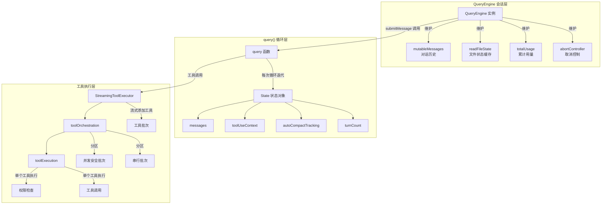
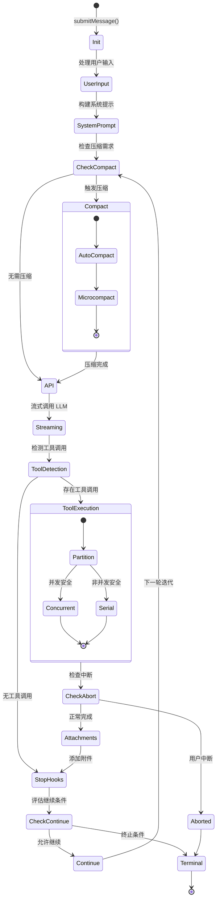
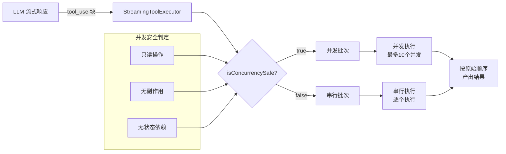
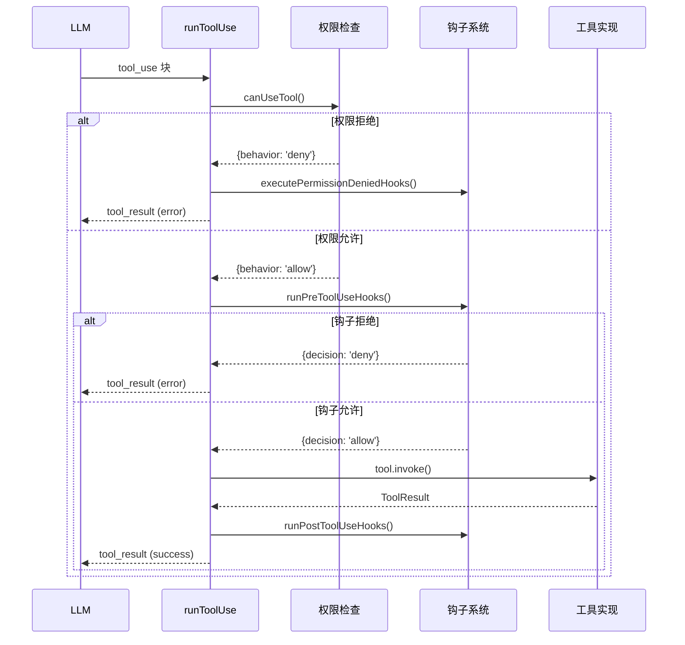
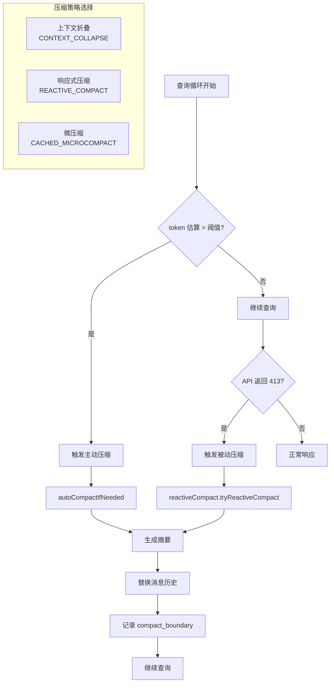

QueryEngine 是 Claude Code 的查询引擎核心，负责管理 LLM 对话循环、工具调用调度、状态持久化以及错误恢复机制。作为一个独立的状态机，它将原本分散在 REPL 和 SDK 两种运行模式中的查询逻辑统一封装，实现了**一次对话一个引擎实例**的会话管理模式。该引擎通过 AsyncGenerator 实现流式消息产出，支持中途取消、并发工具执行、上下文压缩等多种高级特性，是整个 Claude Code 架构中最核心的控制流组件。

Sources: [QueryEngine.ts](src/QueryEngine.ts#L184-L207)

## 架构总览

QueryEngine 的核心职责是将用户输入转化为一系列 LLM API 调用和工具执行，并通过状态机模式管理整个查询生命周期的状态变迁。其设计遵循**关注点分离**原则：QueryEngine 负责会话级别的状态管理（消息历史、文件缓存、用量统计），而 `query()` 函数负责单次查询的循环控制（API 调用、工具执行、压缩恢复）。这种分层设计使得同一套核心逻辑可以同时支持交互式 REPL 和无头 SDK 两种运行模式。



**核心设计原则**：
- **状态不可变性**：query() 的每次循环迭代通过 State 对象传递状态，Continue 操作返回新 State 而非就地修改，便于测试和调试
- **流式处理**：通过 AsyncGenerator 实现，允许在 LLM 流式响应的同时并发执行工具，并将中间结果实时推送给上层
- **依赖注入**：通过 QueryDeps 接口注入外部依赖（callModel、autocompact 等），使测试可以注入 Mock 对象而无需模块级 spyOn

Sources: [QueryEngine.ts](src/QueryEngine.ts#L184-L207), [query.ts](src/query.ts#L204-L279), [deps.ts](src/query/deps.ts#L8-L31)

## 查询循环生命周期

query() 函数实现了一个无限循环，通过 Continue/Terminate 状态变迁控制流程。每次迭代代表一次完整的"模型响应 → 工具执行 → 状态更新"周期。循环的退出条件包括：达到最大轮次限制、用户中断、Hook 阻止继续、或模型返回非工具调用的最终响应。



**循环状态对象 (State)** 包含以下核心字段：

| 字段 | 类型 | 说明 | 变更时机 |
|------|------|------|----------|
| `messages` | `Message[]` | 当前对话历史 | 压缩、工具结果、附件添加后 |
| `toolUseContext` | `ToolUseContext` | 工具执行上下文 | 权限状态变更、文件缓存更新后 |
| `autoCompactTracking` | `AutoCompactTrackingState` | 自动压缩跟踪状态 | 压缩触发后 |
| `turnCount` | `number` | 当前轮次计数 | 每次循环迭代 +1 |
| `transition` | `Continue \| undefined` | 上一轮的继续原因 | Continue 操作时记录 |
| `maxOutputTokensRecoveryCount` | `number` | 输出长度恢复尝试次数 | max_output_tokens 错误时 +1 |

Sources: [query.ts](src/query.ts#L204-L279), [query.ts](src/query.ts#L306-L364)

### Continue 决策逻辑

循环的继续条件由多个因素共同决定，采用**短路求值**策略：

1. **强制终止检查**：用户中断（abortController.signal.aborted）、Hook 返回 preventContinuation=true
2. **轮次限制**：turnCount > maxTurns 时生成 max_turns_reached 附件并终止
3. **工具调用检测**：assistantMessages 中存在 tool_use 块时继续（needsFollowUp=true）
4. **自然终止**：模型返回纯文本响应（无工具调用）时触发 StopHooks 评估

Continue 操作通过返回新的 State 对象实现状态转移，而非就地修改。这种设计使得状态变迁历史可追溯，便于调试复杂的多轮对话场景。

Sources: [query.ts](src/query.ts#L1519-L1521), [query.ts](src/query.ts#L1679-L1715)

## 工具执行流程

工具执行是查询循环的核心环节，采用**流式并发执行**策略。StreamingToolExecutor 在 LLM 流式响应过程中实时接收 tool_use 块，根据工具的 `isConcurrencySafe()` 判定结果将工具分区为并发批次和串行批次，在保证安全性的前提下最大化执行效率。

### 工具分区策略



**并发安全判定规则**：
- **Bash 工具**：命令被 shell-quote 解析后，所有 token 都是已知只读命令（如 `ls`、`cat`、`grep`）判定为安全
- **文件读取工具**：FileRead、Glob、Grep 等纯查询操作判定为安全
- **MCP 工具**：根据 MCP 服务器的 capabilities 声明判定（只读资源访问为安全）
- **其他工具**：默认为非安全，需串行执行

分区逻辑通过 `partitionToolCalls()` 函数实现，将连续的并发安全工具合并为单个批次，非安全工具单独成批。执行时，并发批次通过 `runToolsConcurrently()` 使用 Promise.all 并发执行（最大并发度由环境变量 `CLAUDE_CODE_MAX_TOOL_USE_CONCURRENCY` 控制，默认 10），串行批次通过 `runToolsSerially()` 逐个执行。

Sources: [toolOrchestration.ts](src/services/tools/toolOrchestration.ts#L86-L116), [StreamingToolExecutor.ts](src/services/tools/StreamingToolExecutor.ts#L129-L150)

### 单个工具执行流程

每个工具的执行遵循**权限优先 → 钩子拦截 → 实际调用**的三阶段流程：



**权限检查优先级**（从高到低）：
1. **会话模式**：bypass 模式自动允许、auto 模式根据规则自动判定
2. **持久化规则**：用户/项目配置中的 always-allow/always-deny 规则
3. **分类器判定**：Bash 命令的安全分类器（如 `rm -rf /` 自动拒绝）
4. **钩子决策**：PreToolUse 钩子的 permissionDecision 返回值
5. **用户交互**：弹出权限对话框，等待用户选择（交互模式）或自动拒绝（非交互模式）

权限决策通过 `CanUseToolFn` 类型函数实现，返回 `PermissionResult` 对象包含 `behavior`（allow/deny/ask）和 `reason`（决策来源）。工具执行器根据 reason 字段记录 OTel 遥测数据，用于后续的安全审计和行为分析。

Sources: [toolExecution.ts](src/services/tools/toolExecution.ts#L1-L200), [Tool.ts](src/Tool.ts#L158-L200)

## 状态管理机制

QueryEngine 维护两类状态：**会话级持久状态**（跨多次 submitMessage 调用保持）和**轮次级临时状态**（每次 submitMessage 重置）。这种分层设计使得引擎既能支持长时间的多轮对话，又能在每次查询开始时清理临时上下文。

### 会话级状态

| 状态字段 | 类型 | 初始化位置 | 持久化策略 |
|----------|------|------------|------------|
| `mutableMessages` | `Message[]` | 构造函数（initialMessages 或空数组） | 每次循环迭代后追加，压缩时替换 |
| `readFileState` | `FileStateCache` | 构造函数（传入 readFileCache） | 工具执行时更新，压缩时克隆 |
| `totalUsage` | `NonNullableUsage` | EMPTY_USAGE | API 响应后累加 |
| `permissionDenials` | `SDKPermissionDenial[]` | 空数组 | 权限拒绝时追加，返回给 SDK 调用者 |
| `abortController` | `AbortController` | 构造函数（传入或创建） | 用户取消时触发 |

**文件状态缓存** 是核心优化点，记录已读取/写入/编辑的文件路径和时间戳，用于：
1. **内存附件去重**：避免重复加载同一 MEMORY.md 文件
2. **压缩保留判定**：压缩时保留最近访问的文件上下文
3. **会话恢复**：从 sessionStorage 恢复时重建文件状态

Sources: [QueryEngine.ts](src/QueryEngine.ts#L185-L207), [QueryEngine.ts](src/QueryEngine.ts#L344-L394)

### 轮次级状态

每次 submitMessage 调用创建新的 `ProcessUserInputContext`，包含：
- **discoveredSkillNames**：本轮发现的技能名称集合（用于遥测）
- **loadedNestedMemoryPaths**：已加载的嵌套内存路径集合（避免循环引用）
- **inProgressToolUseIDs**：正在执行的工具 ID 集合（UI 显示加载状态）
- **responseLength**：当前响应的字节长度（用于预算控制）

这些状态在 submitMessage 开始时清空（如 `this.discoveredSkillNames.clear()`），确保每次查询的独立性。唯一例外是 `loadedNestedMemoryPaths`，它在整个会话生命周期持续累积，防止嵌套内存的无限递归加载。

Sources: [QueryEngine.ts](src/QueryEngine.ts#L238-L239), [QueryEngine.ts](src/QueryEngine.ts#L370-L373)

## 上下文压缩与恢复

上下文压缩是长对话场景的关键能力，QueryEngine 实现了**多层压缩策略**：主动压缩（预测即将超限）、被动压缩（API 返回 prompt_too_long 错误后触发）、微压缩（利用 API 的 cache_deleted_input_tokens 字段）。压缩后的对话历史通过 compact_boundary 消息标记边界，UI 可以展开查看原始内容。

### 压缩触发条件



**三种压缩机制对比**：

| 机制 | 触发时机 | 压缩范围 | 性能开销 | 适用场景 |
|------|----------|----------|----------|----------|
| **主动压缩** | token 估算超过阈值 | 整个对话历史 | 高（调用 Haiku 生成摘要） | 预防性压缩，避免 API 错误 |
| **被动压缩** | API 返回 prompt_too_long | 整个对话历史 | 高（需重试 API 调用） | 兜底策略，处理预估不准情况 |
| **微压缩** | API 返回 cache_deleted_input_tokens > 0 | 单个工具结果 | 低（仅删除缓存内容） | 利用 API 的缓存淘汰机制 |

**上下文折叠（Context Collapse）** 是最新的压缩策略，通过分层摘要保留关键上下文。它将对话历史分为多个"折叠层"：最近的轮次保留完整内容，早期轮次压缩为摘要，摘要的摘要形成更高层级。查询时按需展开折叠层，平衡上下文长度和细节保留。

Sources: [query.ts](src/query.ts#L414-L504), [query.ts](src/query.ts#L1085-L1183)

### 错误恢复机制

QueryEngine 实现了多层错误恢复策略，确保在 API 限流、模型过载、上下文超限等异常情况下仍能优雅降级：

**1. max_output_tokens 恢复**
- **首次触发**：重试同一请求，将 max_output_tokens 从默认 8k 提升到 64k
- **二次触发**：注入系统消息提示模型继续输出，进入多轮对话完成剩余内容
- **恢复上限**：MAX_OUTPUT_TOKENS_RECOVERY_LIMIT = 3 次，超过后返回错误

**2. prompt_too_long 恢复**
- **优先级 1**：尝试上下文折叠的 drain 操作（清空已暂存的折叠层）
- **优先级 2**：触发响应式压缩（reactiveCompact），生成摘要后重试
- **失败处理**：返回 prompt_too_long 错误，不执行 StopHooks（避免死循环）

**3. 模型过载恢复**
- **流式降级**：API 在流式响应中触发 fallback 时，丢弃部分响应，切换到备用模型重试
- **消息清理**：丢弃已产出的 assistantMessages 和 toolResults，避免工具结果不匹配
- **签名剥离**：切换模型前移除 thinking 块的签名（不同模型的签名算法不兼容）

Sources: [query.ts](src/query.ts#L1185-L1250), [query.ts](src/query.ts#L893-L953)

## 依赖注入与配置

QueryEngine 采用**依赖注入模式**管理外部依赖，通过 QueryDeps 接口定义核心依赖项，使得测试可以注入 Mock 对象而无需模块级 spyOn。这种设计显著提升了可测试性，特别是对于涉及 API 调用和压缩逻辑的复杂场景。

### QueryDeps 接口

```typescript
export type QueryDeps = {
  // 模型调用
  callModel: typeof queryModelWithStreaming
  
  // 压缩相关
  microcompact: typeof microcompactMessages
  autocompact: typeof autoCompactIfNeeded
  
  // 平台工具
  uuid: () => string
}
```

**生产环境实现**通过 `productionDeps()` 工厂函数提供，直接引用真实模块。测试环境通过传入自定义 deps 对象替换特定依赖，例如：

```typescript
// 测试中注入 Mock 的 callModel
const mockCallModel = async function* () {
  yield createAssistantMessage({ content: 'test response' })
}

await query({
  ...params,
  deps: {
    ...productionDeps(),
    callModel: mockCallModel
  }
})
```

Sources: [deps.ts](src/query/deps.ts#L21-L40)

### QueryConfig 快照

QueryConfig 在 query() 入口处一次性快照不可变配置，避免在循环迭代中重复读取环境变量或 Statsig 特性开关。这种设计确保了配置的一致性（单次查询内配置不变），并为未来的纯函数重构（提取 step() reducer）奠定基础。

**快照内容包括**：
- **sessionId**：会话唯一标识符
- **gates.streamingToolExecution**：是否启用流式工具执行（Statsig 开关）
- **gates.emitToolUseSummaries**：是否生成工具调用摘要（环境变量）
- **gates.isAnt**：是否为 Anthropic 内部用户（USER_TYPE 环境变量）
- **gates.fastModeEnabled**：是否启用快速模式（CLAUDE_CODE_DISABLE_FAST_MODE 环境变量）

**重要约束**：QueryConfig **不包含** `feature()` 开关，因为 Bun 的 bundle 特性依赖编译时静态分析，必须在代码中以 if/三元表达式形式使用才能触发 tree-shaking。将 feature() 结果存入配置对象会导致死代码消除失效。

Sources: [config.ts](src/query/config.ts#L15-L46)

## StopHooks 与循环终止

StopHooks 是查询循环终止前的最后一道关卡，用于执行清理任务、生成后台建议、提取记忆等。它的设计遵循**非阻塞原则**：大部分钩子是 fire-and-forget 模式，不阻塞主循环返回；只有明确标记为 blocking 的钩子才会暂停循环并显示错误消息。

### StopHooks 执行流程

```mermaid
sequenceDiagram
    participant Loop as 查询循环
    participant SH as handleStopHooks
    participant Hook as executeStopHooks
    participant BG as 后台任务
    
    Loop->>SH: 无工具调用，准备终止
    SH->>Hook: executeStopHooks()
    
    Hook->>Hook: 遍历已注册钩子
    loop 每个钩子
        Hook->>Hook: 执行钩子函数
        alt 钩子返回错误
            Hook->>SH: 收集 blockingErrors
        else 钩子返回 preventContinuation
            Hook->>SH: 设置标志位
        end
    end
    
    SH->>BG: fire-and-forget 后台任务
    par 并发执行
        BG->>BG: executePromptSuggestion()
        BG->>BG: executeExtractMemories()
        BG->>BG: executeAutoDream()
    end
    
    SH-->>Loop: 返回 {blockingErrors, preventContinuation}
    
    alt 存在阻塞错误
        Loop->>Loop: yield 错误消息
        Loop->>Loop: 继续循环（允许用户修复）
    else 阻止继续
        Loop->>Loop: 返回 {reason: 'hook_stopped'}
    else 正常完成
        Loop->>Loop: 返回 Terminal
    end
```

**后台任务类型**：

| 任务 | 触发条件 | 作用 | 阻塞性 |
|------|----------|------|--------|
| **PromptSuggestion** | 非 bare 模式 | 生成下一个提示建议 | 否（fire-and-forget） |
| **ExtractMemories** | EXTRACT_MEMORIES 特性开启 + extract 模式激活 | 从对话中提取结构化记忆 | 否（fire-and-forget） |
| **AutoDream** | 非子代理环境 | 自动生成后续任务计划 | 否（fire-and-forget） |
| **ComputerUse 清理** | CHICAGO_MCP 特性开启 | 释放计算机使用锁，隐藏控制窗口 | 否（失败静默） |

**阻塞式钩子**主要用于安全检查和合规验证，例如：
- **敏感数据检测**：扫描模型响应中的 API 密钥、密码等敏感信息
- **内容审核**：检查输出是否符合内容策略
- **工作目录验证**：确认当前目录未被恶意修改

阻塞钩子返回的错误会作为 assistant 消息产出，允许用户在下一轮对话中修复问题。这种设计避免了静默失败，提供了更好的错误可见性。

Sources: [stopHooks.ts](src/query/stopHooks.ts#L65-L157), [stopHooks.ts](src/query/stopHooks.ts#L175-L250)

## 与其他组件的集成

QueryEngine 作为核心查询引擎，与多个关键子系统紧密集成，通过 ToolUseContext 对象传递共享状态和回调函数。

### 集成点总览

| 集成组件 | 接口 | 数据流向 | 用途 |
|----------|------|----------|------|
| **AppState** | `getAppState()` / `setAppState()` | 双向 | 读取/更新全局状态（权限模式、MCP 连接等） |
| **MCP 客户端** | `options.mcpClients` | 输入 | 提供 MCP 工具和资源访问 |
| **命令系统** | `options.commands` | 输入 | 斜杠命令注册表 |
| **工具注册表** | `options.tools` | 输入 | 可用工具定义 |
| **文件缓存** | `readFileState` | 双向 | 文件状态跟踪和去重 |
| **权限系统** | `canUseTool` | 回调 | 工具权限判定 |
| **钩子系统** | `executeStopHooks` 等事件 | 回调 | 生命周期钩子触发 |
| **会话存储** | `recordTranscript` | 输出 | 对话历史持久化 |

**关键集成模式**：

**1. AppState 双向绑定**
QueryEngine 通过 `getAppState()` 读取当前状态，通过 `setAppState()` 更新状态。这种设计允许 QueryEngine 在无头模式下独立运行（如 SDK 调用），同时保持与 REPL 交互模式的状态同步。状态更新遵循不可变原则：`setAppState(prev => ({ ...prev, updatedField }))`，确保 React 的状态变更检测正常工作。

**2. MCP 动态工具刷新**
MCP 服务器可能在查询过程中连接或断开，QueryEngine 通过 `options.refreshTools()` 回调在轮次间刷新工具列表。刷新时机为工具执行完成后、下一轮查询开始前，避免在工具执行中途改变可用工具集导致的竞态条件。

**3. 会话持久化策略**
用户消息在进入查询循环前立即持久化（阻塞等待），确保即使进程在 API 响应前崩溃也能通过 `--resume` 恢复。Assistant 消息在流式产出时异步持久化，不阻塞主循环。这种**用户消息同步、助手消息异步**的策略平衡了可靠性和性能。

Sources: [Tool.ts](src/Tool.ts#L158-L200), [QueryEngine.ts](src/QueryEngine.ts#L436-L463)

---

**相关文档**：
- 想了解工具系统的完整实现？参见 [工具系统架构：从 Tool 接口到 40+ 工具实现](6-gong-ju-xi-tong-jia-gou-cong-tool-jie-kou-dao-40-gong-ju-shi-xian)
- 想了解权限判定流程？参见 [权限模式系统：default、plan、auto、bypass 等模式解析](9-quan-xian-mo-shi-xi-tong-default-plan-auto-bypass-deng-mo-shi-jie-xi)
- 想了解命令注册机制？参见 [命令系统设计：50+ 斜杠命令的组织与注册](7-ming-ling-xi-tong-she-ji-50-xie-gang-ming-ling-de-zu-zhi-yu-zhu-ce)
- 想了解并发执行策略？参见 [并发执行策略：工具批处理与安全判定](8-bing-fa-zhi-xing-ce-lue-gong-ju-pi-chu-li-yu-an-quan-pan-ding)