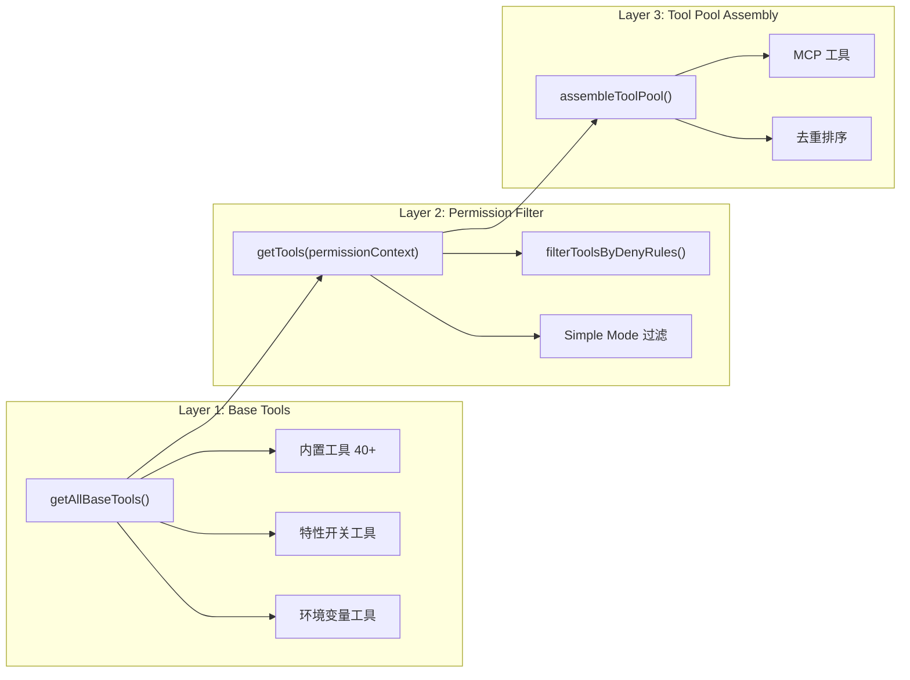
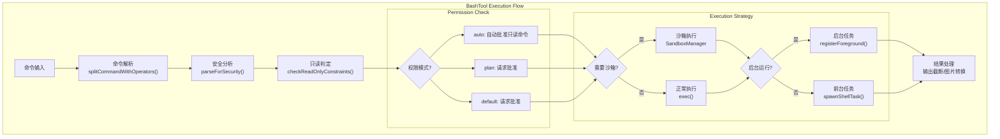
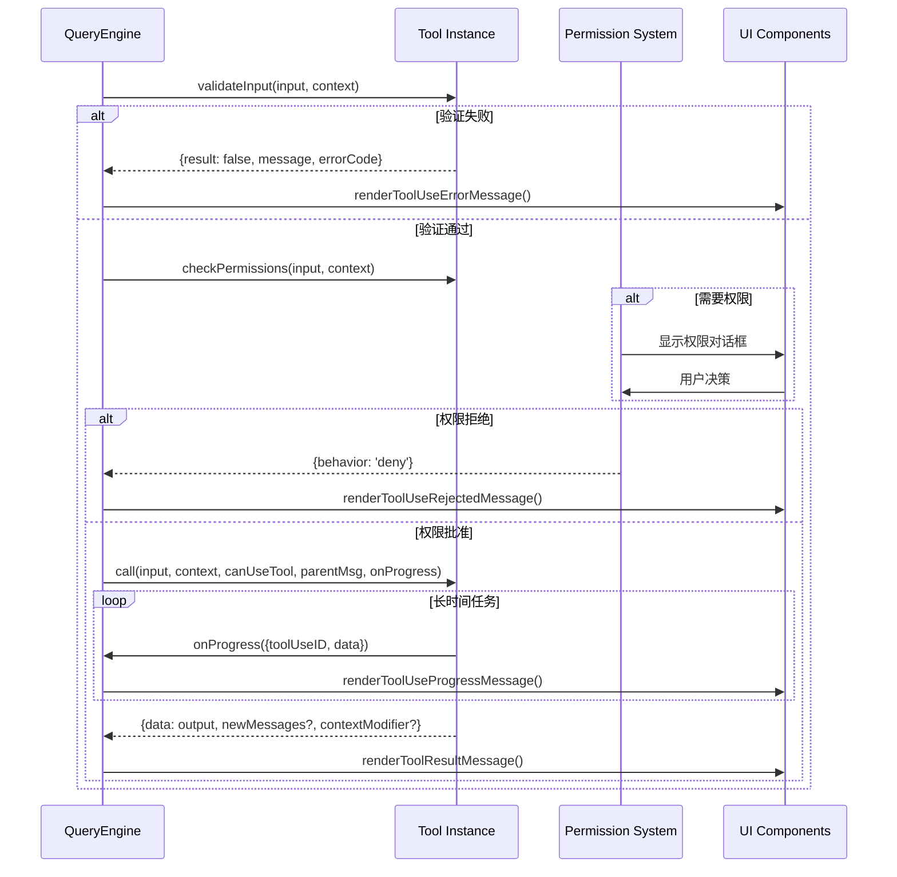

Claude Code 的工具系统是连接 LLM 能力与实际操作的核心枢纽。本文档深入剖析从抽象的 `Tool` 接口到 40+ 具体工具实现的设计哲学、架构模式和实现细节，揭示这个高度可扩展系统背后的技术原理。

## 核心抽象：Tool 接口设计

```mermaid
graph TB
    subgraph "Tool Interface Core"
        Tool["Tool&lt;Input, Output, Progress&gt;"]
        Input["Input Schema (Zod)"]
        Output["Output Schema (Zod)"]
        Progress["Progress Data"]
    end
    
    subgraph "Lifecycle Methods"
        Call["call() - 执行逻辑"]
        Validate["validateInput() - 输入验证"]
        Perms["checkPermissions() - 权限检查"]
        Desc["description() - 描述生成"]
    end
    
    subgraph "Metadata Methods"
        Enabled["isEnabled() - 可用性"]
        ReadOnly["isReadOnly() - 只读判定"]
        Safe["isConcurrencySafe() - 并发安全"]
        Destructive["isDestructive() - 破坏性"]
    end
    
    subgraph "UI Rendering"
        RenderUse["renderToolUseMessage()"]
        RenderResult["renderToolResultMessage()"]
        RenderProgress["renderToolUseProgressMessage()"]
        RenderError["renderToolUseErrorMessage()"]
    end
    
    Tool --> Input
    Tool --> Output
    Tool --> Progress
    Tool --> Call
    Tool --> Validate
    Tool --> Perms
    Tool --> Desc
    Tool --> Enabled
    Tool --> ReadOnly
    Tool --> Safe
    Tool --> Destructive
    Tool --> RenderUse
    Tool --> RenderResult
    Tool --> RenderProgress
    Tool --> RenderError
```

工具系统的基石是 `src/Tool.ts` 中定义的 `Tool<Input, Output, P>` 接口。这个泛型接口不仅定义了工具的基本契约，还整合了权限检查、UI 渲染、进度报告等多维度能力。



### 接口核心组成

**生命周期方法**构成了工具执行的主流程：

1. **`validateInput()`**：在权限检查前执行轻量级输入验证，捕获格式错误、路径不存在等早期失败，避免不必要的权限请求
2. **`checkPermissions()`**：决定是否需要用户授权，返回 `PermissionResult` 包含 `behavior`（allow/deny/passthrough）和可选的 `updatedInput`
3. **`call()`**：核心执行逻辑，接收已验证的输入、上下文对象、权限函数和进度回调，返回包含结果数据的 `ToolResult`
4. **`description()`**：根据输入和上下文动态生成工具描述，支持上下文相关的提示词优化

**元数据方法**定义工具的行为特征，影响系统级的调度决策：

- **`isEnabled()`**：运行时判定工具是否可用（默认 `true`），支持特性开关和环境条件
- **`isReadOnly(input)`**：判定是否为只读操作，影响并发执行策略和权限模式
- **`isConcurrencySafe(input)`**：标记是否可安全并发执行，默认 `false` 确保保守策略
- **`isDestructive(input)`**：标识破坏性操作（删除、覆盖），触发额外的安全提示

**UI 渲染方法**实现了工具与终端 UI 的深度集成：

- **`renderToolUseMessage()`**：渲染工具调用消息（如 `Bash: npm test`）
- **`renderToolResultMessage()`**：渲染执行结果（支持压缩/详细模式切换）
- **`renderToolUseProgressMessage()`**：渲染长时间运行任务的进度指示
- **`getToolUseSummary()`**：生成简洁摘要用于压缩视图
- **`getActivityDescription()`**：提供动词短语用于 spinner 显示（如 "Reading src/foo.ts"）

Sources: [Tool.ts](src/Tool.ts#L362-L695)

### buildTool() 工厂函数

`buildTool()` 函数是创建工具的标准入口，通过类型安全的默认值填充机制确保所有工具都具备完整实现：

```typescript
const TOOL_DEFAULTS = {
  isEnabled: () => true,
  isConcurrencySafe: (_input?: unknown) => false,
  isReadOnly: (_input?: unknown) => false,
  isDestructive: (_input?: unknown) => false,
  checkPermissions: (input, _ctx) => 
    Promise.resolve({ behavior: 'allow', updatedInput: input }),
  toAutoClassifierInput: (_input?: unknown) => '',
  userFacingName: (_input?: unknown) => '',
}
```

这种设计遵循"安全默认值"原则：未显式声明的方法默认为最保守的行为。例如，`isConcurrencySafe()` 默认返回 `false`，确保未明确标记的工具不会并发执行，避免潜在的状态冲突。

Sources: [Tool.ts](src/Tool.ts#L757-L792)

## 工具注册与发现机制

工具系统的注册中心位于 `src/tools.ts`，通过分层函数实现了从基础工具集到最终工具池的渐进式组装。



### getAllBaseTools()：完整工具清单

此函数返回当前环境中所有可能可用的工具，是工具定义的单一真相源。工具通过条件编译和特性开关动态加载：

**核心工具（始终可用）**：BashTool、FileReadTool、FileEditTool、FileWriteTool、WebSearchTool、WebFetchTool、GrepTool、GlobTool 等

**特性开关工具（按 feature flag 加载）**：
- `REPLTool`：仅限 `USER_TYPE === 'ant'`
- `SleepTool`：`PROACTIVE` 或 `KAIROS` 特性启用时
- `cronTools`：`AGENT_TRIGGERS` 特性启用时
- `LSPTool`：`ENABLE_LSP_TOOL` 环境变量设置时

**条件检测工具**：
- `PowerShellTool`：仅在 Windows 系统且 `isPowerShellToolEnabled()` 返回 `true` 时
- `EnterWorktreeTool/ExitWorktreeTool`：`isWorktreeModeEnabled()` 返回 `true` 时

Sources: [tools.ts](src/tools.ts#L193-L251)

### getTools()：权限感知过滤

`getTools(permissionContext)` 在基础工具集上应用权限过滤和模式限制：

**Simple Mode**：当 `CLAUDE_CODE_SIMPLE` 环境变量启用时，仅保留 Bash、Read、Edit 三个核心工具，实现最小功能集的快速响应

**权限过滤**：通过 `filterToolsByDenyRules()` 移除被权限规则明确禁止的工具。支持通配符匹配（如 `mcp__server__*` 可禁止整个 MCP 服务器的所有工具）

**REPL Mode 特殊处理**：当 REPL 模式启用时，隐藏 `REPL_ONLY_TOOLS` 集合中的原始工具（Bash、Read、Edit 等），这些工具仅通过 REPL 虚拟机间接访问

Sources: [tools.ts](src/tools.ts#L271-L327)

### assembleToolPool()：MCP 工具集成

最终的工具池组装函数合并内置工具和 MCP（Model Context Protocol）工具：

```typescript
export function assembleToolPool(
  permissionContext: ToolPermissionContext,
  mcpTools: Tools,
): Tools {
  const builtInTools = getTools(permissionContext)
  const allowedMcpTools = filterToolsByDenyRules(mcpTools, permissionContext)
  
  // 内置工具优先，按名称排序后去重
  const byName = (a: Tool, b: Tool) => a.name.localeCompare(b.name)
  return uniqBy(
    [...builtInTools].sort(byName).concat(allowedMcpTools.sort(byName)),
    'name',
  )
}
```

排序策略确保提示词缓存稳定性：内置工具按字母序排列作为前缀，MCP 工具追加在后。当内置工具与 MCP 工具同名时，内置工具优先（`uniqBy` 保留首次出现）。

Sources: [tools.ts](src/tools.ts#L345-L367)

## 工具分类与实现模式

基于功能特征和实现复杂度，40+ 工具可分为以下类别，每类遵循特定的设计模式。

### 文件操作工具

| 工具名 | 核心功能 | 只读判定 | 并发安全 | 破坏性 |
|--------|----------|----------|----------|--------|
| FileReadTool | 读取文件内容、检测编码/行尾 | ✅ true | ✅ true | ❌ false |
| FileEditTool | 字符串替换式编辑 | ❌ false | ❌ false | ❌ false |
| FileWriteTool | 完整文件写入/覆盖 | ❌ false | ❌ false | ✅ true |
| GlobTool | 文件模式匹配搜索 | ✅ true | ✅ true | ❌ false |
| GrepTool | 文件内容正则搜索 | ✅ true | ✅ true | ❌ false |
| NotebookEditTool | Jupyter Notebook 单元编辑 | ❌ false | ❌ false | ❌ false |

**FileEditTool 实现要点**：

1. **输入验证**：检查 `old_string` 是否存在于文件、文件大小是否超过 1GB 限制、是否编辑受保护的团队内存文件
2. **路径规范化**：通过 `expandPath()` 统一处理 `~`、相对路径、Windows 反斜杠等路径格式
3. **权限检查**：委托给 `checkWritePermissionForTool()` 执行基于路径模式的权限匹配
4. **结果渲染**：支持 diff 视图、压缩模式下的单行摘要、可折叠的详细视图

**GrepTool/GlobTool 优化策略**：

- 在 Ant 原生构建中，`bfs`/`ugrep` 嵌入 Bun 二进制，通过 `ARGV0` 技巧作为 `find`/`grep` 别名，此时专用工具被移除以避免冗余
- 使用 `lazySchema()` 延迟构建 Zod schema，减少启动时间
- 实现 `isSearchOrReadCommand()` 返回 `{isSearch: true}`，触发 UI 折叠显示

Sources: [FileEditTool.ts](src/tools/FileEditTool/FileEditTool.ts#L86-L626), [GlobTool.ts](src/tools/GlobTool/GlobTool.ts), [GrepTool.ts](src/tools/GrepTool/GrepTool.ts)

### Shell 执行工具

**BashTool** 是最复杂的工具之一，承担命令行交互、后台任务管理、沙箱隔离等多重职责。



**命令分类与 UI 折叠**：

`isSearchOrReadBashCommand()` 通过解析管道和复合命令，识别搜索/读取/列表操作：

- **搜索命令**：`grep`, `find`, `rg`, `ag`, `ack`, `locate`, `which`, `whereis`
- **读取命令**：`cat`, `head`, `tail`, `less`, `more`, `wc`, `stat`, `file`, `strings`, `jq`, `awk`, `cut`, `sort`, `uniq`, `tr`
- **列表命令**：`ls`, `tree`, `du`
- **语义中性命令**：`echo`, `printf`, `true`, `false`, `:` （可在复合命令中任意位置）

对于管道命令（如 `cat file | grep pattern`），所有非中性部分都必须是搜索/读取命令，整体才被判定为可折叠。

**后台执行策略**：

1. **显式后台**：`run_in_background: true` 参数
2. **自动后台**：在 assistant 模式下，阻塞命令超过 15 秒自动转入后台
3. **进度通知**：执行超过 2 秒显示 "Running in background" 提示

**PowerShellTool 特殊处理**：

仅在 Windows 系统可用，提供与 BashTool 平行的功能但适配 PowerShell 语法和语义：
- 支持通用参数（`-Verbose`, `-Debug`, `-ErrorAction` 等）
- Git 命令安全检查（防止 `git clean -fdx` 等破坏性操作）
- PowerShell 特有的路径验证（支持 PSDrive）

Sources: [BashTool.tsx](src/tools/BashTool/BashTool.tsx#L95-L200), [PowerShellTool.tsx](src/tools/PowerShellTool/PowerShellTool.tsx)

### Agent 与任务管理工具

**AgentTool** 实现了子代理（subagent）机制，允许主代理委派任务给专门的代理实例：

**输入 Schema**：
```typescript
{
  description: string,          // 任务简短描述（3-5词）
  prompt: string,               // 完整任务提示
  subagent_type?: string,       // 专用代理类型
  model?: 'sonnet' | 'opus' | 'haiku', // 模型覆盖
  run_in_background?: boolean,  // 后台执行标志
  name?: string,                // 可寻址名称（用于 SendMessage）
  team_name?: string,           // 团队名称
  mode?: PermissionMode,        // 权限模式
  isolation?: 'worktree' | 'remote', // 隔离模式
  cwd?: string                  // 工作目录覆盖
}
```

**执行路径选择**：

1. **Fork Subagent**：当 `isForkSubagentEnabled()` 时，在独立进程创建代理副本，共享提示词缓存
2. **Remote Agent**：`isolation: 'remote'` 时，在远程 CCR 环境执行
3. **Local Agent**：本地线程池执行，支持同步和异步两种模式

**任务管理工具集**（Todo V2 特性启用时可用）：

- **TaskCreateTool**：创建任务对象，触发 `TaskCreated` hooks
- **TaskGetTool**：按 ID 获取任务详情
- **TaskUpdateTool**：更新任务状态和元数据
- **TaskListTool**：列出当前会话的所有任务
- **TaskStopTool**：停止运行中的后台任务

Sources: [AgentTool.tsx](src/tools/AgentTool/AgentTool.tsx#L82-L150), [TaskCreateTool.ts](src/tools/TaskCreateTool/TaskCreateTool.ts#L48-L50)

### MCP 工具集成

**MCPTool** 是 MCP（Model Context Protocol）工具的动态适配器，其具体实现由 `mcpClient.ts` 在运行时注入：

```typescript
export const MCPTool = buildTool({
  isMcp: true,
  name: 'mcp', // 被实际的 MCP 工具名覆盖
  inputSchema: lazySchema(() => z.object({}).passthrough()), // 接受任意参数
  async call() { return { data: '' } }, // 被实际调用覆盖
  async checkPermissions() {
    return { behavior: 'passthrough', message: 'MCPTool requires permission.' }
  },
  // ...其他方法在 mcpClient.ts 中覆盖
})
```

**ListMcpResourcesTool/ReadMcpResourceTool**：提供 MCP 服务器资源的发现和访问能力，支持结构化内容和元数据透传。

Sources: [MCPTool.ts](src/tools/MCPTool/MCPTool.ts#L27-L77)

### 其他专用工具

| 工具类别 | 工具名称 | 核心功能 |
|---------|---------|---------|
| 网络访问 | WebFetchTool | HTTP 请求、HTML 解析、内容提取 |
| | WebSearchTool | 搜索引擎集成、结果聚合 |
| 用户交互 | AskUserQuestionTool | 向用户提问、收集反馈 |
| | SendMessageTool | 跨代理消息传递 |
| 配置管理 | ConfigTool | 运行时配置修改 |
| | EnterPlanModeTool/ExitPlanModeTool | 计划模式切换 |
| 代码分析 | LSPTool | 语言服务器协议集成 |
| | ToolSearchTool | 工具发现与延迟加载 |
| 技能调用 | SkillTool | 执行预定义技能脚本 |
| 调度任务 | ScheduleCronTool | Cron 任务调度 |

Sources: [WebFetchTool.ts](src/tools/WebFetchTool/WebFetchTool.ts), [AskUserQuestionTool.tsx](src/tools/AskUserQuestionTool/AskUserQuestionTool.tsx), [ToolSearchTool.ts](src/tools/ToolSearchTool/ToolSearchTool.ts)

## 工具与 QueryEngine 集成

`QueryEngine` 是管理 LLM 查询生命周期的核心类，工具系统通过 `ToolUseContext` 与其深度集成。



### ToolUseContext 结构

`ToolUseContext` 提供了工具执行所需的完整上下文：

**核心资源**：
- `options.tools`：当前可用的工具集（用于工具间调用）
- `options.commands`：斜杠命令列表
- `options.mcpClients`：MCP 服务器连接
- `readFileState`：文件状态缓存（避免重复读取）

**状态管理**：
- `getAppState()` / `setAppState()`：访问和修改全局应用状态
- `messages`：当前对话的消息历史
- `abortController`：支持取消操作

**UI 集成**：
- `setToolJSX()`：设置工具专属的 UI 组件（如进度指示器）
- `addNotification()`：添加系统通知
- `requestPrompt()`：请求用户交互式输入（仅 REPL 模式）

**权限与追踪**：
- `toolPermissionContext`：权限规则和模式配置
- `toolDecisions`：工具调用的权限决策记录
- `queryTracking`：查询链追踪（用于嵌套查询）

Sources: [Tool.ts](src/Tool.ts#L158-L300), [QueryEngine.ts](src/QueryEngine.ts#L184-L200)

### 工具调用流程

1. **输入验证**：`validateInput()` 执行轻量级检查（格式、路径存在性、大小限制）
2. **权限检查**：`checkPermissions()` 结合通用权限规则和工具特定逻辑
3. **执行准备**：检查 `interruptBehavior()` 决定是否可被新消息中断
4. **核心执行**：`call()` 方法接收进度回调，支持长时间运行任务的实时反馈
5. **结果处理**：`mapToolResultToToolResultBlockParam()` 将输出转换为 API 格式
6. **UI 渲染**：根据执行状态调用相应的渲染方法

**并发控制**：QueryEngine 检查 `isConcurrencySafe(input)` 决定是否可在同一 turn 中并发执行多个工具实例。非安全工具通过 `contextModifier` 机制确保串行执行。

Sources: [Tool.ts](src/Tool.ts#L500-L506), [QueryEngine.ts](src/QueryEngine.ts#L1-L200)

## 权限系统集成

工具权限系统通过三层机制实现细粒度控制：

### 1. 工具级权限检查

每个工具的 `checkPermissions()` 方法返回 `PermissionResult`：

```typescript
type PermissionResult = 
  | { behavior: 'allow'; updatedInput?: unknown }
  | { behavior: 'deny'; message: string }
  | { behavior: 'passthrough'; message: string }
```

- **allow**：直接批准执行，可选修改输入参数
- **deny**：拒绝执行，向模型返回错误消息
- **passthrough**：委托给通用权限系统处理（显示权限对话框）

### 2. 通用权限规则

`ToolPermissionContext` 包含三类规则集：

- **alwaysAllowRules**：自动批准规则（如 `Bash(git status)`）
- **alwaysDenyRules**：自动拒绝规则（如 `Bash(rm -rf /)`）
- **alwaysAskRules**：强制询问规则（绕过自动批准）

规则匹配支持通配符：`Bash(git *)` 匹配所有 git 命令，`Edit(/etc/*)` 匹配 /etc 下所有文件。

### 3. 模式级限制

`src/constants/tools.ts` 定义了不同代理模式下的工具白名单：

- **ALL_AGENT_DISALLOWED_TOOLS**：所有子代理禁止使用的工具（AgentTool、TaskOutputTool、EnterPlanModeTool 等）
- **ASYNC_AGENT_ALLOWED_TOOLS**：异步代理允许的工具（文件操作、Shell、搜索等）
- **COORDINATOR_MODE_ALLOWED_TOOLS**：协调器模式允许的工具（AgentTool、TaskStopTool、SendMessageTool）

Sources: [constants/tools.ts](src/constants/tools.ts#L36-L113), [Tool.ts](src/Tool.ts#L500-L503)

## 进度报告与 UI 渲染

工具系统通过类型化的进度数据实现实时 UI 更新：

### 进度数据类型

```typescript
type ToolProgressData = 
  | BashProgress      // {type: 'bash', stdout, stderr, exitCode}
  | WebSearchProgress // {type: 'web_search', query, results}
  | MCPProgress       // {type: 'mcp', serverName, toolName}
  | AgentToolProgress // {type: 'agent', agentId, status}
  | TaskOutputProgress // {type: 'task_output', taskId}
  // ...
```

工具通过 `onProgress` 回调发送进度更新：

```typescript
onProgress?.({
  toolUseID: 'tool-use-123',
  data: { type: 'bash', stdout: 'partial output...' }
})
```

### 渲染策略

**压缩模式（非 verbose）**：
- 使用 `getToolUseSummary()` 生成单行摘要
- 搜索/读取命令折叠显示（"Found 3 files in 12ms"）
- 同类工具通过 `renderGroupedToolUse()` 合并显示

**详细模式（verbose）**：
- 完整显示工具输入和输出
- 支持 `isResultTruncated()` 判断是否可展开
- 保留工具调用的时间戳和元数据

**进度显示**：
- `renderToolUseProgressMessage()` 渲染长时间任务的中间状态
- `getActivityDescription()` 提供动词短语（"Reading file...", "Running tests..."）
- 超过 2 秒的任务显示后台提示

Sources: [Tool.ts](src/Tool.ts#L307-L319), [Tool.ts](src/Tool.ts#L539-L635)

## 工具实现最佳实践

基于代码库分析，总结工具实现的关键原则：

### 1. Schema 设计

使用 `lazySchema()` 延迟构建 Zod schema，避免启动时的类型检查开销：

```typescript
const inputSchema = lazySchema(() => 
  z.strictObject({
    file_path: z.string().describe('Absolute path to the file'),
    old_string: z.string().describe('Text to replace'),
    new_string: z.string().describe('Replacement text'),
  })
)
```

### 2. 安全默认值

依赖 `buildTool()` 的默认实现，显式声明破坏性和并发安全性：

```typescript
export const FileWriteTool = buildTool({
  isDestructive: () => true,  // 覆盖默认值 false
  isConcurrencySafe: () => false, // 显式声明（已是默认值）
  // ...
})
```

### 3. 路径处理

统一使用 `expandPath()` 规范化路径，确保权限检查和文件操作的一致性：

```typescript
backfillObservableInput(input) {
  if (typeof input.file_path === 'string') {
    input.file_path = expandPath(input.file_path)
  }
}
```

### 4. 错误处理

在 `validateInput()` 中捕获可预期的错误，返回结构化的验证结果：

```typescript
async validateInput(input) {
  if (input.old_string === input.new_string) {
    return {
      result: false,
      behavior: 'ask',
      message: 'No changes: old_string and new_string are identical.',
      errorCode: 1
    }
  }
  return { result: true }
}
```

### 5. UI 分离

将 UI 组件放在独立的 `UI.tsx` 文件中，通过命名导出集成到工具：

```typescript
// UI.tsx
export const renderToolResultMessage = (output, progress, options) => { ... }
export const userFacingName = (input) => `Edit ${input.file_path}`

// Tool.ts
import { renderToolResultMessage, userFacingName } from './UI.js'
export const FileEditTool = buildTool({
  renderToolResultMessage,
  userFacingName,
  // ...
})
```

Sources: [Tool.ts](src/Tool.ts#L757-L792), [FileEditTool.ts](src/tools/FileEditTool/FileEditTool.ts#L86-L200), [FileEditTool/UI.tsx](src/tools/FileEditTool/UI.tsx)

## 总结

Claude Code 的工具系统展现了精心的架构设计：

1. **类型安全的核心接口**：`Tool<Input, Output, P>` 通过泛型约束确保输入输出的类型一致性
2. **渐进式组装机制**：从基础工具集到权限过滤再到 MCP 集成，层层递进
3. **灵活的权限控制**：工具级、规则级、模式级三层防护
4. **深度 UI 集成**：渲染方法与 Ink 框架无缝协作，支持压缩/详细/进度多视图
5. **可扩展性**：`buildTool()` 工厂函数降低实现成本，新工具只需关注核心逻辑

这种设计使得添加新工具变得简单：定义 schema、实现 `call()` 方法、可选地定制权限和渲染逻辑，系统会自动处理生命周期管理、权限检查、UI 展示等通用关注点。