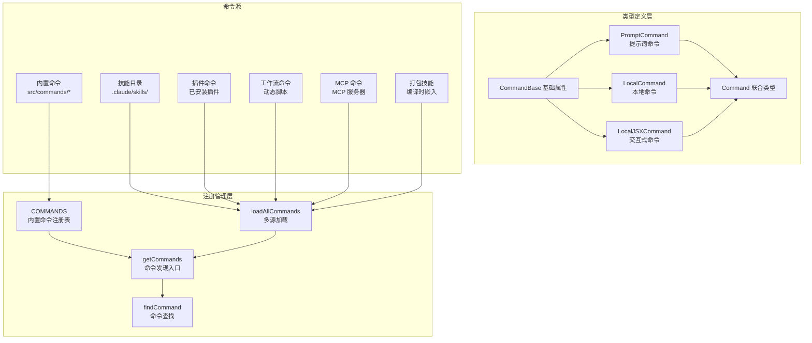
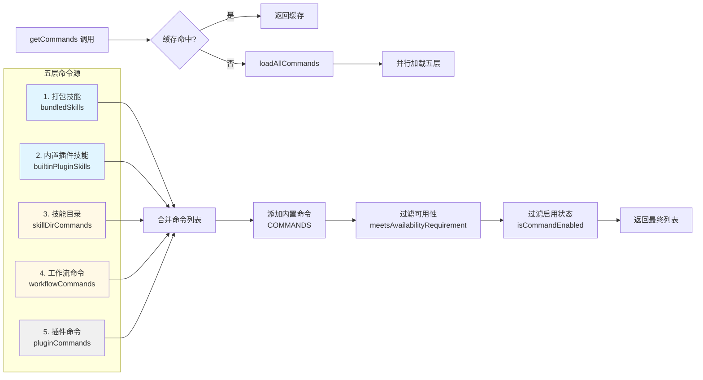

Claude Code 的命令系统是其交互体验的核心基础设施，通过统一的类型系统、注册机制和执行策略，组织并管理着 50+ 内置命令、动态技能、插件命令和工作流命令。这个系统的设计遵循**延迟加载、类型安全、渐进式发现**三大原则，在保持启动性能的同时，为用户提供丰富的命令生态。

## 架构概览：三层命令体系

命令系统采用**三层架构**：类型定义层、注册管理层、执行层。类型定义层（`src/types/command.ts`）定义了所有命令的统一接口和三种命令类型；注册管理层（`src/commands.ts`）负责命令的发现、加载、缓存和过滤；执行层（各命令实现）负责具体业务逻辑。



**核心设计原则**：

1. **延迟加载（Lazy Loading）**：所有命令实现通过 `load()` 函数延迟加载，避免启动时加载所有依赖。例如 `/help` 命令的实现文件 `help.tsx` 只在用户首次输入 `/help` 时才被导入，这显著减少了 CLI 的启动时间。

2. **类型安全（Type Safety）**：通过 TypeScript 的联合类型和类型守卫，确保命令的元数据和实现类型一致。`Command` 类型是 `PromptCommand | LocalCommand | LocalJSXCommand` 的联合，编译器会强制要求实现提供正确的属性。

3. **渐进式发现（Progressive Discovery）**：命令源按优先级加载，从最快的内置命令到最慢的动态技能。`getCommands()` 使用 memoization 缓存加载结果，同时保留实时过滤能力（如 `isEnabled()` 和 `availability` 检查）。

Sources: [types/command.ts](src/types/command.ts#L1-L217), [commands.ts](src/commands.ts#L1-L755)

## 命令类型系统：三种执行模式

命令系统定义了三种命令类型，每种对应不同的执行模式和用户体验。

### CommandBase：所有命令的共享属性

```typescript
type CommandBase = {
  name: string                    // 命令名称（如 'help'）
  description: string             // 命令描述（用于帮助文本）
  aliases?: string[]              // 别名列表（如 ['reset', 'new']）
  argumentHint?: string           // 参数提示（如 '[model]'）
  availability?: CommandAvailability[]  // 可用性要求（auth/provider）
  isEnabled?: () => boolean       // 动态启用检查（特性开关）
  isHidden?: boolean              // 是否隐藏（不显示在帮助中）
  immediate?: boolean             // 是否立即执行（绕过队列）
  isSensitive?: boolean           // 参数是否敏感（需脱敏）
  userInvocable?: boolean         // 用户是否可调用
  disableModelInvocation?: boolean // 禁止模型调用
  loadedFrom?: LoadedFrom         // 命令来源标记
}
```

**关键字段解析**：

- **`availability`**：声明命令的可用性要求，独立于 `isEnabled()`。`availability` 是静态的认证/提供商要求（如 `['claude-ai']` 表示仅 claude.ai 订阅者可见），而 `isEnabled()` 是动态的运行时状态（如特性开关）。例如 `/upgrade` 命令标记为 `availability: ['claude-ai', 'console']`，只有通过 claude.ai 订阅或直接使用 Console API 的用户才能看到，Bedrock/Vertex 用户则完全看不到这个命令。

- **`immediate`**：标记命令是否绕过输入队列立即执行。大多数命令等待用户完成输入（支持 Ctrl+C 取消），但标记为 `immediate: true` 的命令（如 `/status`、`/model`）会立即执行，提供即时反馈。这对于配置查看和切换类命令特别重要。

- **`loadedFrom`**：追踪命令来源，用于 UI 展示和调试。可能的值包括 `'builtin'`（内置命令）、`'skills'`（技能目录）、`'plugin'`（插件）、`'bundled'`（打包技能）、`'mcp'`（MCP 服务器）。这决定了命令在自动补全中的显示方式（如插件命令会显示 `[插件名]` 前缀）。

Sources: [types/command.ts](src/types/command.ts#L175-L200)

### PromptCommand：LLM 提示词生成器

**PromptCommand** 是最强大的命令类型，它生成发送给 LLM 的提示词，允许命令作为"技能"被模型主动调用。这种命令不直接执行业务逻辑，而是构造一个结构化的提示，让 LLM 完成复杂任务。

```typescript
type PromptCommand = {
  type: 'prompt'
  progressMessage: string         // 执行时的进度消息
  contentLength: number           // 内容长度（用于 token 估算）
  source: SettingSource | 'builtin' | 'mcp' | 'plugin' | 'bundled'
  argNames?: string[]             // 参数名称列表
  allowedTools?: string[]         // 允许使用的工具列表
  model?: string                  // 指定模型（覆盖默认）
  context?: 'inline' | 'fork'     // 执行上下文
  agent?: string                  // 子代理类型（fork 模式）
  effort?: EffortValue            // 工作量级别
  paths?: string[]                // 文件路径匹配模式
  hooks?: HooksSettings           // 关联的钩子配置
  skillRoot?: string              // 技能根目录
  getPromptForCommand(
    args: string,
    context: ToolUseContext
  ): Promise<ContentBlockParam[]> // 生成提示词的方法
}
```

**典型应用场景**：

1. **`/init` 命令**：分析代码库并生成 `CLAUDE.md` 文件。它构造一个多阶段的提示词，指导 LLM 先探索代码库、再询问用户、最后生成配置文件。整个流程由 LLM 自主完成，命令只提供结构化的指导。

2. **技能系统**：用户定义的技能（如 `/review-pr`）本质上是 PromptCommand。技能文件包含 frontmatter 元数据和 Markdown 内容，`getPromptForCommand()` 将其转换为 LLM 可理解的提示词块。

**`context` 字段详解**：

- **`'inline'`（默认）**：技能内容直接展开到当前对话中，共享同一个上下文和 token 预算。适合轻量级技能（如 `/commit`）。
  
- **`'fork'`**：技能在独立的子代理中执行，拥有独立的上下文和 token 预算。适合重量级技能（如深度代码审查），避免污染主对话上下文。`agent` 字段指定子代理类型（如 `'general-purpose'`）。

Sources: [types/command.ts](src/types/command.ts#L25-L57)

### LocalCommand：同步执行返回结果

**LocalCommand** 是最简单的命令类型，直接执行代码并返回文本结果。适用于不需要用户交互的快速操作。

```typescript
type LocalCommand = {
  type: 'local'
  supportsNonInteractive: boolean // 是否支持非交互模式
  load: () => Promise<LocalCommandModule>
}

type LocalCommandCall = (
  args: string,
  context: LocalJSXCommandContext
) => Promise<LocalCommandResult>

type LocalCommandResult =
  | { type: 'text'; value: string }
  | { type: 'compact'; compactionResult: CompactionResult }
  | { type: 'skip' }
```

**实现示例：`/compact` 命令**

```typescript
// src/commands/compact/index.ts
const compact = {
  type: 'local',
  name: 'compact',
  description: 'Clear conversation history but keep a summary',
  isEnabled: () => !isEnvTruthy(process.env.DISABLE_COMPACT),
  supportsNonInteractive: true,
  argumentHint: '<optional custom summarization instructions>',
  load: () => import('./compact.js'),
} satisfies Command

// src/commands/compact/compact.ts
export const call: LocalCommandCall = async (args, context) => {
  const { messages, abortController } = context
  
  // 执行压缩逻辑
  const result = await compactConversation(messages, args, context)
  
  return {
    type: 'compact',
    compactionResult: result,
    displayText: 'Conversation compacted successfully'
  }
}
```

**`supportsNonInteractive` 字段**：标记命令是否能在非交互模式（如 CI/CD 管道）中执行。例如 `/compact` 支持（自动压缩），但 `/config` 不支持（需要交互式选择）。

Sources: [types/command.ts](src/types/command.ts#L74-L78), [commands/compact/index.ts](src/commands/compact/index.ts#L1-L16)

### LocalJSXCommand：React 组件交互式 UI

**LocalJSXCommand** 是最灵活的命令类型，返回 React 组件，支持复杂的交互式 UI。这是大多数内置命令的选择。

```typescript
type LocalJSXCommand = {
  type: 'local-jsx'
  load: () => Promise<LocalJSXCommandModule>
}

type LocalJSXCommandCall = (
  onDone: LocalJSXCommandOnDone,
  context: ToolUseContext & LocalJSXCommandContext,
  args: string
) => Promise<React.ReactNode>

type LocalJSXCommandOnDone = (
  result?: string,
  options?: {
    display?: 'skip' | 'system' | 'user'
    shouldQuery?: boolean
    metaMessages?: string[]
    nextInput?: string
    submitNextInput?: boolean
  }
) => void
```

**实现示例：`/model` 命令**

```typescript
// src/commands/model/index.ts
export default {
  type: 'local-jsx',
  name: 'model',
  get description() {
    return `Set the AI model (currently ${renderModelName(getMainLoopModel())})`
  },
  argumentHint: '[model]',
  get immediate() {
    return shouldInferenceConfigCommandBeImmediate()
  },
  load: () => import('./model.js'),
} satisfies Command

// src/commands/model/model.tsx
export const call: LocalJSXCommandCall = async (onDone, context, args) => {
  const models = await getAvailableModels()
  
  // 返回模型选择器组件
  return (
    <Box flexDirection="column">
      <Text>Select a model:</Text>
      {models.map(model => (
        <SelectableItem
          key={model.id}
          label={model.name}
          onSelect={() => {
            setMainLoopModel(model.id)
            onDone(`Model set to ${model.name}`, { shouldQuery: false })
          }}
        />
      ))}
    </Box>
  )
}
```

**`onDone` 回调机制**：命令完成后调用 `onDone()`，支持多种完成模式：

- **`display`**：控制结果显示方式。`'user'`（默认）显示为用户消息，`'system'` 显示为系统消息，`'skip'` 不显示。
- **`shouldQuery`**：是否在命令完成后立即查询 LLM。对于配置类命令通常为 `false`。
- **`nextInput` + `submitNextInput`**：自动填充并提交下一个输入，实现命令链。

**动态属性**：`description` 和 `immediate` 可以定义为 getter 函数，每次访问时重新计算。例如 `/model` 命令的描述会显示当前模型，`/status` 命令的 `immediate` 会根据配置动态决定。

Sources: [types/command.ts](src/types/command.ts#L144-L152), [commands/model/index.ts](src/commands/model/index.ts#L1-L17)

### 三种命令类型对比

| 特性 | PromptCommand | LocalCommand | LocalJSXCommand |
|------|---------------|--------------|-----------------|
| **执行模式** | 生成提示词，LLM 执行 | 同步代码执行 | React 组件渲染 |
| **交互能力** | 通过 LLM 间接交互 | 无交互 | 完整交互式 UI |
| **典型场景** | 复杂任务、技能系统 | 快速操作、自动化 | 配置管理、用户引导 |
| **模型可调用** | ✅ 是 | ❌ 否 | ❌ 否 |
| **上下文隔离** | 支持（fork 模式） | 共享主上下文 | 共享主上下文 |
| **实现复杂度** | 中等 | 简单 | 复杂 |
| **性能开销** | 高（LLM 调用） | 低 | 中等（UI 渲染） |
| **示例命令** | `/init`, `/review-pr` | `/compact`, `/clear` | `/model`, `/config`, `/help` |

Sources: [types/command.ts](src/types/command.ts#L1-L217)

## 命令注册机制：从静态声明到动态发现

命令注册采用**分层加载、延迟发现**策略，平衡启动性能和功能完整性。

### 注册流程：五层命令源



**加载顺序优先级**（从快到慢）：

1. **打包技能**：编译时嵌入二进制的技能，无需文件 I/O。通过 `registerBundledSkill()` 在模块初始化时注册到内存数组，加载时间为 0ms。

2. **内置插件技能**：内置插件提供的技能，从已加载的插件清单中提取，无需动态导入。

3. **技能目录命令**：从 `.claude/skills/`、`~/.claude/skills/` 等目录加载 Markdown 文件。需要文件系统扫描和 frontmatter 解析，是最慢的命令源之一。

4. **工作流命令**：从工作流脚本动态生成的命令，需要执行脚本并解析输出。

5. **插件命令**：从已安装插件的 `commands/` 目录加载，需要动态导入 JavaScript 模块。

6. **内置命令（COMMANDS）**：最后添加，确保用户定义的技能可以覆盖内置命令（通过同名优先级）。

**缓存策略**：

- **`loadAllCommands`**：使用 `lodash.memoize` 按 `cwd` 缓存，因为技能目录路径依赖当前工作目录。
- **`getCommands`**：不缓存，每次调用都重新过滤（`availability` 和 `isEnabled` 可能因认证状态或特性开关变化）。
- **`clearCommandsCache`**：手动清除所有缓存，用于热重载或配置变更。

Sources: [commands.ts](src/commands.ts#L400-L599)

### 内置命令注册表：COMMANDS() 函数

`COMMANDS()` 是一个 memoized 函数，返回所有内置命令的数组。它不是在模块加载时立即执行，而是延迟到首次调用 `getCommands()` 时。

```typescript
const COMMANDS = memoize((): Command[] => [
  addDir,
  advisor,
  agents,
  branch,
  // ... 50+ 内置命令
  ...(webCmd ? [webCmd] : []),
  ...(forkCmd ? [forkCmd] : []),
  ...(buddy ? [buddy] : []),
  // 特性开关控制的命令
  ...(!isUsing3PServices() ? [logout, login()] : []),
  ...(process.env.USER_TYPE === 'ant' && !process.env.IS_DEMO
    ? INTERNAL_ONLY_COMMANDS
    : []),
])
```

**特性开关集成**：

内置命令支持条件注册，通过 Bun bundle 的 `feature()` 函数检查特性开关：

```typescript
const bridge = feature('BRIDGE_MODE')
  ? require('./commands/bridge/index.js').default
  : null

const COMMANDS = memoize((): Command[] => [
  // ... 其他命令
  ...(bridge ? [bridge] : []),
])
```

特性开关在编译时确定，未启用的命令会被 tree-shaking 移除，不会进入最终二进制。

Sources: [commands.ts](src/commands.ts#L258-L346)

### 命令查找与解析

**查找流程**：

```typescript
export function findCommand(
  commandName: string,
  commands: Command[]
): Command | undefined {
  return commands.find(cmd =>
    cmd.name === commandName ||
    getCommandName(cmd) === commandName ||
    cmd.aliases?.includes(commandName)
  )
}

export function getCommand(commandName: string, commands: Command[]): Command {
  const command = findCommand(commandName, commands)
  if (!command) {
    throw ReferenceError(
      `Command ${commandName} not found. Available commands: ${commands
        .map(_ => getCommandName(_))
        .sort()
        .join(', ')}`
    )
  }
  return command
}
```

**解析流程**（用户输入 → 命令对象）：

```typescript
// src/utils/slashCommandParsing.ts
export function parseSlashCommand(input: string): ParsedSlashCommand | null {
  const trimmedInput = input.trim()
  
  if (!trimmedInput.startsWith('/')) {
    return null
  }
  
  const withoutSlash = trimmedInput.slice(1)
  const words = withoutSlash.split(' ')
  
  let commandName = words[0]
  let isMcp = false
  let argsStartIndex = 1
  
  // 检测 MCP 命令（格式：/command (MCP) args）
  if (words.length > 1 && words[1] === '(MCP)') {
    commandName = commandName + ' (MCP)'
    isMcp = true
    argsStartIndex = 2
  }
  
  const args = words.slice(argsStartIndex).join(' ')
  
  return { commandName, args, isMcp }
}
```

**完整执行流程**：

1. 用户输入 `/model claude-3-opus`
2. `parseSlashCommand()` 解析为 `{ commandName: 'model', args: 'claude-3-opus', isMcp: false }`
3. `getCommands()` 获取可用命令列表
4. `findCommand('model', commands)` 查找命令对象
5. 检查命令类型：`cmd.type === 'local-jsx'`
6. 调用 `cmd.load()` 动态导入实现模块
7. 调用 `module.call(onDone, context, 'claude-3-opus')`
8. 组件渲染模型选择器，用户选择后调用 `onDone()`

Sources: [commands.ts](src/commands.ts#L688-L719), [utils/slashCommandParsing.ts](src/utils/slashCommandParsing.ts#L1-L61)

## 命令组织结构：模块化与延迟加载

每个命令遵循统一的目录结构，确保一致性和可维护性。

### 标准命令目录结构

```
src/commands/
├── help/
│   ├── index.ts         # 命令元数据导出
│   └── help.tsx         # 命令实现（延迟加载）
├── model/
│   ├── index.ts         # 包含动态属性的 getter
│   └── model.tsx        # React 组件实现
├── compact/
│   ├── index.ts         # LocalCommand 元数据
│   └── compact.ts       # 业务逻辑实现
└── init.ts              # PromptCommand（单文件）
```

**目录组织原则**：

1. **`index.ts` 只包含元数据**：命令名称、描述、别名、类型声明，不包含实现代码。这确保即使导入 `commands.ts`，也不会加载所有命令的实现依赖。

2. **实现文件延迟导入**：通过 `load: () => import('./impl.js')` 动态导入，只在命令被调用时加载。例如 `/help` 的 `help.tsx` 包含 Ink UI 框架和大量组件，延迟加载节省约 50KB 的启动包大小。

3. **支持单文件命令**：简单的 PromptCommand（如 `/init`）可以直接定义在单文件中，无需目录结构。

### 实现模式对比

**LocalCommand 实现模式**：

```typescript
// src/commands/clear/index.ts
const clear = {
  type: 'local',
  name: 'clear',
  description: 'Clear conversation history',
  aliases: ['reset', 'new'],
  supportsNonInteractive: false,
  load: () => import('./clear.js'),
} satisfies Command

export default clear

// src/commands/clear/clear.ts
export const call: LocalCommandCall = async (_, context) => {
  await clearConversation(context)
  return { type: 'text', value: '' }
}
```

**LocalJSXCommand 实现模式**：

```typescript
// src/commands/help/index.ts
const help = {
  type: 'local-jsx',
  name: 'help',
  description: 'Show help and available commands',
  load: () => import('./help.js'),
} satisfies Command

export default help

// src/commands/help/help.tsx
export const call: LocalJSXCommandCall = async (onDone, context, args) => {
  const commands = await getCommands(context.cwd)
  
  return (
    <Box flexDirection="column">
      <Text bold>Available Commands:</Text>
      {commands.map(cmd => (
        <Text key={cmd.name}>/{cmd.name} - {cmd.description}</Text>
      ))}
    </Box>
  )
}
```

**PromptCommand 实现模式**：

```typescript
// src/commands/init.ts
const init = {
  type: 'prompt',
  name: 'init',
  description: 'Initialize CLAUDE.md for this repository',
  progressMessage: 'analyzing codebase',
  contentLength: 5000,
  source: 'builtin',
  async getPromptForCommand(args, context) {
    return [{
      type: 'text',
      text: `Set up a minimal CLAUDE.md for this repo. ${OLD_INIT_PROMPT}`
    }]
  }
} satisfies Command

export default init
```

Sources: [commands/help/index.ts](src/commands/help/index.ts#L1-L11), [commands/clear/index.ts](src/commands/clear/index.ts#L1-L20), [commands/init.ts](src/commands/init.ts#L1-L100)

## 安全性控制：远程模式与 Bridge 过滤

命令系统实现了多层安全过滤，防止不安全的命令在特定环境中执行。

### 远程模式安全（REMOTE_SAFE_COMMANDS）

在 `--remote` 模式下（连接到远程 Claude Code 实例），只有标记为安全的命令可用。这些命令仅影响本地 TUI 状态，不依赖本地文件系统、Git、Shell 或 IDE。

```typescript
export const REMOTE_SAFE_COMMANDS: Set<Command> = new Set([
  session,   // 显示远程会话 QR 码
  exit,      // 退出 TUI
  clear,     // 清屏
  help,      // 显示帮助
  theme,     // 更改主题
  color,     // 更改代理颜色
  vim,       // 切换 Vim 模式
  cost,      // 显示会话成本
  usage,     // 显示用量信息
  copy,      // 复制最后一条消息
  btw,       // 快速笔记
  feedback,  // 发送反馈
  plan,      // 计划模式切换
  keybindings, // 快捷键管理
  statusline, // 状态栏切换
  stickers,  // 贴纸
  mobile,    // 移动端 QR 码
])

export function filterCommandsForRemoteMode(commands: Command[]): Command[] {
  return commands.filter(cmd => REMOTE_SAFE_COMMANDS.has(cmd))
}
```

**设计原则**：远程模式下，用户通过移动端或 Web 客户端控制远程实例，本地 TUI 只是一个"显示终端"。因此只允许纯 UI 操作，禁止任何可能影响远程环境的命令（如 `/commit`、`/mcp`）。

### Bridge 模式安全（BRIDGE_SAFE_COMMANDS）

Bridge 模式允许移动端/Web 客户端通过 Remote Control 协议发送斜杠命令。为防止不安全的命令执行，实施了类型级过滤。

```typescript
export const BRIDGE_SAFE_COMMANDS: Set<Command> = new Set([
  compact,       // 压缩上下文
  clear,         // 清空对话
  cost,          // 显示成本
  summary,       // 总结对话
  releaseNotes,  // 显示更新日志
  files,         // 列出跟踪文件
])

export function isBridgeSafeCommand(cmd: Command): boolean {
  // LocalJSXCommand 总是禁止（渲染 Ink UI）
  if (cmd.type === 'local-jsx') return false
  
  // PromptCommand 总是允许（展开为文本发送给模型）
  if (cmd.type === 'prompt') return true
  
  // LocalCommand 需要显式加入白名单
  return BRIDGE_SAFE_COMMANDS.has(cmd)
}
```

**类型级安全策略**：

- **`local-jsx` 命令**：完全禁止。这些命令返回 React 组件，在移动端无法渲染 Ink UI，且可能触发本地交互（如文件选择器）。
  
- **`prompt` 命令**：完全允许。这些命令生成文本提示词，发送给远程 LLM 处理，不涉及本地执行。
  
- **`local` 命令**：需要显式白名单。只有不依赖终端特性的命令（如 `/compact`）被允许。

### 可用性过滤（availability）

命令可以声明 `availability` 字段，限制命令的可见性。

```typescript
export function meetsAvailabilityRequirement(cmd: Command): boolean {
  if (!cmd.availability) return true
  
  for (const a of cmd.availability) {
    switch (a) {
      case 'claude-ai':
        if (isClaudeAISubscriber()) return true
        break
      case 'console':
        if (!isClaudeAISubscriber() && 
            !isUsing3PServices() && 
            isFirstPartyAnthropicBaseUrl()) {
          return true
        }
        break
    }
  }
  return false
}
```

**可用性类型**：

- **`'claude-ai'`**：仅 claude.ai 订阅者可见（Pro/Max/Team/Enterprise）。
- **`'console'`**：仅直接使用 Console API 的用户可见（api.anthropic.com，非 3P 服务）。

**与 `isEnabled` 的区别**：

- **`availability`**：静态的认证/提供商要求，在 `getCommands()` 时过滤。
- **`isEnabled`**：动态的运行时状态（特性开关、环境变量），每次调用都重新检查。

例如 `/upgrade` 命令：
- `availability: ['claude-ai', 'console']`：只有 claude.ai 订阅者或 Console API 用户能看到。
- `isEnabled: () => !isEnvTruthy(process.env.DISABLE_UPGRADE)`：即使满足可用性，如果设置了 `DISABLE_UPGRADE` 环境变量，命令仍会被禁用。

Sources: [commands.ts](src/commands.ts#L619-L686), [commands.ts](src/commands.ts#L400-L499)

## 动态技能系统：用户定义的命令

除了内置命令，Claude Code 支持多种动态命令源，允许用户和插件扩展命令生态。

### 技能目录加载

技能是用户定义的 PromptCommand，存储在 Markdown 文件中。加载流程涉及文件扫描、frontmatter 解析和参数替换。

**技能文件格式**：

```markdown
---
name: review-pr
description: Review a pull request
aliases: [pr-review]
argumentHint: <pr-number>
allowedTools: [Bash, Read, WebFetch]
model: claude-3-opus
---

Review the pull request #{args} and provide feedback on:
- Code quality
- Test coverage
- Documentation
```

**加载流程**：

```typescript
// src/skills/loadSkillsDir.ts
export async function getSkillDirCommands(cwd: string): Promise<Command[]> {
  const skillsDirs = [
    join(cwd, '.claude/skills'),          // 项目级技能
    join(getClaudeConfigHomeDir(), 'skills'), // 用户级技能
  ]
  
  const commands: Command[] = []
  
  for (const dir of skillsDirs) {
    const files = await loadMarkdownFilesForSubdir(dir)
    
    for (const file of files) {
      const frontmatter = parseFrontmatter(file.content)
      const command = createCommandFromFrontmatter(frontmatter, file, dir)
      commands.push(command)
    }
  }
  
  return commands
}
```

**参数替换机制**：

技能支持 `{args}` 占位符，在 `getPromptForCommand()` 时替换为实际参数：

```typescript
async getPromptForCommand(args: string, context: ToolUseContext) {
  const promptContent = substituteArguments(
    markdownContent,
    { args },
    parseArgumentNames(argNames)
  )
  
  return [{ type: 'text', text: promptContent }]
}
```

### 打包技能（Bundled Skills）

打包技能是编译时嵌入二进制的技能，无需文件系统访问。通过 `registerBundledSkill()` 注册。

```typescript
// src/skills/bundledSkills.ts
export function registerBundledSkill(definition: BundledSkillDefinition): void {
  const command: Command = {
    type: 'prompt',
    name: definition.name,
    description: definition.description,
    source: 'bundled',
    loadedFrom: 'bundled',
    hasUserSpecifiedDescription: true,
    getPromptForCommand: definition.getPromptForCommand,
  }
  
  bundledSkills.push(command)
}
```

**文件提取机制**：

打包技能可以包含参考文件，在首次调用时提取到临时目录：

```typescript
type BundledSkillDefinition = {
  name: string
  description: string
  files?: Record<string, string>  // 文件路径 → 内容
  getPromptForCommand(args, context): Promise<ContentBlockParam[]>
}

// 提取文件到临时目录
if (files && Object.keys(files).length > 0) {
  skillRoot = getBundledSkillExtractDir(definition.name)
  
  // 包装 getPromptForCommand，自动提取文件
  getPromptForCommand = async (args, ctx) => {
    await extractBundledSkillFiles(definition.name, files)
    const blocks = await definition.getPromptForCommand(args, ctx)
    return prependBaseDir(blocks, skillRoot)
  }
}
```

提取后的文件路径会被添加到提示词开头，让 LLM 可以通过 `Read` 工具访问这些参考文件。

Sources: [skills/loadSkillsDir.ts](src/skills/loadSkillsDir.ts#L1-L100), [skills/bundledSkills.ts](src/skills/bundledSkills.ts#L1-L80)

## 最佳实践与设计模式

### 命令设计原则

1. **单一职责**：每个命令只做一件事。`/compact` 只负责压缩，`/clear` 只负责清空，不混合职责。

2. **延迟加载优先**：所有命令实现必须通过 `load()` 延迟导入，避免启动时加载大型依赖（如 Ink、highlight.js）。

3. **类型安全**：使用 `satisfies Command` 确保命令对象符合类型定义，编译器会捕获缺失的属性。

4. **动态属性**：对于依赖运行时状态的属性（如当前模型、配置状态），使用 getter 函数而非静态值。

5. **安全优先**：评估命令是否适合远程模式和 Bridge 模式，必要时添加到安全白名单。

### 性能优化策略

1. **Memoization**：`getCommands()` 和 `loadAllCommands()` 使用 `lodash.memoize` 缓存结果，避免重复的文件 I/O。

2. **并行加载**：多个命令源（技能、插件、工作流）并行加载，减少总加载时间。

3. **按需导入**：大型依赖（如 `insights.ts` 3200 行）通过动态 `import()` 延迟加载，只在命令被调用时加载。

4. **缓存失效**：提供 `clearCommandsCache()` 手动清除缓存，用于热重载场景。

### 错误处理模式

```typescript
// 命令查找失败：提供详细的可用命令列表
export function getCommand(commandName: string, commands: Command[]): Command {
  const command = findCommand(commandName, commands)
  if (!command) {
    throw ReferenceError(
      `Command ${commandName} not found. Available commands: ${commands
        .map(_ => getCommandName(_))
        .sort()
        .join(', ')}`
    )
  }
  return command
}

// 技能加载失败：降级而非崩溃
async function getSkills(cwd: string) {
  try {
    const [skillDirCommands, pluginSkills] = await Promise.all([
      getSkillDirCommands(cwd).catch(err => {
        logError(toError(err))
        logForDebugging('Skill directory commands failed, continuing without them')
        return []
      }),
      getPluginSkills().catch(err => {
        logError(toError(err))
        logForDebugging('Plugin skills failed, continuing without them')
        return []
      }),
    ])
    return { skillDirCommands, pluginSkills }
  } catch (err) {
    logError(toError(err))
    return { skillDirCommands: [], pluginSkills: [] }
  }
}
```

**降级策略**：技能加载失败不应阻塞整个系统，而是跳过失败的技能源，继续加载其他命令。

## 总结：命令系统的设计精髓

Claude Code 的命令系统通过**类型化命令、分层加载、安全过滤**三大机制，构建了一个既强大又安全的命令生态：

1. **类型系统**：`PromptCommand`、`LocalCommand`、`LocalJSXCommand` 三种类型覆盖了从 LLM 交互到本地执行到 UI 渲染的全场景，类型安全确保实现与元数据一致。

2. **注册机制**：`COMMANDS()` 提供静态注册，`getCommands()` 提供动态发现，`loadAllCommands()` 并行加载五层命令源，平衡了性能和灵活性。

3. **延迟加载**：所有命令实现通过 `load()` 延迟导入，避免启动时加载所有依赖，显著减少启动时间和内存占用。

4. **安全控制**：`REMOTE_SAFE_COMMANDS` 和 `BRIDGE_SAFE_COMMANDS` 实施类型级过滤，`availability` 实施认证级过滤，确保命令只在合适的环境中执行。

5. **扩展性**：技能目录、插件系统、工作流脚本、MCP 服务器提供了多种扩展途径，用户可以根据需求选择合适的扩展方式。

这个设计展示了一个成熟的 CLI 工具如何组织和管理复杂的命令系统：通过清晰的类型定义、模块化的组织结构、智能的加载策略和严格的安全控制，在保持代码可维护性的同时，为用户提供流畅的交互体验。

**延伸阅读**：

- [工具系统架构：从 Tool 接口到 40+ 工具实现](6-gong-ju-xi-tong-jia-gou-cong-tool-jie-kou-dao-40-gong-ju-shi-xian)：了解命令如何调用工具执行实际操作
- [权限模式系统：default、plan、auto、bypass 等模式解析](9-quan-xian-mo-shi-xi-tong-default-plan-auto-bypass-deng-mo-shi-jie-xi)：了解命令执行时的权限控制
- [技能系统：BundledSkill 与命令注册](22-ji-neng-xi-tong-bundledskill-yu-ming-ling-zhu-ce)：深入了解技能的加载和注册机制
- [钩子系统：Hooks 配置与执行时机](23-gou-zi-xi-tong-hooks-pei-zhi-yu-zhi-xing-shi-ji)：了解技能如何通过钩子扩展行为