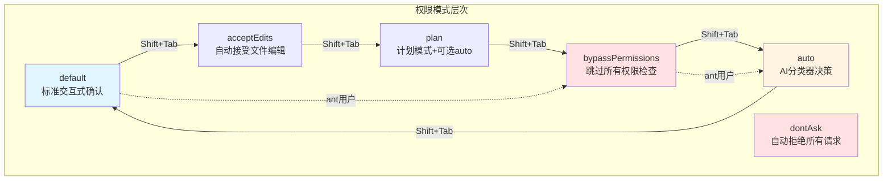
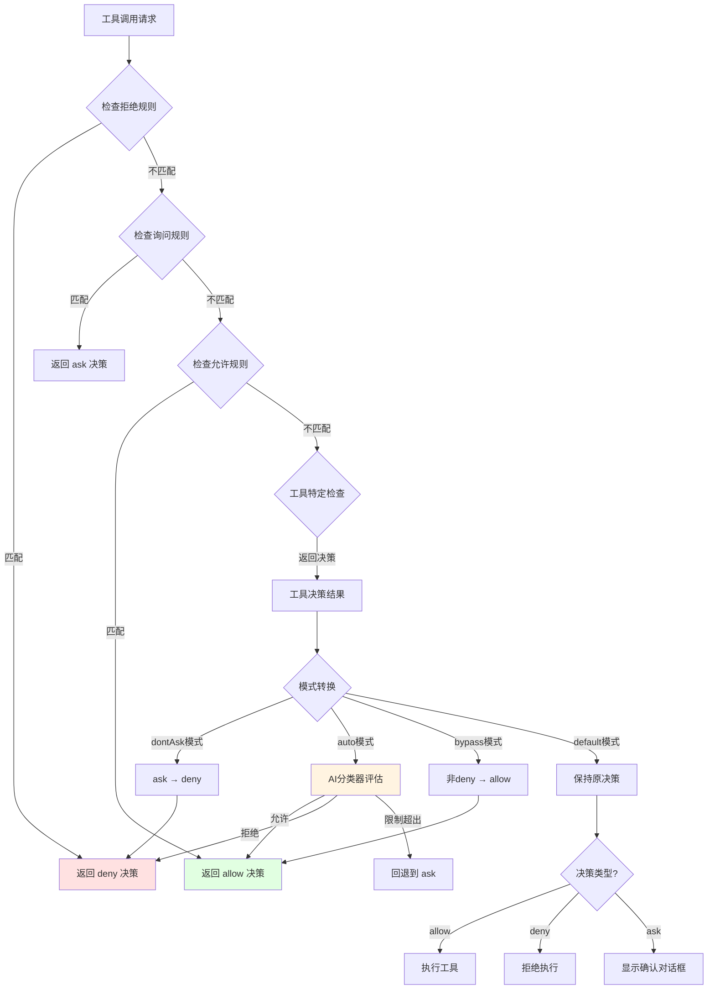

Claude Code 的权限模式系统是一个多层防护架构，通过六种权限模式控制工具执行的批准流程。该系统在用户便利性与安全性之间寻求平衡，从严格的交互式确认到完全自动化的 AI 分类器决策，为不同使用场景提供精细化的权限控制策略。系统核心定义在 `src/types/permissions.ts` 中，通过 `PermissionMode` 类型统一管理所有模式的类型安全，而实际的权限检查逻辑则在 `src/utils/permissions/permissions.ts` 中实现，形成了从类型定义到运行时决策的完整链路。

Sources: [src/types/permissions.ts](src/types/permissions.ts#L1-L79), [src/utils/permissions/permissions.ts](src/utils/permissions/permissions.ts#L1-L200)

## 权限模式架构总览

权限模式系统采用分层设计，每个模式代表不同的自动化程度和安全边界。系统通过 `ToolPermissionContext` 维护当前模式状态及相关规则，该上下文在应用启动时初始化并贯穿整个会话生命周期。模式切换由 `getNextPermissionMode` 函数控制，确保转换遵循预定义的安全路径，而 `transitionPermissionMode` 则负责处理模式切换时的副作用，如清理危险权限规则或触发附加消息。

Sources: [src/utils/permissions/getNextPermissionMode.ts](src/utils/permissions/getNextPermissionMode.ts#L20-L102), [src/utils/permissions/PermissionMode.ts](src/utils/permissions/PermissionMode.ts#L1-L142), [src/Tool.ts](src/Tool.ts#L100-L130)

## 权限模式定义与类型系统

### 核心类型定义

权限模式的类型系统分为外部模式和内部模式两个层次。外部模式（`ExternalPermissionMode`）是用户可直接配置的模式集合，包括 `acceptEdits`、`bypassPermissions`、`default`、`dontAsk` 和 `plan`，这些模式可通过 `settings.json` 的 `permissions.defaultMode` 字段或 CLI 的 `--permission-mode` 参数设置。内部模式（`InternalPermissionMode`）在外部模式基础上增加了 `auto` 和 `bubble` 两个内部使用的模式，其中 `auto` 模式仅对内部用户开放，需要通过 `TRANSCRIPT_CLASSIFIER` feature flag 启用。

类型系统通过 `EXTERNAL_PERMISSION_MODES` 常量数组定义外部模式的运行时集合，使用 TypeScript 的 `as const` 断言确保类型推断的精确性。`INTERNAL_PERMISSION_MODES` 则根据 feature flag 条件性地包含 `auto` 模式，这种设计允许在不修改类型定义的情况下通过配置开关控制模式的可用性。权限行为（`PermissionBehavior`）定义为三值逻辑：`allow` 表示直接允许执行，`deny` 表示直接拒绝，`ask` 表示需要用户交互式确认。

Sources: [src/types/permissions.ts](src/types/permissions.ts#L17-L79), [src/utils/permissions/PermissionMode.ts](src/utils/permissions/PermissionMode.ts#L10-L60)

### 模式配置与元数据

每个权限模式关联一组元数据配置，包括显示标题、短标题、符号图标和颜色主题。这些配置通过 `PERMISSION_MODE_CONFIG` 对象集中管理，为 UI 层提供一致的视觉呈现。例如，`plan` 模式使用暂停图标（`PAUSE_ICON`）和 `planMode` 颜色主题，而 `bypassPermissions` 模式则使用双箭头符号和 `error` 颜色主题以强调其危险性。`toExternalPermissionMode` 函数负责将内部模式映射到对应的外部模式，例如 `auto` 模式在外部表现为 `default` 模式，这确保了模式切换循环的连贯性。

模式配置还包括类型守卫函数 `isExternalPermissionMode`，该函数根据 `USER_TYPE` 环境变量区分内部用户和外部用户，内部用户可以访问 `auto` 模式而外部用户则被限制在外部模式集合内。这种设计实现了代码层面的访问控制，防止外部构建包含内部特性。

Sources: [src/utils/permissions/PermissionMode.ts](src/utils/permissions/PermissionMode.ts#L62-L142)

## 六种权限模式深度解析

### default 模式：标准交互式确认

`default` 模式是系统的默认状态，对所有工具操作执行交互式权限检查。在该模式下，每个工具调用都会经过完整的权限管道：首先检查全局拒绝规则（`alwaysDenyRules`），然后检查全局允许规则（`alwaysAllowRules`），接着检查工具特定的 `checkPermissions` 方法，最后如果没有任何规则匹配则弹出交互式确认对话框。这种模式提供了最细粒度的控制，适合需要严格审核每个操作的场景。

权限检查流程在 `hasPermissionsToUseTool` 函数中实现，该函数作为 `CanUseToolFn` 类型的实现被注入到工具执行上下文中。检查过程分为多个步骤（step 1a-2g），每个步骤都可能提前返回决策结果，形成短路评估链。例如，如果工具在全局拒绝规则中（step 1a），则直接返回 `deny` 决策而跳过后续所有检查。这种分层设计确保了规则评估的确定性和高效性。

Sources: [src/utils/permissions/permissions.ts](src/utils/permissions/permissions.ts#L200-L400), [src/utils/permissions/permissions.ts](src/utils/permissions/permissions.ts#L900-L1100)

### plan 模式：计划模式与可选 auto 集成

`plan` 模式专为需要多步骤规划的复杂任务设计，该模式在标准权限检查基础上增加了计划阶段的状态管理。当进入 plan 模式时，系统通过 `handlePlanModeTransition` 函数触发附加消息（attachment message），该消息会指导 LLM 进入计划生成流程。plan 模式可以与 `auto` 模式组合使用，当 `isAutoModeActive()` 返回 true 时，plan 模式下的工具调用会使用 AI 分类器自动决策，从而在保持计划结构的同时提高执行效率。

plan 模式的实现涉及 `prePlanMode` 字段，该字段存储进入计划模式前的权限模式，以便在退出计划模式时恢复原始状态。`setHasExitedPlanMode` 标志用于追踪用户是否已经退出过计划模式，这影响后续的模式切换行为。plan 模式还支持 V2 版本的增强特性，包括多代理协调和探索代理配置，这些通过 `getPlanModeV2AgentCount` 和 `getPlanModeV2ExploreAgentCount` 函数控制。

Sources: [src/utils/permissions/permissionSetup.ts](src/utils/permissions/permissionSetup.ts#L560-L620), [src/utils/planModeV2.ts](src/utils/planModeV2.ts#L1-L96)

### acceptEdits 模式：自动接受文件编辑

`acceptEdits` 模式针对文件编辑操作提供快速通道，自动接受工作目录内的文件修改请求。该模式的实现依赖于工具的 `checkPermissions` 方法，当传入 `mode: 'acceptEdits'` 的上下文时，文件编辑工具（如 `FileEditTool` 和 `FileWriteTool`）会检查目标路径是否在工作目录内，如果是则返回 `allow` 决策。这种设计避免了为文件编辑操作弹出频繁的确认对话框，显著提高了开发工作流的流畅性。

acceptEdits 模式的安全性基于路径验证机制。`safeResolvePath` 函数会解析符号链接并验证最终路径是否在允许的工作目录范围内，防止通过符号链接逃逸到授权目录外。对于工作目录外的文件操作，系统仍然会回退到标准权限检查流程，确保不会意外修改系统关键文件。该模式在模式切换循环中位于 default 和 plan 之间，用户可以通过 Shift+Tab 快捷键快速切换。

Sources: [src/utils/permissions/permissions.ts](src/utils/permissions/permissions.ts#L600-L660), [src/utils/fsOperations.ts](src/utils/fsOperations.ts#L1-L100)

### auto 模式：AI 分类器自动决策

`auto` 模式是系统中最复杂的权限模式，使用 AI 分类器（YOLO classifier）自动评估工具调用的安全性。该模式仅在 `TRANSCRIPT_CLASSIFIER` feature flag 启用时可用，且需要通过 GrowthBook 的 `tengu_auto_mode_config` 配置验证访问权限。auto 模式的状态通过 `autoModeState.ts` 模块管理，包括 `autoModeActive` 标志、CLI 参数标志 `autoModeFlagCli` 和断路器标志 `autoModeCircuitBroken`。

auto 模式的决策流程分为多个快速路径和最终的分类器调用。首先检查工具是否在安全白名单（`SAFE_YOLO_ALLOWLISTED_TOOLS`）中，白名单工具包括只读操作（`FileRead`、`Grep`、`Glob`）、任务管理工具和计划模式工具等，这些工具直接返回 `allow` 决策而无需分类器介入。其次检查 acceptEdits 快速路径，如果工具在 acceptEdits 模式下会被允许，则跳过分类器调用。最后调用 `classifyYoloAction` 函数执行两阶段分类器评估，第一阶段使用快速模型进行初步判断，第二阶段使用带思维链的模型进行深度分析。

分类器结果包含 `shouldBlock` 标志和 `reason` 字段，如果 `shouldBlock` 为 true，系统会构建拒绝消息并记录拒绝事件到分析系统。auto 模式还实现了拒绝追踪机制（`denialTracking`），当连续拒绝次数或总拒绝次数超过阈值时，系统会回退到交互式确认以防止分类器误判导致任务无法完成。拒绝限制通过 `DENIAL_LIMITS` 常量定义，包括最大连续拒绝次数（5次）和最大总拒绝次数（20次）。

Sources: [src/utils/permissions/permissions.ts](src/utils/permissions/permissions.ts#L400-L800), [src/utils/permissions/classifierDecision.ts](src/utils/permissions/classifierDecision.ts#L1-L99), [src/utils/permissions/autoModeState.ts](src/utils/permissions/autoModeState.ts#L1-L40)

### bypassPermissions 模式：跳过所有权限检查

`bypassPermissions` 模式完全禁用权限检查系统，所有工具调用直接执行而无需任何确认。该模式设计用于沙箱容器或虚拟机等隔离环境中，在这些环境中系统可以轻松恢复且网络访问受限。启用 bypassPermissions 模式需要显式用户确认，系统会显示 `BypassPermissionsModeDialog` 对话框，详细说明风险并要求用户选择接受或退出。用户确认后，设置 `skipDangerousModePermissionPrompt` 标志以避免后续会话重复确认。

bypassPermissions 模式的可用性受到多层控制。GrowthBook 的 `tengu_disable_bypass_permissions_mode` feature gate 可以从组织层面禁用该模式，即使通过 CLI 参数或设置文件请求 bypassPermissions，系统也会回退到 default 模式并显示通知消息。此外，`bypassPermissionsKillswitch.ts` 模块实现了运行时检查机制 `checkAndDisableBypassPermissionsIfNeeded`，该函数在会话启动时调用，根据最新的 feature gate 状态动态调整模式可用性。这种设计确保了即使配置文件被修改，组织策略仍然能够强制执行。

Sources: [src/components/BypassPermissionsModeDialog.tsx](src/components/BypassPermissionsModeDialog.tsx#L1-L87), [src/utils/permissions/bypassPermissionsKillswitch.ts](src/utils/permissions/bypassPermissionsKillswitch.ts#L1-L156), [src/utils/permissions/permissionSetup.ts](src/utils/permissions/permissionSetup.ts#L700-L800)

### dontAsk 模式：自动拒绝所有请求

`dontAsk` 模式是权限检查的失败安全机制，将所有需要用户确认的请求（`ask` 决策）转换为自动拒绝（`deny` 决策）。该模式在权限检查管道的最后阶段应用，确保即使前面的检查步骤返回 `ask`，系统也不会弹出交互式对话框。dontAsk 模式主要用于后台代理或无头模式，在这些场景中无法显示 UI 进行用户交互。

dontAsk 模式的实现简洁而有效：在 `hasPermissionsToUseTool` 函数中，当检测到 `mode === 'dontAsk'` 且结果为 `ask` 时，直接构造包含 `DONT_ASK_REJECT_MESSAGE` 的拒绝决策。这种设计保证了系统的确定性行为，避免了在无 UI 环境中卡死等待用户输入。dontAsk 模式目前不暴露在 UI 模式切换循环中，但可以通过配置文件或 CLI 参数显式启用。

Sources: [src/utils/permissions/permissions.ts](src/utils/permissions/permissions.ts#L400-L450)

## 权限检查流程与决策管道

### 分层权限评估架构

权限检查流程采用分层短路评估架构，每个层级独立评估并在匹配时提前返回，确保评估的高效性和确定性。流程从 `hasPermissionsToUseTool` 函数入口开始，该函数接收工具实例、输入参数和上下文信息，返回 `PermissionDecision` 对象。决策对象包含 `behavior` 字段（`allow`、`deny` 或 `ask`）以及可选的 `decisionReason`、`message` 和 `suggestions` 字段。

评估流程分为三个主要阶段：规则评估阶段（step 1a-1e）、工具特定检查阶段（step 2a-2g）和模式转换阶段。规则评估阶段首先检查全局拒绝规则，如果工具匹配任何拒绝规则则立即返回 `deny` 决策。接着检查全局询问规则，如果匹配则返回 `ask` 决策（除非沙箱自动允许条件满足）。然后检查全局允许规则，匹配则返回 `allow` 决策。工具特定检查阶段调用工具的 `checkPermissions` 方法，该方法可以基于输入参数的详细内容做出细粒度决策。

模式转换阶段根据当前权限模式调整决策结果。对于 `dontAsk` 模式，将 `ask` 转换为 `deny`；对于 `auto` 模式，使用分类器评估 `ask` 决策；对于 `bypassPermissions` 模式，将所有非 `deny` 的决策转换为 `allow`。这种分层设计确保了权限规则的优先级：全局拒绝规则具有最高优先级，无法被任何模式覆盖。

Sources: [src/utils/permissions/permissions.ts](src/utils/permissions/permissions.ts#L200-L600), [src/utils/permissions/permissions.ts](src/utils/permissions/permissions.ts#L900-L1100)

### 规则匹配与权限上下文

权限规则通过 `PermissionRule` 类型定义，包含 `source`（规则来源）、`ruleBehavior`（行为）和 `ruleValue`（规则值）三个字段。规则值包括 `toolName` 和可选的 `ruleContent`，例如 `Bash(npm:*)` 规则的 `toolName` 为 `Bash`，`ruleContent` 为 `npm:*`。规则匹配逻辑在 `toolMatchesRule` 和相关辅助函数中实现，支持工具级别匹配（无 `ruleContent`）和前缀匹配（带通配符的 `ruleContent`）。

权限上下文（`ToolPermissionContext`）维护当前会话的所有权限状态，包括当前模式、额外工作目录、三类规则（允许、拒绝、询问）按来源分组的字典、以及各种可用性标志。上下文通过 `applyPermissionUpdate` 函数更新，该函数处理五种更新操作类型：`addRules`、`replaceRules`、`removeRules`、`setMode` 和目录操作。更新操作会被持久化到相应的设置文件中，确保权限配置在会话间保持一致。

Sources: [src/types/permissions.ts](src/types/permissions.ts#L80-L160), [src/utils/permissions/permissions.ts](src/utils/permissions/permissions.ts#L200-L350), [src/utils/permissions/PermissionUpdate.ts](src/utils/permissions/PermissionUpdate.ts#L1-L100)

Sources: [src/utils/permissions/permissions.ts](src/utils/permissions/permissions.ts#L200-L800)

## 模式切换机制与状态管理

### Shift+Tab 循环切换逻辑

权限模式切换通过 `getNextPermissionMode` 函数实现，该函数根据当前模式和上下文信息计算下一个模式。切换逻辑遵循预定义的循环路径：`default` → `acceptEdits` → `plan` → `bypassPermissions` → `auto` → `default`。对于内部用户（ant），切换路径简化为 `default` → `bypassPermissions` → `auto` → `default`，跳过中间的 `acceptEdits` 和 `plan` 模式。

切换逻辑还考虑了模式的可用性约束。`canCycleToAuto` 函数检查 auto 模式是否可用，该检查结合缓存的 `isAutoModeAvailable` 标志和实时的 `isAutoModeGateEnabled()` 调用，确保即使会话期间配置发生变化，切换仍然安全。如果 auto 模式不可用，循环会跳过该模式直接返回 `default`。类似地，`isBypassPermissionsModeAvailable` 标志控制 bypassPermissions 模式是否出现在循环中。

Sources: [src/utils/permissions/getNextPermissionMode.ts](src/utils/permissions/getNextPermissionMode.ts#L20-L102)

### 模式转换副作用处理

`transitionPermissionMode` 函数是模式切换的核心协调器，负责处理转换过程中的所有副作用。该函数首先检查源模式和目标模式是否相同，如果相同则直接返回原上下文避免不必要的处理。对于 plan 模式的进入和退出，调用 `handlePlanModeTransition` 触发附加消息的发送或清理。对于 auto 模式的激活，调用 `stripDangerousPermissionsForAutoMode` 移除会绕过分类器的危险权限规则。

危险权限剥离逻辑通过 `findDangerousClassifierPermissions` 函数识别会威胁 auto 模式安全性的规则，包括工具级别的 Bash 允许规则（允许所有命令）、脚本解释器前缀规则（如 `python:*`、`node:*`）和通配符规则。这些规则被临时存储在 `strippedDangerousRules` 字段中，当退出 auto 模式时通过 `restoreDangerousPermissions` 函数恢复。这种设计确保了 auto 模式的分类器能够评估所有潜在危险的命令，同时保留了用户的权限配置以便在其他模式中使用。

Sources: [src/utils/permissions/permissionSetup.ts](src/utils/permissions/permissionSetup.ts#L500-L680), [src/utils/permissions/permissionSetup.ts](src/utils/permissions/permissionSetup.ts#L200-L300)

### 初始化与配置优先级

权限模式的初始化通过 `initialPermissionModeFromCLI` 函数处理，该函数协调多个配置源的优先级。最高优先级是 GrowthBook 的 `tengu_disable_bypass_permissions_mode` feature gate，如果该门控启用，则 bypassPermissions 模式被禁用并显示组织策略通知。其次是 CLI 参数，`--permission-mode` 和 `--dangerously-skip-permissions` 标志可以显式设置模式。再次是设置文件中的 `permissions.defaultMode` 字段，最后回退到 `default` 模式。

初始化过程还处理 auto 模式的断路器检查。`getAutoModeEnabledStateIfCached` 函数读取缓存的 GrowthBook 配置，如果配置为 `disabled`，则设置 `autoModeCircuitBroken` 标志并跳过 auto 模式。这种同步检查防止了 `AutoModeOptInDialog` 在 auto 模式不可用时显示，同时保留了用户意图（通过 `autoModeFlagCli` 标志）以便后续的异步验证可以通知用户原因。

Sources: [src/utils/permissions/permissionSetup.ts](src/utils/permissions/permissionSetup.ts#L700-L850)

## 安全机制与防护措施

### 危险权限模式的安全控制

bypassPermissions 和 auto 模式都实现了多层安全控制机制。bypassPermissions 模式首先通过 `BypassPermissionsModeDialog` 要求显式用户确认，对话框详细说明风险并要求用户选择接受或退出。确认后设置 `skipDangerousModePermissionPrompt` 标志避免重复确认，但该标志仅影响当前用户配置，组织层面的禁用仍然有效。`checkAndDisableBypassPermissionsIfNeeded` 函数在会话启动时执行异步检查，根据最新的 GrowthBook 配置动态调整模式可用性。

auto 模式的安全控制更为复杂，涉及分类器可靠性、拒绝限制和危险权限剥离三个方面。分类器通过两阶段评估提高准确性，第一阶段使用快速模型识别明显安全的操作，第二阶段使用带思维链的模型分析复杂情况。拒绝限制机制追踪连续拒绝次数和总拒绝次数，超过阈值时回退到交互式确认，防止分类器持续误判导致任务无法完成。危险权限剥离确保分类器能够评估所有潜在危险的命令，即使用户配置了宽松的权限规则。

Sources: [src/components/BypassPermissionsModeDialog.tsx](src/components/BypassPermissionsModeDialog.tsx#L1-L87), [src/utils/permissions/bypassPermissionsKillswitch.ts](src/utils/permissions/bypassPermissionsKillswitch.ts#L1-L156), [src/utils/permissions/permissionSetup.ts](src/utils/permissions/permissionSetup.ts#L200-L300)

### 分类器失败安全策略

auto 模式的分类器实现了失败安全（fail-safe）策略，当分类器不可用或出错时，系统回退到交互式确认而不是自动允许或拒绝。`classifyYoloAction` 函数返回的 `YoloClassifierResult` 包含 `unavailable` 标志和 `transcriptTooLong` 标志，前者表示分类器服务不可用，后者表示对话历史超过上下文窗口限制。在这两种情况下，系统都会记录事件并返回原始的 `ask` 决策，触发标准的权限确认对话框。

分类器还实现了超时和错误处理机制。如果 API 调用超时或返回错误，系统会捕获异常并将错误信息记录到分析系统。对于内部用户，错误详情会通过通知显示，并可选地将提示词转储到文件以便调试（通过 `/share` 命令包含）。这种设计确保了即使在异常情况下，系统仍然保持可预测的行为，不会因为分类器故障而意外允许危险操作。

Sources: [src/utils/permissions/permissions.ts](src/utils/permissions/permissions.ts#L660-L900), [src/types/permissions.ts](src/types/permissions.ts#L300-L399)

### 沙箱集成与路径验证

权限系统与沙箱机制深度集成，为 Bash 和 PowerShell 工具提供额外的安全层。当沙箱启用且 `isAutoAllowBashIfSandboxedEnabled` 配置为 true 时，在沙箱内执行的命令可以自动获得允许，无需交互式确认。这种设计利用了沙箱的隔离特性，即使命令执行失败或产生意外结果，影响范围也被限制在沙箱环境中。

路径验证机制防止通过符号链接逃逸到授权目录外。`safeResolvePath` 函数解析所有符号链接并验证最终路径是否在允许的工作目录范围内。对于额外添加的工作目录（通过 `add-dir` 命令或 `additionalWorkingDirectories` 配置），系统会维护一个映射表记录每个目录的来源（`WorkingDirectorySource`），确保路径验证考虑所有授权位置。路径验证在文件操作工具的 `checkPermissions` 方法中执行，是 acceptEdits 和 auto 模式安全性的基础。

Sources: [src/utils/permissions/permissions.ts](src/utils/permissions/permissions.ts#L1090-L1150), [src/utils/fsOperations.ts](src/utils/fsOperations.ts#L1-L100)

## UI 集成与用户交互

### 权限请求组件架构

权限请求 UI 通过组件化的架构实现，每个工具类型对应一个专用的权限请求组件。`PermissionRequest` 组件作为入口点，根据工具类型通过 `permissionComponentForTool` 函数选择相应的子组件。例如，`BashTool` 对应 `BashPermissionRequest`，`FileEditTool` 对应 `FileEditPermissionRequest`，未匹配的工具使用 `FallbackPermissionRequest` 作为通用回退。这种设计允许每个工具提供定制化的权限确认界面，显示工具特定的信息和选项。

权限请求组件接收 `ToolUseConfirm` 类型的 props，包含工具实例、输入参数、权限决策结果和回调函数。组件负责渲染权限请求界面，包括操作描述、风险提示和用户选项。用户选项通常包括"允许"、"拒绝"、"始终允许"和"始终拒绝"，后两者会触发权限规则更新并持久化到设置文件。组件还处理特殊场景，如分类器正在检查时显示加载状态，或用户已经交互时禁用自动批准机制。

Sources: [src/components/permissions/PermissionRequest.tsx](src/components/permissions/PermissionRequest.tsx#L1-L200), [src/components/permissions/BashPermissionRequest/BashPermissionRequest.tsx](src/components/permissions/BashPermissionRequest/BashPermissionRequest.tsx#L1-L100)

### 模式切换 UI 与快捷键

模式切换主要通过 Shift+Tab 快捷键触发，该快捷键在 `useKeybinding` hook 中注册，绑定到 `app:cycle-permission-mode` 命令。命令处理器调用 `cyclePermissionMode` 函数计算下一个模式并更新应用状态。UI 层通过 `permissionModeShortTitle` 和 `permissionModeSymbol` 函数获取当前模式的显示文本和图标，在状态栏或提示输入区域显示模式指示器。

模式切换还包括确认对话框，特别是切换到 bypassPermissions 模式时。`BypassPermissionsModeDialog` 显示详细的风险说明和接受选项，用户必须显式确认才能启用该模式。类似地，首次切换到 auto 模式时可能显示 `AutoModeOptInDialog`，解释 auto 模式的工作原理和潜在风险。这些对话框确保用户充分理解模式切换的含义，避免意外启用危险模式。

Sources: [src/utils/permissions/getNextPermissionMode.ts](src/utils/permissions/getNextPermissionMode.ts#L1-L102), [src/components/BypassPermissionsModeDialog.tsx](src/components/BypassPermissionsModeDialog.tsx#L1-L87)

### 权限规则管理界面

权限规则通过 `AddPermissionRules` 和 `PermissionRuleList` 组件管理，这些组件集成在权限确认对话框中作为可选标签页。`AddPermissionRules` 组件提供规则输入界面，支持工具选择、规则内容输入和行为选择（允许、拒绝、询问）。输入的规则通过 `permissionRuleValueFromString` 函数解析并验证，然后通过 `applyPermissionUpdate` 应用到权限上下文。

`PermissionRuleList` 组件显示当前所有的权限规则，按来源分组并支持删除操作。规则显示使用 `PermissionRuleDescription` 组件，该组件将规则值转换为人类可读的描述文本。删除操作触发 `removeRules` 类型的权限更新，从相应的设置源中移除规则。界面还包括"最近拒绝"标签页（`RecentDenialsTab`），显示会话期间被拒绝的操作历史，方便用户快速添加允许规则。

Sources: [src/components/permissions/rules/AddPermissionRules.tsx](src/components/permissions/rules/AddPermissionRules.tsx#L1-L100), [src/components/permissions/rules/PermissionRuleList.tsx](src/components/permissions/rules/PermissionRuleList.tsx#L1-L100)

## 模式对比与使用场景

| 模式 | 自动化程度 | 安全级别 | 适用场景 | UI 交互频率 |
|------|----------|---------|---------|-----------|
| default | 低 | 最高 | 生产环境、敏感操作、首次使用 | 每个操作都需确认 |
| plan | 低-中 | 高 | 复杂多步骤任务、架构设计 | 计划阶段需确认，执行阶段取决于是否启用 auto |
| acceptEdits | 中 | 中高 | 日常开发、频繁文件编辑 | 仅非编辑操作需确认 |
| auto | 高 | 中 | 可信环境、重复性任务、内部用户 | 分类器不确定时需确认 |
| bypassPermissions | 最高 | 最低 | 沙箱环境、CI/CD、一次性实验 | 无需任何确认 |
| dontAsk | 最低 | 中 | 后台代理、无头模式、批量操作 | 自动拒绝所有请求 |

Sources: [src/utils/permissions/PermissionMode.ts](src/utils/permissions/PermissionMode.ts#L62-L142), [src/types/permissions.ts](src/types/permissions.ts#L17-L79)

## 下一步阅读

完成权限模式系统的理解后，建议继续探索相关的安全机制和交互流程：

- **[Bash 工具安全：只读判定与后台执行策略](10-bash-gong-ju-an-quan-zhi-du-pan-ding-yu-hou-tai-zhi-xing-ce-lue)** - 深入了解 Bash 工具的只读命令判定逻辑和后台执行机制，这些是 auto 模式分类器的重要输入
- **[权限请求流程：用户交互与决策传播](11-quan-xian-qing-qiu-liu-cheng-yong-hu-jiao-hu-yu-jue-ce-chuan-bo)** - 详细分析权限确认对话框的交互设计和决策结果的传播机制
- **[工具系统架构：从 Tool 接口到 40+ 工具实现](6-gong-ju-xi-tong-jia-gou-cong-tool-jie-kou-dao-40-gong-ju-shi-xian)** - 理解工具的 `checkPermissions` 方法如何与权限模式系统协作